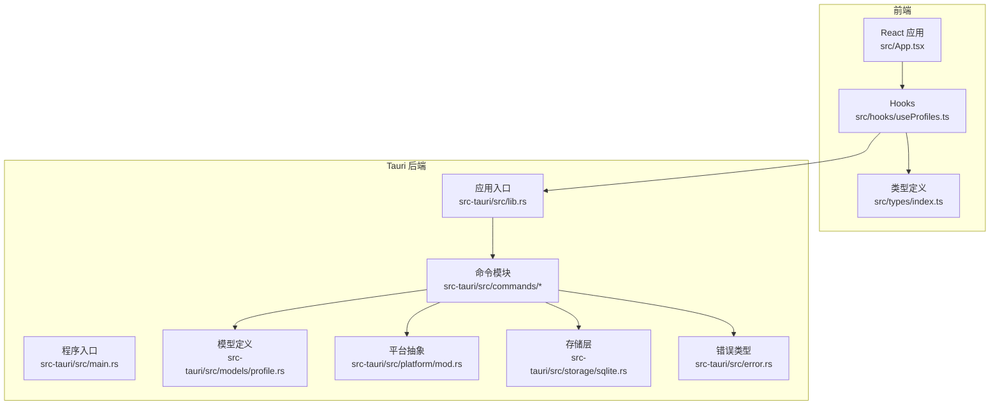
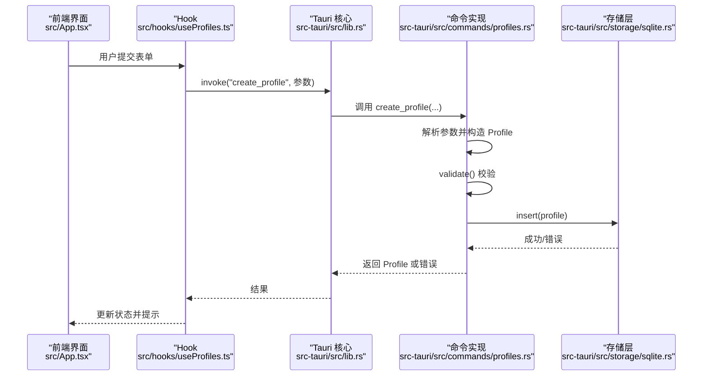
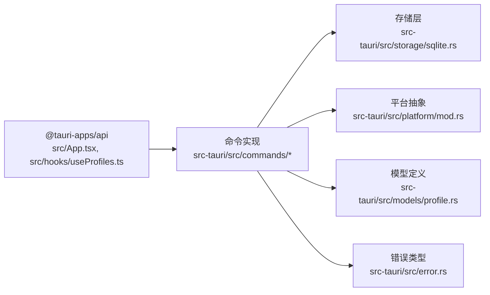

# API参考

<cite>
**本文引用的文件**
- [src-tauri/src/lib.rs](file://src-tauri/src/lib.rs)
- [src-tauri/src/main.rs](file://src-tauri/src/main.rs)
- [src-tauri/src/commands/mod.rs](file://src-tauri/src/commands/mod.rs)
- [src-tauri/src/commands/profiles.rs](file://src-tauri/src/commands/profiles.rs)
- [src-tauri/src/commands/interfaces.rs](file://src-tauri/src/commands/interfaces.rs)
- [src-tauri/src/commands/network.rs](file://src-tauri/src/commands/network.rs)
- [src-tauri/src/models/profile.rs](file://src-tauri/src/models/profile.rs)
- [src-tauri/src/platform/mod.rs](file://src-tauri/src/platform/mod.rs)
- [src-tauri/src/storage/sqlite.rs](file://src-tauri/src/storage/sqlite.rs)
- [src-tauri/src/error.rs](file://src-tauri/src/error.rs)
- [src/types/index.ts](file://src/types/index.ts)
- [src/hooks/useProfiles.ts](file://src/hooks/useProfiles.ts)
- [src/App.tsx](file://src/App.tsx)
- [package.json](file://package.json)
- [Cargo.toml](file://src-tauri/Cargo.toml)
</cite>

## 目录
1. [简介](#简介)
2. [项目结构](#项目结构)
3. [核心组件](#核心组件)
4. [架构总览](#架构总览)
5. [详细组件分析](#详细组件分析)
6. [依赖关系分析](#依赖关系分析)
7. [性能考量](#性能考量)
8. [故障排查指南](#故障排查指南)
9. [结论](#结论)
10. [附录](#附录)

## 简介
本文件为 IPSwitcher 项目的完整 API 参考文档，覆盖 Tauri 命令接口、前端 IPC 调用方式、数据传输格式与错误处理机制。文档面向开发者，提供类型定义、接口规范、使用示例以及版本管理与兼容性说明，帮助快速理解并正确使用所有公开 API。

## 项目结构
IPSwitcher 采用前后端分离架构：前端基于 React + TypeScript，通过 @tauri-apps/api 进行 IPC 调用；后端基于 Tauri v2 + Rust，通过命令模块暴露能力，并使用 SQLite 存储配置方案。

**图表来源**
- [src-tauri/src/lib.rs:12-48](file://src-tauri/src/lib.rs#L12-L48)
- [src-tauri/src/main.rs:4-6](file://src-tauri/src/main.rs#L4-L6)
- [src-tauri/src/commands/mod.rs:1-4](file://src-tauri/src/commands/mod.rs#L1-L4)
- [src-tauri/src/storage/sqlite.rs:8-27](file://src-tauri/src/storage/sqlite.rs#L8-L27)
- [src-tauri/src/platform/mod.rs:12-32](file://src-tauri/src/platform/mod.rs#L12-L32)
- [src-tauri/src/models/profile.rs:20-32](file://src-tauri/src/models/profile.rs#L20-L32)
- [src-tauri/src/error.rs:3-28](file://src-tauri/src/error.rs#L3-L28)

**章节来源**
- [src-tauri/src/lib.rs:12-48](file://src-tauri/src/lib.rs#L12-L48)
- [src-tauri/src/main.rs:4-6](file://src-tauri/src/main.rs#L4-L6)
- [src-tauri/src/commands/mod.rs:1-4](file://src-tauri/src/commands/mod.rs#L1-L4)

## 核心组件
- 命令注册与入口
  - 后端在应用启动时注册所有命令，统一通过生成的处理器分发调用。
- 数据模型
  - Profile：网络配置方案，包含名称、IP 模式（手动/DHCP）、IP 地址、子网掩码、网关、DNS、接口名及时间戳。
  - NetworkInterface：网络接口信息（名称、显示名、是否活动）。
  - CurrentNetworkConfig：当前网络配置（接口、IP、掩码、网关、DNS、是否 DHCP）。
- 存储层
  - 使用 SQLite 存储 Profile，支持增删改查与唯一约束校验。
- 平台抽象
  - 定义 NetworkManager trait，跨平台实现（macOS/Windows），负责接口枚举、当前配置查询、静态配置应用与 DHCP 设置。
- 错误处理
  - 统一的 AppError 枚举，序列化为字符串，便于前端消费。

**章节来源**
- [src-tauri/src/lib.rs:35-45](file://src-tauri/src/lib.rs#L35-L45)
- [src-tauri/src/models/profile.rs:20-81](file://src-tauri/src/models/profile.rs#L20-L81)
- [src-tauri/src/platform/mod.rs:5-42](file://src-tauri/src/platform/mod.rs#L5-L42)
- [src-tauri/src/storage/sqlite.rs:53-74](file://src-tauri/src/storage/sqlite.rs#L53-L74)
- [src-tauri/src/error.rs:3-28](file://src-tauri/src/error.rs#L3-L28)

## 架构总览
以下序列图展示前端调用后端命令的典型流程（以“创建配置方案”为例）：

**图表来源**
- [src/hooks/useProfiles.ts:23-53](file://src/hooks/useProfiles.ts#L23-L53)
- [src-tauri/src/commands/profiles.rs:24-61](file://src-tauri/src/commands/profiles.rs#L24-L61)
- [src-tauri/src/storage/sqlite.rs:146-182](file://src-tauri/src/storage/sqlite.rs#L146-L182)

## 详细组件分析

### 命令接口总览
- 命令注册位置：应用启动时集中注册，便于维护与扩展。
- 前端调用方式：通过 @tauri-apps/api 的 invoke 方法，按命令名传递参数，接收结果或异常。

**章节来源**
- [src-tauri/src/lib.rs:35-45](file://src-tauri/src/lib.rs#L35-L45)
- [src/hooks/useProfiles.ts:14](file://src/hooks/useProfiles.ts#L14)

### 配置方案命令（Profiles）
- 列出方案
  - 命令名：list_profiles
  - 参数：无
  - 返回：Profile 数组
  - 错误：数据库访问异常
- 获取方案
  - 命令名：get_profile
  - 参数：id: string
  - 返回：Profile
  - 错误：未找到、数据库异常
- 创建方案
  - 命令名：create_profile
  - 参数：
    - name: string
    - ipMode: "Manual"|"Dhcp"
    - ipAddress: string?
    - subnetMask: string?
    - gateway: string?
    - dnsServers: string[]
    - interfaceName: string?
  - 返回：Profile
  - 校验规则：
    - 名称非空且长度不超过 64
    - 手动模式：必须提供 IP、掩码、网关，DNS 至少一个，均为合法 IPv4
    - DHCP 模式：不可设置 IP、掩码、网关
  - 错误：验证失败、重复名称、数据库异常
- 更新方案
  - 命令名：update_profile
  - 参数：同创建，但需提供 id
  - 返回：Profile
  - 校验：同创建
  - 错误：验证失败、重复名称、未找到、数据库异常
- 删除方案
  - 命令名：delete_profile
  - 参数：id: string
  - 返回：无
  - 错误：未找到、数据库异常

**章节来源**
- [src-tauri/src/commands/profiles.rs:9-113](file://src-tauri/src/commands/profiles.rs#L9-L113)
- [src-tauri/src/models/profile.rs:34-81](file://src-tauri/src/models/profile.rs#L34-L81)
- [src-tauri/src/storage/sqlite.rs:146-232](file://src-tauri/src/storage/sqlite.rs#L146-L232)

### 网络接口命令（Interfaces）
- 列出网络接口
  - 命令名：list_network_interfaces
  - 参数：无
  - 返回：NetworkInterface 数组
  - 错误：平台相关网络操作失败

**章节来源**
- [src-tauri/src/commands/interfaces.rs:4-7](file://src-tauri/src/commands/interfaces.rs#L4-L7)
- [src-tauri/src/platform/mod.rs:5-10](file://src-tauri/src/platform/mod.rs#L5-L10)

### 网络配置命令（Network）
- 获取当前网络配置
  - 命令名：get_current_network_config
  - 参数：interface?: string
  - 行为：若未指定接口，则优先选择活动接口，否则选择首个接口
  - 返回：CurrentNetworkConfig
  - 错误：未找到可用接口、平台相关网络操作失败
- 应用配置方案
  - 命令名：apply_profile
  - 参数：profileId: string, interface?: string
  - 行为：
    - 若为手动模式：校验并要求提供 IP、掩码、网关；如无管理员权限则提升权限执行；成功后返回人类可读消息
    - 若为 DHCP 模式：如无管理员权限则提升权限执行；成功后返回人类可读消息
  - 返回：string（操作结果消息）
  - 错误：参数缺失、权限不足、平台相关网络操作失败
- 检查管理员状态
  - 命令名：check_admin_status
  - 参数：无
  - 返回：boolean

**章节来源**
- [src-tauri/src/commands/network.rs:9-101](file://src-tauri/src/commands/network.rs#L9-L101)
- [src-tauri/src/platform/mod.rs:34-42](file://src-tauri/src/platform/mod.rs#L34-L42)

### 类型定义与数据模型
- Profile
  - 字段：id, name, ip_mode, ip_address, subnet_mask, gateway, dns_servers, interface_name, created_at, updated_at
  - ip_mode：枚举 "manual" | "dhcp"
- NetworkInterface
  - 字段：name, display_name, is_active
- CurrentNetworkConfig
  - 字段：interface, ip_address, subnet_mask, gateway, dns_servers, is_dhcp
- IpMode（Rust）
  - 枚举：Manual, Dhcp

**章节来源**
- [src/types/index.ts:1-30](file://src/types/index.ts#L1-L30)
- [src-tauri/src/models/profile.rs:4-18](file://src-tauri/src/models/profile.rs#L4-L18)
- [src-tauri/src/platform/mod.rs:5-42](file://src-tauri/src/platform/mod.rs#L5-L42)

### 前端调用示例与最佳实践
- 使用 useProfiles Hook
  - 列表：invoke("list_profiles") 返回 Profile[]
  - 创建：invoke("create_profile", { ipMode, ... }) 返回 Profile
  - 更新：invoke("update_profile", { id, ipMode, ... }) 返回 Profile
  - 删除：invoke("delete_profile", { id })
- 错误处理
  - 建议捕获异常并显示用户可读消息；可在 Hook 内部统一处理并抛出 Error
- 状态管理
  - 使用 useState/Reducer 管理加载、错误与数据列表

**章节来源**
- [src/hooks/useProfiles.ts:10-117](file://src/hooks/useProfiles.ts#L10-L117)
- [src/App.tsx:47-113](file://src/App.tsx#L47-L113)

### 错误处理机制
- Rust 层错误类型 AppError
  - 包含数据库、IO、序列化、验证、未找到、重复名称、网络、权限不足等
  - 实现序列化为字符串，便于跨边界传递
- 前端消费
  - 将异常转换为字符串并显示给用户
  - 对于重复名称、验证失败等业务错误，应给出明确提示

**章节来源**
- [src-tauri/src/error.rs:3-38](file://src-tauri/src/error.rs#L3-L38)
- [src/hooks/useProfiles.ts:16-49](file://src/hooks/useProfiles.ts#L16-L49)

## 依赖关系分析
- 前端依赖
  - @tauri-apps/api：IPC 调用 invoke、事件监听 listen
  - @tauri-apps/plugin-shell：系统打开器（用于外部工具）
- 后端依赖
  - tauri、tauri-plugin-shell、tauri-plugin-opener：框架与插件
  - serde/serde_json：序列化
  - rusqlite：SQLite 访问
  - uuid、chrono：标识与时间
  - log/env_logger：日志
  - thiserror：错误派生
  - regex：正则（用于平台实现）

**图表来源**
- [src-tauri/src/commands/profiles.rs:1-113](file://src-tauri/src/commands/profiles.rs#L1-L113)
- [src-tauri/src/storage/sqlite.rs:1-256](file://src-tauri/src/storage/sqlite.rs#L1-L256)
- [src-tauri/src/platform/mod.rs:1-64](file://src-tauri/src/platform/mod.rs#L1-L64)
- [src-tauri/src/models/profile.rs:1-88](file://src-tauri/src/models/profile.rs#L1-L88)
- [src-tauri/src/error.rs:1-38](file://src-tauri/src/error.rs#L1-L38)

**章节来源**
- [package.json:12-25](file://package.json#L12-L25)
- [Cargo.toml:12-30](file://src-tauri/Cargo.toml#L12-L30)

## 性能考量
- 数据库访问
  - 使用连接池包装的 Mutex 访问 SQLite，避免并发冲突；建议批量操作时合并事务以减少锁竞争。
- 序列化
  - Profile 的 DNS 列表以 JSON 字符串存储，读取时反序列化；注意字段长度与数组大小对性能的影响。
- 网络操作
  - 静态配置应用与 DHCP 设置涉及系统调用，建议在 UI 中提供进度反馈与取消机制（如可行）。
- 前端渲染
  - 列表数据量较大时，建议使用虚拟滚动与懒加载策略。

## 故障排查指南
- 常见错误与定位
  - 验证失败：检查 ip_mode 与必填字段是否匹配；确认 IPv4 格式正确。
  - 未找到：确认 id 是否有效；检查数据库中是否存在。
  - 重复名称：修改名称或删除同名条目。
  - 权限不足：调用 check_admin_status 检查状态；必要时触发提升权限流程。
  - 网络接口不可用：调用 list_network_interfaces 获取可用接口；确保目标接口处于活动状态。
- 日志与调试
  - 后端启用 env_logger；前端在开发环境打印错误堆栈。
- 前端错误处理
  - 在 Hook 中统一捕获异常并设置错误状态；在 UI 中展示友好提示。

**章节来源**
- [src-tauri/src/error.rs:3-28](file://src-tauri/src/error.rs#L3-L28)
- [src-tauri/src/commands/network.rs:97-101](file://src-tauri/src/commands/network.rs#L97-L101)
- [src-tauri/src/commands/interfaces.rs:4-7](file://src-tauri/src/commands/interfaces.rs#L4-L7)

## 结论
本 API 参考文档梳理了 IPSwitcher 的全部 Tauri 命令接口、数据模型与错误处理机制。通过统一的命令注册、清晰的类型定义与完善的校验逻辑，开发者可以稳定地扩展功能并保持前后端一致性。建议在新增接口时遵循现有模式，确保错误类型统一、参数命名一致与返回格式标准化。

## 附录

### API 版本管理与兼容性
- 版本号
  - 前端与后端均使用 1.0.0，当前版本为初始发布版。
- 兼容性策略
  - 命令名与参数保持稳定；新增字段建议作为可选参数，避免破坏既有调用。
  - 返回值结构变更需谨慎，建议引入版本字段或前缀区分。
- 废弃接口
  - 当前仓库未发现已标记为废弃的接口；未来若有变更，将在版本说明中明确标注迁移路径。

**章节来源**
- [package.json:4](file://package.json#L4)
- [Cargo.toml:3](file://src-tauri/Cargo.toml#L3)

### 命令清单与签名摘要
- Profiles
  - list_profiles(): Result<Vec<Profile>, AppError>
  - get_profile(id): Result<Profile, AppError>
  - create_profile(name, ipMode, ipAddress?, subnetMask?, gateway?, dnsServers, interfaceName?): Result<Profile, AppError>
  - update_profile(id, name, ipMode, ipAddress?, subnetMask?, gateway?, dnsServers, interfaceName?): Result<Profile, AppError>
  - delete_profile(id): Result<(), AppError>
- Interfaces
  - list_network_interfaces(): Result<Vec<NetworkInterface>, AppError>
- Network
  - get_current_network_config(interface?): Result<CurrentNetworkConfig, AppError>
  - apply_profile(profileId, interface?): Result<string, AppError>
  - check_admin_status(): Result<bool, AppError>

**章节来源**
- [src-tauri/src/commands/profiles.rs:9-113](file://src-tauri/src/commands/profiles.rs#L9-L113)
- [src-tauri/src/commands/interfaces.rs:4-7](file://src-tauri/src/commands/interfaces.rs#L4-L7)
- [src-tauri/src/commands/network.rs:9-101](file://src-tauri/src/commands/network.rs#L9-L101)