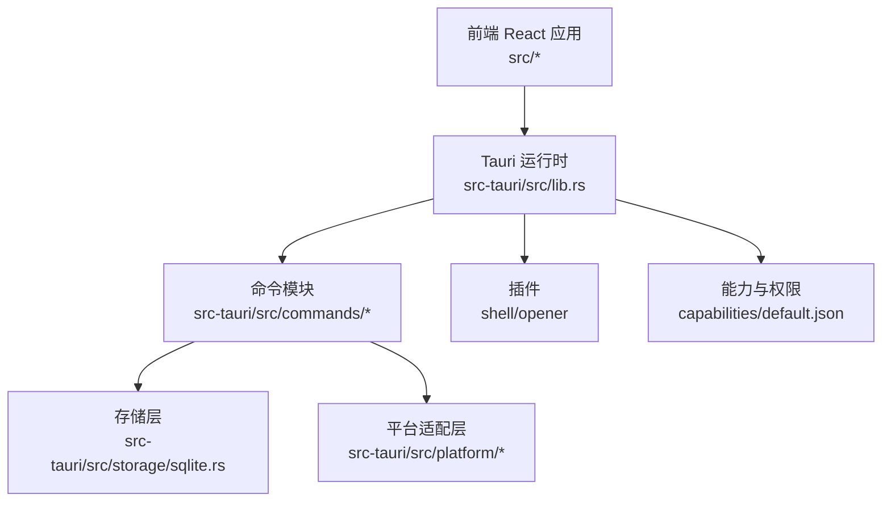
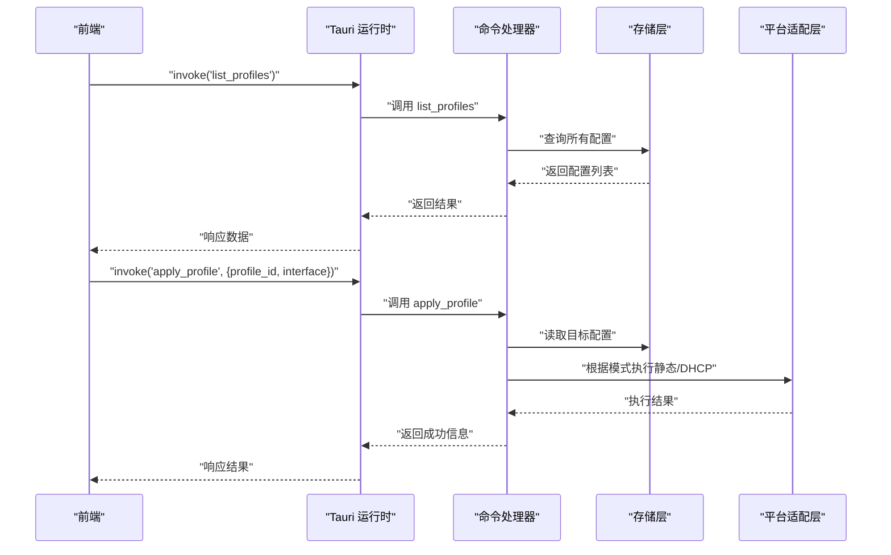
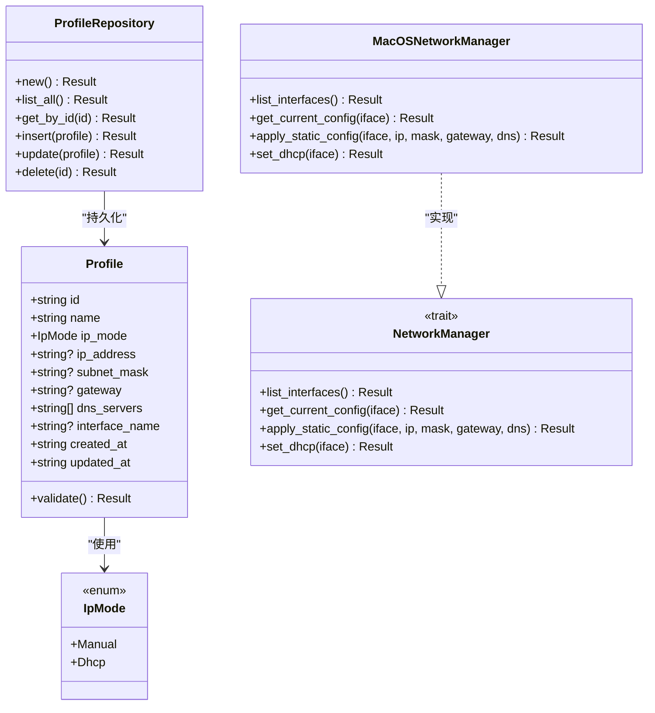
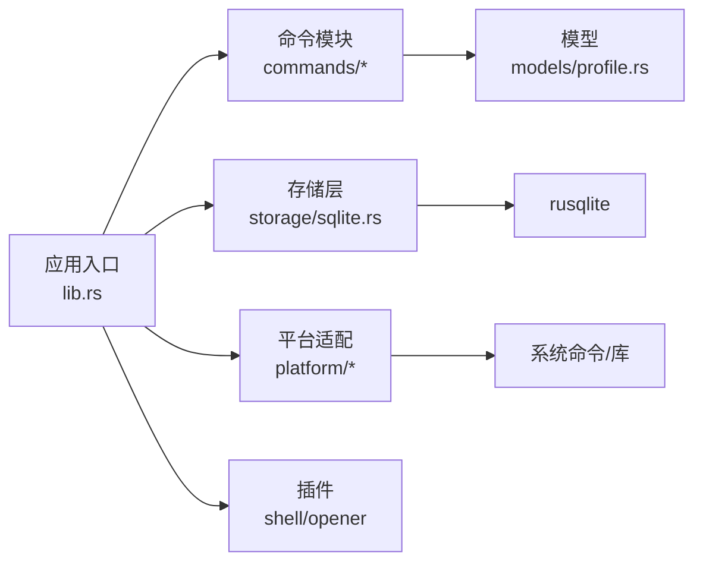

# IPC通信

<cite>
**本文引用的文件**
- [src-tauri/src/main.rs](file://src-tauri/src/main.rs)
- [src-tauri/src/lib.rs](file://src-tauri/src/lib.rs)
- [src-tauri/Cargo.toml](file://src-tauri/Cargo.toml)
- [src-tauri/tauri.conf.json](file://src-tauri/tauri.conf.json)
- [src-tauri/capabilities/default.json](file://src-tauri/capabilities/default.json)
- [src-tauri/src/commands/mod.rs](file://src-tauri/src/commands/mod.rs)
- [src-tauri/src/commands/profiles.rs](file://src-tauri/src/commands/profiles.rs)
- [src-tauri/src/commands/interfaces.rs](file://src-tauri/src/commands/interfaces.rs)
- [src-tauri/src/commands/network.rs](file://src-tauri/src/commands/network.rs)
- [src-tauri/src/models/profile.rs](file://src-tauri/src/models/profile.rs)
- [src-tauri/src/models/mod.rs](file://src-tauri/src/models/mod.rs)
- [src-tauri/src/platform/mod.rs](file://src-tauri/src/platform/mod.rs)
- [src-tauri/src/platform/macos.rs](file://src-tauri/src/platform/macos.rs)
- [src-tauri/src/storage/sqlite.rs](file://src-tauri/src/storage/sqlite.rs)
- [src-tauri/src/error.rs](file://src-tauri/src/error.rs)
</cite>

## 目录
1. [简介](#简介)
2. [项目结构](#项目结构)
3. [核心组件](#核心组件)
4. [架构总览](#架构总览)
5. [详细组件分析](#详细组件分析)
6. [依赖关系分析](#依赖关系分析)
7. [性能考虑](#性能考虑)
8. [故障排查指南](#故障排查指南)
9. [结论](#结论)
10. [附录](#附录)

## 简介
本文件系统性阐述前端 React 应用与后端 Rust 服务之间的 IPC（进程间通信）机制，重点覆盖以下方面：
- IPC 消息格式与调用协议
- 权限控制与安全机制
- 完整的 IPC 调用示例与错误处理策略
- capabilities 配置、权限声明与访问控制规则
- 性能优化、并发处理与连接管理最佳实践

该系统基于 Tauri v2 构建，前端通过 Tauri 的 invoke 通道向后端 Rust 命令发送请求，后端通过命令处理器执行业务逻辑并返回结果；同时通过 capabilities 与插件进行权限管控。

## 项目结构
前端位于 src 目录，打包产物 dist 由 Tauri 在构建时注入；后端 Rust 代码位于 src-tauri，使用 Tauri Builder 注册命令、插件与状态对象，统一在 lib.rs 中启动应用。

图表来源
- [src-tauri/src/lib.rs:19-49](file://src-tauri/src/lib.rs#L19-L49)
- [src-tauri/src/commands/mod.rs:1-4](file://src-tauri/src/commands/mod.rs#L1-L4)
- [src-tauri/src/storage/sqlite.rs:1-256](file://src-tauri/src/storage/sqlite.rs#L1-L256)
- [src-tauri/src/platform/mod.rs:1-64](file://src-tauri/src/platform/mod.rs#L1-L64)
- [src-tauri/capabilities/default.json:1-13](file://src-tauri/capabilities/default.json#L1-L13)

章节来源
- [src-tauri/src/main.rs:1-7](file://src-tauri/src/main.rs#L1-L7)
- [src-tauri/src/lib.rs:14-50](file://src-tauri/src/lib.rs#L14-L50)
- [src-tauri/tauri.conf.json:1-48](file://src-tauri/tauri.conf.json#L1-L48)

## 核心组件
- 启动入口：main.rs 负责在发布版本隐藏控制台窗口，并调用 lib.rs 的 run 函数启动应用。
- 应用构建器：lib.rs 初始化日志、数据库仓库、注册插件与命令处理器，设置托盘与窗口事件。
- 命令模块：commands/profiles.rs、commands/interfaces.rs、commands/network.rs 提供 IPC 命令。
- 数据模型：models/profile.rs 定义配置方案的数据结构与校验规则。
- 平台适配：platform/mod.rs 抽象网络管理接口，macos.rs 实现 macOS 下的具体命令。
- 存储层：storage/sqlite.rs 使用 rusqlite 提供 CRUD 操作与迁移。
- 错误体系：error.rs 统一错误类型与序列化，便于前端接收。

章节来源
- [src-tauri/src/main.rs:4-7](file://src-tauri/src/main.rs#L4-L7)
- [src-tauri/src/lib.rs:14-50](file://src-tauri/src/lib.rs#L14-L50)
- [src-tauri/src/commands/profiles.rs:1-113](file://src-tauri/src/commands/profiles.rs#L1-L113)
- [src-tauri/src/commands/interfaces.rs:1-8](file://src-tauri/src/commands/interfaces.rs#L1-L8)
- [src-tauri/src/commands/network.rs:1-101](file://src-tauri/src/commands/network.rs#L1-L101)
- [src-tauri/src/models/profile.rs:1-88](file://src-tauri/src/models/profile.rs#L1-L88)
- [src-tauri/src/platform/mod.rs:1-64](file://src-tauri/src/platform/mod.rs#L1-L64)
- [src-tauri/src/storage/sqlite.rs:1-256](file://src-tauri/src/storage/sqlite.rs#L1-L256)
- [src-tauri/src/error.rs:1-38](file://src-tauri/src/error.rs#L1-L38)

## 架构总览
IPC 调用链路从前端发起，经 Tauri invoke 到达后端命令处理器，命令处理器读取状态或调用平台适配层，最终通过存储层持久化或执行系统命令，返回结构化结果。

图表来源
- [src-tauri/src/lib.rs:37-47](file://src-tauri/src/lib.rs#L37-L47)
- [src-tauri/src/commands/profiles.rs:9-14](file://src-tauri/src/commands/profiles.rs#L9-L14)
- [src-tauri/src/commands/network.rs:28-95](file://src-tauri/src/commands/network.rs#L28-L95)
- [src-tauri/src/storage/sqlite.rs:76-108](file://src-tauri/src/storage/sqlite.rs#L76-L108)
- [src-tauri/src/platform/macos.rs:112-151](file://src-tauri/src/platform/macos.rs#L112-L151)

## 详细组件分析

### 命令与消息格式
- 命令注册：lib.rs 通过 generate_handler 将命令集中注册，前端以字符串命令名调用。
- 请求参数：命令函数签名即为参数定义，如 apply_profile 接收 profile_id 与可选 interface。
- 返回值：命令返回 Result<T, AppError>，其中 T 为序列化后的数据结构，AppError 实现序列化以便跨进程传输。
- 数据模型：Profile 结构体包含 id、name、ip_mode、ip_address、subnet_mask、gateway、dns_servers、interface_name、created_at、updated_at；IpMode 支持 Manual 与 Dhcp。

章节来源
- [src-tauri/src/lib.rs:37-47](file://src-tauri/src/lib.rs#L37-L47)
- [src-tauri/src/commands/profiles.rs:9-113](file://src-tauri/src/commands/profiles.rs#L9-L113)
- [src-tauri/src/commands/network.rs:1-101](file://src-tauri/src/commands/network.rs#L1-L101)
- [src-tauri/src/models/profile.rs:20-32](file://src-tauri/src/models/profile.rs#L20-L32)

### 权限控制与安全机制
- capabilities 配置：default.json 声明窗口、权限集合，包含 core:default、shell:allow-execute、shell:allow-open、opener:default。
- 插件权限：Cargo.toml 引入 tauri-plugin-shell 与 tauri-plugin-opener，分别用于系统命令执行与打开外部资源。
- 管理员权限：network 命令在需要系统级变更时检查是否已提权，若未提权则触发提升流程后再执行。
- CSP：tauri.conf.json 中将 CSP 设为 null，前端可直接加载本地构建资源。

章节来源
- [src-tauri/capabilities/default.json:1-13](file://src-tauri/capabilities/default.json#L1-L13)
- [src-tauri/Cargo.toml:12-24](file://src-tauri/Cargo.toml#L12-L24)
- [src-tauri/tauri.conf.json:30-32](file://src-tauri/tauri.conf.json#L30-L32)
- [src-tauri/src/commands/network.rs:53-88](file://src-tauri/src/commands/network.rs#L53-L88)

### IPC 调用示例与错误处理
- 列出配置：前端调用 list_profiles，后端返回 Profile 数组；失败时返回 AppError 字符串。
- 获取单个配置：get_profile(id) 读取指定 id 的配置，不存在时返回 NotFound。
- 创建/更新配置：create_profile/update_profile 内置字段长度与格式校验，非法输入返回 Validation。
- 应用配置：apply_profile 根据 IpMode 执行静态或 DHCP 设置；未提权时触发管理员提升流程。
- 网络接口：list_network_interfaces 返回当前可用网络接口列表。
- 错误处理：AppError 实现序列化，前端可直接解析为字符串错误信息。

章节来源
- [src-tauri/src/commands/profiles.rs:9-113](file://src-tauri/src/commands/profiles.rs#L9-L113)
- [src-tauri/src/commands/interfaces.rs:4-7](file://src-tauri/src/commands/interfaces.rs#L4-L7)
- [src-tauri/src/commands/network.rs:9-101](file://src-tauri/src/commands/network.rs#L9-L101)
- [src-tauri/src/error.rs:30-37](file://src-tauri/src/error.rs#L30-L37)

### 平台适配与系统命令
- 抽象接口：NetworkManager 定义 list_interfaces、get_current_config、apply_static_config、set_dhcp。
- macOS 实现：通过 networksetup 命令列举服务、读取信息、设置静态/DHCP 与 DNS。
- 错误传播：平台命令失败时返回 Network 类型错误，包含具体提示信息。

章节来源
- [src-tauri/src/platform/mod.rs:12-32](file://src-tauri/src/platform/mod.rs#L12-L32)
- [src-tauri/src/platform/macos.rs:8-175](file://src-tauri/src/platform/macos.rs#L8-L175)

### 存储层与数据一致性
- 数据库初始化：ProfileRepository::new 创建目录与数据库文件，执行迁移创建 profiles 表。
- 并发控制：使用 Mutex 包裹 rusqlite 连接，避免并发写冲突。
- CRUD 操作：支持全量查询、按 id 查询、插入、更新、删除；重复名称与约束冲突转换为 AppError::DuplicateName 或 NotFound。
- JSON 字段：dns_servers 以 JSON 字符串存储，读取时反序列化为数组。

章节来源
- [src-tauri/src/storage/sqlite.rs:12-74](file://src-tauri/src/storage/sqlite.rs#L12-L74)
- [src-tauri/src/storage/sqlite.rs:146-232](file://src-tauri/src/storage/sqlite.rs#L146-L232)

### 类图：命令与模型关系

图表来源
- [src-tauri/src/models/profile.rs:20-88](file://src-tauri/src/models/profile.rs#L20-L88)
- [src-tauri/src/storage/sqlite.rs:8-27](file://src-tauri/src/storage/sqlite.rs#L8-L27)
- [src-tauri/src/platform/mod.rs:12-32](file://src-tauri/src/platform/mod.rs#L12-L32)
- [src-tauri/src/platform/macos.rs:6-175](file://src-tauri/src/platform/macos.rs#L6-L175)

## 依赖关系分析
- 外部依赖：tauri、tauri-plugin-shell、tauri-plugin-opener、serde、serde_json、rusqlite、uuid、chrono、log、env_logger、thiserror、regex。
- 平台特定依赖：macOS 使用 libc、objc2；Windows 无额外依赖。
- 构建与打包：tauri.conf.json 指定前端构建目录与开发服务器，bundle targets 为 all。

图表来源
- [src-tauri/src/lib.rs:19-49](file://src-tauri/src/lib.rs#L19-L49)
- [src-tauri/Cargo.toml:12-31](file://src-tauri/Cargo.toml#L12-L31)
- [src-tauri/src/storage/sqlite.rs:1-6](file://src-tauri/src/storage/sqlite.rs#L1-L6)
- [src-tauri/src/platform/mod.rs:44-63](file://src-tauri/src/platform/mod.rs#L44-L63)

章节来源
- [src-tauri/Cargo.toml:1-31](file://src-tauri/Cargo.toml#L1-L31)
- [src-tauri/tauri.conf.json:6-11](file://src-tauri/tauri.conf.json#L6-L11)

## 性能考虑
- 并发与锁：存储层使用 Mutex 保护连接，建议在命令内部尽量缩短持有时间，避免长时间阻塞；对只读查询可考虑拆分读写路径。
- 序列化开销：Profile 中的 dns_servers 以 JSON 字符串存储，读取时反序列化；对于频繁读取场景可评估缓存策略。
- 系统命令调用：平台层通过 spawn 子进程执行 networksetup，建议合并多次调用（如先设置静态再设置 DNS），减少进程开销。
- 插件与权限：仅启用必要插件与权限，降低运行时开销与攻击面。
- 日志：生产环境谨慎使用高频日志，避免影响 IPC 响应时间。

## 故障排查指南
- 前端调用失败：检查命令名是否与后端注册一致；确认 capabilities 是否授予 shell/opener 权限。
- 数据库异常：查看 AppError::Database；检查数据库路径与权限；确认 migrations 成功执行。
- 网络接口不可用：确认 list_network_interfaces 返回非空；检查平台命令输出与权限。
- 管理员权限不足：apply_profile 在未提权时会触发提升流程；确保用户确认提升并具备相应权限。
- 错误信息解析：AppError 实现序列化，前端可直接接收字符串错误描述进行展示与上报。

章节来源
- [src-tauri/src/error.rs:3-28](file://src-tauri/src/error.rs#L3-L28)
- [src-tauri/src/commands/network.rs:53-88](file://src-tauri/src/commands/network.rs#L53-L88)
- [src-tauri/src/platform/macos.rs:14-20](file://src-tauri/src/platform/macos.rs#L14-L20)

## 结论
本系统通过 Tauri v2 的 invoke 通道实现了前后端稳定的 IPC 通信，结合 capabilities 与插件权限控制、统一的错误模型与平台适配层，提供了跨平台的网络配置管理能力。建议在生产环境中进一步完善并发控制、系统命令合并与日志策略，以获得更优的性能与稳定性。

## 附录

### IPC 命令清单与参数
- list_profiles
  - 输入：无
  - 输出：Profile 数组
- get_profile(id)
  - 输入：id: string
  - 输出：Profile
- create_profile(name, ip_mode, ip_address?, subnet_mask?, gateway?, dns_servers[], interface_name?)
  - 输入：同上
  - 输出：Profile
- update_profile(id, name, ip_mode, ip_address?, subnet_mask?, gateway?, dns_servers[], interface_name?)
  - 输入：同上
  - 输出：Profile
- delete_profile(id)
  - 输入：id: string
  - 输出：无
- list_network_interfaces
  - 输入：无
  - 输出：NetworkInterface 数组
- get_current_network_config(interface?)
  - 输入：interface?: string
  - 输出：CurrentNetworkConfig
- apply_profile(profile_id, interface?)
  - 输入：profile_id: string, interface?: string
  - 输出：string（结果消息）
- check_admin_status
  - 输入：无
  - 输出：boolean

章节来源
- [src-tauri/src/commands/profiles.rs:9-113](file://src-tauri/src/commands/profiles.rs#L9-L113)
- [src-tauri/src/commands/interfaces.rs:4-7](file://src-tauri/src/commands/interfaces.rs#L4-L7)
- [src-tauri/src/commands/network.rs:9-101](file://src-tauri/src/commands/network.rs#L9-L101)