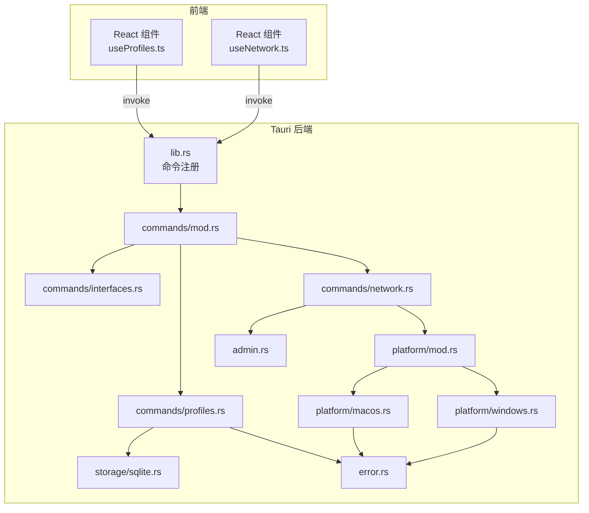
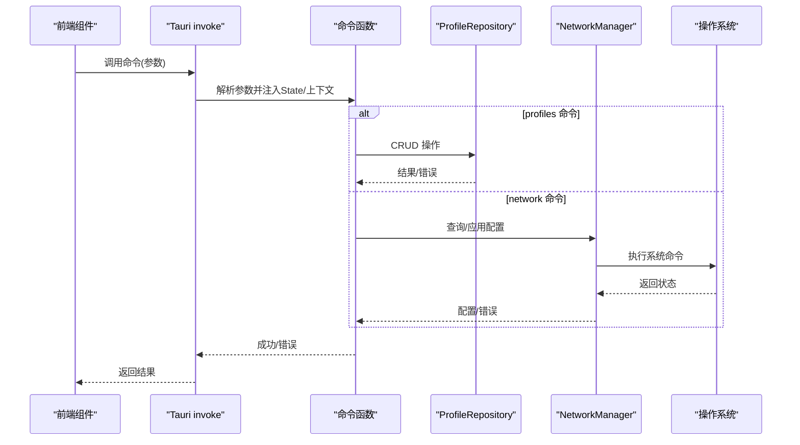
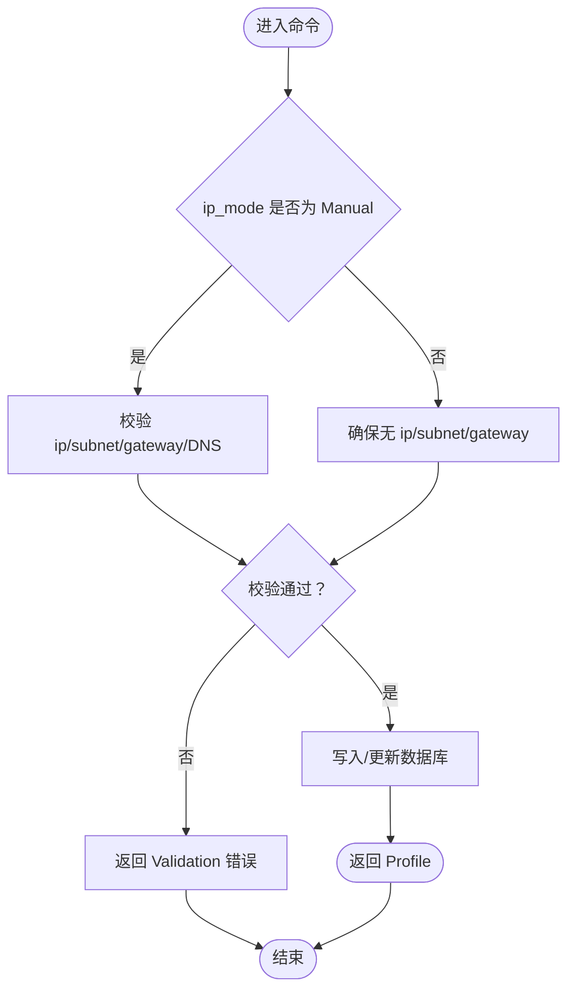
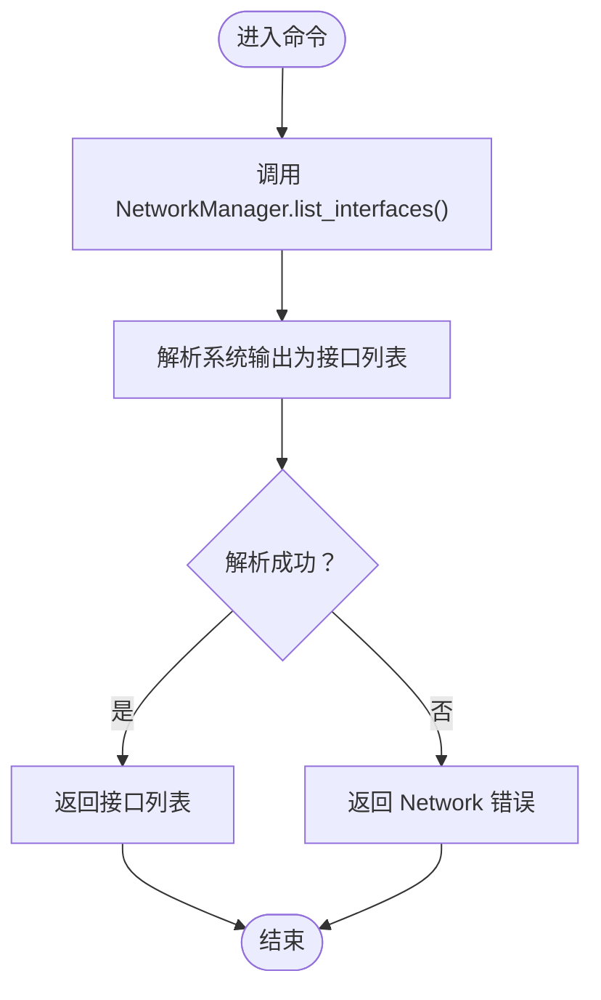
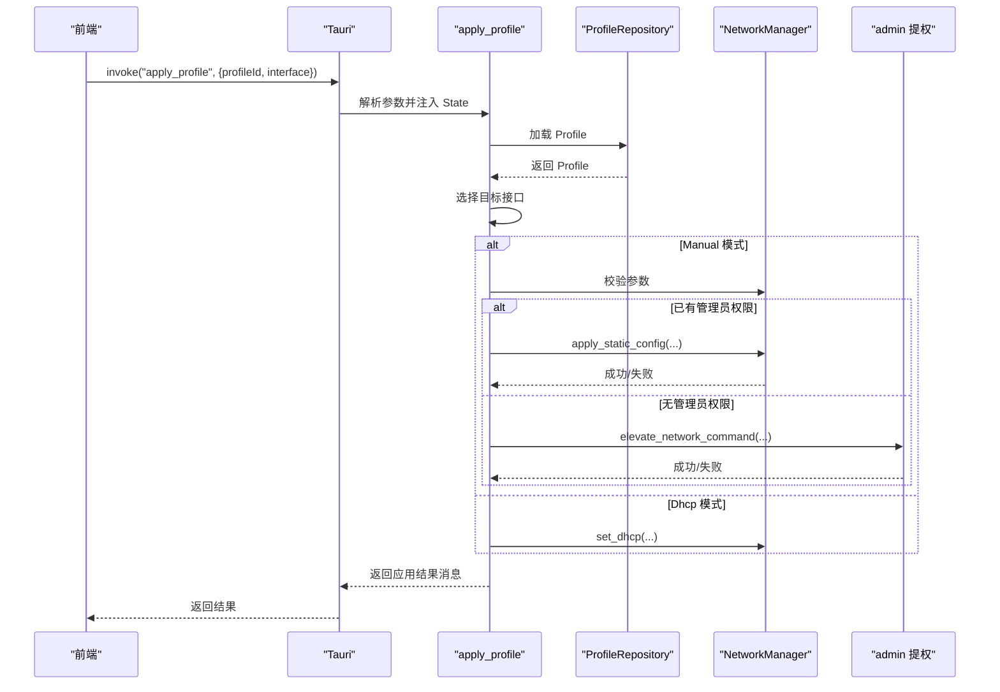
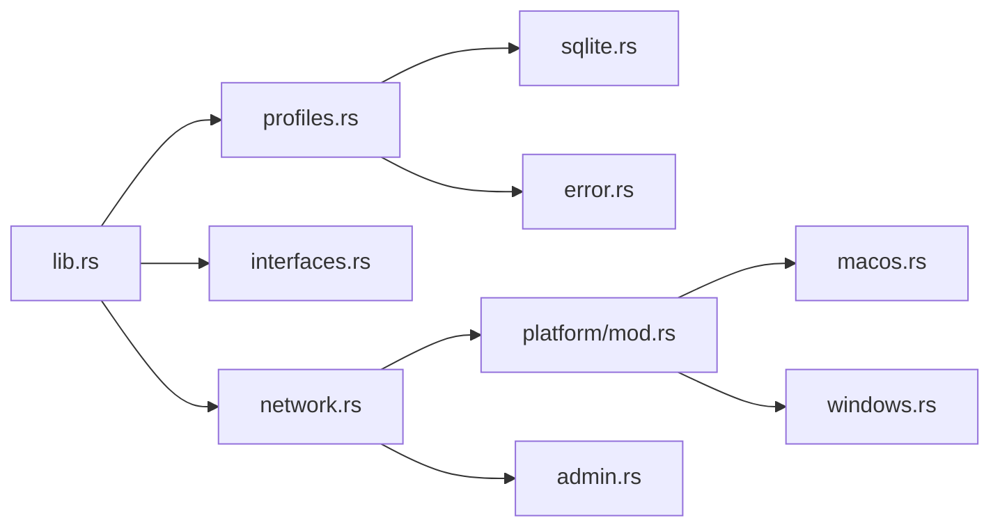

# 命令接口

<cite>
**本文引用的文件**
- [src-tauri/src/lib.rs](file://src-tauri/src/lib.rs)
- [src-tauri/src/commands/mod.rs](file://src-tauri/src/commands/mod.rs)
- [src-tauri/src/commands/profiles.rs](file://src-tauri/src/commands/profiles.rs)
- [src-tauri/src/commands/interfaces.rs](file://src-tauri/src/commands/interfaces.rs)
- [src-tauri/src/commands/network.rs](file://src-tauri/src/commands/network.rs)
- [src-tauri/src/models/profile.rs](file://src-tauri/src/models/profile.rs)
- [src-tauri/src/storage/sqlite.rs](file://src-tauri/src/storage/sqlite.rs)
- [src-tauri/src/error.rs](file://src-tauri/src/error.rs)
- [src-tauri/src/platform/mod.rs](file://src-tauri/src/platform/mod.rs)
- [src-tauri/src/platform/macos.rs](file://src-tauri/src/platform/macos.rs)
- [src-tauri/src/platform/windows.rs](file://src-tauri/src/platform/windows.rs)
- [src-tauri/src/admin.rs](file://src-tauri/src/admin.rs)
- [src/hooks/useProfiles.ts](file://src/hooks/useProfiles.ts)
- [src/hooks/useNetwork.ts](file://src/hooks/useNetwork.ts)
- [package.json](file://package.json)
</cite>

## 目录
1. [简介](#简介)
2. [项目结构](#项目结构)
3. [核心组件](#核心组件)
4. [架构总览](#架构总览)
5. [详细组件分析](#详细组件分析)
6. [依赖关系分析](#依赖关系分析)
7. [性能考量](#性能考量)
8. [故障排查指南](#故障排查指南)
9. [结论](#结论)
10. [附录](#附录)

## 简介
本文件为 Tauri 应用“IPSwitcher”的命令接口规范文档，覆盖 profiles、interfaces、network 三大模块的全部命令。内容包括：
- 每个命令的函数签名、参数类型、返回值格式与错误处理
- 使用示例、调用方式与典型应用场景
- 执行流程、数据校验规则与异常处理
- 生命周期管理、性能考虑与最佳实践

## 项目结构
后端采用 Rust + Tauri 架构，命令通过 Tauri 的 invoke 注册；前端使用 React + @tauri-apps/api 调用命令。命令注册在应用启动时完成，数据库由 SQLite 提供，平台能力通过 trait 抽象并在 macOS/Windows 下分别实现。

图表来源
- [src-tauri/src/lib.rs:35-45](file://src-tauri/src/lib.rs#L35-L45)
- [src-tauri/src/commands/mod.rs:1-4](file://src-tauri/src/commands/mod.rs#L1-L4)
- [src-tauri/src/commands/profiles.rs:1-113](file://src-tauri/src/commands/profiles.rs#L1-L113)
- [src-tauri/src/commands/interfaces.rs:1-8](file://src-tauri/src/commands/interfaces.rs#L1-L8)
- [src-tauri/src/commands/network.rs:1-101](file://src-tauri/src/commands/network.rs#L1-L101)
- [src-tauri/src/platform/mod.rs:1-64](file://src-tauri/src/platform/mod.rs#L1-L64)
- [src-tauri/src/platform/macos.rs:1-175](file://src-tauri/src/platform/macos.rs#L1-L175)
- [src-tauri/src/platform/windows.rs:1-173](file://src-tauri/src/platform/windows.rs#L1-L173)
- [src-tauri/src/storage/sqlite.rs:1-256](file://src-tauri/src/storage/sqlite.rs#L1-L256)
- [src-tauri/src/error.rs:1-38](file://src-tauri/src/error.rs#L1-L38)
- [src-tauri/src/admin.rs:1-165](file://src-tauri/src/admin.rs#L1-L165)

章节来源
- [src-tauri/src/lib.rs:13-48](file://src-tauri/src/lib.rs#L13-L48)
- [src-tauri/src/commands/mod.rs:1-4](file://src-tauri/src/commands/mod.rs#L1-L4)

## 核心组件
- 命令注册：在应用启动时集中注册所有命令，统一暴露给前端调用。
- 数据模型：Profile（含 IP 模式枚举）、网络接口与当前配置结构体。
- 存储层：SQLite 表 profiles，提供增删改查与迁移。
- 平台抽象：NetworkManager trait 定义跨平台网络能力，macOS/Windows 分别实现。
- 错误体系：AppError 统一错误类型，序列化为字符串返回前端。
- 权限提升：跨平台执行需要管理员权限的网络命令。

章节来源
- [src-tauri/src/lib.rs:35-45](file://src-tauri/src/lib.rs#L35-L45)
- [src-tauri/src/models/profile.rs:1-88](file://src-tauri/src/models/profile.rs#L1-L88)
- [src-tauri/src/storage/sqlite.rs:53-74](file://src-tauri/src/storage/sqlite.rs#L53-L74)
- [src-tauri/src/platform/mod.rs:12-42](file://src-tauri/src/platform/mod.rs#L12-L42)
- [src-tauri/src/error.rs:3-28](file://src-tauri/src/error.rs#L3-L28)

## 架构总览
命令从前端发起，经 Tauri invoke 到后端命令函数，按需访问存储与平台能力，最终返回结果或错误。管理员权限不足时，通过平台特定的提权机制执行。

图表来源
- [src-tauri/src/lib.rs:35-45](file://src-tauri/src/lib.rs#L35-L45)
- [src-tauri/src/commands/profiles.rs:10-113](file://src-tauri/src/commands/profiles.rs#L10-L113)
- [src-tauri/src/commands/network.rs:9-101](file://src-tauri/src/commands/network.rs#L9-L101)
- [src-tauri/src/storage/sqlite.rs:146-232](file://src-tauri/src/storage/sqlite.rs#L146-L232)
- [src-tauri/src/platform/macos.rs:8-175](file://src-tauri/src/platform/macos.rs#L8-L175)
- [src-tauri/src/platform/windows.rs:8-173](file://src-tauri/src/platform/windows.rs#L8-L173)

## 详细组件分析

### profiles 模块命令规范
- 命令列表
  - list_profiles
  - get_profile
  - create_profile
  - update_profile
  - delete_profile

- 函数签名与参数
  - list_profiles(repo: State<ProfileRepository>) -> Result<Vec<Profile>, AppError>
  - get_profile(repo: State<ProfileRepository>, id: String) -> Result<Profile, AppError>
  - create_profile(..., name: String, ip_mode: String, ip_address: Option<String>, subnet_mask: Option<String>, gateway: Option<String>, dns_servers: Vec<String>, interface_name: Option<String>) -> Result<Profile, AppError>
  - update_profile(..., id: String, ...) -> Result<Profile, AppError>
  - delete_profile(repo: State<ProfileRepository>, id: String) -> Result<(), AppError>

- 返回值与错误
  - 成功：对应数据结构或空结果
  - 失败：AppError，序列化为字符串
  - 特定错误：Validation、NotFound、DuplicateName、Database、Serialization

- 数据校验规则
  - 名称非空且长度不超过 64 字符
  - Manual 模式必须提供 ip_address、subnet_mask、gateway，且均为有效 IPv4；至少配置一个 DNS
  - Dhcp 模式不允许设置上述字段
  - 存储层对唯一性约束进行拦截并转换为 DuplicateName

- 典型场景
  - 创建/更新前先 validate，避免非法配置
  - 更新保留 created_at，仅更新时间戳
  - 删除失败返回 NotFound

- 调用示例（路径）
  - 列表：[src/hooks/useProfiles.ts:10-21](file://src/hooks/useProfiles.ts#L10-L21)
  - 新建：[src/hooks/useProfiles.ts:23-53](file://src/hooks/useProfiles.ts#L23-L53)
  - 修改：[src/hooks/useProfiles.ts:55-89](file://src/hooks/useProfiles.ts#L55-L89)
  - 删除：[src/hooks/useProfiles.ts:91-101](file://src/hooks/useProfiles.ts#L91-L101)

- 执行流程图

图表来源
- [src-tauri/src/commands/profiles.rs:24-104](file://src-tauri/src/commands/profiles.rs#L24-L104)
- [src-tauri/src/models/profile.rs:34-81](file://src-tauri/src/models/profile.rs#L34-L81)
- [src-tauri/src/storage/sqlite.rs:146-232](file://src-tauri/src/storage/sqlite.rs#L146-L232)

章节来源
- [src-tauri/src/commands/profiles.rs:9-113](file://src-tauri/src/commands/profiles.rs#L9-L113)
- [src-tauri/src/models/profile.rs:20-88](file://src-tauri/src/models/profile.rs#L20-L88)
- [src-tauri/src/storage/sqlite.rs:76-232](file://src-tauri/src/storage/sqlite.rs#L76-L232)
- [src/hooks/useProfiles.ts:10-117](file://src/hooks/useProfiles.ts#L10-L117)

### interfaces 模块命令规范
- 命令
  - list_network_interfaces() -> Result<Vec<NetworkInterface>, AppError>

- 参数与返回
  - 无参数
  - 返回当前系统可用网络接口列表，包含名称、显示名与是否活跃

- 平台实现
  - macOS：通过 networksetup 列出网络服务并解析
  - Windows：通过 netsh 列出接口并解析

- 典型场景
  - 初始化界面时加载可用接口
  - 选择目标接口用于应用配置

- 调用示例（路径）
  - [src/hooks/useNetwork.ts:13-26](file://src/hooks/useNetwork.ts#L13-L26)

- 执行流程图

图表来源
- [src-tauri/src/commands/interfaces.rs:4-7](file://src-tauri/src/commands/interfaces.rs#L4-L7)
- [src-tauri/src/platform/mod.rs:13-18](file://src-tauri/src/platform/mod.rs#L13-L18)
- [src-tauri/src/platform/macos.rs:9-43](file://src-tauri/src/platform/macos.rs#L9-L43)
- [src-tauri/src/platform/windows.rs:9-38](file://src-tauri/src/platform/windows.rs#L9-L38)

章节来源
- [src-tauri/src/commands/interfaces.rs:1-8](file://src-tauri/src/commands/interfaces.rs#L1-L8)
- [src-tauri/src/platform/mod.rs:5-10](file://src-tauri/src/platform/mod.rs#L5-L10)
- [src-tauri/src/platform/macos.rs:9-43](file://src-tauri/src/platform/macos.rs#L9-L43)
- [src-tauri/src/platform/windows.rs:9-38](file://src-tauri/src/platform/windows.rs#L9-L38)
- [src/hooks/useNetwork.ts:13-26](file://src/hooks/useNetwork.ts#L13-L26)

### network 模块命令规范
- 命令
  - get_current_network_config(interface: Option<String>) -> Result<CurrentNetworkConfig, AppError>
  - apply_profile(repo: State<ProfileRepository>, profile_id: String, interface: Option<String>) -> Result<String, AppError>
  - check_admin_status() -> Result<bool, AppError>

- 参数与返回
  - get_current_network_config
    - 可选接口名；若为空则优先取活跃接口，否则取首个接口
    - 返回当前接口的 IP、掩码、网关、DNS、是否 DHCP 等信息
  - apply_profile
    - 根据 Profile 的 IP 模式应用配置；Manual 需要提供 IP、掩码、网关与 DNS；Dhcp 则清空静态设置
    - 若当前进程无管理员权限，委托提权执行
    - 返回人类可读的应用结果消息
  - check_admin_status
    - 返回当前进程是否具备管理员权限

- 执行流程
  - 接口选择：若未显式提供接口，则自动选择活跃或首个接口
  - 配置应用：根据 Profile 的 ip_mode 决策走静态或 DHCP 流程
  - 权限处理：无权限时构建并执行提权命令，成功后返回提示信息

- 调用示例（路径）
  - 获取当前配置：[src/hooks/useNetwork.ts:28-38](file://src/hooks/useNetwork.ts#L28-L38)
  - 应用配置：[src/hooks/useNetwork.ts:49-69](file://src/hooks/useNetwork.ts#L49-L69)
  - 检查权限：[src/hooks/useNetwork.ts:40-47](file://src/hooks/useNetwork.ts#L40-L47)

- 应用配置时序图

图表来源
- [src-tauri/src/commands/network.rs:9-95](file://src-tauri/src/commands/network.rs#L9-L95)
- [src-tauri/src/storage/sqlite.rs:110-144](file://src-tauri/src/storage/sqlite.rs#L110-L144)
- [src-tauri/src/admin.rs:27-49](file://src-tauri/src/admin.rs#L27-L49)
- [src-tauri/src/platform/macos.rs:112-173](file://src-tauri/src/platform/macos.rs#L112-L173)
- [src-tauri/src/platform/windows.rs:88-171](file://src-tauri/src/platform/windows.rs#L88-L171)

章节来源
- [src-tauri/src/commands/network.rs:9-101](file://src-tauri/src/commands/network.rs#L9-L101)
- [src-tauri/src/storage/sqlite.rs:110-144](file://src-tauri/src/storage/sqlite.rs#L110-L144)
- [src-tauri/src/admin.rs:3-24](file://src-tauri/src/admin.rs#L3-L24)
- [src-tauri/src/platform/mod.rs:34-42](file://src-tauri/src/platform/mod.rs#L34-L42)
- [src/hooks/useNetwork.ts:28-99](file://src/hooks/useNetwork.ts#L28-L99)

## 依赖关系分析
- 命令注册集中于 lib.rs，统一导出至前端
- profiles 命令依赖 ProfileRepository 与 AppError
- network 命令依赖 NetworkManager、ProfileRepository、admin 提权模块
- 平台实现依赖系统命令（networksetup/netsh），并封装为 NetworkManager trait

图表来源
- [src-tauri/src/lib.rs:35-45](file://src-tauri/src/lib.rs#L35-L45)
- [src-tauri/src/commands/profiles.rs:1-113](file://src-tauri/src/commands/profiles.rs#L1-L113)
- [src-tauri/src/commands/interfaces.rs:1-8](file://src-tauri/src/commands/interfaces.rs#L1-L8)
- [src-tauri/src/commands/network.rs:1-101](file://src-tauri/src/commands/network.rs#L1-L101)
- [src-tauri/src/storage/sqlite.rs:1-256](file://src-tauri/src/storage/sqlite.rs#L1-L256)
- [src-tauri/src/platform/mod.rs:1-64](file://src-tauri/src/platform/mod.rs#L1-L64)
- [src-tauri/src/admin.rs:1-165](file://src-tauri/src/admin.rs#L1-L165)

章节来源
- [src-tauri/src/lib.rs:35-45](file://src-tauri/src/lib.rs#L35-L45)

## 性能考量
- 数据库连接：ProfileRepository 使用互斥锁保护连接，避免并发冲突；建议批量操作时减少锁竞争。
- 查询优化：profiles 表按更新时间倒序查询，适合频繁变更场景；可考虑索引优化。
- 平台命令：系统命令调用开销较高，应避免高频轮询；前端已采用定时器策略，建议结合业务需求调整频率。
- 序列化：DNS 列表以 JSON 文本存储，读取时反序列化；注意大列表时的内存占用。
- 权限检查：频繁检查管理员状态会触发系统调用，建议缓存结果并在 UI 层展示。

## 故障排查指南
- 常见错误类型
  - Validation：输入参数不符合规则（如 Manual 模式缺少必要字段、DNS 不合法等）
  - NotFound：删除/更新时 ID 不存在
  - DuplicateName：同名配置已存在
  - Database：数据库约束冲突或 IO 错误
  - Network：系统命令执行失败或接口不可用
  - PermissionDenied：用户拒绝提权请求
- 排查步骤
  - 检查前端传参命名（如 ipMode、ipAddress 等）与后端期望一致
  - 在 macOS 上确认 networksetup 可用，在 Windows 上确认 netsh 可用
  - 确认当前进程权限；必要时触发提权流程
  - 查看日志输出，定位具体失败阶段（接口枚举、配置读取、命令执行）

章节来源
- [src-tauri/src/error.rs:3-28](file://src-tauri/src/error.rs#L3-L28)
- [src-tauri/src/commands/profiles.rs:54-57](file://src-tauri/src/commands/profiles.rs#L54-L57)
- [src-tauri/src/storage/sqlite.rs:173-182](file://src-tauri/src/storage/sqlite.rs#L173-L182)
- [src-tauri/src/platform/macos.rs:14-20](file://src-tauri/src/platform/macos.rs#L14-L20)
- [src-tauri/src/platform/windows.rs:12-16](file://src-tauri/src/platform/windows.rs#L12-L16)
- [src-tauri/src/admin.rs:94-98](file://src-tauri/src/admin.rs#L94-L98)

## 结论
本命令接口设计清晰，职责分离明确：profiles 负责配置持久化与校验，interfaces 提供平台接口枚举，network 负责应用配置与权限管理。通过统一的错误体系与平台抽象，实现了跨平台一致性与良好的扩展性。建议在生产环境中加强参数校验与日志记录，并合理控制系统命令调用频率以提升用户体验。

## 附录
- 前端依赖与脚本
  - 依赖：@tauri-apps/api、@tauri-apps/plugin-shell、react、react-dom
  - 脚本：dev、build、preview、tauri
- 命令注册清单
  - profiles：list_profiles、get_profile、create_profile、update_profile、delete_profile
  - interfaces：list_network_interfaces
  - network：get_current_network_config、apply_profile、check_admin_status

章节来源
- [package.json:12-26](file://package.json#L12-L26)
- [src-tauri/src/lib.rs:35-45](file://src-tauri/src/lib.rs#L35-L45)