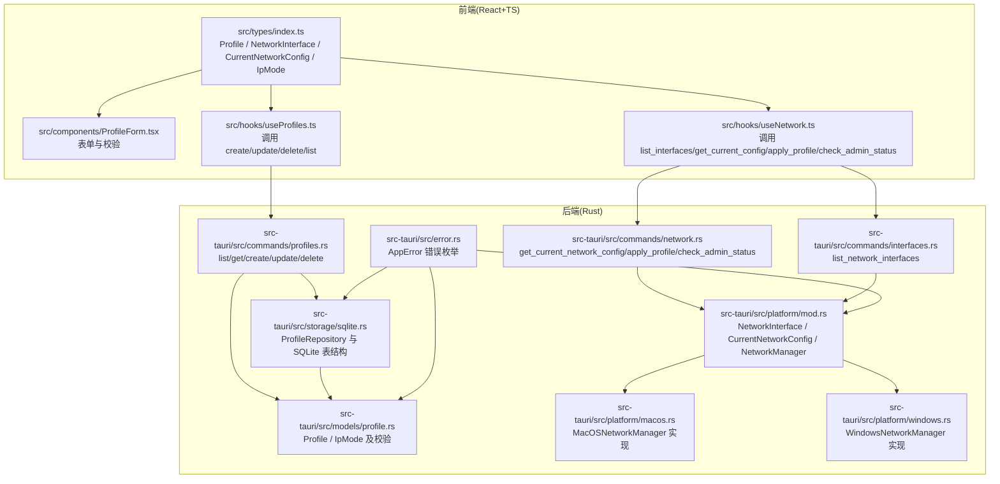
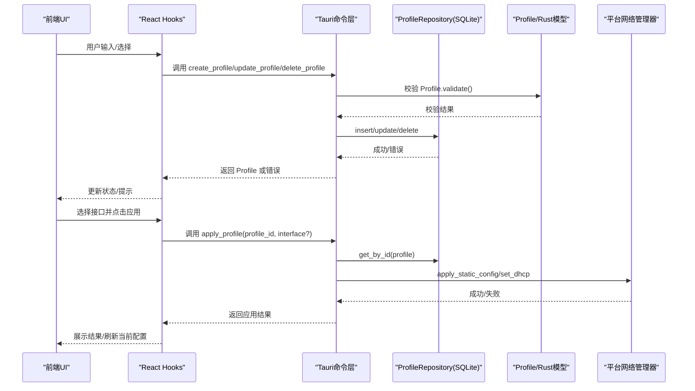
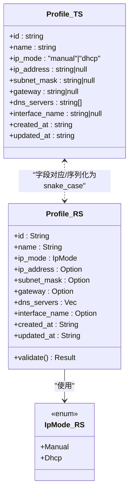
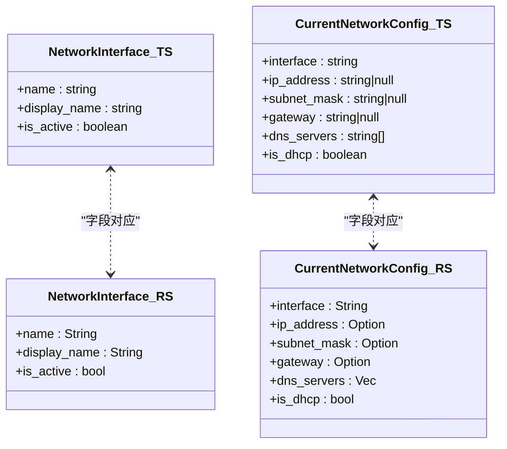
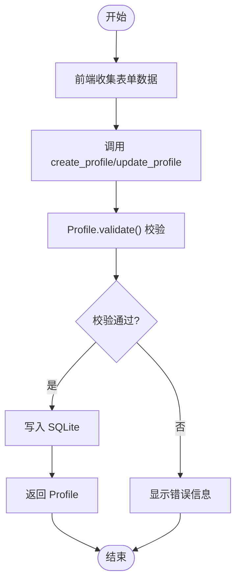
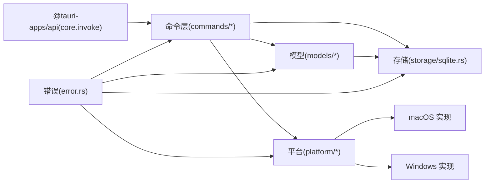

# 类型定义

<cite>
**本文引用的文件**
- [src/types/index.ts](file://src/types/index.ts)
- [src-tauri/src/models/profile.rs](file://src-tauri/src/models/profile.rs)
- [src-tauri/src/platform/mod.rs](file://src-tauri/src/platform/mod.rs)
- [src-tauri/src/storage/sqlite.rs](file://src-tauri/src/storage/sqlite.rs)
- [src-tauri/src/commands/profiles.rs](file://src-tauri/src/commands/profiles.rs)
- [src-tauri/src/commands/interfaces.rs](file://src-tauri/src/commands/interfaces.rs)
- [src-tauri/src/commands/network.rs](file://src-tauri/src/commands/network.rs)
- [src-tauri/src/platform/macos.rs](file://src-tauri/src/platform/macos.rs)
- [src-tauri/src/platform/windows.rs](file://src-tauri/src/platform/windows.rs)
- [src-tauri/src/error.rs](file://src-tauri/src/error.rs)
- [src-tauri/Cargo.toml](file://src-tauri/Cargo.toml)
- [package.json](file://package.json)
- [src/components/ProfileForm.tsx](file://src/components/ProfileForm.tsx)
- [src/hooks/useProfiles.ts](file://src/hooks/useProfiles.ts)
- [src/hooks/useNetwork.ts](file://src/hooks/useNetwork.ts)
</cite>

## 目录
1. [简介](#简介)
2. [项目结构](#项目结构)
3. [核心类型与接口](#核心类型与接口)
4. [架构总览](#架构总览)
5. [详细类型分析](#详细类型分析)
6. [依赖关系分析](#依赖关系分析)
7. [性能考量](#性能考量)
8. [故障排查指南](#故障排查指南)
9. [结论](#结论)
10. [附录：版本与迁移](#附录版本与迁移)

## 简介
本文件为 IP 切换器项目的“类型定义参考文档”，覆盖前端 TypeScript 类型、后端 Rust 结构体以及跨语言数据传输格式。内容包括：
- 每个类型的字段说明、数据类型、约束条件与使用示例
- 类型之间的关系、继承层次与转换规则
- 跨语言映射（前端 ↔ 后端）及序列化/反序列化注意事项
- 版本管理、兼容性说明与迁移指南

## 项目结构
该项目采用 Tauri 前后端一体化架构：
- 前端：React + TypeScript，位于 src/ 下
- 后端：Rust，位于 src-tauri/ 下
- 数据持久化：SQLite（rusqlite）
- 平台适配：macOS 与 Windows 的网络管理命令调用

图表来源
- [src/types/index.ts:1-30](file://src/types/index.ts#L1-L30)
- [src-tauri/src/models/profile.rs:1-88](file://src-tauri/src/models/profile.rs#L1-L88)
- [src-tauri/src/platform/mod.rs:1-64](file://src-tauri/src/platform/mod.rs#L1-L64)
- [src-tauri/src/storage/sqlite.rs:1-256](file://src-tauri/src/storage/sqlite.rs#L1-L256)
- [src-tauri/src/commands/profiles.rs:1-113](file://src-tauri/src/commands/profiles.rs#L1-L113)
- [src-tauri/src/commands/network.rs:1-101](file://src-tauri/src/commands/network.rs#L1-L101)
- [src-tauri/src/commands/interfaces.rs:1-8](file://src-tauri/src/commands/interfaces.rs#L1-L8)
- [src-tauri/src/platform/macos.rs:1-175](file://src-tauri/src/platform/macos.rs#L1-L175)
- [src-tauri/src/platform/windows.rs:1-173](file://src-tauri/src/platform/windows.rs#L1-L173)
- [src-tauri/src/error.rs:1-38](file://src-tauri/src/error.rs#L1-L38)

章节来源
- [src/types/index.ts:1-30](file://src/types/index.ts#L1-L30)
- [src-tauri/src/models/profile.rs:1-88](file://src-tauri/src/models/profile.rs#L1-L88)
- [src-tauri/src/platform/mod.rs:1-64](file://src-tauri/src/platform/mod.rs#L1-L64)
- [src-tauri/src/storage/sqlite.rs:1-256](file://src-tauri/src/storage/sqlite.rs#L1-L256)
- [src-tauri/src/commands/profiles.rs:1-113](file://src-tauri/src/commands/profiles.rs#L1-L113)
- [src-tauri/src/commands/network.rs:1-101](file://src-tauri/src/commands/network.rs#L1-L101)
- [src-tauri/src/commands/interfaces.rs:1-8](file://src-tauri/src/commands/interfaces.rs#L1-L8)
- [src-tauri/src/platform/macos.rs:1-175](file://src-tauri/src/platform/macos.rs#L1-L175)
- [src-tauri/src/platform/windows.rs:1-173](file://src-tauri/src/platform/windows.rs#L1-L173)
- [src-tauri/src/error.rs:1-38](file://src-tauri/src/error.rs#L1-L38)

## 核心类型与接口
本节对项目中的关键类型进行逐项说明，并给出字段、类型、约束与使用要点。

- Profile（配置方案）
  - 字段
    - id: 字符串，唯一标识
    - name: 字符串，非空，最大长度 64
    - ip_mode: 枚举，取值为 manual 或 dhcp
    - ip_address: 字符串或空，手动模式必填
    - subnet_mask: 字符串或空，手动模式必填
    - gateway: 字符串或空，手动模式必填
    - dns_servers: 字符串数组，手动模式至少一个；DHCP 模式可为空
    - interface_name: 字符串或空，目标网络接口名
    - created_at / updated_at: 字符串（RFC3339 时间戳）
  - 约束
    - 手动模式：ip_address、subnet_mask、gateway 必须为有效 IPv4
    - DHCP 模式：不允许设置上述三项
    - 名称唯一性（数据库约束）
  - 使用示例
    - 创建/更新时通过前端表单收集，经命令层校验后入库
    - 应用时根据 ip_mode 决定调用静态配置或 DHCP 设置
  - 跨语言映射
    - 前端 TypeScript 接口与后端 Rust 结构体字段一一对应，序列化为 snake_case（后端）

- IpMode（IP 获取方式）
  - 字段
    - manual: 手动配置
    - dhcp: 自动获取（DHCP）
  - 映射
    - 前端使用字面量联合类型，后端使用枚举并通过 Display 输出本地化文本
    - 命令层在前后端之间做字符串映射（如 "Manual"/"Dhcp"）

- NetworkInterface（网络接口）
  - 字段
    - name: 接口标识名
    - display_name: 显示名
    - is_active: 是否为当前活动接口
  - 使用场景
    - 列出可用接口，选择目标接口进行配置应用

- CurrentNetworkConfig（当前网络配置）
  - 字段
    - interface: 当前接口名
    - ip_address/subnet_mask/gateway: 字符串或空
    - dns_servers: 字符串数组
    - is_dhcp: 布尔（由平台解析得出）
  - 使用场景
    - 查询当前接口的 IP/DNS/DHCP 状态

章节来源
- [src/types/index.ts:1-30](file://src/types/index.ts#L1-L30)
- [src-tauri/src/models/profile.rs:20-81](file://src-tauri/src/models/profile.rs#L20-L81)
- [src-tauri/src/platform/mod.rs:5-42](file://src-tauri/src/platform/mod.rs#L5-L42)
- [src-tauri/src/commands/profiles.rs:24-104](file://src-tauri/src/commands/profiles.rs#L24-L104)
- [src-tauri/src/commands/network.rs:9-95](file://src-tauri/src/commands/network.rs#L9-L95)

## 架构总览
下图展示从前端到后端的数据流与类型映射关系：

图表来源
- [src/hooks/useProfiles.ts:23-115](file://src/hooks/useProfiles.ts#L23-L115)
- [src-tauri/src/commands/profiles.rs:24-113](file://src-tauri/src/commands/profiles.rs#L24-L113)
- [src-tauri/src/storage/sqlite.rs:146-232](file://src-tauri/src/storage/sqlite.rs#L146-L232)
- [src-tauri/src/models/profile.rs:34-81](file://src-tauri/src/models/profile.rs#L34-L81)
- [src-tauri/src/commands/network.rs:29-95](file://src-tauri/src/commands/network.rs#L29-L95)

## 详细类型分析

### Profile 类型族
- 前端 TypeScript
  - 接口定义见 [src/types/index.ts:1-12](file://src/types/index.ts#L1-L12)
  - 表单组件中的表单数据结构见 [src/components/ProfileForm.tsx:19-28](file://src/components/ProfileForm.tsx#L19-L28)
- 后端 Rust
  - 结构体与枚举定义见 [src-tauri/src/models/profile.rs:4-32](file://src-tauri/src/models/profile.rs#L4-L32)
  - 校验逻辑见 [src-tauri/src/models/profile.rs:34-81](file://src-tauri/src/models/profile.rs#L34-L81)
- 命令层参数与返回
  - 创建/更新命令参数映射见 [src-tauri/src/commands/profiles.rs:24-104](file://src-tauri/src/commands/profiles.rs#L24-L104)
  - 返回类型为 Profile，见 [src-tauri/src/commands/profiles.rs:10-14](file://src-tauri/src/commands/profiles.rs#L10-L14)
- 存储层
  - SQLite 表结构与序列化/反序列化见 [src-tauri/src/storage/sqlite.rs:59-74](file://src-tauri/src/storage/sqlite.rs#L59-L74)、[src-tauri/src/storage/sqlite.rs:150-171](file://src-tauri/src/storage/sqlite.rs#L150-L171)、[src-tauri/src/storage/sqlite.rs:86-105](file://src-tauri/src/storage/sqlite.rs#L86-L105)

图表来源
- [src/types/index.ts:1-12](file://src/types/index.ts#L1-L12)
- [src-tauri/src/models/profile.rs:4-32](file://src-tauri/src/models/profile.rs#L4-L32)
- [src-tauri/src/models/profile.rs:34-81](file://src-tauri/src/models/profile.rs#L34-L81)

章节来源
- [src/types/index.ts:1-12](file://src/types/index.ts#L1-L12)
- [src-tauri/src/models/profile.rs:4-32](file://src-tauri/src/models/profile.rs#L4-L32)
- [src-tauri/src/models/profile.rs:34-81](file://src-tauri/src/models/profile.rs#L34-L81)
- [src-tauri/src/commands/profiles.rs:24-104](file://src-tauri/src/commands/profiles.rs#L24-L104)
- [src-tauri/src/storage/sqlite.rs:59-74](file://src-tauri/src/storage/sqlite.rs#L59-L74)

### 网络接口与当前配置
- 前端类型
  - NetworkInterface / CurrentNetworkConfig 见 [src/types/index.ts:14-27](file://src/types/index.ts#L14-L27)
- 后端类型
  - NetworkInterface / CurrentNetworkConfig / NetworkManager 见 [src-tauri/src/platform/mod.rs:5-42](file://src-tauri/src/platform/mod.rs#L5-L42)
- 命令层
  - 列表接口与当前配置查询见 [src-tauri/src/commands/interfaces.rs:4-7](file://src-tauri/src/commands/interfaces.rs#L4-L7)、[src-tauri/src/commands/network.rs:9-26](file://src-tauri/src/commands/network.rs#L9-L26)
- 平台实现
  - macOS/Windows 具体实现分别见 [src-tauri/src/platform/macos.rs:8-43](file://src-tauri/src/platform/macos.rs#L8-L43)、[src-tauri/src/platform/windows.rs:8-38](file://src-tauri/src/platform/windows.rs#L8-L38)

图表来源
- [src/types/index.ts:14-27](file://src/types/index.ts#L14-L27)
- [src-tauri/src/platform/mod.rs:5-42](file://src-tauri/src/platform/mod.rs#L5-L42)

章节来源
- [src/types/index.ts:14-27](file://src/types/index.ts#L14-L27)
- [src-tauri/src/platform/mod.rs:5-42](file://src-tauri/src/platform/mod.rs#L5-L42)
- [src-tauri/src/commands/interfaces.rs:4-7](file://src-tauri/src/commands/interfaces.rs#L4-L7)
- [src-tauri/src/commands/network.rs:9-26](file://src-tauri/src/commands/network.rs#L9-L26)
- [src-tauri/src/platform/macos.rs:8-43](file://src-tauri/src/platform/macos.rs#L8-L43)
- [src-tauri/src/platform/windows.rs:8-38](file://src-tauri/src/platform/windows.rs#L8-L38)

### 应用流程与校验
- 创建/更新流程
  - 前端收集表单数据，调用 create_profile/update_profile
  - 命令层构造 Profile，调用 validate 校验
  - 写入 SQLite，返回 Profile
- 应用配置流程
  - 选择方案与接口，调用 apply_profile
  - 若为手动模式，调用平台静态配置；若为 DHCP，调用平台 DHCP 设置
  - 需要管理员权限时，通过 elevate_network_command 提升权限

图表来源
- [src-tauri/src/commands/profiles.rs:24-104](file://src-tauri/src/commands/profiles.rs#L24-L104)
- [src-tauri/src/models/profile.rs:34-81](file://src-tauri/src/models/profile.rs#L34-L81)
- [src-tauri/src/storage/sqlite.rs:146-232](file://src-tauri/src/storage/sqlite.rs#L146-L232)

章节来源
- [src-tauri/src/commands/profiles.rs:24-104](file://src-tauri/src/commands/profiles.rs#L24-L104)
- [src-tauri/src/models/profile.rs:34-81](file://src-tauri/src/models/profile.rs#L34-L81)
- [src-tauri/src/storage/sqlite.rs:146-232](file://src-tauri/src/storage/sqlite.rs#L146-L232)

## 依赖关系分析
- 前端依赖
  - @tauri-apps/api 用于调用后端命令
  - React + TypeScript 提供类型安全的 UI 组件
- 后端依赖
  - tauri、serde、serde_json、rusqlite、uuid、chrono、thiserror 等
- 关键耦合点
  - 命令层与模型层强耦合（Profile、IpMode）
  - 存储层与模型层强耦合（序列化/反序列化）
  - 平台层与命令层弱耦合（通过 trait 抽象）

图表来源
- [src-tauri/Cargo.toml:12-24](file://src-tauri/Cargo.toml#L12-L24)
- [src-tauri/src/commands/profiles.rs:1-113](file://src-tauri/src/commands/profiles.rs#L1-L113)
- [src-tauri/src/storage/sqlite.rs:1-256](file://src-tauri/src/storage/sqlite.rs#L1-L256)
- [src-tauri/src/models/profile.rs:1-88](file://src-tauri/src/models/profile.rs#L1-L88)
- [src-tauri/src/platform/mod.rs:1-64](file://src-tauri/src/platform/mod.rs#L1-L64)
- [src-tauri/src/platform/macos.rs:1-175](file://src-tauri/src/platform/macos.rs#L1-L175)
- [src-tauri/src/platform/windows.rs:1-173](file://src-tauri/src/platform/windows.rs#L1-L173)
- [src-tauri/src/error.rs:1-38](file://src-tauri/src/error.rs#L1-L38)

章节来源
- [src-tauri/Cargo.toml:12-24](file://src-tauri/Cargo.toml#L12-L24)
- [src-tauri/src/error.rs:1-38](file://src-tauri/src/error.rs#L1-L38)

## 性能考量
- 数据库访问
  - 使用互斥锁保护连接，避免并发写冲突；读取时批量查询，减少往返次数
- 序列化成本
  - DNS 数组以 JSON 文本形式存入 SQLite，读取时反序列化；建议控制数组规模
- 平台命令调用
  - macOS/Windows 的网络命令调用为外部进程，注意异步与超时处理
- 前端渲染
  - 使用 React Hooks 缓存与去抖，减少重复请求

## 故障排查指南
- 常见错误类型
  - 验证错误：名称为空/超长、手动模式字段缺失、IPv4 格式不合法、DNS 数组为空等
  - 数据库错误：唯一约束冲突（名称重复）、查询无结果等
  - 网络错误：无法列出接口、设置失败、权限不足
- 定位方法
  - 查看命令层返回的 AppError，前端统一捕获并展示
  - 检查 Profile.validate() 的具体分支
  - 检查 SQLite 表结构与约束
- 处理建议
  - 对于权限问题，引导用户提升权限或使用内置提升流程
  - 对于网络命令失败，检查平台命令输出与系统状态

章节来源
- [src-tauri/src/error.rs:3-28](file://src-tauri/src/error.rs#L3-L28)
- [src-tauri/src/models/profile.rs:34-81](file://src-tauri/src/models/profile.rs#L34-L81)
- [src-tauri/src/storage/sqlite.rs:146-232](file://src-tauri/src/storage/sqlite.rs#L146-L232)
- [src-tauri/src/platform/macos.rs:8-43](file://src-tauri/src/platform/macos.rs#L8-L43)
- [src-tauri/src/platform/windows.rs:8-38](file://src-tauri/src/platform/windows.rs#L8-L38)

## 结论
本项目在前后端之间建立了清晰的类型边界与约束规则，通过 Rust 的强类型与 SQLite 的结构化存储保障了数据一致性；前端通过 Tauri 命令层与后端交互，实现了跨平台网络配置的自动化与可视化。建议在后续迭代中：
- 明确版本号与变更日志，规范类型演进策略
- 在命令层增加更细粒度的错误码，便于前端精准提示
- 对平台命令调用增加重试与降级策略

## 附录：版本与迁移
- 版本号
  - 前端与后端均使用 1.0.0，建议保持同步
- 迁移建议
  - 新增字段时，需同时更新命令层参数、模型结构体、SQLite 表结构与序列化逻辑
  - 枚举值变更需在命令层两端做双向映射（如 "Manual"/"Dhcp"）
  - 对于 DNS 数组等 JSON 字段，确保前后端一致的序列化/反序列化策略
- 兼容性
  - 前端 TypeScript 与后端 Rust 的字段命名采用 snake_case 对应策略，避免直接使用驼峰
  - IpMode 在后端支持 Display 输出本地化文本，前端仅使用字符串常量

章节来源
- [package.json:1-27](file://package.json#L1-L27)
- [src-tauri/Cargo.toml:1-31](file://src-tauri/Cargo.toml#L1-L31)
- [src-tauri/src/commands/profiles.rs:35-38](file://src-tauri/src/commands/profiles.rs#L35-L38)
- [src-tauri/src/storage/sqlite.rs:59-74](file://src-tauri/src/storage/sqlite.rs#L59-L74)