# React组件架构

<cite>
**本文档引用的文件**
- [src/App.tsx](file://src/App.tsx)
- [src/components/ProfileList.tsx](file://src/components/ProfileList.tsx)
- [src/components/ProfileCard.tsx](file://src/components/ProfileCard.tsx)
- [src/components/ProfileForm.tsx](file://src/components/ProfileForm.tsx)
- [src/components/InterfaceSelector.tsx](file://src/components/InterfaceSelector.tsx)
- [src/components/DnsEditor.tsx](file://src/components/DnsEditor.tsx)
- [src/components/StatusBar.tsx](file://src/components/StatusBar.tsx)
- [src/components/SwitchConfirmDialog.tsx](file://src/components/SwitchConfirmDialog.tsx)
- [src/components/UpdateChecker.tsx](file://src/components/UpdateChecker.tsx)
- [src/hooks/useProfiles.ts](file://src/hooks/useProfiles.ts)
- [src/hooks/useNetwork.ts](file://src/hooks/useNetwork.ts)
- [src/types/index.ts](file://src/types/index.ts)
- [src/main.tsx](file://src/main.tsx)
- [src/App.css](file://src/App.css)
- [package.json](file://package.json)
</cite>

## 更新摘要
**变更内容**
- 新增UpdateChecker组件，提供自动和手动更新检查功能
- 增强StatusBar组件，添加检查更新按钮和状态显示
- 实现Toast通知系统，用于显示更新状态和进度
- 新增onCheckRef回调机制，支持外部组件触发更新检查
- 添加完整的更新流程管理，包括下载、安装和重启

## 目录
1. [简介](#简介)
2. [项目结构](#项目结构)
3. [核心组件](#核心组件)
4. [架构概览](#架构概览)
5. [详细组件分析](#详细组件分析)
6. [依赖关系分析](#依赖关系分析)
7. [性能考虑](#性能考虑)
8. [故障排除指南](#故障排除指南)
9. [结论](#结论)

## 简介

IPSwitcher是一个基于React和Tauri技术构建的网络配置切换工具。该应用程序允许用户创建、管理和应用不同的网络配置方案，支持手动IP配置和DHCP两种模式。系统通过React组件架构实现用户界面，结合自定义Hook进行状态管理和数据获取，通过Tauri与原生系统交互以执行网络配置操作。

该工具的核心功能包括：
- 配置方案的创建、编辑和删除
- 网络接口的选择和管理
- IP地址、子网掩码、网关和DNS服务器的配置
- 网络配置的实时应用和状态监控
- **自动和手动更新检查功能**
- **用户友好的图形界面和响应式设计**

## 项目结构

IPSwitcher采用模块化的React组件架构，主要分为以下几个层次：

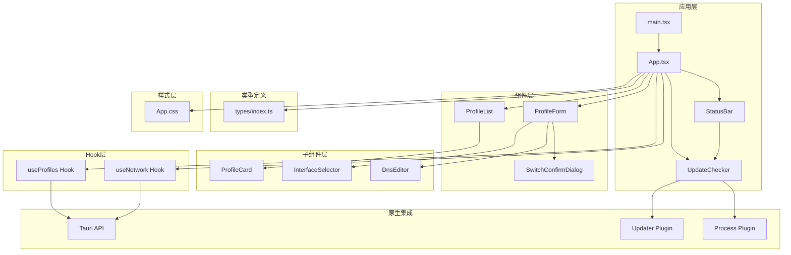
```mermaid
graph TB
subgraph "应用层"
App[App.tsx]
Main[main.tsx]
UpdateChecker[UpdateChecker]
StatusBar[StatusBar]
end
subgraph "组件层"
ProfileList[ProfileList]
ProfileForm[ProfileForm]
Dialog[SwitchConfirmDialog]
end
subgraph "子组件层"
ProfileCard[ProfileCard]
InterfaceSelector[InterfaceSelector]
DnsEditor[DnsEditor]
end
subgraph "Hook层"
useProfiles[useProfiles Hook]
useNetwork[useNetwork Hook]
end
subgraph "类型定义"
Types[types/index.ts]
end
subgraph "样式层"
Styles[App.css]
end
subgraph "原生集成"
Tauri[Tauri API]
Updater[Updater Plugin]
Process[Process Plugin]
end
Main --> App
App --> UpdateChecker
App --> StatusBar
App --> ProfileList
App --> ProfileForm
ProfileList --> ProfileCard
ProfileForm --> InterfaceSelector
ProfileForm --> DnsEditor
ProfileForm --> Dialog
App --> useProfiles
App --> useNetwork
useProfiles --> Tauri
useNetwork --> Tauri
UpdateChecker --> Updater
UpdateChecker --> Process
StatusBar --> UpdateChecker
App --> Types
App --> Styles
```

**图表来源**
- [src/App.tsx:1-235](file://src/App.tsx#L1-L235)
- [src/main.tsx:1-11](file://src/main.tsx#L1-L11)
- [src/components/UpdateChecker.tsx:1-203](file://src/components/UpdateChecker.tsx#L1-L203)

**章节来源**
- [src/App.tsx:1-235](file://src/App.tsx#L1-L235)
- [src/main.tsx:1-11](file://src/main.tsx#L1-L11)

## 核心组件

IPSwitcher应用由多个精心设计的React组件构成，每个组件都有明确的职责和清晰的接口定义。以下是核心组件的概述：

### 主要组件职责

1. **App组件** - 应用程序的根组件，负责全局状态管理和组件协调
2. **ProfileList组件** - 显示配置方案列表，提供选择和操作功能
3. **ProfileForm组件** - 提供完整的配置方案编辑表单
4. **ProfileCard组件** - 渲染单个配置方案的卡片视图
5. **InterfaceSelector组件** - 网络接口选择器
6. **DnsEditor组件** - DNS服务器编辑器
7. **StatusBar组件** - 显示当前网络状态和更新检查按钮
8. **SwitchConfirmDialog组件** - 网络切换确认对话框
9. **UpdateChecker组件** - **新增** - 处理应用程序更新检查和管理

### 组件间关系

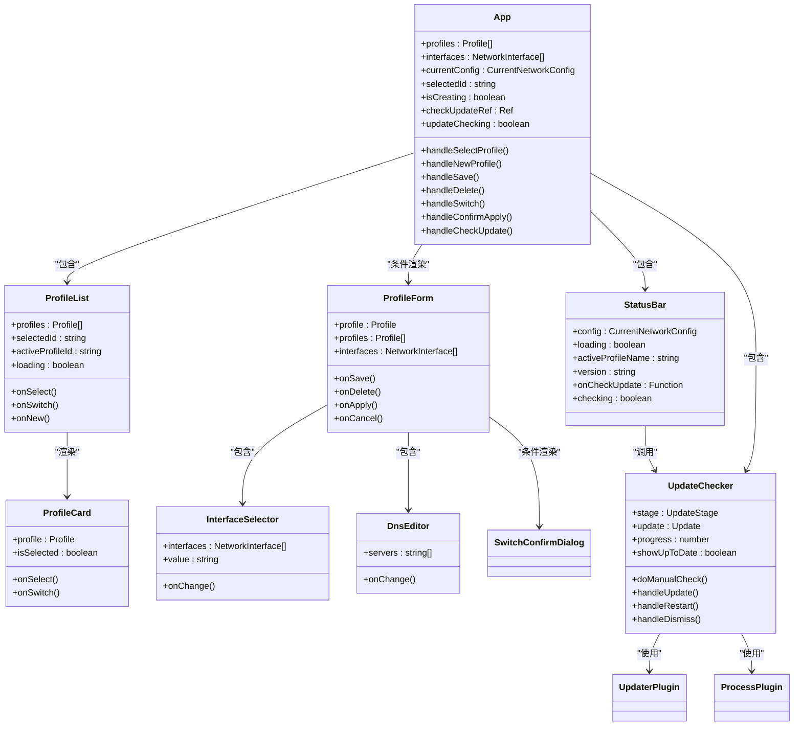
```mermaid
classDiagram
class App {
+profiles : Profile[]
+interfaces : NetworkInterface[]
+currentConfig : CurrentNetworkConfig
+selectedId : string
+isCreating : boolean
+checkUpdateRef : Ref
+updateChecking : boolean
+handleSelectProfile()
+handleNewProfile()
+handleSave()
+handleDelete()
+handleSwitch()
+handleConfirmApply()
+handleCheckUpdate()
}
class ProfileList {
+profiles : Profile[]
+selectedId : string
+activeProfileId : string
+loading : boolean
+onSelect()
+onSwitch()
+onNew()
}
class ProfileForm {
+profile : Profile
+profiles : Profile[]
+interfaces : NetworkInterface[]
+onSave()
+onDelete()
+onApply()
+onCancel()
}
class ProfileCard {
+profile : Profile
+isSelected : boolean
+onSelect()
+onSwitch()
}
class InterfaceSelector {
+interfaces : NetworkInterface[]
+value : string
+onChange()
}
class DnsEditor {
+servers : string[]
+onChange()
}
class StatusBar {
+config : CurrentNetworkConfig
+loading : boolean
+activeProfileName : string
+version : string
+onCheckUpdate : Function
+checking : boolean
}
class UpdateChecker {
+stage : UpdateStage
+update : Update
+progress : number
+showUpToDate : boolean
+doManualCheck()
+handleUpdate()
+handleRestart()
+handleDismiss()
}
App --> ProfileList : "包含"
App --> ProfileForm : "条件渲染"
App --> StatusBar : "包含"
App --> UpdateChecker : "包含"
ProfileList --> ProfileCard : "渲染"
ProfileForm --> InterfaceSelector : "包含"
ProfileForm --> DnsEditor : "包含"
ProfileForm --> SwitchConfirmDialog : "条件渲染"
StatusBar --> UpdateChecker : "调用"
UpdateChecker --> UpdaterPlugin : "使用"
UpdateChecker --> ProcessPlugin : "使用"
```

**图表来源**
- [src/App.tsx:10-235](file://src/App.tsx#L10-L235)
- [src/components/ProfileList.tsx:13-52](file://src/components/ProfileList.tsx#L13-L52)
- [src/components/ProfileForm.tsx:30-357](file://src/components/ProfileForm.tsx#L30-L357)
- [src/components/UpdateChecker.tsx:6-203](file://src/components/UpdateChecker.tsx#L6-L203)

**章节来源**
- [src/App.tsx:10-235](file://src/App.tsx#L10-L235)
- [src/components/ProfileList.tsx:13-52](file://src/components/ProfileList.tsx#L13-L52)
- [src/components/ProfileForm.tsx:30-357](file://src/components/ProfileForm.tsx#L30-L357)
- [src/components/UpdateChecker.tsx:6-203](file://src/components/UpdateChecker.tsx#L6-L203)

## 架构概览

IPSwitcher采用了分层架构设计，确保了良好的关注点分离和可维护性：

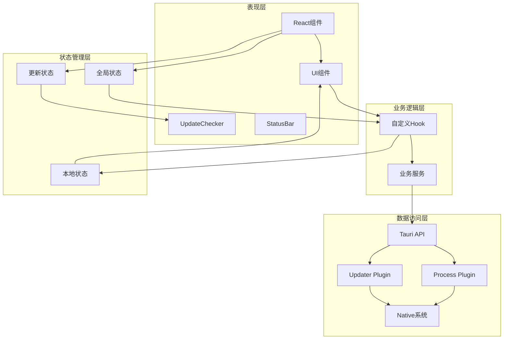
```mermaid
graph TD
subgraph "表现层"
UI[React组件]
Components[UI组件]
UpdateChecker[UpdateChecker]
StatusBar[StatusBar]
end
subgraph "业务逻辑层"
Hooks[自定义Hook]
Services[业务服务]
end
subgraph "数据访问层"
TauriAPI[Tauri API]
UpdaterPlugin[Updater Plugin]
ProcessPlugin[Process Plugin]
Native[Native系统]
end
subgraph "状态管理层"
GlobalState[全局状态]
LocalState[本地状态]
UpdateState[更新状态]
end
UI --> Components
Components --> Hooks
Hooks --> Services
Services --> TauriAPI
TauriAPI --> UpdaterPlugin
TauriAPI --> ProcessPlugin
UpdaterPlugin --> Native
ProcessPlugin --> Native
UI --> GlobalState
UI --> UpdateState
Hooks --> LocalState
GlobalState --> Hooks
LocalState --> Components
UpdateState --> UpdateChecker
```

**图表来源**
- [src/App.tsx:1-235](file://src/App.tsx#L1-L235)
- [src/hooks/useProfiles.ts:1-117](file://src/hooks/useProfiles.ts#L1-L117)
- [src/hooks/useNetwork.ts:1-99](file://src/hooks/useNetwork.ts#L1-L99)
- [src/components/UpdateChecker.tsx:1-203](file://src/components/UpdateChecker.tsx#L1-L203)

### 数据流架构

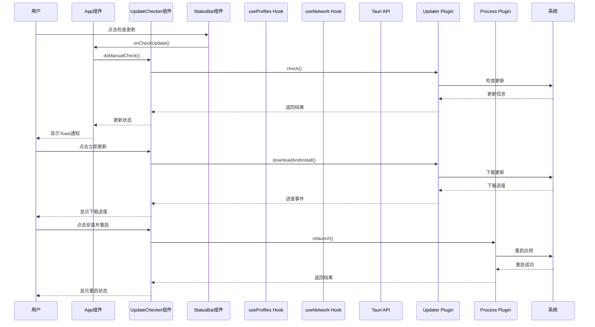
```mermaid
sequenceDiagram
participant User as 用户
participant App as App组件
participant UpdateChecker as UpdateChecker组件
participant StatusBar as StatusBar组件
participant Profiles as useProfiles Hook
participant Network as useNetwork Hook
participant Tauri as Tauri API
participant Updater as Updater Plugin
participant Process as Process Plugin
participant System as 系统
User->>StatusBar : 点击检查更新
StatusBar->>App : onCheckUpdate()
App->>UpdateChecker : doManualCheck()
UpdateChecker->>Updater : check()
Updater->>System : 检查更新
System-->>Updater : 更新信息
Updater-->>UpdateChecker : 返回结果
UpdateChecker-->>App : 更新状态
App-->>User : 显示Toast通知
User->>UpdateChecker : 点击立即更新
UpdateChecker->>Updater : downloadAndInstall()
Updater->>System : 下载更新
System-->>Updater : 下载进度
Updater-->>UpdateChecker : 进度事件
UpdateChecker-->>User : 显示下载进度
User->>UpdateChecker : 点击安装并重启
UpdateChecker->>Process : relaunch()
Process->>System : 重启应用
System-->>Process : 重启成功
Process-->>UpdateChecker : 返回结果
UpdateChecker-->>User : 显示重启状态
```

**图表来源**
- [src/App.tsx:47-54](file://src/App.tsx#L47-L54)
- [src/components/UpdateChecker.tsx:17-99](file://src/components/UpdateChecker.tsx#L17-L99)
- [src/components/StatusBar.tsx:14-22](file://src/components/StatusBar.tsx#L14-L22)

## 详细组件分析

### App组件分析

App组件是整个应用程序的根组件，负责协调所有子组件的状态和数据流。

#### 核心功能特性

1. **全局状态管理**：管理配置方案、网络接口和当前网络状态
2. **事件处理**：处理用户交互事件和系统事件
3. **数据同步**：确保UI状态与后端数据保持一致
4. **错误处理**：统一处理各种异常情况
5. ****新增** 更新检查协调**：管理UpdateChecker组件的引用和状态

#### 关键属性和方法

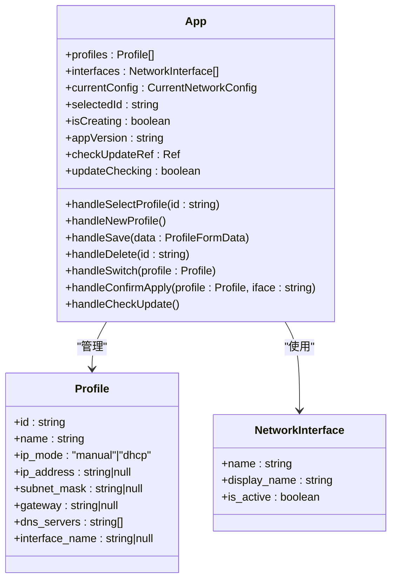
```mermaid
classDiagram
class App {
+profiles : Profile[]
+interfaces : NetworkInterface[]
+currentConfig : CurrentNetworkConfig
+selectedId : string
+isCreating : boolean
+appVersion : string
+checkUpdateRef : Ref
+updateChecking : boolean
+handleSelectProfile(id : string)
+handleNewProfile()
+handleSave(data : ProfileFormData)
+handleDelete(id : string)
+handleSwitch(profile : Profile)
+handleConfirmApply(profile : Profile, iface : string)
+handleCheckUpdate()
}
class Profile {
+id : string
+name : string
+ip_mode : "manual"|"dhcp"
+ip_address : string|null
+subnet_mask : string|null
+gateway : string|null
+dns_servers : string[]
+interface_name : string|null
}
class NetworkInterface {
+name : string
+display_name : string
+is_active : boolean
}
App --> Profile : "管理"
App --> NetworkInterface : "使用"
```

**图表来源**
- [src/App.tsx:10-235](file://src/App.tsx#L10-L235)
- [src/types/index.ts:1-30](file://src/types/index.ts#L1-L30)

#### 生命周期管理

App组件使用React的useEffect钩子处理系统事件监听和数据初始化：

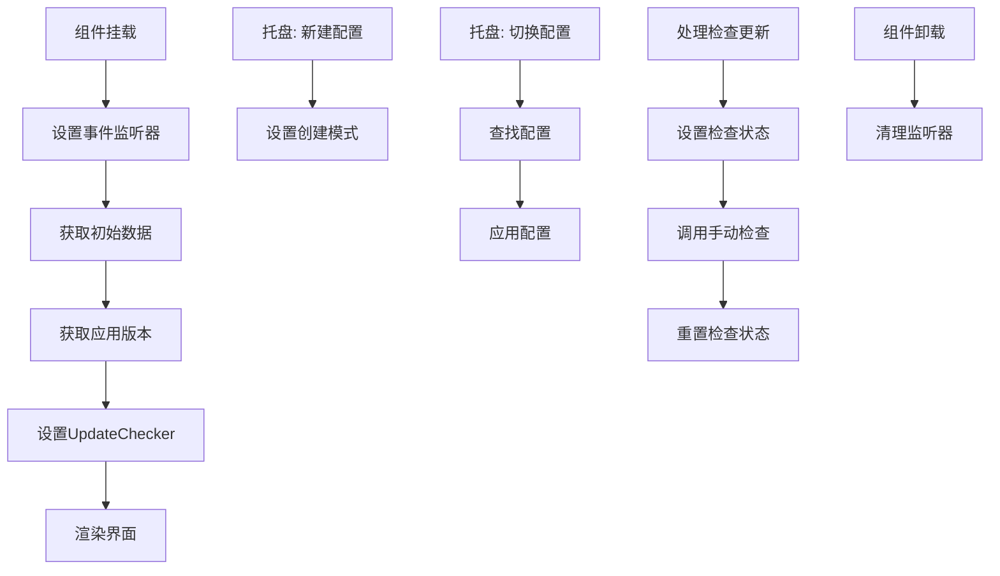
```mermaid
flowchart TD
Mount[组件挂载] --> SetupListeners[设置事件监听器]
SetupListeners --> FetchData[获取初始数据]
FetchData --> GetVersion[获取应用版本]
GetVersion --> SetupUpdateChecker[设置UpdateChecker]
SetupUpdateChecker --> Render[渲染界面]
TrayNew[托盘: 新建配置] --> SetCreating[设置创建模式]
TraySwitch[托盘: 切换配置] --> FindProfile[查找配置]
FindProfile --> ApplyProfile[应用配置]
HandleCheckUpdate[处理检查更新] --> SetChecking[设置检查状态]
SetChecking --> CallManualCheck[调用手动检查]
CallManualCheck --> ResetChecking[重置检查状态]
Unmount[组件卸载] --> Cleanup[清理监听器]
```

**图表来源**
- [src/App.tsx:115-169](file://src/App.tsx#L115-L169)
- [src/App.tsx:47-54](file://src/App.tsx#L47-L54)

**章节来源**
- [src/App.tsx:10-235](file://src/App.tsx#L10-L235)

### UpdateChecker组件分析

**新增** UpdateChecker组件是应用程序更新管理的核心组件，提供了完整的更新检查和安装功能。

#### 核心功能特性

1. **自动更新检查**：应用启动后自动检查更新
2. **手动更新检查**：通过onCheckRef回调支持外部触发
3. **更新状态管理**：管理更新检查、下载、安装等各个阶段
4. **进度跟踪**：实时显示下载进度和状态
5. **用户界面反馈**：提供Toast通知和对话框反馈

#### 更新阶段管理

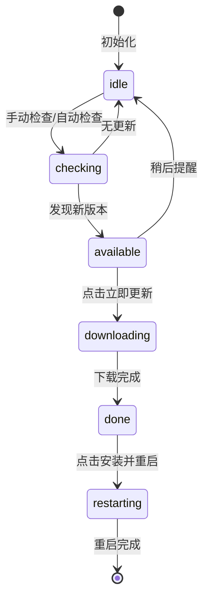
```mermaid
stateDiagram-v2
[*] --> idle : 初始化
idle --> checking : 手动检查/自动检查
checking --> available : 发现新版本
checking --> idle : 无更新
available --> downloading : 点击立即更新
available --> idle : 稍后提醒
downloading --> done : 下载完成
done --> restarting : 点击安装并重启
restarting --> [*] : 重启完成
```

#### Props接口定义

| 属性名 | 类型 | 必需 | 描述 |
|--------|------|------|------|
| onCheckRef | MutableRefObject<(() => void) \| null> | 否 | **新增** - 手动检查回调引用 |
| children | ReactNode | 否 | 子组件内容 |

#### 状态管理

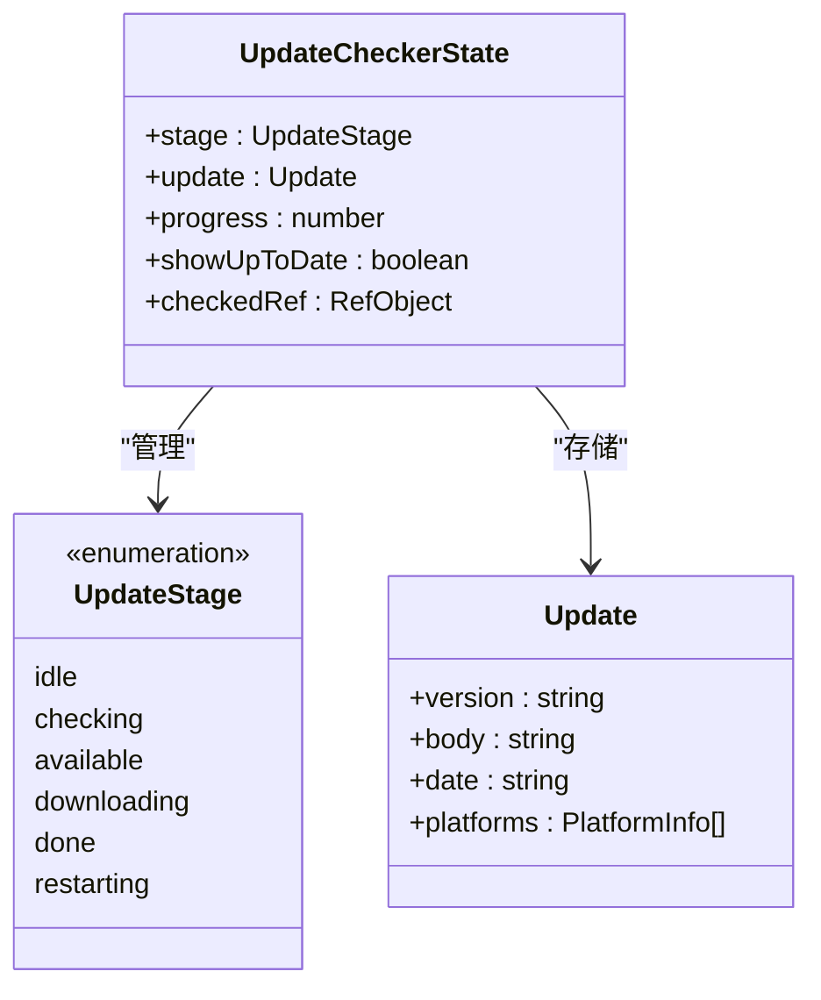
```mermaid
classDiagram
class UpdateCheckerState {
+stage : UpdateStage
+update : Update
+progress : number
+showUpToDate : boolean
+checkedRef : RefObject<boolean>
}
class UpdateStage {
<<enumeration>>
idle
checking
available
downloading
done
restarting
}
class Update {
+version : string
+body : string
+date : string
+platforms : PlatformInfo[]
}
UpdateCheckerState --> UpdateStage : "管理"
UpdateCheckerState --> Update : "存储"
```

**图表来源**
- [src/components/UpdateChecker.tsx:4-15](file://src/components/UpdateChecker.tsx#L4-L15)

#### 手动检查机制

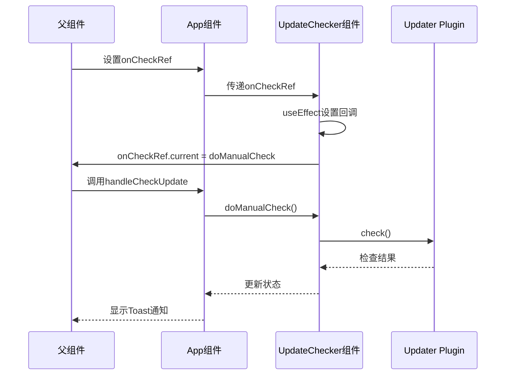
```mermaid
sequenceDiagram
participant Parent as 父组件
participant App as App组件
participant UpdateChecker as UpdateChecker组件
participant Updater as Updater Plugin
Parent->>App : 设置onCheckRef
App->>UpdateChecker : 传递onCheckRef
UpdateChecker->>UpdateChecker : useEffect设置回调
UpdateChecker->>Parent : onCheckRef.current = doManualCheck
Parent->>App : 调用handleCheckUpdate
App->>UpdateChecker : doManualCheck()
UpdateChecker->>Updater : check()
Updater-->>UpdateChecker : 检查结果
UpdateChecker-->>App : 更新状态
App-->>Parent : 显示Toast通知
```

**图表来源**
- [src/components/UpdateChecker.tsx:36-46](file://src/components/UpdateChecker.tsx#L36-L46)
- [src/App.tsx:47-54](file://src/App.tsx#L47-L54)

**章节来源**
- [src/components/UpdateChecker.tsx:6-203](file://src/components/UpdateChecker.tsx#L6-L203)

### StatusBar组件分析

StatusBar组件负责显示当前网络状态，并集成了更新检查功能。

#### 组件特性

1. **网络状态显示**：显示当前网络配置和连接状态
2. **版本信息显示**：显示应用程序版本号
3. **更新检查按钮**：提供检查更新的用户界面
4. **状态指示器**：使用颜色和图标表示连接状态

#### Props接口定义

| 属性名 | 类型 | 必需 | 描述 |
|--------|------|------|------|
| config | CurrentNetworkConfig \| null | 是 | 当前网络配置 |
| loading | boolean | 是 | 加载状态标志 |
| activeProfileName | string \| null | 是 | 活动配置方案名称 |
| version | string | 是 | 应用程序版本 |
| onCheckUpdate | () => void | 否 | **新增** - 检查更新回调 |
| checking | boolean | 否 | **新增** - 检查状态 |

#### 状态显示逻辑

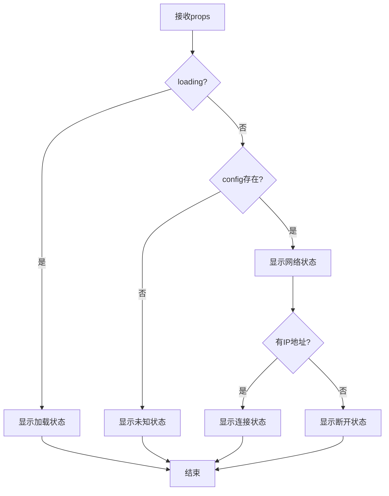
```mermaid
flowchart TD
Start[接收props] --> CheckLoading{loading?}
CheckLoading --> |是| ShowLoading[显示加载状态]
CheckLoading --> |否| CheckConfig{config存在?}
CheckConfig --> |否| ShowUnknown[显示未知状态]
CheckConfig --> |是| ShowStatus[显示网络状态]
ShowLoading --> End[结束]
ShowUnknown --> End
ShowStatus --> CheckIP{有IP地址?}
CheckIP --> |是| ShowConnected[显示连接状态]
CheckIP --> |否| ShowDisconnected[显示断开状态]
ShowConnected --> End
ShowDisconnected --> End
```

**图表来源**
- [src/components/StatusBar.tsx:12-66](file://src/components/StatusBar.tsx#L12-L66)

**章节来源**
- [src/components/StatusBar.tsx:3-66](file://src/components/StatusBar.tsx#L3-L66)

### ProfileList组件分析

ProfileList组件负责显示配置方案列表，提供用户选择和操作功能。

#### 组件特性

1. **条件渲染**：根据加载状态和数据内容显示不同界面
2. **事件传递**：将用户操作传递给父组件
3. **状态指示**：显示加载状态和空状态

#### Props接口定义

| 属性名 | 类型 | 必需 | 描述 |
|--------|------|------|------|
| profiles | Profile[] | 是 | 配置方案数组 |
| selectedId | string \| null | 是 | 当前选中的方案ID |
| activeProfileId | string \| null | 是 | **新增** - 活动配置方案ID |
| loading | boolean | 是 | 加载状态标志 |
| onSelect | (id: string) => void | 是 | 选择方案回调 |
| onSwitch | (profile: Profile) => void | 是 | 切换方案回调 |
| onNew | () => void | 是 | 新建方案回调 |

#### 渲染流程

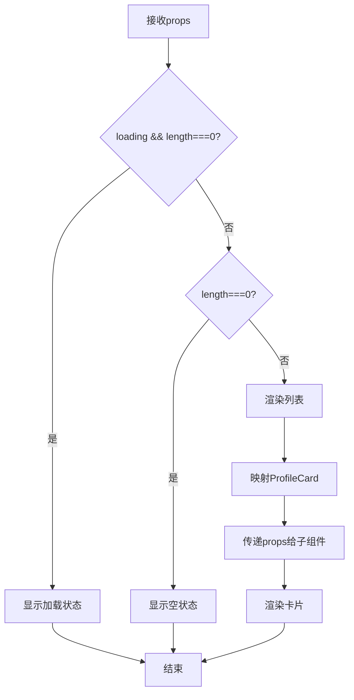
```mermaid
flowchart TD
Start[接收props] --> CheckLoading{loading && length===0?}
CheckLoading --> |是| ShowLoading[显示加载状态]
CheckLoading --> |否| CheckEmpty{length===0?}
CheckEmpty --> |是| ShowEmpty[显示空状态]
CheckEmpty --> |否| ShowList[渲染列表]
ShowList --> MapCards[映射ProfileCard]
MapCards --> PassProps[传递props给子组件]
PassProps --> RenderCards[渲染卡片]
ShowLoading --> End[结束]
ShowEmpty --> End
RenderCards --> End
```

**图表来源**
- [src/components/ProfileList.tsx:13-52](file://src/components/ProfileList.tsx#L13-L52)

**章节来源**
- [src/components/ProfileList.tsx:13-52](file://src/components/ProfileList.tsx#L13-L52)

### ProfileForm组件分析

ProfileForm组件提供了完整的配置方案编辑界面，支持创建和编辑功能。

#### 表单数据结构

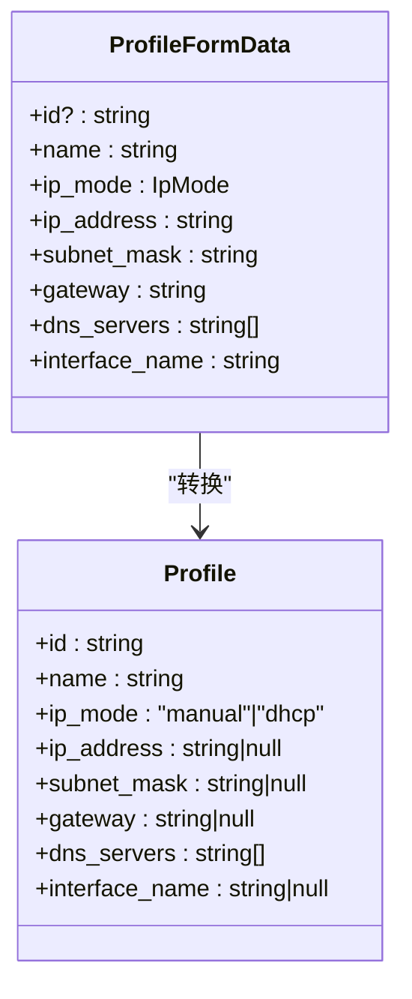
```mermaid
classDiagram
class ProfileFormData {
+id? : string
+name : string
+ip_mode : IpMode
+ip_address : string
+subnet_mask : string
+gateway : string
+dns_servers : string[]
+interface_name : string
}
class Profile {
+id : string
+name : string
+ip_mode : "manual"|"dhcp"
+ip_address : string|null
+subnet_mask : string|null
+gateway : string|null
+dns_servers : string[]
+interface_name : string|null
}
ProfileFormData --> Profile : "转换"
```

**图表来源**
- [src/components/ProfileForm.tsx:19-28](file://src/components/ProfileForm.tsx#L19-L28)
- [src/types/index.ts:1-12](file://src/types/index.ts#L1-L12)

#### 表单验证逻辑

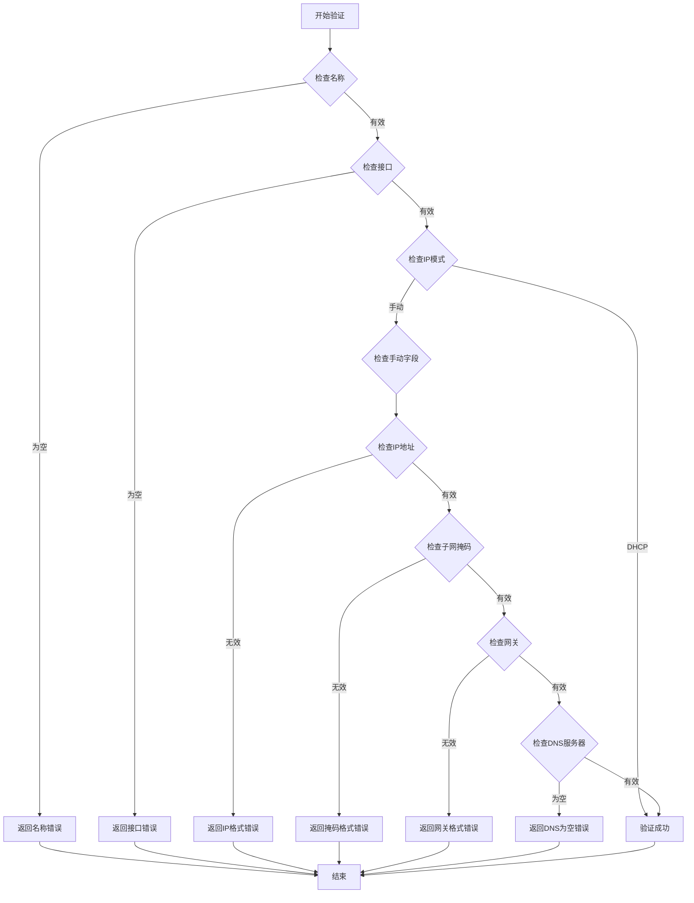
```mermaid
flowchart TD
Validate[开始验证] --> CheckName{检查名称}
CheckName --> |为空| ErrorName[返回名称错误]
CheckName --> |有效| CheckInterface{检查接口}
CheckInterface --> |为空| ErrorInterface[返回接口错误]
CheckInterface --> |有效| CheckMode{检查IP模式}
CheckMode --> |DHCP| ValidateSuccess[验证成功]
CheckMode --> |手动| CheckManualFields{检查手动字段}
CheckManualFields --> CheckIP{检查IP地址}
CheckIP --> |无效| ErrorIP[返回IP格式错误]
CheckIP --> |有效| CheckMask{检查子网掩码}
CheckMask --> |无效| ErrorMask[返回掩码格式错误]
CheckMask --> |有效| CheckGateway{检查网关}
CheckGateway --> |无效| ErrorGateway[返回网关格式错误]
CheckGateway --> |有效| CheckDNS{检查DNS服务器}
CheckDNS --> |为空| ErrorDNS[返回DNS为空错误]
CheckDNS --> |有效| ValidateSuccess
ErrorName --> End[结束]
ErrorInterface --> End
ErrorIP --> End
ErrorMask --> End
ErrorGateway --> End
ErrorDNS --> End
ValidateSuccess --> End
```

**图表来源**
- [src/components/ProfileForm.tsx:76-102](file://src/components/ProfileForm.tsx#L76-L102)

#### 保存和应用流程

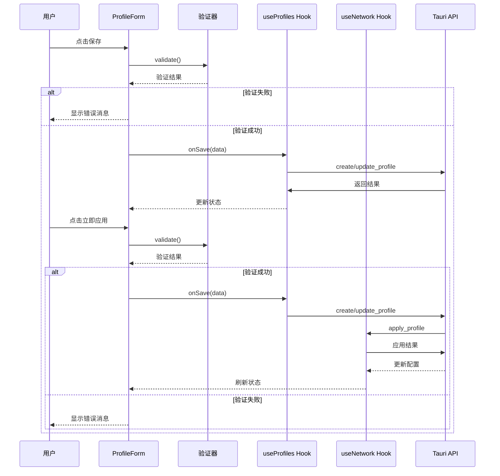
```mermaid
sequenceDiagram
participant User as 用户
participant Form as ProfileForm
participant Validator as 验证器
participant Hook as useProfiles Hook
participant Network as useNetwork Hook
participant Tauri as Tauri API
User->>Form : 点击保存
Form->>Validator : validate()
Validator-->>Form : 验证结果
alt 验证失败
Form-->>User : 显示错误消息
else 验证成功
Form->>Hook : onSave(data)
Hook->>Tauri : create/update_profile
Tauri->>Hook : 返回结果
Hook-->>Form : 更新状态
User->>Form : 点击立即应用
Form->>Validator : validate()
Validator-->>Form : 验证结果
alt 验证成功
Form->>Hook : onSave(data)
Hook->>Tauri : create/update_profile
Tauri->>Network : apply_profile
Network->>Tauri : 应用结果
Tauri-->>Network : 更新配置
Network-->>Form : 刷新状态
else 验证失败
Form-->>User : 显示错误消息
end
end
```

**图表来源**
- [src/components/ProfileForm.tsx:104-182](file://src/components/ProfileForm.tsx#L104-L182)
- [src/hooks/useProfiles.ts:23-53](file://src/hooks/useProfiles.ts#L23-L53)
- [src/hooks/useNetwork.ts:49-69](file://src/hooks/useNetwork.ts#L49-L69)

**章节来源**
- [src/components/ProfileForm.tsx:19-357](file://src/components/ProfileForm.tsx#L19-L357)

### 子组件详细分析

#### InterfaceSelector组件

InterfaceSelector组件提供网络接口选择功能，支持显示接口的详细信息。

##### 组件特性

1. **接口信息显示**：显示接口的显示名称和活跃状态
2. **选项过滤**：提供空选项作为占位符
3. **事件处理**：将选择变化传递给父组件

##### Props接口

| 属性名 | 类型 | 必需 | 描述 |
|--------|------|------|------|
| interfaces | NetworkInterface[] | 是 | 网络接口数组 |
| value | string | 是 | 当前选中的接口名称 |
| onChange | (value: string) => void | 是 | 值变化回调函数 |

**章节来源**
- [src/components/InterfaceSelector.tsx:1-34](file://src/components/InterfaceSelector.tsx#L1-L34)

#### DnsEditor组件

DnsEditor组件提供DNS服务器的编辑功能，支持动态添加和删除DNS服务器。

##### 功能特性

1. **动态DNS管理**：支持添加、删除和编辑DNS服务器
2. **输入验证**：防止重复添加相同的DNS服务器
3. **键盘快捷键**：支持回车键快速添加DNS服务器

##### 编辑流程

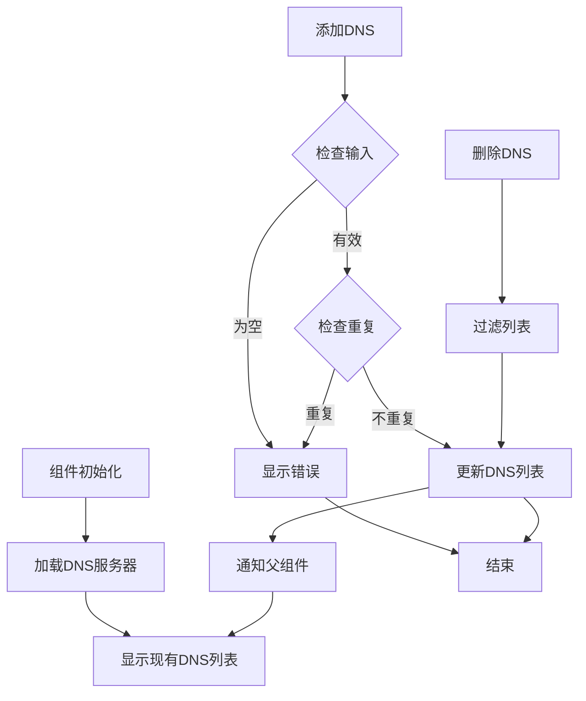
```mermaid
flowchart TD
Start[组件初始化] --> LoadServers[加载DNS服务器]
LoadServers --> ShowList[显示现有DNS列表]
AddDNS[添加DNS] --> CheckInput{检查输入}
CheckInput --> |为空| ShowError[显示错误]
CheckInput --> |有效| CheckDuplicate{检查重复}
CheckDuplicate --> |重复| ShowError
CheckDuplicate --> |不重复| UpdateList[更新DNS列表]
RemoveDNS[删除DNS] --> FilterList[过滤列表]
FilterList --> UpdateList
UpdateList --> NotifyParent[通知父组件]
NotifyParent --> ShowList
ShowError --> End[结束]
UpdateList --> End
```

**图表来源**
- [src/components/DnsEditor.tsx:8-79](file://src/components/DnsEditor.tsx#L8-L79)

**章节来源**
- [src/components/DnsEditor.tsx:8-79](file://src/components/DnsEditor.tsx#L8-L79)

#### SwitchConfirmDialog组件

SwitchConfirmDialog组件提供网络切换操作的确认对话框。

##### 对话框内容

对话框会显示即将应用的配置详情，包括：
- 方案名称
- 目标网络接口
- IP获取方式（手动/DHCP）
- 手动配置详情（IP地址、子网掩码、网关、DNS）
- 权限警告信息

**章节来源**
- [src/components/SwitchConfirmDialog.tsx:11-89](file://src/components/SwitchConfirmDialog.tsx#L11-L89)

### Hook组件分析

#### useProfiles Hook

useProfiles Hook封装了配置方案的数据管理逻辑，提供CRUD操作能力。

##### 核心功能

1. **数据获取**：获取所有配置方案列表
2. **数据创建**：创建新的配置方案
2. **数据更新**：更新现有的配置方案
3. **数据删除**：删除配置方案
4. **错误处理**：统一处理API调用错误

##### API调用流程

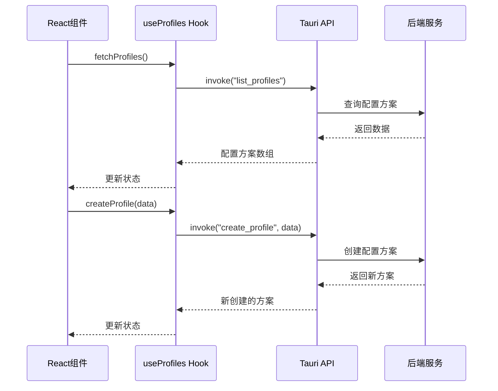
```mermaid
sequenceDiagram
participant Component as React组件
participant Hook as useProfiles Hook
participant Tauri as Tauri API
participant Backend as 后端服务
Component->>Hook : fetchProfiles()
Hook->>Tauri : invoke("list_profiles")
Tauri->>Backend : 查询配置方案
Backend-->>Tauri : 返回数据
Tauri-->>Hook : 配置方案数组
Hook-->>Component : 更新状态
Component->>Hook : createProfile(data)
Hook->>Tauri : invoke("create_profile", data)
Tauri->>Backend : 创建配置方案
Backend-->>Tauri : 返回新方案
Tauri-->>Hook : 新创建的方案
Hook-->>Component : 更新状态
```

**图表来源**
- [src/hooks/useProfiles.ts:10-117](file://src/hooks/useProfiles.ts#L10-L117)

**章节来源**
- [src/hooks/useProfiles.ts:5-117](file://src/hooks/useProfiles.ts#L5-L117)

#### useNetwork Hook

useNetwork Hook管理网络相关的状态和操作。

##### 管理功能

1. **网络接口管理**：获取和管理可用的网络接口
2. **当前配置监控**：获取和监控当前网络配置状态
3. **权限检查**：检查管理员权限状态
4. **配置应用**：应用网络配置到指定接口

##### 自动刷新机制

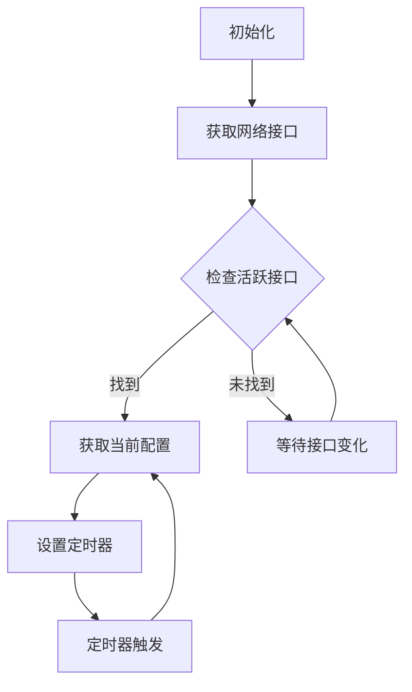
```mermaid
flowchart TD
Init[初始化] --> FetchInterfaces[获取网络接口]
FetchInterfaces --> CheckActive{检查活跃接口}
CheckActive --> |找到| FetchConfig[获取当前配置]
CheckActive --> |未找到| Wait[等待接口变化]
FetchConfig --> SetTimer[设置定时器]
SetTimer --> TimerTick[定时器触发]
TimerTick --> FetchConfig
Wait --> CheckActive
```

**图表来源**
- [src/hooks/useNetwork.ts:71-86](file://src/hooks/useNetwork.ts#L71-L86)

**章节来源**
- [src/hooks/useNetwork.ts:5-99](file://src/hooks/useNetwork.ts#L5-L99)

## 依赖关系分析

IPSwitcher应用的依赖关系体现了清晰的分层架构：

```mermaid
graph TB
subgraph "外部依赖"
React[React ^18.3.1]
TauriAPI[@tauri-apps/api ^2.0.0]
UpdaterPlugin[@tauri-apps/plugin-updater ^2.0.0]
ProcessPlugin[@tauri-apps/plugin-process ^2.0.0]
ReactDOM[react-dom ^18.3.1]
end
subgraph "内部模块"
App[App.tsx]
Components[组件库]
Hooks[自定义Hook]
Types[类型定义]
Styles[样式文件]
UpdateChecker[UpdateChecker]
StatusBar[StatusBar]
end
subgraph "平台集成"
TauriCLI[@tauri-apps/cli ^2.0.0]
Vite[Vite ^5.4.0]
TypeScript[TypeScript ^5.5.3]
end
React --> App
ReactDOM --> App
TauriAPI --> Hooks
UpdaterPlugin --> UpdateChecker
ProcessPlugin --> UpdateChecker
App --> Components
App --> Hooks
App --> UpdateChecker
App --> StatusBar
Components --> Types
Hooks --> Types
UpdateChecker --> Types
StatusBar --> Types
App --> Styles
TauriCLI --> Vite
Vite --> TypeScript
```

**图表来源**
- [package.json:12-26](file://package.json#L12-L26)

### 组件间依赖关系

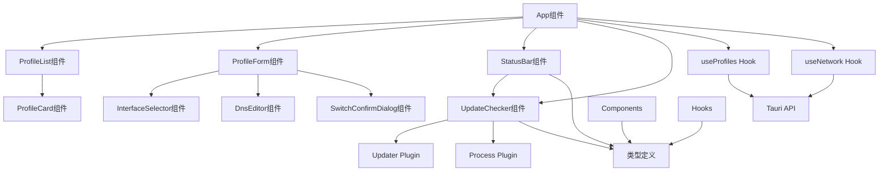
```mermaid
graph TD
App[App组件] --> ProfileList[ProfileList组件]
App --> ProfileForm[ProfileForm组件]
App --> StatusBar[StatusBar组件]
App --> UpdateChecker[UpdateChecker组件]
ProfileList --> ProfileCard[ProfileCard组件]
ProfileForm --> InterfaceSelector[InterfaceSelector组件]
ProfileForm --> DnsEditor[DnsEditor组件]
ProfileForm --> SwitchConfirmDialog[SwitchConfirmDialog组件]
StatusBar --> UpdateChecker
useProfiles[useProfiles Hook] --> TauriAPI[Tauri API]
useNetwork[useNetwork Hook] --> TauriAPI
UpdateChecker --> UpdaterPlugin[Updater Plugin]
UpdateChecker --> ProcessPlugin[Process Plugin]
App --> useProfiles
App --> useNetwork
Components --> Types[类型定义]
Hooks --> Types
UpdateChecker --> Types
StatusBar --> Types
```

**图表来源**
- [src/App.tsx:1-235](file://src/App.tsx#L1-L235)
- [src/hooks/useProfiles.ts:1-117](file://src/hooks/useProfiles.ts#L1-L117)
- [src/hooks/useNetwork.ts:1-99](file://src/hooks/useNetwork.ts#L1-L99)
- [src/components/UpdateChecker.tsx:1-203](file://src/components/UpdateChecker.tsx#L1-L203)

**章节来源**
- [package.json:12-26](file://package.json#L12-L26)

## 性能考虑

### 渲染优化策略

1. **条件渲染**：根据状态选择性渲染组件，避免不必要的DOM更新
2. **事件处理优化**：使用useCallback缓存事件处理器，减少重新渲染
3. **状态分割**：将相关状态组织在一起，避免跨组件状态同步问题
4. **懒加载**：对大型组件采用延迟加载策略
5. ****新增** 更新状态优化**：使用ref避免UpdateChecker组件的不必要重渲染

### 内存管理

1. **事件监听器清理**：在组件卸载时清理所有事件监听器
2. **定时器管理**：及时清理自动刷新定时器
3. **状态清理**：合理管理组件状态，避免内存泄漏
4. ****新增** 回调引用清理**：在effect cleanup中清理onCheckRef引用

### 网络请求优化

1. **请求去重**：避免重复发送相同的网络请求
2. **缓存策略**：合理利用浏览器缓存和应用内缓存
3. **批量操作**：将多个相关操作合并为单个请求
4. ****新增** 更新检查节流**：使用checkedRef避免重复检查

## 故障排除指南

### 常见问题及解决方案

#### 配置方案无法保存

**症状**：点击保存按钮后没有反应或出现错误提示

**可能原因**：
1. 表单验证失败
2. 网络连接问题
3. 权限不足

**解决步骤**：
1. 检查表单字段是否符合验证规则
2. 确认网络连接正常
3. 以管理员权限运行应用程序

#### 网络配置应用失败

**症状**：点击"立即应用"后出现错误或配置未生效

**可能原因**：
1. 选择了错误的网络接口
2. IP地址配置冲突
3. 权限不足

**解决步骤**：
1. 确认选择了正确的网络接口
2. 检查IP地址配置的有效性
3. 确认具有管理员权限

#### 状态栏显示异常

**症状**：状态栏显示"无法获取网络状态"或状态不更新

**可能原因**：
1. 网络接口检测失败
2. 系统权限限制
3. 网络配置读取错误

**解决步骤**：
1. 检查网络接口是否正常工作
2. 确认应用程序具有必要的系统权限
3. 重启应用程序重新尝试

#### **新增** 更新检查失败

**症状**：点击"检查更新"按钮后无响应或出现错误

**可能原因**：
1. **新增** 网络连接问题
2. **新增** Updater插件初始化失败
3. **新增** onCheckRef回调未正确设置

**解决步骤**：
1. **新增** 检查网络连接是否正常
2. **新增** 确认Updater插件已正确安装
3. **新增** 检查App组件中onCheckRef的设置
4. **新增** 查看控制台错误日志

#### **新增** 更新下载失败

**症状**：更新下载过程中断或失败

**可能原因**：
1. **新增** 下载超时
2. **新增** 磁盘空间不足
3. **新增** 权限不足

**解决步骤**：
1. **新增** 检查网络连接稳定性
2. **新增** 确认有足够的磁盘空间
3. **新增** 以管理员权限运行应用程序
4. **新增** 重新启动应用程序重试

**章节来源**
- [src/components/ProfileForm.tsx:76-102](file://src/components/ProfileForm.tsx#L76-L102)
- [src/hooks/useNetwork.ts:13-38](file://src/hooks/useNetwork.ts#L13-L38)
- [src/components/UpdateChecker.tsx:30-33](file://src/components/UpdateChecker.tsx#L30-L33)

## 结论

IPSwitcher React组件架构展现了现代前端开发的最佳实践，通过清晰的组件分层、完善的类型系统和优雅的状态管理，实现了功能完整且易于维护的网络配置管理工具。

### 架构优势

1. **模块化设计**：每个组件都有明确的职责和清晰的接口
2. **类型安全**：完整的TypeScript类型定义确保代码质量
3. **状态管理**：合理的状态分布和生命周期管理
4. **错误处理**：完善的错误处理和用户反馈机制
5. **性能优化**：采用多种优化策略提升用户体验
6. ****新增** 更新管理**：完整的自动和手动更新检查功能

### 技术亮点

1. **React Hooks模式**：充分利用React Hooks实现状态管理和副作用处理
2. **Tauri集成**：无缝集成原生系统功能，提供强大的系统级操作能力
3. **响应式设计**：适配不同屏幕尺寸，提供良好的用户体验
4. **组件复用**：设计可复用的子组件，提高开发效率
5. ****新增** 更新系统**：实现完整的应用程序更新管理流程
6. ****新增** Toast通知**：提供简洁直观的用户反馈机制

### 改进建议

1. **测试覆盖**：增加单元测试和集成测试，提升代码可靠性
2. **性能监控**：添加性能监控和分析工具
3. **国际化支持**：扩展多语言支持功能
4. **配置持久化**：增强配置的导入导出功能
5. ****新增** 更新历史记录**：记录更新历史和失败原因
6. ****新增** 更新偏好设置**：允许用户自定义更新检查频率

该架构为类似系统级应用的开发提供了优秀的参考模板，展示了如何在前端环境中实现复杂的功能需求。新增的UpdateChecker组件进一步完善了应用程序的生态系统，为用户提供了一站式的网络配置和更新管理体验。