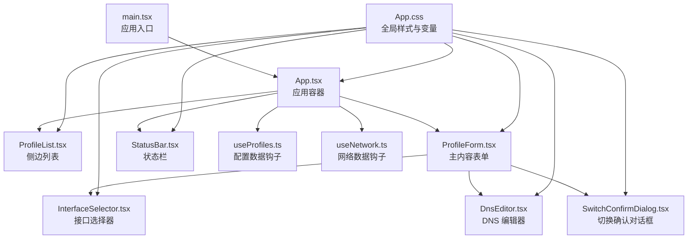
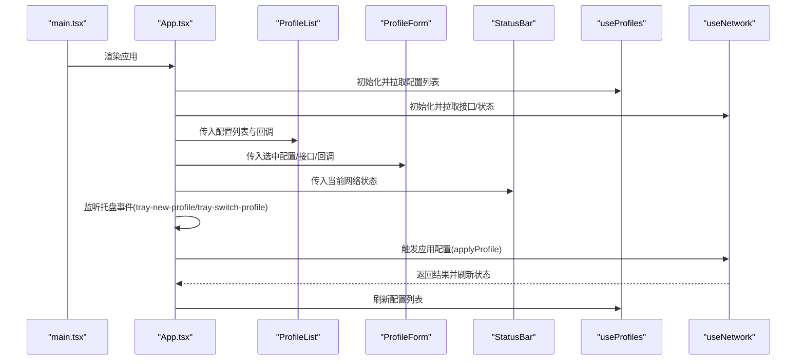
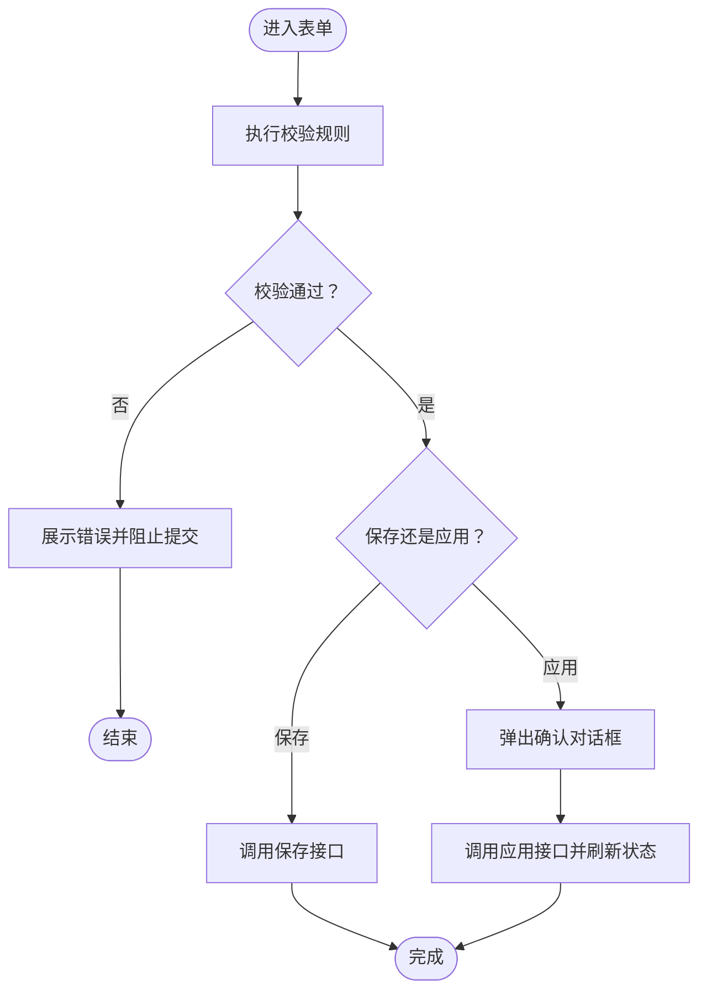
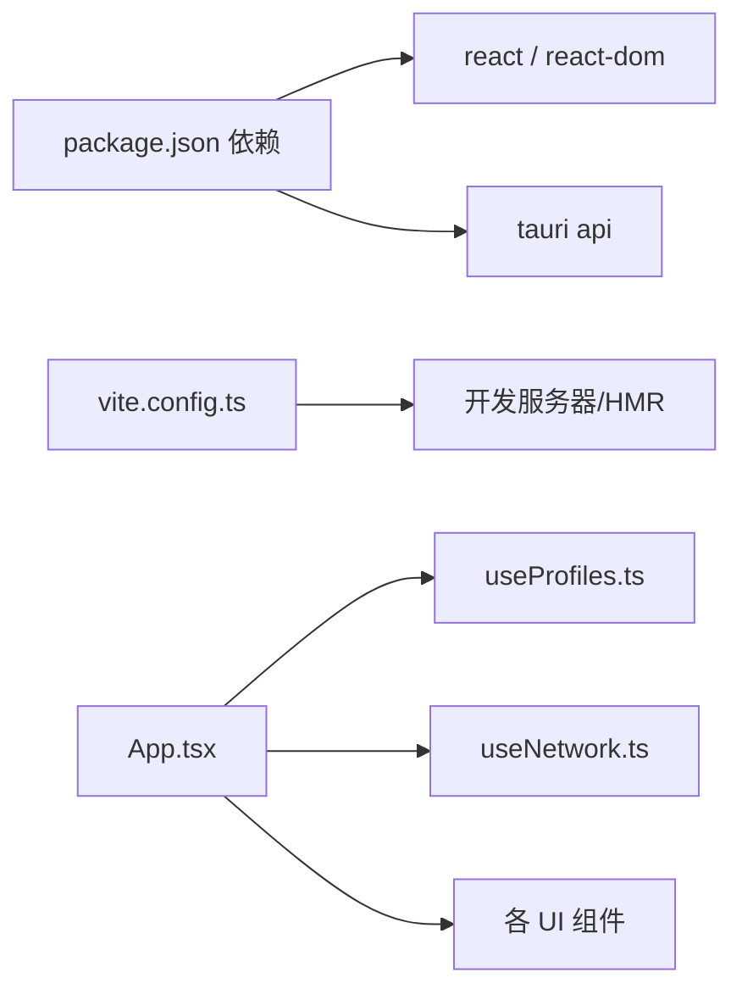

# UI设计模式

<cite>
**本文引用的文件**
- [src/App.tsx](file://src/App.tsx)
- [src/App.css](file://src/App.css)
- [src/main.tsx](file://src/main.tsx)
- [package.json](file://package.json)
- [vite.config.ts](file://vite.config.ts)
- [src/components/ProfileList.tsx](file://src/components/ProfileList.tsx)
- [src/components/ProfileForm.tsx](file://src/components/ProfileForm.tsx)
- [src/components/ProfileCard.tsx](file://src/components/ProfileCard.tsx)
- [src/components/StatusBar.tsx](file://src/components/StatusBar.tsx)
- [src/components/DnsEditor.tsx](file://src/components/DnsEditor.tsx)
- [src/components/InterfaceSelector.tsx](file://src/components/InterfaceSelector.tsx)
- [src/components/SwitchConfirmDialog.tsx](file://src/components/SwitchConfirmDialog.tsx)
- [src/types/index.ts](file://src/types/index.ts)
- [src/hooks/useProfiles.ts](file://src/hooks/useProfiles.ts)
- [src/hooks/useNetwork.ts](file://src/hooks/useNetwork.ts)
</cite>

## 目录
1. [简介](#简介)
2. [项目结构](#项目结构)
3. [核心组件](#核心组件)
4. [架构总览](#架构总览)
5. [详细组件分析](#详细组件分析)
6. [依赖关系分析](#依赖关系分析)
7. [性能考量](#性能考量)
8. [故障排查指南](#故障排查指南)
9. [结论](#结论)
10. [附录](#附录)

## 简介
本指南围绕 IPSwitcher 的 UI 设计模式进行系统化梳理，覆盖视觉设计体系、组件样式规范、交互设计原则、响应式布局与状态指示器；同时给出 CSS 模块化与样式隔离策略、动画与过渡优化建议、可访问性设计要点、表单验证与数据展示模式，并提供设计系统建立、组件库扩展与品牌一致性维护的实践路径，以及 UI 测试与跨浏览器兼容性建议。

## 项目结构
IPSwitcher 前端采用 React + Vite 构建，主入口在 main.tsx 中挂载 App 组件，App 负责协调侧边列表、主内容区（表单）、状态栏与托盘事件监听。样式通过全局 CSS 变量集中管理，组件按功能模块拆分，配合自定义 Hook 提供数据与网络能力。

图表来源
- [src/main.tsx:1-11](file://src/main.tsx#L1-L11)
- [src/App.tsx:1-195](file://src/App.tsx#L1-L195)
- [src/App.css:1-571](file://src/App.css#L1-L571)
- [src/components/ProfileList.tsx:1-52](file://src/components/ProfileList.tsx#L1-L52)
- [src/components/ProfileForm.tsx:1-357](file://src/components/ProfileForm.tsx#L1-L357)
- [src/components/StatusBar.tsx:1-39](file://src/components/StatusBar.tsx#L1-L39)
- [src/components/InterfaceSelector.tsx:1-34](file://src/components/InterfaceSelector.tsx#L1-L34)
- [src/components/DnsEditor.tsx:1-79](file://src/components/DnsEditor.tsx#L1-L79)
- [src/components/SwitchConfirmDialog.tsx:1-89](file://src/components/SwitchConfirmDialog.tsx#L1-L89)
- [src/hooks/useProfiles.ts:1-117](file://src/hooks/useProfiles.ts#L1-L117)
- [src/hooks/useNetwork.ts:1-99](file://src/hooks/useNetwork.ts#L1-L99)

章节来源
- [src/main.tsx:1-11](file://src/main.tsx#L1-L11)
- [src/App.tsx:1-195](file://src/App.tsx#L1-L195)
- [src/App.css:1-571](file://src/App.css#L1-L571)

## 核心组件
- 应用容器与路由式布局：App 以“侧边 + 主内容 + 状态栏”的三段式布局组织界面，主内容区根据是否处于新建/编辑状态动态渲染欢迎占位或表单。
- 侧边列表：展示配置方案卡片，支持选中高亮、切换按钮与新建入口。
- 表单：支持方案名称、网络接口、IP 获取方式（手动/DHCP）与手动配置字段（IP、子网掩码、网关、DNS），并提供保存、删除与立即应用等动作。
- 状态栏：显示当前网络接口、IP、DHCP/静态模式与连接状态点。
- 对话框：切换前确认，汇总目标方案与接口信息，提示风险。
- 数据钩子：useProfiles 与 useNetwork 分别封装配置 CRUD 与网络状态查询、接口枚举、管理员权限检查与定时刷新。

章节来源
- [src/App.tsx:10-195](file://src/App.tsx#L10-L195)
- [src/components/ProfileList.tsx:13-52](file://src/components/ProfileList.tsx#L13-L52)
- [src/components/ProfileForm.tsx:30-357](file://src/components/ProfileForm.tsx#L30-L357)
- [src/components/StatusBar.tsx:8-39](file://src/components/StatusBar.tsx#L8-L39)
- [src/components/SwitchConfirmDialog.tsx:11-89](file://src/components/SwitchConfirmDialog.tsx#L11-L89)
- [src/hooks/useProfiles.ts:5-117](file://src/hooks/useProfiles.ts#L5-L117)
- [src/hooks/useNetwork.ts:5-99](file://src/hooks/useNetwork.ts#L5-L99)

## 架构总览
下图展示了应用启动、事件监听与数据流的关键交互：

图表来源
- [src/main.tsx:6-10](file://src/main.tsx#L6-L10)
- [src/App.tsx:115-143](file://src/App.tsx#L115-L143)
- [src/hooks/useProfiles.ts:103-105](file://src/hooks/useProfiles.ts#L103-L105)
- [src/hooks/useNetwork.ts:49-69](file://src/hooks/useNetwork.ts#L49-L69)

## 详细组件分析

### 视觉设计体系与样式规范
- 设计语言：简洁、清晰、强调信息层级与可读性。使用统一的圆角半径、阴影与间距，确保组件边界与状态一致。
- 颜色体系：通过 CSS 变量集中管理背景、表面、边框、文本与语义色（成功/危险/警告）。模式态（手动/DHCP）使用独立色值与背景，便于快速识别。
- 字体与字号：基于系统字体栈，正文 14px，标题与标签分级明确，保证在不同系统上的一致体验。
- 组件样式：每个组件拥有独立的样式命名空间（如 .profile-form、.status-bar），避免样式污染；通用按钮、输入框、对话框等形成可复用的原子样式类。

章节来源
- [src/App.css:1-20](file://src/App.css#L1-L20)
- [src/App.css:28-34](file://src/App.css#L28-L34)
- [src/App.css:204-211](file://src/App.css#L204-L211)
- [src/App.css:337-420](file://src/App.css#L337-L420)
- [src/App.css:499-529](file://src/App.css#L499-L529)

### 交互设计原则
- 明确的状态反馈：加载、空态、错误提示与成功切换均有对应 UI 展示。
- 一致的操作路径：新建/编辑/删除/应用均在同一表单内完成，减少上下文切换。
- 安全的危险操作：应用网络配置前弹出确认对话框，列出关键变更项与风险提示。
- 可撤销与可恢复：取消编辑/取消新建不丢失已输入内容；错误时保留用户输入以便修正。

章节来源
- [src/components/ProfileList.tsx:30-37](file://src/components/ProfileList.tsx#L30-L37)
- [src/components/ProfileForm.tsx:104-129](file://src/components/ProfileForm.tsx#L104-L129)
- [src/components/ProfileForm.tsx:131-182](file://src/components/ProfileForm.tsx#L131-L182)
- [src/components/SwitchConfirmDialog.tsx:22-87](file://src/components/SwitchConfirmDialog.tsx#L22-L87)

### 响应式布局实现
- 侧边栏固定宽度与最小宽度约束，主内容区域弹性填充剩余空间，滚动条仅在需要时出现。
- 对话框采用固定宽度与最大宽度限制，结合居中对齐，适配小屏设备。
- 输入控件与按钮在不同断点下保持可读与可触达性，避免移动端误触。

章节来源
- [src/App.css:36-47](file://src/App.css#L36-L47)
- [src/App.css:49-58](file://src/App.css#L49-L58)
- [src/App.css:445-451](file://src/App.css#L445-L451)

### 主题切换机制
- 当前实现：通过 CSS 变量集中控制颜色，可在运行时替换变量值以实现浅/深色主题切换（建议在根元素上注入不同的变量映射）。
- 实施建议：为每套主题定义一组变量映射，通过切换根元素类名或 CSS 变量注入的方式即时生效；对第三方组件（如滚动条）需单独处理其主题属性。

章节来源
- [src/App.css:1-20](file://src/App.css#L1-L20)

### 可访问性设计
- 键盘可达：所有可交互元素具备焦点可见性与键盘激活能力（按钮、输入框、选择器、对话框）。
- 文本对比度：使用语义色与文本色变量，确保文本与背景满足对比度要求。
- 语义化标签：使用 h2、label、fieldset 等语义化元素组织内容层次。
- 屏幕阅读器友好：为关键状态（错误、加载、空态）提供可读的文本描述与 ARIA 属性。

章节来源
- [src/App.css:247-250](file://src/App.css#L247-L250)
- [src/components/ProfileForm.tsx:208-218](file://src/components/ProfileForm.tsx#L208-L218)
- [src/components/ProfileForm.tsx:220-224](file://src/components/ProfileForm.tsx#L220-L224)

### 表单验证模式
- 前端即时校验：名称长度与唯一性、接口必选项、手动模式下的 IP/掩码/网关/子网格式与 DNS 列表非空校验。
- 错误聚合与展示：将首个错误消息以警示条形式展示，聚焦到问题字段并提供视觉反馈。
- 保存与应用流程：保存前校验，应用前二次校验并弹窗确认，确保最终落库与落盘的一致性。

图表来源
- [src/components/ProfileForm.tsx:76-102](file://src/components/ProfileForm.tsx#L76-L102)
- [src/components/ProfileForm.tsx:104-129](file://src/components/ProfileForm.tsx#L104-L129)
- [src/components/ProfileForm.tsx:131-182](file://src/components/ProfileForm.tsx#L131-L182)

章节来源
- [src/components/ProfileForm.tsx:76-102](file://src/components/ProfileForm.tsx#L76-L102)
- [src/components/ProfileForm.tsx:347-356](file://src/components/ProfileForm.tsx#L347-L356)

### 数据展示模式
- 列表卡片：名称、模式标签、摘要信息与接口标识组合展示，选中态高亮，切换按钮独立触发。
- 状态栏：实时显示接口、IP、模式与连接状态点，异常与未知状态分别以不同颜色与文案提示。
- 空态与加载态：列表为空时提供引导文案与操作入口；加载时显示占位状态，避免闪烁与布局抖动。

章节来源
- [src/components/ProfileCard.tsx:10-51](file://src/components/ProfileCard.tsx#L10-L51)
- [src/components/StatusBar.tsx:8-39](file://src/components/StatusBar.tsx#L8-L39)
- [src/components/ProfileList.tsx:30-37](file://src/components/ProfileList.tsx#L30-L37)

### 状态指示器设计
- 连接状态点：使用圆形色点表示已连接/未连接/未知三种状态，配合文字说明增强可读性。
- 加载指示：列表与表单中的加载态采用统一占位样式，避免重复图标资源。
- 错误提示：错误条目具有明确的语义色与边框，便于用户定位问题。

章节来源
- [src/App.css:511-529](file://src/App.css#L511-L529)
- [src/App.css:531-536](file://src/App.css#L531-L536)
- [src/App.css:420-433](file://src/App.css#L420-L433)

### CSS 模块化、样式复用与组件样式隔离
- 命名空间：每个组件拥有独立类名前缀（如 .profile-form、.status-bar），避免样式冲突。
- 原子化类：按钮、输入、标签等通用样式抽象为原子类，提升复用率。
- 变量驱动：通过 CSS 变量集中管理颜色与尺寸，便于主题切换与品牌一致性维护。
- 作用域隔离：组件内部样式不向外暴露，外部仅通过类名与变量进行可控定制。

章节来源
- [src/App.css:337-420](file://src/App.css#L337-L420)
- [src/App.css:499-529](file://src/App.css#L499-L529)

### 动画效果、过渡效果与用户体验优化
- 平滑过渡：按钮悬停、选中态与输入框聚焦使用短时过渡，提升触控反馈。
- 对话框入场：遮罩层与对话框采用统一的入场动画与点击穿透逻辑，保证交互一致性。
- 滚动条优化：自定义滚动条样式，提升在深色/浅色主题下的可读性。

章节来源
- [src/App.css:98-100](file://src/App.css#L98-L100)
- [src/App.css:247-250](file://src/App.css#L247-L250)
- [src/App.css:435-451](file://src/App.css#L435-L451)
- [src/App.css:554-570](file://src/App.css#L554-L570)

### 设计系统建立、组件库扩展与品牌一致性
- 基础层：定义颜色、字体、间距、圆角、阴影等基础变量，作为设计令牌。
- 组件层：将常用交互抽象为可复用组件（如按钮、输入、对话框、状态点），统一行为与外观。
- 扩展策略：新增组件遵循现有命名与样式规范，必要时补充变量或原子类。
- 品牌一致性：通过变量映射与组件约束，确保多平台（Web/Desktop）风格一致。

章节来源
- [src/App.css:1-20](file://src/App.css#L1-L20)
- [src/App.css:337-420](file://src/App.css#L337-L420)

### UI 测试策略与跨浏览器兼容性
- 单元测试：针对表单校验函数与组件渲染快照进行测试，覆盖边界条件与错误分支。
- 端到端测试：模拟用户操作（新建、编辑、应用、切换托盘事件），验证数据流与 UI 更新。
- 兼容性：在主流浏览器中验证样式与交互；对滚动条样式使用 WebKit 前缀并在非 WebKit 内核中降级处理；确保焦点顺序与键盘可达性。

章节来源
- [src/components/ProfileForm.tsx:347-356](file://src/components/ProfileForm.tsx#L347-L356)
- [src/App.css:554-570](file://src/App.css#L554-L570)

## 依赖关系分析
- 组件耦合：App 作为协调者，向下传递数据与回调；各子组件保持低耦合，职责单一。
- 外部依赖：@tauri-apps/api 用于系统事件监听与命令调用；React 生态提供组件与 Hooks。
- 构建与开发：Vite 提供 HMR 与热重载；TypeScript 提供类型安全。

图表来源
- [package.json:12-25](file://package.json#L12-L25)
- [vite.config.ts:6-24](file://vite.config.ts#L6-L24)
- [src/App.tsx:10-27](file://src/App.tsx#L10-L27)

章节来源
- [package.json:12-25](file://package.json#L12-L25)
- [vite.config.ts:6-24](file://vite.config.ts#L6-L24)
- [src/App.tsx:10-27](file://src/App.tsx#L10-L27)

## 性能考量
- 渲染优化：列表使用 key 与受控渲染，避免不必要的重绘；空态与加载态采用轻量占位。
- 状态更新：useCallback 包装回调，减少子组件重渲染；定时刷新网络状态按需触发。
- 资源加载：样式集中于全局 CSS，避免动态样式导致的回流；图片与图标尽量使用矢量或小体积资源。

章节来源
- [src/components/ProfileList.tsx:38-47](file://src/components/ProfileList.tsx#L38-L47)
- [src/hooks/useProfiles.ts:10-21](file://src/hooks/useProfiles.ts#L10-L21)
- [src/hooks/useNetwork.ts:77-86](file://src/hooks/useNetwork.ts#L77-L86)

## 故障排查指南
- 托盘事件未触发：检查事件监听注册与清理逻辑，确认事件名与 payload 结构。
- 应用失败：查看错误提示条与控制台日志，确认接口返回与参数格式。
- 网络状态不更新：确认定时刷新逻辑与活动接口检测；检查接口枚举与当前配置查询。
- 样式异常：检查 CSS 变量是否被覆盖、组件类名拼写与作用域是否正确。

章节来源
- [src/App.tsx:115-143](file://src/App.tsx#L115-L143)
- [src/hooks/useNetwork.ts:77-86](file://src/hooks/useNetwork.ts#L77-L86)
- [src/App.css:1-20](file://src/App.css#L1-L20)

## 结论
本指南总结了 IPSwitcher 的 UI 设计模式：以 CSS 变量为核心的视觉体系、以组件为中心的样式隔离、以 Hooks 为数据中枢的交互编排，以及以校验与确认为核心的安全部署流程。在此基础上，可进一步完善主题系统、可访问性与测试体系，持续提升可用性与一致性。

## 附录
- 类型定义概览：包含配置、接口与当前网络状态的数据模型，支撑表单与状态栏渲染。
- 开发与构建：Vite 配置支持 HMR 与热部署；包管理器声明 React、Tauri 与 TypeScript 依赖。

章节来源
- [src/types/index.ts:1-30](file://src/types/index.ts#L1-L30)
- [vite.config.ts:6-24](file://vite.config.ts#L6-L24)
- [package.json:12-25](file://package.json#L12-L25)