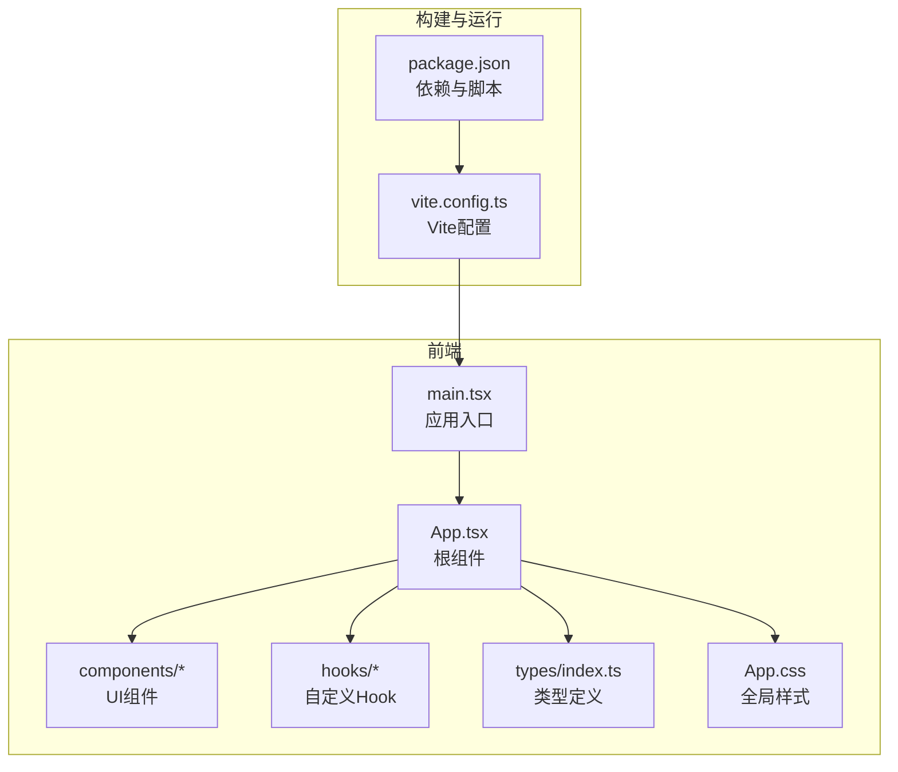
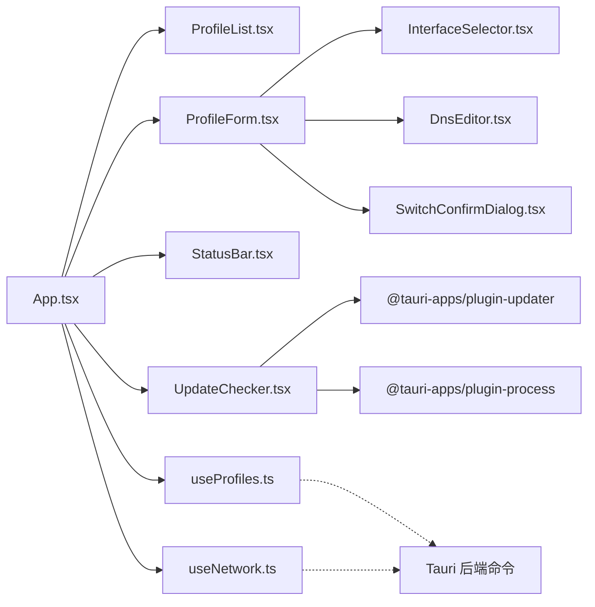
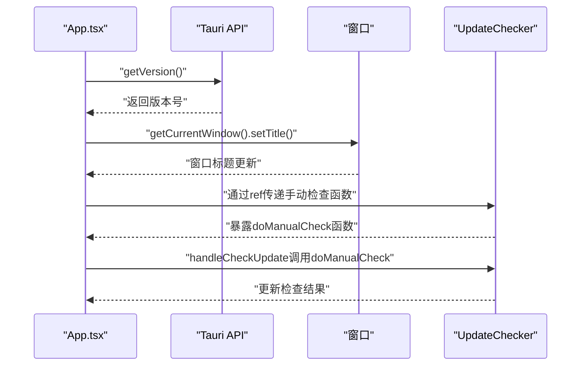
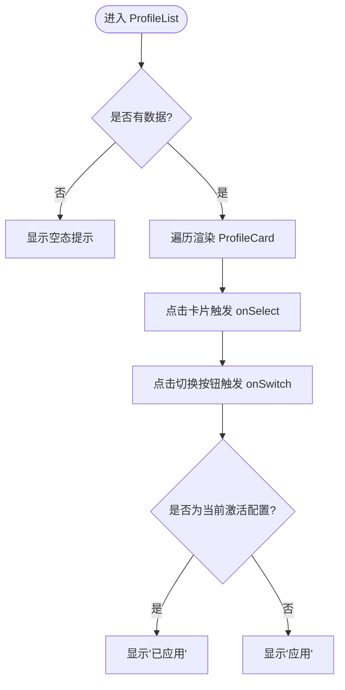
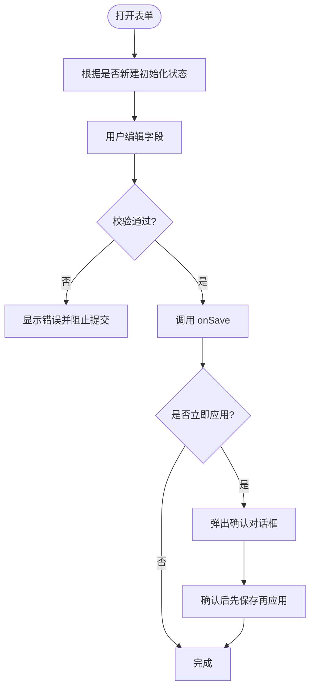
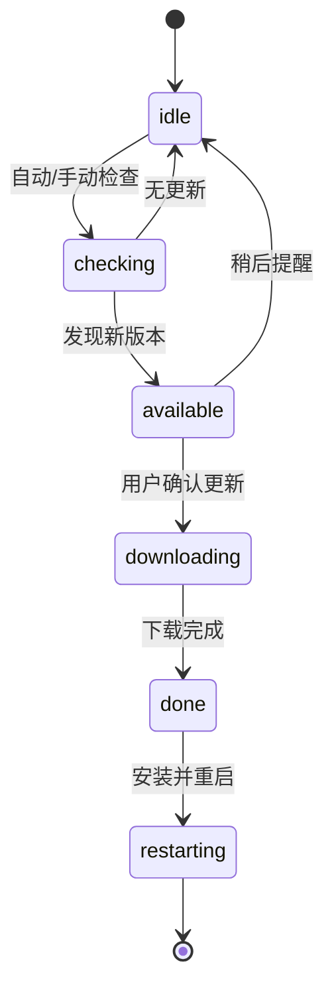
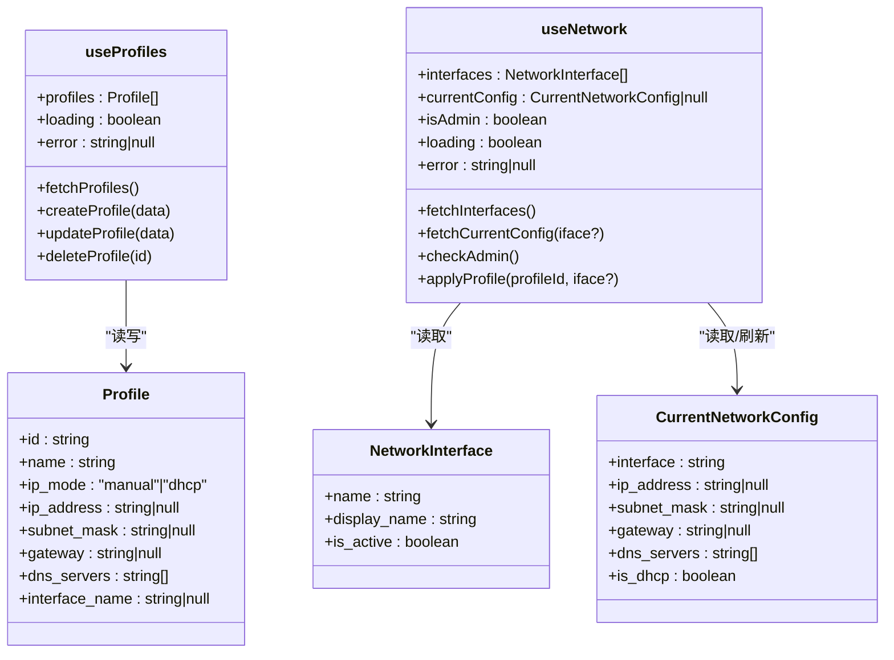
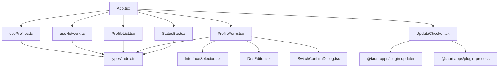

# 前端开发指南

<cite>
**本文引用的文件**
- [src/App.tsx](file://src/App.tsx)
- [src/main.tsx](file://src/main.tsx)
- [src/types/index.ts](file://src/types/index.ts)
- [src/hooks/useNetwork.ts](file://src/hooks/useNetwork.ts)
- [src/hooks/useProfiles.ts](file://src/hooks/useProfiles.ts)
- [src/components/ProfileList.tsx](file://src/components/ProfileList.tsx)
- [src/components/ProfileForm.tsx](file://src/components/ProfileForm.tsx)
- [src/components/ProfileCard.tsx](file://src/components/ProfileCard.tsx)
- [src/components/InterfaceSelector.tsx](file://src/components/InterfaceSelector.tsx)
- [src/components/DnsEditor.tsx](file://src/components/DnsEditor.tsx)
- [src/components/StatusBar.tsx](file://src/components/StatusBar.tsx)
- [src/components/SwitchConfirmDialog.tsx](file://src/components/SwitchConfirmDialog.tsx)
- [src/components/UpdateChecker.tsx](file://src/components/UpdateChecker.tsx)
- [src/App.css](file://src/App.css)
- [package.json](file://package.json)
- [vite.config.ts](file://vite.config.ts)
</cite>

## 目录
1. [简介](#简介)
2. [项目结构](#项目结构)
3. [核心组件](#核心组件)
4. [架构总览](#架构总览)
5. [组件详解](#组件详解)
6. [依赖关系分析](#依赖关系分析)
7. [性能与优化](#性能与优化)
8. [调试与故障排查](#调试与故障排查)
9. [结论](#结论)
10. [附录](#附录)

## 简介
本指南面向IPSwitcher前端开发者，系统讲解基于React + Tauri的桌面应用前端架构与开发实践。内容覆盖组件结构、Hooks使用模式、状态管理策略、组件间通信、UI样式与可访问性、性能优化与调试方法等，帮助你快速理解并高效扩展该应用。

## 项目结构
前端采用按功能分层的目录组织：组件层(components)、自定义Hook层(hooks)、类型定义(types)、入口(main.tsx/App.tsx)与全局样式(App.css)。构建工具使用Vite，运行时通过@tauri-apps/api调用后端能力。

图表来源
- [src/main.tsx:1-11](file://src/main.tsx#L1-L11)
- [src/App.tsx:1-235](file://src/App.tsx#L1-L235)
- [src/App.css:1-769](file://src/App.css#L1-L769)
- [vite.config.ts:1-25](file://vite.config.ts#L1-L25)
- [package.json:1-29](file://package.json#L1-L29)

章节来源
- [src/main.tsx:1-11](file://src/main.tsx#L1-L11)
- [src/App.tsx:1-235](file://src/App.tsx#L1-L235)
- [src/App.css:1-769](file://src/App.css#L1-L769)
- [vite.config.ts:1-25](file://vite.config.ts#L1-L25)
- [package.json:1-29](file://package.json#L1-L29)

## 核心组件
- 根组件 App：负责聚合数据与行为，协调侧边列表、表单与状态栏，并处理托盘事件。**新增**：集成动态版本显示功能和UpdateChecker组件，通过Tauri getVersion() API获取版本号并设置窗口标题，提供手动更新检查功能。
- 自定义Hook useProfiles/useNetwork：封装与后端交互的逻辑，统一错误、加载与数据刷新。
- 组件体系：ProfileList/ProfileCard 负责配置方案的浏览与切换；ProfileForm 提供完整的配置编辑与应用流程；InterfaceSelector/DnsEditor 提供细粒度的输入控件；StatusBar 展示当前网络状态与应用版本，**新增**：支持手动更新检查按钮；SwitchConfirmDialog 提供切换确认对话框；**新增**：UpdateChecker 提供完整的自动和手动更新检查功能，**新增**：集成进程管理插件实现自动重启功能。

章节来源
- [src/App.tsx:13-235](file://src/App.tsx#L13-L235)
- [src/hooks/useProfiles.ts:1-117](file://src/hooks/useProfiles.ts#L1-L117)
- [src/hooks/useNetwork.ts:1-99](file://src/hooks/useNetwork.ts#L1-L99)

## 架构总览
应用采用"容器组件 + 展示组件"的分层模式，容器组件（如App）负责状态与副作用，展示组件（如ProfileForm）专注渲染与用户交互。数据流通过props向下传递，事件回调向上冒泡，配合自定义Hook集中处理异步与错误。**新增**：UpdateChecker组件通过ref机制与App组件通信，实现手动更新检查功能，**新增**：集成@tauri-apps/plugin-process插件实现应用自动重启。

图表来源
- [src/App.tsx:13-235](file://src/App.tsx#L13-L235)
- [src/components/ProfileList.tsx:13-52](file://src/components/ProfileList.tsx#L13-L52)
- [src/components/ProfileForm.tsx:30-357](file://src/components/ProfileForm.tsx#L30-L357)
- [src/components/InterfaceSelector.tsx:9-34](file://src/components/InterfaceSelector.tsx#L9-L34)
- [src/components/DnsEditor.tsx:8-79](file://src/components/DnsEditor.tsx#L8-L79)
- [src/components/SwitchConfirmDialog.tsx:11-89](file://src/components/SwitchConfirmDialog.tsx#L11-L89)
- [src/components/StatusBar.tsx:12-66](file://src/components/StatusBar.tsx#L12-L66)
- [src/components/UpdateChecker.tsx:10-203](file://src/components/UpdateChecker.tsx#L10-L203)
- [src/hooks/useProfiles.ts:5-117](file://src/hooks/useProfiles.ts#L5-L117)
- [src/hooks/useNetwork.ts:5-99](file://src/hooks/useNetwork.ts#L5-L99)

## 组件详解

### App 根组件
- 职责
  - 管理选中的配置项、创建/编辑态
  - **新增**：获取并显示应用版本信息，设置窗口标题
  - **新增**：集成UpdateChecker组件，提供手动更新检查功能
  - 调用 useProfiles/useNetwork 获取数据与动作
  - 处理托盘事件（新建、切换）
  - 渲染侧边栏、主内容区与状态栏
- 关键点
  - 使用回调函数缓存（useCallback）避免不必要重渲染
  - 通过事件监听器订阅托盘消息，驱动UI行为
  - 错误提示统一显示在欢迎占位区域下方
  - **新增**：在组件挂载时通过Tauri getVersion() API获取版本号，并使用getCurrentWindow().setTitle()设置窗口标题
  - **新增**：通过useRef和checkUpdateRef实现UpdateChecker与App之间的双向通信
  - **新增**：StatusBar组件接收handleCheckUpdate回调和checking状态，实现完整的更新检查流程

图表来源
- [src/App.tsx:40-45](file://src/App.tsx#L40-L45)
- [src/App.tsx:47-54](file://src/App.tsx#L47-L54)
- [src/App.tsx:224-231](file://src/App.tsx#L224-L231)

章节来源
- [src/App.tsx:13-235](file://src/App.tsx#L13-L235)

### ProfileList 与 ProfileCard
- ProfileList
  - 接收 profiles、selectedId、loading、回调
  - 支持新建按钮与空态/加载态
  - 将每个 Profile 交给 ProfileCard 渲染
- ProfileCard
  - 展示名称、模式（手动/DHCP）、摘要与接口
  - 支持选中态样式与"切换"按钮
  - **优化**：按钮状态根据是否为当前激活配置动态显示"已应用"/"应用"

图表来源
- [src/components/ProfileList.tsx:13-52](file://src/components/ProfileList.tsx#L13-L52)
- [src/components/ProfileCard.tsx:10-58](file://src/components/ProfileCard.tsx#L10-L58)

章节来源
- [src/components/ProfileList.tsx:1-52](file://src/components/ProfileList.tsx#L1-L52)
- [src/components/ProfileCard.tsx:1-58](file://src/components/ProfileCard.tsx#L1-L58)

### ProfileForm 表单组件
- 功能
  - 编辑/新建配置方案
  - IP模式切换（手动/DHCP）
  - 输入校验（名称唯一、接口必选、IPv4格式、DNS格式）
  - 保存、删除、立即应用、确认对话框
- 设计要点
  - 内部本地状态管理（表单字段、保存中、错误）
  - 与父组件通过 onSave/onDelete/onApply/onCancel 通信
  - 手动模式下渲染子段落与 DNS 编辑器

图表来源
- [src/components/ProfileForm.tsx:30-357](file://src/components/ProfileForm.tsx#L30-L357)
- [src/components/DnsEditor.tsx:8-79](file://src/components/DnsEditor.tsx#L8-L79)
- [src/components/SwitchConfirmDialog.tsx:11-89](file://src/components/SwitchConfirmDialog.tsx#L11-L89)

章节来源
- [src/components/ProfileForm.tsx:1-357](file://src/components/ProfileForm.tsx#L1-L357)
- [src/components/DnsEditor.tsx:1-79](file://src/components/DnsEditor.tsx#L1-L79)
- [src/components/SwitchConfirmDialog.tsx:1-89](file://src/components/SwitchConfirmDialog.tsx#L1-L89)

### InterfaceSelector 与 DnsEditor
- InterfaceSelector
  - 下拉选择网络接口，显示活跃标记与原始名称
- DnsEditor
  - 支持增删改DNS条目，回车快捷添加

章节来源
- [src/components/InterfaceSelector.tsx:1-34](file://src/components/InterfaceSelector.tsx#L1-L34)
- [src/components/DnsEditor.tsx:1-79](file://src/components/DnsEditor.tsx#L1-L79)

### StatusBar 状态栏
- 显示当前接口、IP、模式（DHCP/静态）、网关与连接状态指示灯
- **新增**：显示应用版本信息，格式为"vX.Y.Z"
- **新增**：提供手动更新检查按钮，支持禁用状态和检查中状态
- **新增**：接收handleCheckUpdate回调和checking状态，实现完整的更新检查流程
- 加载态与未知态分别提示

章节来源
- [src/components/StatusBar.tsx:1-67](file://src/components/StatusBar.tsx#L1-L67)

### UpdateChecker 更新检查组件
- **新增**：完整的自动和手动更新检查功能，**新增**：集成进程管理插件实现自动重启
- 功能特性
  - 自动检查：组件挂载后3秒延迟自动检查更新
  - 手动检查：通过ref机制暴露doManualCheck函数供父组件调用
  - 多阶段状态管理：idle/checking/available/downloading/done/restarting
  - 下载进度跟踪：实时显示下载进度百分比
  - 用户界面：Toast提示、模态对话框、进度条
  - **新增**：自动重启功能：通过@tauri-apps/plugin-process插件实现应用自动重启
  - **新增**：降级处理：重启失败时提示用户手动重启
- 交互流程
  - 自动检查：检查更新可用性，显示Toast提示已是最新版本
  - 手动检查：用户点击"检查更新"按钮，显示检查中状态
  - 更新下载：下载完成后显示安装选项
  - 应用重启：重启应用以应用新版本，**新增**：失败时降级处理

图表来源
- [src/components/UpdateChecker.tsx:4-117](file://src/components/UpdateChecker.tsx#L4-L117)

章节来源
- [src/components/UpdateChecker.tsx:1-203](file://src/components/UpdateChecker.tsx#L1-L203)

### 自定义Hook：useProfiles 与 useNetwork
- useProfiles
  - 列表：list_profiles
  - 创建：create_profile（参数映射为后端枚举）
  - 更新：update_profile（参数映射为后端枚举）
  - 删除：delete_profile
  - 生命周期：首次挂载自动拉取
- useNetwork
  - 列表接口：list_network_interfaces
  - 当前配置：get_current_network_config（定时轮询活跃接口）
  - 权限检查：check_admin_status
  - 应用配置：apply_profile（成功后刷新当前配置）

图表来源
- [src/hooks/useProfiles.ts:5-117](file://src/hooks/useProfiles.ts#L5-L117)
- [src/hooks/useNetwork.ts:5-99](file://src/hooks/useNetwork.ts#L5-L99)
- [src/types/index.ts:1-30](file://src/types/index.ts#L1-L30)

章节来源
- [src/hooks/useProfiles.ts:1-117](file://src/hooks/useProfiles.ts#L1-L117)
- [src/hooks/useNetwork.ts:1-99](file://src/hooks/useNetwork.ts#L1-L99)
- [src/types/index.ts:1-30](file://src/types/index.ts#L1-L30)

## 依赖关系分析
- 组件依赖
  - App 依赖 useProfiles/useNetwork 与多个子组件，**新增**：依赖UpdateChecker组件
  - ProfileForm 依赖 InterfaceSelector、DnsEditor、SwitchConfirmDialog
  - **新增**：UpdateChecker 依赖 @tauri-apps/plugin-updater 和 @tauri-apps/plugin-process 插件
- 类型依赖
  - 所有组件共享 types/index.ts 中的接口定义
- 运行时依赖
  - @tauri-apps/api 用于调用后端命令
  - @tauri-apps/plugin-updater 用于更新检查功能
  - @tauri-apps/plugin-process 用于应用重启
  - @tauri-apps/plugin-shell 用于系统操作
  - Vite 作为开发服务器与打包工具

图表来源
- [src/App.tsx:13-235](file://src/App.tsx#L13-L235)
- [src/hooks/useProfiles.ts:1-117](file://src/hooks/useProfiles.ts#L1-L117)
- [src/hooks/useNetwork.ts:1-99](file://src/hooks/useNetwork.ts#L1-L99)
- [src/components/ProfileList.tsx:1-52](file://src/components/ProfileList.tsx#L1-L52)
- [src/components/ProfileForm.tsx:1-357](file://src/components/ProfileForm.tsx#L1-L357)
- [src/components/InterfaceSelector.tsx:1-34](file://src/components/InterfaceSelector.tsx#L1-L34)
- [src/components/DnsEditor.tsx:1-79](file://src/components/DnsEditor.tsx#L1-L79)
- [src/components/SwitchConfirmDialog.tsx:1-89](file://src/components/SwitchConfirmDialog.tsx#L1-L89)
- [src/components/StatusBar.tsx:1-67](file://src/components/StatusBar.tsx#L1-L67)
- [src/components/UpdateChecker.tsx:1-203](file://src/components/UpdateChecker.tsx#L1-L203)
- [src/types/index.ts:1-30](file://src/types/index.ts#L1-L30)

章节来源
- [src/App.tsx:13-235](file://src/App.tsx#L13-L235)
- [src/types/index.ts:1-30](file://src/types/index.ts#L1-L30)

## 性能与优化
- 回调稳定化
  - 使用 useCallback 包装事件处理器与异步动作，减少子组件重渲染
- 数据获取策略
  - useNetwork 对活跃接口进行定时轮询，避免频繁全量刷新
  - useProfiles 首次挂载拉取，避免重复请求
  - **新增**：版本信息只在组件挂载时获取一次，避免重复请求
  - **新增**：UpdateChecker组件通过ref机制避免重复创建函数
  - **新增**：自动重启功能使用懒加载导入@tauri-apps/plugin-process，减少初始包体积
- 渲染优化
  - 列表使用 key=profile.id，确保卡片更新最小化
  - 表单内部状态局部化，仅在需要时触发重渲染
  - **优化**：ProfileCard按钮状态根据isActive属性动态计算，避免不必要的重新渲染
  - **新增**：StatusBar组件的版本显示和按钮状态通过props传递，避免不必要的重渲染
  - **新增**：UpdateChecker组件的状态管理使用useState和useEffect，避免不必要的重渲染
- 样式与布局
  - 使用 CSS 变量统一主题色，便于维护与暗色适配
  - 滚动条与交互反馈使用过渡动画，提升体验
  - **新增**：版本显示样式类支持紧凑的版本信息展示
  - **新增**：更新检查相关样式类提供一致的视觉反馈
  - **新增**：自动重启状态的样式支持，提供清晰的用户反馈

章节来源
- [src/App.tsx:47-54](file://src/App.tsx#L47-L54)
- [src/hooks/useNetwork.ts:76-86](file://src/hooks/useNetwork.ts#L76-L86)
- [src/hooks/useProfiles.ts:103-105](file://src/hooks/useProfiles.ts#L103-L105)
- [src/components/ProfileCard.tsx:24-58](file://src/components/ProfileCard.tsx#L24-L58)
- [src/components/StatusBar.tsx:12-22](file://src/components/StatusBar.tsx#L12-L22)
- [src/components/UpdateChecker.tsx:104](file://src/components/UpdateChecker.tsx#L104)

## 调试与故障排查
- 错误处理
  - useProfiles/useNetwork 在调用失败时设置 error 并抛出异常
  - App 在欢迎区显示错误提示
  - **新增**：UpdateChecker组件在检查更新失败时记录错误日志
  - **新增**：自动重启失败时提供降级处理，提示用户手动重启
- 日志与诊断
  - 失败场景打印错误到控制台，便于定位
  - **新增**：版本获取失败时，应用仍可正常运行，但窗口标题可能显示为空
  - **新增**：更新检查过程中的所有错误都会被console.error记录
  - **新增**：自动重启过程中的错误会被捕获并处理
- 常见问题
  - 无法获取网络状态：检查后端命令是否可用与权限
  - 应用失败：确认已选择接口且表单校验通过
  - 托盘事件未生效：确认事件监听已注册且 payload 正确
  - **新增**：版本信息不显示：检查Tauri配置和getVersion() API是否可用
  - **新增**：更新检查按钮无响应：检查UpdateChecker组件是否正确渲染和ref传递
  - **新增**：更新下载失败：检查网络连接和@tauri-apps/plugin-updater插件配置
  - **新增**：自动重启失败：检查@tauri-apps/plugin-process插件权限和配置
  - **新增**：重启降级处理：当自动重启失败时，应用会提示用户手动重启

章节来源
- [src/hooks/useProfiles.ts:16-19](file://src/hooks/useProfiles.ts#L16-L19)
- [src/hooks/useNetwork.ts:62-66](file://src/hooks/useNetwork.ts#L62-L66)
- [src/App.tsx:215-219](file://src/App.tsx#L215-L219)
- [src/App.tsx:96-98](file://src/App.tsx#L96-L98)
- [src/components/UpdateChecker.tsx:30-33](file://src/components/UpdateChecker.tsx#L30-L33)
- [src/components/UpdateChecker.tsx:106-110](file://src/components/UpdateChecker.tsx#L106-110)

## 结论
本指南梳理了IPSwitcher前端的整体架构与关键实现，强调了容器组件与展示组件的职责分离、自定义Hook对数据与副作用的集中管理、以及组件间清晰的通信路径。**新增**的动态版本显示功能和UpdateChecker组件显著增强了应用的专业性和用户体验。**新增**的进程管理集成和自动重启功能进一步提升了应用的健壮性和用户友好性。遵循本文的最佳实践与优化建议，可帮助你在保证可维护性的前提下快速迭代功能。

## 附录

### 类型定义概览
- Profile：配置方案实体
- NetworkInterface：网络接口
- CurrentNetworkConfig：当前网络配置
- IpMode：IP模式枚举

章节来源
- [src/types/index.ts:1-30](file://src/types/index.ts#L1-L30)

### 开发与构建
- 启动开发服务器：npm run dev
- 构建产物：npm run build
- 预览：npm run preview
- Tauri 原生集成：npm run tauri

### 版本显示样式类
**新增**：应用版本显示相关的CSS样式类

- `.status-version`：状态栏版本显示样式，11px字体大小，灰色文本
- `.status-check-update`：状态栏更新检查按钮样式，11px字体大小，蓝色链接样式
- `.update-toast`：更新提示Toast样式，固定在右下角，带阴影效果
- `.update-overlay`：更新对话框遮罩层样式，全屏覆盖
- `.update-dialog`：更新对话框主体样式，居中显示
- `.update-dialog-title`：更新对话框标题样式，16px字体大小，加粗
- `.update-dialog-body`：更新对话框内容区域样式，13px字体大小
- `.update-version`：版本信息样式，14px字体大小
- `.update-notes`：更新说明容器样式
- `.update-notes-label`：更新说明标签样式，13px字体大小，加粗
- `.update-notes-content`：更新说明内容样式，13px字体大小
- `.update-progress`：下载进度样式，居中显示
- `.update-progress-bar`：进度条容器样式
- `.update-progress-fill`：进度条填充样式，100%宽度
- `.update-progress-text`：进度文本样式，13px字体大小，加粗
- `.update-actions`：对话框操作按钮样式，flex布局，间距8px
- 支持紧凑的版本信息展示，字体大小13px，灰色文本

章节来源
- [src/App.css:575-598](file://src/App.css#L575-L598)
- [src/App.css:721-747](file://src/App.css#L721-L747)
- [src/App.css:624-719](file://src/App.css#L624-L719)
- [package.json:12-18](file://package.json#L12-L18)
- [vite.config.ts:6-24](file://vite.config.ts#L6-L24)

### 更新检查组件状态管理
**新增**：UpdateChecker组件的状态管理机制

- `stage`：更新检查阶段，支持 idle/checking/available/downloading/done/restarting
- `update`：更新信息对象，包含版本号、更新说明等
- `progress`：下载进度百分比
- `showUpToDate`：是否显示"已是最新版本"提示
- 通过ref机制与父组件通信，实现手动更新检查功能
- **新增**：支持自动重启状态管理，提供清晰的用户反馈

章节来源
- [src/components/UpdateChecker.tsx:4-16](file://src/components/UpdateChecker.tsx#L4-L16)
- [src/components/UpdateChecker.tsx:36-46](file://src/components/UpdateChecker.tsx#L36-L46)
- [src/App.tsx:36-54](file://src/App.tsx#L36-L54)

### 进程管理集成
**新增**：UpdateChecker组件的进程管理功能

- **依赖**：@tauri-apps/plugin-process 插件
- **功能**：通过relaunch()函数实现应用自动重启
- **降级处理**：重启失败时提示用户手动重启
- **懒加载**：使用动态import()减少初始包体积
- **错误处理**：捕获重启过程中的所有异常

章节来源
- [src/components/UpdateChecker.tsx:104](file://src/components/UpdateChecker.tsx#L104)
- [src/components/UpdateChecker.tsx:106-110](file://src/components/UpdateChecker.tsx#L106-110)
- [package.json:14](file://package.json#L14)