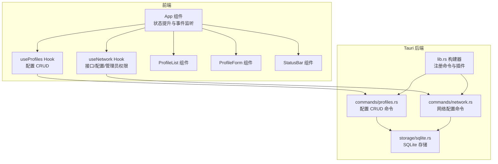
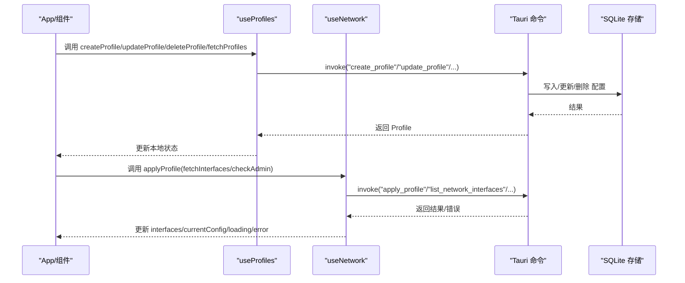
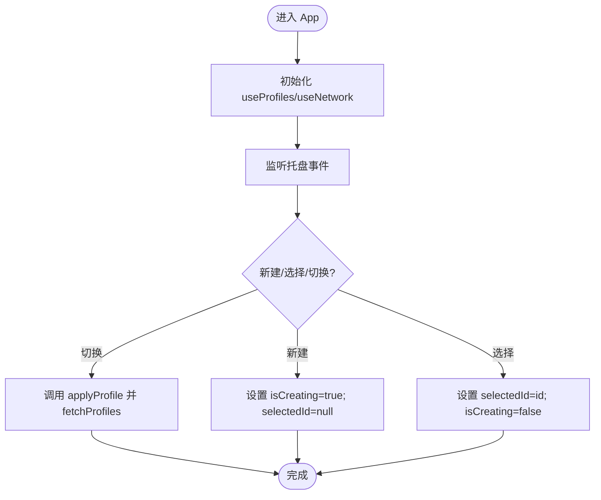
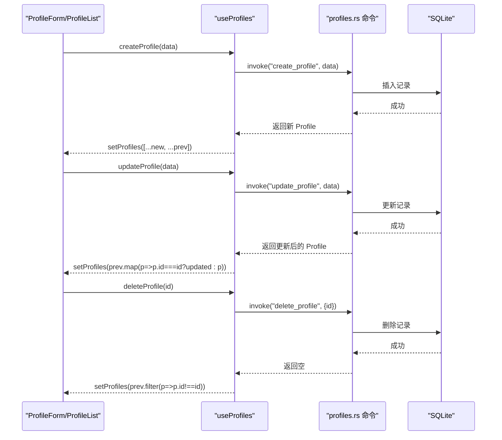
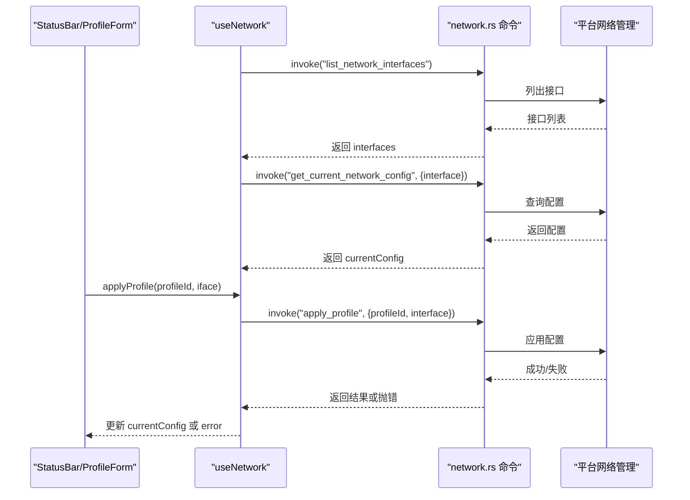
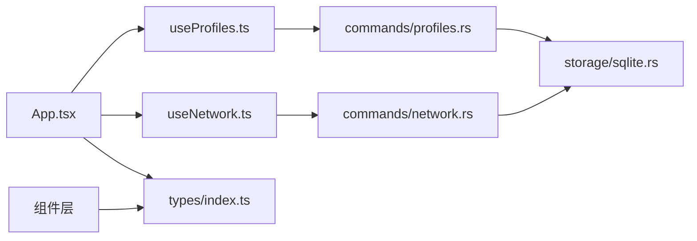

# 状态管理策略

<cite>
**本文引用的文件**
- [src/App.tsx](file://src/App.tsx)
- [src/main.tsx](file://src/main.tsx)
- [src/hooks/useProfiles.ts](file://src/hooks/useProfiles.ts)
- [src/hooks/useNetwork.ts](file://src/hooks/useNetwork.ts)
- [src/types/index.ts](file://src/types/index.ts)
- [src/components/ProfileList.tsx](file://src/components/ProfileList.tsx)
- [src/components/ProfileForm.tsx](file://src/components/ProfileForm.tsx)
- [src/components/StatusBar.tsx](file://src/components/StatusBar.tsx)
- [src-tauri/src/lib.rs](file://src-tauri/src/lib.rs)
- [src-tauri/src/commands/profiles.rs](file://src-tauri/src/commands/profiles.rs)
- [src-tauri/src/commands/network.rs](file://src-tauri/src/commands/network.rs)
- [src-tauri/src/storage/sqlite.rs](file://src-tauri/src/storage/sqlite.rs)
</cite>

## 目录
1. [简介](#简介)
2. [项目结构](#项目结构)
3. [核心组件](#核心组件)
4. [架构总览](#架构总览)
5. [详细组件分析](#详细组件分析)
6. [依赖关系分析](#依赖关系分析)
7. [性能考量](#性能考量)
8. [故障排查指南](#故障排查指南)
9. [结论](#结论)
10. [附录](#附录)

## 简介
本文件系统性梳理 IPSwitcher 的状态管理策略，围绕以下目标展开：状态组织结构、数据流向与状态更新机制；全局状态与局部状态的划分原则；React 状态提升、Context 使用与状态持久化策略；异步状态处理、Loading 状态管理与错误边界处理；状态调试与追踪方法；以及性能优化与内存泄漏防范、最佳实践与重构建议。

## 项目结构
应用采用前端（React + Tauri）与后端（Rust 命令层 + SQLite 存储）分层设计。前端通过自定义 Hook 将网络与配置两类状态抽象为可复用的数据层，再由 App 组件进行状态提升与协调；后端通过 Tauri 暴露命令，供前端异步调用执行网络操作与数据库读写。

图表来源
- [src/App.tsx:10-195](file://src/App.tsx#L10-L195)
- [src/hooks/useProfiles.ts:5-116](file://src/hooks/useProfiles.ts#L5-L116)
- [src/hooks/useNetwork.ts:5-99](file://src/hooks/useNetwork.ts#L5-L99)
- [src-tauri/src/lib.rs:14-49](file://src-tauri/src/lib.rs#L14-L49)
- [src-tauri/src/commands/profiles.rs:9-112](file://src-tauri/src/commands/profiles.rs#L9-L112)
- [src-tauri/src/commands/network.rs:9-100](file://src-tauri/src/commands/network.rs#L9-L100)
- [src-tauri/src/storage/sqlite.rs:8-256](file://src-tauri/src/storage/sqlite.rs#L8-L256)

章节来源
- [src/main.tsx:1-11](file://src/main.tsx#L1-L11)
- [src/App.tsx:10-195](file://src/App.tsx#L10-L195)
- [src-tauri/src/lib.rs:14-49](file://src-tauri/src/lib.rs#L14-L49)

## 核心组件
- 全局状态与状态提升
  - App 组件持有“选中配置项 ID”、“是否新建”等 UI 层状态，并作为状态提升中心，向下传递给 ProfileList、ProfileForm、StatusBar。
  - 通过回调函数（如 handleSelectProfile、handleSwitch、handleSave、handleDelete、handleConfirmApply）在 App 中统一协调行为，避免跨层级重复维护状态。
- Hook 抽象
  - useProfiles：封装配置列表、创建、更新、删除、加载与错误状态，暴露统一的异步 API。
  - useNetwork：封装网络接口列表、当前配置、管理员权限检查、应用配置、定时刷新与错误状态。
- 类型模型
  - Profile、NetworkInterface、CurrentNetworkConfig、IpMode 等类型定义了前后端交互的数据契约。

章节来源
- [src/App.tsx:11-27](file://src/App.tsx#L11-L27)
- [src/hooks/useProfiles.ts:5-116](file://src/hooks/useProfiles.ts#L5-L116)
- [src/hooks/useNetwork.ts:5-99](file://src/hooks/useNetwork.ts#L5-L99)
- [src/types/index.ts:1-30](file://src/types/index.ts#L1-L30)

## 架构总览
前端通过 Tauri invoke 调用后端命令，命令层访问存储层完成数据持久化与网络配置应用。App 统一协调 UI 行为与状态更新，形成“Hook 提供数据 + 组件消费数据 + 事件驱动更新”的闭环。

图表来源
- [src/hooks/useProfiles.ts:10-101](file://src/hooks/useProfiles.ts#L10-L101)
- [src/hooks/useNetwork.ts:13-69](file://src/hooks/useNetwork.ts#L13-L69)
- [src-tauri/src/commands/profiles.rs:9-112](file://src-tauri/src/commands/profiles.rs#L9-L112)
- [src-tauri/src/commands/network.rs:9-100](file://src-tauri/src/commands/network.rs#L9-L100)
- [src-tauri/src/storage/sqlite.rs:146-232](file://src-tauri/src/storage/sqlite.rs#L146-L232)

## 详细组件分析

### App 组件：状态提升与事件协调
- 职责
  - 维护 UI 层状态：selectedId、isCreating。
  - 协调行为：选择配置、新建、保存、删除、切换、确认应用。
  - 处理系统托盘事件：监听“新建”和“切换”事件，触发相应 UI 行为。
- 数据流
  - 从 useProfiles 与 useNetwork 获取 profiles、interfaces、currentConfig、loading、error。
  - 通过回调函数将用户操作转化为对 Hook 的调用，并在成功后刷新数据。
- 错误处理
  - 在切换/应用失败时记录日志，保持 UI 反馈与状态稳定。

图表来源
- [src/App.tsx:115-143](file://src/App.tsx#L115-L143)
- [src/App.tsx:32-113](file://src/App.tsx#L32-L113)

章节来源
- [src/App.tsx:11-149](file://src/App.tsx#L11-L149)

### useProfiles Hook：配置状态与持久化
- 状态
  - profiles：配置数组。
  - loading/error：加载与错误状态。
- 关键能力
  - fetchProfiles：拉取配置列表。
  - createProfile/updateProfile/deleteProfile：基于 invoke 调用后端命令，返回结果并更新本地状态。
- 数据一致性
  - 创建/更新/删除均通过后端校验与存储，前端仅做乐观更新与回滚。

图表来源
- [src/hooks/useProfiles.ts:10-101](file://src/hooks/useProfiles.ts#L10-L101)
- [src-tauri/src/commands/profiles.rs:24-112](file://src-tauri/src/commands/profiles.rs#L24-L112)
- [src-tauri/src/storage/sqlite.rs:146-232](file://src-tauri/src/storage/sqlite.rs#L146-L232)

章节来源
- [src/hooks/useProfiles.ts:5-116](file://src/hooks/useProfiles.ts#L5-L116)
- [src-tauri/src/commands/profiles.rs:9-112](file://src-tauri/src/commands/profiles.rs#L9-L112)
- [src-tauri/src/storage/sqlite.rs:146-232](file://src-tauri/src/storage/sqlite.rs#L146-L232)

### useNetwork Hook：网络状态与异步应用
- 状态
  - interfaces：网络接口列表。
  - currentConfig：当前网络配置。
  - isAdmin：管理员权限状态。
  - loading/error：加载与错误状态。
- 关键能力
  - fetchInterfaces：列出可用接口。
  - fetchCurrentConfig：查询当前配置。
  - checkAdmin：检查管理员权限。
  - applyProfile：应用配置（支持 DHCP/静态），并在成功后刷新当前配置。
- 自动刷新
  - 发现活动接口后，每 30 秒自动刷新一次当前配置，确保 UI 与实际一致。

图表来源
- [src/hooks/useNetwork.ts:13-86](file://src/hooks/useNetwork.ts#L13-L86)
- [src-tauri/src/commands/network.rs:9-100](file://src-tauri/src/commands/network.rs#L9-L100)

章节来源
- [src/hooks/useNetwork.ts:5-99](file://src/hooks/useNetwork.ts#L5-L99)
- [src-tauri/src/commands/network.rs:9-100](file://src-tauri/src/commands/network.rs#L9-L100)

### 组件层：局部状态与数据消费
- ProfileList：消费 profiles、selectedId、loading，向父级传递选择与切换事件。
- ProfileForm：局部表单状态（名称、IP 模式、IP/掩码/网关/DNS/接口等），在保存/应用时进行校验与调用父级回调。
- StatusBar：消费 currentConfig 与 loading，渲染当前网络状态。

```mermaid
classDiagram
class App {
+selectedId : string|null
+isCreating : boolean
+handleSelectProfile(id)
+handleNewProfile()
+handleSave(data)
+handleDelete(id)
+handleSwitch(profile)
+handleConfirmApply(profile, iface)
}
class ProfileList {
+profiles : Profile[]
+selectedId : string|null
+loading : boolean
+onSelect(id)
+onSwitch(profile)
+onNew()
}
class ProfileForm {
+name : string
+ipMode : "manual"|"dhcp"
+ipAddress : string
+subnetMask : string
+gateway : string
+dnsServers : string[]
+interfaceName : string
+saving : boolean
+error : string|null
+onSave(data)
+onDelete(id)
+onApply(profile, iface)
+onCancel()
}
class StatusBar {
+config : CurrentNetworkConfig|null
+loading : boolean
}
App --> ProfileList : "props + 回调"
App --> ProfileForm : "props + 回调"
App --> StatusBar : "props"
```

图表来源
- [src/App.tsx:11-149](file://src/App.tsx#L11-L149)
- [src/components/ProfileList.tsx:13-51](file://src/components/ProfileList.tsx#L13-L51)
- [src/components/ProfileForm.tsx:30-345](file://src/components/ProfileForm.tsx#L30-L345)
- [src/components/StatusBar.tsx:8-38](file://src/components/StatusBar.tsx#L8-L38)

章节来源
- [src/components/ProfileList.tsx:1-52](file://src/components/ProfileList.tsx#L1-L52)
- [src/components/ProfileForm.tsx:1-357](file://src/components/ProfileForm.tsx#L1-L357)
- [src/components/StatusBar.tsx:1-39](file://src/components/StatusBar.tsx#L1-L39)

## 依赖关系分析
- 前端依赖
  - App 依赖两个 Hook，二者分别依赖 Tauri 命令。
  - 组件依赖类型定义与父级回调。
- 后端依赖
  - 命令层依赖存储层与平台网络管理。
  - 存储层依赖 SQLite 与 JSON 序列化。

图表来源
- [src/App.tsx:11-27](file://src/App.tsx#L11-L27)
- [src/hooks/useProfiles.ts:10-101](file://src/hooks/useProfiles.ts#L10-L101)
- [src/hooks/useNetwork.ts:13-69](file://src/hooks/useNetwork.ts#L13-L69)
- [src-tauri/src/commands/profiles.rs:9-112](file://src-tauri/src/commands/profiles.rs#L9-L112)
- [src-tauri/src/commands/network.rs:9-100](file://src-tauri/src/commands/network.rs#L9-L100)
- [src-tauri/src/storage/sqlite.rs:146-232](file://src-tauri/src/storage/sqlite.rs#L146-L232)
- [src/types/index.ts:1-30](file://src/types/index.ts#L1-L30)

章节来源
- [src-tauri/src/lib.rs:14-49](file://src-tauri/src/lib.rs#L14-L49)

## 性能考量
- 状态提升与最小化重渲染
  - 将 UI 层状态集中在 App，减少子组件内部状态，降低不必要的重渲染。
  - 使用 useCallback 包装回调，避免因函数引用变化导致子组件重渲染。
- 异步状态与 Loading 管理
  - 在请求开始时设置 loading，在 finally 中关闭，避免 UI 卡死。
  - 对于高频刷新（如网络配置），采用节流/去抖策略或合并请求（当前实现为固定周期轮询，可在 UI 层增加防抖）。
- 订阅与清理
  - useEffect 返回清理函数，确保事件监听与定时器被正确移除，防止内存泄漏。
- 数据持久化与缓存
  - 前端仅缓存当前会话所需数据；后端 SQLite 保证数据持久化与一致性。
  - 对于频繁读取的配置列表，可考虑前端 LRU 缓存以减少 invoke 次数（需注意与后端一致性）。
- 渲染优化
  - 使用 React.memo 或 useMemo 优化 ProfileList/ProfileCard 的渲染。
  - 将不随状态变化的 props 传入子组件，避免无谓更新。

[本节为通用指导，无需特定文件引用]

## 故障排查指南
- 错误边界与错误提示
  - useProfiles/useNetwork 在捕获异常时设置 error 字段，App 中统一展示错误信息。
  - ProfileForm 在保存/应用/删除时捕获异常并显示错误提示。
- 日志与追踪
  - 在 App 的事件监听与 applyProfile 处记录错误日志，便于定位问题。
  - 可引入统一的错误上报（如 Sentry）与埋点，记录关键状态变更时间线。
- 网络状态异常
  - 若 StatusBar 显示“无法获取网络状态”，检查后端命令是否返回有效接口与配置。
  - 确认管理员权限状态与平台网络管理器可用性。
- 数据不一致
  - 应用配置后主动调用 fetchProfiles/fetchCurrentConfig，确保 UI 与后端一致。
- 内存泄漏
  - 确保 useEffect 返回的清理函数被执行（事件解绑、定时器清理）。

章节来源
- [src/App.tsx:182-186](file://src/App.tsx#L182-L186)
- [src/hooks/useProfiles.ts:16-18](file://src/hooks/useProfiles.ts#L16-L18)
- [src/hooks/useNetwork.ts:20-25](file://src/hooks/useNetwork.ts#L20-L25)
- [src/components/ProfileForm.tsx:104-129](file://src/components/ProfileForm.tsx#L104-L129)

## 结论
IPSwitcher 的状态管理遵循“Hook 抽象 + App 状态提升 + 组件消费”的清晰分层：前端负责 UI 状态与行为协调，Hook 负责数据获取与更新，后端负责命令执行与持久化。该策略具备良好的可维护性与扩展性，同时通过错误处理、自动刷新与清理机制保障稳定性。后续可在缓存策略、渲染优化与调试工具方面进一步增强。

[本节为总结，无需特定文件引用]

## 附录

### 全局状态与局部状态划分原则
- 全局状态（App）
  - UI 交互状态：selectedId、isCreating。
  - 顶层行为协调：新建、保存、删除、切换、确认应用。
- 局部状态（组件/Hook）
  - 组件局部表单状态：ProfileForm 的字段状态。
  - 数据层状态：useProfiles/useNetwork 的 loading/error 与数据集合。

章节来源
- [src/App.tsx:29-30](file://src/App.tsx#L29-L30)
- [src/components/ProfileForm.tsx:41-50](file://src/components/ProfileForm.tsx#L41-L50)
- [src/hooks/useProfiles.ts:6-8](file://src/hooks/useProfiles.ts#L6-L8)
- [src/hooks/useNetwork.ts:6-11](file://src/hooks/useNetwork.ts#L6-L11)

### React 状态提升、Context 使用与状态持久化策略
- 状态提升
  - 将共享状态上移到最近公共祖先（App），通过 props 与回调向下传递。
- Context 使用
  - 当前项目未使用 Context；若未来状态树扩大，可考虑将 profiles/loading/error 等下沉至 Context，减少多层 props。
- 状态持久化
  - 前端：仅缓存必要 UI 状态；后端：SQLite 持久化配置数据。
  - 建议：对关键配置增加版本号与校验，避免跨版本不兼容。

章节来源
- [src/App.tsx:11-27](file://src/App.tsx#L11-L27)
- [src-tauri/src/storage/sqlite.rs:146-232](file://src-tauri/src/storage/sqlite.rs#L146-L232)

### 异步状态处理、Loading 管理与错误边界
- 异步状态
  - 请求前设置 loading，finally 关闭；错误时设置 error 并抛出，由调用方捕获。
- Loading 管理
  - 在关键操作（保存、应用、切换）期间禁用按钮，避免重复提交。
- 错误边界
  - 组件内捕获错误并展示；App 层统一展示错误提示；后端命令返回错误时，前端记录并反馈。

章节来源
- [src/hooks/useProfiles.ts:10-21](file://src/hooks/useProfiles.ts#L10-L21)
- [src/hooks/useNetwork.ts:13-38](file://src/hooks/useNetwork.ts#L13-L38)
- [src/components/ProfileForm.tsx:104-129](file://src/components/ProfileForm.tsx#L104-L129)

### 状态调试工具与状态变化追踪
- 日志
  - 在关键路径（事件监听、applyProfile、错误捕获）输出日志，辅助定位问题。
- 时间线追踪
  - 记录“选择/保存/应用/切换”等关键动作的时间戳与参数，便于回放。
- 可视化
  - 可引入 React DevTools Profiler 与 Tauri 开发工具链，观察渲染与命令调用耗时。

章节来源
- [src/App.tsx:115-143](file://src/App.tsx#L115-L143)
- [src/App.tsx:93-99](file://src/App.tsx#L93-L99)

### 最佳实践与重构指南
- 最佳实践
  - 使用 useCallback/useMemo 优化渲染；拆分职责明确的 Hook；统一错误处理与 Loading 管理。
  - 保持前后端数据契约一致，避免类型不匹配导致的运行时错误。
- 重构建议
  - 引入 Context 下沉部分状态，减少 props drilling。
  - 为 Hook 增加测试用例与类型约束，提升可维护性。
  - 对高频命令增加重试与退避策略，提升鲁棒性。

[本节为通用指导，无需特定文件引用]