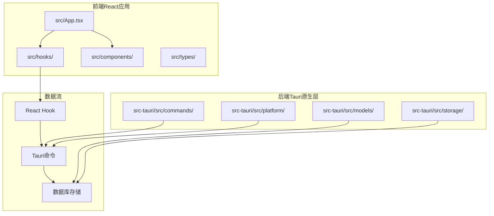
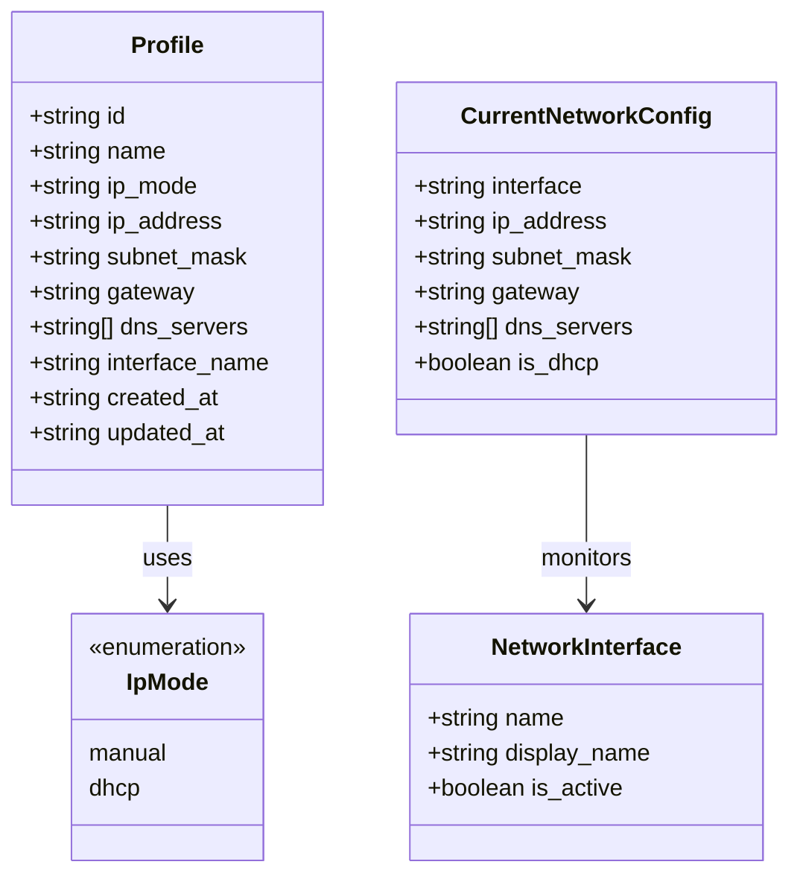
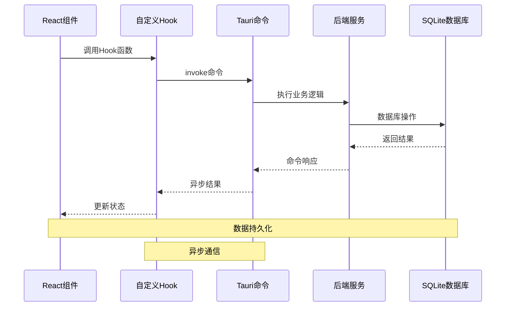
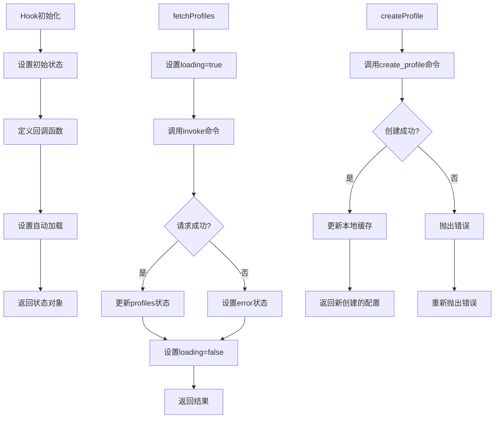
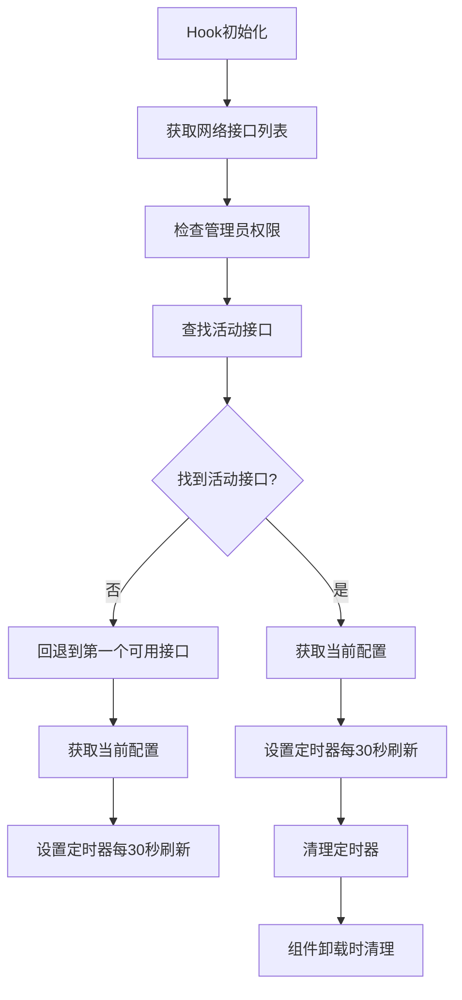
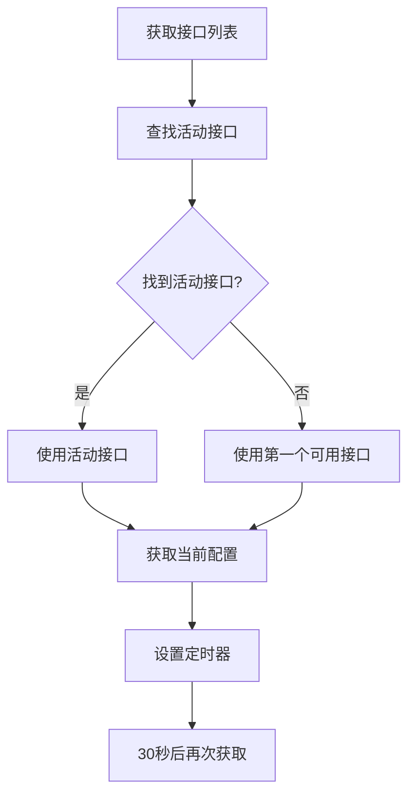
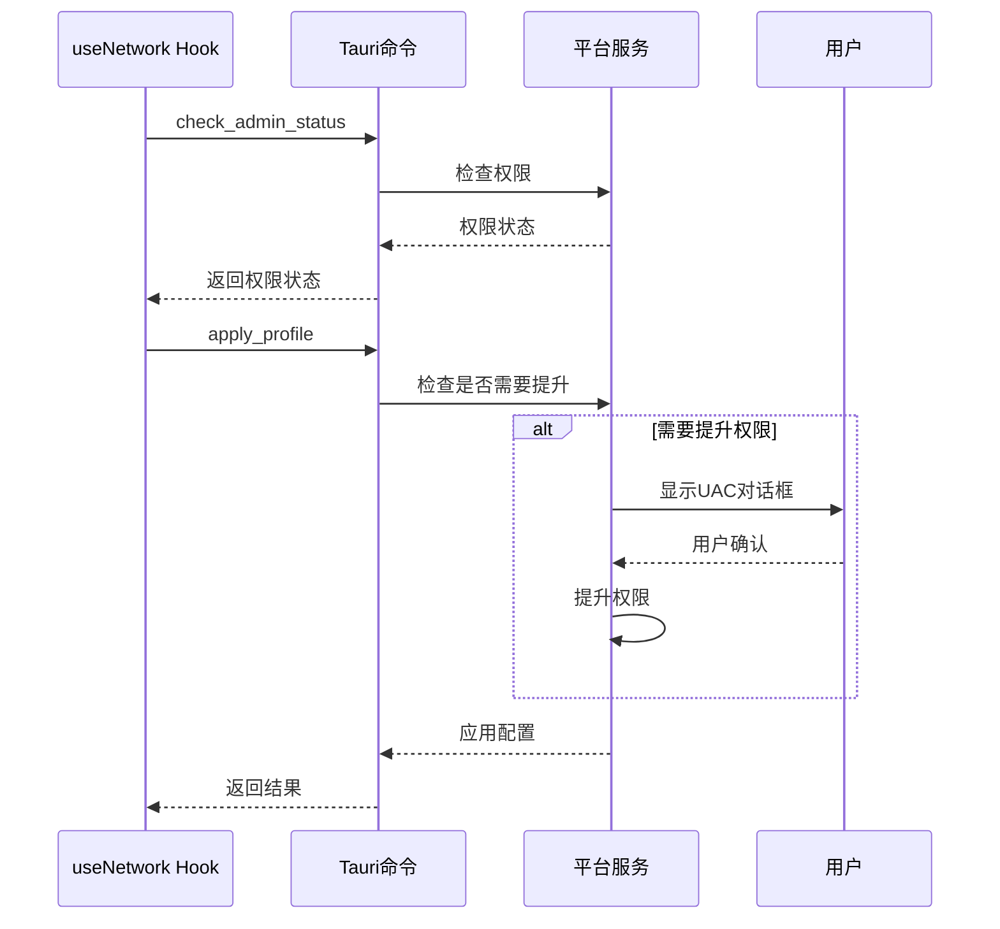
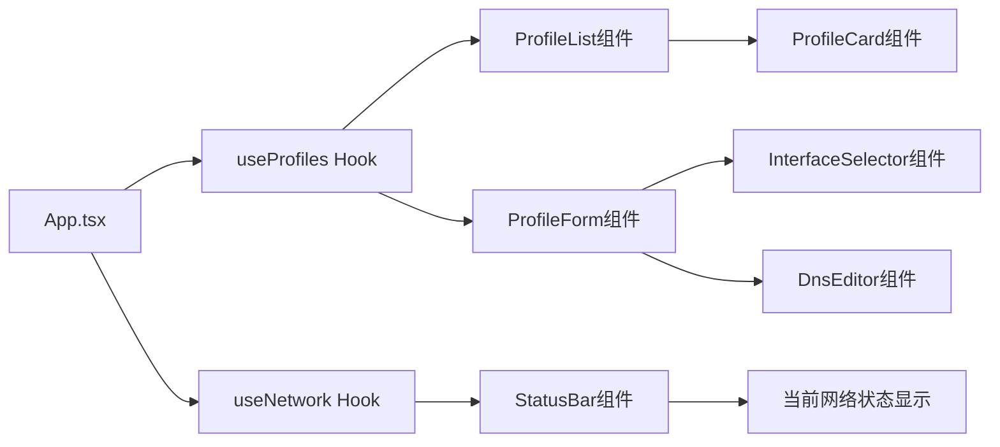
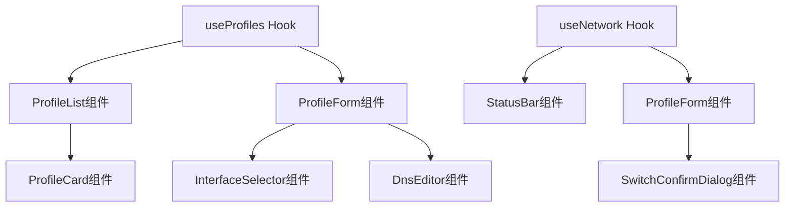

# 自定义Hooks设计

<cite>
**本文档引用的文件**
- [useProfiles.ts](file://src/hooks/useProfiles.ts)
- [useNetwork.ts](file://src/hooks/useNetwork.ts)
- [index.ts](file://src/types/index.ts)
- [App.tsx](file://src/App.tsx)
- [ProfileList.tsx](file://src/components/ProfileList.tsx)
- [ProfileForm.tsx](file://src/components/ProfileForm.tsx)
- [StatusBar.tsx](file://src/components/StatusBar.tsx)
- [profiles.rs](file://src-tauri/src/commands/profiles.rs)
- [network.rs](file://src-tauri/src/commands/network.rs)
- [lib.rs](file://src-tauri/src/lib.rs)
- [package.json](file://package.json)
</cite>

## 更新摘要
**变更内容**
- 更新useNetwork Hook的自动网络配置获取逻辑，改进了接口回退机制
- 新增网络接口回退策略的详细分析
- 更新故障排除指南中的网络检测问题解决方案

## 目录
1. [简介](#简介)
2. [项目结构](#项目结构)
3. [核心组件](#核心组件)
4. [架构概览](#架构概览)
5. [详细组件分析](#详细组件分析)
6. [依赖关系分析](#依赖关系分析)
7. [性能考虑](#性能考虑)
8. [故障排除指南](#故障排除指南)
9. [结论](#结论)
10. [附录](#附录)

## 简介

IPSwitcher是一个基于React和Tauri构建的网络配置切换工具。该项目的核心是两个自定义Hook：`useProfiles`和`useNetwork`，它们为网络配置方案的管理和网络状态监控提供了强大的抽象层。

本指南将深入分析这两个核心Hook的设计思路、实现原理和使用场景，涵盖状态管理策略、副作用处理、数据缓存机制、依赖管理、性能优化和错误处理等方面，并提供最佳实践和扩展方法。

## 项目结构

IPSwitcher采用模块化的项目结构，主要分为前端React应用和后端Tauri原生层两大部分：



**图表来源**
- [App.tsx:1-195](file://src/App.tsx#L1-L195)
- [useProfiles.ts:1-131](file://src/hooks/useProfiles.ts#L1-L131)
- [useNetwork.ts:1-99](file://src/hooks/useNetwork.ts#L1-L99)

**章节来源**
- [package.json:1-27](file://package.json#L1-L27)
- [lib.rs:1-49](file://src-tauri/src/lib.rs#L1-L49)

## 核心组件

### 数据类型定义

项目使用TypeScript定义了核心数据结构，确保类型安全和开发体验：



**图表来源**
- [index.ts:1-30](file://src/types/index.ts#L1-L30)

**章节来源**
- [index.ts:1-30](file://src/types/index.ts#L1-L30)

## 架构概览

IPSwitcher采用了分层架构设计，实现了前端Hook与后端Tauri命令的清晰分离：



**图表来源**
- [useProfiles.ts:20-31](file://src/hooks/useProfiles.ts#L20-L31)
- [useNetwork.ts:28-38](file://src/hooks/useNetwork.ts#L28-L38)
- [lib.rs:36-46](file://src-tauri/src/lib.rs#L36-L46)

## 详细组件分析

### useProfiles Hook 设计分析

`useProfiles` Hook负责网络配置方案的完整生命周期管理，包括CRUD操作和状态同步。

#### 状态管理策略

Hook内部维护了四个核心状态：
- `profiles`: 存储所有配置方案的数组
- `activeProfileId`: 存储当前激活的配置ID
- `loading`: 表示数据加载状态
- `error`: 存储最近的错误信息

#### 实现模式分析



**图表来源**
- [useProfiles.ts:5-131](file://src/hooks/useProfiles.ts#L5-L131)

#### 关键实现特性

1. **状态同步**: 创建和更新操作会立即更新本地状态，避免了不必要的重新加载
2. **错误隔离**: 每个操作都有独立的错误处理，不会相互影响
3. **类型安全**: 使用TypeScript泛型确保与后端命令的参数匹配
4. **活动配置跟踪**: 专门维护当前激活的配置ID，便于UI状态显示

**章节来源**
- [useProfiles.ts:1-131](file://src/hooks/useProfiles.ts#L1-L131)

### useNetwork Hook 设计分析

`useNetwork` Hook专注于网络状态监控和配置应用，具有更复杂的副作用管理。

#### 自动刷新机制

Hook实现了智能的自动刷新策略，**已更新**：



**更新** 改进了接口回退逻辑，当没有检测到活动接口时，会自动回退到第一个可用接口，防止应用在网络检测失败时卡死。

**图表来源**
- [useNetwork.ts:76-86](file://src/hooks/useNetwork.ts#L76-L86)

#### 网络接口回退策略

**新增** Hook现在实现了智能的网络接口选择策略：



这种设计确保了即使在某些平台上无法正确识别活动接口的情况下，应用仍然能够正常工作。

#### 管理员权限处理

Hook通过`checkAdmin`函数检测管理员权限，并在必要时触发UAC提升：



**图表来源**
- [useNetwork.ts:40-47](file://src/hooks/useNetwork.ts#L40-L47)
- [network.rs:53-94](file://src-tauri/src/commands/network.rs#L53-L94)

**章节来源**
- [useNetwork.ts:1-99](file://src/hooks/useNetwork.ts#L1-L99)

### 组件集成模式

#### 主应用中的Hook使用

在主应用中，两个Hook被组合使用以实现完整的功能：



**图表来源**
- [App.tsx:10-27](file://src/App.tsx#L10-L27)
- [ProfileList.tsx:1-52](file://src/components/ProfileList.tsx#L1-L52)
- [ProfileForm.tsx:1-200](file://src/components/ProfileForm.tsx#L1-L200)
- [StatusBar.tsx:1-53](file://src/components/StatusBar.tsx#L1-L53)

**章节来源**
- [App.tsx:1-195](file://src/App.tsx#L1-L195)

## 依赖关系分析

### 外部依赖管理

项目使用了现代化的依赖管理策略：

```mermaid
graph TB
subgraph "React生态系统"
A[React 18.3.1]
B[React DOM 18.3.1]
C[@tauri-apps/api 2.0.0]
end
subgraph "开发工具"
D[@types/react 18.3.3]
E[@types/react-dom 18.3.0]
F[@vitejs/plugin-react 4.3.1]
G[TypeScript 5.5.3]
H[Vite 5.4.0]
end
subgraph "Tauri插件"
I[@tauri-apps/plugin-shell 2.0.0]
end
A --> C
B --> C
D --> A
E --> B
F --> G
H --> G
I --> C
```

**图表来源**
- [package.json:12-25](file://package.json#L12-L25)

### 内部模块依赖

Hook之间的依赖关系相对简单，主要通过React组件进行协调：



**图表来源**
- [useProfiles.ts:1-131](file://src/hooks/useProfiles.ts#L1-L131)
- [useNetwork.ts:1-99](file://src/hooks/useNetwork.ts#L1-L99)
- [ProfileList.tsx:1-52](file://src/components/ProfileList.tsx#L1-L52)
- [ProfileForm.tsx:1-200](file://src/components/ProfileForm.tsx#L1-L200)
- [StatusBar.tsx:1-53](file://src/components/StatusBar.tsx#L1-L53)

**章节来源**
- [package.json:1-27](file://package.json#L1-L27)

## 性能考虑

### Hook性能优化策略

1. **useCallback优化**: 所有异步函数都使用`useCallback`进行记忆化，避免不必要的重渲染
2. **状态局部化**: 每个Hook只管理自己相关的状态，减少全局状态污染
3. **条件加载**: 网络配置的自动刷新仅在有活动接口时启用，**已更新**改进了接口检测逻辑
4. **错误边界**: 错误状态独立管理，不影响其他Hook的功能

### 数据缓存机制

- **本地缓存**: Hook内部维护最新的数据副本，避免重复请求
- **增量更新**: CRUD操作直接更新本地状态，提高响应速度
- **失效策略**: 通过重新加载函数主动刷新过期数据

### 内存管理

- **定时器清理**: 网络状态自动刷新使用定时器，组件卸载时自动清理
- **事件监听清理**: Tauri事件监听在组件卸载时自动移除
- **状态释放**: 组件卸载时释放所有绑定的状态和回调函数

## 故障排除指南

### 常见问题及解决方案

#### 网络权限问题

**症状**: 应用无法应用网络配置，出现权限错误

**解决方案**:
1. 检查管理员权限状态
2. 触发UAC权限提升对话框
3. 确认用户授权

#### 接口发现失败

**症状**: 无法获取网络接口列表或应用卡死

**更新** **新增** 改进的接口回退机制可以解决此问题：

**解决方案**:
1. 检查系统网络服务状态
2. 确认平台支持性
3. 查看控制台错误日志
4. **新增**: 如果活动接口检测失败，Hook会自动回退到第一个可用接口
5. **新增**: 网络配置获取逻辑现在更加健壮，不会因为单个接口问题而完全失败

#### 配置验证失败

**症状**: 创建或更新配置时出现验证错误

**解决方案**:
1. 检查输入数据格式
2. 验证IP地址、子网掩码等格式
3. 确认必填字段完整性

#### 网络状态监控异常

**更新** **新增** 改进的监控机制：

**症状**: 网络状态不更新或显示异常

**解决方案**:
1. 检查定时器是否正常运行
2. 验证接口回退逻辑是否正确执行
3. 确认30秒刷新间隔设置
4. 查看控制台是否有网络配置获取错误

**章节来源**
- [useNetwork.ts:20-26](file://src/hooks/useNetwork.ts#L20-L26)
- [useProfiles.ts:16-18](file://src/hooks/useProfiles.ts#L16-L18)

### 调试技巧

1. **启用详细日志**: 在开发环境中查看Tauri命令调用日志
2. **状态检查**: 使用React DevTools检查Hook状态变化
3. **网络监控**: 监控Tauri命令执行时间和成功率
4. **错误追踪**: 利用Promise链路追踪错误发生位置
5. **接口状态监控**: 观察接口回退逻辑的执行情况

## 结论

IPSwitcher的自定义Hook设计体现了现代React应用的最佳实践：

1. **关注点分离**: 每个Hook专注于特定领域，职责单一明确
2. **类型安全**: 充分利用TypeScript确保编译时类型检查
3. **异步处理**: 正确处理异步操作和错误边界
4. **性能优化**: 通过记忆化和条件渲染优化性能
5. **用户体验**: 提供流畅的交互和及时的反馈

**更新** 最新的接口回退机制进一步增强了应用的健壮性和可靠性，确保在网络环境复杂或接口检测不稳定的情况下仍能正常工作。

这两个Hook为IPSwitcher提供了坚实的基础，使得复杂网络配置管理变得简单直观。

## 附录

### Hook最佳实践清单

1. **命名规范**
   - 使用`use`前缀命名Hook
   - 描述性命名，如`useProfiles`、`useNetwork`
   - 避免使用缩写，保持可读性

2. **状态管理**
   - 将相关状态组合在一个Hook中
   - 提供清晰的状态访问接口
   - 实现适当的默认值和空值处理

3. **错误处理**
   - 为每个异步操作提供错误处理
   - 区分业务错误和系统错误
   - 提供有意义的错误消息

4. **性能优化**
   - 使用`useCallback`记忆化回调函数
   - 避免在Hook中执行昂贵的计算
   - 实现必要的防抖和节流

5. **文档编写**
   - 为每个Hook编写详细的使用说明
   - 提供类型定义和接口文档
   - 包含使用示例和最佳实践

### 扩展建议

1. **Hook组合**: 可以创建更高层的Hook组合多个基础Hook
2. **缓存策略**: 实现更智能的数据缓存和失效机制
3. **并发控制**: 添加请求去重和并发限制
4. **测试覆盖**: 为Hook添加单元测试和集成测试
5. **性能监控**: 添加Hook性能指标和监控
6. **接口回退**: 可以进一步增强接口回退策略，支持更多容错机制