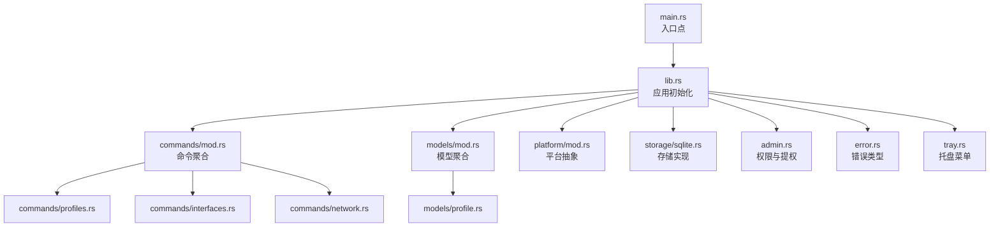
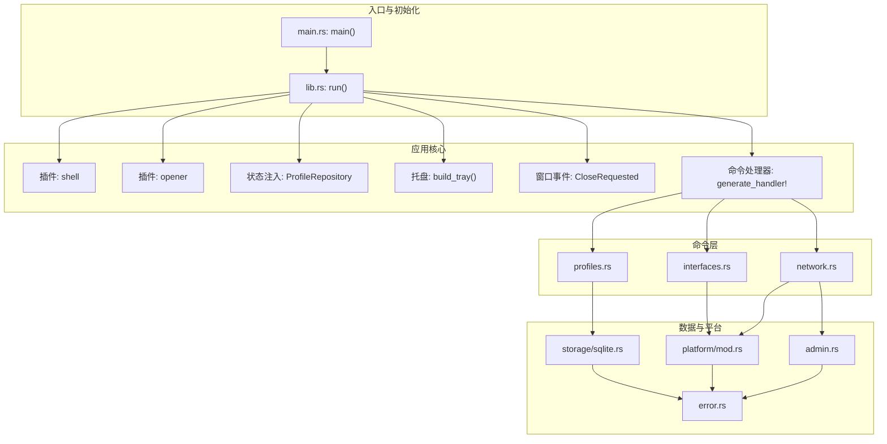
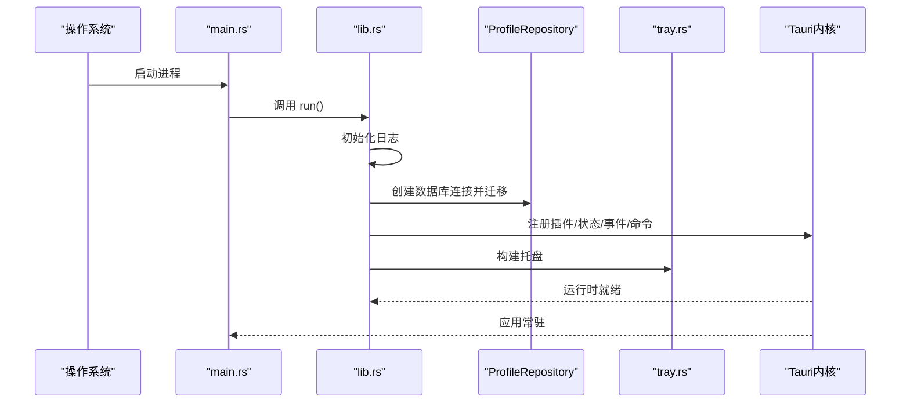
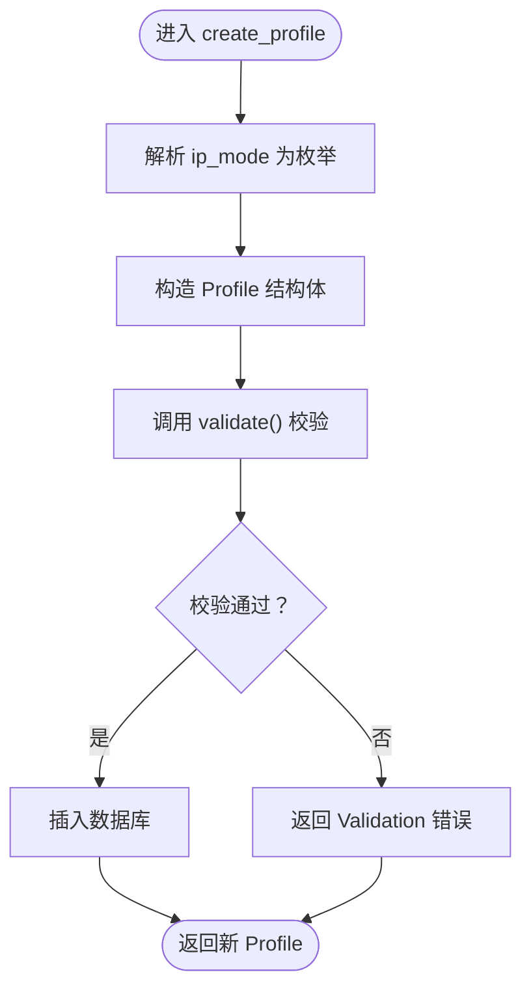
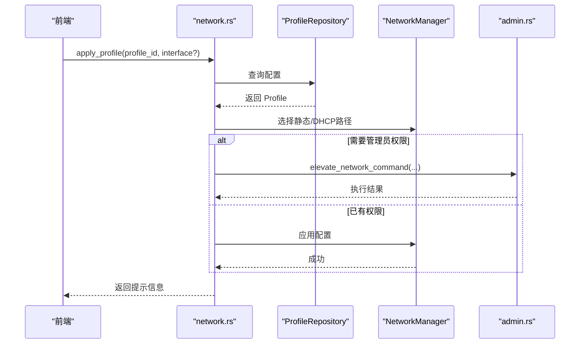
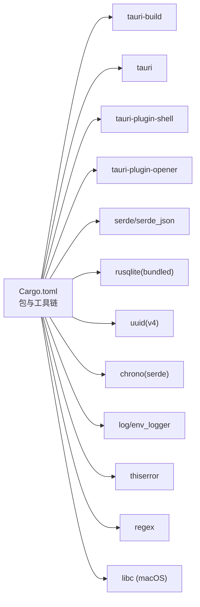

# Rust项目结构

<cite>
**本文引用的文件**
- [Cargo.toml](file://src-tauri/Cargo.toml)
- [lib.rs](file://src-tauri/src/lib.rs)
- [main.rs](file://src-tauri/src/main.rs)
- [mod.rs（commands）](file://src-tauri/src/commands/mod.rs)
- [profiles.rs](file://src-tauri/src/commands/profiles.rs)
- [interfaces.rs](file://src-tauri/src/commands/interfaces.rs)
- [network.rs](file://src-tauri/src/commands/network.rs)
- [mod.rs（models）](file://src-tauri/src/models/mod.rs)
- [profile.rs](file://src-tauri/src/models/profile.rs)
- [mod.rs（platform）](file://src-tauri/src/platform/mod.rs)
- [admin.rs](file://src-tauri/src/admin.rs)
- [error.rs](file://src-tauri/src/error.rs)
- [sqlite.rs](file://src-tauri/src/storage/sqlite.rs)
- [tray.rs](file://src-tauri/src/tray.rs)
- [build.rs](file://src-tauri/build.rs)
</cite>

## 目录
1. [简介](#简介)
2. [项目结构](#项目结构)
3. [核心组件](#核心组件)
4. [架构总览](#架构总览)
5. [详细组件分析](#详细组件分析)
6. [依赖分析](#依赖分析)
7. [性能考虑](#性能考虑)
8. [故障排查指南](#故障排查指南)
9. [结论](#结论)
10. [附录](#附录)

## 简介
本文件面向IPSwitcher的Rust后端（Tauri应用）部分，系统性梳理src-tauri目录下的模块组织、文件布局与依赖管理，深入解析lib.rs中的模块导入、插件注册与应用初始化流程，main.rs的入口点设计与生命周期管理，并结合Cargo.toml的依赖配置与构建选项给出最佳实践与代码组织策略。同时提供架构图、时序图与流程图，帮助读者快速理解系统设计与演进思路。

## 项目结构
src-tauri采用“按职责分层”的模块化组织方式：
- 根模块：lib.rs负责应用初始化、插件注册、状态管理与事件处理；main.rs作为入口点调用lib.rs的run函数。
- 命令层：commands目录按功能拆分为profiles、interfaces、network三个子模块，每个子模块通过#[tauri::command]导出可被前端调用的命令。
- 模型层：models目录定义数据模型（如Profile及其枚举IpMode），用于前后端交互与持久化。
- 平台层：platform目录抽象跨平台网络管理接口NetworkManager，并在不同操作系统下提供具体实现。
- 存储层：storage目录封装SQLite访问与迁移逻辑，使用rusqlite进行数据库操作。
- 安全与权限：admin模块封装提权检查与跨平台提权命令执行。
- 错误处理：error模块统一定义AppError枚举，便于跨模块传播与序列化。
- 托盘：tray模块构建系统托盘菜单与图标事件处理。
- 构建：build.rs委托tairi_build完成运行时代码生成与资源打包。

**图表来源**
- [main.rs:1-7](file://src-tauri/src/main.rs#L1-L7)
- [lib.rs:1-49](file://src-tauri/src/lib.rs#L1-L49)
- [mod.rs（commands）:1-4](file://src-tauri/src/commands/mod.rs#L1-L4)
- [mod.rs（models）:1-2](file://src-tauri/src/models/mod.rs#L1-L2)
- [mod.rs（platform）:1-64](file://src-tauri/src/platform/mod.rs#L1-L64)
- [sqlite.rs:1-256](file://src-tauri/src/storage/sqlite.rs#L1-L256)
- [admin.rs:1-165](file://src-tauri/src/admin.rs#L1-L165)
- [error.rs:1-38](file://src-tauri/src/error.rs#L1-L38)
- [tray.rs:1-136](file://src-tauri/src/tray.rs#L1-L136)

**章节来源**
- [lib.rs:1-49](file://src-tauri/src/lib.rs#L1-L49)
- [main.rs:1-7](file://src-tauri/src/main.rs#L1-L7)
- [mod.rs（commands）:1-4](file://src-tauri/src/commands/mod.rs#L1-L4)
- [mod.rs（models）:1-2](file://src-tauri/src/models/mod.rs#L1-L2)
- [mod.rs（platform）:1-64](file://src-tauri/src/platform/mod.rs#L1-L64)
- [sqlite.rs:1-256](file://src-tauri/src/storage/sqlite.rs#L1-L256)
- [admin.rs:1-165](file://src-tauri/src/admin.rs#L1-L165)
- [error.rs:1-38](file://src-tauri/src/error.rs#L1-L38)
- [tray.rs:1-136](file://src-tauri/src/tray.rs#L1-L136)

## 核心组件
- 应用初始化与生命周期
  - 初始化日志、数据库连接与状态注入；注册shell与opener插件；设置托盘与窗口事件；注册命令处理器；启动Tauri运行时。
- 命令层
  - profiles：列表、查询、创建、更新、删除配置档案。
  - interfaces：列出网络接口。
  - network：获取当前网络配置、应用配置档案、检查管理员权限。
- 模型层
  - Profile与IpMode：描述IP配置方案的数据结构与模式。
- 存储层
  - ProfileRepository：封装SQLite连接、迁移、CRUD与约束冲突处理。
- 平台层
  - NetworkManager抽象与跨平台实现工厂函数。
- 权限与安全
  - 提权检测与跨平台命令执行。
- 错误处理
  - 统一的AppError枚举，支持序列化以便前端展示。
- 托盘
  - 构建托盘菜单、图标事件与动态重载。

**章节来源**
- [lib.rs:12-48](file://src-tauri/src/lib.rs#L12-L48)
- [profiles.rs:1-113](file://src-tauri/src/commands/profiles.rs#L1-L113)
- [interfaces.rs:1-8](file://src-tauri/src/commands/interfaces.rs#L1-L8)
- [network.rs:1-101](file://src-tauri/src/commands/network.rs#L1-L101)
- [profile.rs:1-88](file://src-tauri/src/models/profile.rs#L1-L88)
- [sqlite.rs:8-256](file://src-tauri/src/storage/sqlite.rs#L8-L256)
- [mod.rs（platform）:12-64](file://src-tauri/src/platform/mod.rs#L12-L64)
- [admin.rs:3-49](file://src-tauri/src/admin.rs#L3-L49)
- [error.rs:3-38](file://src-tauri/src/error.rs#L3-L38)
- [tray.rs:9-90](file://src-tauri/src/tray.rs#L9-L90)

## 架构总览
下图展示了从入口到各子系统的调用关系与职责边界：

**图表来源**
- [main.rs:4-6](file://src-tauri/src/main.rs#L4-L6)
- [lib.rs:18-47](file://src-tauri/src/lib.rs#L18-L47)
- [profiles.rs:1-113](file://src-tauri/src/commands/profiles.rs#L1-L113)
- [interfaces.rs:1-8](file://src-tauri/src/commands/interfaces.rs#L1-L8)
- [network.rs:1-101](file://src-tauri/src/commands/network.rs#L1-L101)
- [sqlite.rs:1-256](file://src-tauri/src/storage/sqlite.rs#L1-L256)
- [mod.rs（platform）:12-64](file://src-tauri/src/platform/mod.rs#L12-L64)
- [admin.rs:1-165](file://src-tauri/src/admin.rs#L1-L165)
- [error.rs:1-38](file://src-tauri/src/error.rs#L1-L38)

## 详细组件分析

### 应用初始化与入口点（lib.rs 与 main.rs）
- 入口点
  - main.rs在非调试环境下设置Windows子系统为“windows”，避免额外控制台窗口；随后调用ipswitcher::run()。
- 初始化流程
  - 初始化日志；创建数据库连接并执行迁移；注册shell与opener插件；注入ProfileRepository为应用状态；设置托盘；隐藏Dock图标（macOS）；拦截窗口关闭请求以最小化到托盘；注册命令处理器；启动运行时。
- 生命周期管理
  - CloseRequested事件中隐藏窗口并阻止默认关闭，实现托盘常驻。

**图表来源**
- [main.rs:4-6](file://src-tauri/src/main.rs#L4-L6)
- [lib.rs:13-48](file://src-tauri/src/lib.rs#L13-L48)
- [sqlite.rs:13-27](file://src-tauri/src/storage/sqlite.rs#L13-L27)
- [tray.rs:9-90](file://src-tauri/src/tray.rs#L9-L90)

**章节来源**
- [main.rs:1-7](file://src-tauri/src/main.rs#L1-L7)
- [lib.rs:12-48](file://src-tauri/src/lib.rs#L12-L48)

### 命令层：配置档案管理（profiles.rs）
- 功能概览
  - 列表、查询、创建、更新、删除配置档案；创建/更新时进行字段校验；使用UUID生成唯一标识；时间戳由UTC RFC3339格式记录。
- 关键流程
  - 创建：根据ip_mode映射枚举；构造Profile；调用validate；插入数据库。
  - 更新：读取现有记录保留created_at；其余字段替换；调用validate；更新数据库。
  - 删除：按id删除，返回空结果时转换为“未找到”。

**图表来源**
- [profiles.rs:24-61](file://src-tauri/src/commands/profiles.rs#L24-L61)

**章节来源**
- [profiles.rs:1-113](file://src-tauri/src/commands/profiles.rs#L1-L113)
- [profile.rs:34-81](file://src-tauri/src/models/profile.rs#L34-L81)

### 命令层：网络接口与配置应用（interfaces.rs 与 network.rs）
- 接口列表
  - 通过平台抽象获取NetworkManager并列出接口，返回名称、显示名与活动状态。
- 当前配置与应用方案
  - 获取当前配置：若未指定接口则优先选择活跃接口或首个接口。
  - 应用方案：根据IpMode选择静态或DHCP；若无管理员权限则触发提权命令；成功后返回人类可读提示。
  - 管理员状态检查：返回布尔值供前端判断是否需要提权。

**图表来源**
- [network.rs:28-95](file://src-tauri/src/commands/network.rs#L28-L95)
- [sqlite.rs:110-144](file://src-tauri/src/storage/sqlite.rs#L110-L144)
- [admin.rs:26-49](file://src-tauri/src/admin.rs#L26-L49)

**章节来源**
- [interfaces.rs:1-8](file://src-tauri/src/commands/interfaces.rs#L1-L8)
- [network.rs:1-101](file://src-tauri/src/commands/network.rs#L1-L101)

### 数据模型（models/profile.rs）
- 数据结构
  - Profile包含id、name、ip_mode、IP地址、子网掩码、网关、DNS数组、接口名及时间戳。
  - IpMode枚举支持Manual与Dhcp两种模式，并提供Display实现。
- 校验规则
  - 名称长度限制与非空校验；
  - Manual模式要求IP、掩码、网关与至少一个DNS；
  - DHCP模式禁止设置上述字段。

**章节来源**
- [profile.rs:1-88](file://src-tauri/src/models/profile.rs#L1-L88)

### 存储层（storage/sqlite.rs）
- 数据库连接与迁移
  - 在macOS与Windows分别定位应用数据目录；打开/创建数据库；执行建表语句（profiles表）。
- CRUD与约束处理
  - list_all按更新时间倒序查询；get_by_id按id查询；insert与update序列化DNS数组；delete按id删除；重复名称与未找到场景转换为特定错误类型。
- 并发与错误
  - 使用Mutex保护Connection；对互斥体异常与SQLite约束冲突进行分类处理。

**章节来源**
- [sqlite.rs:8-256](file://src-tauri/src/storage/sqlite.rs#L8-L256)

### 平台抽象与跨平台实现（platform/mod.rs）
- 抽象接口
  - NetworkManager定义接口列表、当前配置获取、静态配置应用、DHCP设置等方法。
  - CurrentNetworkConfig与NetworkInterface描述当前网络状态与接口信息。
- 工厂与实现
  - 根据目标操作系统返回对应实现（macOS/Windows），并通过工厂函数统一对外暴露。

**章节来源**
- [mod.rs（platform）:12-64](file://src-tauri/src/platform/mod.rs#L12-L64)

### 权限与提权（admin.rs）
- 提权检测
  - macOS使用geteuid；Windows通过执行“net session”判断；其他系统返回false。
- 提权命令
  - macOS：使用osascript执行networksetup命令；Windows：使用PowerShell以提升权限运行cmd命令。
- 错误处理
  - 用户取消、命令失败等场景转换为AppError。

**章节来源**
- [admin.rs:3-165](file://src-tauri/src/admin.rs#L3-L165)

### 错误处理（error.rs）
- 类型定义
  - 统一的AppError枚举覆盖数据库、IO、序列化、验证、未找到、重复名称、网络与权限不足等场景。
- 序列化
  - 实现Serialize以便通过IPC传递给前端。

**章节来源**
- [error.rs:3-38](file://src-tauri/src/error.rs#L3-L38)

### 托盘（tray.rs）
- 菜单构建
  - 包含显示主窗口、新建方案、退出等基础项；动态重建菜单时将所有配置方案作为子菜单项。
- 事件处理
  - 左键点击托盘图标切换窗口显隐；菜单项触发emit事件通知前端；退出时调用app.exit(0)。

**章节来源**
- [tray.rs:9-136](file://src-tauri/src/tray.rs#L9-L136)

## 依赖分析
- 包与工具链
  - 包信息：名称、版本、描述、作者、Rust edition与最低版本要求。
  - 构建依赖：tauri-build。
  - 运行时依赖：tauri（带tray图标特性）、shell/opener插件、序列化（serde/serde_json）、数据库（rusqlite，启用bundled）、UUID、时间（chrono）、日志（log/env_logger）、错误处理（thiserror）、正则（regex）。
  - 平台特有依赖：macOS使用libc。
- 目标平台差异
  - macOS：引入libc用于提权检测。
  - Windows：无额外运行时依赖声明。

**图表来源**
- [Cargo.toml:1-30](file://src-tauri/Cargo.toml#L1-L30)

**章节来源**
- [Cargo.toml:1-30](file://src-tauri/Cargo.toml#L1-L30)

## 性能考虑
- 数据库并发
  - 使用Mutex保护rusqlite连接，建议在高并发场景下评估连接池或减少锁粒度。
- 序列化开销
  - DNS数组采用JSON字符串存储，查询时反序列化；可考虑优化为更紧凑的存储格式或缓存热点数据。
- 插件与事件
  - 托盘与窗口事件处理应避免阻塞主线程；命令处理尽量短路返回。
- 日志与诊断
  - 生产环境建议降低日志级别，避免频繁I/O影响性能。

## 故障排查指南
- 数据库相关
  - 若出现“未找到”或“重复名称”错误，检查数据库迁移是否成功以及名称唯一性约束。
- 权限问题
  - 提权失败多因用户取消或命令执行失败；确认平台命令拼接正确且系统策略允许提权。
- 网络接口
  - 未找到可用接口时，检查平台实现与接口枚举；确保接口名称匹配。
- 托盘行为
  - 窗口关闭未最小化至托盘：检查CloseRequested事件处理与prevent_close调用。

**章节来源**
- [sqlite.rs:146-232](file://src-tauri/src/storage/sqlite.rs#L146-L232)
- [admin.rs:77-99](file://src-tauri/src/admin.rs#L77-L99)
- [network.rs:10-26](file://src-tauri/src/commands/network.rs#L10-L26)
- [lib.rs:29-34](file://src-tauri/src/lib.rs#L29-L34)

## 结论
该Rust后端以Tauri为核心，采用清晰的分层与模块化设计：命令层负责业务编排，模型层定义数据契约，存储层封装持久化，平台层抽象跨平台能力，权限与错误处理贯穿始终。通过统一的错误类型与日志初始化，系统具备良好的可观测性与可维护性。建议后续在数据库并发、序列化性能与跨平台测试覆盖方面持续优化。

## 附录
- 构建流程
  - build.rs委托tauri_build::build完成运行时生成与资源打包。
- 版本与特性
  - Rust 2021 edition，最低版本1.77；tauri 2；启用tray图标特性；rusqlite启用bundled以简化部署。

**章节来源**
- [build.rs:1-4](file://src-tauri/build.rs#L1-L4)
- [Cargo.toml:1-30](file://src-tauri/Cargo.toml#L1-L30)