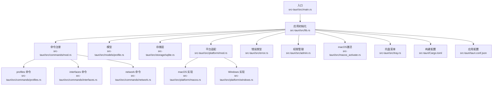
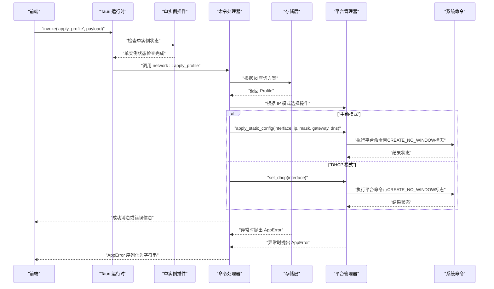
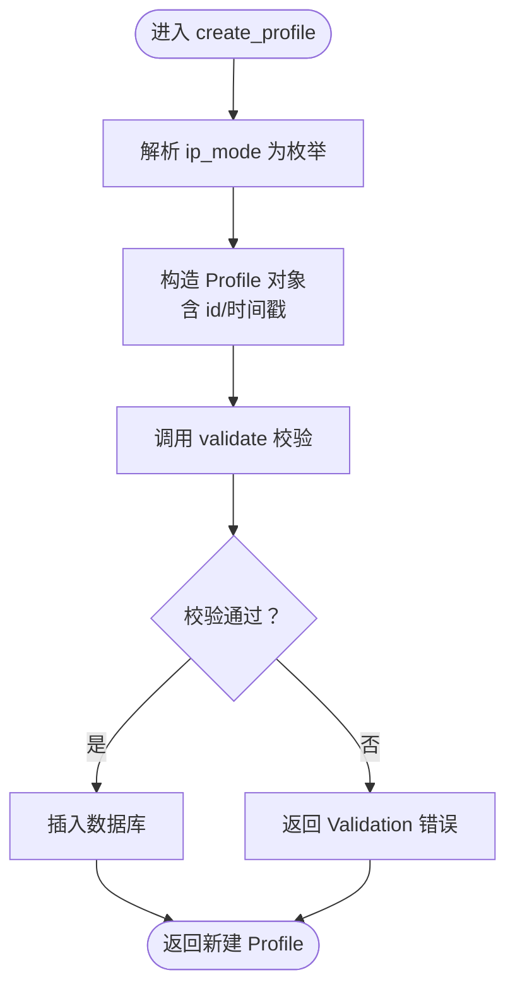
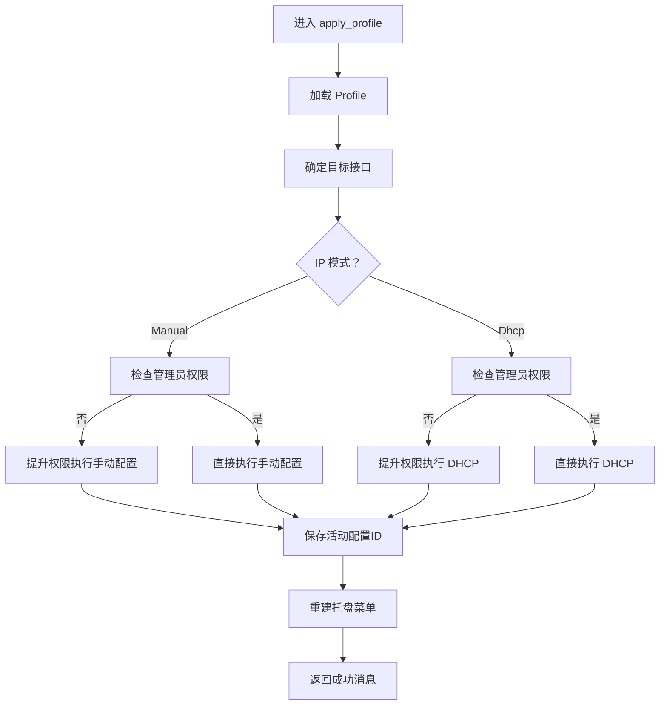
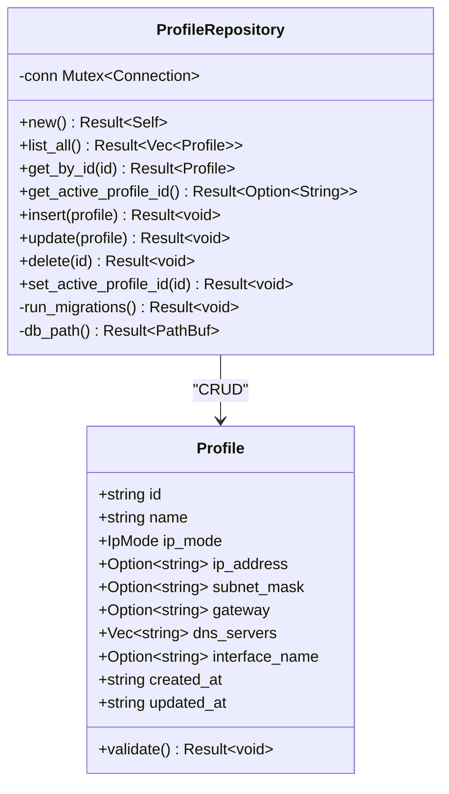
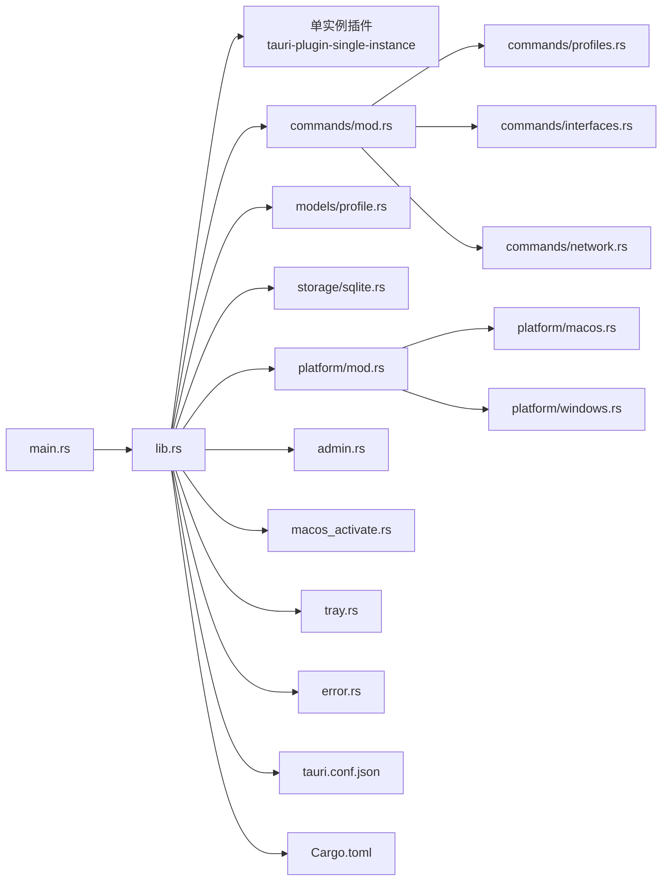

# 后端开发指南

<cite>
**本文引用的文件**
- [Cargo.toml](file://src-tauri/Cargo.toml)
- [main.rs](file://src-tauri/src/main.rs)
- [lib.rs](file://src-tauri/src/lib.rs)
- [tauri.conf.json](file://src-tauri/tauri.conf.json)
- [commands/mod.rs](file://src-tauri/src/commands/mod.rs)
- [commands/profiles.rs](file://src-tauri/src/commands/profiles.rs)
- [commands/interfaces.rs](file://src-tauri/src/commands/interfaces.rs)
- [commands/network.rs](file://src-tauri/src/commands/network.rs)
- [models/mod.rs](file://src-tauri/src/models/mod.rs)
- [models/profile.rs](file://src-tauri/src/models/profile.rs)
- [storage/mod.rs](file://src-tauri/src/storage/mod.rs)
- [storage/sqlite.rs](file://src-tauri/src/storage/sqlite.rs)
- [platform/mod.rs](file://src-tauri/src/platform/mod.rs)
- [platform/macos.rs](file://src-tauri/src/platform/macos.rs)
- [platform/windows.rs](file://src-tauri/src/platform/windows.rs)
- [error.rs](file://src-tauri/src/error.rs)
- [admin.rs](file://src-tauri/src/admin.rs)
- [macos_activate.rs](file://src-tauri/src/macos_activate.rs)
- [tray.rs](file://src-tauri/src/tray.rs)
</cite>

## 更新摘要
**变更内容**
- 版本升级至1.0.2，包含依赖更新和功能改进
- 新增单实例插件集成，防止应用程序重复启动
- Windows平台改进：使用CREATE_NO_WINDOW标志隐藏控制台窗口
- macOS应用激活增强：新增macOS应用前台激活功能
- 托盘菜单增强：增加动态菜单项和事件处理机制

## 目录
1. [简介](#简介)
2. [项目结构](#项目结构)
3. [核心组件](#核心组件)
4. [架构总览](#架构总览)
5. [详细组件分析](#详细组件分析)
6. [依赖关系分析](#依赖关系分析)
7. [性能考量](#性能考量)
8. [故障排除指南](#故障排除指南)
9. [结论](#结论)
10. [附录](#附录)

## 简介
本指南面向IPSwitcher后端开发者，聚焦于Rust与Tauri的结合使用，系统讲解命令处理机制、错误处理策略、数据模型与存储层设计、跨平台网络管理实现、管理员权限管理与系统集成。文档以"可读性优先"的原则，既适合初学者快速上手，也提供足够深度的技术细节帮助资深开发者优化与扩展。

**更新** 版本1.0.2引入了单实例插件集成和Windows平台的CREATE_NO_WINDOW标志改进，提升了用户体验和系统兼容性。

## 项目结构
后端位于 src-tauri 目录，采用"按职责分层 + 按功能聚合"的混合组织方式：
- 入口与运行时：main.rs、lib.rs
- 命令模块：commands/profiles.rs、commands/interfaces.rs、commands/network.rs
- 数据模型：models/profile.rs
- 存储层：storage/sqlite.rs
- 平台适配：platform/mod.rs 及 platform/macos.rs、platform/windows.rs
- 系统集成：admin.rs（权限管理）、macos_activate.rs（macOS激活）、tray.rs（托盘菜单）
- 错误类型：error.rs
- 构建与打包：Cargo.toml、tauri.conf.json

**图表来源**
- [lib.rs:13-78](file://src-tauri/src/lib.rs#L13-L78)
- [commands/mod.rs:1-4](file://src-tauri/src/commands/mod.rs#L1-L4)
- [storage/sqlite.rs:8-27](file://src-tauri/src/storage/sqlite.rs#L8-L27)
- [platform/mod.rs:54-63](file://src-tauri/src/platform/mod.rs#L54-L63)
- [error.rs:3-28](file://src-tauri/src/error.rs#L3-L28)
- [admin.rs:1-172](file://src-tauri/src/admin.rs#L1-L172)
- [macos_activate.rs:1-25](file://src-tauri/src/macos_activate.rs#L1-L25)
- [tray.rs:1-134](file://src-tauri/src/tray.rs#L1-L134)

**章节来源**
- [lib.rs:13-78](file://src-tauri/src/lib.rs#L13-L78)
- [Cargo.toml:1-32](file://src-tauri/Cargo.toml#L1-L32)
- [tauri.conf.json:1-44](file://src-tauri/tauri.conf.json#L1-L44)

## 核心组件
- 应用入口与生命周期：通过 main.rs 调用 lib.rs 的 run 函数，初始化日志、数据库、托盘图标、窗口事件，并注册所有Tauri命令。
- 单实例管理：集成 tauri-plugin-single-instance 插件，防止应用程序重复启动，支持单实例通信回调。
- 命令处理：在 lib.rs 中集中注册 profiles、interfaces、network 三大类命令，前端通过 invoke 调用。
- 数据模型：Profile 结构体承载网络方案，包含名称、IP模式（手动/DHCP）、IP地址、子网掩码、网关、DNS、接口名及时间戳。
- 存储层：基于 rusqlite 的 ProfileRepository，负责数据库连接、迁移、CRUD与唯一约束冲突处理。
- 平台适配：抽象出 NetworkManager trait，分别在 macOS 和 Windows 上通过系统命令实现网络接口枚举、当前配置查询、静态IP/DHCP应用与DNS设置。
- 权限管理：统一的管理员权限检测和提权机制，支持跨平台操作。
- 错误处理：统一的 AppError 枚举，覆盖数据库、IO、序列化、校验、未找到、重复名、网络、权限等场景，并支持序列化以便跨前端边界传递。

**更新** 新增单实例插件集成和Windows平台的CREATE_NO_WINDOW标志改进，提升了应用的稳定性和用户体验。

**章节来源**
- [main.rs:4-6](file://src-tauri/src/main.rs#L4-L6)
- [lib.rs:13-78](file://src-tauri/src/lib.rs#L13-L78)
- [models/profile.rs:20-32](file://src-tauri/src/models/profile.rs#L20-L32)
- [storage/sqlite.rs:8-27](file://src-tauri/src/storage/sqlite.rs#L8-L27)
- [platform/mod.rs:12-32](file://src-tauri/src/platform/mod.rs#L12-L32)
- [error.rs:3-28](file://src-tauri/src/error.rs#L3-L28)
- [admin.rs:1-172](file://src-tauri/src/admin.rs#L1-L172)

## 架构总览
下图展示从前端调用到平台命令执行的完整链路，以及错误传播路径。**更新** 新增单实例插件和Windows平台改进的处理流程。

**图表来源**
- [lib.rs:35-76](file://src-tauri/src/lib.rs#L35-L76)
- [commands/network.rs:28-95](file://src-tauri/src/commands/network.rs#L28-L95)
- [storage/sqlite.rs:110-144](file://src-tauri/src/storage/sqlite.rs#L110-L144)
- [platform/macos.rs:112-151](file://src-tauri/src/platform/macos.rs#L112-L151)
- [platform/windows.rs:88-145](file://src-tauri/src/platform/windows.rs#L88-L145)

## 详细组件分析

### 命令模块概览
- profiles 命令：提供方案列表、详情、创建、更新、删除；创建/更新前进行字段校验；使用 UUID 生成 id，时间戳使用 UTC RFC3339 字符串。
- interfaces 命令：通过平台管理器列举网络接口，区分活动接口。
- network 命令：查询当前网络配置；应用方案（根据方案 IP 模式切换静态或 DHCP），并在需要时提升权限执行。

**更新** 新增 get_active_profile_id 和 set_active_profile_id 命令，支持活动方案的查询和设置。

**章节来源**
- [commands/profiles.rs:9-113](file://src-tauri/src/commands/profiles.rs#L9-L113)
- [commands/interfaces.rs:4-7](file://src-tauri/src/commands/interfaces.rs#L4-L7)
- [commands/network.rs:9-137](file://src-tauri/src/commands/network.rs#L9-L137)

#### profiles 命令详解
- 列表：返回所有方案，按更新时间倒序。
- 获取：按 id 查询，未找到返回"未找到"错误。
- 创建：解析 ip_mode 字符串映射到枚举；生成新 id 与时间戳；调用 Profile.validate 校验；插入数据库；重复名称触发"重复名"错误。
- 更新：保留 created_at；其余逻辑同创建。
- 删除：按 id 删除，0 行受影响视为"未找到"。

**图表来源**
- [commands/profiles.rs:24-61](file://src-tauri/src/commands/profiles.rs#L24-L61)
- [models/profile.rs:34-81](file://src-tauri/src/models/profile.rs#L34-L81)

**章节来源**
- [commands/profiles.rs:9-113](file://src-tauri/src/commands/profiles.rs#L9-L113)
- [models/profile.rs:20-88](file://src-tauri/src/models/profile.rs#L20-L88)

#### interfaces 命令详解
- 通过工厂函数获取当前平台的 NetworkManager 实例，调用其 list_interfaces 返回接口列表（含名称、显示名、是否活动）。

**章节来源**
- [commands/interfaces.rs:4-7](file://src-tauri/src/commands/interfaces.rs#L4-L7)
- [platform/mod.rs:54-63](file://src-tauri/src/platform/mod.rs#L54-L63)

#### network 命令详解
- get_current_network_config：若未显式传入接口，则从活动接口中选择；否则回退到首个接口；最终调用平台管理器查询当前配置。
- apply_profile：根据方案 ip_mode 执行不同流程；手动模式需提供 IP、掩码、网关与至少一个 DNS；DHCP 模式仅需接口；若无管理员权限则通过 elevate_network_command 提升后再执行。
- check_admin_status：返回当前进程是否具备管理员权限。
- get_active_profile_id：返回当前活动的配置ID。
- set_active_profile_id：设置当前活动的配置ID并重建托盘菜单。

**图表来源**
- [commands/network.rs:28-137](file://src-tauri/src/commands/network.rs#L28-L137)

**章节来源**
- [commands/network.rs:9-137](file://src-tauri/src/commands/network.rs#L9-L137)

### 数据模型与存储层

#### 数据模型：Profile
- 关键字段：id、name、ip_mode（枚举 Manual/Dhcp）、可选 ip_address/subnet_mask/gateway、dns_servers（数组）、可选 interface_name、created_at/updated_at。
- 校验规则：
  - 名称非空且长度不超过 64。
  - Manual 模式必须提供 IP、掩码、网关，且均需为合法 IPv4；至少一个 DNS。
  - Dhcp 模式不允许设置上述字段。
- 显示格式：枚举值提供中文描述。

**章节来源**
- [models/profile.rs:20-88](file://src-tauri/src/models/profile.rs#L20-L88)

#### 存储层：ProfileRepository
- 初始化：根据平台决定数据库文件路径（macOS 使用 HOME 下 Application Support，Windows 使用 APPDATA 下 IP Switcher），确保目录存在，打开连接并执行迁移。
- 迁移：创建 profiles 表，包含唯一约束与检查约束（ip_mode 限定枚举值）。
- 查询：
  - list_all：按 updated_at 倒序。
  - get_by_id：JSON 反序列化 dns_servers。
  - get_active_profile_id：获取当前活动的配置ID。
- 写入：
  - insert：JSON 序列化 dns_servers；约束冲突识别为"重复名"。
  - update：同 insert；当影响行数为 0 时返回"未找到"。
  - delete：按 id 删除；0 行受影响视为"未找到"。
  - set_active_profile_id：设置活动配置ID并重建托盘菜单。

**图表来源**
- [storage/sqlite.rs:8-255](file://src-tauri/src/storage/sqlite.rs#L8-L255)
- [models/profile.rs:20-88](file://src-tauri/src/models/profile.rs#L20-L88)

**章节来源**
- [storage/sqlite.rs:12-255](file://src-tauri/src/storage/sqlite.rs#L12-L255)
- [models/profile.rs:20-88](file://src-tauri/src/models/profile.rs#L20-L88)

### 平台特定实现与系统集成

#### 抽象层：NetworkManager
- 定义统一接口：list_interfaces、get_current_config、apply_static_config、set_dhcp。
- 工厂函数：根据操作系统返回对应实现。

**章节来源**
- [platform/mod.rs:12-63](file://src-tauri/src/platform/mod.rs#L12-L63)

#### macOS 实现
- 接口枚举：通过 networksetup -listallnetworkservices 解析输出，过滤头部与空行，识别活动接口。
- 当前配置：通过 networksetup -getinfo 解析 IP、掩码、网关与 DNS 列表。
- 应用静态配置：networksetup -setmanual 设置静态 IP 与网关；再设置 DNS。
- 切换 DHCP：networksetup -setdhcp，并清空 DNS。

**章节来源**
- [platform/macos.rs:8-175](file://src-tauri/src/platform/macos.rs#L8-L175)

#### Windows 实现
- 接口枚举：通过 netsh interface ip show interfaces 解析表格输出，提取名称与状态。
- 当前配置：通过 netsh interface ip show config name="..." 解析 DHCP、IP、掩码、网关。
- 应用静态配置：netsh interface ip set address 设置静态；逐个添加 DNS。
- 切换 DHCP：netsh interface ip set address source=dhcp；设置 DNS 为 dhcp。
- **新增**：使用 CREATE_NO_WINDOW 标志隐藏控制台窗口，提升用户体验。

**更新** Windows平台现在使用 CREATE_NO_WINDOW 标志隐藏控制台窗口，避免在执行网络命令时出现闪烁的控制台窗口。

**章节来源**
- [platform/windows.rs:1-183](file://src-tauri/src/platform/windows.rs#L1-L183)

### 系统集成与权限管理

#### 单实例插件集成
- 依赖：新增 tauri-plugin-single-instance = "2" 依赖。
- 功能：防止应用程序重复启动，支持单实例通信回调。
- 回调：当尝试启动第二个实例时，回调函数会激活主窗口并将其显示在前台。

**新增** 单实例插件提供了防止重复启动和窗口激活的功能。

**章节来源**
- [lib.rs:19-26](file://src-tauri/src/lib.rs#L19-L26)
- [Cargo.toml:15](file://src-tauri/Cargo.toml#L15)

#### macOS 应用激活
- 功能：通过 objc2 库调用 NSApplication.activateIgnoringOtherApps 来将应用窗口带到前台。
- 适用场景：当使用 Accessory 激活策略时，单独的 window.set_focus() 无法将窗口置于其他应用之前。

**新增** 新增了专门的 macOS 应用激活功能，确保窗口能够正确显示在前台。

**章节来源**
- [macos_activate.rs:1-25](file://src-tauri/src/macos_activate.rs#L1-L25)

#### 托盘菜单增强
- 动态菜单：根据数据库中的配置列表动态生成菜单项。
- 事件处理：支持菜单点击、托盘图标点击等事件。
- 状态同步：菜单项显示当前活动配置的状态。

**新增** 托盘菜单现在支持动态菜单项和更丰富的事件处理机制。

**章节来源**
- [tray.rs:1-134](file://src-tauri/src/tray.rs#L1-L134)

#### 权限管理
- 权限检测：跨平台的管理员权限检测。
- 提权执行：通过 osascript（macOS）和 PowerShell（Windows）执行需要管理员权限的命令。
- Windows 改进：使用 CREATE_NO_WINDOW 标志隐藏控制台窗口。

**更新** Windows平台的权限检测和提权执行现在使用 CREATE_NO_WINDOW 标志隐藏控制台窗口。

**章节来源**
- [admin.rs:1-172](file://src-tauri/src/admin.rs#L1-L172)

### 错误处理策略
- 统一错误类型 AppError，覆盖数据库、IO、序列化、校验、未找到、重复名、网络、权限等。
- 错误可序列化为字符串，便于跨前端边界传递。
- 命令层捕获底层错误并转换为语义化的 AppError，避免泄露内部实现细节。

**章节来源**
- [error.rs:3-38](file://src-tauri/src/error.rs#L3-L38)
- [storage/sqlite.rs:146-232](file://src-tauri/src/storage/sqlite.rs#L146-L232)
- [platform/macos.rs:14-20](file://src-tauri/src/platform/macos.rs#L14-L20)
- [platform/windows.rs:10-14](file://src-tauri/src/platform/windows.rs#L10-L14)

## 依赖关系分析

**图表来源**
- [main.rs:4-6](file://src-tauri/src/main.rs#L4-L6)
- [lib.rs:1-78](file://src-tauri/src/lib.rs#L1-L78)
- [commands/mod.rs:1-4](file://src-tauri/src/commands/mod.rs#L1-L4)
- [storage/sqlite.rs:1-6](file://src-tauri/src/storage/sqlite.rs#L1-L6)
- [platform/mod.rs:1-10](file://src-tauri/src/platform/mod.rs#L1-L10)

**章节来源**
- [Cargo.toml:12-32](file://src-tauri/Cargo.toml#L12-L32)
- [tauri.conf.json:1-44](file://src-tauri/tauri.conf.json#L1-L44)

## 性能考量
- 数据库访问：使用 Mutex 包裹 Connection，单线程串行化访问，避免并发写入竞争；对于高频读取可评估引入 WAL 或只读副本。
- JSON 序列化：DNS 数组在入库/出库时进行序列化/反序列化，建议保持数组规模合理；如需更高性能可考虑二进制序列化或专用字段。
- 平台命令：每次网络操作都会触发外部进程，建议在 UI 层做节流与用户提示，避免频繁切换导致的阻塞。
- **新增** 单实例插件：减少不必要的应用启动和资源占用。
- **新增** Windows CREATE_NO_WINDOW：避免控制台窗口闪烁带来的视觉干扰。
- 日志：启用 env_logger，生产环境建议调整日志级别，减少 IO 开销。
- 资源管理：托盘与窗口事件在 setup 中一次性初始化，避免重复创建。

**更新** 新增了单实例插件和Windows平台改进的性能考量。

## 故障排除指南
- 无法列出网络接口
  - macOS：确认 networksetup 命令可用且有执行权限；检查系统偏好设置中的网络服务是否被禁用。
  - Windows：确认 netsh 命令可用；以管理员身份运行应用。
- 应用静态IP/DHCP失败
  - 检查管理员权限；查看命令返回状态；核对输入的 IP、掩码、网关与 DNS 是否符合 IPv4 规范。
- 数据库相关错误
  - 重复名称：修改方案名称后重试。
  - 未找到：确认 id 正确或先刷新列表。
  - 约束冲突：检查 ip_mode 与字段组合是否满足校验规则。
- 权限不足
  - 在 network 命令中会尝试提权；若失败，引导用户以管理员身份重新启动应用。
- **新增** 单实例问题
  - 如果应用无法启动多个实例：这是预期行为，单实例插件会阻止重复启动。
  - 如果主窗口无法激活：检查 macOS 的 Accessory 激活策略和窗口焦点设置。
- **新增** Windows 控制台窗口问题
  - 如果仍然看到控制台窗口：检查 CREATE_NO_WINDOW 标志是否正确设置。
  - 如果命令执行失败：确认 PowerShell 和 netsh 命令的可用性。

**更新** 新增了单实例插件和Windows平台相关的故障排除指南。

**章节来源**
- [platform/macos.rs:14-20](file://src-tauri/src/platform/macos.rs#L14-L20)
- [platform/windows.rs:10-14](file://src-tauri/src/platform/windows.rs#L10-L14)
- [storage/sqlite.rs:175-181](file://src-tauri/src/storage/sqlite.rs#L175-L181)
- [commands/network.rs:53-61](file://src-tauri/src/commands/network.rs#L53-L61)

## 结论
本后端以清晰的分层与抽象实现了跨平台网络配置切换能力：命令层负责业务编排，模型层保证数据一致性，存储层提供可靠持久化，平台层屏蔽系统差异，错误层统一异常表达。**更新** 版本1.0.2引入了单实例插件集成、Windows平台的CREATE_NO_WINDOW标志改进、macOS应用激活增强和托盘菜单增强等功能，进一步提升了用户体验和系统兼容性。遵循本文最佳实践与故障排除建议，可在保证内存安全与性能的前提下快速迭代与扩展功能。

## 附录

### Rust 最佳实践与内存安全
- 使用 Result/Option 显式处理错误与缺失值，避免 unwrap 导致的 panic。
- 结构体字段尽量使用 Option 表达可选性，配合模式匹配与守卫减少分支复杂度。
- 使用 chrono 与 serde 的组合确保时间序列化一致；避免在多线程共享状态中直接传递可变引用。
- 通过 thiserror 提供可读的错误信息，并实现 serde::Serialize 以便跨边界传递。

### 性能优化建议
- 将高频查询结果缓存至内存，降低数据库与系统命令调用频率。
- 对 JSON 大对象进行分页或延迟加载，减少序列化开销。
- 在 UI 层限制命令触发频率，避免短时间内多次切换网络配置。
- 使用合适的日志级别与异步写入，减少阻塞。
- **新增** 利用单实例插件减少资源占用和启动时间。
- **新增** 在Windows平台上使用CREATE_NO_WINDOW标志避免控制台窗口闪烁。

### 版本升级注意事项
- **版本1.0.2变更**：
  - 更新 Tauri 到 2.x 版本，包含新的API和插件系统
  - 新增单实例插件依赖和配置
  - Windows平台改进：使用CREATE_NO_WINDOW标志
  - 新增macOS应用激活功能
  - 托盘菜单增强：支持动态菜单项
  - 权限管理改进：Windows平台的CREATE_NO_WINDOW标志

**章节来源**
- [Cargo.toml:1-32](file://src-tauri/Cargo.toml#L1-L32)
- [tauri.conf.json:1-44](file://src-tauri/tauri.conf.json#L1-L44)
- [lib.rs:19-26](file://src-tauri/src/lib.rs#L19-L26)
- [platform/windows.rs:7](file://src-tauri/src/platform/windows.rs#L7)
- [admin.rs:12](file://src-tauri/src/admin.rs#L12)
- [admin.rs:149](file://src-tauri/src/admin.rs#L149)