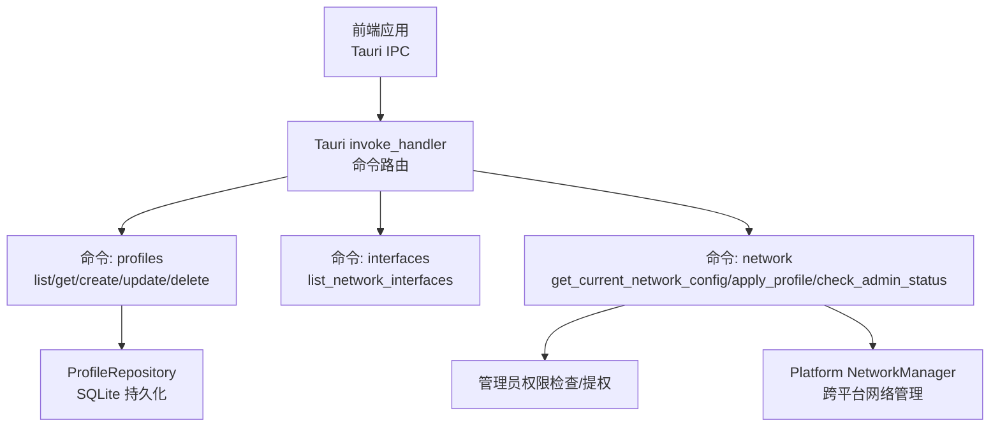
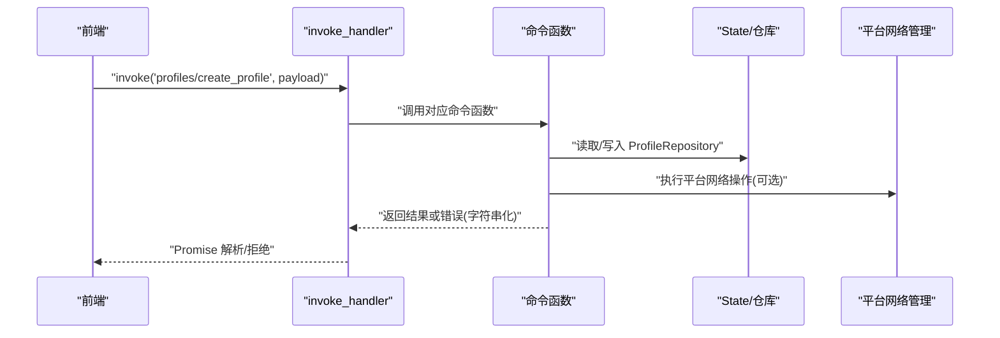
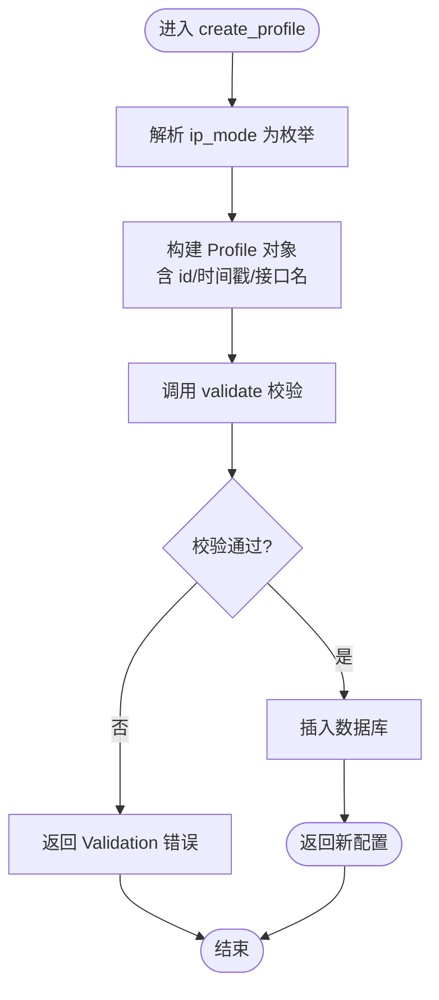
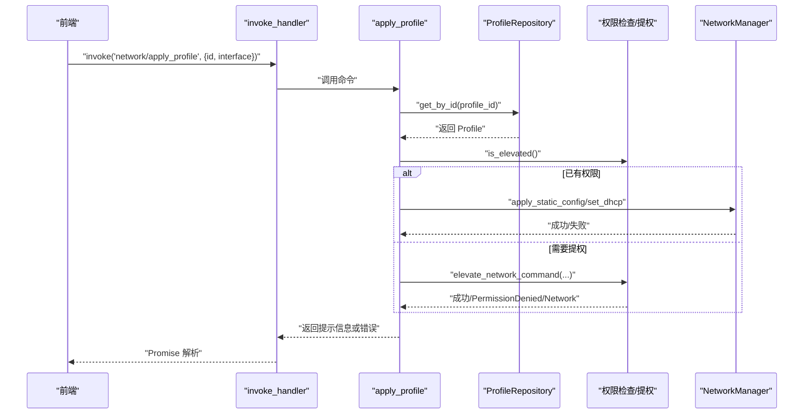
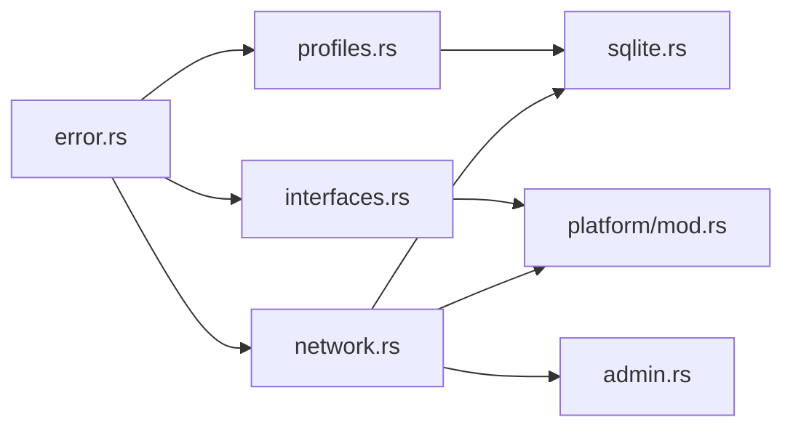

# 命令处理机制

<cite>
**本文引用的文件**
- [src-tauri/src/lib.rs](file://src-tauri/src/lib.rs)
- [src-tauri/src/main.rs](file://src-tauri/src/main.rs)
- [src-tauri/src/commands/mod.rs](file://src-tauri/src/commands/mod.rs)
- [src-tauri/src/commands/profiles.rs](file://src-tauri/src/commands/profiles.rs)
- [src-tauri/src/commands/interfaces.rs](file://src-tauri/src/commands/interfaces.rs)
- [src-tauri/src/commands/network.rs](file://src-tauri/src/commands/network.rs)
- [src-tauri/src/error.rs](file://src-tauri/src/error.rs)
- [src-tauri/src/storage/sqlite.rs](file://src-tauri/src/storage/sqlite.rs)
- [src-tauri/src/models/profile.rs](file://src-tauri/src/models/profile.rs)
- [src-tauri/src/platform/mod.rs](file://src-tauri/src/platform/mod.rs)
- [src-tauri/src/admin.rs](file://src-tauri/src/admin.rs)
- [src-tauri/src/tray.rs](file://src-tauri/src/tray.rs)
- [src-tauri/tauri.conf.json](file://src-tauri/tauri.conf.json)
- [src-tauri/Cargo.toml](file://src-tauri/Cargo.toml)
</cite>

## 目录
1. [简介](#简介)
2. [项目结构](#项目结构)
3. [核心组件](#核心组件)
4. [架构总览](#架构总览)
5. [详细组件分析](#详细组件分析)
6. [依赖关系分析](#依赖关系分析)
7. [性能考虑](#性能考虑)
8. [故障排查指南](#故障排查指南)
9. [结论](#结论)
10. [附录](#附录)

## 简介
本文件系统性阐述 IP Switcher 的命令处理机制，重点围绕 Tauri 的 invoke_handler 配置与命令路由、命令模块功能与参数校验、profiles/interfaces/network 命令组的职责边界、异步处理与错误传播、状态管理、IPC 协议与消息格式，以及扩展、性能优化与调试技巧。读者无需深入 Rust 背景即可理解命令调用链路与数据流。

## 项目结构
后端采用 Tauri v2 架构，Rust 侧通过 generate_handler 注册命令，前端通过 Tauri IPC 发起 invoke 调用。命令按功能分组放置在 src-tauri/src/commands 下，数据持久化使用 SQLite，平台网络管理通过 trait 抽象跨平台实现。

图表来源
- [src-tauri/src/lib.rs:36-46](file://src-tauri/src/lib.rs#L36-L46)
- [src-tauri/src/commands/mod.rs:1-4](file://src-tauri/src/commands/mod.rs#L1-L4)
- [src-tauri/src/storage/sqlite.rs:8-27](file://src-tauri/src/storage/sqlite.rs#L8-L27)
- [src-tauri/src/admin.rs:3-24](file://src-tauri/src/admin.rs#L3-L24)
- [src-tauri/src/platform/mod.rs:12-32](file://src-tauri/src/platform/mod.rs#L12-L32)

章节来源
- [src-tauri/src/lib.rs:14-49](file://src-tauri/src/lib.rs#L14-L49)
- [src-tauri/src/commands/mod.rs:1-4](file://src-tauri/src/commands/mod.rs#L1-L4)
- [src-tauri/tauri.conf.json:1-48](file://src-tauri/tauri.conf.json#L1-L48)

## 核心组件
- 命令注册与路由：在应用启动时通过 generate_handler 将命令函数注册到 invoke_handler，前端以字符串命令名发起调用。
- 错误体系：统一的 AppError 枚举，序列化为字符串，便于 IPC 传输。
- 数据存储：ProfileRepository 使用 SQLite，提供 CRUD 与迁移；Profile 结构体包含校验逻辑。
- 平台抽象：NetworkManager trait 定义跨平台网络能力；根据操作系统选择具体实现。
- 权限与提权：is_elevated 判断当前进程权限；elevate_network_command 在 macOS/Windows 上以管理员身份执行网络配置命令。
- 托盘集成：托盘菜单事件与命令调用联动，触发前端事件或直接调用命令。

章节来源
- [src-tauri/src/lib.rs:36-46](file://src-tauri/src/lib.rs#L36-L46)
- [src-tauri/src/error.rs:3-37](file://src-tauri/src/error.rs#L3-L37)
- [src-tauri/src/storage/sqlite.rs:8-27](file://src-tauri/src/storage/sqlite.rs#L8-L27)
- [src-tauri/src/models/profile.rs:20-81](file://src-tauri/src/models/profile.rs#L20-L81)
- [src-tauri/src/platform/mod.rs:12-32](file://src-tauri/src/platform/mod.rs#L12-L32)
- [src-tauri/src/admin.rs:3-24](file://src-tauri/src/admin.rs#L3-L24)
- [src-tauri/src/tray.rs:21-102](file://src-tauri/src/tray.rs#L21-L102)

## 架构总览
Tauri 后端通过 Builder::invoke_handler 统一注册命令，前端通过 window.invoke('commandName', payload) 调用。命令内部可访问 State 注入的全局对象（如 ProfileRepository），并调用平台层进行系统级网络操作。错误通过 AppError 序列化为字符串返回前端。

图表来源
- [src-tauri/src/lib.rs:36-46](file://src-tauri/src/lib.rs#L36-L46)
- [src-tauri/src/commands/profiles.rs:24-61](file://src-tauri/src/commands/profiles.rs#L24-L61)
- [src-tauri/src/storage/sqlite.rs:146-182](file://src-tauri/src/storage/sqlite.rs#L146-L182)
- [src-tauri/src/platform/mod.rs:12-32](file://src-tauri/src/platform/mod.rs#L12-L32)

## 详细组件分析

### 命令路由与 invoke_handler 配置
- 注册位置：应用启动时在 lib.rs 中通过 generate_handler 将所有命令一次性注册。
- 前端调用：前端以命令字符串名发起 invoke，例如 "profiles/list_profiles"。
- 异步语义：Tauri invoke 返回 Promise，Rust 命令函数同步执行，错误通过序列化后的字符串传递。

章节来源
- [src-tauri/src/lib.rs:36-46](file://src-tauri/src/lib.rs#L36-L46)
- [src-tauri/src/main.rs:4-6](file://src-tauri/src/main.rs#L4-L6)

### profiles 命令组
- list_profiles：列出所有配置，按更新时间倒序。
- get_profile：按 id 查询配置。
- create_profile：创建新配置，解析 ip_mode，生成 id 与时间戳，执行 validate 校验，入库。
- update_profile：按 id 更新配置，保留 created_at，执行 validate 校验，入库。
- delete_profile：按 id 删除配置。
- 参数与返回：
  - 输入参数来自前端 payload，类型由命令签名决定。
  - 返回值为 Result<T, AppError>，成功返回业务对象，失败返回字符串化错误。
- 数据校验：
  - 名称长度与非空校验。
  - Manual 模式要求 IP、子网掩码、网关、至少一个 DNS。
  - DHCP 模式不允许设置静态字段。
- 存储细节：
  - 插入/更新时将 dns_servers 序列化为 JSON 字符串存入。
  - 冲突检测：唯一约束冲突映射为重复名称错误。

图表来源
- [src-tauri/src/commands/profiles.rs:24-61](file://src-tauri/src/commands/profiles.rs#L24-L61)
- [src-tauri/src/models/profile.rs:34-81](file://src-tauri/src/models/profile.rs#L34-L81)
- [src-tauri/src/storage/sqlite.rs:146-182](file://src-tauri/src/storage/sqlite.rs#L146-L182)

章节来源
- [src-tauri/src/commands/profiles.rs:9-113](file://src-tauri/src/commands/profiles.rs#L9-L113)
- [src-tauri/src/models/profile.rs:20-88](file://src-tauri/src/models/profile.rs#L20-L88)
- [src-tauri/src/storage/sqlite.rs:76-108](file://src-tauri/src/storage/sqlite.rs#L76-L108)

### interfaces 命令组
- list_network_interfaces：调用平台层 NetworkManager 获取接口列表。
- 返回值：Result<Vec<NetworkInterface>, AppError>，序列化为 JSON。
- 接口模型：包含 name、display_name、is_active 字段。

章节来源
- [src-tauri/src/commands/interfaces.rs:1-8](file://src-tauri/src/commands/interfaces.rs#L1-L8)
- [src-tauri/src/platform/mod.rs:5-10](file://src-tauri/src/platform/mod.rs#L5-L10)

### network 命令组
- get_current_network_config：
  - 可选参数 interface；若未提供则选择活跃接口或首个接口。
  - 返回 CurrentNetworkConfig，包含接口名、IP、掩码、网关、DNS、是否 DHCP。
- apply_profile：
  - 从仓库加载目标配置，确定目标接口。
  - Manual 模式：校验 IP、掩码、网关，必要时以管理员权限执行静态配置。
  - Dhcp 模式：校验权限并执行 DHCP 设置。
  - 成功返回人类可读的提示信息。
- check_admin_status：返回当前进程是否具有管理员权限。

图表来源
- [src-tauri/src/commands/network.rs:28-95](file://src-tauri/src/commands/network.rs#L28-L95)
- [src-tauri/src/storage/sqlite.rs:110-144](file://src-tauri/src/storage/sqlite.rs#L110-L144)
- [src-tauri/src/admin.rs:3-24](file://src-tauri/src/admin.rs#L3-L24)
- [src-tauri/src/platform/mod.rs:12-32](file://src-tauri/src/platform/mod.rs#L12-L32)

章节来源
- [src-tauri/src/commands/network.rs:9-101](file://src-tauri/src/commands/network.rs#L9-L101)
- [src-tauri/src/admin.rs:26-49](file://src-tauri/src/admin.rs#L26-L49)
- [src-tauri/src/platform/mod.rs:34-63](file://src-tauri/src/platform/mod.rs#L34-L63)

### 错误处理与状态管理
- 错误类型：AppError 统一封装数据库、IO、序列化、验证、未找到、重复名、网络、权限等错误，并实现序列化为字符串。
- 状态注入：通过 .manage 注入 ProfileRepository，命令函数通过 State<'_, ProfileRepository> 访问。
- 状态更新：create/update 会更新 updated_at；删除失败返回未找到错误；重复名冲突返回重复名称错误。

章节来源
- [src-tauri/src/error.rs:3-37](file://src-tauri/src/error.rs#L3-L37)
- [src-tauri/src/lib.rs:10-22](file://src-tauri/src/lib.rs#L10-L22)
- [src-tauri/src/storage/sqlite.rs:146-232](file://src-tauri/src/storage/sqlite.rs#L146-L232)

## 依赖关系分析
- 命令到存储：profiles 命令直接依赖 ProfileRepository；network 命令间接依赖存储（通过 profile id）。
- 命令到平台：interfaces/network 命令依赖 NetworkManager trait 实现。
- 命令到权限：network 命令依赖 admin 模块进行权限判断与提权。
- 外部依赖：rusqlite、serde、serde_json、uuid、chrono、thiserror、regex、env_logger 等。

图表来源
- [src-tauri/src/commands/profiles.rs:1-113](file://src-tauri/src/commands/profiles.rs#L1-L113)
- [src-tauri/src/commands/interfaces.rs:1-8](file://src-tauri/src/commands/interfaces.rs#L1-L8)
- [src-tauri/src/commands/network.rs:1-101](file://src-tauri/src/commands/network.rs#L1-L101)
- [src-tauri/src/storage/sqlite.rs:1-256](file://src-tauri/src/storage/sqlite.rs#L1-L256)
- [src-tauri/src/platform/mod.rs:1-64](file://src-tauri/src/platform/mod.rs#L1-L64)
- [src-tauri/src/admin.rs:1-165](file://src-tauri/src/admin.rs#L1-L165)
- [src-tauri/src/error.rs:1-38](file://src-tauri/src/error.rs#L1-L38)

章节来源
- [src-tauri/Cargo.toml:12-31](file://src-tauri/Cargo.toml#L12-L31)

## 性能考虑
- 数据库连接：ProfileRepository 使用 Mutex 包裹 Connection，查询与写入均需加锁，建议在高频调用场景下减少不必要的并发写入，合并批量操作。
- 序列化成本：DNS 等字段以 JSON 字符串存取，注意避免频繁大数组序列化/反序列化；可在 UI 层做缓存。
- 平台命令执行：提权命令在 macOS/Windows 上可能阻塞，建议在前端显示进度或禁用重复点击；对网络配置类命令增加防抖。
- 线程模型：Tauri v2 默认命令在后台线程执行，但涉及 UI 的操作应通过事件回传前端处理。

## 故障排查指南
- 命令未响应：
  - 检查命令是否正确注册在 invoke_handler。
  - 确认前端调用的命令名与签名一致。
- 数据库错误：
  - 查看 AppError::Database 映射，关注约束冲突（重复名）、查询无结果（未找到）。
- 权限问题：
  - 调用 check_admin_status 确认权限；若失败，确认提权流程是否被用户拒绝。
- 网络配置失败：
  - 检查 Manual 模式的必填字段；确认接口名正确；查看平台命令输出与错误字符串。
- IPC 错误传播：
  - 所有错误序列化为字符串，前端捕获后展示友好提示。

章节来源
- [src-tauri/src/lib.rs:36-46](file://src-tauri/src/lib.rs#L36-L46)
- [src-tauri/src/error.rs:14-28](file://src-tauri/src/error.rs#L14-L28)
- [src-tauri/src/storage/sqlite.rs:173-181](file://src-tauri/src/storage/sqlite.rs#L173-L181)
- [src-tauri/src/admin.rs:93-98](file://src-tauri/src/admin.rs#L93-L98)

## 结论
IP Switcher 的命令处理机制以 Tauri 的 invoke_handler 为核心，通过清晰的命令分组、严格的参数校验与统一的错误序列化，实现了跨平台网络配置的桌面应用。profiles 负责配置生命周期管理，interfaces 提供接口发现，network 负责应用配置与权限控制。整体架构具备良好的扩展性与可维护性。

## 附录

### IPC 通信协议与消息格式规范
- 命令调用：前端通过 window.invoke('command', payload) 发起调用，payload 为 JSON 对象。
- 返回值：命令返回 Result<T, AppError>，成功时返回业务对象，失败时返回字符串化的错误。
- 状态注入：通过 .manage 注入的对象可通过 State<'_, T> 在命令中访问。
- 事件联动：托盘菜单事件通过 window.emit 触发前端事件，与命令调用解耦。

章节来源
- [src-tauri/src/lib.rs:22-22](file://src-tauri/src/lib.rs#L22-L22)
- [src-tauri/src/tray.rs:59-76](file://src-tauri/src/tray.rs#L59-L76)
- [src-tauri/src/error.rs:30-37](file://src-tauri/src/error.rs#L30-L37)

### 命令扩展指南
- 新增命令：
  - 在 src-tauri/src/commands 下新增模块并在 mod.rs 中导出。
  - 在 lib.rs 的 generate_handler 中注册命令函数。
  - 如需访问全局状态，使用 State<'_, T> 注入。
- 新增平台能力：
  - 在 platform/mod.rs 中扩展 NetworkManager trait 方法。
  - 在对应平台模块实现方法，并在工厂函数中返回实现。
- 新增错误类型：
  - 在 error.rs 中添加枚举变体，并确保实现序列化。
- 数据模型变更：
  - 在 models 下新增或修改结构体，并在 storage 中同步迁移与序列化逻辑。

章节来源
- [src-tauri/src/commands/mod.rs:1-4](file://src-tauri/src/commands/mod.rs#L1-L4)
- [src-tauri/src/lib.rs:36-46](file://src-tauri/src/lib.rs#L36-L46)
- [src-tauri/src/platform/mod.rs:12-32](file://src-tauri/src/platform/mod.rs#L12-L32)
- [src-tauri/src/error.rs:3-37](file://src-tauri/src/error.rs#L3-L37)