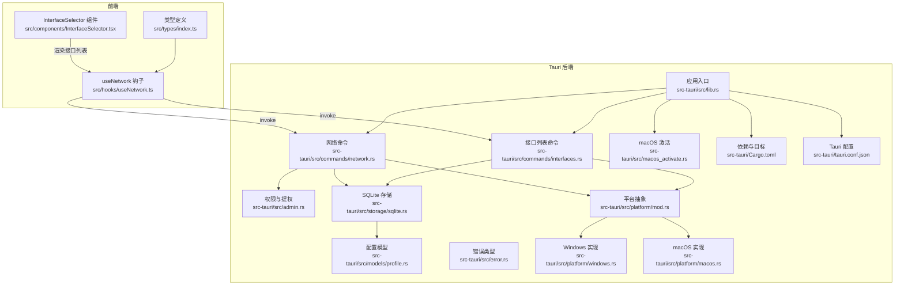
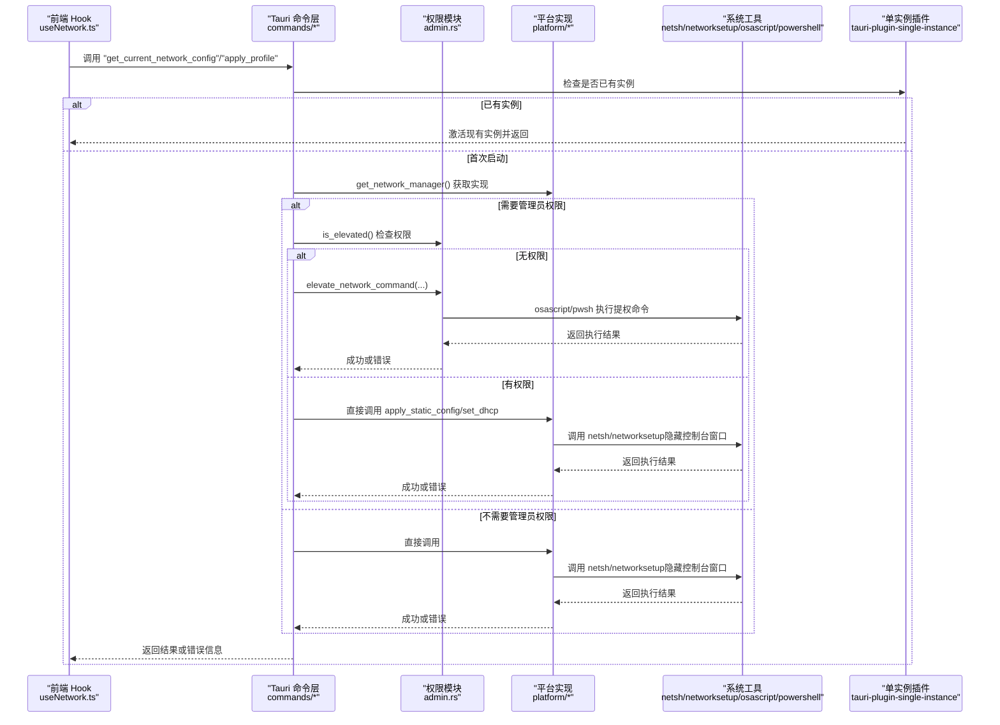
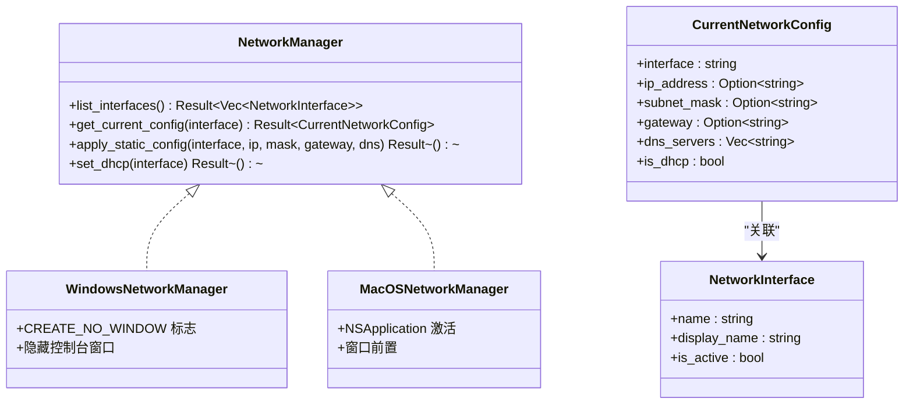
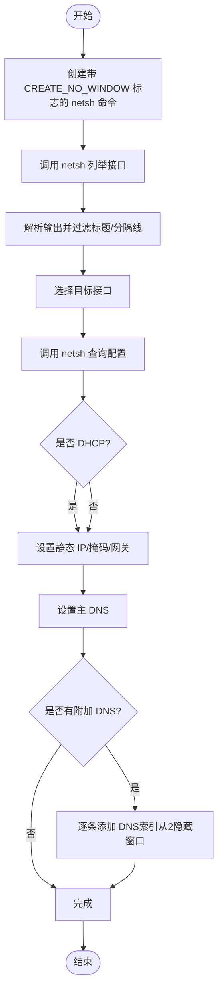
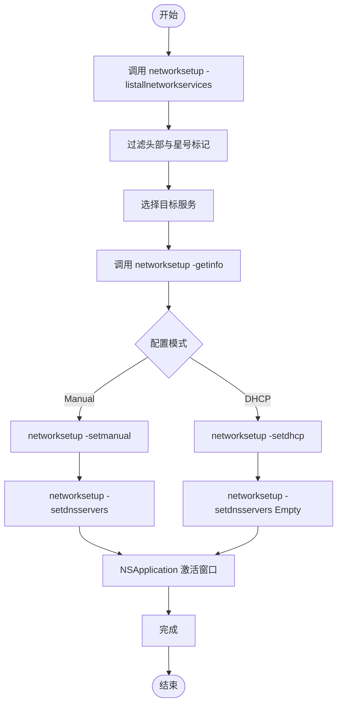
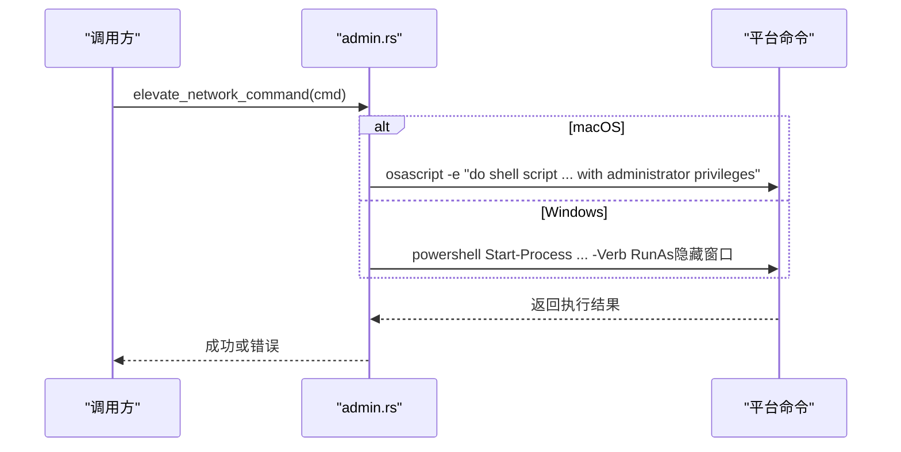
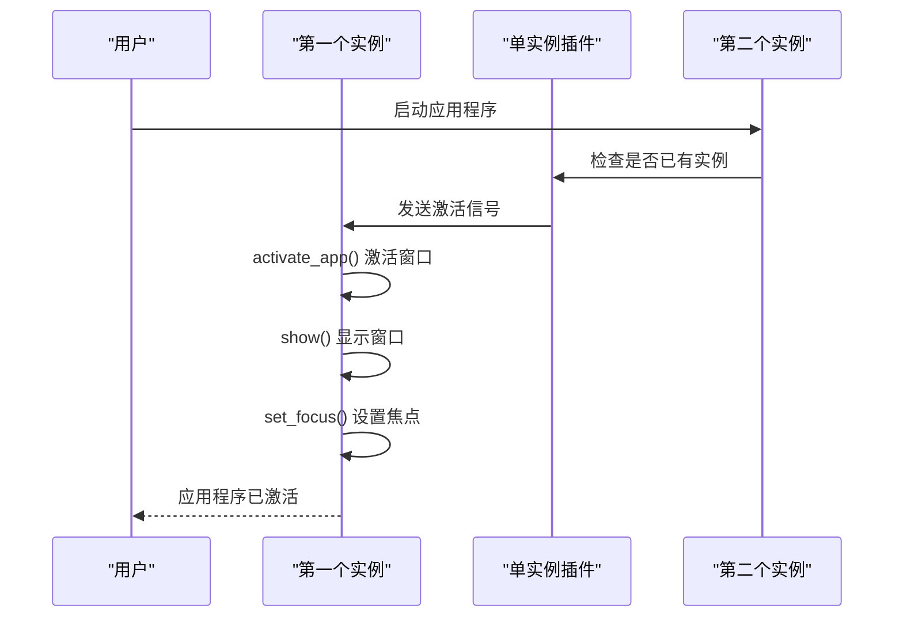
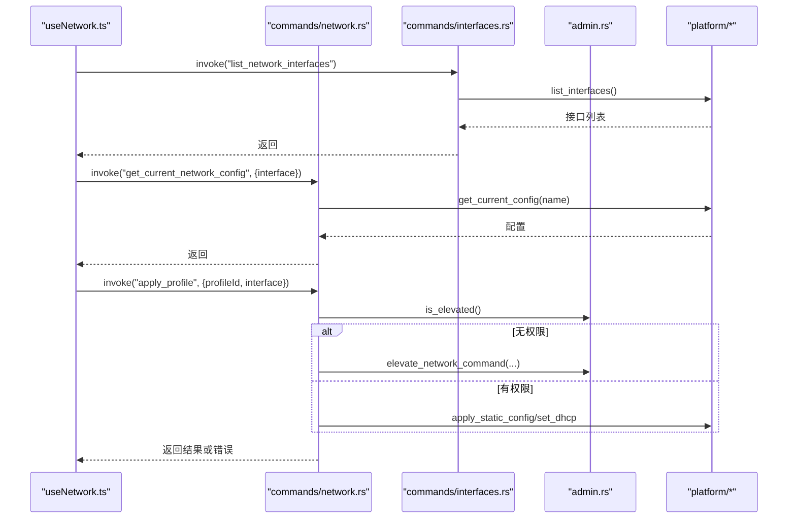
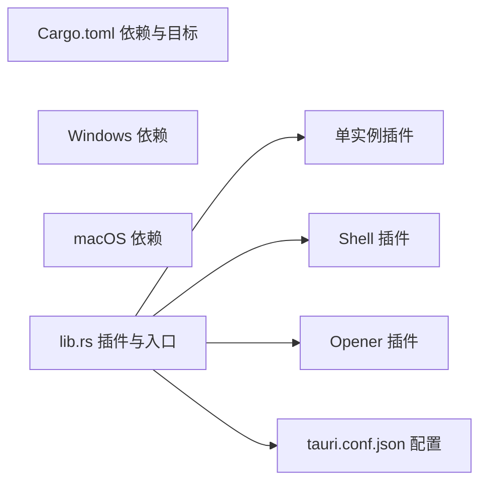

# 平台集成

<cite>
**本文引用的文件**
- [src-tauri/src/platform/mod.rs](file://src-tauri/src/platform/mod.rs)
- [src-tauri/src/platform/windows.rs](file://src-tauri/src/platform/windows.rs)
- [src-tauri/src/platform/macos.rs](file://src-tauri/src/platform/macos.rs)
- [src-tauri/src/admin.rs](file://src-tauri/src/admin.rs)
- [src-tauri/src/commands/network.rs](file://src-tauri/src/commands/network.rs)
- [src-tauri/src/commands/interfaces.rs](file://src-tauri/src/commands/interfaces.rs)
- [src-tauri/src/storage/sqlite.rs](file://src-tauri/src/storage/sqlite.rs)
- [src-tauri/src/models/profile.rs](file://src-tauri/src/models/profile.rs)
- [src-tauri/src/error.rs](file://src-tauri/src/error.rs)
- [src-tauri/src/lib.rs](file://src-tauri/src/lib.rs)
- [src-tauri/Cargo.toml](file://src-tauri/Cargo.toml)
- [src-tauri/tauri.conf.json](file://src-tauri/tauri.conf.json)
- [src-tauri/src/macos_activate.rs](file://src-tauri/src/macos_activate.rs)
- [src/hooks/useNetwork.ts](file://src/hooks/useNetwork.ts)
- [src/components/InterfaceSelector.tsx](file://src/components/InterfaceSelector.tsx)
- [src/types/index.ts](file://src/types/index.ts)
</cite>

## 更新摘要
**变更内容**
- 更新Windows平台的CREATE_NO_WINDOW标志实现，隐藏控制台窗口
- 新增单实例插件集成，防止应用程序重复启动
- 增强Windows平台的权限检测和命令执行体验
- 完善macOS平台的窗口激活机制

## 目录
1. [简介](#简介)
2. [项目结构](#项目结构)
3. [核心组件](#核心组件)
4. [架构总览](#架构总览)
5. [详细组件分析](#详细组件分析)
6. [依赖关系分析](#依赖关系分析)
7. [性能考量](#性能考量)
8. [故障排查指南](#故障排查指南)
9. [结论](#结论)
10. [附录](#附录)

## 简介
本文件聚焦于 IPSwitcher 的"平台集成功能"，系统阐述跨平台网络配置的实现策略与平台特定能力。文档覆盖以下要点：
- 跨平台抽象：通过统一的 NetworkManager 接口屏蔽 Windows 与 macOS 的差异。
- 平台实现：Windows 使用 netsh 命令与 PowerShell 提权；macOS 使用 networksetup 命令与 AppleScript 提权。
- 权限与安全：在非管理员/非 root 条件下，通过平台原生机制触发提权流程。
- 运行时适配：基于条件编译（cfg）选择对应实现，并在 Rust 层完成平台检测与工厂分发。
- 错误处理与恢复：统一的错误类型与错误传播，结合前端提示与重试逻辑。
- 兼容性与最佳实践：最小权限原则、命令解析健壮性、DNS 设置的容错策略。
- **新增**：Windows 平台的 CREATE_NO_WINDOW 标志改进，隐藏控制台窗口；单实例插件集成，防止重复启动。

## 项目结构
后端采用 Tauri v2 架构，Rust 侧负责平台抽象与命令实现，前端通过 @tauri-apps/api 调用后端命令。关键目录与文件如下：
- 平台抽象与实现：src-tauri/src/platform/mod.rs、windows.rs、macos.rs
- 权限与提权：src-tauri/src/admin.rs
- 命令层：src-tauri/src/commands/network.rs、interfaces.rs
- 数据存储：src-tauri/src/storage/sqlite.rs
- 模型与错误：src-tauri/src/models/profile.rs、src-tauri/src/error.rs
- 应用入口与插件：src-tauri/src/lib.rs、src-tauri/Cargo.toml、src-tauri/tauri.conf.json
- **新增**：macOS 激活机制：src-tauri/src/macos_activate.rs
- 前端集成：src/hooks/useNetwork.ts、src/components/InterfaceSelector.tsx、src/types/index.ts

**图表来源**
- [src-tauri/src/lib.rs:14-78](file://src-tauri/src/lib.rs#L14-L78)
- [src-tauri/src/commands/network.rs:9-100](file://src-tauri/src/commands/network.rs#L9-L100)
- [src-tauri/src/commands/interfaces.rs:1-8](file://src-tauri/src/commands/interfaces.rs#L1-L8)
- [src-tauri/src/admin.rs:26-172](file://src-tauri/src/admin.rs#L26-L172)
- [src-tauri/src/platform/mod.rs:12-63](file://src-tauri/src/platform/mod.rs#L12-L63)
- [src-tauri/src/platform/windows.rs:8-183](file://src-tauri/src/platform/windows.rs#L8-L183)
- [src-tauri/src/platform/macos.rs:8-174](file://src-tauri/src/platform/macos.rs#L8-L174)
- [src-tauri/src/storage/sqlite.rs:12-256](file://src-tauri/src/storage/sqlite.rs#L12-L256)
- [src-tauri/src/models/profile.rs:20-87](file://src-tauri/src/models/profile.rs#L20-L87)
- [src-tauri/src/error.rs:3-37](file://src-tauri/src/error.rs#L3-L37)
- [src-tauri/Cargo.toml:12-32](file://src-tauri/Cargo.toml#L12-L32)
- [src-tauri/tauri.conf.json:1-44](file://src-tauri/tauri.conf.json#L1-L44)

**章节来源**
- [src-tauri/src/lib.rs:14-78](file://src-tauri/src/lib.rs#L14-L78)
- [src-tauri/Cargo.toml:12-32](file://src-tauri/Cargo.toml#L12-L32)
- [src-tauri/tauri.conf.json:1-44](file://src-tauri/tauri.conf.json#L1-L44)

## 核心组件
- 平台抽象与工厂
  - 抽象接口：NetworkManager 定义统一方法族，包括列举接口、查询当前配置、应用静态配置、切换 DHCP。
  - 工厂函数：根据目标操作系统返回对应的实现（WindowsNetworkManager 或 MacOSNetworkManager）。
- 平台实现
  - **Windows**：使用 netsh 命令与 PowerShell 提权；**新增**：通过 CREATE_NO_WINDOW 标志隐藏控制台窗口；使用 netsh 设置静态 IP/DNS，使用 PowerShell 触发提升权限执行命令。
  - **macOS**：使用 networksetup 命令与 AppleScript 提权；**新增**：通过 objc2 调用 NSApplication 激活窗口；使用 networksetup 设置静态 IP/DNS，使用 osascript 触发提升权限执行命令。
- 权限与提权
  - 检测当前进程是否具备管理员/根权限；**新增**：Windows 平台使用 CREATE_NO_WINDOW 标志隐藏 net session 命令窗口。
  - 在无权限时，构建平台命令字符串并通过原生机制弹窗提权执行。
- 命令层
  - 网络命令：获取当前配置、应用配置方案、检查管理员状态。
  - 接口命令：列举网络接口。
- 存储与模型
  - SQLite 存储配置方案，按平台写入不同路径。
  - 配置模型包含 IP 模式、地址、掩码、网关、DNS、接口名等字段，并提供校验逻辑。
- 错误类型
  - 统一的 AppError，便于前后端一致处理与展示。
- **新增**：单实例插件
  - 防止应用程序重复启动，通过 tauri-plugin-single-instance 插件实现。
  - 当尝试启动第二个实例时，激活现有实例并显示主窗口。

**章节来源**
- [src-tauri/src/platform/mod.rs:12-63](file://src-tauri/src/platform/mod.rs#L12-L63)
- [src-tauri/src/platform/windows.rs:8-183](file://src-tauri/src/platform/windows.rs#L8-L183)
- [src-tauri/src/platform/macos.rs:8-174](file://src-tauri/src/platform/macos.rs#L8-L174)
- [src-tauri/src/admin.rs:3-172](file://src-tauri/src/admin.rs#L3-L172)
- [src-tauri/src/commands/network.rs:9-100](file://src-tauri/src/commands/network.rs#L9-L100)
- [src-tauri/src/commands/interfaces.rs:1-8](file://src-tauri/src/commands/interfaces.rs#L1-L8)
- [src-tauri/src/storage/sqlite.rs:12-256](file://src-tauri/src/storage/sqlite.rs#L12-L256)
- [src-tauri/src/models/profile.rs:20-87](file://src-tauri/src/models/profile.rs#L20-L87)
- [src-tauri/src/error.rs:3-37](file://src-tauri/src/error.rs#L3-L37)
- [src-tauri/src/lib.rs:19-26](file://src-tauri/src/lib.rs#L19-L26)

## 架构总览
下图展示了从前端到后端、再到平台命令与系统工具的整体调用链路，以及权限提升的关键节点。**更新**：新增单实例插件处理和Windows平台的CREATE_NO_WINDOW标志。

**图表来源**
- [src-tauri/src/commands/network.rs:9-100](file://src-tauri/src/commands/network.rs#L9-L100)
- [src-tauri/src/admin.rs:26-172](file://src-tauri/src/admin.rs#L26-L172)
- [src-tauri/src/platform/windows.rs:8-183](file://src-tauri/src/platform/windows.rs#L8-L183)
- [src-tauri/src/platform/macos.rs:8-174](file://src-tauri/src/platform/macos.rs#L8-L174)
- [src-tauri/src/lib.rs:19-26](file://src-tauri/src/lib.rs#L19-L26)

## 详细组件分析

### 平台抽象与工厂
- 抽象接口 NetworkManager 提供统一方法族，确保上层无需关心平台差异。
- 工厂函数 get_network_manager() 基于 cfg(target_os) 返回对应实现，避免在调用方分散判断。
- 数据结构 CurrentNetworkConfig/NetworkInterface 用于前后端数据交换。

**图表来源**
- [src-tauri/src/platform/mod.rs:12-63](file://src-tauri/src/platform/mod.rs#L12-L63)
- [src-tauri/src/platform/windows.rs:6-183](file://src-tauri/src/platform/windows.rs#L6-L183)
- [src-tauri/src/platform/macos.rs:6-174](file://src-tauri/src/platform/macos.rs#L6-L174)

**章节来源**
- [src-tauri/src/platform/mod.rs:12-63](file://src-tauri/src/platform/mod.rs#L12-L63)

### Windows 平台实现
- **新增**：CREATE_NO_WINDOW 标志
  - 在 Windows 平台使用 CREATE_NO_WINDOW 标志隐藏所有控制台窗口，包括 netsh 命令和权限检测。
  - 通过 std::os::windows::process::CommandExt::creation_flags 设置标志。
- 接口列举：通过 netsh interface ip show interfaces 解析输出，过滤标题与分隔线，提取接口名称与连接状态。
- 当前配置：通过 netsh interface ip show config name="..." 获取 DHCP、IP、掩码、网关等信息。
- 应用静态配置：先设置静态 IP/掩码/网关，再设置主 DNS 与附加 DNS（索引从 2 开始），对附加 DNS 失败进行告警但不中断整体流程。
- 切换 DHCP：分别设置地址与 DNS 为 DHCP 源。
- 权限与错误：若命令执行失败，返回网络错误；对 DNS 设置失败记录警告日志。

**图表来源**
- [src-tauri/src/platform/windows.rs:8-183](file://src-tauri/src/platform/windows.rs#L8-L183)

**章节来源**
- [src-tauri/src/platform/windows.rs:8-183](file://src-tauri/src/platform/windows.rs#L8-L183)

### macOS 平台实现
- **新增**：NSApplication 激活机制
  - 通过 objc2 调用 NSApplication.sharedApplication.activateIgnoringOtherApps(true) 将应用窗口前置。
  - 配合 macOS 的 Accessory 激活策略，在后台应用中也能正确激活窗口。
- 接口列举：通过 networksetup -listallnetworkservices 过滤头部与星号标记，识别活跃服务。
- 当前配置：通过 networksetup -getinfo 获取 DHCP/MANUAL、IP、掩码、路由器与 DNS 列表。
- 应用静态配置：networksetup -setmanual 设置静态 IP/掩码/网关；networksetup -setdnsservers 设置 DNS。
- 切换 DHCP：networksetup -setdhcp；同时将 DNS 设为空以使用 DHCP 提供的 DNS。
- 权限与错误：若命令执行失败，返回网络错误；对 DNS 设置失败记录警告日志。

**图表来源**
- [src-tauri/src/platform/macos.rs:8-174](file://src-tauri/src/platform/macos.rs#L8-L174)
- [src-tauri/src/macos_activate.rs:1-25](file://src-tauri/src/macos_activate.rs#L1-L25)

**章节来源**
- [src-tauri/src/platform/macos.rs:8-174](file://src-tauri/src/platform/macos.rs#L8-L174)
- [src-tauri/src/macos_activate.rs:1-25](file://src-tauri/src/macos_activate.rs#L1-L25)

### 权限检测与提权
- **新增**：Windows 平台的 CREATE_NO_WINDOW 标志
  - 在权限检测时使用 CREATE_NO_WINDOW 标志隐藏 net session 命令窗口。
  - 确保权限检查过程不干扰用户界面体验。
- 权限检测：macOS 使用 libc::geteuid；Windows 使用 net session。
- 提权执行：
  - macOS：构建 networksetup 命令，通过 osascript 以管理员权限执行。
  - Windows：构建 netsh 命令，通过 powershell Start-Process -Verb RunAs 以管理员权限执行。
- 错误处理：区分用户取消与执行失败，前者映射为权限不足错误，后者映射为网络错误。

**图表来源**
- [src-tauri/src/admin.rs:26-172](file://src-tauri/src/admin.rs#L26-L172)

**章节来源**
- [src-tauri/src/admin.rs:3-172](file://src-tauri/src/admin.rs#L3-L172)

### 单实例插件集成
- **新增**：tauri-plugin-single-instance 插件
  - 防止应用程序重复启动，确保只有一个实例运行。
  - 当尝试启动第二个实例时，触发回调函数处理现有实例。
- 回调处理：激活现有实例的应用窗口，显示并设置焦点。
- macOS 特殊处理：结合 macOS 激活策略，确保窗口正确前置。

**图表来源**
- [src-tauri/src/lib.rs:19-26](file://src-tauri/src/lib.rs#L19-L26)

**章节来源**
- [src-tauri/src/lib.rs:19-26](file://src-tauri/src/lib.rs#L19-L26)

### 命令层与前端集成
- 网络命令
  - get_current_network_config：自动选择活跃接口或使用传入接口，调用平台实现获取配置。
  - apply_profile：读取配置方案，按模式调用静态配置或 DHCP；若无权限则触发提权。
  - check_admin_status：返回当前管理员状态。
- 接口命令：list_network_interfaces 直接委托平台实现。
- 前端集成
  - useNetwork 钩子：封装 invoke 调用、加载状态、错误收集、定时刷新当前配置。
  - InterfaceSelector 组件：渲染接口列表，显示活跃状态与原始名称。

**图表来源**
- [src-tauri/src/commands/network.rs:9-100](file://src-tauri/src/commands/network.rs#L9-L100)
- [src-tauri/src/commands/interfaces.rs:1-8](file://src-tauri/src/commands/interfaces.rs#L1-L8)
- [src-tauri/src/admin.rs:26-172](file://src-tauri/src/admin.rs#L26-L172)
- [src/hooks/useNetwork.ts:13-98](file://src/hooks/useNetwork.ts#L13-L98)
- [src/components/InterfaceSelector.tsx:9-33](file://src/components/InterfaceSelector.tsx#L9-L33)

**章节来源**
- [src-tauri/src/commands/network.rs:9-100](file://src-tauri/src/commands/network.rs#L9-L100)
- [src-tauri/src/commands/interfaces.rs:1-8](file://src-tauri/src/commands/interfaces.rs#L1-L8)
- [src/hooks/useNetwork.ts:13-98](file://src/hooks/useNetwork.ts#L13-L98)
- [src/components/InterfaceSelector.tsx:9-33](file://src/components/InterfaceSelector.tsx#L9-L33)

### 存储与模型
- 存储：SQLite 表 profiles 存放配置方案；按平台写入不同路径（macOS 使用 Application Support，Windows 使用 APPDATA）。
- 模型：Profile 包含 IP 模式、地址、掩码、网关、DNS、接口名等字段；提供 validate 校验逻辑，确保手动模式下必填项完整且 DNS 合法。
- 错误：重复名称映射为重复名错误，查询不到映射为未找到错误。

**章节来源**
- [src-tauri/src/storage/sqlite.rs:12-256](file://src-tauri/src/storage/sqlite.rs#L12-L256)
- [src-tauri/src/models/profile.rs:20-87](file://src-tauri/src/models/profile.rs#L20-L87)

## 依赖关系分析
- 条件编译与目标依赖
  - macOS 目标引入 libc、objc2；Windows 目标无额外依赖。
  - 平台实现通过 cfg(target_os) 选择性编译。
- 插件与运行时
  - **新增**：Tauri 注册 tauri-plugin-single-instance 插件，防止重复启动。
  - **新增**：Tauri 注册 tauri-plugin-shell 和 tauri-plugin-opener 插件，为命令执行与文件打开提供支持。
  - 应用入口设置托盘图标、窗口行为与最小系统版本。

**图表来源**
- [src-tauri/Cargo.toml:26-32](file://src-tauri/Cargo.toml#L26-L32)
- [src-tauri/src/lib.rs:19-28](file://src-tauri/src/lib.rs#L19-L28)
- [src-tauri/tauri.conf.json:34-44](file://src-tauri/tauri.conf.json#L34-L44)

**章节来源**
- [src-tauri/Cargo.toml:26-32](file://src-tauri/Cargo.toml#L26-L32)
- [src-tauri/src/lib.rs:19-28](file://src-tauri/src/lib.rs#L19-L28)
- [src-tauri/tauri.conf.json:34-44](file://src-tauri/tauri.conf.json#L34-L44)

## 性能考量
- 命令执行开销：每次网络操作均会启动外部进程，建议在前端做节流与去抖，避免频繁刷新导致系统负载上升。
- **新增**：Windows 平台的 CREATE_NO_WINDOW 标志优化
  - 隐藏控制台窗口减少系统资源占用，提升用户体验。
  - 避免多个控制台窗口堆积影响系统性能。
- 解析复杂度：接口与配置解析为线性扫描，时间复杂度 O(n)，通常接口数量有限，影响可忽略。
- DNS 设置：Windows 对附加 DNS 的逐条设置可能带来多次命令调用，建议合并参数或减少不必要的重试。
- 缓存策略：可在前端缓存最近一次配置，减少不必要的重复查询。
- **新增**：单实例插件性能
  - 单实例检查开销极小，主要影响应用启动时间。
  - 避免重复实例带来的内存和 CPU 资源浪费。

## 故障排查指南
- 无管理员权限
  - 现象：apply_profile 失败并提示需要管理员权限。
  - 处理：调用 elevate_network_command，按平台弹出提权对话框；若用户取消，捕获权限不足错误。
- 命令执行失败
  - 现象：网络操作返回网络错误。
  - 处理：检查系统工具是否存在（netsh/networksetup）、接口名称是否正确、命令参数格式是否符合平台要求。
- DNS 设置异常
  - 现象：主 DNS 设置成功，附加 DNS 失败但不阻断整体流程。
  - 处理：关注日志中的警告，尝试单独设置附加 DNS 或检查网络服务状态。
- 接口不可用
  - 现象：get_current_network_config 未找到可用接口。
  - 处理：确认接口处于 Connected/活跃状态，或显式传入接口名称。
- 数据库问题
  - 现象：存储层抛出数据库错误或重复名错误。
  - 处理：检查数据库文件路径与权限，确保唯一性约束满足。
- **新增**：Windows 控制台窗口问题
  - 现象：命令执行时出现意外的控制台窗口。
  - 处理：确认 CREATE_NO_WINDOW 标志正确设置，检查 Windows 平台的进程创建标志。
- **新增**：单实例冲突
  - 现象：启动第二个实例时应用程序无响应。
  - 处理：检查单实例插件配置，确认回调函数正确处理现有实例激活。
- **新增**：macOS 窗口激活问题
  - 现象：单实例激活后窗口未正确前置。
  - 处理：确认 NSApplication 激活机制正常工作，检查 macOS 权限设置。

**章节来源**
- [src-tauri/src/admin.rs:26-172](file://src-tauri/src/admin.rs#L26-L172)
- [src-tauri/src/platform/windows.rs:95-183](file://src-tauri/src/platform/windows.rs#L95-L183)
- [src-tauri/src/platform/macos.rs:119-174](file://src-tauri/src/platform/macos.rs#L119-L174)
- [src-tauri/src/commands/network.rs:97-100](file://src-tauri/src/commands/network.rs#L97-L100)
- [src-tauri/src/storage/sqlite.rs:146-232](file://src-tauri/src/storage/sqlite.rs#L146-L232)
- [src-tauri/src/lib.rs:19-26](file://src-tauri/src/lib.rs#L19-L26)

## 结论
IPSwitcher 通过清晰的平台抽象与工厂模式，将 Windows 与 macOS 的网络配置差异隐藏在统一接口之后。**最新更新**包括：
- Windows 平台的 CREATE_NO_WINDOW 标志改进，有效隐藏控制台窗口，提升用户体验。
- 单实例插件集成，防止应用程序重复启动，优化系统资源使用。
- macOS 平台的 NSApplication 激活机制，确保窗口正确前置。

配合完善的权限检测与提权流程，实现了在不同平台上的稳定网络配置切换。前端通过 Tauri 命令与状态管理，提供了直观的用户交互与实时反馈。建议在后续迭代中进一步优化命令执行频率、增强错误恢复与回滚能力，并完善平台扩展点以支持更多网络服务管理场景。

## 附录
- 平台差异对比
  - 接口/服务名称：Windows 使用 netsh 输出的接口名；macOS 使用 networksetup 的服务名。
  - 配置模式：Windows 显示"DHCP enabled"；macOS 显示"DHCP Configuration/Manual Configuration"。
  - DNS 设置：Windows 支持索引设置附加 DNS；macOS 一次性设置多个 DNS。
  - 提权方式：Windows 使用 PowerShell 的 -Verb RunAs；macOS 使用 osascript 的管理员权限脚本。
  - **新增**：Windows 控制台窗口：使用 CREATE_NO_WINDOW 标志隐藏所有控制台窗口。
  - **新增**：单实例管理：通过 tauri-plugin-single-instance 防止重复启动。
- 兼容性与最佳实践
  - 最小权限：仅在网络操作时触发提权，其他场景尽量避免管理员权限。
  - 健壮解析：对系统输出进行严格过滤与边界检查，避免解析错误。
  - 错误分类：将用户取消与执行失败区分开，提供明确的错误提示。
  - 平台扩展：新增平台时，遵循 NetworkManager 接口与工厂模式，保持上层调用不变。
  - **新增**：Windows 平台优化：始终使用 CREATE_NO_WINDOW 标志，确保良好的用户体验。
  - **新增**：单实例策略：合理处理重复启动场景，提供流畅的应用程序生命周期管理。