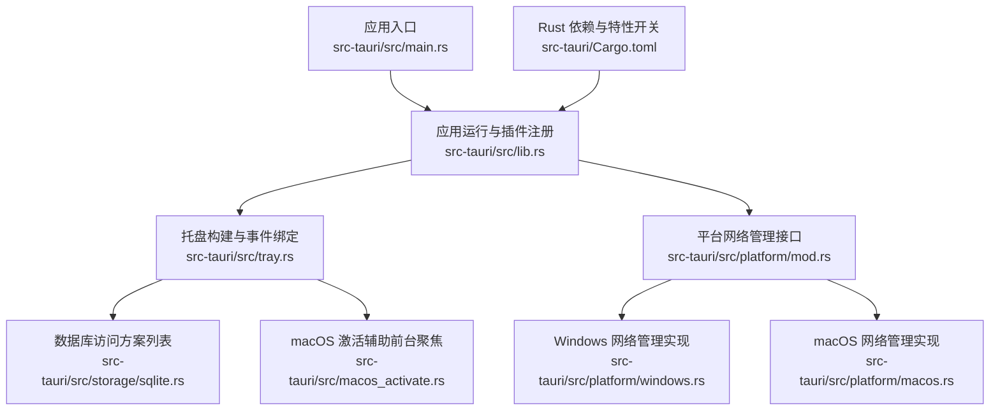
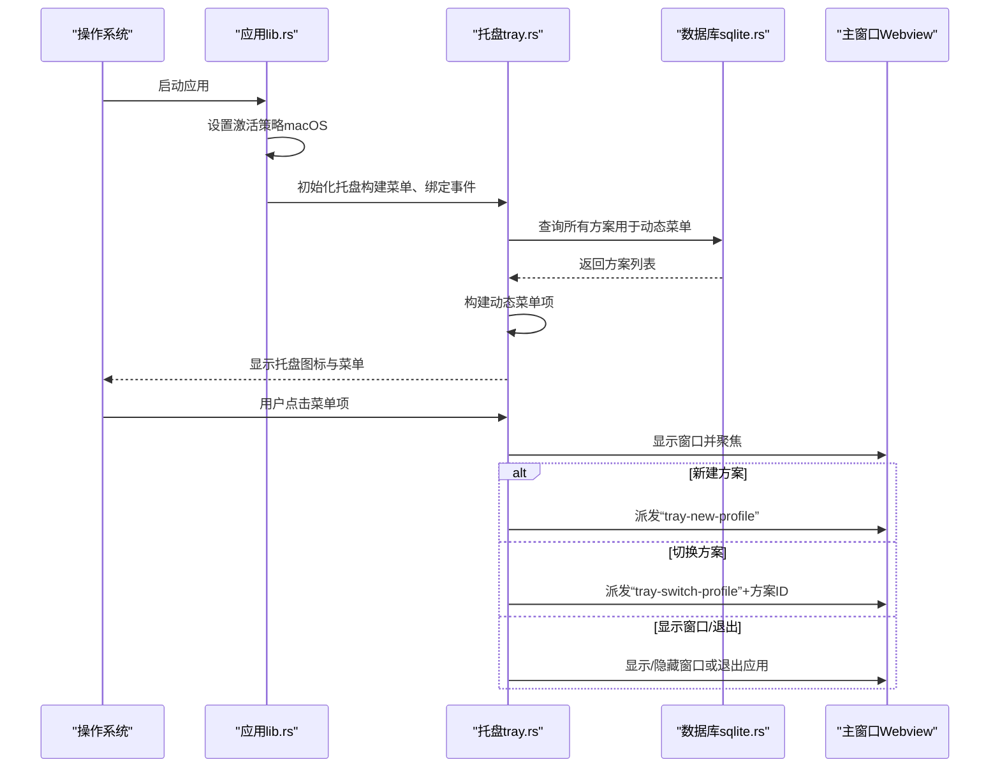
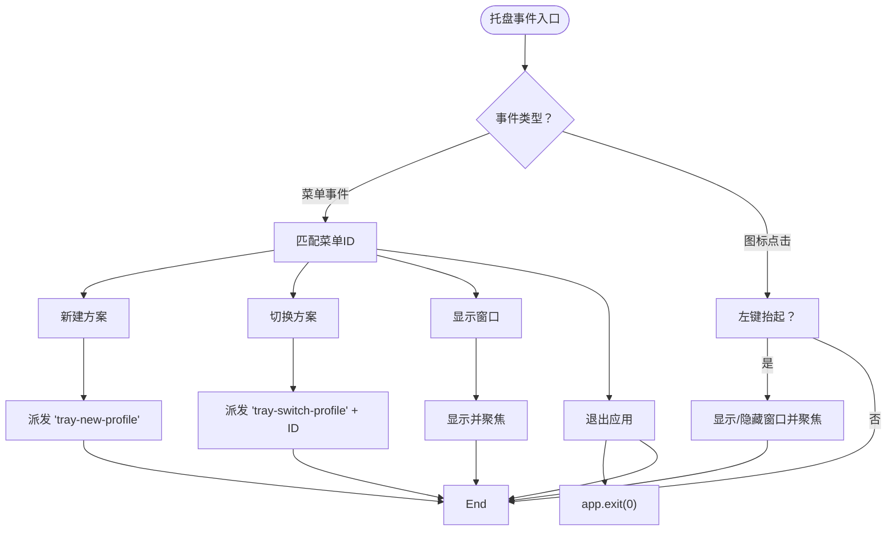
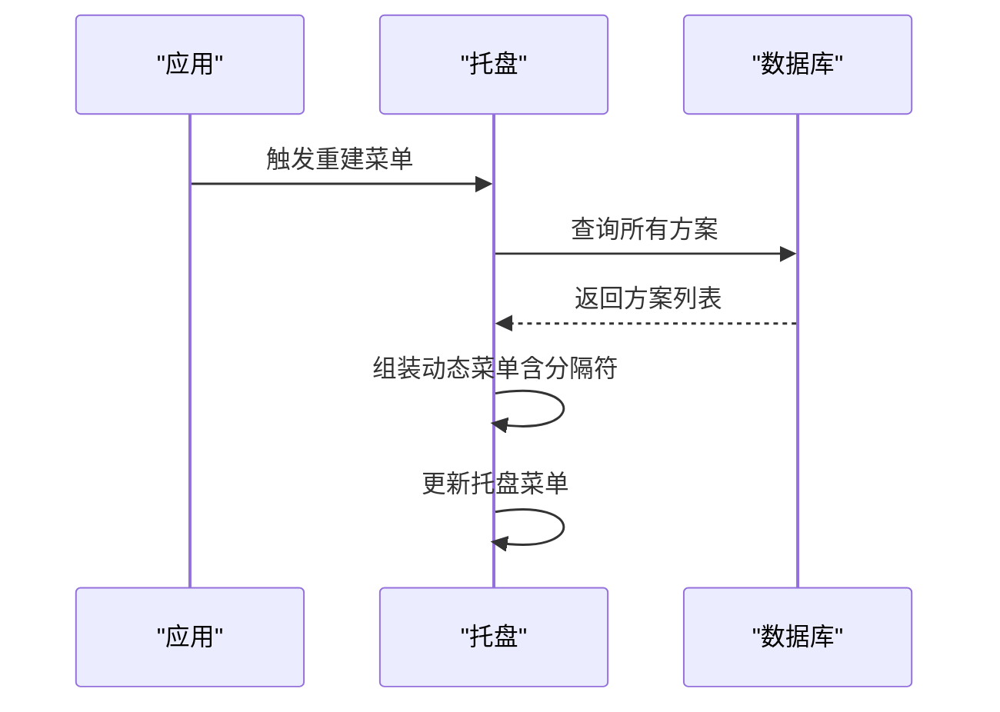
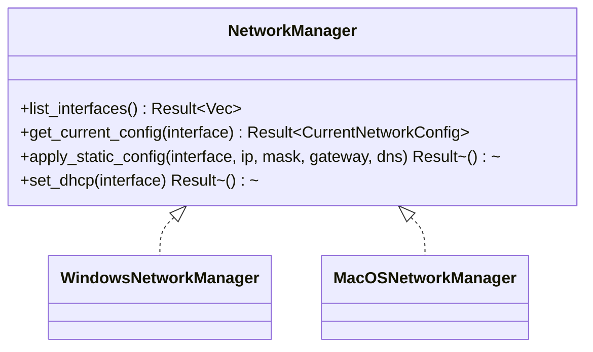
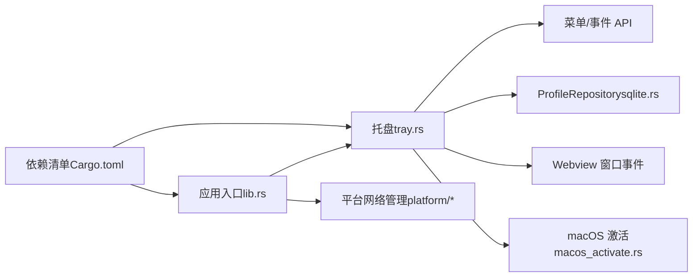

# 托盘集成

<cite>
**本文引用的文件**
- [src-tauri/src/tray.rs](file://src-tauri/src/tray.rs)
- [src-tauri/src/lib.rs](file://src-tauri/src/lib.rs)
- [src-tauri/src/macos_activate.rs](file://src-tauri/src/macos_activate.rs)
- [src-tauri/src/storage/sqlite.rs](file://src-tauri/src/storage/sqlite.rs)
- [src-tauri/src/platform/mod.rs](file://src-tauri/src/platform/mod.rs)
- [src-tauri/src/platform/windows.rs](file://src-tauri/src/platform/windows.rs)
- [src-tauri/src/platform/macos.rs](file://src-tauri/src/platform/macos.rs)
- [src-tauri/Cargo.toml](file://src-tauri/Cargo.toml)
- [src-tauri/src/main.rs](file://src-tauri/src/main.rs)
</cite>

## 目录
1. [简介](#简介)
2. [项目结构](#项目结构)
3. [核心组件](#核心组件)
4. [架构总览](#架构总览)
5. [详细组件分析](#详细组件分析)
6. [依赖关系分析](#依赖关系分析)
7. [性能考量](#性能考量)
8. [故障排查指南](#故障排查指南)
9. [结论](#结论)
10. [附录](#附录)

## 简介
本文件聚焦于 IPSwitcher 的系统托盘（System Tray）集成能力，覆盖托盘图标的创建、菜单项构建与事件处理、托盘状态管理、动态菜单更新、用户交互响应、图标设计规范与多分辨率支持、主题适配、通知与系统消息集成、用户反馈机制、跨平台差异与兼容性处理、性能优化以及无障碍支持等主题。读者可据此理解托盘在应用生命周期中的职责、事件流与数据流，并据此进行功能扩展与定制。

## 项目结构
托盘相关逻辑主要位于 Rust 后端（Tauri）侧，前端通过窗口事件与后端通信；托盘初始化在应用启动阶段完成，菜单项根据数据库中的“方案”动态生成，点击菜单或托盘图标会触发窗口显示/隐藏与前端事件派发。

**图表来源**
- [src-tauri/src/main.rs:1-7](file://src-tauri/src/main.rs#L1-L7)
- [src-tauri/src/lib.rs:14-30](file://src-tauri/src/lib.rs#L14-L30)
- [src-tauri/src/tray.rs:21-98](file://src-tauri/src/tray.rs#L21-L98)
- [src-tauri/src/storage/sqlite.rs:76-108](file://src-tauri/src/storage/sqlite.rs#L76-L108)
- [src-tauri/src/macos_activate.rs:10-15](file://src-tauri/src/macos_activate.rs#L10-L15)
- [src-tauri/src/platform/mod.rs:54-63](file://src-tauri/src/platform/mod.rs#L54-L63)
- [src-tauri/src/platform/windows.rs:8-38](file://src-tauri/src/platform/windows.rs#L8-L38)
- [src-tauri/src/platform/macos.rs:8-43](file://src-tauri/src/platform/macos.rs#L8-L43)
- [src-tauri/Cargo.toml:12-24](file://src-tauri/Cargo.toml#L12-L24)

**章节来源**
- [src-tauri/src/main.rs:1-7](file://src-tauri/src/main.rs#L1-L7)
- [src-tauri/src/lib.rs:14-30](file://src-tauri/src/lib.rs#L14-L30)
- [src-tauri/Cargo.toml:12-24](file://src-tauri/Cargo.toml#L12-L24)

## 核心组件
- 托盘构建器：负责创建托盘图标、设置菜单、绑定菜单事件与托盘图标点击事件。
- 动态菜单重建器：从数据库读取所有“方案”，按方案动态生成“切换到: 方案名”菜单项。
- 前端事件桥接：通过窗口事件向前端派发“新建方案”、“切换方案”等动作，驱动界面响应。
- 平台激活策略：macOS 使用专用激活函数以确保窗口在 Dock 图标被短暂闪烁后仍能正确置前。
- 数据持久化：使用 SQLite 存储“方案”，提供列表查询与约束校验。

**章节来源**
- [src-tauri/src/tray.rs:21-98](file://src-tauri/src/tray.rs#L21-L98)
- [src-tauri/src/tray.rs:102-143](file://src-tauri/src/tray.rs#L102-L143)
- [src-tauri/src/lib.rs:24-28](file://src-tauri/src/lib.rs#L24-L28)
- [src-tauri/src/macos_activate.rs:10-15](file://src-tauri/src/macos_activate.rs#L10-L15)
- [src-tauri/src/storage/sqlite.rs:76-108](file://src-tauri/src/storage/sqlite.rs#L76-L108)

## 架构总览
下图展示托盘初始化、事件处理与前端交互的整体流程，包括菜单构建、动态更新、窗口控制与事件派发。

**图表来源**
- [src-tauri/src/lib.rs:24-28](file://src-tauri/src/lib.rs#L24-L28)
- [src-tauri/src/tray.rs:21-98](file://src-tauri/src/tray.rs#L21-L98)
- [src-tauri/src/tray.rs:102-143](file://src-tauri/src/tray.rs#L102-L143)
- [src-tauri/src/storage/sqlite.rs:76-108](file://src-tauri/src/storage/sqlite.rs#L76-L108)

## 详细组件分析

### 托盘图标与菜单构建
- 图标来源：使用默认窗口图标作为托盘图标，并标记为模板图标以便系统深浅色主题适配。
- 菜单项：
  - 显示主窗口
  - 新建方案（同时触发窗口显示与前端事件）
  - 退出应用
  - 动态子菜单：基于数据库中所有“方案”生成“切换到: 方案名”菜单项，点击后派发方案ID给前端
- 工具提示：设置为应用名称，便于识别。

**章节来源**
- [src-tauri/src/tray.rs:21-98](file://src-tauri/src/tray.rs#L21-L98)

### 事件处理机制
- 菜单事件：
  - 显示主窗口：调用窗口显示与聚焦逻辑。
  - 新建方案：先显示窗口，再通过窗口事件派发“tray-new-profile”给前端。
  - 切换方案：解析菜单ID中的方案ID，显示窗口并派发“tray-switch-profile”+ID。
  - 退出：直接退出应用。
- 托盘图标点击事件（左键抬起）：
  - 若窗口可见则隐藏，否则显示并聚焦。
  - macOS 上通过激活函数确保窗口置前。

**图表来源**
- [src-tauri/src/tray.rs:50-93](file://src-tauri/src/tray.rs#L50-L93)
- [src-tauri/src/macos_activate.rs:10-15](file://src-tauri/src/macos_activate.rs#L10-L15)

**章节来源**
- [src-tauri/src/tray.rs:50-93](file://src-tauri/src/tray.rs#L50-L93)
- [src-tauri/src/macos_activate.rs:10-15](file://src-tauri/src/macos_activate.rs#L10-L15)

### 动态菜单更新与状态管理
- 动态菜单重建：
  - 从数据库读取全部“方案”，为每个方案生成独立菜单项。
  - 将“新建方案”“显示窗口”“退出”等固定项置于末尾分隔符之后。
  - 更新当前托盘菜单对象。
- 状态管理：
  - 应用启动时设置 macOS 的激活策略为“附件型”，避免 Dock 图标闪烁。
  - 窗口关闭请求时隐藏窗口并阻止系统关闭，保持后台运行。

**图表来源**
- [src-tauri/src/tray.rs:102-143](file://src-tauri/src/tray.rs#L102-L143)
- [src-tauri/src/storage/sqlite.rs:76-108](file://src-tauri/src/storage/sqlite.rs#L76-L108)
- [src-tauri/src/lib.rs:24-28](file://src-tauri/src/lib.rs#L24-L28)

**章节来源**
- [src-tauri/src/tray.rs:102-143](file://src-tauri/src/tray.rs#L102-L143)
- [src-tauri/src/lib.rs:24-28](file://src-tauri/src/lib.rs#L24-L28)

### 前端交互与事件桥接
- 通过窗口事件向前端派发两类托盘相关事件：
  - “tray-new-profile”：用于引导前端打开新建方案界面。
  - “tray-switch-profile”：携带具体方案ID，前端据此执行网络配置应用流程。
- 前端可监听这些事件以实现即时反馈与界面联动。

**章节来源**
- [src-tauri/src/tray.rs:58-70](file://src-tauri/src/tray.rs#L58-L70)

### 图标设计规范、多分辨率与主题适配
- 模板图标：启用模板图标后，系统会在浅色/深色模式下自动调整颜色，提升可读性与一致性。
- 多分辨率支持：建议提供多尺寸图标资源并在构建时由 Tauri 自动选择合适尺寸；当前实现使用默认窗口图标，若需更佳表现可在构建阶段补充多分辨率资源。
- 主题适配：模板图标与系统工具栏风格一致，减少视觉割裂。

**章节来源**
- [src-tauri/src/tray.rs:47](file://src-tauri/src/tray.rs#L47)

### 通知系统、系统消息与用户反馈
- 当前托盘未直接集成系统通知（如 macOS 的 NSUserNotification 或 Windows 的 Toast），但可通过窗口事件与前端协作实现反馈。
- 推荐实践：
  - 在前端监听托盘事件后，弹出本地对话框或状态条提示。
  - 对于错误场景（如切换失败），在前端展示错误消息并记录日志。
- 日志：应用初始化时启用日志，便于问题定位。

**章节来源**
- [src-tauri/src/lib.rs:15](file://src-tauri/src/lib.rs#L15)

### 扩展点与快捷操作
- 快捷操作建议：
  - 添加“立即应用当前配置”菜单项，直接触发网络应用命令。
  - 添加“复制当前IP/DNS”菜单项，便于快速分享。
  - 添加“刷新网络状态”菜单项，触发前端重新拉取当前配置。
- 自定义配置：
  - 可在托盘菜单中增加“设置/偏好”入口，或在动态菜单中加入“最近使用”排序。
  - 支持按接口过滤动态菜单项，仅显示当前活跃接口对应的方案。

**章节来源**
- [src-tauri/src/tray.rs:102-143](file://src-tauri/src/tray.rs#L102-L143)

### 跨平台差异与兼容性
- macOS：
  - 使用“附件型”激活策略，避免 Dock 图标闪烁。
  - 需要专用激活函数以确保窗口置前。
- Windows：
  - 默认行为与菜单事件处理一致，无需额外激活步骤。
- 平台网络管理：
  - 提供统一接口抽象，分别针对 Windows 与 macOS 实现网络配置应用与查询。
  - 通过命令行工具（netsh/networksetup）执行底层操作，注意权限与输出解析。

**图表来源**
- [src-tauri/src/platform/mod.rs:13-42](file://src-tauri/src/platform/mod.rs#L13-L42)
- [src-tauri/src/platform/windows.rs:8-38](file://src-tauri/src/platform/windows.rs#L8-L38)
- [src-tauri/src/platform/macos.rs:8-43](file://src-tauri/src/platform/macos.rs#L8-L43)

**章节来源**
- [src-tauri/src/lib.rs:24-28](file://src-tauri/src/lib.rs#L24-L28)
- [src-tauri/src/macos_activate.rs:10-15](file://src-tauri/src/macos_activate.rs#L10-L15)
- [src-tauri/src/platform/mod.rs:54-63](file://src-tauri/src/platform/mod.rs#L54-L63)
- [src-tauri/src/platform/windows.rs:8-38](file://src-tauri/src/platform/windows.rs#L8-L38)
- [src-tauri/src/platform/macos.rs:8-43](file://src-tauri/src/platform/macos.rs#L8-L43)

## 依赖关系分析
- 托盘功能依赖 Tauri 的 tray-icon 特性与菜单/事件 API。
- 数据访问通过 ProfileRepository 进行，依赖 SQLite。
- macOS 激活策略依赖系统原生 API（通过条件编译模块）。
- 平台网络管理通过命令行工具实现，存在跨平台差异。

**图表来源**
- [src-tauri/src/tray.rs:1-5](file://src-tauri/src/tray.rs#L1-L5)
- [src-tauri/src/storage/sqlite.rs:8-10](file://src-tauri/src/storage/sqlite.rs#L8-L10)
- [src-tauri/src/macos_activate.rs:10-15](file://src-tauri/src/macos_activate.rs#L10-L15)
- [src-tauri/src/lib.rs:19-30](file://src-tauri/src/lib.rs#L19-L30)
- [src-tauri/src/platform/mod.rs:54-63](file://src-tauri/src/platform/mod.rs#L54-L63)
- [src-tauri/Cargo.toml:12-24](file://src-tauri/Cargo.toml#L12-L24)

**章节来源**
- [src-tauri/src/tray.rs:1-5](file://src-tauri/src/tray.rs#L1-L5)
- [src-tauri/src/lib.rs:19-30](file://src-tauri/src/lib.rs#L19-L30)
- [src-tauri/Cargo.toml:12-24](file://src-tauri/Cargo.toml#L12-L24)

## 性能考量
- 动态菜单重建成本：每次重建均需查询数据库并组装菜单，建议在方案变更时触发重建，而非频繁轮询。
- 窗口焦点与激活：macOS 上的激活调用为必要开销，避免在高频事件中重复调用。
- 数据库并发：ProfileRepository 使用互斥锁保护连接，避免并发写入冲突；读取操作应尽量批量化。
- 图标渲染：模板图标由系统处理，避免在主线程做额外图像处理。

**章节来源**
- [src-tauri/src/tray.rs:102-143](file://src-tauri/src/tray.rs#L102-L143)
- [src-tauri/src/storage/sqlite.rs:8-10](file://src-tauri/src/storage/sqlite.rs#L8-L10)
- [src-tauri/src/macos_activate.rs:10-15](file://src-tauri/src/macos_activate.rs#L10-L15)

## 故障排查指南
- 托盘不显示或菜单为空：
  - 检查托盘构建是否在应用启动阶段完成。
  - 确认数据库初始化与迁移是否成功。
- macOS 窗口无法置前：
  - 确认已设置“附件型”激活策略且调用了激活函数。
- 菜单点击无响应：
  - 检查菜单ID格式是否符合预期（动态项以“switch_profile:”前缀）。
  - 确认前端已监听对应窗口事件并进行处理。
- 权限问题导致网络配置失败：
  - Windows 使用 netsh，macOS 使用 networksetup，均需要管理员权限；错误信息已在平台实现中返回。

**章节来源**
- [src-tauri/src/lib.rs:24-28](file://src-tauri/src/lib.rs#L24-L28)
- [src-tauri/src/storage/sqlite.rs:76-108](file://src-tauri/src/storage/sqlite.rs#L76-L108)
- [src-tauri/src/platform/windows.rs:105-109](file://src-tauri/src/platform/windows.rs#L105-L109)
- [src-tauri/src/platform/macos.rs:129-133](file://src-tauri/src/platform/macos.rs#L129-L133)

## 结论
IPSwitcher 的托盘集成为用户提供了便捷的后台操作入口：一键显示窗口、快速新建与切换“方案”。通过动态菜单与窗口事件桥接，托盘与前端形成清晰的职责边界。跨平台差异在 macOS 上通过激活策略与专用函数得到妥善处理。未来可在通知系统、快捷操作与主题适配上进一步增强用户体验，并在性能上对菜单重建与数据库访问进行优化。

## 附录
- 无障碍支持建议：
  - 为菜单项提供可读性强的标签与快捷键提示。
  - 在窗口显示/隐藏时同步更新系统可访问性状态。
- 安全与权限：
  - 网络配置涉及系统级操作，应在前端明确提示并记录日志，避免误操作。