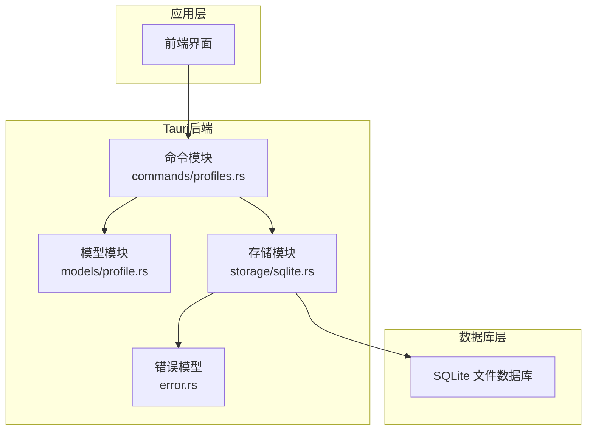
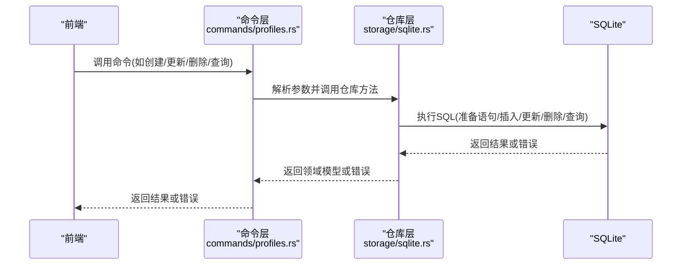
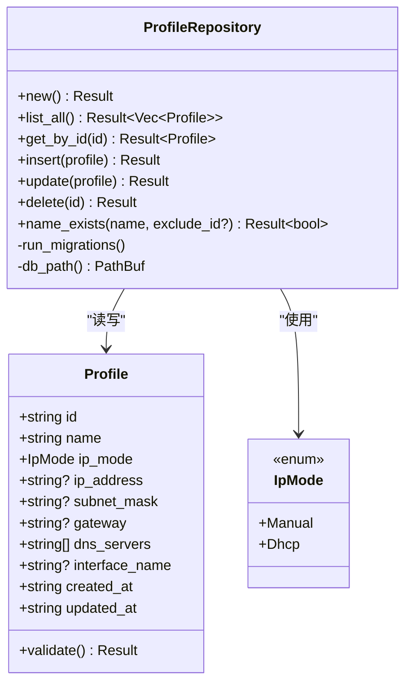
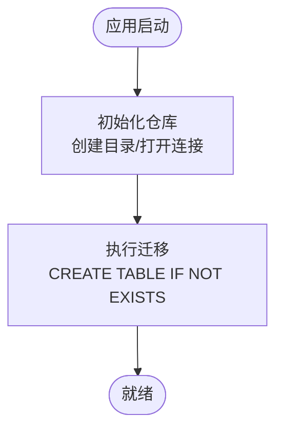
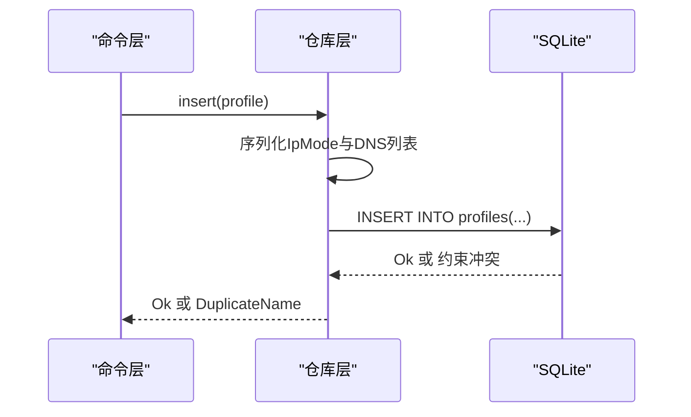
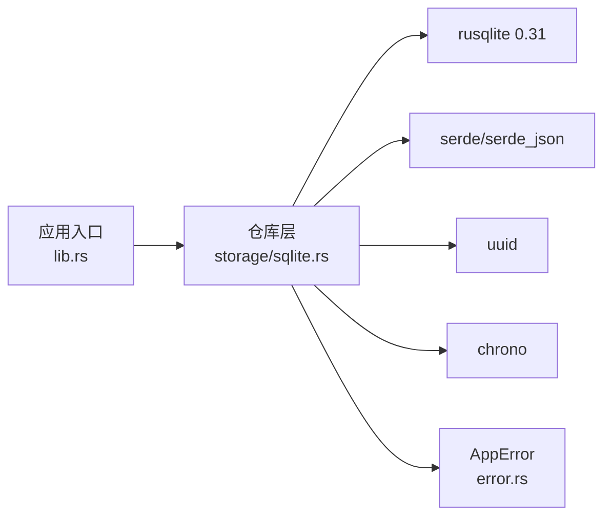

# 数据存储层

<cite>
**本文引用的文件**
- [src-tauri/src/storage/sqlite.rs](file://src-tauri/src/storage/sqlite.rs)
- [src-tauri/src/models/profile.rs](file://src-tauri/src/models/profile.rs)
- [src-tauri/src/commands/profiles.rs](file://src-tauri/src/commands/profiles.rs)
- [src-tauri/src/lib.rs](file://src-tauri/src/lib.rs)
- [src-tauri/src/error.rs](file://src-tauri/src/error.rs)
- [src-tauri/Cargo.toml](file://src-tauri/Cargo.toml)
</cite>

## 目录
1. [简介](#简介)
2. [项目结构](#项目结构)
3. [核心组件](#核心组件)
4. [架构总览](#架构总览)
5. [详细组件分析](#详细组件分析)
6. [依赖分析](#依赖分析)
7. [性能考虑](#性能考虑)
8. [故障排查指南](#故障排查指南)
9. [结论](#结论)
10. [附录](#附录)

## 简介
本章节面向IPSwitcher的数据存储层，系统性阐述基于SQLite与rusqlite的实现方式，覆盖数据库设计、连接管理、事务与并发控制、DAO模式、查询与索引策略、数据迁移与完整性保障、错误处理与性能监控，以及版本管理与向后兼容策略。读者无需深入Rust或SQLite即可理解整体设计与使用方式。

## 项目结构
数据存储层位于Tauri后端（Rust侧），采用模块化组织：
- 存储层：src-tauri/src/storage/sqlite.rs 提供ProfileRepository，封装数据库连接、迁移、CRUD与辅助查询。
- 模型层：src-tauri/src/models/profile.rs 定义Profile与IpMode数据结构及校验逻辑。
- 命令层：src-tauri/src/commands/profiles.rs 将存储层能力暴露为Tauri命令，供前端调用。
- 应用入口：src-tauri/src/lib.rs 初始化数据库并注册命令。
- 错误模型：src-tauri/src/error.rs 统一错误类型与序列化。
- 依赖声明：src-tauri/Cargo.toml 指定rusqlite等依赖。

**图表来源**
- [src-tauri/src/lib.rs:14-50](file://src-tauri/src/lib.rs#L14-L50)
- [src-tauri/src/commands/profiles.rs:1-113](file://src-tauri/src/commands/profiles.rs#L1-L113)
- [src-tauri/src/storage/sqlite.rs:1-256](file://src-tauri/src/storage/sqlite.rs#L1-L256)
- [src-tauri/src/models/profile.rs:1-88](file://src-tauri/src/models/profile.rs#L1-L88)
- [src-tauri/src/error.rs:1-38](file://src-tauri/src/error.rs#L1-L38)

**章节来源**
- [src-tauri/src/lib.rs:14-50](file://src-tauri/src/lib.rs#L14-L50)
- [src-tauri/src/commands/profiles.rs:1-113](file://src-tauri/src/commands/profiles.rs#L1-L113)
- [src-tauri/src/storage/sqlite.rs:1-256](file://src-tauri/src/storage/sqlite.rs#L1-L256)
- [src-tauri/src/models/profile.rs:1-88](file://src-tauri/src/models/profile.rs#L1-L88)
- [src-tauri/src/error.rs:1-38](file://src-tauri/src/error.rs#L1-L38)
- [src-tauri/Cargo.toml:12-24](file://src-tauri/Cargo.toml#L12-L24)

## 核心组件
- Profile模型：描述网络配置方案，包含标识、名称、IP模式（手动/DHCP）、可选IP参数、DNS列表、接口名及时间戳。
- ProfileRepository：基于rusqlite的DAO实现，负责数据库初始化、迁移、CRUD与辅助查询。
- Tauri命令：将仓库方法暴露为命令，统一参数解析与返回值。
- 错误体系：AppError统一捕获数据库、IO、序列化、校验、网络、权限等错误，并支持序列化。

**章节来源**
- [src-tauri/src/models/profile.rs:4-32](file://src-tauri/src/models/profile.rs#L4-L32)
- [src-tauri/src/storage/sqlite.rs:8-256](file://src-tauri/src/storage/sqlite.rs#L8-L256)
- [src-tauri/src/commands/profiles.rs:1-113](file://src-tauri/src/commands/profiles.rs#L1-L113)
- [src-tauri/src/error.rs:3-28](file://src-tauri/src/error.rs#L3-L28)

## 架构总览
数据流从前端发起Tauri命令，经命令层解析参数后调用仓库层，仓库通过rusqlite执行SQL，最终持久化到SQLite文件。错误在各层以AppError形式传播，便于统一处理与序列化。

**图表来源**
- [src-tauri/src/commands/profiles.rs:9-113](file://src-tauri/src/commands/profiles.rs#L9-L113)
- [src-tauri/src/storage/sqlite.rs:76-232](file://src-tauri/src/storage/sqlite.rs#L76-L232)

## 详细组件分析

### Profile模型与数据结构
- 字段说明
  - id: 方案唯一标识，字符串类型。
  - name: 方案名称，非空且全局唯一。
  - ip_mode: IP模式枚举，支持Manual与Dhcp。
  - ip_address/subnet_mask/gateway: 可选IPv4字符串，手动模式下必填。
  - dns_servers: DNS服务器字符串数组，JSON序列化存储。
  - interface_name: 可选网络接口名。
  - created_at/updated_at: 时间戳字符串（RFC 3339）。
- 校验规则
  - 名称长度限制与非空约束。
  - 手动模式必须提供有效IPv4地址、子网掩码、默认网关，且至少配置一个有效DNS。
  - DHCP模式下不允许设置上述IP相关字段。
- 关系映射
  - 模型与表结构一一对应，字段命名遵循snake_case映射。
  - DNS字段采用JSON序列化，便于灵活存储数组。

**图表来源**
- [src-tauri/src/models/profile.rs:4-32](file://src-tauri/src/models/profile.rs#L4-L32)
- [src-tauri/src/storage/sqlite.rs:8-256](file://src-tauri/src/storage/sqlite.rs#L8-L256)

**章节来源**
- [src-tauri/src/models/profile.rs:4-88](file://src-tauri/src/models/profile.rs#L4-L88)

### 数据库设计与迁移
- 表结构
  - profiles表：主键id，唯一name，ip_mode枚举约束，DNS以JSON字符串存储，时间戳字段。
- 迁移策略
  - 启动时自动执行一次CREATE TABLE IF NOT EXISTS，确保表存在。
  - 当前版本仅包含profiles表，未实现多版本迁移脚本。
- 唯一性与约束
  - name字段唯一，违反时抛出约束异常并映射为重复名称错误。
  - ip_mode使用CHECK约束限定合法值。

**图表来源**
- [src-tauri/src/storage/sqlite.rs:13-74](file://src-tauri/src/storage/sqlite.rs#L13-L74)

**章节来源**
- [src-tauri/src/storage/sqlite.rs:53-74](file://src-tauri/src/storage/sqlite.rs#L53-L74)

### DAO模式与CRUD实现
- 连接管理
  - 使用Mutex包裹rusqlite::Connection，保证线程安全访问。
  - 每次操作先加锁获取连接，再执行SQL，最后释放锁。
- 查询与映射
  - 列表查询按updated_at倒序返回，便于最近修改优先展示。
  - 单条查询与列表查询均将JSON字符串反序列化为Vec<String>作为DNS列表。
- 写入与更新
  - 插入与更新前将IpMode与Vec<String>序列化为字符串，写入数据库。
  - 更新时保留created_at不变，仅更新updated_at。
- 删除
  - 根据id删除，若影响行数为0则返回“未找到”错误。
- 辅助查询
  - name_exists用于重名校验，支持排除当前编辑记录的id。

**图表来源**
- [src-tauri/src/storage/sqlite.rs:146-182](file://src-tauri/src/storage/sqlite.rs#L146-L182)

**章节来源**
- [src-tauri/src/storage/sqlite.rs:76-232](file://src-tauri/src/storage/sqlite.rs#L76-L232)

### 并发控制与事务处理
- 并发控制
  - 通过Mutex保护Connection，避免多线程同时访问同一连接。
  - 对每个操作独立加锁，操作完成后立即释放，降低锁竞争。
- 事务处理
  - 当前实现未显式开启事务；所有单条SQL执行均为自动提交。
  - 若需批量写入或强一致场景，建议引入显式BEGIN/COMMIT以提升一致性与性能。

**章节来源**
- [src-tauri/src/storage/sqlite.rs:8-10](file://src-tauri/src/storage/sqlite.rs#L8-L10)
- [src-tauri/src/storage/sqlite.rs:146-232](file://src-tauri/src/storage/sqlite.rs#L146-L232)

### 查询优化与索引策略
- 现状
  - 列表查询按updated_at排序，但未见显式索引。
  - name字段唯一约束，具备去重能力。
- 建议
  - 为name添加唯一索引（已由UNIQUE约束实现）。
  - 为id添加主键索引（默认主键即索引）。
  - 如频繁按name精确匹配，可考虑为name建立覆盖索引。
  - 如存在高频条件查询（例如按interface_name过滤），可在profiles表增加相应索引。

**章节来源**
- [src-tauri/src/storage/sqlite.rs:60-71](file://src-tauri/src/storage/sqlite.rs#L60-L71)
- [src-tauri/src/storage/sqlite.rs:235-254](file://src-tauri/src/storage/sqlite.rs#L235-L254)

### 数据访问对象（DAO）模式
- 角色划分
  - 模型层：Profile与IpMode，负责数据结构与业务校验。
  - 仓库层：ProfileRepository，封装数据库交互细节。
  - 命令层：Tauri命令，负责参数解析与调用仓库。
- 优点
  - 隔离数据库实现细节，便于替换存储介质。
  - 统一错误处理与日志记录。
  - 易于单元测试与集成测试。

**章节来源**
- [src-tauri/src/models/profile.rs:4-32](file://src-tauri/src/models/profile.rs#L4-L32)
- [src-tauri/src/storage/sqlite.rs:8-256](file://src-tauri/src/storage/sqlite.rs#L8-L256)
- [src-tauri/src/commands/profiles.rs:1-113](file://src-tauri/src/commands/profiles.rs#L1-L113)

### SQL语句编写规范
- 参数化查询
  - 全部使用参数占位符（?1、?2…）防止注入。
- 字段选择
  - 查询明确列出所需字段，避免SELECT *。
- 约束与校验
  - 在SQL层通过CHECK与UNIQUE约束保证数据质量。
- JSON处理
  - DNS字段以JSON字符串存储，入库前序列化，出库后反序列化。

**章节来源**
- [src-tauri/src/storage/sqlite.rs:80-105](file://src-tauri/src/storage/sqlite.rs#L80-L105)
- [src-tauri/src/storage/sqlite.rs:114-139](file://src-tauri/src/storage/sqlite.rs#L114-L139)
- [src-tauri/src/storage/sqlite.rs:152-171](file://src-tauri/src/storage/sqlite.rs#L152-L171)
- [src-tauri/src/storage/sqlite.rs:190-209](file://src-tauri/src/storage/sqlite.rs#L190-L209)

### 数据完整性与一致性
- 唯一性
  - name唯一，重复插入触发约束异常，映射为重复名称错误。
- 外键
  - 当前无外键约束，未来扩展时可考虑引入。
- 事务
  - 当前未使用显式事务，建议在批量操作中引入以保证原子性。

**章节来源**
- [src-tauri/src/storage/sqlite.rs:60-71](file://src-tauri/src/storage/sqlite.rs#L60-L71)
- [src-tauri/src/storage/sqlite.rs:173-181](file://src-tauri/src/storage/sqlite.rs#L173-L181)
- [src-tauri/src/storage/sqlite.rs:211-221](file://src-tauri/src/storage/sqlite.rs#L211-L221)

### 错误处理与性能监控
- 错误处理
  - AppError统一捕获rusqlite、IO、序列化、校验、网络、权限等错误。
  - 约束冲突映射为重复名称；查询无结果映射为未找到；其他数据库错误映射为数据库错误。
- 性能监控
  - 当前未内置性能指标采集；建议在仓库层对关键SQL执行时间进行埋点统计。

**章节来源**
- [src-tauri/src/error.rs:3-28](file://src-tauri/src/error.rs#L3-L28)
- [src-tauri/src/storage/sqlite.rs:140-144](file://src-tauri/src/storage/sqlite.rs#L140-L144)
- [src-tauri/src/storage/sqlite.rs:212-213](file://src-tauri/src/storage/sqlite.rs#L212-L213)

### 版本管理与向后兼容
- 当前状态
  - 仅存在profiles表，未实现多版本迁移脚本。
- 建议
  - 引入版本号字段与迁移脚本，按版本升级表结构。
  - 迁移过程中保持向后兼容，逐步演进字段与索引。
  - 对历史数据进行安全转换，必要时提供回滚策略。

**章节来源**
- [src-tauri/src/storage/sqlite.rs:53-74](file://src-tauri/src/storage/sqlite.rs#L53-L74)

## 依赖分析
- rusqlite
  - 版本：0.31，启用bundled特性，静态链接libsqlite3。
  - 用途：数据库连接、SQL执行、参数绑定、错误映射。
- serde/serde_json
  - 用途：Profile与DNS数组的序列化/反序列化。
- uuid
  - 用途：生成Profile唯一ID。
- chrono
  - 用途：生成created_at/updated_at时间戳。
- thiserror
  - 用途：统一错误模型与派生错误实现。

**图表来源**
- [src-tauri/src/lib.rs:14-50](file://src-tauri/src/lib.rs#L14-L50)
- [src-tauri/src/storage/sqlite.rs:1-10](file://src-tauri/src/storage/sqlite.rs#L1-L10)
- [src-tauri/Cargo.toml:12-24](file://src-tauri/Cargo.toml#L12-L24)

**章节来源**
- [src-tauri/Cargo.toml:12-24](file://src-tauri/Cargo.toml#L12-L24)
- [src-tauri/src/lib.rs:14-50](file://src-tauri/src/lib.rs#L14-L50)

## 性能考虑
- 连接与锁
  - Mutex保护连接，避免并发冲突；建议在高并发场景评估连接池替代方案。
- SQL执行
  - 使用参数化查询与预编译语句，减少SQL解析开销。
  - 列表查询按updated_at排序，建议为该字段建立索引以提升排序效率。
- 序列化成本
  - DNS数组JSON序列化/反序列化为常量时间，对大数据量影响有限。
- 批量操作
  - 建议引入显式事务，减少WAL写入次数，提升吞吐量。

[本节为通用性能指导，不直接分析具体文件]

## 故障排查指南
- 常见问题定位
  - “方案不存在”：查询或更新时未找到目标id。
  - “方案名称已存在”：插入或更新时name违反唯一约束。
  - “数据库错误”：底层rusqlite错误，检查SQL语法与参数绑定。
  - “序列化错误”：DNS字段JSON格式异常，检查序列化/反序列化流程。
- 排查步骤
  - 检查数据库文件路径与权限（平台差异）。
  - 查看应用日志初始化与命令调用链路。
  - 验证Profile.validate校验是否通过。
- 建议
  - 在仓库层增加关键SQL执行时间埋点。
  - 对重复名称与未找到场景增加更详细的上下文信息。

**章节来源**
- [src-tauri/src/error.rs:3-28](file://src-tauri/src/error.rs#L3-L28)
- [src-tauri/src/storage/sqlite.rs:140-144](file://src-tauri/src/storage/sqlite.rs#L140-L144)
- [src-tauri/src/storage/sqlite.rs:212-213](file://src-tauri/src/storage/sqlite.rs#L212-L213)

## 结论
IPSwitcher的数据存储层以rusqlite为核心，采用轻量级SQLite文件数据库，结合Mutex实现线程安全访问。通过DAO模式清晰分离职责，配合统一错误模型与严格的参数化SQL，满足基本的增删改查需求。建议后续引入显式事务、索引优化与版本化迁移脚本，以进一步提升一致性、性能与可维护性。

[本节为总结性内容，不直接分析具体文件]

## 附录

### 数据模型与表结构对照
- 表：profiles
  - 字段：id（主键TEXT）、name（TEXT唯一NOT NULL）、ip_mode（TEXT CHECK）、ip_address（TEXT）、subnet_mask（TEXT）、gateway（TEXT）、dns_servers（TEXT默认'[]'）、interface_name（TEXT）、created_at（TEXT NOT NULL）、updated_at（TEXT NOT NULL）。
- 关系：Profile模型与表字段一一对应，DNS以JSON字符串存储。

**章节来源**
- [src-tauri/src/storage/sqlite.rs:60-71](file://src-tauri/src/storage/sqlite.rs#L60-L71)
- [src-tauri/src/models/profile.rs:20-32](file://src-tauri/src/models/profile.rs#L20-L32)

### 命令与仓库方法映射
- list_profiles → list_all
- get_profile → get_by_id
- create_profile → insert
- update_profile → update
- delete_profile → delete

**章节来源**
- [src-tauri/src/commands/profiles.rs:9-113](file://src-tauri/src/commands/profiles.rs#L9-L113)
- [src-tauri/src/storage/sqlite.rs:76-232](file://src-tauri/src/storage/sqlite.rs#L76-L232)