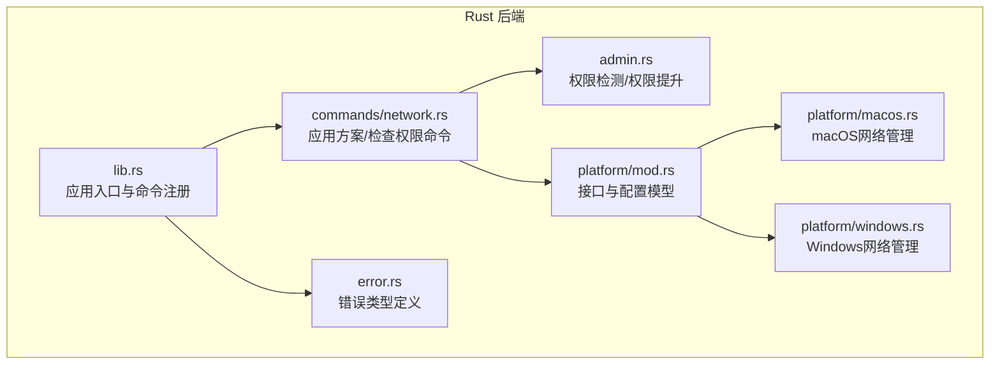
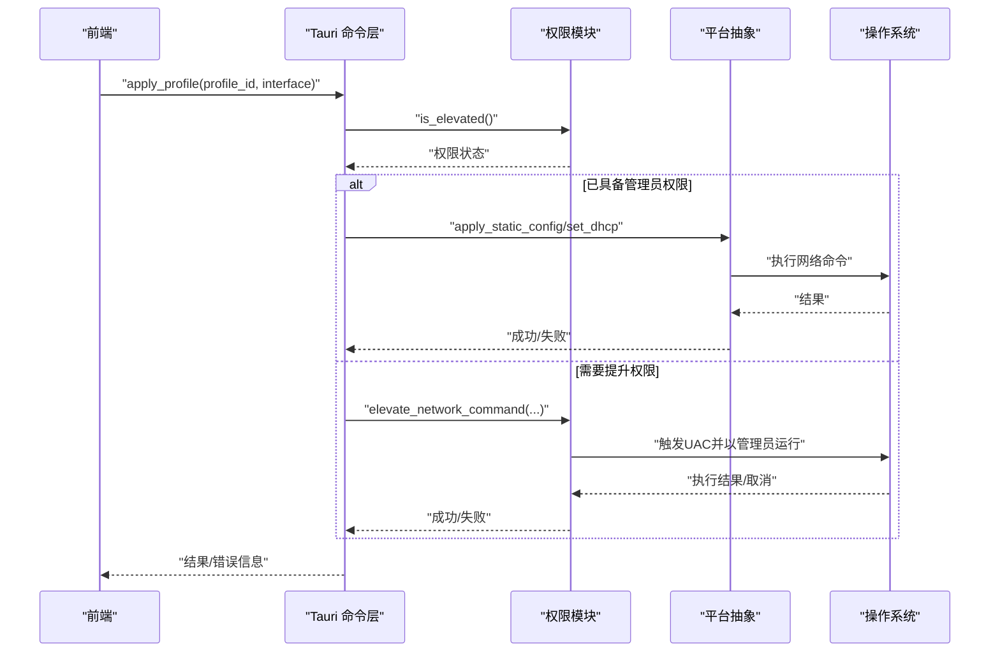
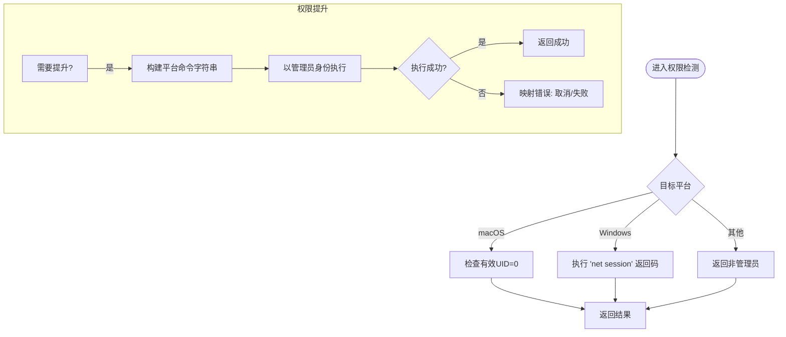
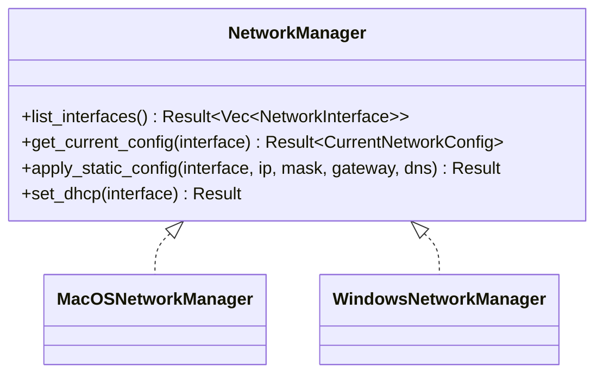
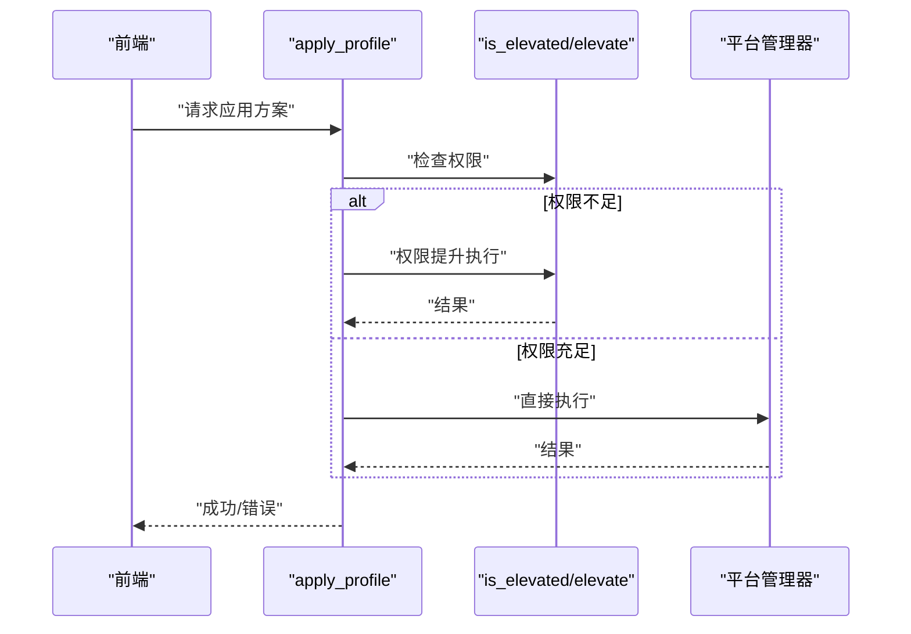
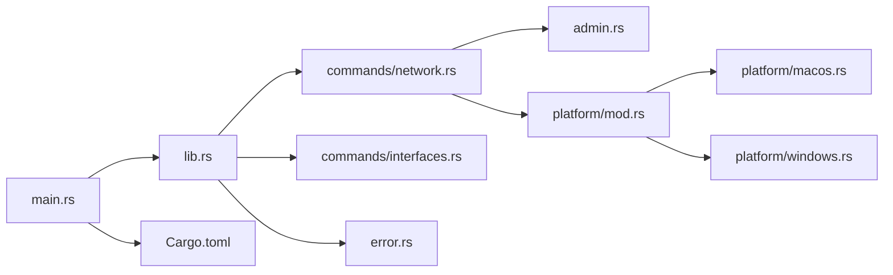

# 管理员权限管理

<cite>
**本文引用的文件**
- [src-tauri/src/admin.rs](file://src-tauri/src/admin.rs)
- [src-tauri/src/platform/mod.rs](file://src-tauri/src/platform/mod.rs)
- [src-tauri/src/platform/windows.rs](file://src-tauri/src/platform/windows.rs)
- [src-tauri/src/platform/macos.rs](file://src-tauri/src/platform/macos.rs)
- [src-tauri/src/commands/network.rs](file://src-tauri/src/commands/network.rs)
- [src-tauri/src/commands/interfaces.rs](file://src-tauri/src/commands/interfaces.rs)
- [src-tauri/src/error.rs](file://src-tauri/src/error.rs)
- [src-tauri/src/lib.rs](file://src-tauri/src/lib.rs)
- [src-tauri/src/main.rs](file://src-tauri/src/main.rs)
- [src-tauri/Cargo.toml](file://src-tauri/Cargo.toml)
</cite>

## 目录
1. [简介](#简介)
2. [项目结构](#项目结构)
3. [核心组件](#核心组件)
4. [架构总览](#架构总览)
5. [详细组件分析](#详细组件分析)
6. [依赖关系分析](#依赖关系分析)
7. [性能考量](#性能考量)
8. [故障排除指南](#故障排除指南)
9. [结论](#结论)
10. [附录](#附录)

## 简介
本文件聚焦于IPSwitcher的管理员权限管理，系统性阐述权限检测机制、权限提升流程与跨平台实现细节。内容覆盖：
- 权限检测：在macOS与Windows上的实现差异与行为边界
- 权限提升：通过UAC对话框与脚本执行完成敏感网络配置
- 权限状态跟踪：通过命令暴露的检查接口进行状态查询
- 实时监控与恢复：结合应用事件与命令调用的权限状态反馈
- 安全策略与审计：错误分类、权限拒绝与日志记录建议
- 用户体验与最佳实践：提示策略、失败回退与交互优化
- 错误处理与排障：常见问题定位与修复路径
- 测试策略：单元与端到端验证方法

## 项目结构
后端采用Tauri 2 Rust实现，权限相关逻辑集中在以下模块：
- 平台抽象层：统一网络管理接口与当前配置模型
- 平台实现：macOS与Windows的具体命令封装
- 权限模块：权限检测与权限提升的跨平台实现
- 命令层：对外暴露的Tauri命令（如应用方案、检查权限）
- 错误模型：统一的错误类型与序列化

图表来源
- [src-tauri/src/lib.rs:14-50](file://src-tauri/src/lib.rs#L14-L50)
- [src-tauri/src/commands/network.rs:9-101](file://src-tauri/src/commands/network.rs#L9-L101)
- [src-tauri/src/admin.rs:1-165](file://src-tauri/src/admin.rs#L1-L165)
- [src-tauri/src/platform/mod.rs:1-64](file://src-tauri/src/platform/mod.rs#L1-L64)
- [src-tauri/src/platform/macos.rs:1-175](file://src-tauri/src/platform/macos.rs#L1-L175)
- [src-tauri/src/platform/windows.rs:1-173](file://src-tauri/src/platform/windows.rs#L1-L173)
- [src-tauri/src/error.rs:1-38](file://src-tauri/src/error.rs#L1-L38)

章节来源
- [src-tauri/src/lib.rs:14-50](file://src-tauri/src/lib.rs#L14-L50)
- [src-tauri/src/commands/network.rs:9-101](file://src-tauri/src/commands/network.rs#L9-L101)
- [src-tauri/src/admin.rs:1-165](file://src-tauri/src/admin.rs#L1-L165)
- [src-tauri/src/platform/mod.rs:1-64](file://src-tauri/src/platform/mod.rs#L1-L64)
- [src-tauri/src/platform/macos.rs:1-175](file://src-tauri/src/platform/macos.rs#L1-L175)
- [src-tauri/src/platform/windows.rs:1-173](file://src-tauri/src/platform/windows.rs#L1-L173)
- [src-tauri/src/error.rs:1-38](file://src-tauri/src/error.rs#L1-L38)

## 核心组件
- 权限检测与提升
  - 检测：基于平台原生能力判断当前进程是否具备管理员权限
  - 提升：在需要时触发UAC并以管理员身份执行网络配置命令
- 平台抽象与实现
  - 抽象：统一的NetworkManager接口与CurrentNetworkConfig模型
  - 实现：macOS使用networksetup；Windows使用netsh/powershell
- 命令层
  - 应用方案：根据方案模式选择直接执行或权限提升执行
  - 检查权限：返回当前权限状态，供前端展示与交互控制
- 错误模型
  - 统一的AppError枚举，区分网络错误与权限不足等场景

章节来源
- [src-tauri/src/admin.rs:3-24](file://src-tauri/src/admin.rs#L3-L24)
- [src-tauri/src/admin.rs:26-49](file://src-tauri/src/admin.rs#L26-L49)
- [src-tauri/src/platform/mod.rs:12-42](file://src-tauri/src/platform/mod.rs#L12-L42)
- [src-tauri/src/platform/macos.rs:8-175](file://src-tauri/src/platform/macos.rs#L8-L175)
- [src-tauri/src/platform/windows.rs:8-173](file://src-tauri/src/platform/windows.rs#L8-L173)
- [src-tauri/src/commands/network.rs:28-100](file://src-tauri/src/commands/network.rs#L28-L100)
- [src-tauri/src/error.rs:3-28](file://src-tauri/src/error.rs#L3-L28)

## 架构总览
下图展示了从命令调用到平台执行的完整链路，以及权限检测与提升的关键节点。

图表来源
- [src-tauri/src/commands/network.rs:28-95](file://src-tauri/src/commands/network.rs#L28-L95)
- [src-tauri/src/admin.rs:26-49](file://src-tauri/src/admin.rs#L26-L49)
- [src-tauri/src/platform/mod.rs:12-32](file://src-tauri/src/platform/mod.rs#L12-L32)

章节来源
- [src-tauri/src/commands/network.rs:28-95](file://src-tauri/src/commands/network.rs#L28-L95)
- [src-tauri/src/admin.rs:26-49](file://src-tauri/src/admin.rs#L26-L49)
- [src-tauri/src/platform/mod.rs:12-32](file://src-tauri/src/platform/mod.rs#L12-L32)

## 详细组件分析

### 权限检测与提升（admin.rs）
- 检测逻辑
  - macOS：通过系统调用判断有效用户ID是否为root
  - Windows：通过执行“net session”并忽略输出判断返回码
  - 其他平台：返回非管理员状态
- 提升逻辑
  - macOS：通过AppleScript执行带管理员权限的shell命令
  - Windows：通过PowerShell启动带RunAs的命令行，隐藏窗口等待完成
  - 失败分支：区分用户取消与执行失败，并映射到统一错误类型

图表来源
- [src-tauri/src/admin.rs:3-24](file://src-tauri/src/admin.rs#L3-L24)
- [src-tauri/src/admin.rs:26-49](file://src-tauri/src/admin.rs#L26-L49)
- [src-tauri/src/admin.rs:76-99](file://src-tauri/src/admin.rs#L76-L99)
- [src-tauri/src/admin.rs:141-164](file://src-tauri/src/admin.rs#L141-L164)

章节来源
- [src-tauri/src/admin.rs:3-24](file://src-tauri/src/admin.rs#L3-L24)
- [src-tauri/src/admin.rs:26-49](file://src-tauri/src/admin.rs#L26-L49)
- [src-tauri/src/admin.rs:76-99](file://src-tauri/src/admin.rs#L76-L99)
- [src-tauri/src/admin.rs:141-164](file://src-tauri/src/admin.rs#L141-L164)

### 平台抽象与实现（platform/mod.rs、macos.rs、windows.rs）
- 抽象接口
  - 列出网络接口、获取当前配置、应用静态配置、切换DHCP
- macOS实现
  - 使用networksetup命令进行配置；错误时返回网络类错误
- Windows实现
  - 使用netsh设置IP/DNS；必要时通过powershell+RunAs执行
  - 对DNS附加失败采取告警但不中断整体流程

图表来源
- [src-tauri/src/platform/mod.rs:12-32](file://src-tauri/src/platform/mod.rs#L12-L32)
- [src-tauri/src/platform/macos.rs:8-175](file://src-tauri/src/platform/macos.rs#L8-L175)
- [src-tauri/src/platform/windows.rs:8-173](file://src-tauri/src/platform/windows.rs#L8-L173)

章节来源
- [src-tauri/src/platform/mod.rs:12-32](file://src-tauri/src/platform/mod.rs#L12-L32)
- [src-tauri/src/platform/macos.rs:8-175](file://src-tauri/src/platform/macos.rs#L8-L175)
- [src-tauri/src/platform/windows.rs:8-173](file://src-tauri/src/platform/windows.rs#L8-L173)

### 命令层（commands/network.rs、commands/interfaces.rs）
- 应用方案命令
  - 解析方案参数，按模式选择直接执行或权限提升执行
  - 在手动模式下强制要求管理员权限，否则通过权限提升执行
- 检查权限命令
  - 直接返回当前权限状态，用于前端UI控制与提示

图表来源
- [src-tauri/src/commands/network.rs:28-95](file://src-tauri/src/commands/network.rs#L28-L95)
- [src-tauri/src/admin.rs:3-24](file://src-tauri/src/admin.rs#L3-L24)
- [src-tauri/src/admin.rs:26-49](file://src-tauri/src/admin.rs#L26-L49)

章节来源
- [src-tauri/src/commands/network.rs:28-95](file://src-tauri/src/commands/network.rs#L28-L95)
- [src-tauri/src/commands/interfaces.rs:4-7](file://src-tauri/src/commands/interfaces.rs#L4-L7)

### 错误模型与日志（error.rs）
- 错误类型
  - 网络错误、权限不足、验证错误等
  - 统一序列化为字符串，便于跨语言通信
- 日志
  - 后端初始化了日志工具，可在调试阶段输出详细信息

章节来源
- [src-tauri/src/error.rs:3-28](file://src-tauri/src/error.rs#L3-L28)
- [src-tauri/src/lib.rs:14-16](file://src-tauri/src/lib.rs#L14-L16)

## 依赖关系分析
- 平台依赖
  - macOS：依赖libc用于权限检测
  - Windows：无额外平台依赖，通过系统命令完成
- 运行时依赖
  - Tauri插件：shell与opener
  - 日志：env_logger

图表来源
- [src-tauri/src/main.rs:4-6](file://src-tauri/src/main.rs#L4-L6)
- [src-tauri/src/lib.rs:14-50](file://src-tauri/src/lib.rs#L14-L50)
- [src-tauri/src/commands/network.rs:9-101](file://src-tauri/src/commands/network.rs#L9-L101)
- [src-tauri/src/commands/interfaces.rs:4-7](file://src-tauri/src/commands/interfaces.rs#L4-L7)
- [src-tauri/src/admin.rs:1-165](file://src-tauri/src/admin.rs#L1-L165)
- [src-tauri/src/platform/mod.rs:1-64](file://src-tauri/src/platform/mod.rs#L1-L64)
- [src-tauri/src/platform/macos.rs:1-175](file://src-tauri/src/platform/macos.rs#L1-L175)
- [src-tauri/src/platform/windows.rs:1-173](file://src-tauri/src/platform/windows.rs#L1-L173)
- [src-tauri/src/error.rs:1-38](file://src-tauri/src/error.rs#L1-L38)
- [src-tauri/Cargo.toml:12-31](file://src-tauri/Cargo.toml#L12-L31)

章节来源
- [src-tauri/src/main.rs:4-6](file://src-tauri/src/main.rs#L4-L6)
- [src-tauri/src/lib.rs:14-50](file://src-tauri/src/lib.rs#L14-L50)
- [src-tauri/Cargo.toml:12-31](file://src-tauri/Cargo.toml#L12-L31)

## 性能考量
- 权限检测开销极低：仅一次系统调用或命令返回码判断
- 提升执行成本：UAC弹窗与后台命令执行，用户感知延迟主要来自UAC等待
- 建议
  - 将权限检查前置到UI交互，避免不必要的权限提升
  - 对Windows的DNS附加操作采用幂等与容错策略，减少重试与失败影响

## 故障排除指南
- 常见问题
  - Windows权限不足：命令返回网络错误，需确认以管理员身份运行或触发UAC
  - macOS权限不足：networksetup命令失败，需确认具备管理员权限
  - UAC被拒绝：macOS返回用户取消，Windows返回执行失败，需引导用户授权
- 排障步骤
  - 调用“检查权限”命令确认当前状态
  - 查看后端日志（已初始化日志工具）定位具体失败点
  - 在Windows上确认PowerShell与RunAs可用；在macOS上确认AppleScript可执行
- 相关实现参考
  - 权限检测与提升：[src-tauri/src/admin.rs:3-24](file://src-tauri/src/admin.rs#L3-L24)、[src-tauri/src/admin.rs:26-49](file://src-tauri/src/admin.rs#L26-L49)
  - 平台命令执行与错误映射：[src-tauri/src/platform/macos.rs:10-175](file://src-tauri/src/platform/macos.rs#L10-L175)、[src-tauri/src/platform/windows.rs:8-173](file://src-tauri/src/platform/windows.rs#L8-L173)
  - 权限状态查询命令：[src-tauri/src/commands/network.rs:97-100](file://src-tauri/src/commands/network.rs#L97-L100)

章节来源
- [src-tauri/src/admin.rs:3-24](file://src-tauri/src/admin.rs#L3-L24)
- [src-tauri/src/admin.rs:26-49](file://src-tauri/src/admin.rs#L26-L49)
- [src-tauri/src/platform/macos.rs:10-175](file://src-tauri/src/platform/macos.rs#L10-L175)
- [src-tauri/src/platform/windows.rs:8-173](file://src-tauri/src/platform/windows.rs#L8-L173)
- [src-tauri/src/commands/network.rs:97-100](file://src-tauri/src/commands/network.rs#L97-L100)

## 结论
IPSwitcher的权限管理采用“检测—提升—执行”的清晰分层，结合平台原生命令与UAC机制，在macOS与Windows上分别实现了稳定的管理员权限控制。通过命令层的状态查询与错误模型的统一化，前端可获得一致的权限反馈与提示。建议在实际部署中配合日志与审计策略，确保权限变更可追踪、可恢复。

## 附录

### 权限状态跟踪与实时监控
- 前端可通过“检查权限”命令轮询或在关键交互前主动查询
- 命令定义位置：[src-tauri/src/commands/network.rs:97-100](file://src-tauri/src/commands/network.rs#L97-L100)
- 应用入口注册位置：[src-tauri/src/lib.rs:37-47](file://src-tauri/src/lib.rs#L37-L47)

章节来源
- [src-tauri/src/commands/network.rs:97-100](file://src-tauri/src/commands/network.rs#L97-L100)
- [src-tauri/src/lib.rs:37-47](file://src-tauri/src/lib.rs#L37-L47)

### 权限丢失处理与恢复策略
- 丢失处理：当命令返回网络错误或权限不足时，引导用户点击“以管理员身份运行”或重新触发UAC
- 恢复策略：在UI中提供一键重试与权限状态提示；对Windows的DNS附加失败采用降级处理（保留主DNS设置）

章节来源
- [src-tauri/src/platform/windows.rs:126-141](file://src-tauri/src/platform/windows.rs#L126-L141)
- [src-tauri/src/error.rs:23-27](file://src-tauri/src/error.rs#L23-L27)

### 安全策略与审计日志
- 安全策略
  - 仅在必要时触发权限提升；对敏感命令进行参数校验
  - 对Windows的DNS附加失败进行告警但不阻断主流程
- 审计日志
  - 建议在权限提升前后记录时间戳、命令摘要与结果，便于审计与回溯

章节来源
- [src-tauri/src/platform/windows.rs:126-141](file://src-tauri/src/platform/windows.rs#L126-L141)
- [src-tauri/src/admin.rs:141-164](file://src-tauri/src/admin.rs#L141-L164)

### 用户体验优化
- 提示策略：在应用方案前检测权限，若不足则提示并允许用户授权
- 失败回退：对DNS附加失败给出明确提示，保证主DNS设置成功
- 交互优化：在macOS上通过激活策略提升窗口可见性

章节来源
- [src-tauri/src/platform/windows.rs:126-141](file://src-tauri/src/platform/windows.rs#L126-L141)
- [src-tauri/src/lib.rs:23-29](file://src-tauri/src/lib.rs#L23-L29)

### 权限相关的错误处理与故障排除
- 错误类型与映射：网络错误、权限不足、验证错误等
- 故障排除：检查权限命令、查看日志、确认平台命令可用性

章节来源
- [src-tauri/src/error.rs:3-28](file://src-tauri/src/error.rs#L3-L28)
- [src-tauri/src/commands/network.rs:97-100](file://src-tauri/src/commands/network.rs#L97-L100)

### 测试策略与验证方法
- 单元测试
  - 权限检测：模拟不同平台返回值，验证is_elevated行为
  - 命令构建：验证macOS/Windows命令字符串拼接正确性
- 端到端测试
  - 权限状态查询：调用“检查权限”命令，验证返回布尔值
  - 应用方案：在管理员与非管理员两种状态下分别验证流程与错误提示
- 回归测试
  - DNS附加失败：验证主DNS设置成功且附加失败被降级处理

章节来源
- [src-tauri/src/admin.rs:26-49](file://src-tauri/src/admin.rs#L26-L49)
- [src-tauri/src/platform/windows.rs:126-141](file://src-tauri/src/platform/windows.rs#L126-L141)
- [src-tauri/src/commands/network.rs:97-100](file://src-tauri/src/commands/network.rs#L97-L100)