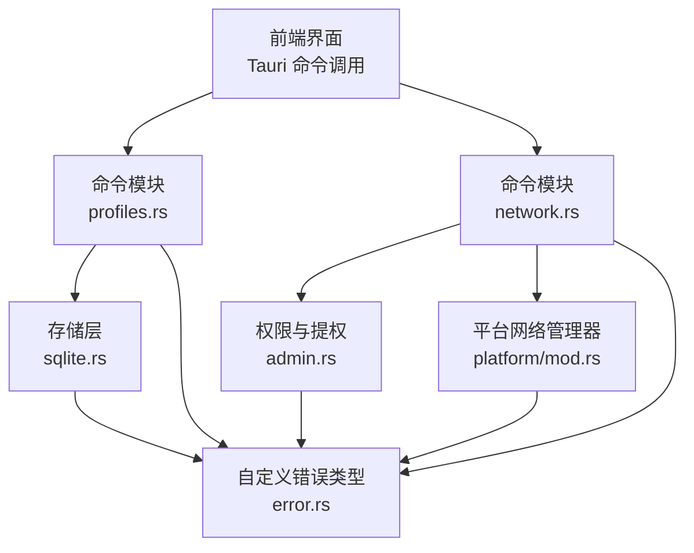
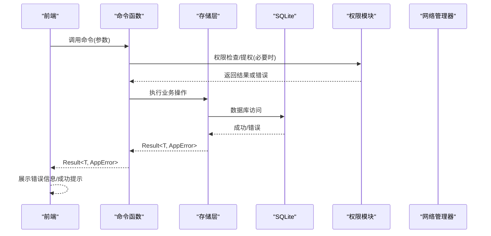
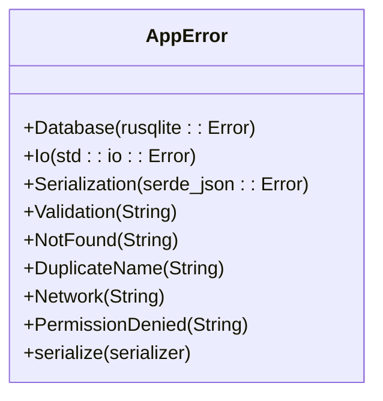
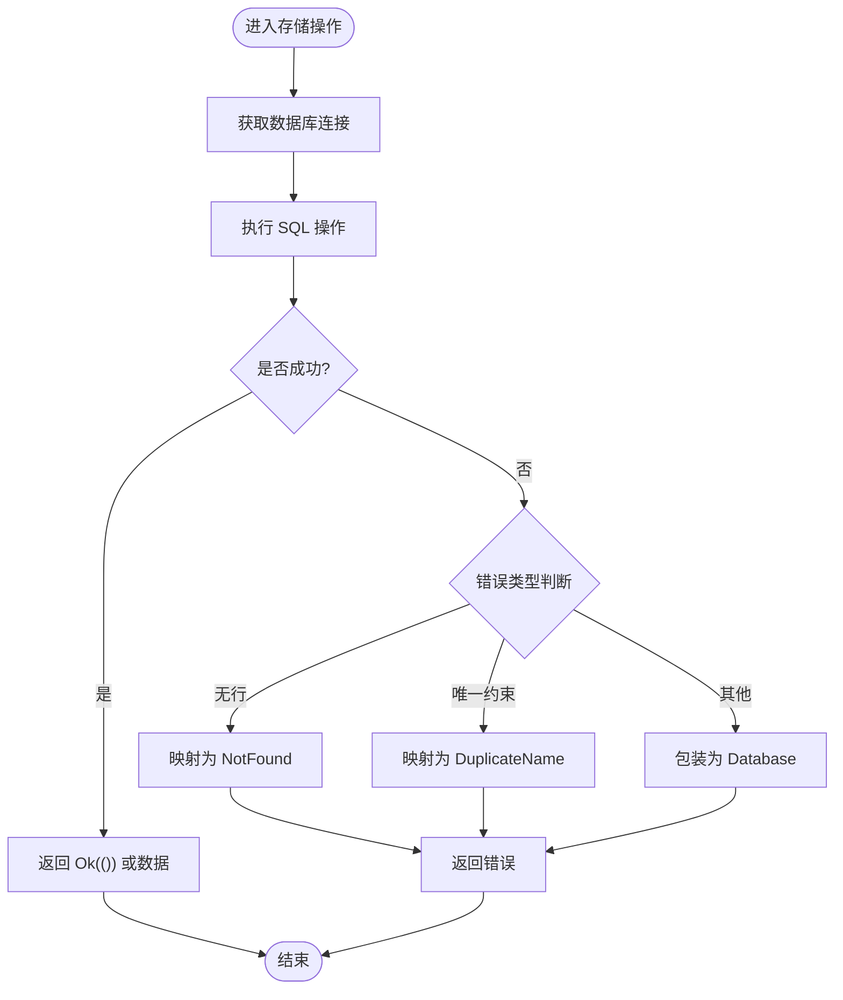
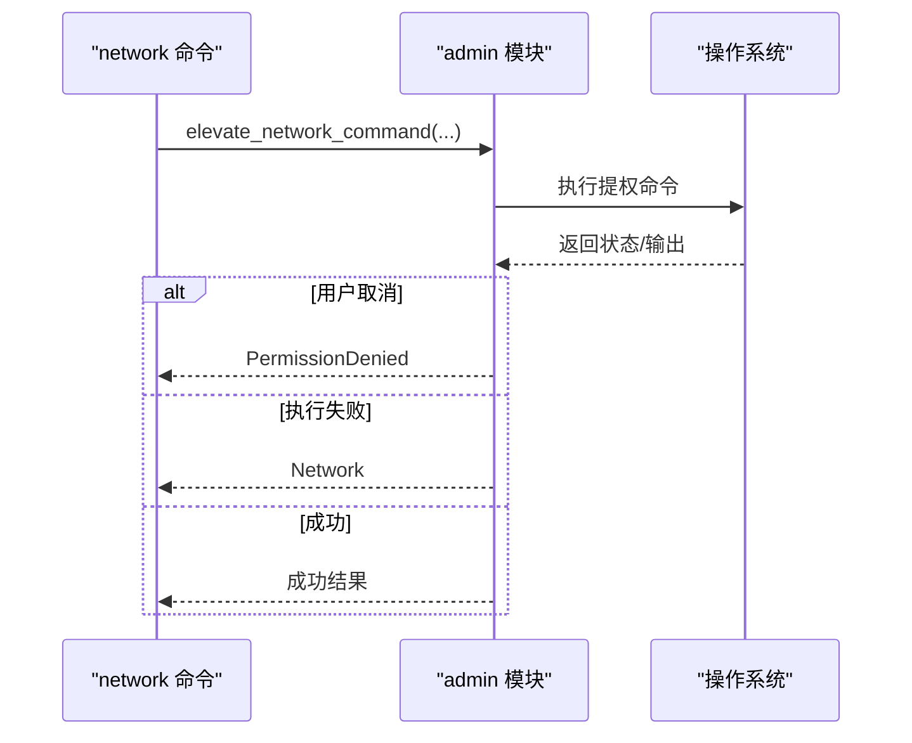
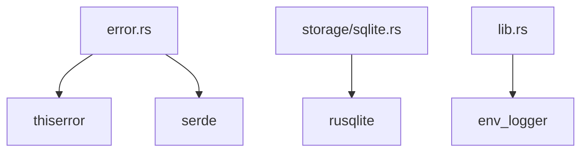

# 错误处理

<cite>
**本文引用的文件**
- [src-tauri/src/error.rs](file://src-tauri/src/error.rs)
- [src-tauri/src/lib.rs](file://src-tauri/src/lib.rs)
- [src-tauri/src/main.rs](file://src-tauri/src/main.rs)
- [src-tauri/src/commands/profiles.rs](file://src-tauri/src/commands/profiles.rs)
- [src-tauri/src/commands/network.rs](file://src-tauri/src/commands/network.rs)
- [src-tauri/src/storage/sqlite.rs](file://src-tauri/src/storage/sqlite.rs)
- [src-tauri/src/admin.rs](file://src-tauri/src/admin.rs)
- [src-tauri/src/platform/mod.rs](file://src-tauri/src/platform/mod.rs)
- [src-tauri/src/models/profile.rs](file://src-tauri/src/models/profile.rs)
- [src-tauri/Cargo.lock](file://src-tauri/Cargo.lock)
</cite>

## 更新摘要
**变更内容**
- 新增PermissionDenied错误类型，专门处理权限不足场景
- 改进权限检查与提权执行的错误分类机制
- 增强用户友好的错误消息，提供更清晰的错误提示
- 完善错误处理的平台特定实现（macOS和Windows）
- 优化错误映射策略，区分用户取消与执行失败

## 目录
1. [简介](#简介)
2. [项目结构](#项目结构)
3. [核心组件](#核心组件)
4. [架构总览](#架构总览)
5. [详细组件分析](#详细组件分析)
6. [依赖关系分析](#依赖关系分析)
7. [性能考量](#性能考量)
8. [故障排查指南](#故障排查指南)
9. [结论](#结论)
10. [附录](#附录)

## 简介
本文件聚焦于 IPSwitcher 的错误处理机制，系统性梳理自定义错误类型、错误传播策略、错误分类与错误码设计、错误信息本地化（中文）、Result 使用模式、错误包装与上下文传递、错误日志记录与调试信息收集、用户友好提示、错误恢复与降级处理、优雅关闭、错误监控与告警建议，以及测试中错误模拟与异常验证方法。文档以代码为依据，结合可视化图示帮助读者快速理解并落地实践。

**更新** 新增了专门的PermissionDenied错误类型，用于处理权限不足场景，改进了错误分类体系和用户友好的错误消息。

## 项目结构
后端采用 Rust + Tauri 架构，错误处理集中在 src-tauri 子目录。前端通过 Tauri 命令调用后端能力，错误通过 Result 传播至前端进行展示或进一步处理。



**图表来源**
- [src-tauri/src/lib.rs:19-49](file://src-tauri/src/lib.rs#L19-L49)
- [src-tauri/src/commands/profiles.rs:1-124](file://src-tauri/src/commands/profiles.rs#L1-L124)
- [src-tauri/src/commands/network.rs:1-137](file://src-tauri/src/commands/network.rs#L1-L137)
- [src-tauri/src/storage/sqlite.rs:1-298](file://src-tauri/src/storage/sqlite.rs#L1-L298)
- [src-tauri/src/admin.rs:1-174](file://src-tauri/src/admin.rs#L1-L174)
- [src-tauri/src/platform/mod.rs:1-64](file://src-tauri/src/platform/mod.rs#L1-L64)
- [src-tauri/src/error.rs:1-38](file://src-tauri/src/error.rs#L1-L38)

**章节来源**
- [src-tauri/src/lib.rs:14-50](file://src-tauri/src/lib.rs#L14-L50)
- [src-tauri/src/main.rs:4-7](file://src-tauri/src/main.rs#L4-L7)

## 核心组件
- 自定义错误类型：统一的 AppError 枚举，覆盖数据库、IO、序列化、验证、资源不存在、重复名、网络操作、权限不足等场景，并实现可序列化以便跨进程传递。
- 命令层：所有 Tauri 命令返回 Result<T, AppError>，在业务逻辑处进行错误包装与传播。
- 存储层：SQLite 访问封装在 ProfileRepository 中，对底层 rusqlite 错误进行分类与包装。
- 平台与权限：平台网络管理器抽象出不同 OS 的网络操作；权限检查与提权命令封装在 admin 模块。
- 日志：初始化 env_logger，便于在开发与生产环境输出错误与调试信息。

**更新** 新增了PermissionDenied错误类型，专门处理权限不足场景，包括用户取消和权限不足两种子情况。

**章节来源**
- [src-tauri/src/error.rs:3-28](file://src-tauri/src/error.rs#L3-L28)
- [src-tauri/src/commands/profiles.rs:9-124](file://src-tauri/src/commands/profiles.rs#L9-L124)
- [src-tauri/src/commands/network.rs:9-137](file://src-tauri/src/commands/network.rs#L9-L137)
- [src-tauri/src/storage/sqlite.rs:12-298](file://src-tauri/src/storage/sqlite.rs#L12-L298)
- [src-tauri/src/admin.rs:3-49](file://src-tauri/src/admin.rs#L3-L49)
- [src-tauri/src/platform/mod.rs:12-32](file://src-tauri/src/platform/mod.rs#L12-L32)
- [src-tauri/src/lib.rs:14-16](file://src-tauri/src/lib.rs#L14-L16)

## 架构总览
错误处理贯穿命令层、存储层、平台层与权限层，形成"底层错误 → 分类包装 → 结果传播"的闭环。



**图表来源**
- [src-tauri/src/commands/network.rs:28-95](file://src-tauri/src/commands/network.rs#L28-L95)
- [src-tauri/src/storage/sqlite.rs:146-232](file://src-tauri/src/storage/sqlite.rs#L146-L232)
- [src-tauri/src/admin.rs:26-49](file://src-tauri/src/admin.rs#L26-L49)
- [src-tauri/src/platform/mod.rs:12-32](file://src-tauri/src/platform/mod.rs#L12-L32)

## 详细组件分析

### 自定义错误类型与分类体系
- 错误枚举覆盖范围：数据库、IO、序列化、验证、资源不存在、重复名、网络操作、权限不足。
- 错误包装策略：使用 #[from] 将底层错误透明转换为 AppError 的对应变体；对特定 SQL 错误进行语义化映射（如唯一约束冲突映射为重复名）。
- 序列化：实现 serde::Serialize，使错误可被序列化为字符串，便于跨进程传递与前端展示。
- 信息本地化：错误消息采用中文，便于用户理解。

**更新** 新增PermissionDenied错误类型，专门处理权限不足场景，提供用户友好的错误消息。



**图表来源**
- [src-tauri/src/error.rs:3-37](file://src-tauri/src/error.rs#L3-L37)

**章节来源**
- [src-tauri/src/error.rs:3-37](file://src-tauri/src/error.rs#L3-L37)

### 命令层错误传播与上下文传递
- profiles 命令：对输入参数进行业务校验，调用仓库层执行 CRUD，返回 Result<T, AppError>。
- network 命令：根据方案模式选择静态 IP 或 DHCP，必要时触发提权流程，返回用户可读的成功提示与错误信息。
- 上下文传递：命令函数通过参数与状态对象携带上下文（如仓库实例），并在错误发生时保留关键上下文信息（如资源 ID、接口名）。

```mermaid
sequenceDiagram
participant FE as "前端"
participant LIST as "list_profiles"
participant GET as "get_profile"
participant CREATE as "create_profile"
participant UPDATE as "update_profile"
participant DELETE as "delete_profile"
participant REPO as "ProfileRepository"
FE->>LIST : 列表查询
LIST->>REPO : list_all()
REPO-->>LIST : Vec<Profile>/AppError
LIST-->>FE : Result<Vec<Profile>, AppError>
FE->>GET : 获取单条
GET->>REPO : get_by_id(id)
REPO-->>GET : Profile/AppError
GET-->>FE : Result<Profile, AppError>
FE->>CREATE : 创建
CREATE->>REPO : insert(profile)
REPO-->>CREATE : Ok()/AppError
CREATE-->>FE : Result<Profile, AppError>
FE->>UPDATE : 更新
UPDATE->>REPO : update(profile)
REPO-->>UPDATE : Ok()/AppError
UPDATE-->>FE : Result<Profile, AppError>
FE->>DELETE : 删除
DELETE->>REPO : delete(id)
REPO-->>DELETE : Ok()/AppError
DELETE-->>FE : Result<(), AppError>
```

**图表来源**
- [src-tauri/src/commands/profiles.rs:9-124](file://src-tauri/src/commands/profiles.rs#L9-L124)
- [src-tauri/src/storage/sqlite.rs:76-232](file://src-tauri/src/storage/sqlite.rs#L76-L232)

**章节来源**
- [src-tauri/src/commands/profiles.rs:9-124](file://src-tauri/src/commands/profiles.rs#L9-L124)

### 存储层错误包装与语义化映射
- 初始化与迁移：数据库路径解析、目录创建、表迁移，均在错误路径上包装为 AppError::Database。
- 查询与更新：对锁竞争、SQL 错误进行分类；唯一约束冲突映射为 AppError::DuplicateName；未找到映射为 AppError::NotFound。
- 序列化：将 DNS 列表序列化为 JSON 字符串，反序列化失败回退为空列表，避免中断流程。



**图表来源**
- [src-tauri/src/storage/sqlite.rs:146-232](file://src-tauri/src/storage/sqlite.rs#L146-L232)

**章节来源**
- [src-tauri/src/storage/sqlite.rs:12-298](file://src-tauri/src/storage/sqlite.rs#L12-L298)

### 平台与权限层错误处理
- 权限检查：is_elevated 在不同平台使用系统调用检测是否具备管理员权限。
- 提权执行：构建平台命令并通过脚本或 PowerShell 执行，捕获标准输出与错误输出，区分用户取消与执行失败，分别映射为 PermissionDenied 与 Network。
- 网络管理器：抽象出统一接口，不同平台实现具体逻辑，错误通过 AppError 传播。

**更新** 改进了权限检查与提权执行的错误分类，新增了PermissionDenied错误类型来处理权限不足场景。



**图表来源**
- [src-tauri/src/commands/network.rs:28-95](file://src-tauri/src/commands/network.rs#L28-L95)
- [src-tauri/src/admin.rs:26-174](file://src-tauri/src/admin.rs#L26-L174)

**章节来源**
- [src-tauri/src/admin.rs:3-174](file://src-tauri/src/admin.rs#L3-L174)
- [src-tauri/src/platform/mod.rs:12-32](file://src-tauri/src/platform/mod.rs#L12-L32)

### 错误信息本地化与用户提示
- 错误消息采用中文，便于用户理解。
- 成功路径返回用户可读提示（如"已切换到方案 ..."），失败路径返回 AppError 的字符串表示，前端可直接展示或二次本地化。

**更新** 错误消息更加用户友好，特别是权限相关的错误消息提供了清晰的用户指导。

**章节来源**
- [src-tauri/src/error.rs:4-27](file://src-tauri/src/error.rs#L4-L27)
- [src-tauri/src/commands/network.rs:71-92](file://src-tauri/src/commands/network.rs#L71-L92)

### Result 类型使用模式与错误包装
- 统一返回 Result<T, AppError>，在命令层进行 map_err 包装，确保错误语义清晰且可序列化。
- 对底层错误使用 #[from] 自动转换，减少样板代码。

**章节来源**
- [src-tauri/src/commands/profiles.rs:54-57](file://src-tauri/src/commands/profiles.rs#L54-L57)
- [src-tauri/src/storage/sqlite.rs:173-181](file://src-tauri/src/storage/sqlite.rs#L173-L181)

### 错误日志记录与调试信息收集
- 初始化 env_logger，可在开发与生产环境中输出日志，辅助定位问题。
- 建议在关键路径增加日志记录点（如命令入口、数据库操作前后、提权命令执行前后）。

**章节来源**
- [src-tauri/src/lib.rs:14-16](file://src-tauri/src/lib.rs#L14-L16)

### 错误恢复策略、降级处理与优雅关闭
- 降级处理：当权限不足时，引导用户进行提权或提示权限要求；网络接口不可用时，提供备选接口或明确错误提示。
- 优雅关闭：窗口关闭事件中隐藏窗口并阻止默认关闭，交由应用逻辑处理，避免资源泄漏。

**更新** 增强了权限不足场景的降级处理策略，提供更清晰的用户指导。

**章节来源**
- [src-tauri/src/commands/network.rs:53-61](file://src-tauri/src/commands/network.rs#L53-L61)
- [src-tauri/src/lib.rs:31-36](file://src-tauri/src/lib.rs#L31-L36)

### 错误监控、告警机制与故障诊断工具
- 建议在前端集成错误上报（如发送 AppError 字符串到遥测服务），并记录上下文（如命令名、参数摘要、时间戳）。
- 建立错误分类指标（验证错误、数据库错误、权限错误等），用于监控与告警。
- 故障诊断：结合日志与错误字符串，定位问题发生在命令层、存储层还是平台层。

（本节为通用实践建议，不直接分析具体文件）

## 依赖关系分析
- 关键依赖：thiserror（错误派生宏）、serde（序列化）、rusqlite（SQLite）、env_logger（日志）。
- 版本与兼容性：通过 Cargo.lock 可见各依赖版本，确保错误处理相关功能稳定。



**图表来源**
- [src-tauri/src/error.rs:1-1](file://src-tauri/src/error.rs#L1-L1)
- [src-tauri/src/storage/sqlite.rs:1-1](file://src-tauri/src/storage/sqlite.rs#L1-L1)
- [src-tauri/src/lib.rs:14-16](file://src-tauri/src/lib.rs#L14-L16)
- [src-tauri/Cargo.lock:970-980](file://src-tauri/Cargo.lock#L970-L980)

**章节来源**
- [src-tauri/Cargo.lock:970-980](file://src-tauri/Cargo.lock#L970-L980)

## 性能考量
- 锁竞争：数据库操作使用 Mutex 包裹连接，注意避免长时间持有锁；必要时拆分事务与批量操作。
- 序列化开销：JSON 序列化 DNS 列表在高频场景下可能成为瓶颈，可考虑缓存或延迟序列化。
- 提权命令：跨进程与脚本执行成本较高，应尽量复用与合并命令，减少交互次数。

（本节为通用指导，不直接分析具体文件）

## 故障排查指南
- 数据库初始化失败：检查 HOME/APPDATA 环境变量与路径权限，确认数据库文件可创建。
- 查询不到数据：确认 ID 是否正确，检查 Unique 约束与大小写敏感性。
- 提权失败：确认当前用户具备管理员权限，查看系统弹窗是否被取消；检查命令构建与执行输出。
- 网络接口不可用：确认接口名称正确，尝试指定接口或使用自动选择逻辑。
- 日志定位：启用 env_logger，观察命令执行前后日志，结合错误字符串定位问题。

**更新** 新增了权限不足相关的故障排查指导，包括用户取消和权限不足的具体处理方式。

**章节来源**
- [src-tauri/src/storage/sqlite.rs:29-51](file://src-tauri/src/storage/sqlite.rs#L29-L51)
- [src-tauri/src/admin.rs:77-98](file://src-tauri/src/admin.rs#L77-L98)
- [src-tauri/src/commands/network.rs:13-26](file://src-tauri/src/commands/network.rs#L13-L26)

## 结论
IPSwitcher 的错误处理以统一的 AppError 为核心，结合 thiserror 的自动转换与 serde 的序列化能力，实现了从底层错误到用户可读提示的完整链路。命令层、存储层、平台层与权限层均遵循相同的错误传播模式，配合 env_logger 实现可观测性。**更新** 新增的PermissionDenied错误类型进一步完善了错误分类体系，提供了更精确的错误处理和用户指导。建议在现有基础上完善错误监控与告警、增强日志上下文、优化高成本操作的性能，并在测试中引入错误模拟以验证健壮性。

## 附录
- 错误分类与映射参考
  - 数据库错误：rusqlite::Error → AppError::Database
  - IO 错误：std::io::Error → AppError::Io
  - 序列化错误：serde_json::Error → AppError::Serialization
  - 验证错误：业务校验失败 → AppError::Validation
  - 资源不存在：查询无结果 → AppError::NotFound
  - 重复名：唯一约束冲突 → AppError::DuplicateName
  - 网络操作失败：平台命令执行失败 → AppError::Network
  - 权限不足：用户取消或权限不足 → AppError::PermissionDenied

**更新** 新增了PermissionDenied错误类型的映射规则，专门处理权限相关的错误场景。

**章节来源**
- [src-tauri/src/error.rs:4-27](file://src-tauri/src/error.rs#L4-L27)
- [src-tauri/src/storage/sqlite.rs:173-181](file://src-tauri/src/storage/sqlite.rs#L173-L181)
- [src-tauri/src/admin.rs:92-98](file://src-tauri/src/admin.rs#L92-L98)