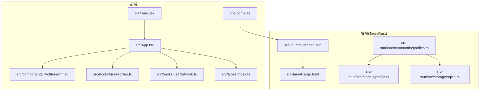
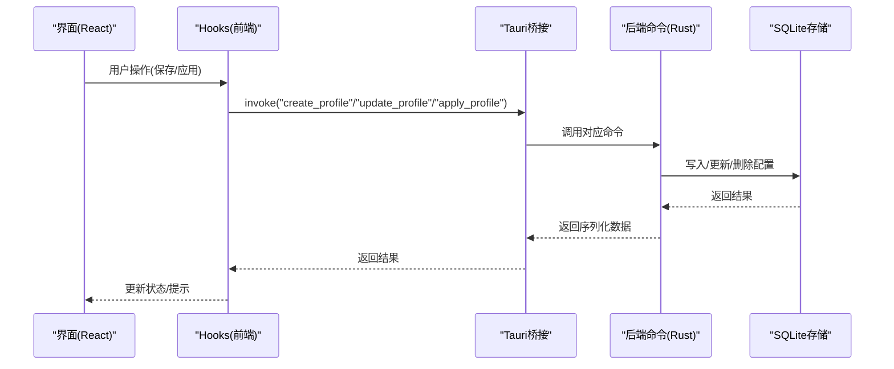
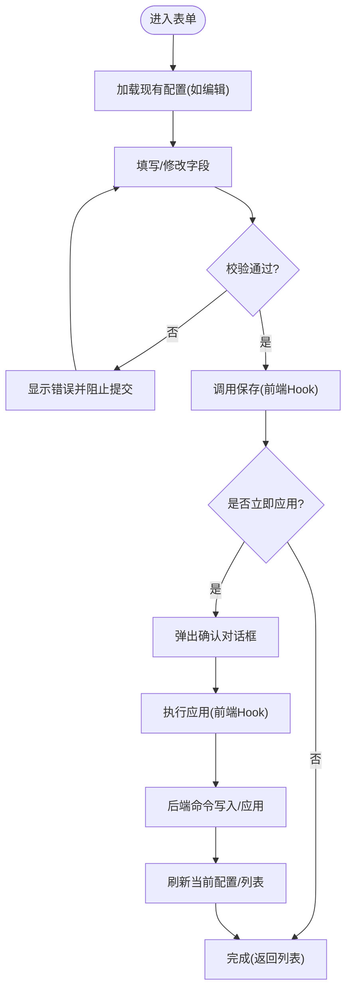
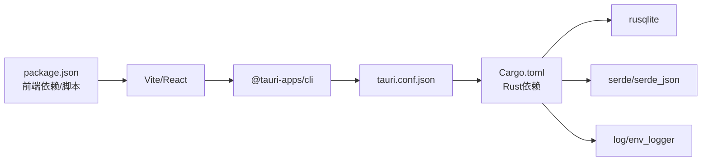

# 快速开始

<cite>
**本文引用的文件**
- [package.json](file://package.json)
- [vite.config.ts](file://vite.config.ts)
- [src-tauri/Cargo.toml](file://src-tauri/Cargo.toml)
- [src-tauri/tauri.conf.json](file://src-tauri/tauri.conf.json)
- [src/main.tsx](file://src/main.tsx)
- [src/App.tsx](file://src/App.tsx)
- [src/components/ProfileForm.tsx](file://src/components/ProfileForm.tsx)
- [src/hooks/useProfiles.ts](file://src/hooks/useProfiles.ts)
- [src/hooks/useNetwork.ts](file://src/hooks/useNetwork.ts)
- [src/types/index.ts](file://src/types/index.ts)
- [src-tauri/src/commands/profiles.rs](file://src-tauri/src/commands/profiles.rs)
- [src-tauri/src/models/profile.rs](file://src-tauri/src/models/profile.rs)
- [src-tauri/src/storage/sqlite.rs](file://src-tauri/src/storage/sqlite.rs)
</cite>

## 目录
1. [简介](#简介)
2. [项目结构](#项目结构)
3. [核心组件](#核心组件)
4. [架构总览](#架构总览)
5. [详细组件分析](#详细组件分析)
6. [依赖关系分析](#依赖关系分析)
7. [性能考虑](#性能考虑)
8. [故障排除指南](#故障排除指南)
9. [结论](#结论)
10. [附录：从零到首跑的完整步骤](#附录从零到首跑的完整步骤)

## 简介
本指南面向新手用户，帮助你在30分钟内完成 IPSwitcher 的环境准备、安装与首次运行。你将学会：
- 搭建开发环境（Node.js、Rust、Tauri CLI）
- 克隆仓库、安装依赖、启动开发服务器
- 构建并运行桌面应用
- 创建你的第一个网络配置方案
- 常见问题排查与最佳实践

## 项目结构
该项目采用前端（React + Vite）+ 后端（Tauri + Rust）的混合架构。前端负责界面与交互，后端负责系统级网络配置读取与应用。

图表来源
- [src/main.tsx:1-11](file://src/main.tsx#L1-L11)
- [src/App.tsx:1-195](file://src/App.tsx#L1-L195)
- [src/components/ProfileForm.tsx:1-357](file://src/components/ProfileForm.tsx#L1-L357)
- [src/hooks/useProfiles.ts:1-117](file://src/hooks/useProfiles.ts#L1-L117)
- [src/hooks/useNetwork.ts:1-99](file://src/hooks/useNetwork.ts#L1-L99)
- [src/types/index.ts:1-30](file://src/types/index.ts#L1-L30)
- [vite.config.ts:1-25](file://vite.config.ts#L1-L25)
- [src-tauri/tauri.conf.json:1-48](file://src-tauri/tauri.conf.json#L1-L48)
- [src-tauri/Cargo.toml:1-30](file://src-tauri/Cargo.toml#L1-L30)
- [src-tauri/src/commands/profiles.rs:1-113](file://src-tauri/src/commands/profiles.rs#L1-L113)
- [src-tauri/src/models/profile.rs:1-88](file://src-tauri/src/models/profile.rs#L1-L88)
- [src-tauri/src/storage/sqlite.rs:1-256](file://src-tauri/src/storage/sqlite.rs#L1-L256)

章节来源
- [package.json:1-27](file://package.json#L1-L27)
- [vite.config.ts:1-25](file://vite.config.ts#L1-L25)
- [src-tauri/tauri.conf.json:1-48](file://src-tauri/tauri.conf.json#L1-L48)
- [src-tauri/Cargo.toml:1-30](file://src-tauri/Cargo.toml#L1-L30)

## 核心组件
- 前端入口与渲染：前端通过入口文件挂载 React 应用，并在应用根组件中协调配置列表、编辑表单与状态栏。
- 配置管理钩子：提供配置的增删改查与应用能力，通过 Tauri 桥接调用后端命令。
- 网络接口与当前配置：提供网络接口枚举、当前配置查询与管理员权限检测。
- 数据模型与校验：定义配置数据结构与字段校验规则，保证输入合法性。
- 存储层：基于 SQLite 的本地存储，跨平台路径适配，支持迁移与约束。

章节来源
- [src/main.tsx:1-11](file://src/main.tsx#L1-L11)
- [src/App.tsx:1-195](file://src/App.tsx#L1-L195)
- [src/hooks/useProfiles.ts:1-117](file://src/hooks/useProfiles.ts#L1-L117)
- [src/hooks/useNetwork.ts:1-99](file://src/hooks/useNetwork.ts#L1-L99)
- [src/types/index.ts:1-30](file://src/types/index.ts#L1-L30)
- [src-tauri/src/models/profile.rs:1-88](file://src-tauri/src/models/profile.rs#L1-L88)
- [src-tauri/src/storage/sqlite.rs:1-256](file://src-tauri/src/storage/sqlite.rs#L1-L256)

## 架构总览
前端通过 Tauri 暴露的命令与后端通信，实现“配置持久化 + 网络应用”的闭环。

图表来源
- [src/hooks/useProfiles.ts:1-117](file://src/hooks/useProfiles.ts#L1-L117)
- [src/hooks/useNetwork.ts:1-99](file://src/hooks/useNetwork.ts#L1-L99)
- [src-tauri/src/commands/profiles.rs:1-113](file://src-tauri/src/commands/profiles.rs#L1-L113)
- [src-tauri/src/storage/sqlite.rs:1-256](file://src-tauri/src/storage/sqlite.rs#L1-L256)

## 详细组件分析

### 组件A：配置表单与校验
- 功能要点
  - 支持手动与 DHCP 两种 IP 模式
  - 表单字段包含：名称、接口、IP、子网掩码、网关、DNS
  - 输入校验：名称唯一性、IPv4 格式、必填项约束
  - 保存后可立即应用，触发确认对话框
- 关键流程
  - 表单提交 → 校验 → 保存到数据库 → 应用网络配置
  - 失败时显示错误信息，成功后刷新列表与当前配置

图表来源
- [src/components/ProfileForm.tsx:1-357](file://src/components/ProfileForm.tsx#L1-L357)
- [src/hooks/useProfiles.ts:1-117](file://src/hooks/useProfiles.ts#L1-L117)
- [src/hooks/useNetwork.ts:1-99](file://src/hooks/useNetwork.ts#L1-L99)
- [src-tauri/src/commands/profiles.rs:1-113](file://src-tauri/src/commands/profiles.rs#L1-L113)

章节来源
- [src/components/ProfileForm.tsx:1-357](file://src/components/ProfileForm.tsx#L1-L357)
- [src/types/index.ts:1-30](file://src/types/index.ts#L1-L30)
- [src-tauri/src/models/profile.rs:1-88](file://src-tauri/src/models/profile.rs#L1-L88)

### 组件B：网络接口与当前配置
- 功能要点
  - 列举可用网络接口并标记活动接口
  - 查询当前网络配置（IP、掩码、网关、DNS、DHCP）
  - 定时刷新当前配置（每30秒）
  - 检测管理员权限
- 错误处理
  - 接口查询失败不中断应用，仅记录日志
  - 应用配置失败时捕获异常并提示

章节来源
- [src/hooks/useNetwork.ts:1-99](file://src/hooks/useNetwork.ts#L1-L99)
- [src/types/index.ts:1-30](file://src/types/index.ts#L1-L30)

### 组件C：配置持久化与存储
- 功能要点
  - 使用 SQLite 存储配置，跨平台路径适配
  - 迁移脚本初始化表结构
  - 提供增删改查与去重约束
- 数据模型
  - 配置包含：名称、IP 模式、IP、掩码、网关、DNS、接口名、时间戳
  - 字段校验在 Rust 层进行，保证数据一致性

章节来源
- [src-tauri/src/storage/sqlite.rs:1-256](file://src-tauri/src/storage/sqlite.rs#L1-L256)
- [src-tauri/src/models/profile.rs:1-88](file://src-tauri/src/models/profile.rs#L1-L88)
- [src-tauri/src/commands/profiles.rs:1-113](file://src-tauri/src/commands/profiles.rs#L1-L113)

## 依赖关系分析
- 前端依赖
  - React 生态与 Vite 开发服务器
  - Tauri API 用于命令调用与系统集成
- 后端依赖
  - Tauri 2 核心、Shell 插件、Openner 插件
  - SQLite（带打包）用于本地存储
  - 序列化、错误处理、正则等标准库
- 构建与打包
  - 前端构建产物输出至 dist，由 Tauri 在打包时注入
  - 开发时通过 Vite HMR 实时热更新

图表来源
- [package.json:1-27](file://package.json#L1-L27)
- [vite.config.ts:1-25](file://vite.config.ts#L1-L25)
- [src-tauri/tauri.conf.json:1-48](file://src-tauri/tauri.conf.json#L1-L48)
- [src-tauri/Cargo.toml:1-30](file://src-tauri/Cargo.toml#L1-L30)

章节来源
- [package.json:1-27](file://package.json#L1-L27)
- [src-tauri/Cargo.toml:1-30](file://src-tauri/Cargo.toml#L1-L30)
- [src-tauri/tauri.conf.json:1-48](file://src-tauri/tauri.conf.json#L1-L48)

## 性能考虑
- 前端
  - 使用 React 严格模式与按需渲染，避免不必要的重渲染
  - 表单校验在客户端即时反馈，减少无效请求
- 后端
  - SQLite 访问加锁保护，避免并发冲突
  - 定时刷新当前配置频率适中（30秒），兼顾实时性与资源占用
- 构建
  - Vite 热更新与忽略后端目录监听，提升开发体验

## 故障排除指南
- 无法启动开发服务器
  - 确认端口未被占用；若使用自定义主机，检查环境变量与 HMR 配置
  - 参考：[vite.config.ts:1-25](file://vite.config.ts#L1-L25)
- Tauri 命令调用报错
  - 检查前端 invoke 调用参数与后端命令签名是否一致
  - 参考：[src/hooks/useProfiles.ts:1-117](file://src/hooks/useProfiles.ts#L1-L117)、[src/hooks/useNetwork.ts:1-99](file://src/hooks/useNetwork.ts#L1-L99)
- 数据库初始化失败
  - 检查应用数据目录权限（跨平台路径不同）
  - 参考：[src-tauri/src/storage/sqlite.rs:1-256](file://src-tauri/src/storage/sqlite.rs#L1-L256)
- IPv4 校验失败
  - 确保输入符合 IPv4 格式；手动模式下必须提供 IP、掩码、网关与至少一个 DNS
  - 参考：[src-tauri/src/models/profile.rs:1-88](file://src-tauri/src/models/profile.rs#L1-L88)、[src/components/ProfileForm.tsx:1-357](file://src/components/ProfileForm.tsx#L1-L357)
- 权限不足导致无法应用网络配置
  - 确认以管理员身份运行应用或具备相应系统权限
  - 参考：[src/hooks/useNetwork.ts:1-99](file://src/hooks/useNetwork.ts#L1-L99)

章节来源
- [vite.config.ts:1-25](file://vite.config.ts#L1-L25)
- [src/hooks/useProfiles.ts:1-117](file://src/hooks/useProfiles.ts#L1-L117)
- [src/hooks/useNetwork.ts:1-99](file://src/hooks/useNetwork.ts#L1-L99)
- [src-tauri/src/storage/sqlite.rs:1-256](file://src-tauri/src/storage/sqlite.rs#L1-L256)
- [src-tauri/src/models/profile.rs:1-88](file://src-tauri/src/models/profile.rs#L1-L88)
- [src/components/ProfileForm.tsx:1-357](file://src/components/ProfileForm.tsx#L1-L357)

## 结论
通过本指南，你已经完成了环境准备、依赖安装、开发运行与首次配置创建。建议在实际使用中：
- 优先使用 DHCP 模式进行快速验证
- 手动模式下确保 DNS 至少配置两个有效地址
- 如遇权限问题，请以管理员身份运行应用
- 定期备份配置（数据库文件）

## 附录：从零到首跑的完整步骤
- 环境要求
  - Node.js：使用项目脚本与 Vite，建议 LTS 版本
  - Rust：最低版本要求见 Cargo.toml 中的 rust-version
  - Tauri CLI：版本要求见 package.json 与 tauri.conf.json
- 步骤概览
  1) 克隆仓库并进入目录
  2) 安装前端依赖
  3) 安装后端依赖（Rust 工具链与 Tauri 依赖）
  4) 启动开发服务器
  5) 构建并运行桌面应用
  6) 在界面中创建第一个配置方案并应用
- 详细步骤
  - 安装前端依赖
    - 使用包管理器安装依赖（如 npm install）
  - 安装后端依赖
    - 安装 Rust 工具链与 Tauri 依赖（根据 Cargo.toml 与 tauri.conf.json 的版本要求）
  - 启动开发服务器
    - 运行开发脚本，等待浏览器打开
  - 构建与运行
    - 使用 Tauri CLI 执行构建与预览
  - 创建首个配置方案
    - 在左侧选择“新建”，填写名称与接口
    - 手动模式下填写 IP、掩码、网关与 DNS
    - 点击“保存”并“立即应用”
- 常见问题
  - 端口占用：调整 Vite 端口或释放占用进程
  - 权限不足：以管理员身份运行应用
  - 校验失败：检查 IPv4 格式与必填项

章节来源
- [package.json:1-27](file://package.json#L1-L27)
- [vite.config.ts:1-25](file://vite.config.ts#L1-L25)
- [src-tauri/tauri.conf.json:1-48](file://src-tauri/tauri.conf.json#L1-L48)
- [src-tauri/Cargo.toml:1-30](file://src-tauri/Cargo.toml#L1-L30)
- [src/App.tsx:1-195](file://src/App.tsx#L1-L195)
- [src/components/ProfileForm.tsx:1-357](file://src/components/ProfileForm.tsx#L1-L357)
- [src/hooks/useProfiles.ts:1-117](file://src/hooks/useProfiles.ts#L1-L117)
- [src/hooks/useNetwork.ts:1-99](file://src/hooks/useNetwork.ts#L1-L99)