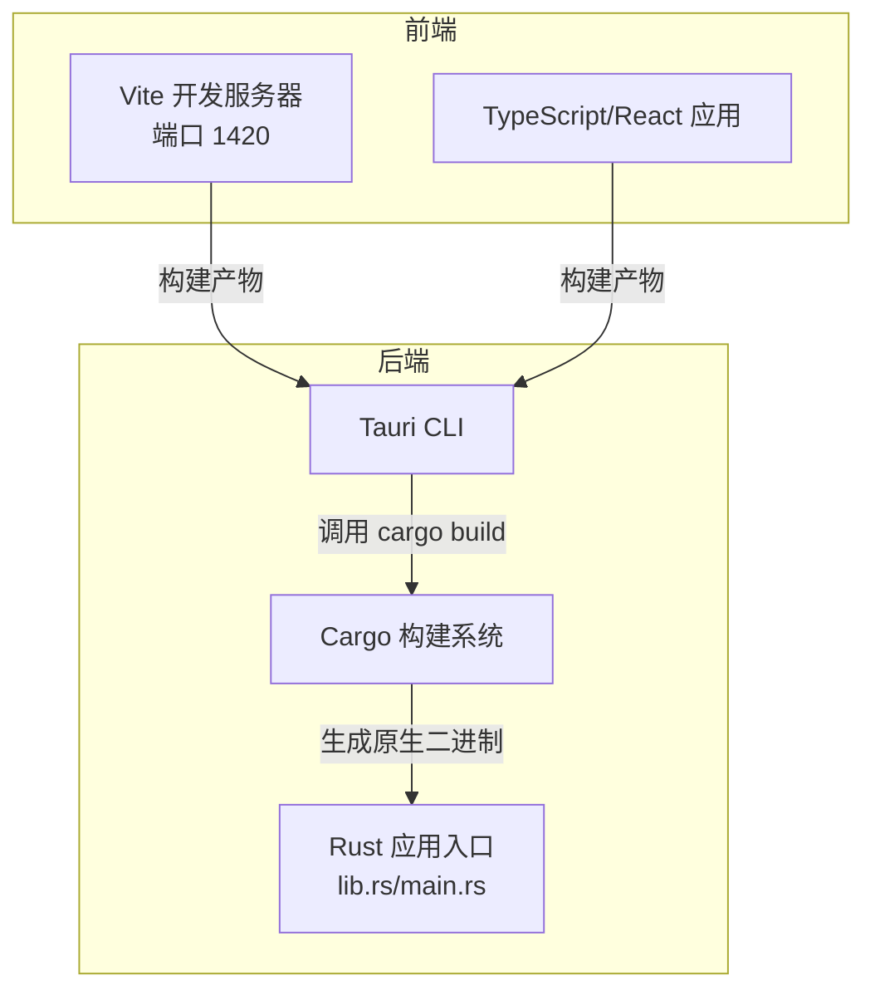
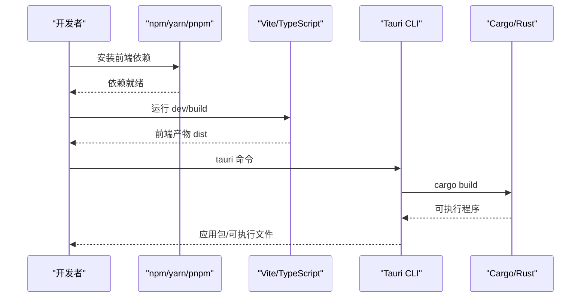
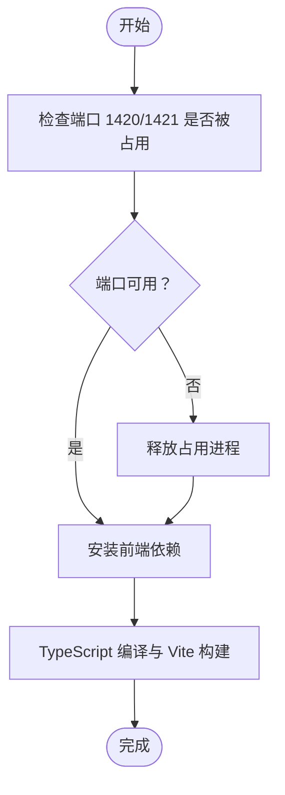
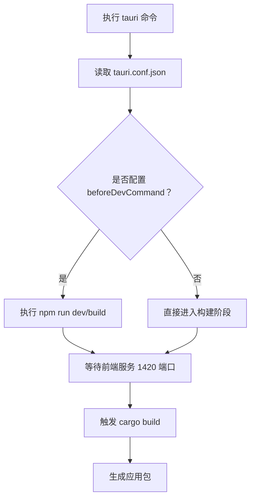
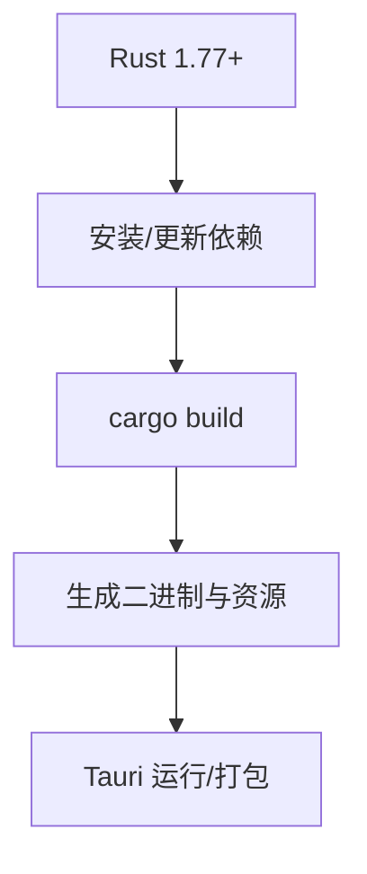
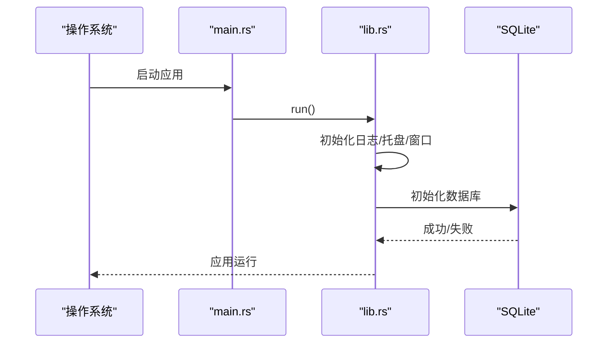
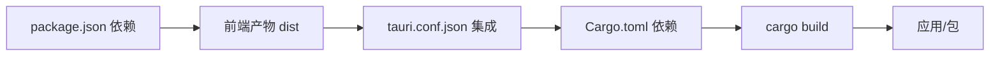

# 安装问题

<cite>
**本文引用的文件**
- [package.json](file://package.json)
- [Cargo.toml](file://src-tauri/Cargo.toml)
- [vite.config.ts](file://vite.config.ts)
- [tsconfig.json](file://tsconfig.json)
- [tauri.conf.json](file://src-tauri/tauri.conf.json)
- [build.rs](file://src-tauri/build.rs)
- [main.rs](file://src-tauri/src/main.rs)
- [lib.rs](file://src-tauri/src/lib.rs)
</cite>

## 目录
1. [简介](#简介)
2. [项目结构](#项目结构)
3. [核心组件](#核心组件)
4. [架构总览](#架构总览)
5. [详细组件分析](#详细组件分析)
6. [依赖关系分析](#依赖关系分析)
7. [性能考虑](#性能考虑)
8. [故障排除指南](#故障排除指南)
9. [结论](#结论)
10. [附录](#附录)

## 简介
本指南聚焦于 IPSwitcher 的安装与构建过程中的常见问题，覆盖 Node.js 版本兼容性、Rust 工具链安装失败、依赖包下载超时、跨平台（Windows/macOS/Linux）安装步骤与注意事项，并提供依赖检查命令、环境变量与网络代理设置方法，以及 npm install、cargo build 等命令执行失败的系统化排查与修复建议。

## 项目结构
IPSwitcher 是基于 Tauri v2 的桌面应用，前端使用 Vite + React + TypeScript，后端 Rust 提供系统级能力（网络接口管理、SQLite 存储、托盘图标等）。构建流程由 Tauri 配置驱动，先通过 npm 脚本构建前端，再由 Tauri 打包 Rust 后端。

图表来源
- [tauri.conf.json:6-11](file://src-tauri/tauri.conf.json#L6-L11)
- [vite.config.ts:6-24](file://vite.config.ts#L6-L24)
- [package.json:6-11](file://package.json#L6-L11)

章节来源
- [tauri.conf.json:1-48](file://src-tauri/tauri.conf.json#L1-L48)
- [vite.config.ts:1-25](file://vite.config.ts#L1-L25)
- [package.json:1-27](file://package.json#L1-L27)

## 核心组件
- 前端构建与开发
  - Vite 配置：开发服务器端口、热更新、忽略 src-tauri 目录监听。
  - TypeScript 配置：模块解析策略、严格模式、ESNext 模块目标。
  - npm 脚本：dev、build、preview、tauri。
- 后端构建与打包
  - Tauri 配置：前端构建产物路径、开发 URL、打包目标、最小系统版本。
  - Cargo 配置：Rust 版本要求、依赖项、平台特定依赖。
  - 构建入口：build.rs 调用 tauri_build，lib.rs/main.rs 初始化应用。

章节来源
- [vite.config.ts:1-25](file://vite.config.ts#L1-L25)
- [tsconfig.json:1-22](file://tsconfig.json#L1-L22)
- [package.json:6-25](file://package.json#L6-L25)
- [tauri.conf.json:1-48](file://src-tauri/tauri.conf.json#L1-L48)
- [Cargo.toml:1-30](file://src-tauri/Cargo.toml#L1-L30)
- [build.rs:1-4](file://src-tauri/build.rs#L1-L4)
- [main.rs:1-7](file://src-tauri/src/main.rs#L1-L7)
- [lib.rs:1-49](file://src-tauri/src/lib.rs#L1-L49)

## 架构总览
下图展示从安装到运行的关键路径：Node/npm 环境准备 → 前端依赖安装与构建 → Rust 工具链准备 → Tauri CLI 触发 cargo build → 生成可执行程序。

图表来源
- [package.json:6-11](file://package.json#L6-L11)
- [tauri.conf.json:6-11](file://src-tauri/tauri.conf.json#L6-L11)
- [vite.config.ts:6-24](file://vite.config.ts#L6-L24)
- [Cargo.toml:1-30](file://src-tauri/Cargo.toml#L1-L30)

## 详细组件分析

### 组件一：前端构建与依赖（Vite + TypeScript）
- 关键点
  - Vite 开发服务器默认端口为 1420，严格端口绑定；支持通过环境变量启用远程 HMR。
  - TypeScript 使用 ESNext 模块解析与严格模式，避免类型不一致导致的构建失败。
  - 忽略 src-tauri 目录的文件变更以减少不必要的重载。
- 常见问题
  - 端口占用：修改 Vite 端口或释放占用进程。
  - 模块解析失败：确认 bundler 解析策略与 tsconfig 设置一致。
  - 依赖缺失：确保已安装所有 devDependencies 和 dependencies。

图表来源
- [vite.config.ts:9-22](file://vite.config.ts#L9-L22)
- [tsconfig.json:8-18](file://tsconfig.json#L8-L18)
- [package.json:12-25](file://package.json#L12-L25)

章节来源
- [vite.config.ts:1-25](file://vite.config.ts#L1-L25)
- [tsconfig.json:1-22](file://tsconfig.json#L1-L22)
- [package.json:1-27](file://package.json#L1-L27)

### 组件二：Tauri 构建配置与前端集成
- 关键点
  - 前端构建产物目录指向 dist；开发时使用本地 Vite URL。
  - beforeDevCommand/beforeBuildCommand 在开发/构建前自动执行 npm 脚本。
  - 打包目标为 all，包含 macOS 最低系统版本要求。
- 常见问题
  - 前端未构建：确保先执行前端构建脚本，再执行 tauri 命令。
  - 开发 URL 不可达：检查 Vite 是否在 1420 端口启动且未被防火墙拦截。
  - 打包失败：确认已满足各平台最低系统版本与依赖。

图表来源
- [tauri.conf.json:6-11](file://src-tauri/tauri.conf.json#L6-L11)
- [package.json:6-11](file://package.json#L6-L11)

章节来源
- [tauri.conf.json:1-48](file://src-tauri/tauri.conf.json#L1-L48)
- [package.json:1-27](file://package.json#L1-L27)

### 组件三：Rust 工具链与 Cargo 配置
- 关键点
  - Rust 版本要求：1.77 或以上。
  - 依赖项：tauri、serde、rusqlite（带捆绑）、uuid、regex、log 等。
  - 平台特定依赖：macOS 下引入 libc。
  - 构建入口：build.rs 调用 tauri_build。
- 常见问题
  - Rust 工具链版本过低：升级至 1.77+。
  - 无法找到 rustc/cargo：检查 PATH 与 rustup 默认工具链。
  - 依赖编译失败：清理缓存、更新 crates.io 索引、检查网络代理。

图表来源
- [Cargo.toml:7](file://src-tauri/Cargo.toml#L7)
- [Cargo.toml:12-25](file://src-tauri/Cargo.toml#L12-L25)
- [build.rs:1-4](file://src-tauri/build.rs#L1-L4)

章节来源
- [Cargo.toml:1-30](file://src-tauri/Cargo.toml#L1-L30)
- [build.rs:1-4](file://src-tauri/build.rs#L1-L4)

### 组件四：应用入口与平台初始化
- 关键点
  - main.rs：在发布版隐藏额外控制台窗口。
  - lib.rs：初始化日志、数据库、托盘、窗口事件与命令处理器。
- 常见问题
  - 日志未输出：确认 env_logger 初始化成功。
  - 数据库初始化失败：检查 SQLite 文件权限与路径。
  - 托盘/窗口异常：核对 tauri.conf.json 中的托盘图标路径与窗口配置。

图表来源
- [main.rs:1-7](file://src-tauri/src/main.rs#L1-L7)
- [lib.rs:13-48](file://src-tauri/src/lib.rs#L13-L48)

章节来源
- [main.rs:1-7](file://src-tauri/src/main.rs#L1-L7)
- [lib.rs:1-49](file://src-tauri/src/lib.rs#L1-L49)

## 依赖关系分析
- 前端依赖
  - React 生态、Vite、TypeScript、@tauri-apps/cli（开发时）。
- 后端依赖
  - Tauri v2、shell/opener 插件、serde、rusqlite、uuid、regex、log 等。
- 构建链路
  - npm 脚本 → Vite/TypeScript → Tauri CLI → Cargo → 二进制。

图表来源
- [package.json:12-25](file://package.json#L12-L25)
- [tauri.conf.json:6-11](file://src-tauri/tauri.conf.json#L6-L11)
- [Cargo.toml:12-25](file://src-tauri/Cargo.toml#L12-L25)

章节来源
- [package.json:1-27](file://package.json#L1-L27)
- [tauri.conf.json:1-48](file://src-tauri/tauri.conf.json#L1-L48)
- [Cargo.toml:1-30](file://src-tauri/Cargo.toml#L1-L30)

## 性能考虑
- 构建性能
  - 使用严格端口与 HMR 降低重复构建成本。
  - 将 src-tauri 排除在监听范围外，避免不必要的重载。
- 运行性能
  - 合理设置窗口最小尺寸与 resizable 属性，提升用户体验。
  - 使用 SQLite 捆绑特性减少外部依赖，但注意数据库文件大小与锁竞争。

章节来源
- [vite.config.ts:20-22](file://vite.config.ts#L20-L22)
- [tauri.conf.json:14-25](file://src-tauri/tauri.conf.json#L14-L25)
- [Cargo.toml:18](file://src-tauri/Cargo.toml#L18)

## 故障排除指南

### 一、Node.js 与 npm/yarn/pnpm 兼容性
- 症状
  - npm install 失败、依赖版本冲突、TypeScript 编译报错。
- 排查步骤
  - 检查 Node.js 版本是否满足现代前端工具链要求（建议使用长期支持版本）。
  - 清理缓存并重装依赖：删除 node_modules 与锁定文件后重新安装。
  - 确认 npm/yarn/pnpm 选择一致，避免混合使用导致的不一致。
- 建议命令
  - 查看当前 Node/npm 版本与全局包列表。
  - 清理缓存并重装依赖。
  - 指定 registry 加速（如使用国内镜像源）。

章节来源
- [package.json:12-25](file://package.json#L12-L25)
- [tsconfig.json:8-18](file://tsconfig.json#L8-L18)

### 二、Rust 工具链安装失败
- 症状
  - cargo 无法找到、rustc 版本过低、构建时报错找不到标准库。
- 排查步骤
  - 安装 rustup 并设置默认工具链为 1.77+。
  - 更新工具链与组件：rustup update。
  - 检查 PATH 是否包含 Cargo/bin。
- 建议命令
  - 查看当前工具链版本与组件。
  - 切换/安装指定版本工具链。
  - 更新组件与 crates.io 索引。

章节来源
- [Cargo.toml:7](file://src-tauri/Cargo.toml#L7)
- [build.rs:1-4](file://src-tauri/build.rs#L1-L4)

### 三、依赖包下载超时（网络问题）
- 症状
  - npm install/cargo build 长时间卡住或超时。
- 排查步骤
  - 配置 npm/yarn/pnpm 的 registry 代理。
  - 配置 Cargo 的 crates.io 源镜像。
  - 在企业网络中配置系统代理或使用全局代理工具。
- 建议命令
  - 临时切换 npm registry。
  - 配置 Cargo 源镜像与代理。
  - 使用系统网络设置或代理软件。

章节来源
- [package.json:12-25](file://package.json#L12-L25)
- [Cargo.toml:12-25](file://src-tauri/Cargo.toml#L12-L25)

### 四、跨平台安装步骤与注意事项

#### Windows
- 步骤
  - 安装 Node.js 与 Rust 工具链。
  - 安装 Windows 平台所需的构建工具（如 Visual Studio Build Tools 或 Windows SDK）。
  - 安装 Tauri CLI 并执行 tauri 命令。
- 注意事项
  - 确保 PATH 包含 Node、Cargo 与构建工具。
  - 如需管理员权限，确保以管理员身份运行终端。
  - 防病毒软件可能阻止构建，必要时加入白名单。

章节来源
- [tauri.conf.json:34-46](file://src-tauri/tauri.conf.json#L34-L46)
- [Cargo.toml:12-25](file://src-tauri/Cargo.toml#L12-L25)

#### macOS
- 步骤
  - 安装 Xcode Command Line Tools 与 Rust 工具链。
  - 安装 Tauri CLI 并执行 tauri 命令。
- 注意事项
  - 最低系统版本要求为 10.15。
  - 若遇到签名或沙盒问题，检查 Info.plist 与 Tauri 配置。
  - 捆绑 SQLite 依赖通常无需额外配置。

章节来源
- [tauri.conf.json:43-45](file://src-tauri/tauri.conf.json#L43-L45)
- [Cargo.toml:18](file://src-tauri/Cargo.toml#L18)

#### Linux
- 步骤
  - 安装 Node.js、Rust 工具链与系统构建依赖（如 gcc、pkg-config、libssl-dev 等）。
  - 安装 Tauri CLI 并执行 tauri 命令。
- 注意事项
  - 不同发行版的依赖名称可能不同，按需安装。
  - 若使用 AppImage 或 Flatpak，确保打包配置正确。

章节来源
- [tauri.conf.json:34-46](file://src-tauri/tauri.conf.json#L34-L46)
- [Cargo.toml:12-25](file://src-tauri/Cargo.toml#L12-L25)

### 五、命令执行失败的解决方案

#### npm install 失败
- 常见原因
  - 权限不足、网络超时、缓存损坏。
- 解决方案
  - 使用管理员权限或修正用户目录权限。
  - 清理 npm 缓存并重试。
  - 切换到稳定网络或使用代理。

章节来源
- [package.json:12-25](file://package.json#L12-L25)

#### tauri dev/build 失败
- 常见原因
  - 前端未构建、开发服务器未启动、端口被占用。
- 解决方案
  - 先执行前端构建脚本，再执行 tauri 命令。
  - 确认 Vite 在 1420 端口运行，且 HMR 可用。
  - 释放端口占用或调整端口。

章节来源
- [tauri.conf.json:6-11](file://src-tauri/tauri.conf.json#L6-L11)
- [vite.config.ts:9-22](file://vite.config.ts#L9-L22)

#### cargo build 失败
- 常见原因
  - Rust 版本过低、缺少系统依赖、网络下载失败。
- 解决方案
  - 升级到 1.77+ 并更新工具链。
  - 安装系统构建依赖（Linux 发行版差异较大）。
  - 配置 crates.io 源镜像与网络代理。

章节来源
- [Cargo.toml:7](file://src-tauri/Cargo.toml#L7)
- [Cargo.toml:12-25](file://src-tauri/Cargo.toml#L12-L25)

### 六、依赖检查命令与环境变量

- 依赖检查
  - Node/npm：查看版本与全局包列表。
  - Rust：查看工具链版本与组件。
  - Cargo：查看已安装的 crates 与配置。
- 环境变量
  - TAURI_DEV_HOST：用于启用远程 HMR 主机。
  - http_proxy/https_proxy：配置 HTTP/HTTPS 代理。
  - NPM_CONFIG_REGISTRY：配置 npm registry。
  - CARGO_NET_GIT_FETCH_WITH_CLI：加速 Git 仓库访问。
- 网络代理设置
  - npm：配置 registry 与代理。
  - Cargo：配置 crates.io 源镜像与系统代理。
  - 系统代理：在系统网络设置中配置 PAC 或 SOCKS 代理。

章节来源
- [vite.config.ts:4](file://vite.config.ts#L4)
- [package.json:12-25](file://package.json#L12-L25)
- [Cargo.toml:12-25](file://src-tauri/Cargo.toml#L12-L25)

## 结论
安装与构建问题多源于环境不一致与网络限制。遵循本指南的分层排查思路（Node.js → Rust 工具链 → 网络代理 → 平台依赖），可快速定位并解决大多数安装失败场景。建议在干净环境中先行验证单个组件（npm/cargo），再进行整体构建，以缩短排障时间。

## 附录

### A. 常用命令清单
- 检查 Node/npm 版本与依赖
- 清理 npm 缓存并重装依赖
- 查看 Rust 工具链与组件
- 更新 Rust 工具链与组件
- 配置 npm registry 与代理
- 配置 Cargo 源镜像与代理
- 启动 Vite 开发服务器
- 执行 Tauri 构建/预览

章节来源
- [package.json:6-25](file://package.json#L6-L25)
- [vite.config.ts:6-24](file://vite.config.ts#L6-L24)
- [tauri.conf.json:6-11](file://src-tauri/tauri.conf.json#L6-L11)
- [Cargo.toml:7](file://src-tauri/Cargo.toml#L7)