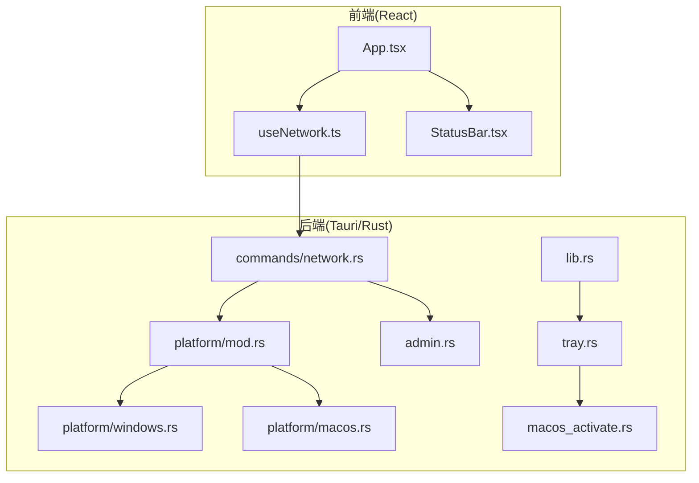
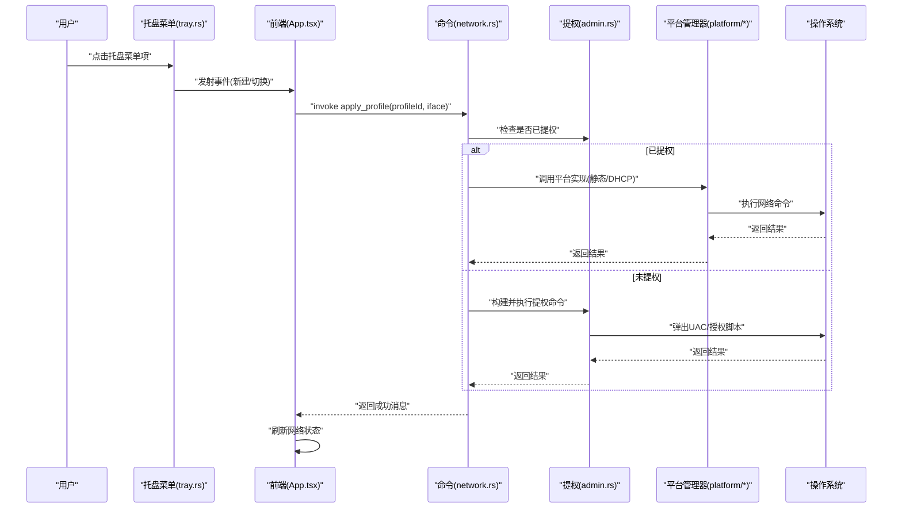
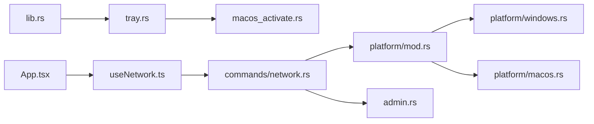

# 平台特定问题

<cite>
**本文引用的文件**
- [src-tauri/src/platform/mod.rs](file://src-tauri/src/platform/mod.rs)
- [src-tauri/src/platform/windows.rs](file://src-tauri/src/platform/windows.rs)
- [src-tauri/src/platform/macos.rs](file://src-tauri/src/platform/macos.rs)
- [src-tauri/src/tray.rs](file://src-tauri/src/tray.rs)
- [src-tauri/src/lib.rs](file://src-tauri/src/lib.rs)
- [src-tauri/src/admin.rs](file://src-tauri/src/admin.rs)
- [src-tauri/src/commands/network.rs](file://src-tauri/src/commands/network.rs)
- [src-tauri/src/macos_activate.rs](file://src-tauri/src/macos_activate.rs)
- [src-tauri/tauri.conf.json](file://src-tauri/tauri.conf.json)
- [src-tauri/Cargo.toml](file://src-tauri/Cargo.toml)
- [src/App.tsx](file://src/App.tsx)
- [src/hooks/useNetwork.ts](file://src/hooks/useNetwork.ts)
- [src/components/StatusBar.tsx](file://src/components/StatusBar.tsx)
</cite>

## 目录
1. [简介](#简介)
2. [项目结构](#项目结构)
3. [核心组件](#核心组件)
4. [架构总览](#架构总览)
5. [详细组件分析](#详细组件分析)
6. [依赖关系分析](#依赖关系分析)
7. [性能考量](#性能考量)
8. [故障排除指南](#故障排除指南)
9. [结论](#结论)
10. [附录](#附录)

## 简介
本指南聚焦于IPSwitcher在Windows与macOS平台上的常见问题与排障方法，覆盖系统托盘集成、任务栏显示、快捷键响应（通过托盘菜单）、菜单栏图标显示、权限请求、沙盒限制与系统版本兼容性等。文档同时提供平台检测方法、兼容性测试建议以及针对不同系统版本的差异处理与向后兼容性考虑。

## 项目结构
IPSwitcher采用Tauri 2桌面框架，Rust后端负责系统级网络管理与托盘集成，React前端负责UI与事件交互。平台特定逻辑通过条件编译与平台适配器模式实现，确保跨平台一致性。

图示来源
- [src-tauri/src/lib.rs:14-50](file://src-tauri/src/lib.rs#L14-L50)
- [src-tauri/src/tray.rs:21-98](file://src-tauri/src/tray.rs#L21-L98)
- [src-tauri/src/platform/mod.rs:54-63](file://src-tauri/src/platform/mod.rs#L54-L63)
- [src-tauri/src/platform/windows.rs:1-173](file://src-tauri/src/platform/windows.rs#L1-L173)
- [src-tauri/src/platform/macos.rs:1-175](file://src-tauri/src/platform/macos.rs#L1-L175)
- [src-tauri/src/admin.rs:1-165](file://src-tauri/src/admin.rs#L1-L165)
- [src-tauri/src/commands/network.rs:1-101](file://src-tauri/src/commands/network.rs#L1-L101)
- [src-tauri/src/macos_activate.rs:1-25](file://src-tauri/src/macos_activate.rs#L1-L25)
- [src/App.tsx:1-195](file://src/App.tsx#L1-L195)
- [src/hooks/useNetwork.ts:1-99](file://src/hooks/useNetwork.ts#L1-L99)
- [src/components/StatusBar.tsx:1-39](file://src/components/StatusBar.tsx#L1-L39)

章节来源
- [src-tauri/src/lib.rs:14-50](file://src-tauri/src/lib.rs#L14-L50)
- [src-tauri/tauri.conf.json:1-48](file://src-tauri/tauri.conf.json#L1-L48)

## 核心组件
- 平台网络管理器抽象：通过trait定义统一接口，按平台注入具体实现（Windows/macOS）。
- 托盘构建与事件：统一托盘菜单与点击行为，macOS使用专用激活策略以确保前台显示。
- 权限与提权：根据平台调用原生命令或脚本进行网络配置变更，并处理用户取消与错误。
- 前端网络状态与UI：定时刷新当前网络配置，展示状态与连接指示。

章节来源
- [src-tauri/src/platform/mod.rs:12-32](file://src-tauri/src/platform/mod.rs#L12-L32)
- [src-tauri/src/platform/windows.rs:8-38](file://src-tauri/src/platform/windows.rs#L8-L38)
- [src-tauri/src/platform/macos.rs:8-43](file://src-tauri/src/platform/macos.rs#L8-L43)
- [src-tauri/src/tray.rs:21-98](file://src-tauri/src/tray.rs#L21-L98)
- [src-tauri/src/admin.rs:26-49](file://src-tauri/src/admin.rs#L26-L49)
- [src-tauri/src/commands/network.rs:9-26](file://src-tauri/src/commands/network.rs#L9-L26)
- [src/hooks/useNetwork.ts:71-86](file://src/hooks/useNetwork.ts#L71-L86)

## 架构总览
以下序列图展示从托盘菜单到系统网络配置变更的关键流程，包含权限检查与平台差异处理。

图示来源
- [src-tauri/src/tray.rs:50-93](file://src-tauri/src/tray.rs#L50-L93)
- [src-tauri/src/commands/network.rs:29-95](file://src-tauri/src/commands/network.rs#L29-L95)
- [src-tauri/src/admin.rs:26-49](file://src-tauri/src/admin.rs#L26-L49)
- [src-tauri/src/platform/windows.rs:88-171](file://src-tauri/src/platform/windows.rs#L88-L171)
- [src-tauri/src/platform/macos.rs:112-173](file://src-tauri/src/platform/macos.rs#L112-L173)
- [src/App.tsx:115-143](file://src/App.tsx#L115-L143)

## 详细组件分析

### Windows平台问题定位与修复
- 系统托盘集成与任务栏显示
  - 任务栏跳过显示由配置控制，避免Dock图标闪烁；托盘图标路径与模板设置在配置中声明。
  - 若托盘图标不显示，检查托盘图标路径与模板设置是否正确。
- 快捷键响应
  - 应通过托盘菜单触发，而非全局快捷键；若快捷键无效，确认托盘事件绑定与菜单项ID一致。
- 权限与命令执行
  - 网络配置变更需管理员权限；失败时检查UAC提示与命令返回状态。
- 兼容性与系统版本
  - Windows系统版本差异主要影响命令参数与输出解析；当前实现基于标准命令，建议在目标版本上进行回归测试。

章节来源
- [src-tauri/tauri.conf.json:23-29](file://src-tauri/tauri.conf.json#L23-L29)
- [src-tauri/src/platform/windows.rs:8-38](file://src-tauri/src/platform/windows.rs#L8-L38)
- [src-tauri/src/platform/windows.rs:88-171](file://src-tauri/src/platform/windows.rs#L88-L171)
- [src-tauri/src/admin.rs:101-164](file://src-tauri/src/admin.rs#L101-L164)

### macOS平台问题定位与修复
- 菜单栏图标显示
  - 使用辅助应用策略，确保在菜单栏显示且可前置；点击托盘图标时调用激活函数以忽略其他应用。
- 权限请求与沙盒限制
  - 首次执行网络命令会触发授权脚本；若被拒绝，捕获用户取消错误并提示重新授权。
- 系统版本兼容性
  - 最低系统版本在配置中声明；低于该版本可能无法运行或功能受限。

章节来源
- [src-tauri/src/lib.rs:24-28](file://src-tauri/src/lib.rs#L24-L28)
- [src-tauri/src/tray.rs:10-19](file://src-tauri/src/tray.rs#L10-L19)
- [src-tauri/src/macos_activate.rs:6-15](file://src-tauri/src/macos_activate.rs#L6-L15)
- [src-tauri/tauri.conf.json:43-45](file://src-tauri/tauri.conf.json#L43-L45)
- [src-tauri/src/platform/macos.rs:8-43](file://src-tauri/src/platform/macos.rs#L8-L43)
- [src-tauri/src/platform/macos.rs:112-173](file://src-tauri/src/platform/macos.rs#L112-L173)
- [src-tauri/src/admin.rs:77-99](file://src-tauri/src/admin.rs#L77-L99)

### 托盘与窗口交互
- 左键点击托盘图标切换主窗口显示/隐藏，并在macOS上强制激活应用。
- 菜单项“新建方案”与“切换到: 方案名”通过事件桥接至前端，触发相应UI动作。

章节来源
- [src-tauri/src/tray.rs:75-93](file://src-tauri/src/tray.rs#L75-L93)
- [src-tauri/src/tray.rs:100-143](file://src-tauri/src/tray.rs#L100-L143)
- [src/App.tsx:115-143](file://src/App.tsx#L115-L143)

### 网络配置命令与权限
- 获取当前配置：自动选择活动接口或指定接口，解析平台命令输出。
- 应用方案：根据模式(DHCP/静态)调用平台实现；若无权限则通过平台提权脚本执行。
- 管理员状态检查：用于UI提示与流程分支。

章节来源
- [src-tauri/src/commands/network.rs:9-26](file://src-tauri/src/commands/network.rs#L9-L26)
- [src-tauri/src/commands/network.rs:28-95](file://src-tauri/src/commands/network.rs#L28-L95)
- [src-tauri/src/platform/mod.rs:54-63](file://src-tauri/src/platform/mod.rs#L54-L63)
- [src-tauri/src/platform/windows.rs:40-86](file://src-tauri/src/platform/windows.rs#L40-L86)
- [src-tauri/src/platform/macos.rs:45-110](file://src-tauri/src/platform/macos.rs#L45-L110)
- [src/hooks/useNetwork.ts:28-38](file://src/hooks/useNetwork.ts#L28-L38)
- [src/hooks/useNetwork.ts:49-69](file://src/hooks/useNetwork.ts#L49-L69)

## 依赖关系分析
- 平台模块通过工厂函数注入具体实现，降低耦合度。
- 托盘依赖macOS激活模块以保证前台显示。
- 网络命令依赖权限模块与平台实现，形成清晰的职责边界。

图示来源
- [src-tauri/src/platform/mod.rs:54-63](file://src-tauri/src/platform/mod.rs#L54-L63)
- [src-tauri/src/platform/windows.rs:1-173](file://src-tauri/src/platform/windows.rs#L1-L173)
- [src-tauri/src/platform/macos.rs:1-175](file://src-tauri/src/platform/macos.rs#L1-L175)
- [src-tauri/src/tray.rs:1-98](file://src-tauri/src/tray.rs#L1-L98)
- [src-tauri/src/macos_activate.rs:1-25](file://src-tauri/src/macos_activate.rs#L1-L25)
- [src-tauri/src/lib.rs:19-30](file://src-tauri/src/lib.rs#L19-L30)
- [src-tauri/src/commands/network.rs:1-101](file://src-tauri/src/commands/network.rs#L1-L101)
- [src-tauri/src/admin.rs:1-165](file://src-tauri/src/admin.rs#L1-L165)
- [src/hooks/useNetwork.ts:1-99](file://src/hooks/useNetwork.ts#L1-L99)
- [src/App.tsx:1-195](file://src/App.tsx#L1-L195)

章节来源
- [src-tauri/src/platform/mod.rs:54-63](file://src-tauri/src/platform/mod.rs#L54-L63)
- [src-tauri/src/lib.rs:19-30](file://src-tauri/src/lib.rs#L19-L30)
- [src-tauri/src/tray.rs:1-98](file://src-tauri/src/tray.rs#L1-L98)
- [src-tauri/src/commands/network.rs:1-101](file://src-tauri/src/commands/network.rs#L1-L101)
- [src-tauri/src/admin.rs:1-165](file://src-tauri/src/admin.rs#L1-L165)

## 性能考量
- 网络状态轮询：前端每30秒自动刷新一次当前接口配置，避免频繁阻塞UI。
- 命令执行：平台命令为同步阻塞调用，建议在后台线程或异步上下文中执行，避免阻塞主线程。
- 图标渲染：托盘图标模板与尺寸在配置中声明，确保在不同DPI下正确显示。

章节来源
- [src/hooks/useNetwork.ts:77-86](file://src/hooks/useNetwork.ts#L77-L86)
- [src-tauri/tauri.conf.json:26-29](file://src-tauri/tauri.conf.json#L26-L29)

## 故障排除指南

### Windows平台
- 症状：托盘图标不显示或任务栏无应用图标
  - 检查托盘图标路径与模板设置是否正确；确认打包资源包含对应图标。
  - 关注任务栏跳过显示配置，避免误以为应用未启动。
- 症状：托盘菜单点击无响应
  - 确认菜单项ID与事件处理器匹配；检查事件监听是否注册。
- 症状：应用网络配置失败
  - 确认以管理员身份运行；查看命令返回状态与错误信息。
  - 若DNS设置失败，检查备用DNS添加的索引参数。
- 症状：快捷键无效
  - 仅通过托盘菜单触发；如需全局快捷键，需在应用层新增实现。

章节来源
- [src-tauri/tauri.conf.json:23-29](file://src-tauri/tauri.conf.json#L23-L29)
- [src-tauri/src/tray.rs:50-93](file://src-tauri/src/tray.rs#L50-L93)
- [src-tauri/src/platform/windows.rs:88-171](file://src-tauri/src/platform/windows.rs#L88-L171)
- [src-tauri/src/admin.rs:141-164](file://src-tauri/src/admin.rs#L141-L164)

### macOS平台
- 症状：菜单栏图标不显示
  - 确认应用以辅助应用策略运行；检查Info.plist与系统偏好设置中的辅助功能授权。
- 症状：首次执行网络命令无响应
  - 授权脚本会弹出系统授权对话框；若被取消，捕获用户取消错误并引导重新授权。
- 症状：窗口无法置前
  - 使用激活函数强制置前；确保在托盘点击事件中调用。
- 症状：系统版本过低导致运行异常
  - 最低系统版本在配置中声明；低于该版本需升级系统或降级应用。

章节来源
- [src-tauri/src/lib.rs:24-28](file://src-tauri/src/lib.rs#L24-L28)
- [src-tauri/src/tray.rs:10-19](file://src-tauri/src/tray.rs#L10-L19)
- [src-tauri/src/macos_activate.rs:6-15](file://src-tauri/src/macos_activate.rs#L6-L15)
- [src-tauri/tauri.conf.json:43-45](file://src-tauri/tauri.conf.json#L43-L45)
- [src-tauri/src/admin.rs:77-99](file://src-tauri/src/admin.rs#L77-L99)

### 通用问题
- 症状：网络状态不更新
  - 检查前端轮询逻辑与接口选择；确认活动接口存在。
- 症状：权限不足
  - 调用权限检查命令；必要时触发平台提权流程。
- 症状：UI与实际状态不一致
  - 在应用方案后主动刷新当前配置；确保事件监听正常工作。

章节来源
- [src/hooks/useNetwork.ts:77-86](file://src/hooks/useNetwork.ts#L77-L86)
- [src-tauri/src/commands/network.rs:97-100](file://src-tauri/src/commands/network.rs#L97-L100)
- [src-tauri/src/admin.rs:3-24](file://src-tauri/src/admin.rs#L3-L24)
- [src/App.tsx:115-143](file://src/App.tsx#L115-L143)

## 结论
IPSwitcher通过平台适配器与托盘事件机制实现了跨平台的网络配置切换能力。Windows侧重任务栏与托盘集成及权限管理，macOS强调菜单栏显示与系统授权流程。遵循本文提供的排障步骤与最佳实践，可有效解决常见平台问题并提升用户体验。

## 附录

### 平台检测与兼容性测试清单
- Windows
  - 托盘图标与任务栏显示验证
  - UAC权限与命令执行结果验证
  - 不同系统版本下的命令输出解析一致性
- macOS
  - 菜单栏图标显示与激活行为验证
  - 授权脚本弹窗与用户取消处理
  - 最低系统版本验证
- 通用
  - 前端轮询与状态刷新
  - 事件监听与托盘菜单联动
  - 错误提示与日志记录

章节来源
- [src-tauri/tauri.conf.json:43-45](file://src-tauri/tauri.conf.json#L43-L45)
- [src-tauri/src/platform/windows.rs:8-38](file://src-tauri/src/platform/windows.rs#L8-L38)
- [src-tauri/src/platform/macos.rs:8-43](file://src-tauri/src/platform/macos.rs#L8-L43)
- [src-tauri/src/tray.rs:21-98](file://src-tauri/src/tray.rs#L21-L98)
- [src/hooks/useNetwork.ts:77-86](file://src/hooks/useNetwork.ts#L77-L86)