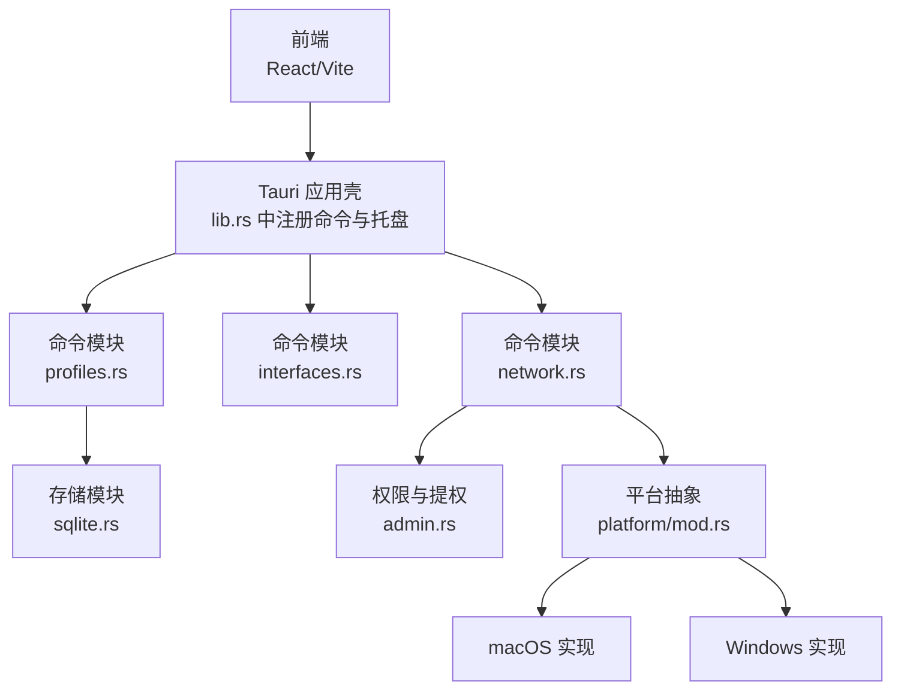
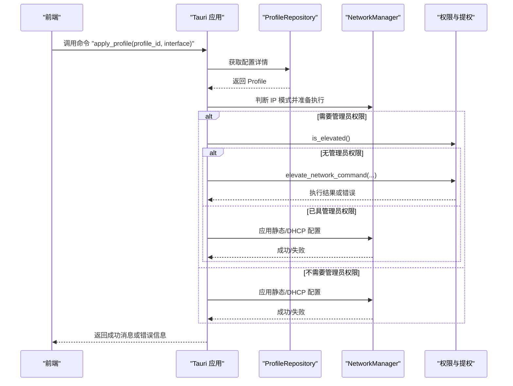
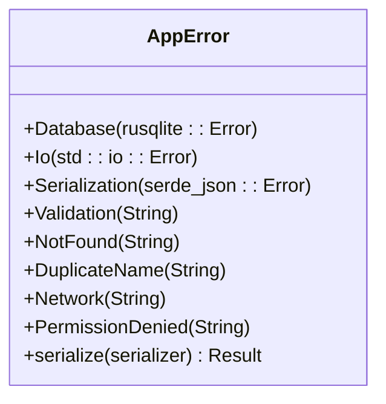
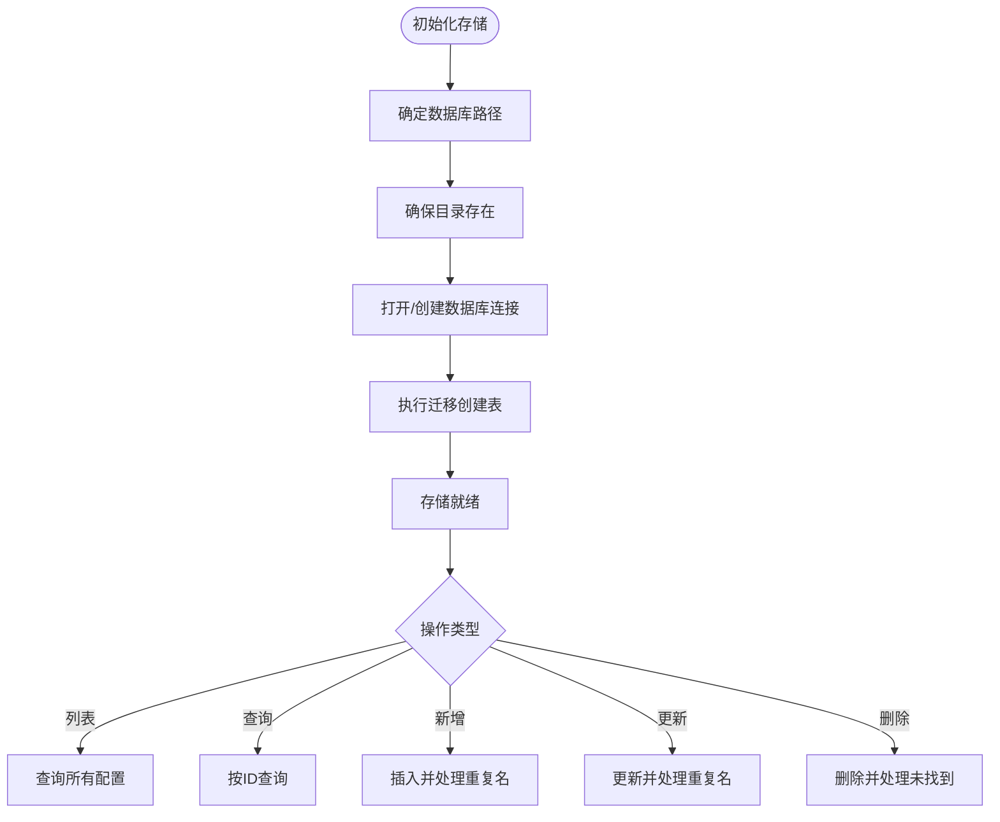
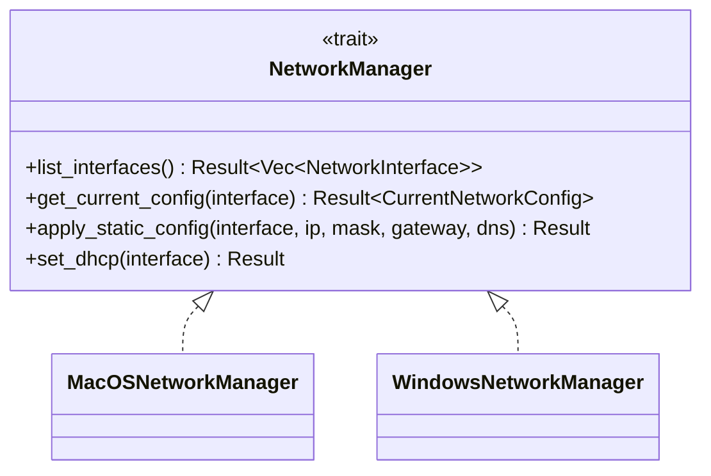
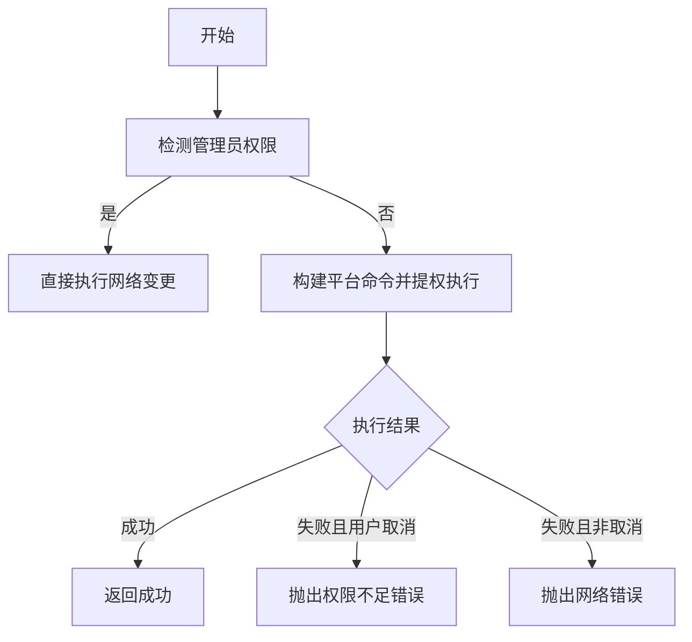
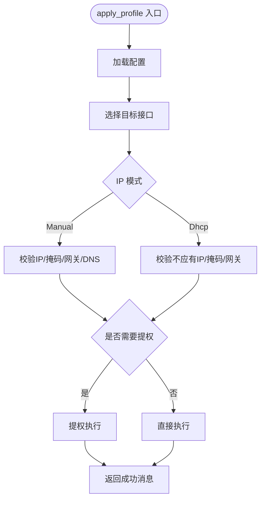
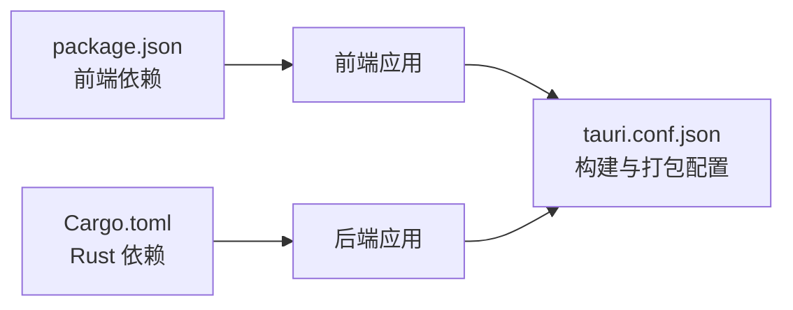

# 故障排除

<cite>
**本文引用的文件**
- [package.json](file://package.json)
- [src-tauri/Cargo.toml](file://src-tauri/Cargo.toml)
- [src-tauri/tauri.conf.json](file://src-tauri/tauri.conf.json)
- [src-tauri/src/main.rs](file://src-tauri/src/main.rs)
- [src-tauri/src/lib.rs](file://src-tauri/src/lib.rs)
- [src-tauri/src/error.rs](file://src-tauri/src/error.rs)
- [src-tauri/src/admin.rs](file://src-tauri/src/admin.rs)
- [src-tauri/src/platform/mod.rs](file://src-tauri/src/platform/mod.rs)
- [src-tauri/src/commands/mod.rs](file://src-tauri/src/commands/mod.rs)
- [src-tauri/src/commands/interfaces.rs](file://src-tauri/src/commands/interfaces.rs)
- [src-tauri/src/commands/network.rs](file://src-tauri/src/commands/network.rs)
- [src-tauri/src/commands/profiles.rs](file://src-tauri/src/commands/profiles.rs)
- [src-tauri/src/storage/sqlite.rs](file://src-tauri/src/storage/sqlite.rs)
- [src-tauri/src/models/profile.rs](file://src-tauri/src/models/profile.rs)
</cite>

## 目录
1. [简介](#简介)
2. [项目结构](#项目结构)
3. [核心组件](#核心组件)
4. [架构总览](#架构总览)
5. [详细组件分析](#详细组件分析)
6. [依赖关系分析](#依赖关系分析)
7. [性能考虑](#性能考虑)
8. [故障排除指南](#故障排除指南)
9. [结论](#结论)
10. [附录](#附录)

## 简介
本指南面向使用 IPSwitcher 的用户与维护者，聚焦于安装、运行时错误、平台差异、权限与网络配置失败、系统集成异常、性能诊断、内存泄漏与崩溃分析等常见问题，并提供日志分析方法、调试技巧与问题定位策略。文档中的所有技术细节均基于仓库中实际源码文件进行归纳总结。

## 项目结构
IPSwitcher 采用前端（React + Vite）与后端（Tauri + Rust）分层架构：前端负责界面与交互；后端通过 Tauri 暴露命令接口，调用平台网络管理器与 SQLite 存储，完成网络配置切换与配置持久化。

图表来源
- [src-tauri/src/lib.rs:13-47](file://src-tauri/src/lib.rs#L13-L47)
- [src-tauri/src/commands/mod.rs:1-4](file://src-tauri/src/commands/mod.rs#L1-L4)
- [src-tauri/src/storage/sqlite.rs:8-27](file://src-tauri/src/storage/sqlite.rs#L8-L27)
- [src-tauri/src/admin.rs:1-165](file://src-tauri/src/admin.rs#L1-L165)
- [src-tauri/src/platform/mod.rs:1-64](file://src-tauri/src/platform/mod.rs#L1-L64)

章节来源
- [package.json:6-11](file://package.json#L6-L11)
- [src-tauri/Cargo.toml:1-30](file://src-tauri/Cargo.toml#L1-L30)
- [src-tauri/tauri.conf.json:1-48](file://src-tauri/tauri.conf.json#L1-L48)
- [src-tauri/src/lib.rs:13-47](file://src-tauri/src/lib.rs#L13-L47)

## 核心组件
- 命令层：提供配置列表、查询、创建、更新、删除、接口枚举、当前配置读取、应用配置、管理员状态检查等命令。
- 平台抽象层：定义统一的网络管理器接口，分别在 macOS 与 Windows 上实现具体逻辑。
- 权限与提权：跨平台判断是否具备管理员权限，并在需要时以提权方式执行网络配置命令。
- 存储层：基于 SQLite 的配置持久化，包含迁移、增删改查与约束冲突处理。
- 错误模型：统一的错误类型与序列化，便于前端识别与展示。

章节来源
- [src-tauri/src/commands/profiles.rs:9-113](file://src-tauri/src/commands/profiles.rs#L9-L113)
- [src-tauri/src/commands/interfaces.rs:1-8](file://src-tauri/src/commands/interfaces.rs#L1-L8)
- [src-tauri/src/commands/network.rs:9-101](file://src-tauri/src/commands/network.rs#L9-L101)
- [src-tauri/src/platform/mod.rs:12-32](file://src-tauri/src/platform/mod.rs#L12-L32)
- [src-tauri/src/admin.rs:3-49](file://src-tauri/src/admin.rs#L3-L49)
- [src-tauri/src/storage/sqlite.rs:12-256](file://src-tauri/src/storage/sqlite.rs#L12-L256)
- [src-tauri/src/error.rs:3-28](file://src-tauri/src/error.rs#L3-L28)

## 架构总览
下面的序列图展示了“应用配置”命令的完整调用链：前端触发命令，后端解析参数，读取配置，按需提权执行网络变更，返回结果或错误。

图表来源
- [src-tauri/src/commands/network.rs:29-95](file://src-tauri/src/commands/network.rs#L29-L95)
- [src-tauri/src/storage/sqlite.rs:110-144](file://src-tauri/src/storage/sqlite.rs#L110-L144)
- [src-tauri/src/admin.rs:27-49](file://src-tauri/src/admin.rs#L27-L49)
- [src-tauri/src/platform/mod.rs:12-32](file://src-tauri/src/platform/mod.rs#L12-L32)

## 详细组件分析

### 错误模型与错误分类
- 数据库错误、IO 错误、序列化错误、验证错误、未找到、重复名称、网络操作失败、权限不足。
- 错误可序列化为字符串，便于前端展示。

图表来源
- [src-tauri/src/error.rs:3-38](file://src-tauri/src/error.rs#L3-L38)

章节来源
- [src-tauri/src/error.rs:3-38](file://src-tauri/src/error.rs#L3-L38)

### 存储层（SQLite）
- 初始化数据库路径与目录，执行迁移创建 profiles 表。
- 支持列表、按 ID 查询、插入、更新、删除。
- 插入/更新时对唯一约束冲突进行捕获并映射为重复名称错误。
- 使用互斥锁保护连接访问。

图表来源
- [src-tauri/src/storage/sqlite.rs:12-74](file://src-tauri/src/storage/sqlite.rs#L12-L74)
- [src-tauri/src/storage/sqlite.rs:146-232](file://src-tauri/src/storage/sqlite.rs#L146-L232)

章节来源
- [src-tauri/src/storage/sqlite.rs:12-256](file://src-tauri/src/storage/sqlite.rs#L12-L256)

### 平台抽象与网络管理器
- 定义统一接口：列举接口、获取当前配置、应用静态配置、设为 DHCP。
- 工厂函数根据操作系统返回对应实现。
- macOS 与 Windows 分别实现具体逻辑。

图表来源
- [src-tauri/src/platform/mod.rs:12-32](file://src-tauri/src/platform/mod.rs#L12-L32)
- [src-tauri/src/platform/mod.rs:54-63](file://src-tauri/src/platform/mod.rs#L54-L63)

章节来源
- [src-tauri/src/platform/mod.rs:1-64](file://src-tauri/src/platform/mod.rs#L1-L64)

### 权限与提权
- 判断是否具备管理员权限（macOS 使用进程 UID，Windows 使用命令返回值）。
- 在需要时以提权方式执行网络配置命令：
  - macOS：通过 AppleScript 弹出授权对话框并执行命令。
  - Windows：通过 PowerShell 启动带提升权限的命令提示符执行。
- 若用户取消授权，抛出权限不足错误；其他失败则包装为网络错误。

图表来源
- [src-tauri/src/admin.rs:3-49](file://src-tauri/src/admin.rs#L3-L49)
- [src-tauri/src/admin.rs:77-99](file://src-tauri/src/admin.rs#L77-L99)
- [src-tauri/src/admin.rs:142-164](file://src-tauri/src/admin.rs#L142-L164)

章节来源
- [src-tauri/src/admin.rs:3-165](file://src-tauri/src/admin.rs#L3-L165)

### 命令：网络配置应用
- 参数校验：若为手动模式，必须提供 IP、掩码、网关与至少一个 DNS；DHCP 模式下不允许设置上述字段。
- 选择目标接口：优先使用传入接口，否则使用活动接口，最后回退到首个接口。
- 根据权限决定直接执行或提权执行，并返回人类可读的成功消息。

图表来源
- [src-tauri/src/commands/network.rs:29-95](file://src-tauri/src/commands/network.rs#L29-L95)
- [src-tauri/src/models/profile.rs:34-81](file://src-tauri/src/models/profile.rs#L34-L81)

章节来源
- [src-tauri/src/commands/network.rs:9-101](file://src-tauri/src/commands/network.rs#L9-L101)
- [src-tauri/src/models/profile.rs:34-88](file://src-tauri/src/models/profile.rs#L34-L88)

### 命令：接口枚举与配置 CRUD
- 接口枚举：委托给当前平台的网络管理器。
- 配置 CRUD：调用存储层，包含输入校验与重复名处理。

章节来源
- [src-tauri/src/commands/interfaces.rs:1-8](file://src-tauri/src/commands/interfaces.rs#L1-L8)
- [src-tauri/src/commands/profiles.rs:9-113](file://src-tauri/src/commands/profiles.rs#L9-L113)

## 依赖关系分析
- 前端依赖：React、ReactDOM、@tauri-apps/api、@tauri-apps/plugin-shell。
- 后端依赖：tauri、tauri-plugin-shell、tauri-plugin-opener、serde、serde_json、rusqlite、uuid、chrono、log、env_logger、thiserror、regex。
- 平台特定依赖：macOS 使用 libc；Windows 无额外依赖块。
- 构建与打包：Vite 前端构建，Tauri 打包；开发与生产环境配置在 tauri.conf.json。

图表来源
- [package.json:12-25](file://package.json#L12-L25)
- [src-tauri/Cargo.toml:12-24](file://src-tauri/Cargo.toml#L12-L24)
- [src-tauri/tauri.conf.json:6-11](file://src-tauri/tauri.conf.json#L6-L11)

章节来源
- [package.json:12-25](file://package.json#L12-L25)
- [src-tauri/Cargo.toml:12-30](file://src-tauri/Cargo.toml#L12-L30)
- [src-tauri/tauri.conf.json:1-48](file://src-tauri/tauri.conf.json#L1-L48)

## 性能考虑
- 数据库访问：存储层使用互斥锁保护连接，避免并发写入竞争；建议减少频繁的增删改查调用，合并批量操作。
- 日志：后端初始化日志记录器，可在开发阶段开启更详细的日志级别以便排查。
- 网络命令：提权执行会弹窗与等待，应避免在高频场景中重复触发；前端可增加节流与确认提示。
- 前端渲染：React 组件按需更新，避免不必要的重渲染；合理拆分组件与使用稳定引用。

## 故障排除指南

### 一、安装与运行问题
- 开发环境启动失败
  - 确认前端脚本与依赖安装正常，查看开发服务器端口占用情况。
  - 参考前端脚本与开发配置。
- 打包构建失败
  - 检查 tauri.conf.json 中的前端构建产物路径与 CLI 版本匹配。
  - 确保 Rust 工具链版本满足要求。
- 运行时窗口关闭即退出
  - 应用设置为隐藏到托盘并阻止关闭，需从托盘菜单退出或使用系统任务管理器结束进程。

章节来源
- [package.json:6-11](file://package.json#L6-L11)
- [src-tauri/tauri.conf.json:6-11](file://src-tauri/tauri.conf.json#L6-L11)
- [src-tauri/src/lib.rs:29-34](file://src-tauri/src/lib.rs#L29-L34)

### 二、权限相关问题
- 症状：应用配置失败，提示权限不足或用户取消。
  - 现象：macOS 提权弹窗被取消；Windows 提权失败或拒绝。
  - 处理：确认用户授予管理员权限；若为静默失败，检查平台命令构建与执行返回。
- 症状：未检测到管理员权限导致无法应用配置。
  - 现象：命令在非管理员权限下被拒绝。
  - 处理：以管理员身份运行应用或允许提权执行。

章节来源
- [src-tauri/src/admin.rs:3-49](file://src-tauri/src/admin.rs#L3-L49)
- [src-tauri/src/admin.rs:77-99](file://src-tauri/src/admin.rs#L77-L99)
- [src-tauri/src/admin.rs:142-164](file://src-tauri/src/admin.rs#L142-L164)
- [src-tauri/src/commands/network.rs:53-88](file://src-tauri/src/commands/network.rs#L53-L88)

### 三、网络配置失败
- 症状：应用配置后网络未生效或报错。
  - 现象：平台命令执行失败或返回错误信息。
  - 处理：检查接口名称是否正确；确认手动模式下的 IP、掩码、网关与 DNS 格式；在 macOS 上确认 networksetup 可用，在 Windows 上确认 netsh 可用。
- 症状：未找到可用网络接口。
  - 现象：接口枚举为空或无活动接口。
  - 处理：重新刷新接口列表；确保系统网络服务正常。

章节来源
- [src-tauri/src/commands/network.rs:10-26](file://src-tauri/src/commands/network.rs#L10-L26)
- [src-tauri/src/commands/interfaces.rs:1-8](file://src-tauri/src/commands/interfaces.rs#L1-L8)
- [src-tauri/src/platform/mod.rs:12-32](file://src-tauri/src/platform/mod.rs#L12-L32)

### 四、系统集成异常
- 症状：托盘图标不显示或窗口无法隐藏。
  - 现象：关闭窗口触发隐藏但托盘未出现。
  - 处理：确认托盘图标路径与模板设置；检查应用激活策略与系统偏好设置。
- 症状：打包后图标缺失或最小系统版本不兼容。
  - 现象：应用无法启动或崩溃。
  - 处理：核对 tauri.conf.json 中的图标清单与最低系统版本设置。

章节来源
- [src-tauri/src/lib.rs:18-34](file://src-tauri/src/lib.rs#L18-L34)
- [src-tauri/tauri.conf.json:26-46](file://src-tauri/tauri.conf.json#L26-L46)

### 五、数据与配置问题
- 症状：创建/更新配置时报重复名称。
  - 现象：唯一约束冲突。
  - 处理：修改配置名称或删除同名配置后重试。
- 症状：查询不到配置或删除失败。
  - 现象：未找到错误。
  - 处理：确认 ID 正确性；检查数据库文件是否存在。

章节来源
- [src-tauri/src/storage/sqlite.rs:173-182](file://src-tauri/src/storage/sqlite.rs#L173-L182)
- [src-tauri/src/storage/sqlite.rs:211-221](file://src-tauri/src/storage/sqlite.rs#L211-L221)
- [src-tauri/src/storage/sqlite.rs:140-144](file://src-tauri/src/storage/sqlite.rs#L140-L144)

### 六、日志分析与调试技巧
- 后端日志
  - 初始化日志记录器，可在开发阶段观察命令执行与错误堆栈。
- 前端日志
  - 通过浏览器开发者工具查看控制台输出与网络请求；确认命令调用与返回值。
- 调试建议
  - 在命令入口处打印关键参数与返回值；
  - 对网络命令执行前后分别记录状态；
  - 对错误进行分类并上报至错误面板。

章节来源
- [src-tauri/src/lib.rs:14-14](file://src-tauri/src/lib.rs#L14-L14)
- [src-tauri/src/error.rs:30-37](file://src-tauri/src/error.rs#L30-L37)

### 七、性能问题诊断
- 数据库性能
  - 避免高频率的写入；合并事务或批量操作；检查索引与查询条件。
- 网络命令性能
  - 减少重复提权执行；缓存接口列表；在 UI 层增加节流与确认。
- 内存与资源
  - 关注互斥锁持有时间；避免长时间阻塞主线程；及时释放资源。

### 八、内存泄漏与崩溃分析
- 内存泄漏
  - 检查互斥锁是否被意外持有；避免循环引用；定期复位状态。
- 崩溃分析
  - 收集后端日志与系统事件日志；定位错误发生点；缩小到具体命令或平台实现。
- 平台差异
  - macOS 与 Windows 的命令行为不同，需分别验证；注意权限弹窗时机与返回码。

### 九、社区支持与问题报告
- 社区支持
  - 通过项目仓库的 issue 区域提交问题；提供操作系统版本、应用版本、复现步骤与日志。
- 问题报告流程
  - 步骤：复现问题 → 收集日志 → 截图/录屏 → 编写最小可复现示例 → 提交 issue。
  - 信息：操作系统、IPSwitcher 版本、网络接口名称、配置内容、错误信息与日志片段。

## 结论
本指南基于代码实现总结了 IPSwitcher 的常见问题与解决思路，覆盖安装、权限、网络配置、系统集成、性能与崩溃等维度。建议在开发与运维过程中结合日志与调试工具，按分类逐项排查，优先处理权限与平台差异问题，再逐步深入到存储与网络命令层面。

## 附录

### A. 关键命令与职责对照
- 列表/查询/创建/更新/删除配置：profiles 命令模块
- 枚举网络接口：interfaces 命令模块
- 当前配置读取与应用配置：network 命令模块
- 平台网络管理：platform 抽象层
- 权限与提权：admin 模块
- 配置持久化：storage/sqlite 模块

章节来源
- [src-tauri/src/commands/mod.rs:1-4](file://src-tauri/src/commands/mod.rs#L1-L4)
- [src-tauri/src/commands/profiles.rs:9-113](file://src-tauri/src/commands/profiles.rs#L9-L113)
- [src-tauri/src/commands/interfaces.rs:1-8](file://src-tauri/src/commands/interfaces.rs#L1-L8)
- [src-tauri/src/commands/network.rs:9-101](file://src-tauri/src/commands/network.rs#L9-L101)
- [src-tauri/src/platform/mod.rs:1-64](file://src-tauri/src/platform/mod.rs#L1-L64)
- [src-tauri/src/admin.rs:1-165](file://src-tauri/src/admin.rs#L1-L165)
- [src-tauri/src/storage/sqlite.rs:1-256](file://src-tauri/src/storage/sqlite.rs#L1-L256)