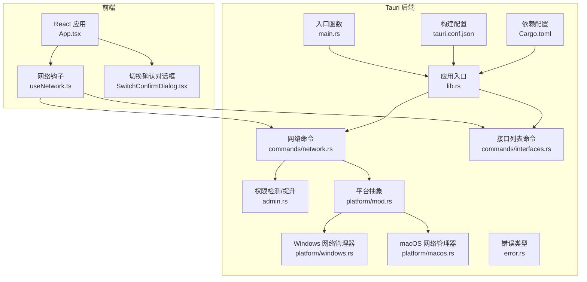
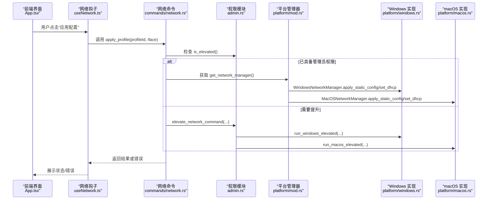
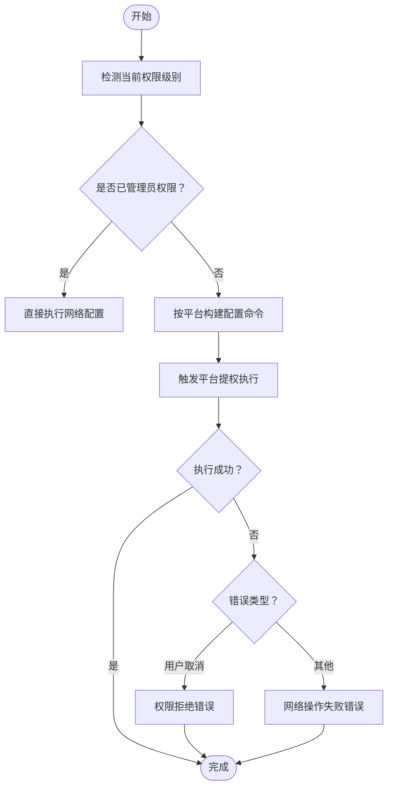
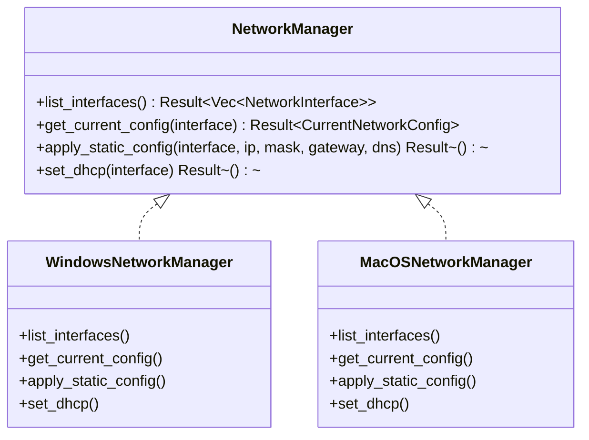
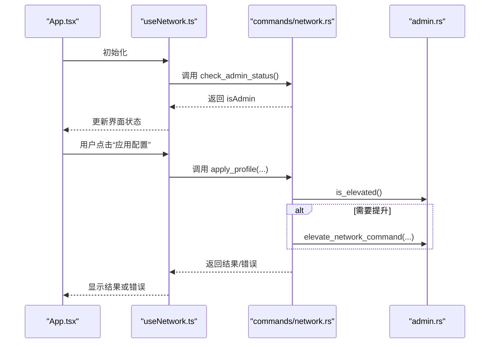
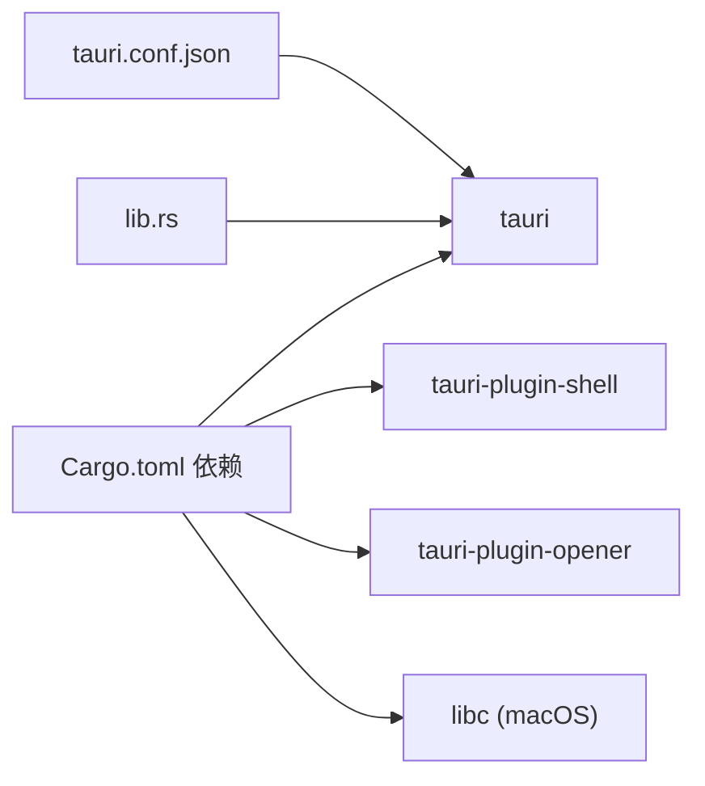

# 权限问题

<cite>
**本文引用的文件**
- [src-tauri/src/admin.rs](file://src-tauri/src/admin.rs)
- [src-tauri/src/platform/mod.rs](file://src-tauri/src/platform/mod.rs)
- [src-tauri/src/platform/windows.rs](file://src-tauri/src/platform/windows.rs)
- [src-tauri/src/platform/macos.rs](file://src-tauri/src/platform/macos.rs)
- [src-tauri/src/commands/network.rs](file://src-tauri/src/commands/network.rs)
- [src-tauri/src/commands/interfaces.rs](file://src-tauri/src/commands/interfaces.rs)
- [src-tauri/src/error.rs](file://src-tauri/src/error.rs)
- [src-tauri/src/lib.rs](file://src-tauri/src/lib.rs)
- [src-tauri/src/main.rs](file://src-tauri/src/main.rs)
- [src-tauri/Cargo.toml](file://src-tauri/Cargo.toml)
- [src-tauri/tauri.conf.json](file://src-tauri/tauri.conf.json)
- [src/hooks/useNetwork.ts](file://src/hooks/useNetwork.ts)
- [src/App.tsx](file://src/App.tsx)
- [src/components/SwitchConfirmDialog.tsx](file://src/components/SwitchConfirmDialog.tsx)
</cite>

## 目录
1. [简介](#简介)
2. [项目结构](#项目结构)
3. [核心组件](#核心组件)
4. [架构总览](#架构总览)
5. [详细组件分析](#详细组件分析)
6. [依赖关系分析](#依赖关系分析)
7. [性能考量](#性能考量)
8. [故障排除指南](#故障排除指南)
9. [结论](#结论)
10. [附录](#附录)

## 简介
本指南聚焦于 IPSwitcher 的跨平台权限管理与故障排除，覆盖以下关键主题：
- 管理员权限检测与提升机制
- Windows 平台的 UAC 提示处理与 Elevation API 调用
- macOS 平台的权限请求与沙盒限制
- 权限验证流程、错误分类与用户反馈
- 常见权限相关问题（如网络配置应用失败、系统服务访问受限）的诊断与修复步骤

## 项目结构
后端采用 Tauri 2 架构，Rust 实现平台特定的网络配置能力，并通过命令暴露给前端；前端使用 React 与 @tauri-apps/api 进行调用。

**图表来源**
- [src-tauri/src/lib.rs:19-49](file://src-tauri/src/lib.rs#L19-L49)
- [src-tauri/src/main.rs:4-6](file://src-tauri/src/main.rs#L4-L6)
- [src-tauri/src/commands/network.rs:9-95](file://src-tauri/src/commands/network.rs#L9-L95)
- [src-tauri/src/commands/interfaces.rs:4-7](file://src-tauri/src/commands/interfaces.rs#L4-L7)
- [src-tauri/src/admin.rs:3-49](file://src-tauri/src/admin.rs#L3-L49)
- [src-tauri/src/platform/mod.rs:54-63](file://src-tauri/src/platform/mod.rs#L54-L63)
- [src-tauri/src/platform/windows.rs:8-172](file://src-tauri/src/platform/windows.rs#L8-L172)
- [src-tauri/src/platform/macos.rs:8-174](file://src-tauri/src/platform/macos.rs#L8-L174)
- [src-tauri/src/error.rs:3-28](file://src-tauri/src/error.rs#L3-L28)
- [src-tauri/tauri.conf.json:1-48](file://src-tauri/tauri.conf.json#L1-L48)
- [src-tauri/Cargo.toml:1-31](file://src-tauri/Cargo.toml#L1-L31)

**章节来源**
- [src-tauri/src/lib.rs:19-49](file://src-tauri/src/lib.rs#L19-L49)
- [src-tauri/src/main.rs:4-6](file://src-tauri/src/main.rs#L4-L6)
- [src-tauri/src/commands/network.rs:9-95](file://src-tauri/src/commands/network.rs#L9-L95)
- [src-tauri/src/commands/interfaces.rs:4-7](file://src-tauri/src/commands/interfaces.rs#L4-L7)
- [src-tauri/src/admin.rs:3-49](file://src-tauri/src/admin.rs#L3-L49)
- [src-tauri/src/platform/mod.rs:54-63](file://src-tauri/src/platform/mod.rs#L54-L63)
- [src-tauri/src/platform/windows.rs:8-172](file://src-tauri/src/platform/windows.rs#L8-L172)
- [src-tauri/src/platform/macos.rs:8-174](file://src-tauri/src/platform/macos.rs#L8-L174)
- [src-tauri/src/error.rs:3-28](file://src-tauri/src/error.rs#L3-L28)
- [src-tauri/tauri.conf.json:1-48](file://src-tauri/tauri.conf.json#L1-L48)
- [src-tauri/Cargo.toml:1-31](file://src-tauri/Cargo.toml#L1-L31)

## 核心组件
- 权限检测与提升：跨平台检测当前进程是否具备管理员权限，并在需要时触发提升流程。
- 平台网络管理器：抽象出统一接口，分别实现 Windows 与 macOS 的网络配置能力。
- 前端集成：通过 Tauri 命令与 Rust 后端交互，实时显示管理员状态与网络配置。

**章节来源**
- [src-tauri/src/admin.rs:3-49](file://src-tauri/src/admin.rs#L3-L49)
- [src-tauri/src/platform/mod.rs:12-32](file://src-tauri/src/platform/mod.rs#L12-L32)
- [src-tauri/src/platform/windows.rs:8-172](file://src-tauri/src/platform/windows.rs#L8-L172)
- [src-tauri/src/platform/macos.rs:8-174](file://src-tauri/src/platform/macos.rs#L8-L174)
- [src/hooks/useNetwork.ts:40-74](file://src/hooks/useNetwork.ts#L40-L74)

## 架构总览
后端通过命令模块暴露网络操作与权限检查；平台模块根据操作系统选择具体实现；前端通过 invoke 调用命令并展示结果与错误信息。

**图表来源**
- [src-tauri/src/commands/network.rs:29-95](file://src-tauri/src/commands/network.rs#L29-L95)
- [src-tauri/src/admin.rs:26-49](file://src-tauri/src/admin.rs#L26-L49)
- [src-tauri/src/platform/mod.rs:54-63](file://src-tauri/src/platform/mod.rs#L54-L63)
- [src-tauri/src/platform/windows.rs:88-145](file://src-tauri/src/platform/windows.rs#L88-L145)
- [src-tauri/src/platform/macos.rs:112-151](file://src-tauri/src/platform/macos.rs#L112-L151)

## 详细组件分析

### 权限检测与提升（admin.rs）
- 功能要点
  - 跨平台检测：macOS 使用有效用户 ID 判断 root；Windows 使用系统命令探测会话权限。
  - 提升执行：根据目标平台构造命令并通过脚本引擎触发 UAC 或 AppleScript 提权。
- 错误处理
  - 用户取消：识别特定错误文本并映射为权限拒绝错误。
  - 执行失败：捕获标准错误输出并返回网络操作失败错误。

**图表来源**
- [src-tauri/src/admin.rs:3-49](file://src-tauri/src/admin.rs#L3-L49)
- [src-tauri/src/admin.rs:77-99](file://src-tauri/src/admin.rs#L77-L99)
- [src-tauri/src/admin.rs:142-164](file://src-tauri/src/admin.rs#L142-L164)

**章节来源**
- [src-tauri/src/admin.rs:3-49](file://src-tauri/src/admin.rs#L3-L49)
- [src-tauri/src/admin.rs:77-99](file://src-tauri/src/admin.rs#L77-L99)
- [src-tauri/src/admin.rs:142-164](file://src-tauri/src/admin.rs#L142-L164)

### 平台网络管理器（platform/mod.rs、windows.rs、macos.rs）
- 抽象接口
  - 列举网络接口、查询当前配置、应用静态配置、切换到 DHCP。
- Windows 实现
  - 使用 netsh 列表与查询接口，设置静态 IP/DNS 与 DHCP。
  - 失败时返回明确的网络错误消息，便于前端提示。
- macOS 实现
  - 使用 networksetup 列表与查询接口，设置静态 IP/DNS 与 DHCP。
  - 失败时返回明确的网络错误消息，便于前端提示。

**图表来源**
- [src-tauri/src/platform/mod.rs:12-32](file://src-tauri/src/platform/mod.rs#L12-L32)
- [src-tauri/src/platform/windows.rs:8-172](file://src-tauri/src/platform/windows.rs#L8-L172)
- [src-tauri/src/platform/macos.rs:8-174](file://src-tauri/src/platform/macos.rs#L8-L174)

**章节来源**
- [src-tauri/src/platform/mod.rs:12-32](file://src-tauri/src/platform/mod.rs#L12-L32)
- [src-tauri/src/platform/windows.rs:8-172](file://src-tauri/src/platform/windows.rs#L8-L172)
- [src-tauri/src/platform/macos.rs:8-174](file://src-tauri/src/platform/macos.rs#L8-L174)

### 前端集成（useNetwork.ts、App.tsx、SwitchConfirmDialog.tsx）
- 管理员状态检查：启动时调用后端命令检查权限状态并更新 UI。
- 应用配置：调用后端 apply_profile，若失败则捕获错误并在 UI 中展示。
- 用户提示：在切换前弹出确认对话框，提示需要管理员权限。

**图表来源**
- [src/hooks/useNetwork.ts:40-74](file://src/hooks/useNetwork.ts#L40-L74)
- [src-tauri/src/commands/network.rs:97-100](file://src-tauri/src/commands/network.rs#L97-L100)
- [src-tauri/src/commands/network.rs:29-95](file://src-tauri/src/commands/network.rs#L29-L95)
- [src-tauri/src/admin.rs:3-49](file://src-tauri/src/admin.rs#L3-L49)

**章节来源**
- [src/hooks/useNetwork.ts:40-74](file://src/hooks/useNetwork.ts#L40-L74)
- [src/App.tsx:86-113](file://src/App.tsx#L86-L113)
- [src/components/SwitchConfirmDialog.tsx:72-74](file://src/components/SwitchConfirmDialog.tsx#L72-L74)
- [src-tauri/src/commands/network.rs:97-100](file://src-tauri/src/commands/network.rs#L97-L100)
- [src-tauri/src/commands/network.rs:29-95](file://src-tauri/src/commands/network.rs#L29-L95)

## 依赖关系分析
- 构建与运行
  - Tauri 2 作为桌面框架，启用 shell 与 opener 插件。
  - macOS 依赖 libc 用于权限检测；Windows 无额外平台依赖。
- 配置
  - tauri.conf.json 定义产品名、窗口属性、托盘图标与打包配置。

**图表来源**
- [src-tauri/Cargo.toml:12-31](file://src-tauri/Cargo.toml#L12-L31)
- [src-tauri/tauri.conf.json:34-46](file://src-tauri/tauri.conf.json#L34-L46)
- [src-tauri/src/lib.rs:19-22](file://src-tauri/src/lib.rs#L19-L22)

**章节来源**
- [src-tauri/Cargo.toml:12-31](file://src-tauri/Cargo.toml#L12-L31)
- [src-tauri/tauri.conf.json:34-46](file://src-tauri/tauri.conf.json#L34-L46)
- [src-tauri/src/lib.rs:19-22](file://src-tauri/src/lib.rs#L19-L22)

## 性能考量
- 命令调用开销：每次网络配置变更都会触发系统命令调用，建议在 UI 层合并频繁操作，减少不必要的重复调用。
- 自动刷新：前端定时拉取当前配置，建议根据实际需求调整轮询间隔，避免过度占用系统资源。
- 提权成本：Windows 的 UAC 提示与 macOS 的权限请求会阻塞 UI，应尽量在用户明确意图后再触发。

## 故障排除指南

### 通用排查步骤
- 确认管理员权限
  - 在前端调用后端命令检查权限状态，若为 false，需触发提升流程。
  - 若用户取消 UAC 或权限请求，将收到权限拒绝错误。
- 查看错误类型
  - 网络错误：通常由系统命令执行失败导致，包含具体失败原因。
  - 权限错误：由用户取消或权限不足引起。
- 重试策略
  - 对于临时性失败（如系统忙），可稍后重试；对于权限错误，需确保以管理员身份运行或正确授权。

**章节来源**
- [src-tauri/src/commands/network.rs:97-100](file://src-tauri/src/commands/network.rs#L97-L100)
- [src-tauri/src/admin.rs:93-98](file://src-tauri/src/admin.rs#L93-L98)
- [src-tauri/src/error.rs:23-27](file://src-tauri/src/error.rs#L23-L27)

### Windows 权限问题
- 症状
  - 设置静态 IP/DNS 或切换到 DHCP 失败，提示需要管理员权限。
- 原因
  - 当前进程非管理员，netsh 命令执行被拒绝。
- 解决方案
  - 以管理员身份重新启动应用程序。
  - 确认 UAC 提示已允许提升。
  - 检查组策略或设备管理器是否限制了网络配置权限。

**章节来源**
- [src-tauri/src/platform/windows.rs:96-109](file://src-tauri/src/platform/windows.rs#L96-L109)
- [src-tauri/src/platform/windows.rs:147-159](file://src-tauri/src/platform/windows.rs#L147-L159)
- [src-tauri/src/admin.rs:142-164](file://src-tauri/src/admin.rs#L142-L164)

### macOS 权限问题
- 症状
  - networksetup 命令执行失败，提示需要管理员权限。
- 原因
  - 当前用户非管理员，AppleScript 提权请求被拒绝或失败。
- 解决方案
  - 以管理员身份运行应用程序或在首次运行时授权。
  - 检查系统偏好设置中的辅助功能权限。
  - 确保未处于严格沙盒限制下（如 App Store 版本）。

**章节来源**
- [src-tauri/src/platform/macos.rs:120-133](file://src-tauri/src/platform/macos.rs#L120-L133)
- [src-tauri/src/platform/macos.rs:153-163](file://src-tauri/src/platform/macos.rs#L153-L163)
- [src-tauri/src/admin.rs:77-99](file://src-tauri/src/admin.rs#L77-L99)

### 网络配置应用失败
- 常见场景
  - 接口名称不匹配或不可用。
  - DNS 设置顺序或索引错误。
  - 系统正在使用该接口，无法立即更改。
- 排查步骤
  - 先调用接口列表命令确认目标接口存在且状态正常。
  - 尝试先切换到 DHCP 再应用静态配置，避免冲突。
  - 检查防火墙或第三方安全软件是否阻止相关命令。

**章节来源**
- [src-tauri/src/commands/interfaces.rs:4-7](file://src-tauri/src/commands/interfaces.rs#L4-L7)
- [src-tauri/src/platform/windows.rs:111-142](file://src-tauri/src/platform/windows.rs#L111-L142)
- [src-tauri/src/platform/macos.rs:135-148](file://src-tauri/src/platform/macos.rs#L135-L148)

### 权限检查与授予方法
- 检查管理员状态
  - 调用后端命令获取当前权限状态，前端据此决定是否显示提升按钮。
- 授予方法
  - Windows：以管理员身份运行程序；确保 UAC 允许提升。
  - macOS：在首次运行时授权 AppleScript 提权；检查辅助功能权限。
- 权限降级处理
  - 若权限丢失，前端应回退到仅读取模式或提示用户重新授权。

**章节来源**
- [src-tauri/src/commands/network.rs:97-100](file://src-tauri/src/commands/network.rs#L97-L100)
- [src/hooks/useNetwork.ts:40-47](file://src/hooks/useNetwork.ts#L40-L47)
- [src-tauri/src/admin.rs:3-24](file://src-tauri/src/admin.rs#L3-L24)

### 常用命令与参考路径
- 列出网络接口
  - Windows：使用 netsh 列表接口。
  - macOS：使用 networksetup 列表服务。
- 查询当前配置
  - Windows：使用 netsh 查询指定接口配置。
  - macOS：使用 networksetup 获取信息。
- 应用静态配置
  - Windows：使用 netsh 设置地址与 DNS。
  - macOS：使用 networksetup 设置手动配置与 DNS。
- 切换到 DHCP
  - Windows：使用 netsh 设置地址与 DNS 为 DHCP。
  - macOS：使用 networksetup 设置 DHCP 并清空 DNS。

**章节来源**
- [src-tauri/src/platform/windows.rs:9-86](file://src-tauri/src/platform/windows.rs#L9-L86)
- [src-tauri/src/platform/macos.rs:9-110](file://src-tauri/src/platform/macos.rs#L9-L110)
- [src-tauri/src/platform/windows.rs:88-172](file://src-tauri/src/platform/windows.rs#L88-L172)
- [src-tauri/src/platform/macos.rs:112-174](file://src-tauri/src/platform/macos.rs#L112-L174)

## 结论
IPSwitcher 的权限体系围绕“检测—提升—执行”展开：前端负责引导与反馈，后端在必要时触发平台特定的提权流程，并通过明确的错误类型帮助用户定位问题。针对 Windows 的 UAC 与 macOS 的权限请求，建议在用户体验与安全性之间取得平衡，提供清晰的提示与可恢复的错误处理。

## 附录
- 错误类型映射
  - 网络错误：用于描述系统命令执行失败。
  - 权限拒绝：用于描述用户取消或权限不足。
- 最佳实践
  - 在执行高风险网络操作前进行二次确认。
  - 对于失败操作记录日志以便后续诊断。
  - 在 UI 中区分只读与可写状态，避免误导用户。

**章节来源**
- [src-tauri/src/error.rs:23-27](file://src-tauri/src/error.rs#L23-L27)
- [src-tauri/src/admin.rs:93-98](file://src-tauri/src/admin.rs#L93-L98)