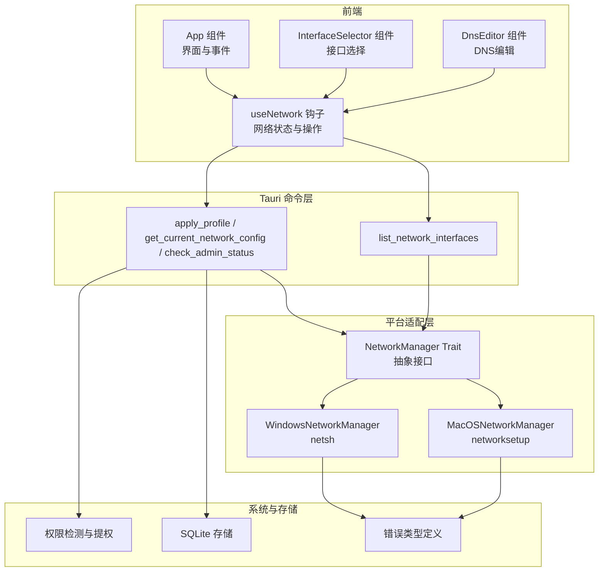
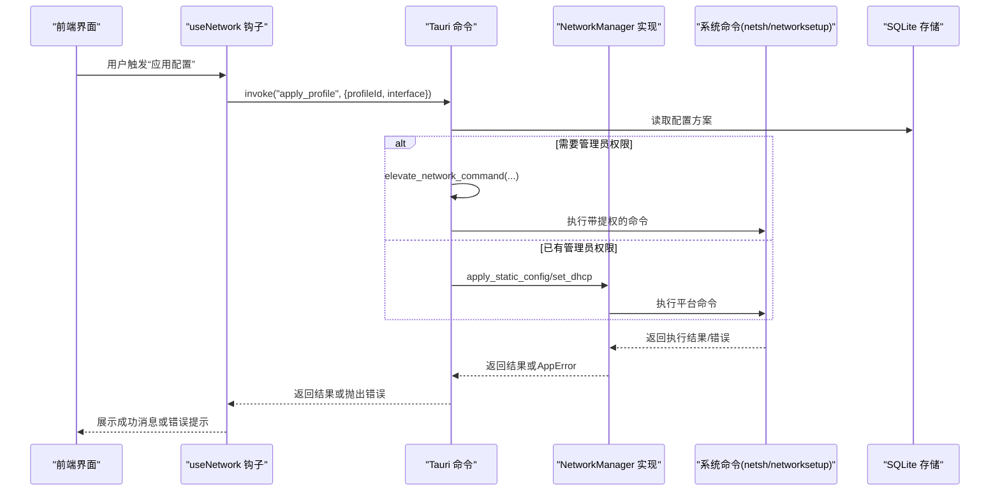
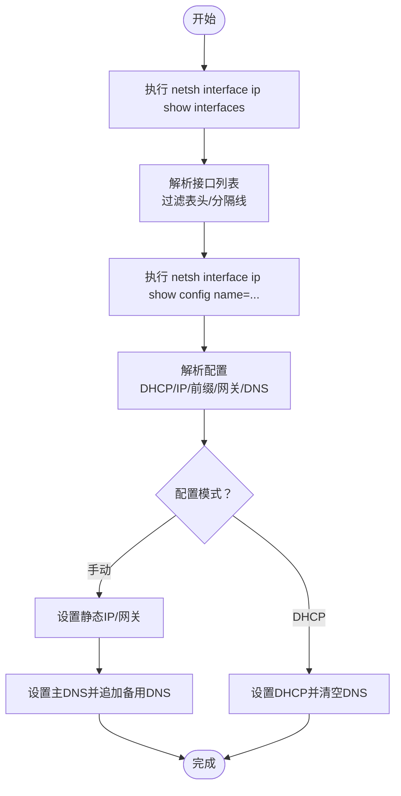
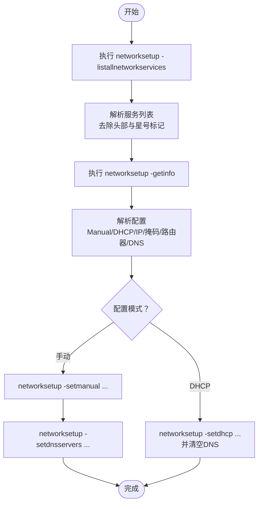
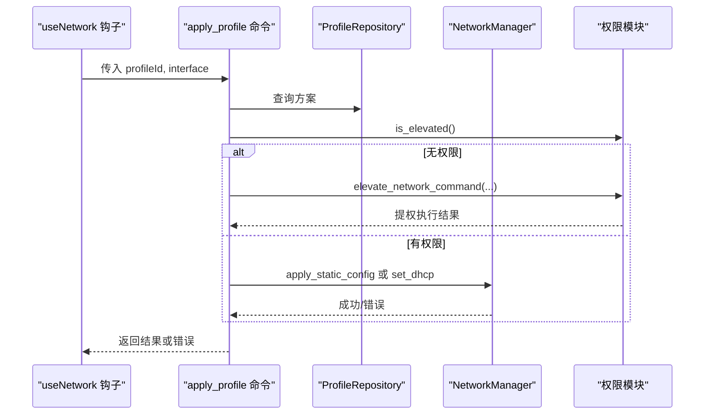
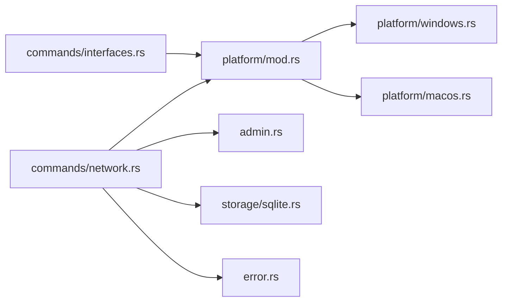
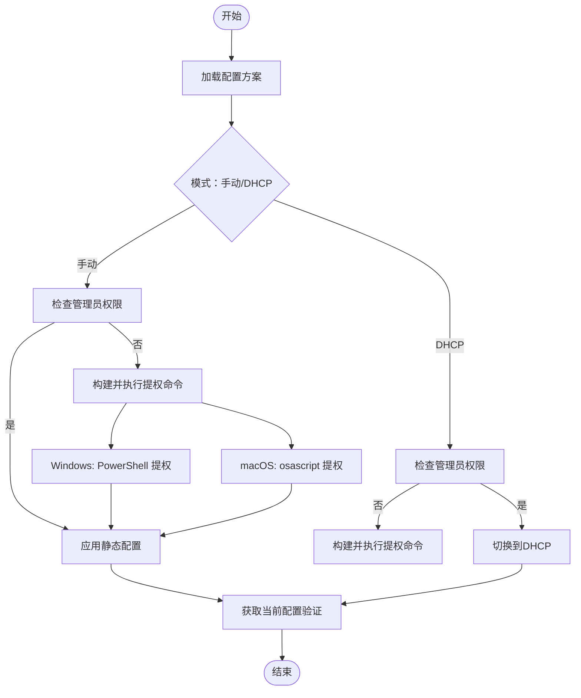

# 网络配置失败

<cite>
**本文引用的文件**
- [src-tauri/src/platform/windows.rs](file://src-tauri/src/platform/windows.rs)
- [src-tauri/src/platform/macos.rs](file://src-tauri/src/platform/macos.rs)
- [src-tauri/src/platform/mod.rs](file://src-tauri/src/platform/mod.rs)
- [src-tauri/src/commands/network.rs](file://src-tauri/src/commands/network.rs)
- [src-tauri/src/commands/interfaces.rs](file://src-tauri/src/commands/interfaces.rs)
- [src-tauri/src/admin.rs](file://src-tauri/src/admin.rs)
- [src-tauri/src/error.rs](file://src-tauri/src/error.rs)
- [src-tauri/src/storage/sqlite.rs](file://src-tauri/src/storage/sqlite.rs)
- [src-tauri/src/models/profile.rs](file://src-tauri/src/models/profile.rs)
- [src/hooks/useNetwork.ts](file://src/hooks/useNetwork.ts)
- [src/components/InterfaceSelector.tsx](file://src/components/InterfaceSelector.tsx)
- [src/components/DnsEditor.tsx](file://src/components/DnsEditor.tsx)
- [src/App.tsx](file://src/App.tsx)
- [src/types/index.ts](file://src/types/index.ts)
</cite>

## 目录
1. [简介](#简介)
2. [项目结构](#项目结构)
3. [核心组件](#核心组件)
4. [架构总览](#架构总览)
5. [详细组件分析](#详细组件分析)
6. [依赖关系分析](#依赖关系分析)
7. [性能考量](#性能考量)
8. [故障排除指南](#故障排除指南)
9. [结论](#结论)
10. [附录](#附录)

## 简介
本指南聚焦于IPSwitcher在Windows与macOS平台上进行网络配置时可能遇到的“配置失败”问题，围绕以下关键场景提供系统化的诊断与修复路径：
- 网络接口发现失败：无法正确枚举或识别当前活跃接口
- IP地址配置错误：静态IP设置失败、参数校验失败、格式不合法
- DNS设置异常：主备DNS写入失败、DNS列表解析异常
- 平台命令执行问题：Windows的netsh命令、macOS的networksetup命令执行失败
- 权限与提权：非管理员权限导致的配置拒绝
- 网络服务冲突与回滚：配置冲突、回退策略与验证流程

本指南同时给出跨平台命令参考（netsh、networksetup）、网络状态检查与接口列表获取方法，以及防火墙与服务冲突的排查建议。

## 项目结构
IPSwitcher采用前后端分离架构：
- 前端（React + Tauri）负责界面交互、用户输入与状态展示
- 后端（Rust + Tauri）负责平台命令调用、权限管理、配置持久化与错误处理

图表来源
- [src-tauri/src/platform/mod.rs:12-32](file://src-tauri/src/platform/mod.rs#L12-L32)
- [src-tauri/src/platform/windows.rs:8-172](file://src-tauri/src/platform/windows.rs#L8-L172)
- [src-tauri/src/platform/macos.rs:8-174](file://src-tauri/src/platform/macos.rs#L8-L174)
- [src-tauri/src/commands/network.rs:9-100](file://src-tauri/src/commands/network.rs#L9-L100)
- [src-tauri/src/commands/interfaces.rs:4-7](file://src-tauri/src/commands/interfaces.rs#L4-L7)
- [src-tauri/src/admin.rs:3-164](file://src-tauri/src/admin.rs#L3-L164)
- [src-tauri/src/storage/sqlite.rs:8-255](file://src-tauri/src/storage/sqlite.rs#L8-L255)
- [src/hooks/useNetwork.ts:1-99](file://src/hooks/useNetwork.ts#L1-L99)
- [src/components/InterfaceSelector.tsx:1-34](file://src/components/InterfaceSelector.tsx#L1-L34)
- [src/components/DnsEditor.tsx:1-79](file://src/components/DnsEditor.tsx#L1-L79)
- [src/App.tsx:1-195](file://src/App.tsx#L1-L195)

章节来源
- [src-tauri/src/platform/mod.rs:1-64](file://src-tauri/src/platform/mod.rs#L1-L64)
- [src-tauri/src/commands/network.rs:1-101](file://src-tauri/src/commands/network.rs#L1-L101)
- [src-tauri/src/commands/interfaces.rs:1-8](file://src-tauri/src/commands/interfaces.rs#L1-L8)
- [src-tauri/src/admin.rs:1-165](file://src-tauri/src/admin.rs#L1-L165)
- [src-tauri/src/storage/sqlite.rs:1-256](file://src-tauri/src/storage/sqlite.rs#L1-L256)
- [src/hooks/useNetwork.ts:1-99](file://src/hooks/useNetwork.ts#L1-L99)
- [src/components/InterfaceSelector.tsx:1-34](file://src/components/InterfaceSelector.tsx#L1-L34)
- [src/components/DnsEditor.tsx:1-79](file://src/components/DnsEditor.tsx#L1-L79)
- [src/App.tsx:1-195](file://src/App.tsx#L1-L195)

## 核心组件
- 平台网络管理器抽象与实现
  - 抽象接口定义了接口枚举、当前配置读取、静态配置应用、DHCP切换等能力
  - Windows实现基于netsh命令族；macOS实现基于networksetup命令族
- Tauri命令
  - 列表接口：获取所有网络接口
  - 获取当前配置：按接口名查询当前IP、掩码、网关、DNS、DHCP状态
  - 应用配置方案：根据方案类型（手动/DHCP）执行配置应用，并处理权限提权
  - 检查管理员状态：用于引导提权
- 权限与提权
  - 跨平台检测是否具备管理员权限
  - 在无权限时构建并执行带提权的命令（macOS通过AppleScript，Windows通过PowerShell）
- 存储与模型
  - SQLite存储配置方案，包含IP模式、IP、掩码、网关、DNS、接口名等字段
  - 配置方案模型包含输入校验逻辑（IPv4合法性、必填项约束）

章节来源
- [src-tauri/src/platform/mod.rs:12-42](file://src-tauri/src/platform/mod.rs#L12-L42)
- [src-tauri/src/platform/windows.rs:8-172](file://src-tauri/src/platform/windows.rs#L8-L172)
- [src-tauri/src/platform/macos.rs:8-174](file://src-tauri/src/platform/macos.rs#L8-L174)
- [src-tauri/src/commands/network.rs:9-100](file://src-tauri/src/commands/network.rs#L9-L100)
- [src-tauri/src/commands/interfaces.rs:4-7](file://src-tauri/src/commands/interfaces.rs#L4-L7)
- [src-tauri/src/admin.rs:3-164](file://src-tauri/src/admin.rs#L3-L164)
- [src-tauri/src/storage/sqlite.rs:53-255](file://src-tauri/src/storage/sqlite.rs#L53-L255)
- [src-tauri/src/models/profile.rs:20-87](file://src-tauri/src/models/profile.rs#L20-L87)

## 架构总览
下图展示了从前端到平台命令、再到系统命令的完整调用链路与错误传播路径。

图表来源
- [src/hooks/useNetwork.ts:49-69](file://src/hooks/useNetwork.ts#L49-L69)
- [src-tauri/src/commands/network.rs:29-95](file://src-tauri/src/commands/network.rs#L29-L95)
- [src-tauri/src/admin.rs:26-49](file://src-tauri/src/admin.rs#L26-L49)
- [src-tauri/src/platform/windows.rs:88-145](file://src-tauri/src/platform/windows.rs#L88-L145)
- [src-tauri/src/platform/macos.rs:112-151](file://src-tauri/src/platform/macos.rs#L112-L151)
- [src-tauri/src/storage/sqlite.rs:110-144](file://src-tauri/src/storage/sqlite.rs#L110-L144)

## 详细组件分析

### Windows 平台网络管理器
- 接口枚举：解析netsh输出，跳过表头与分隔线，提取接口索引、度量、MTU、状态、名称
- 当前配置读取：解析netsh接口配置输出，识别DHCP启用状态、IP地址、前缀长度、默认网关、DNS
- 静态配置应用：先设置静态IP地址与网关，再依次设置主DNS与备用DNS（逐条追加）
- DHCP切换：将地址与DNS均切回DHCP

图表来源
- [src-tauri/src/platform/windows.rs:9-86](file://src-tauri/src/platform/windows.rs#L9-L86)
- [src-tauri/src/platform/windows.rs:88-171](file://src-tauri/src/platform/windows.rs#L88-L171)

章节来源
- [src-tauri/src/platform/windows.rs:1-173](file://src-tauri/src/platform/windows.rs#L1-L173)

### macOS 平台网络管理器
- 接口枚举：通过networksetup列出所有网络服务，过滤头部信息与星号标记，识别活跃接口
- 当前配置读取：通过networksetup获取信息，解析“Manual/DHCP”配置、IP、掩码、路由器、DNS段落
- 静态配置应用：设置手动IP/Mask/Gateway，随后一次性设置DNS列表
- DHCP切换：设置DHCP并清空DNS为“Empty”

图表来源
- [src-tauri/src/platform/macos.rs:9-43](file://src-tauri/src/platform/macos.rs#L9-L43)
- [src-tauri/src/platform/macos.rs:45-110](file://src-tauri/src/platform/macos.rs#L45-L110)
- [src-tauri/src/platform/macos.rs:112-173](file://src-tauri/src/platform/macos.rs#L112-L173)

章节来源
- [src-tauri/src/platform/macos.rs:1-175](file://src-tauri/src/platform/macos.rs#L1-L175)

### Tauri 命令与权限提权
- 列表接口命令：直接委托平台管理器返回接口列表
- 获取当前配置命令：若未指定接口，则优先选择活跃接口，否则选择首个接口；随后读取当前配置
- 应用配置命令：根据方案模式（手动/DHCP）执行对应操作；若无管理员权限则构建并执行提权命令
- 检查管理员状态：用于前端提示与流程控制

图表来源
- [src-tauri/src/commands/network.rs:29-95](file://src-tauri/src/commands/network.rs#L29-L95)
- [src-tauri/src/admin.rs:26-49](file://src-tauri/src/admin.rs#L26-L49)
- [src-tauri/src/storage/sqlite.rs:110-144](file://src-tauri/src/storage/sqlite.rs#L110-L144)

章节来源
- [src-tauri/src/commands/network.rs:1-101](file://src-tauri/src/commands/network.rs#L1-L101)
- [src-tauri/src/commands/interfaces.rs:1-8](file://src-tauri/src/commands/interfaces.rs#L1-L8)
- [src-tauri/src/admin.rs:1-165](file://src-tauri/src/admin.rs#L1-L165)

### 错误类型与前端展示
- 错误类型覆盖数据库、IO、序列化、验证、未找到、重复名、网络、权限不足等
- 前端在调用失败时捕获错误字符串并显示，便于用户定位问题

章节来源
- [src-tauri/src/error.rs:1-38](file://src-tauri/src/error.rs#L1-L38)
- [src/hooks/useNetwork.ts:52-66](file://src/hooks/useNetwork.ts#L52-L66)

## 依赖关系分析
- 组件耦合
  - 命令层依赖平台抽象与存储模块
  - 平台实现依赖系统命令执行与日志记录
  - 权限模块跨平台封装，避免在命令层分散逻辑
- 外部依赖
  - Windows：netsh、PowerShell（提权）
  - macOS：networksetup、osascript（提权）
  - 数据存储：SQLite（rusqlite）

图表来源
- [src-tauri/src/commands/network.rs:1-101](file://src-tauri/src/commands/network.rs#L1-L101)
- [src-tauri/src/commands/interfaces.rs:1-8](file://src-tauri/src/commands/interfaces.rs#L1-L8)
- [src-tauri/src/platform/mod.rs:44-63](file://src-tauri/src/platform/mod.rs#L44-L63)
- [src-tauri/src/platform/windows.rs:1-173](file://src-tauri/src/platform/windows.rs#L1-L173)
- [src-tauri/src/platform/macos.rs:1-175](file://src-tauri/src/platform/macos.rs#L1-L175)
- [src-tauri/src/admin.rs:1-165](file://src-tauri/src/admin.rs#L1-L165)
- [src-tauri/src/storage/sqlite.rs:1-256](file://src-tauri/src/storage/sqlite.rs#L1-L256)
- [src-tauri/src/error.rs:1-38](file://src-tauri/src/error.rs#L1-L38)

## 性能考量
- 接口枚举与配置读取均为本地命令调用，开销较低
- 前端定时轮询当前配置（每30秒），在活跃接口存在时进行刷新，避免频繁无意义请求
- DNS设置在Windows采用“追加”方式，可能带来多次命令调用；可优化为一次性设置主DNS并批量追加备用DNS

[本节为通用指导，无需列出章节来源]

## 故障排除指南

### 一、网络接口发现失败
- 症状
  - 接口列表为空或未显示预期接口
  - “未找到可用的网络接口”错误
- 可能原因
  - 平台命令不可用或返回异常
  - 权限不足导致命令执行失败
  - 系统网络服务异常
- 排查步骤
  - Windows
    - 手动执行命令：查看netsh接口列表输出是否正常
    - 若命令失败，检查系统服务与权限
  - macOS
    - 手动执行命令：查看networksetup服务列表输出
    - 若命令失败，检查系统偏好设置中的网络权限
- 解决方案
  - 确保以管理员权限运行应用
  - 在macOS中授予辅助功能权限给应用
  - 重启网络服务或重载网络驱动

章节来源
- [src-tauri/src/platform/windows.rs:9-38](file://src-tauri/src/platform/windows.rs#L9-L38)
- [src-tauri/src/platform/macos.rs:9-43](file://src-tauri/src/platform/macos.rs#L9-L43)
- [src-tauri/src/commands/network.rs:10-26](file://src-tauri/src/commands/network.rs#L10-L26)
- [src-tauri/src/admin.rs:3-24](file://src-tauri/src/admin.rs#L3-L24)

### 二、IP地址配置错误
- 症状
  - 设置静态IP失败，提示“请确认拥有管理员权限”
  - 应用后IP未变更或显示异常
- 可能原因
  - 参数格式不合法（非IPv4）
  - 未提供必要参数（IP、掩码、网关）
  - 权限不足
- 排查步骤
  - 校验方案数据：确保IP、掩码、网关均为有效IPv4地址
  - 检查管理员权限：调用“检查管理员状态”命令
  - Windows
    - 手动执行netsh命令，确认语法与接口名正确
  - macOS
    - 手动执行networksetup命令，确认服务名正确
- 解决方案
  - 修正配置方案中的IPv4地址与必填项
  - 以管理员身份重新应用配置
  - 使用“切换到DHCP”回退后再试

章节来源
- [src-tauri/src/models/profile.rs:35-80](file://src-tauri/src/models/profile.rs#L35-L80)
- [src-tauri/src/commands/network.rs:42-74](file://src-tauri/src/commands/network.rs#L42-L74)
- [src-tauri/src/platform/windows.rs:96-109](file://src-tauri/src/platform/windows.rs#L96-L109)
- [src-tauri/src/platform/macos.rs:121-133](file://src-tauri/src/platform/macos.rs#L121-L133)
- [src-tauri/src/admin.rs:3-24](file://src-tauri/src/admin.rs#L3-L24)

### 三、DNS设置异常
- 症状
  - 主DNS设置失败
  - 备用DNS追加失败但不致命
- 可能原因
  - DNS地址格式非法
  - 备用DNS追加时索引错误
  - 权限不足
- 排查步骤
  - 校验DNS列表均为有效IPv4地址
  - Windows
    - 手动执行netsh设置主DNS与追加备用DNS命令
    - 检查追加索引是否连续
  - macOS
    - 手动执行networksetup一次性设置DNS列表
- 解决方案
  - 修正DNS地址格式
  - 清理DNS列表后重新设置
  - 以管理员权限重新应用

章节来源
- [src-tauri/src/platform/windows.rs:112-142](file://src-tauri/src/platform/windows.rs#L112-L142)
- [src-tauri/src/platform/macos.rs:136-148](file://src-tauri/src/platform/macos.rs#L136-L148)
- [src-tauri/src/models/profile.rs:58-64](file://src-tauri/src/models/profile.rs#L58-L64)

### 四、平台命令执行失败
- Windows
  - netsh命令失败：检查接口名是否被引号包裹、命令参数顺序与值是否正确
  - PowerShell提权失败：确认系统策略允许提升、用户未拒绝UAC
- macOS
  - networksetup命令失败：确认服务名正确、应用已授予辅助功能权限
  - osascript提权失败：确认用户未取消授权、系统完整性保护未阻止

章节来源
- [src-tauri/src/platform/windows.rs:96-142](file://src-tauri/src/platform/windows.rs#L96-L142)
- [src-tauri/src/platform/macos.rs:121-148](file://src-tauri/src/platform/macos.rs#L121-L148)
- [src-tauri/src/admin.rs:77-99](file://src-tauri/src/admin.rs#L77-L99)
- [src-tauri/src/admin.rs:142-164](file://src-tauri/src/admin.rs#L142-L164)

### 五、权限与提权
- 症状
  - “权限不足”或“用户取消了权限授权”
- 排查步骤
  - 调用“检查管理员状态”，确认当前进程权限
  - Windows：确认UAC弹窗未被忽略
  - macOS：确认系统偏好设置中已授权辅助功能
- 解决方案
  - 重新以管理员/root身份启动应用
  - 在系统设置中授予权限

章节来源
- [src-tauri/src/admin.rs:3-24](file://src-tauri/src/admin.rs#L3-L24)
- [src-tauri/src/admin.rs:77-99](file://src-tauri/src/admin.rs#L77-L99)
- [src-tauri/src/admin.rs:142-164](file://src-tauri/src/admin.rs#L142-L164)
- [src-tauri/src/error.rs:26-28](file://src-tauri/src/error.rs#L26-L28)

### 六、网络服务冲突与回滚
- 冲突场景
  - 同一接口上已有其他管理工具配置
  - DNS与IP不在同一网段
- 回滚策略
  - 切换到DHCP：清除静态配置与DNS
  - 重新应用：修正参数后再次尝试
- 验证流程
  - 应用后立即调用“获取当前配置”确认IP、掩码、网关、DNS、DHCP状态
  - 前端定时刷新（每30秒）持续观察

章节来源
- [src-tauri/src/platform/windows.rs:147-171](file://src-tauri/src/platform/windows.rs#L147-L171)
- [src-tauri/src/platform/macos.rs:153-173](file://src-tauri/src/platform/macos.rs#L153-L173)
- [src/hooks/useNetwork.ts:77-86](file://src/hooks/useNetwork.ts#L77-L86)

### 七、跨平台命令参考与验证
- Windows
  - 列表接口：netsh interface ip show interfaces
  - 获取配置：netsh interface ip show config name="..."
  - 设置静态IP/网关：netsh interface ip set address name="..." static <ip> <mask> <gateway>
  - 设置主DNS：netsh interface ip set dns name="..." static <dns>
  - 追加备用DNS：netsh interface ip add dns name="..." <dns> index=<序号>
  - 切换到DHCP：netsh interface ip set address name="..." source=dhcp；netsh interface ip set dns name="..." source=dhcp
- macOS
  - 列表服务：networksetup -listallnetworkservices
  - 获取信息：networksetup -getinfo "<service>"
  - 设置手动：networksetup -setmanual "<service>" <ip> <mask> <gateway>
  - 设置DNS：networksetup -setdnsservers "<service>" <dns1> [dns2...]
  - 切换到DHCP：networksetup -setdhcp "<service>"；networksetup -setdnsservers "<service>" Empty

章节来源
- [src-tauri/src/platform/windows.rs:10-171](file://src-tauri/src/platform/windows.rs#L10-L171)
- [src-tauri/src/platform/macos.rs:10-173](file://src-tauri/src/platform/macos.rs#L10-L173)

## 结论
IPSwitcher通过统一的平台抽象与命令封装，实现了跨Windows与macOS的网络配置自动化。当出现配置失败时，应优先检查接口发现、参数合法性、权限状态与平台命令执行情况，并结合“切换到DHCP”的回滚策略快速恢复网络连通性。建议在生产环境中配合日志与错误提示，帮助用户快速定位问题根因。

[本节为总结性内容，无需列出章节来源]

## 附录

### A. 关键流程图：应用配置方案（含权限提权）

图表来源
- [src-tauri/src/commands/network.rs:29-95](file://src-tauri/src/commands/network.rs#L29-L95)
- [src-tauri/src/admin.rs:26-49](file://src-tauri/src/admin.rs#L26-L49)
- [src-tauri/src/platform/windows.rs:88-145](file://src-tauri/src/platform/windows.rs#L88-L145)
- [src-tauri/src/platform/macos.rs:112-151](file://src-tauri/src/platform/macos.rs#L112-L151)

### B. 数据模型与字段说明
- 配置方案（Profile）
  - 字段：id、name、ip_mode、ip_address、subnet_mask、gateway、dns_servers、interface_name、created_at、updated_at
  - 校验：手动模式要求IP、掩码、网关与至少一个DNS；DHCP模式禁止设置上述字段
- 当前网络配置（CurrentNetworkConfig）
  - 字段：interface、ip_address、subnet_mask、gateway、dns_servers、is_dhcp
- 网络接口（NetworkInterface）
  - 字段：name、display_name、is_active

章节来源
- [src-tauri/src/models/profile.rs:20-87](file://src-tauri/src/models/profile.rs#L20-L87)
- [src/types/index.ts:1-30](file://src/types/index.ts#L1-L30)