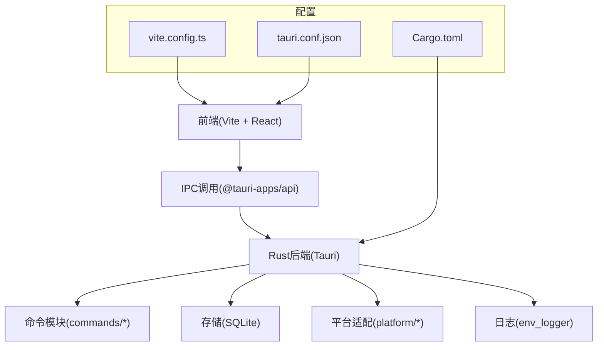
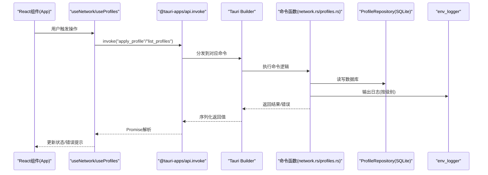
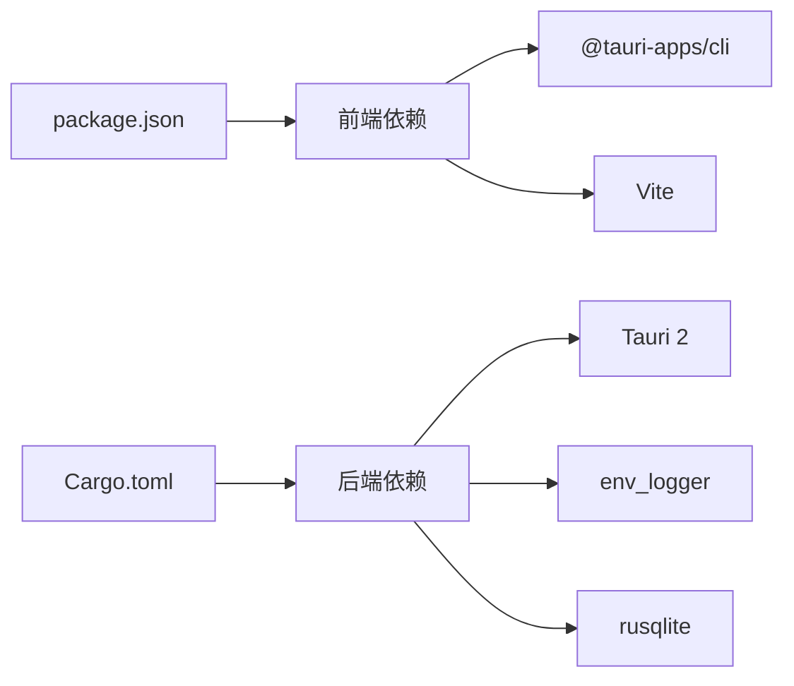

# 调试工具和日志分析

<cite>
**本文档引用的文件**
- [src-tauri/Cargo.toml](file://src-tauri/Cargo.toml)
- [src-tauri/tauri.conf.json](file://src-tauri/tauri.conf.json)
- [package.json](file://package.json)
- [vite.config.ts](file://vite.config.ts)
- [src-tauri/src/main.rs](file://src-tauri/src/main.rs)
- [src-tauri/src/lib.rs](file://src-tauri/src/lib.rs)
- [src-tauri/src/error.rs](file://src-tauri/src/error.rs)
- [src-tauri/src/commands/network.rs](file://src-tauri/src/commands/network.rs)
- [src-tauri/src/storage/sqlite.rs](file://src-tauri/src/storage/sqlite.rs)
- [src-tauri/capabilities/default.json](file://src-tauri/capabilities/default.json)
- [src/App.tsx](file://src/App.tsx)
- [src/hooks/useNetwork.ts](file://src/hooks/useNetwork.ts)
- [src/hooks/useProfiles.ts](file://src/hooks/useProfiles.ts)
</cite>

## 目录
1. [简介](#简介)
2. [项目结构](#项目结构)
3. [核心组件](#核心组件)
4. [架构总览](#架构总览)
5. [详细组件分析](#详细组件分析)
6. [依赖关系分析](#依赖关系分析)
7. [性能考虑](#性能考虑)
8. [故障排除指南](#故障排除指南)
9. [结论](#结论)

## 简介
本指南面向IPSwitcher项目的开发者与维护者，系统性介绍如何在Tauri环境中进行调试与日志分析。内容覆盖：
- 启用Tauri调试模式与Rust日志输出
- 前端控制台调试方法与IPC调用调试
- Cargo调试命令、Vite开发服务器配置与热重载调试技巧
- IPC通信调试、错误堆栈追踪与性能分析工具使用
- 日志级别设置、调试信息收集与问题重现方法

## 项目结构
IPSwitcher采用Tauri 2 + React + Vite的跨平台桌面应用架构。前端通过@tauri-apps/api与后端Rust命令交互，Rust侧通过env_logger输出日志，Vite提供开发时热重载与HMR。

图表来源
- [vite.config.ts:1-25](file://vite.config.ts#L1-L25)
- [src-tauri/tauri.conf.json:1-48](file://src-tauri/tauri.conf.json#L1-L48)
- [src-tauri/Cargo.toml:1-31](file://src-tauri/Cargo.toml#L1-L31)

章节来源
- [vite.config.ts:1-25](file://vite.config.ts#L1-L25)
- [src-tauri/tauri.conf.json:1-48](file://src-tauri/tauri.conf.json#L1-L48)
- [src-tauri/Cargo.toml:1-31](file://src-tauri/Cargo.toml#L1-L31)

## 核心组件
- Tauri应用入口与运行时：Rust侧通过lib.rs初始化env_logger并在Builder中注册命令与托盘事件。
- 命令层：提供网络接口查询、当前网络配置获取、应用配置方案等命令。
- 存储层：基于SQLite的ProfileRepository，负责配置持久化。
- 前端Hook：useNetwork与useProfiles封装IPC调用，统一处理加载状态、错误与刷新逻辑。
- 开发配置：Vite配置支持HMR与严格端口，Tauri配置定义开发URL与构建流程。

章节来源
- [src-tauri/src/lib.rs:14-50](file://src-tauri/src/lib.rs#L14-L50)
- [src-tauri/src/commands/network.rs:1-100](file://src-tauri/src/commands/network.rs#L1-L100)
- [src-tauri/src/storage/sqlite.rs:1-41](file://src-tauri/src/storage/sqlite.rs#L1-L41)
- [src/hooks/useNetwork.ts:1-99](file://src/hooks/useNetwork.ts#L1-L99)
- [src/hooks/useProfiles.ts:1-117](file://src/hooks/useProfiles.ts#L1-L117)

## 架构总览
下图展示从React前端发起IPC调用到Rust命令执行与日志输出的关键路径。

图表来源
- [src-tauri/src/lib.rs:37-47](file://src-tauri/src/lib.rs#L37-L47)
- [src-tauri/src/commands/network.rs:28-95](file://src-tauri/src/commands/network.rs#L28-L95)
- [src-tauri/src/storage/sqlite.rs:12-27](file://src-tauri/src/storage/sqlite.rs#L12-L27)
- [src/hooks/useNetwork.ts:49-69](file://src/hooks/useNetwork.ts#L49-L69)
- [src/hooks/useProfiles.ts:10-53](file://src/hooks/useProfiles.ts#L10-L53)

## 详细组件分析

### Rust日志与调试模式
- 日志初始化：应用启动时初始化env_logger，可在终端查看日志输出。
- 调试断言：Windows发布版本隐藏额外控制台窗口，调试构建保持可见以便日志输出。
- 日志级别：可通过环境变量设置RUST_LOG以调整日志级别（如trace/debug/info/warn/error）。

章节来源
- [src-tauri/src/lib.rs:15-15](file://src-tauri/src/lib.rs#L15-L15)
- [src-tauri/src/main.rs:1-7](file://src-tauri/src/main.rs#L1-L7)

### 前端IPC调试与控制台
- IPC调用：前端通过@tauri-apps/api的invoke与listen监听事件，统一处理错误与状态更新。
- 错误处理：捕获异常并记录到console.error，同时在状态中保存错误信息供UI反馈。
- 事件监听：App组件监听托盘事件，实现跨界面联动。

章节来源
- [src/hooks/useNetwork.ts:13-69](file://src/hooks/useNetwork.ts#L13-L69)
- [src/hooks/useProfiles.ts:10-101](file://src/hooks/useProfiles.ts#L10-L101)
- [src/App.tsx:86-143](file://src/App.tsx#L86-L143)

### 命令层调试要点
- apply_profile：根据方案类型(DHCP/手动)调用平台管理器应用配置；若无管理员权限则触发提权流程。
- get_current_network_config：选择活动或首个接口，获取当前网络配置。
- check_admin_status：检查当前是否具有管理员权限。

章节来源
- [src-tauri/src/commands/network.rs:9-95](file://src-tauri/src/commands/network.rs#L9-L95)

### 存储层调试要点
- ProfileRepository：初始化数据库连接、创建目录、执行迁移；不同平台下数据库路径不同。
- 数据库错误：通过AppError统一包装，便于前端识别与展示。

章节来源
- [src-tauri/src/storage/sqlite.rs:12-41](file://src-tauri/src/storage/sqlite.rs#L12-L41)
- [src-tauri/src/error.rs:1-38](file://src-tauri/src/error.rs#L1-L38)

### 开发服务器与热重载调试
- Vite配置：固定端口1420，strictPort避免端口冲突；当设置TAURI_DEV_HOST时启用HMR并指定WebSocket主机与端口。
- 忽略监听：排除src-tauri目录，防止Rust源码变更触发前端重建。
- Tauri开发URL：devUrl指向http://localhost:1420，与Vite端口一致。

章节来源
- [vite.config.ts:6-24](file://vite.config.ts#L6-L24)
- [src-tauri/tauri.conf.json:8-8](file://src-tauri/tauri.conf.json#L8-L8)

### 权限与能力配置
- 能力文件：default.json声明默认能力，包含shell与opener插件权限，确保网络与文件操作可用。
- 插件集成：Rust侧注册shell与opener插件，前端可安全调用相应功能。

章节来源
- [src-tauri/capabilities/default.json:1-12](file://src-tauri/capabilities/default.json#L1-L12)
- [src-tauri/src/lib.rs:20-21](file://src-tauri/src/lib.rs#L20-L21)

## 依赖关系分析
- 前端依赖：React、@tauri-apps/api、@tauri-apps/cli、Vite、TypeScript。
- 后端依赖：Tauri 2、env_logger、rusqlite、serde、thiserror等。
- 开发工具：Vite HMR、Tauri CLI、Cargo。

图表来源
- [package.json:12-26](file://package.json#L12-L26)
- [src-tauri/Cargo.toml:12-24](file://src-tauri/Cargo.toml#L12-L24)

章节来源
- [package.json:1-27](file://package.json#L1-L27)
- [src-tauri/Cargo.toml:1-31](file://src-tauri/Cargo.toml#L1-L31)

## 性能考虑
- 自动刷新策略：前端每30秒轮询当前网络配置，避免频繁刷新造成资源浪费。
- HMR优化：仅在需要时启用HMR，避免不必要的WebSocket连接与资源消耗。
- 数据库访问：SQLite操作建议批量或去抖，减少I/O压力。
- 日志级别：生产环境建议降低日志级别，避免高频日志影响性能。

章节来源
- [src/hooks/useNetwork.ts:77-86](file://src/hooks/useNetwork.ts#L77-L86)
- [vite.config.ts:13-19](file://vite.config.ts#L13-L19)

## 故障排除指南

### 启用调试模式与查看Rust日志
- 设置日志级别：在终端设置环境变量以提升日志详细度。
- Windows发布版：默认隐藏控制台窗口，调试构建会显示控制台便于观察日志。

章节来源
- [src-tauri/src/lib.rs:15-15](file://src-tauri/src/lib.rs#L15-L15)
- [src-tauri/src/main.rs:1-2](file://src-tauri/src/main.rs#L1-L2)

### 前端控制台调试方法
- 捕获错误：在useNetwork与useProfiles中对invoke调用进行try/catch，并记录console.error。
- 状态反馈：将错误字符串保存到状态，用于UI提示。
- 事件监听：确认托盘事件监听是否正确注册与注销。

章节来源
- [src/hooks/useNetwork.ts:13-69](file://src/hooks/useNetwork.ts#L13-L69)
- [src/hooks/useProfiles.ts:10-101](file://src/hooks/useProfiles.ts#L10-L101)
- [src/App.tsx:115-143](file://src/App.tsx#L115-L143)

### IPC通信调试步骤
- 确认命令注册：检查lib.rs中的invoke_handler是否包含目标命令。
- 参数传递：确保前端传参命名与后端期望一致（如ipMode/ipAddress等）。
- 结果处理：后端返回值需可序列化，错误通过AppError统一包装。

章节来源
- [src-tauri/src/lib.rs:37-47](file://src-tauri/src/lib.rs#L37-L47)
- [src-tauri/src/error.rs:30-37](file://src-tauri/src/error.rs#L30-L37)
- [src/hooks/useProfiles.ts:35-43](file://src/hooks/useProfiles.ts#L35-L43)

### 错误堆栈追踪与问题重现
- 统一错误模型：AppError提供多种错误类型，前端可据此区分与提示。
- 提权流程：apply_profile在无管理员权限时触发提权，需确保平台适配正确。
- 数据库路径：不同平台下数据库路径不同，需确认路径存在且有写权限。

章节来源
- [src-tauri/src/error.rs:3-28](file://src-tauri/src/error.rs#L3-L28)
- [src-tauri/src/commands/network.rs:53-94](file://src-tauri/src/commands/network.rs#L53-L94)
- [src-tauri/src/storage/sqlite.rs:29-41](file://src-tauri/src/storage/sqlite.rs#L29-L41)

### Cargo调试命令与Vite开发配置
- Cargo调试：使用标准cargo run/cargo test等命令进行Rust侧调试。
- Vite开发：npm run dev启动开发服务器，端口1420；如需远程HMR，设置TAURI_DEV_HOST并启用HMR。
- 构建与预览：npm run build与npm run preview验证打包效果。

章节来源
- [package.json:6-11](file://package.json#L6-L11)
- [vite.config.ts:6-24](file://vite.config.ts#L6-L24)
- [src-tauri/tauri.conf.json:8-10](file://src-tauri/tauri.conf.json#L8-L10)

### 性能分析工具使用建议
- 前端性能：结合浏览器开发者工具的时间线与内存面板定位渲染与事件处理瓶颈。
- 后端性能：在Rust侧添加关键路径的日志或计时，评估命令执行耗时。
- I/O分析：关注SQLite读写频率与批量操作，避免频繁小事务。

[本节为通用指导，无需特定文件引用]

## 结论
通过本文档提供的调试与日志分析方法，开发者可以快速定位IPSwitcher在IPC通信、Rust命令执行与前端状态管理中的问题。建议在开发阶段保持较高日志级别，在生产阶段合理降级日志以平衡可观测性与性能。配合Vite的HMR与Tauri的开发配置，可显著提升迭代效率与问题复现成功率。