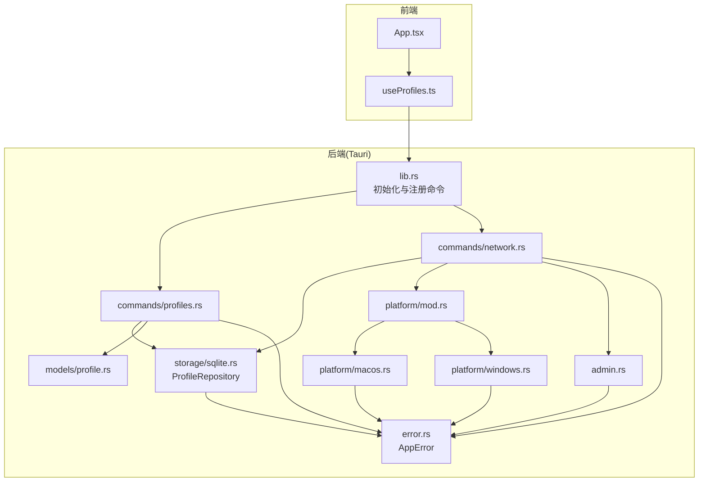
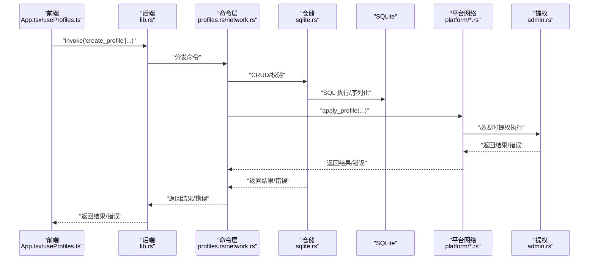
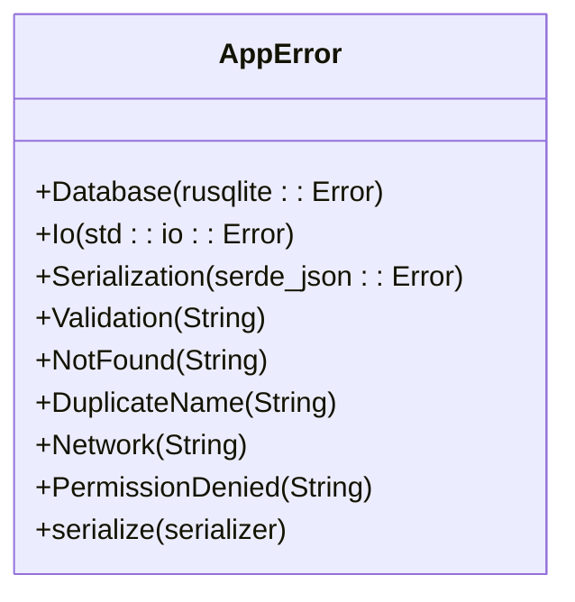
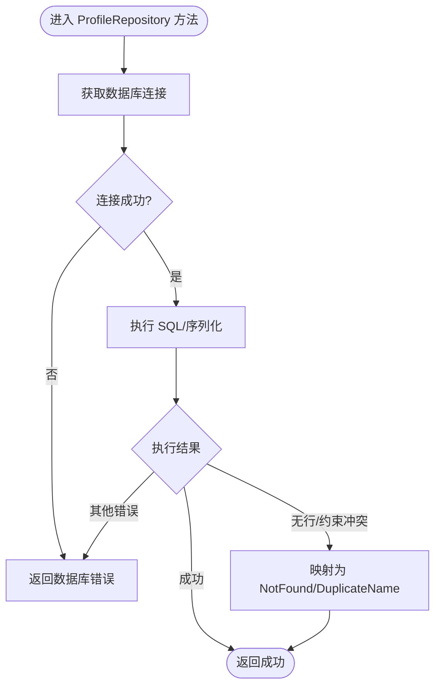
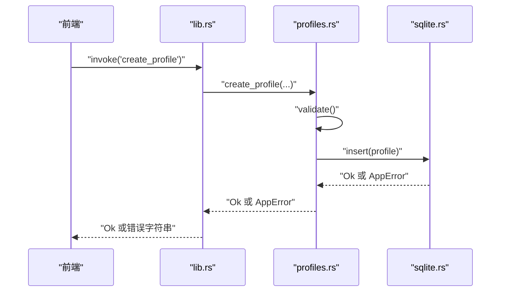
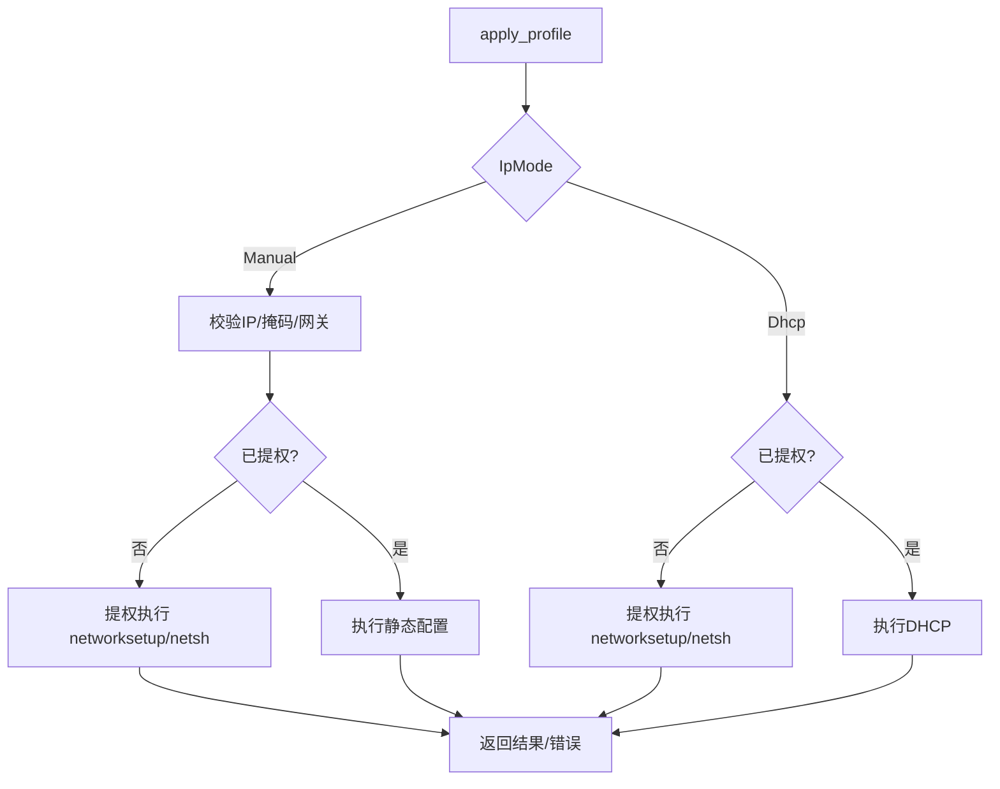

# 运行时错误

<cite>
**本文引用的文件**
- [src-tauri/src/error.rs](file://src-tauri/src/error.rs)
- [src-tauri/src/lib.rs](file://src-tauri/src/lib.rs)
- [src-tauri/src/main.rs](file://src-tauri/src/main.rs)
- [src-tauri/src/storage/sqlite.rs](file://src-tauri/src/storage/sqlite.rs)
- [src-tauri/src/commands/profiles.rs](file://src-tauri/src/commands/profiles.rs)
- [src-tauri/src/commands/network.rs](file://src-tauri/src/commands/network.rs)
- [src-tauri/src/platform/mod.rs](file://src-tauri/src/platform/mod.rs)
- [src-tauri/src/platform/macos.rs](file://src-tauri/src/platform/macos.rs)
- [src-tauri/src/platform/windows.rs](file://src-tauri/src/platform/windows.rs)
- [src-tauri/src/admin.rs](file://src-tauri/src/admin.rs)
- [src-tauri/src/models/profile.rs](file://src-tauri/src/models/profile.rs)
- [src-tauri/Cargo.toml](file://src-tauri/Cargo.toml)
- [src/App.tsx](file://src/App.tsx)
- [src/hooks/useProfiles.ts](file://src/hooks/useProfiles.ts)
</cite>

## 目录
1. [简介](#简介)
2. [项目结构](#项目结构)
3. [核心组件](#核心组件)
4. [架构总览](#架构总览)
5. [详细组件分析](#详细组件分析)
6. [依赖关系分析](#依赖关系分析)
7. [性能考量](#性能考量)
8. [故障排除指南](#故障排除指南)
9. [结论](#结论)
10. [附录](#附录)

## 简介
本指南聚焦于 IPSwitcher 的运行时错误处理与故障排除，围绕后端 Rust 模块定义的 AppError 枚举，系统性梳理数据库错误、IO 错误、序列化错误、验证错误、网络操作失败、权限不足、方案不存在与重复名等错误类型，并结合 IPC 命令调用链路（Tauri invoke）与平台特定网络管理实现，提供错误代码对照、日志分析、堆栈解读与问题定位技巧，帮助快速定位并修复应用启动失败、命令执行错误、IPC 通信异常等问题。

## 项目结构
后端采用 Tauri 2 + Rust，错误模型集中于 error.rs；数据库访问通过 SQLite 仓储类 ProfileRepository；命令层封装在 commands/* 中；平台网络能力通过 platform/* 抽象；前端通过 @tauri-apps/api 调用后端命令并展示错误信息。

图表来源
- [src-tauri/src/lib.rs:14-49](file://src-tauri/src/lib.rs#L14-L49)
- [src-tauri/src/commands/profiles.rs:1-113](file://src-tauri/src/commands/profiles.rs#L1-L113)
- [src-tauri/src/commands/network.rs:1-101](file://src-tauri/src/commands/network.rs#L1-L101)
- [src-tauri/src/storage/sqlite.rs:1-256](file://src-tauri/src/storage/sqlite.rs#L1-L256)
- [src-tauri/src/error.rs:1-38](file://src-tauri/src/error.rs#L1-L38)
- [src-tauri/src/platform/mod.rs:1-64](file://src-tauri/src/platform/mod.rs#L1-L64)
- [src-tauri/src/platform/macos.rs:1-175](file://src-tauri/src/platform/macos.rs#L1-L175)
- [src-tauri/src/platform/windows.rs:1-173](file://src-tauri/src/platform/windows.rs#L1-L173)
- [src-tauri/src/admin.rs:1-165](file://src-tauri/src/admin.rs#L1-L165)
- [src-tauri/src/models/profile.rs:1-88](file://src-tauri/src/models/profile.rs#L1-L88)
- [src/App.tsx:1-195](file://src/App.tsx#L1-L195)
- [src/hooks/useProfiles.ts:1-117](file://src/hooks/useProfiles.ts#L1-L117)

章节来源
- [src-tauri/src/lib.rs:14-49](file://src-tauri/src/lib.rs#L14-L49)
- [src-tauri/src/main.rs:4-6](file://src-tauri/src/main.rs#L4-L6)

## 核心组件
- AppError：统一错误模型，覆盖数据库、IO、序列化、验证、方案不存在/重复名、网络、权限等错误类别，并实现可序列化，便于跨 IPC 传递。
- ProfileRepository：封装 SQLite 初始化、迁移、CRUD 与约束冲突处理（重复名），并进行 JSON 序列化/反序列化。
- 命令层：profiles.rs 与 network.rs 将前端请求映射为业务操作，包含参数校验与错误转换。
- 平台网络管理：platform/mod.rs 定义 NetworkManager trait，macOS/windows 实现分别调用系统命令（networksetup/netsh）。
- 提权与权限检查：admin.rs 在 macOS 使用 osascript，在 Windows 使用 PowerShell 提权执行网络命令。
- 前端集成：App.tsx 展示错误，useProfiles.ts 通过 invoke 调用后端命令并捕获错误。

章节来源
- [src-tauri/src/error.rs:3-38](file://src-tauri/src/error.rs#L3-L38)
- [src-tauri/src/storage/sqlite.rs:12-256](file://src-tauri/src/storage/sqlite.rs#L12-L256)
- [src-tauri/src/commands/profiles.rs:9-113](file://src-tauri/src/commands/profiles.rs#L9-L113)
- [src-tauri/src/commands/network.rs:9-101](file://src-tauri/src/commands/network.rs#L9-L101)
- [src-tauri/src/platform/mod.rs:12-64](file://src-tauri/src/platform/mod.rs#L12-L64)
- [src-tauri/src/admin.rs:3-165](file://src-tauri/src/admin.rs#L3-L165)
- [src/App.tsx:182-187](file://src/App.tsx#L182-L187)
- [src/hooks/useProfiles.ts:10-101](file://src/hooks/useProfiles.ts#L10-L101)

## 架构总览
以下序列图展示从前端到后端命令、仓储与平台网络管理的关键调用路径，以及错误如何在各层传播。

图表来源
- [src-tauri/src/lib.rs:36-46](file://src-tauri/src/lib.rs#L36-L46)
- [src-tauri/src/commands/profiles.rs:24-61](file://src-tauri/src/commands/profiles.rs#L24-L61)
- [src-tauri/src/commands/network.rs:28-95](file://src-tauri/src/commands/network.rs#L28-L95)
- [src-tauri/src/storage/sqlite.rs:146-221](file://src-tauri/src/storage/sqlite.rs#L146-L221)
- [src-tauri/src/platform/macos.rs:112-151](file://src-tauri/src/platform/macos.rs#L112-L151)
- [src-tauri/src/platform/windows.rs:88-144](file://src-tauri/src/platform/windows.rs#L88-L144)
- [src-tauri/src/admin.rs:26-49](file://src-tauri/src/admin.rs#L26-L49)

## 详细组件分析

### AppError 错误模型与分类
AppError 作为统一错误源，向上游提供一致的错误语义，便于前端展示与日志记录。

图表来源
- [src-tauri/src/error.rs:3-38](file://src-tauri/src/error.rs#L3-L38)

章节来源
- [src-tauri/src/error.rs:3-38](file://src-tauri/src/error.rs#L3-L38)

### ProfileRepository 数据访问与错误映射
- 初始化与迁移：创建目录、打开连接、执行建表迁移。
- CRUD 操作：列表、按 ID 查询、插入、更新、删除。
- 错误映射：
  - 数据库锁/环境变量缺失 → 数据库错误
  - 查询无结果 → 方案不存在
  - 约束冲突（唯一索引）→ 重复名
  - 其他 SQLite 错误 → 数据库错误
  - JSON 序列化/反序列化错误 → 序列化错误

图表来源
- [src-tauri/src/storage/sqlite.rs:12-256](file://src-tauri/src/storage/sqlite.rs#L12-L256)

章节来源
- [src-tauri/src/storage/sqlite.rs:12-256](file://src-tauri/src/storage/sqlite.rs#L12-L256)

### 命令层：profiles.rs 与 network.rs
- profiles.rs：
  - 参数解析与构造 Profile
  - validate → AppError::Validation
  - 调用仓储插入/更新/删除
- network.rs：
  - 获取当前网络配置
  - 应用方案：根据 IpMode 切换静态或 DHCP
  - 权限检查与提权执行
  - 返回人类可读消息

图表来源
- [src-tauri/src/commands/profiles.rs:24-61](file://src-tauri/src/commands/profiles.rs#L24-L61)
- [src-tauri/src/storage/sqlite.rs:146-182](file://src-tauri/src/storage/sqlite.rs#L146-L182)

章节来源
- [src-tauri/src/commands/profiles.rs:9-113](file://src-tauri/src/commands/profiles.rs#L9-L113)
- [src-tauri/src/commands/network.rs:9-101](file://src-tauri/src/commands/network.rs#L9-L101)

### 平台网络管理：macOS 与 Windows
- macOS：
  - 使用 networksetup 列表、查询、设置静态/DHCP、DNS
  - 失败时返回 Network 错误
- Windows：
  - 使用 netsh 列表、查询、设置静态/DHCP、DNS
  - 失败时返回 Network 错误
- 提权：
  - macOS：osascript 弹窗授权
  - Windows：PowerShell Start-Process -Verb RunAs

图表来源
- [src-tauri/src/commands/network.rs:28-95](file://src-tauri/src/commands/network.rs#L28-L95)
- [src-tauri/src/platform/macos.rs:112-151](file://src-tauri/src/platform/macos.rs#L112-L151)
- [src-tauri/src/platform/windows.rs:88-144](file://src-tauri/src/platform/windows.rs#L88-L144)
- [src-tauri/src/admin.rs:26-165](file://src-tauri/src/admin.rs#L26-L165)

章节来源
- [src-tauri/src/platform/mod.rs:12-64](file://src-tauri/src/platform/mod.rs#L12-L64)
- [src-tauri/src/platform/macos.rs:8-175](file://src-tauri/src/platform/macos.rs#L8-L175)
- [src-tauri/src/platform/windows.rs:8-173](file://src-tauri/src/platform/windows.rs#L8-L173)
- [src-tauri/src/admin.rs:3-165](file://src-tauri/src/admin.rs#L3-L165)

### 前端错误展示与 IPC 调用
- App.tsx：当存在 profileError 或 networkError 时显示错误提示。
- useProfiles.ts：invoke 调用后端命令，捕获错误字符串并设置状态，同时抛出异常供上层处理。

章节来源
- [src/App.tsx:182-187](file://src/App.tsx#L182-L187)
- [src/hooks/useProfiles.ts:10-101](file://src/hooks/useProfiles.ts#L10-L101)

## 依赖关系分析
- 依赖版本与特性：
  - tauri、tauri-plugin-shell、tauri-plugin-opener：IPC 与系统集成
  - rusqlite(bundled)：嵌入式 SQLite
  - serde/serde_json：序列化/反序列化
  - log/env_logger：日志
  - thiserror：错误派生
  - regex：正则（未在错误路径直接使用）
- 关键耦合点：
  - 命令层依赖仓储与平台抽象
  - 仓储依赖 SQLite 与 JSON
  - 网络命令依赖平台实现与提权模块

章节来源
- [src-tauri/Cargo.toml:12-31](file://src-tauri/Cargo.toml#L12-L31)

## 性能考量
- 数据库连接：使用 Mutex 包裹 Connection，避免并发竞争；建议在高频调用场景下评估连接池策略。
- 序列化成本：Profile 的 DNS 字段以 JSON 存储，查询时反序列化；可考虑在仓储层缓存常用字段或延迟解析。
- 平台命令调用：每次网络操作均触发外部进程，建议减少不必要的重复调用，合并配置变更。
- 日志：env_logger 已启用，生产环境建议调整级别并输出到文件以便排查。

[本节为通用建议，无需具体文件引用]

## 故障排除指南

### 一、错误类型与代码对照表
以下对照表基于 AppError 的定义与各模块的错误映射，便于快速定位问题来源与修复方向。

- 数据库错误（Database）
  - 触发点：数据库连接、事务、锁、环境变量缺失、迁移失败
  - 典型症状：应用启动即崩溃、仓储操作失败
  - 解决方案：检查 HOME/APPDATA 环境变量、数据库文件权限、磁盘空间

- IO 错误（Io）
  - 触发点：文件系统操作（创建目录、读写）
  - 典型症状：首次启动失败、数据库目录创建失败
  - 解决方案：确保应用有写权限、磁盘空间充足、路径合法

- 序列化错误（Serialization）
  - 触发点：JSON 编解码（DNS 字段）
  - 典型症状：读取/保存配置时报错
  - 解决方案：检查数据格式一致性、避免手动篡改数据库

- 验证错误（Validation）
  - 触发点：Profile.validate 校验失败
  - 典型症状：创建/更新方案时报“必填项/格式错误”
  - 解决方案：补齐 Manual 模式的 IP/掩码/网关与至少一个 DNS；DHCP 模式不要带静态参数

- 方案不存在（NotFound）
  - 触发点：按 ID 查询无结果
  - 典型症状：应用方案报“未找到”
  - 解决方案：确认 ID 正确、方案是否存在

- 方案名称重复（DuplicateName）
  - 触发点：唯一约束冲突
  - 典型症状：创建/更新时报“名称已存在”
  - 解决方案：修改名称或删除同名方案

- 网络操作失败（Network）
  - 触发点：平台命令执行失败（networksetup/netsh）
  - 典型症状：切换静态/DHCP、设置 DNS 失败
  - 解决方案：以管理员身份运行、检查网络接口名称、确认系统命令可用

- 权限不足（PermissionDenied）
  - 触发点：提权弹窗被用户取消
  - 典型症状：弹窗后立即失败
  - 解决方案：允许提权弹窗、重新尝试

章节来源
- [src-tauri/src/error.rs:3-28](file://src-tauri/src/error.rs#L3-L28)
- [src-tauri/src/storage/sqlite.rs:146-232](file://src-tauri/src/storage/sqlite.rs#L146-L232)
- [src-tauri/src/commands/profiles.rs:54-60](file://src-tauri/src/commands/profiles.rs#L54-L60)
- [src-tauri/src/commands/network.rs:42-94](file://src-tauri/src/commands/network.rs#L42-L94)
- [src-tauri/src/platform/macos.rs:16-20](file://src-tauri/src/platform/macos.rs#L16-L20)
- [src-tauri/src/platform/windows.rs:10-13](file://src-tauri/src/platform/windows.rs#L10-L13)
- [src-tauri/src/admin.rs:93-98](file://src-tauri/src/admin.rs#L93-L98)

### 二、常见问题诊断与修复

#### 1) 应用启动失败
- 症状：启动即崩溃或初始化失败
- 可能原因：
  - 数据库初始化失败（环境变量缺失、权限不足）
  - 日志未输出或级别过低
- 诊断步骤：
  - 查看控制台日志（env_logger 已初始化）
  - 检查 HOME/APPDATA 是否设置正确
  - 检查数据库文件所在目录权限
- 修复建议：
  - 以管理员身份运行，确保写权限
  - 清理旧数据库文件后重试

章节来源
- [src-tauri/src/lib.rs:14-18](file://src-tauri/src/lib.rs#L14-L18)
- [src-tauri/src/storage/sqlite.rs:13-27](file://src-tauri/src/storage/sqlite.rs#L13-L27)

#### 2) 命令执行错误（创建/更新/删除方案）
- 症状：前端提示错误
- 可能原因：
  - 参数校验失败（Validation）
  - 名称冲突（DuplicateName）
  - 未找到目标（NotFound）
  - 数据库错误（IO/Database）
- 诊断步骤：
  - 前端捕获错误字符串并展示
  - 后端日志查看具体错误类型
- 修复建议：
  - 补齐必填项，修正格式
  - 修改名称避免重复
  - 确认 ID 存在

章节来源
- [src-tauri/src/commands/profiles.rs:54-60](file://src-tauri/src/commands/profiles.rs#L54-L60)
- [src-tauri/src/storage/sqlite.rs:173-182](file://src-tauri/src/storage/sqlite.rs#L173-L182)

#### 3) IPC 通信异常
- 症状：前端调用后端命令无响应或报错
- 可能原因：
  - 命令未注册或签名不匹配
  - 前端 invoke 参数命名不一致
- 诊断步骤：
  - 检查 lib.rs 中 invoke_handler 注册的命令列表
  - 对比前端调用的命令名与参数键名
- 修复建议：
  - 保持前后端命令名与参数键一致
  - 确保命令在构建阶段正确注册

章节来源
- [src-tauri/src/lib.rs:36-46](file://src-tauri/src/lib.rs#L36-L46)
- [src/hooks/useProfiles.ts:14-51](file://src/hooks/useProfiles.ts#L14-L51)

#### 4) 网络切换失败（静态/DHCP）
- 症状：切换失败或提示权限不足
- 可能原因：
  - 未提权或用户取消授权
  - 接口名称错误
  - 系统命令不可用
- 诊断步骤：
  - 检查权限状态命令返回值
  - 确认接口列表与名称
  - 查看平台命令输出与错误信息
- 修复建议：
  - 允许提权弹窗并重试
  - 使用正确的接口名称
  - 确保系统命令可用且具备相应权限

章节来源
- [src-tauri/src/commands/network.rs:28-95](file://src-tauri/src/commands/network.rs#L28-L95)
- [src-tauri/src/admin.rs:26-49](file://src-tauri/src/admin.rs#L26-L49)
- [src-tauri/src/platform/macos.rs:10-20](file://src-tauri/src/platform/macos.rs#L10-L20)
- [src-tauri/src/platform/windows.rs:10-13](file://src-tauri/src/platform/windows.rs#L10-L13)

### 三、错误日志分析与堆栈解读
- 日志初始化：后端已初始化 env_logger，可在控制台查看日志。
- 日志级别：建议在开发环境使用 debug/info，在生产环境使用 warn/error 并落盘。
- 堆栈解读要点：
  - 若为 Database/Serialization/Validation，优先检查仓储与模型层
  - 若为 Network/PermissionDenied，优先检查平台命令与提权流程
  - 若为 NotFound/DuplicateName，优先检查 ID 与唯一约束

章节来源
- [src-tauri/src/lib.rs:15-15](file://src-tauri/src/lib.rs#L15-L15)
- [src-tauri/src/storage/sqlite.rs:146-232](file://src-tauri/src/storage/sqlite.rs#L146-L232)
- [src-tauri/src/admin.rs:77-99](file://src-tauri/src/admin.rs#L77-L99)

### 四、问题定位技巧
- 分层定位：从前端 invoke → 命令层 → 仓储/平台 → 外部命令，逐层缩小范围
- 参数核对：确保命令名、参数键名、参数值与后端实现一致
- 环境核对：确认操作系统、网络接口、权限状态、系统命令可用性
- 最小复现：构造最小输入（如仅创建/应用一个方案）以隔离问题

[本节为通用技巧，无需具体文件引用]

## 结论
通过统一的 AppError 错误模型与清晰的分层架构，IPSwitcher 能够在启动、命令执行与 IPC 通信等关键路径上提供一致的错误语义与可诊断性。建议在生产环境中完善日志策略、优化数据库与序列化性能，并加强前端错误提示与用户引导，以进一步提升稳定性与用户体验。

[本节为总结，无需具体文件引用]

## 附录

### A. 命令与错误映射速查
- 创建方案：参数校验失败 → Validation；名称冲突 → DuplicateName；其他 → Database/IO
- 更新方案：参数校验失败 → Validation；未找到 → NotFound；其他 → Database
- 删除方案：未找到 → NotFound；其他 → Database
- 应用方案：接口/参数校验失败 → Validation；权限不足 → PermissionDenied；命令失败 → Network

章节来源
- [src-tauri/src/commands/profiles.rs:54-104](file://src-tauri/src/commands/profiles.rs#L54-L104)
- [src-tauri/src/commands/network.rs:34-94](file://src-tauri/src/commands/network.rs#L34-L94)
- [src-tauri/src/storage/sqlite.rs:146-232](file://src-tauri/src/storage/sqlite.rs#L146-L232)

### B. 前端错误展示位置
- App.tsx：在欢迎页下方展示 profileError 或 networkError
- useProfiles.ts：invoke 捕获错误并设置状态，同时抛出异常

章节来源
- [src/App.tsx:182-187](file://src/App.tsx#L182-L187)
- [src/hooks/useProfiles.ts:14-101](file://src/hooks/useProfiles.ts#L14-L101)