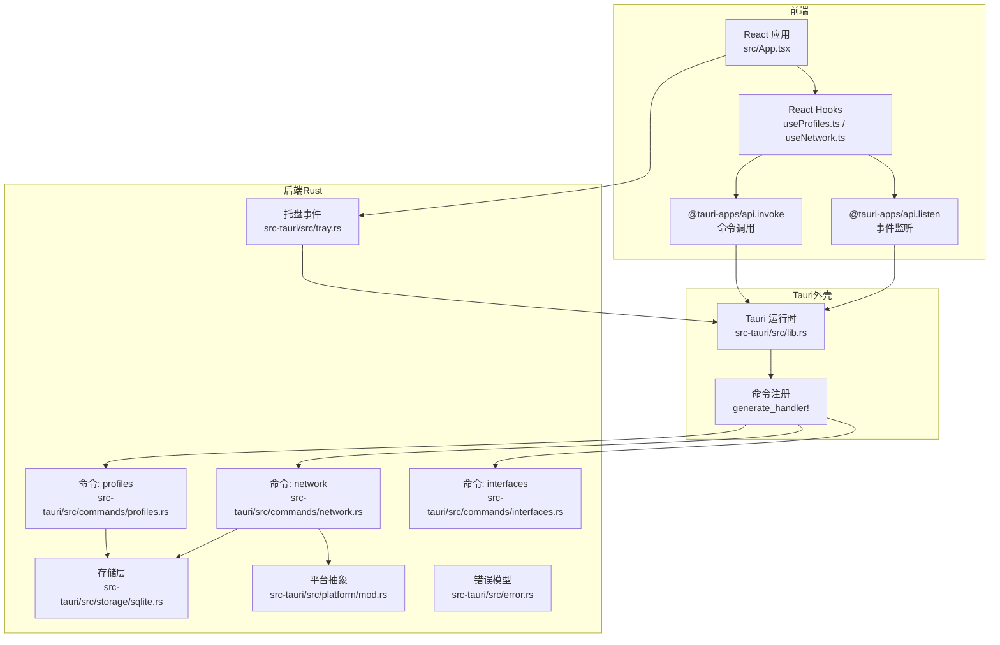
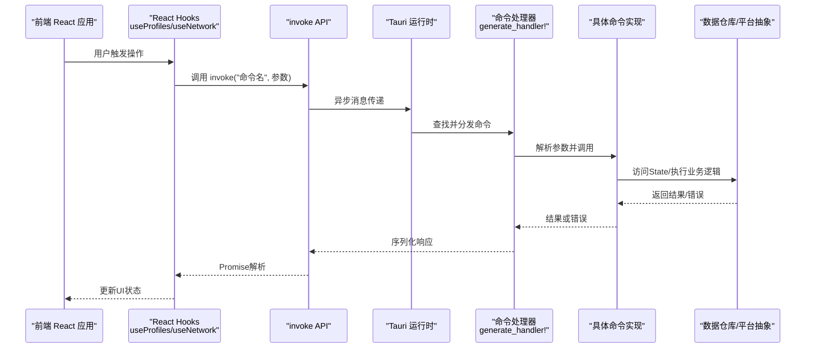
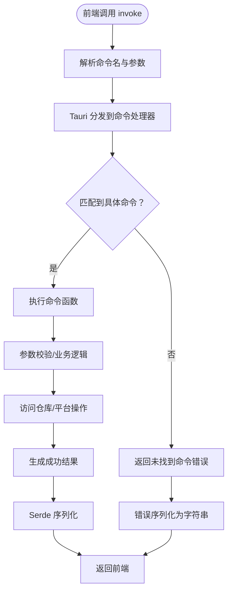
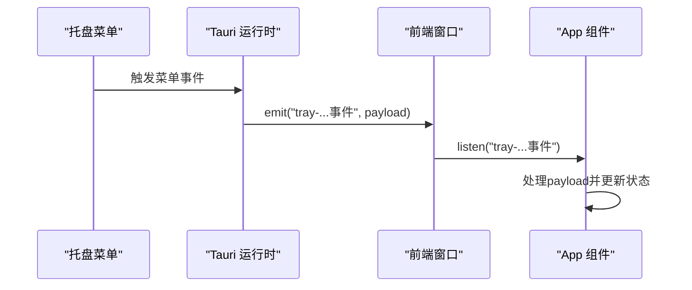
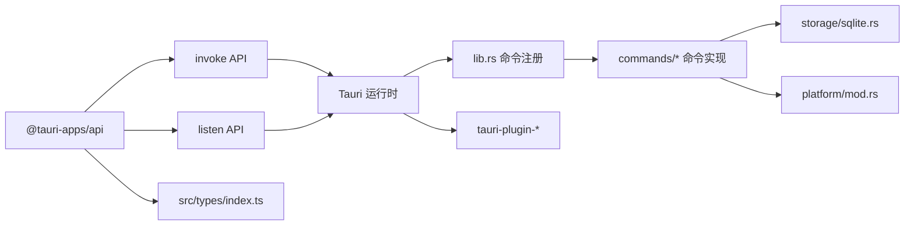

# IPC通信机制

<cite>
**本文档引用的文件**
- [src-tauri/src/lib.rs](file://src-tauri/src/lib.rs)
- [src-tauri/src/main.rs](file://src-tauri/src/main.rs)
- [src-tauri/tauri.conf.json](file://src-tauri/tauri.conf.json)
- [src-tauri/Cargo.toml](file://src-tauri/Cargo.toml)
- [src/App.tsx](file://src/App.tsx)
- [src/hooks/useProfiles.ts](file://src/hooks/useProfiles.ts)
- [src/hooks/useNetwork.ts](file://src/hooks/useNetwork.ts)
- [src-tauri/src/commands/mod.rs](file://src-tauri/src/commands/mod.rs)
- [src-tauri/src/commands/profiles.rs](file://src-tauri/src/commands/profiles.rs)
- [src-tauri/src/commands/interfaces.rs](file://src-tauri/src/commands/interfaces.rs)
- [src-tauri/src/commands/network.rs](file://src-tauri/src/commands/network.rs)
- [src-tauri/src/tray.rs](file://src-tauri/src/tray.rs)
- [src-tauri/src/error.rs](file://src-tauri/src/error.rs)
- [src-tauri/src/platform/mod.rs](file://src-tauri/src/platform/mod.rs)
- [src-tauri/src/storage/sqlite.rs](file://src-tauri/src/storage/sqlite.rs)
- [src/types/index.ts](file://src/types/index.ts)
- [package.json](file://package.json)
</cite>

## 目录
1. [简介](#简介)
2. [项目结构](#项目结构)
3. [核心组件](#核心组件)
4. [架构总览](#架构总览)
5. [详细组件分析](#详细组件分析)
6. [依赖关系分析](#依赖关系分析)
7. [性能考虑](#性能考虑)
8. [故障排查指南](#故障排查指南)
9. [结论](#结论)
10. [附录](#附录)

## 简介
本文件系统性阐述IPSwitcher项目的IPC（进程间通信）机制，重点覆盖：
- 前端React应用与Rust后端通过Tauri的invoke API实现的异步消息传递与响应处理
- Rust侧命令注册机制、参数序列化与返回值处理流程
- 事件监听系统（如托盘事件）的实现原理
- 错误传播机制、超时处理与连接状态管理
- 提供IPC通信流程图与典型调用示例

## 项目结构
IPSwitcher采用Tauri 2.x跨平台桌面框架，前端使用React + TypeScript，后端使用Rust。IPC通信主要通过以下路径实现：
- 前端：通过@tauri-apps/api提供的invoke与listen进行命令调用与事件监听
- 后端：在lib.rs中集中注册命令，并在各命令模块中实现业务逻辑
- 数据与模型：前后端共享类型定义，Rust侧通过Serde进行序列化/反序列化

图表来源
- [src-tauri/src/lib.rs:19-47](file://src-tauri/src/lib.rs#L19-L47)
- [src-tauri/src/commands/mod.rs:1-4](file://src-tauri/src/commands/mod.rs#L1-L4)
- [src-tauri/src/tray.rs:21-98](file://src-tauri/src/tray.rs#L21-L98)
- [src/hooks/useProfiles.ts:10-21](file://src/hooks/useProfiles.ts#L10-L21)
- [src/hooks/useNetwork.ts:13-26](file://src/hooks/useNetwork.ts#L13-L26)

章节来源
- [src-tauri/src/lib.rs:14-50](file://src-tauri/src/lib.rs#L14-L50)
- [src-tauri/src/main.rs:4-7](file://src-tauri/src/main.rs#L4-L7)
- [src-tauri/tauri.conf.json:1-48](file://src-tauri/tauri.conf.json#L1-L48)
- [src-tauri/Cargo.toml:12-24](file://src-tauri/Cargo.toml#L12-L24)
- [package.json:12-25](file://package.json#L12-L25)

## 核心组件
- 命令注册与分发：在lib.rs中通过generate_handler!集中注册所有命令，前端以字符串标识调用对应Rust函数
- invoke API：前端通过@tauri-apps/api/core.invoke发起异步调用，Rust侧命令接收State注入的仓库实例，执行业务逻辑并返回结果
- 事件系统：后端通过Emitter向前端窗口发送事件；前端通过@tauri-apps/api/event.listen订阅事件
- 错误传播：Rust侧统一使用AppError并通过Serde序列化为字符串传递给前端
- 类型一致性：前后端共享类型定义，确保参数与返回值的序列化/反序列化一致

章节来源
- [src-tauri/src/lib.rs:37-47](file://src-tauri/src/lib.rs#L37-L47)
- [src/hooks/useProfiles.ts:14](file://src/hooks/useProfiles.ts#L14)
- [src/hooks/useNetwork.ts:16](file://src/hooks/useNetwork.ts#L16)
- [src-tauri/src/error.rs:30-37](file://src-tauri/src/error.rs#L30-L37)
- [src/types/index.ts:1-30](file://src/types/index.ts#L1-L30)

## 架构总览
下图展示从前端发起命令到后端处理再到返回的完整IPC流程。

图表来源
- [src-tauri/src/lib.rs:37-47](file://src-tauri/src/lib.rs#L37-L47)
- [src/hooks/useProfiles.ts:14](file://src/hooks/useProfiles.ts#L14)
- [src/hooks/useNetwork.ts:16](file://src/hooks/useNetwork.ts#L16)

## 详细组件分析

### 命令注册机制与调用链
- 注册入口：在lib.rs中通过generate_handler!将多个命令函数注册到Tauri运行时
- 调用方式：前端Hooks通过invoke("命令名", 参数对象)发起调用
- 参数映射：invoke会自动将参数对象序列化为JSON并传入Rust侧
- 返回值：Rust命令返回Result<T, AppError>，T由Serde序列化后回传前端

图表来源
- [src-tauri/src/lib.rs:37-47](file://src-tauri/src/lib.rs#L37-L47)
- [src-tauri/src/commands/profiles.rs:9-14](file://src-tauri/src/commands/profiles.rs#L9-L14)
- [src-tauri/src/commands/network.rs:9-26](file://src-tauri/src/commands/network.rs#L9-L26)

章节来源
- [src-tauri/src/lib.rs:37-47](file://src-tauri/src/lib.rs#L37-L47)
- [src/hooks/useProfiles.ts:14](file://src/hooks/useProfiles.ts#L14)
- [src/hooks/useNetwork.ts:16](file://src/hooks/useNetwork.ts#L16)

### 参数序列化与返回值处理
- 参数序列化：前端传入的参数对象经invoke自动序列化为JSON，Rust侧命令函数按参数名接收
- 返回值序列化：命令返回的Result<T, AppError>中，T通过Serde序列化为JSON；错误通过AppError::serialize序列化为字符串
- 类型一致性：前后端共享类型定义，避免字段不一致导致的序列化失败

章节来源
- [src-tauri/src/error.rs:30-37](file://src-tauri/src/error.rs#L30-L37)
- [src/types/index.ts:1-30](file://src/types/index.ts#L1-L30)

### 事件监听系统（托盘事件）
- 后端事件：tray.rs在菜单事件中通过Emitter向主窗口发射自定义事件（如"tray-new-profile"、"tray-switch-profile"）
- 前端监听：App.tsx使用listen订阅这些事件，根据payload执行相应逻辑（如打开新建表单、应用配置）

图表来源
- [src-tauri/src/tray.rs:56-71](file://src-tauri/src/tray.rs#L56-L71)
- [src/App.tsx:116-143](file://src/App.tsx#L116-L143)

章节来源
- [src-tauri/src/tray.rs:21-98](file://src-tauri/src/tray.rs#L21-L98)
- [src/App.tsx:116-143](file://src/App.tsx#L116-L143)

### 典型命令调用示例
- 列出配置方案：前端调用invoke("list_profiles")，Rust侧profiles命令查询仓库并返回数组
- 创建配置方案：前端调用invoke("create_profile", {...})，Rust侧校验并插入，返回新创建的Profile
- 应用配置方案：前端调用invoke("apply_profile", {profileId, interface})，Rust侧根据模式设置静态IP或DHCP

章节来源
- [src/hooks/useProfiles.ts:14](file://src/hooks/useProfiles.ts#L14)
- [src/hooks/useProfiles.ts:35](file://src/hooks/useProfiles.ts#L35)
- [src/hooks/useNetwork.ts:53](file://src/hooks/useNetwork.ts#L53)
- [src-tauri/src/commands/profiles.rs:9-14](file://src-tauri/src/commands/profiles.rs#L9-L14)
- [src-tauri/src/commands/profiles.rs:24-61](file://src-tauri/src/commands/profiles.rs#L24-L61)
- [src-tauri/src/commands/network.rs:29-95](file://src-tauri/src/commands/network.rs#L29-L95)

### 错误传播机制
- Rust侧错误：统一定义为AppError枚举，包含数据库、IO、序列化、验证、网络、权限等错误类型
- 序列化：AppError实现Serde序列化，错误信息被序列化为字符串
- 前端处理：invoke抛出异常，前端Hooks捕获并设置error状态

章节来源
- [src-tauri/src/error.rs:3-28](file://src-tauri/src/error.rs#L3-L28)
- [src-tauri/src/error.rs:30-37](file://src-tauri/src/error.rs#L30-L37)
- [src/hooks/useProfiles.ts:16](file://src/hooks/useProfiles.ts#L16)
- [src/hooks/useNetwork.ts:20](file://src/hooks/useNetwork.ts#L20)

### 超时处理与连接状态管理
- 超时处理：当前代码未显式设置超时时间，建议在生产环境通过Tauri插件或上层封装增加超时控制
- 连接状态：Tauri运行时负责前端与后端的生命周期管理；窗口关闭时通过WindowEvent拦截并隐藏窗口而非退出应用

章节来源
- [src-tauri/src/lib.rs:31-36](file://src-tauri/src/lib.rs#L31-L36)

## 依赖关系分析
- 前端依赖：@tauri-apps/api提供invoke与listen；React Hooks封装状态与副作用
- 后端依赖：tauri、tauri-plugin-shell、tauri-plugin-opener；rusqlite用于SQLite；serde/serde_json用于序列化；thiserror用于错误处理
- 平台抽象：platform/mod.rs定义NetworkManager trait，分别在macOS与Windows实现

图表来源
- [package.json:12-25](file://package.json#L12-L25)
- [src-tauri/Cargo.toml:12-24](file://src-tauri/Cargo.toml#L12-L24)
- [src-tauri/src/lib.rs:19-47](file://src-tauri/src/lib.rs#L19-L47)

章节来源
- [package.json:12-25](file://package.json#L12-L25)
- [src-tauri/Cargo.toml:12-24](file://src-tauri/Cargo.toml#L12-L24)
- [src-tauri/src/platform/mod.rs:12-32](file://src-tauri/src/platform/mod.rs#L12-L32)

## 性能考虑
- 异步调用：invoke为异步API，避免阻塞UI线程
- 自动刷新：useNetwork中对当前网络配置每30秒轮询一次，可根据实际需求调整频率
- 数据库并发：ProfileRepository使用Mutex保护连接，注意避免长时间持有锁

## 故障排查指南
- 前端错误显示：Hooks在try/catch中捕获invoke异常，设置error状态并在UI中提示
- 后端错误定位：检查命令实现中的参数校验与业务逻辑分支，确认错误是否被正确转换为AppError
- 事件未触发：确认后端emit事件的事件名与前端listen订阅的事件名一致，且窗口已正确获取

章节来源
- [src/hooks/useProfiles.ts:16](file://src/hooks/useProfiles.ts#L16)
- [src/hooks/useNetwork.ts:20](file://src/hooks/useNetwork.ts#L20)
- [src-tauri/src/tray.rs:59](file://src-tauri/src/tray.rs#L59)
- [src/App.tsx:118](file://src/App.tsx#L118)

## 结论
IPSwitcher基于Tauri实现了稳定高效的IPC通信机制：前端通过invoke与listen与后端交互，后端通过generate_handler!集中注册命令并统一错误处理。该设计保证了跨平台兼容性与良好的开发体验。建议后续引入超时控制与更细粒度的错误分类，以进一步提升健壮性与可观测性。

## 附录
- 命令清单（前端调用名与后端实现对应关系）
  - list_profiles → commands/profiles.rs
  - get_profile → commands/profiles.rs
  - create_profile → commands/profiles.rs
  - update_profile → commands/profiles.rs
  - delete_profile → commands/profiles.rs
  - list_network_interfaces → commands/interfaces.rs
  - get_current_network_config → commands/network.rs
  - apply_profile → commands/network.rs
  - check_admin_status → commands/network.rs

章节来源
- [src-tauri/src/lib.rs:37-47](file://src-tauri/src/lib.rs#L37-L47)
- [src-tauri/src/commands/mod.rs:1-4](file://src-tauri/src/commands/mod.rs#L1-L4)