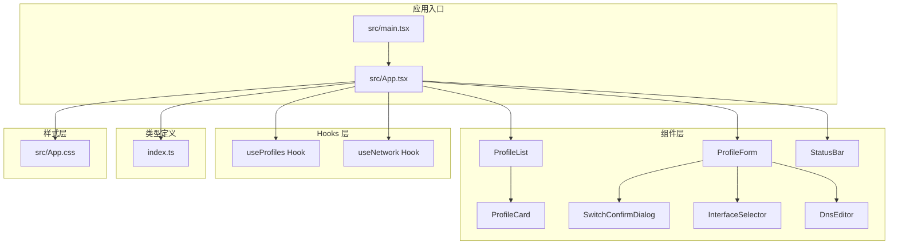
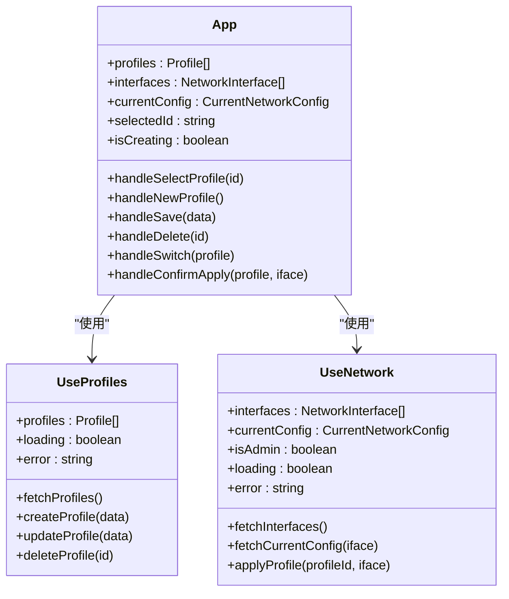
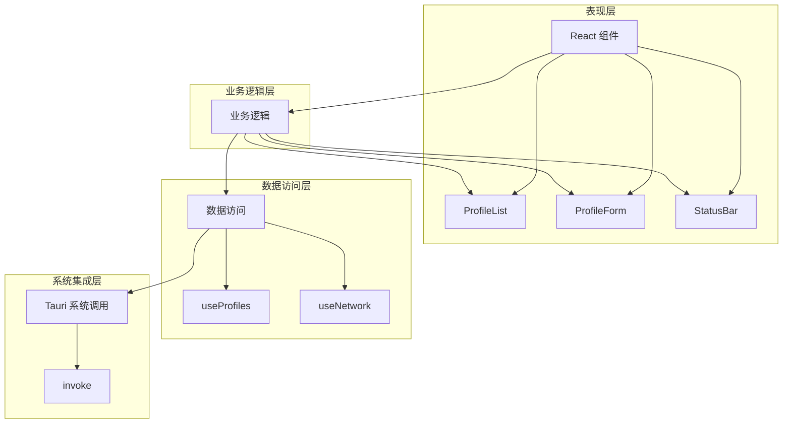
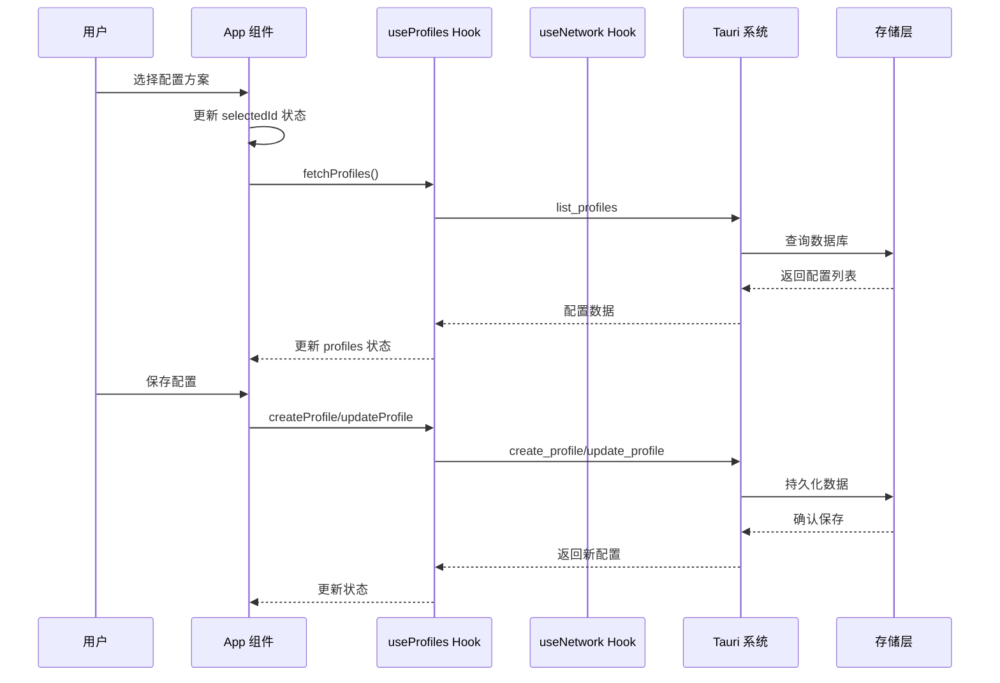
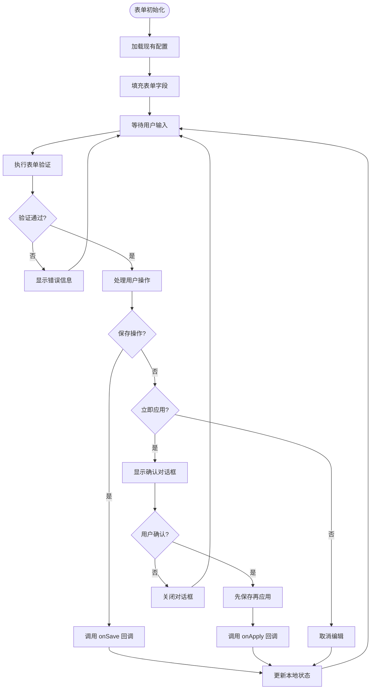
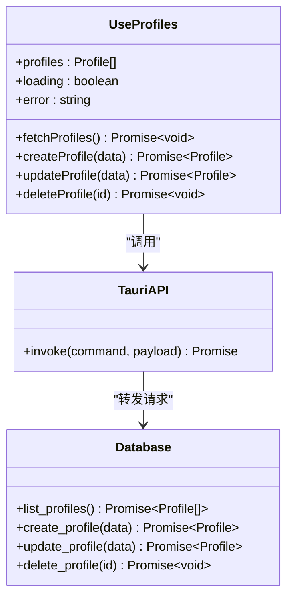
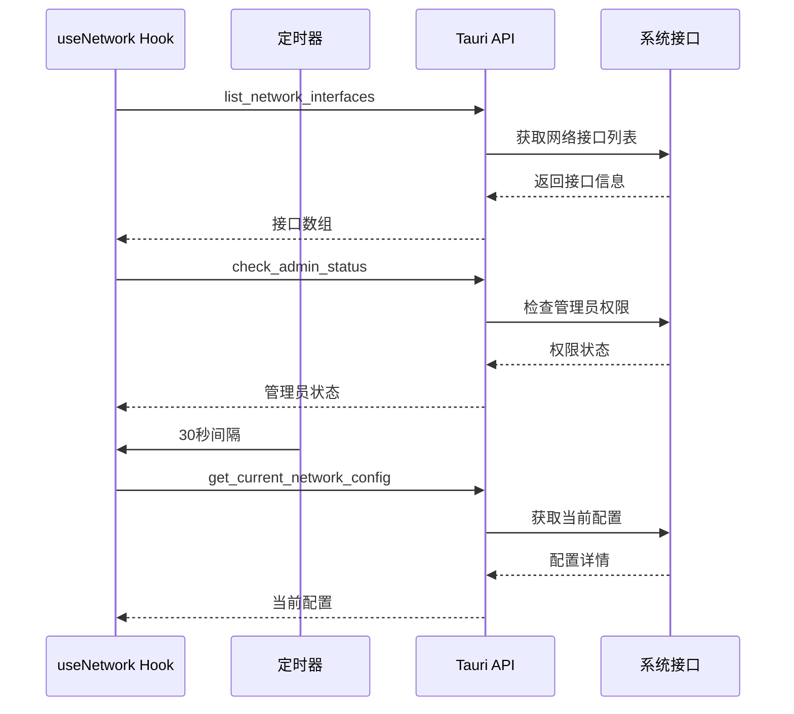
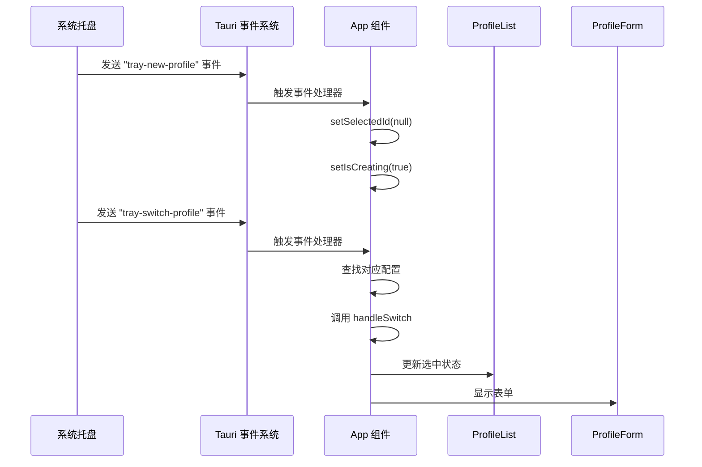
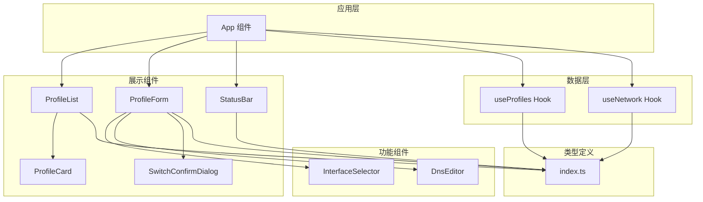

# 前端架构设计

<cite>
**本文档引用的文件**
- [src/App.tsx](file://src/App.tsx)
- [src/main.tsx](file://src/main.tsx)
- [src/hooks/useProfiles.ts](file://src/hooks/useProfiles.ts)
- [src/hooks/useNetwork.ts](file://src/hooks/useNetwork.ts)
- [src/types/index.ts](file://src/types/index.ts)
- [src/components/ProfileList.tsx](file://src/components/ProfileList.tsx)
- [src/components/ProfileForm.tsx](file://src/components/ProfileForm.tsx)
- [src/components/ProfileCard.tsx](file://src/components/ProfileCard.tsx)
- [src/components/StatusBar.tsx](file://src/components/StatusBar.tsx)
- [src/components/SwitchConfirmDialog.tsx](file://src/components/SwitchConfirmDialog.tsx)
- [src/components/InterfaceSelector.tsx](file://src/components/InterfaceSelector.tsx)
- [src/components/DnsEditor.tsx](file://src/components/DnsEditor.tsx)
- [src/App.css](file://src/App.css)
- [package.json](file://package.json)
- [vite.config.ts](file://vite.config.ts)
</cite>

## 目录
1. [简介](#简介)
2. [项目结构](#项目结构)
3. [核心组件](#核心组件)
4. [架构总览](#架构总览)
5. [详细组件分析](#详细组件分析)
6. [依赖关系分析](#依赖关系分析)
7. [性能考虑](#性能考虑)
8. [故障排除指南](#故障排除指南)
9. [结论](#结论)

## 简介

IPSwitcher 是一个基于 Tauri 的桌面网络配置切换工具，采用 React + TypeScript 构建前端界面。该应用允许用户创建、管理和应用不同的网络配置方案，支持 DHCP 和手动 IP 配置模式，并通过系统托盘提供快捷操作。

本架构设计文档详细说明了 React 组件架构模式、函数组件设计、Hooks 状态管理模式以及组件间通信机制。重点分析了 App 主组件如何协调 ProfileList、ProfileForm 等子组件的工作流程，解释了自定义 Hooks（useProfiles、useNetwork）的设计思路和数据获取策略，说明了事件监听机制（tray 事件处理）的实现方式，并提供了完整的前端架构图表和组件关系说明。

## 项目结构

IPSwitcher 采用清晰的分层组织结构，遵循功能模块化原则：



**图表来源**
- [src/main.tsx:1-11](file://src/main.tsx#L1-L11)
- [src/App.tsx:1-195](file://src/App.tsx#L1-L195)

项目采用 Vite 作为构建工具，React 18.3.1 作为核心框架，Tauri 提供原生系统集成能力。前端代码结构清晰，职责分离明确，便于维护和扩展。

**章节来源**
- [src/main.tsx:1-11](file://src/main.tsx#L1-L11)
- [vite.config.ts:1-25](file://vite.config.ts#L1-L25)
- [package.json:1-27](file://package.json#L1-L27)

## 核心组件

### 应用主组件架构

App 组件作为整个应用的协调中心，负责管理全局状态和组件间通信。其核心职责包括：

1. **状态管理**：维护选中的配置方案 ID、创建模式状态
2. **数据获取**：通过自定义 Hooks 获取配置列表和网络信息
3. **事件处理**：监听系统托盘事件，实现跨组件通信
4. **工作流协调**：协调 ProfileList、ProfileForm 等子组件的工作流程



**图表来源**
- [src/App.tsx:10-195](file://src/App.tsx#L10-L195)
- [src/hooks/useProfiles.ts:5-117](file://src/hooks/useProfiles.ts#L5-L117)
- [src/hooks/useNetwork.ts:5-99](file://src/hooks/useNetwork.ts#L5-L99)

### 函数组件设计模式

所有组件均采用函数组件设计，利用 React Hooks 实现状态管理和副作用处理。组件设计遵循以下原则：

1. **纯函数组件**：接收 props 并返回 JSX，避免使用类组件
2. **Hook 使用**：在组件顶部使用 useState、useEffect、useCallback 等 Hook
3. **Props Drilling**：通过 props 向子组件传递数据和回调函数
4. **状态提升**：将共享状态提升到最近的共同祖先组件

**章节来源**
- [src/App.tsx:10-195](file://src/App.tsx#L10-L195)
- [src/components/ProfileList.tsx:13-52](file://src/components/ProfileList.tsx#L13-L52)
- [src/components/ProfileForm.tsx:30-357](file://src/components/ProfileForm.tsx#L30-L357)

## 架构总览

IPSwitcher 采用分层架构设计，各层职责明确，耦合度低：



**图表来源**
- [src/App.tsx:1-195](file://src/App.tsx#L1-L195)
- [src/hooks/useProfiles.ts:1-117](file://src/hooks/useProfiles.ts#L1-L117)
- [src/hooks/useNetwork.ts:1-99](file://src/hooks/useNetwork.ts#L1-L99)

### 数据流架构

应用采用单向数据流设计，确保状态变更的可预测性：



**图表来源**
- [src/App.tsx:47-84](file://src/App.tsx#L47-L84)
- [src/hooks/useProfiles.ts:10-101](file://src/hooks/useProfiles.ts#L10-L101)

## 详细组件分析

### ProfileList 组件分析

ProfileList 是配置方案列表的展示组件，负责显示和管理配置项：

```mermaid
classDiagram
class ProfileList {
+profiles : Profile[]
+selectedId : string
+loading : boolean
+onSelect(id)
+onSwitch(profile)
+onNew()
}
class ProfileCard {
+profile : Profile
+isSelected : boolean
+onSelect()
+onSwitch()
}
ProfileList --> ProfileCard : "渲染多个"
ProfileList --> "props" : "传递回调函数"
```

**图表来源**
- [src/components/ProfileList.tsx:4-52](file://src/components/ProfileList.tsx#L4-L52)
- [src/components/ProfileCard.tsx:3-52](file://src/components/ProfileCard.tsx#L3-L52)

ProfileList 的设计特点：
1. **条件渲染**：根据加载状态和数据情况显示不同内容
2. **事件传播控制**：阻止事件冒泡，避免意外触发父级事件
3. **响应式布局**：适配不同屏幕尺寸

**章节来源**
- [src/components/ProfileList.tsx:13-52](file://src/components/ProfileList.tsx#L13-L52)

### ProfileForm 组件分析

ProfileForm 是配置方案表单的核心组件，实现了复杂的表单验证和状态管理：



**图表来源**
- [src/components/ProfileForm.tsx:104-182](file://src/components/ProfileForm.tsx#L104-L182)

ProfileForm 的关键特性：
1. **表单验证**：完整的前端验证逻辑，包括格式检查和业务规则
2. **状态同步**：与外部状态保持同步，确保数据一致性
3. **错误处理**：提供详细的错误信息反馈
4. **用户体验**：支持键盘快捷键和即时反馈

**章节来源**
- [src/components/ProfileForm.tsx:30-357](file://src/components/ProfileForm.tsx#L30-L357)

### 自定义 Hooks 设计分析

#### useProfiles Hook 分析

useProfiles Hook 实现了配置方案的完整 CRUD 操作：



**图表来源**
- [src/hooks/useProfiles.ts:5-117](file://src/hooks/useProfiles.ts#L5-L117)

useProfiles 的设计要点：
1. **状态隔离**：每个 Hook 维护独立的状态，避免相互影响
2. **错误边界**：在 Hook 内部捕获和处理错误，向上抛出标准化错误
3. **性能优化**：使用 useCallback 优化回调函数，减少不必要的重渲染
4. **类型安全**：完整的 TypeScript 类型定义，确保编译时类型检查

#### useNetwork Hook 分析

useNetwork Hook 负责网络接口和当前配置的管理：



**图表来源**
- [src/hooks/useNetwork.ts:13-86](file://src/hooks/useNetwork.ts#L13-L86)

useNetwork 的核心功能：
1. **自动刷新**：每 30 秒自动获取当前网络配置
2. **权限检测**：实时检测管理员权限状态
3. **接口管理**：提供网络接口列表查询功能
4. **配置应用**：支持配置切换操作

**章节来源**
- [src/hooks/useProfiles.ts:1-117](file://src/hooks/useProfiles.ts#L1-L117)
- [src/hooks/useNetwork.ts:1-99](file://src/hooks/useNetwork.ts#L1-L99)

### 事件监听机制分析

应用通过 Tauri 的事件系统实现系统托盘与前端的双向通信：



**图表来源**
- [src/App.tsx:115-143](file://src/App.tsx#L115-L143)

事件监听的实现特点：
1. **异步处理**：使用 async/await 处理异步事件
2. **资源清理**：正确清理事件监听器，防止内存泄漏
3. **错误处理**：对事件处理过程中的异常进行捕获和处理
4. **状态同步**：确保事件触发后 UI 状态的及时更新

**章节来源**
- [src/App.tsx:115-143](file://src/App.tsx#L115-L143)

## 依赖关系分析

### 组件依赖图



**图表来源**
- [src/App.tsx:1-195](file://src/App.tsx#L1-L195)
- [src/components/ProfileList.tsx:1-52](file://src/components/ProfileList.tsx#L1-L52)
- [src/components/ProfileForm.tsx:1-357](file://src/components/ProfileForm.tsx#L1-L357)

### 数据依赖关系

应用的数据流呈现清晰的层次结构：

1. **顶层数据源**：Tauri 系统调用提供原始数据
2. **Hook 层**：useProfiles 和 useNetwork 将原始数据转换为组件可用的状态
3. **组件层**：各个组件消费 Hook 提供的状态和方法
4. **UI 层**：最终渲染用户界面

**章节来源**
- [src/types/index.ts:1-30](file://src/types/index.ts#L1-L30)
- [src/hooks/useProfiles.ts:1-117](file://src/hooks/useProfiles.ts#L1-L117)
- [src/hooks/useNetwork.ts:1-99](file://src/hooks/useNetwork.ts#L1-L99)

## 性能考虑

### 渲染性能优化

1. **函数组件优化**：使用 React.memo 包装无状态组件，避免不必要的重渲染
2. **回调函数缓存**：使用 useCallback 缓存回调函数，确保事件处理器的稳定性
3. **状态分割**：将大对象状态分割为小的独立状态，提高更新效率
4. **虚拟滚动**：对于大量配置项，考虑实现虚拟滚动以优化渲染性能

### 网络请求优化

1. **请求去重**：避免重复发起相同的网络请求
2. **缓存策略**：合理使用浏览器缓存和应用内缓存
3. **批量更新**：合并多个状态更新操作，减少重渲染次数
4. **防抖节流**：对频繁触发的操作使用防抖或节流机制

### 内存管理

1. **事件监听清理**：确保组件卸载时清理所有事件监听器
2. **定时器清理**：及时清理定时器和轮询任务
3. **引用清理**：避免循环引用导致的内存泄漏
4. **资源释放**：及时释放不再使用的资源

## 故障排除指南

### 常见问题及解决方案

#### 配置保存失败

**症状**：保存配置时出现错误提示

**可能原因**：
1. 网络连接异常
2. 数据库写入权限不足
3. 表单验证失败
4. Tauri 系统调用异常

**解决步骤**：
1. 检查网络连接状态
2. 确认应用具有必要的文件系统权限
3. 验证表单数据格式
4. 查看浏览器控制台错误日志

#### 网络配置切换失败

**症状**：应用网络配置时无响应或报错

**可能原因**：
1. 管理员权限不足
2. 目标网络接口不可用
3. 网络配置参数无效
4. 系统防火墙阻拦

**解决步骤**：
1. 以管理员身份重新启动应用
2. 检查目标网络接口状态
3. 验证网络配置参数的有效性
4. 暂时关闭防火墙测试

#### 托盘事件无响应

**症状**：系统托盘菜单点击无反应

**可能原因**：
1. 事件监听器未正确注册
2. Tauri 事件系统异常
3. 应用处于后台状态
4. 浏览器安全策略限制

**解决步骤**：
1. 重启应用重新注册事件监听器
2. 检查 Tauri 日志输出
3. 确保应用窗口处于激活状态
4. 在受支持的浏览器环境中运行

**章节来源**
- [src/App.tsx:182-186](file://src/App.tsx#L182-L186)
- [src/components/ProfileForm.tsx:104-129](file://src/components/ProfileForm.tsx#L104-L129)
- [src/hooks/useNetwork.ts:49-69](file://src/hooks/useNetwork.ts#L49-L69)

## 结论

IPSwitcher 的前端架构设计体现了现代 React 应用的最佳实践。通过函数组件 + Hooks 的模式，实现了清晰的状态管理和组件职责分离。自定义 Hooks 将业务逻辑与 UI 层解耦，提高了代码的可复用性和可测试性。

应用的核心优势包括：

1. **架构清晰**：分层设计使代码结构易于理解和维护
2. **状态管理**：合理的状态提升和局部状态结合，避免过度复杂化
3. **用户体验**：完善的表单验证和错误处理，提供友好的用户交互
4. **系统集成**：通过 Tauri 实现原生系统功能，扩展应用能力
5. **性能优化**：采用多种优化策略，确保应用的响应速度

未来可以考虑的改进方向：
1. 实现更完善的错误边界处理
2. 添加更多的单元测试和集成测试
3. 优化移动端适配和响应式设计
4. 实现配置导入导出功能
5. 添加配置模板和预设功能