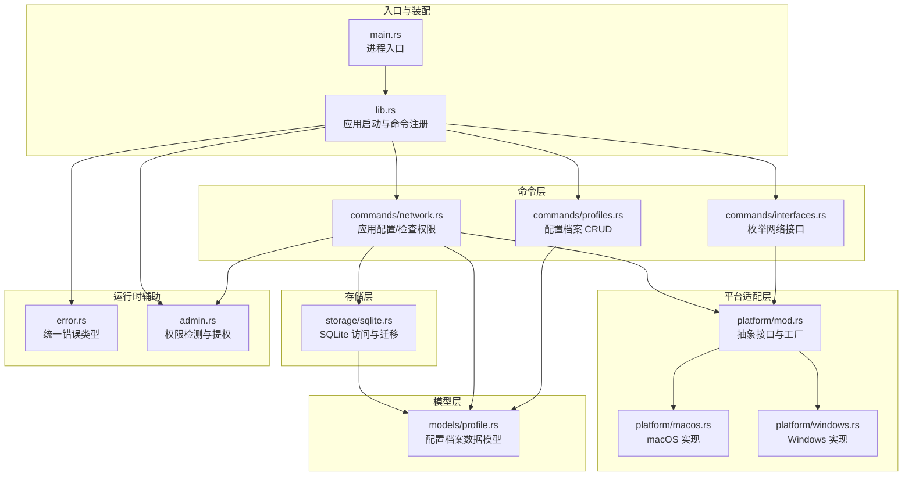
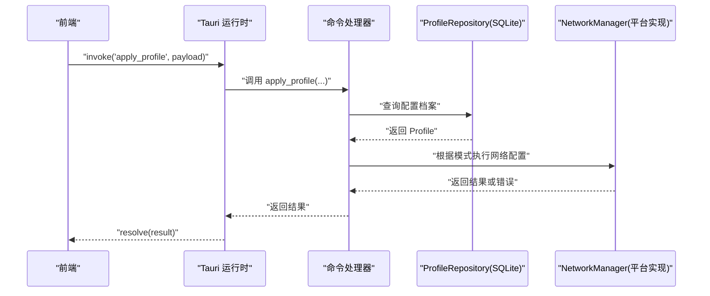
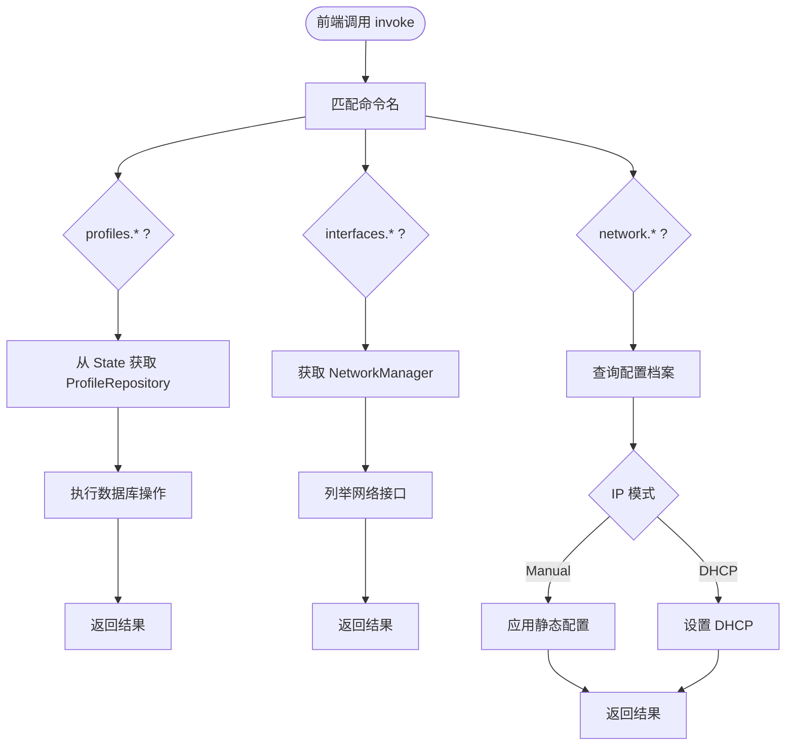
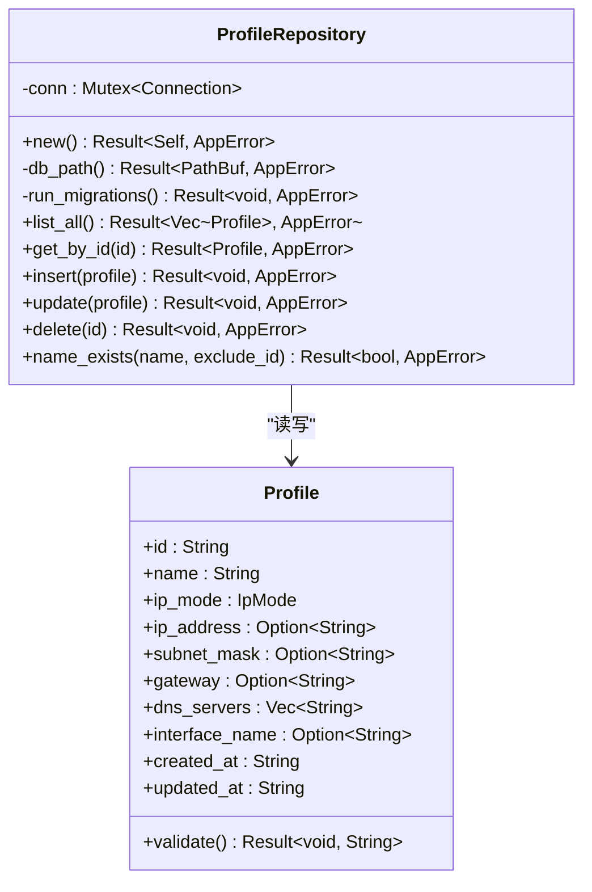
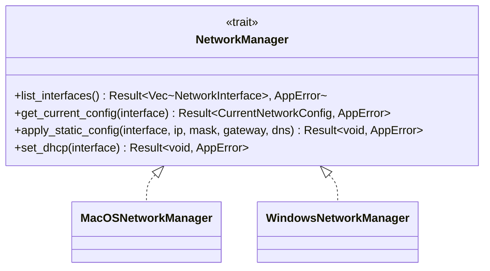
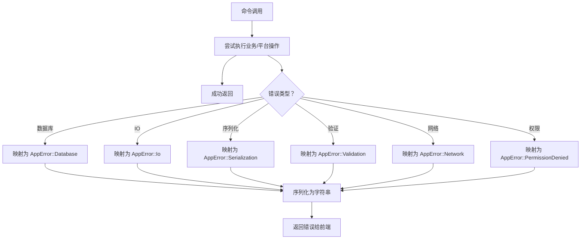
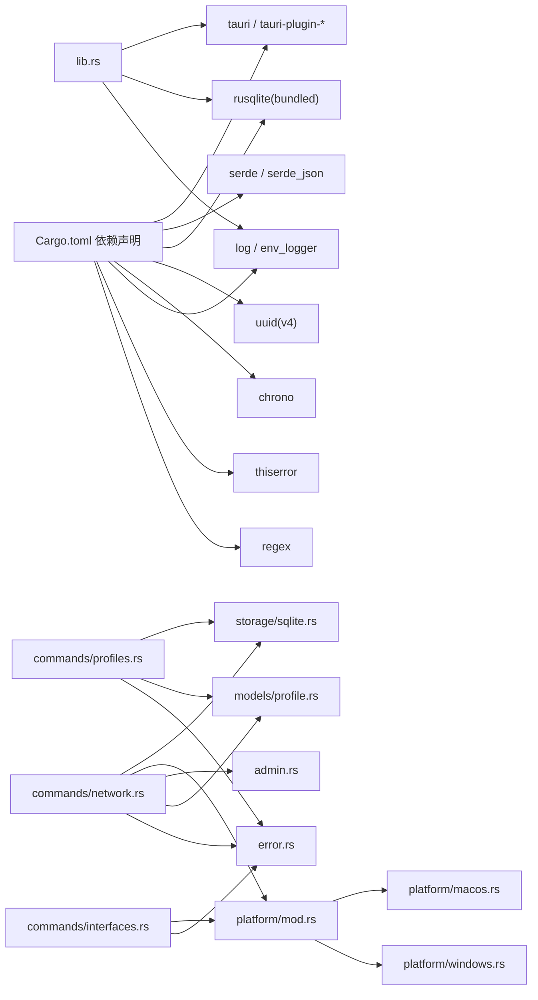

# 后端架构设计

<cite>
**本文档引用的文件**
- [lib.rs](file://src-tauri/src/lib.rs)
- [main.rs](file://src-tauri/src/main.rs)
- [Cargo.toml](file://src-tauri/Cargo.toml)
- [commands/mod.rs](file://src-tauri/src/commands/mod.rs)
- [commands/profiles.rs](file://src-tauri/src/commands/profiles.rs)
- [commands/interfaces.rs](file://src-tauri/src/commands/interfaces.rs)
- [commands/network.rs](file://src-tauri/src/commands/network.rs)
- [storage/mod.rs](file://src-tauri/src/storage/mod.rs)
- [storage/sqlite.rs](file://src-tauri/src/storage/sqlite.rs)
- [platform/mod.rs](file://src-tauri/src/platform/mod.rs)
- [platform/macos.rs](file://src-tauri/src/platform/macos.rs)
- [platform/windows.rs](file://src-tauri/src/platform/windows.rs)
- [models/profile.rs](file://src-tauri/src/models/profile.rs)
- [error.rs](file://src-tauri/src/error.rs)
- [admin.rs](file://src-tauri/src/admin.rs)
</cite>

## 目录
1. [简介](#简介)
2. [项目结构](#项目结构)
3. [核心组件](#核心组件)
4. [架构总览](#架构总览)
5. [详细组件分析](#详细组件分析)
6. [依赖关系分析](#依赖关系分析)
7. [性能考虑](#性能考虑)
8. [故障排除指南](#故障排除指南)
9. [结论](#结论)

## 简介
本文件为 IPSwitcher 项目的 Rust 后端架构设计文档，聚焦于模块化设计、命令处理机制、存储层架构与平台适配层。文档解释 Tauri 命令系统如何将前端请求路由到相应的 Rust 处理函数；分析 SQLite 存储层的数据访问模式与事务管理策略；说明平台特定功能的抽象封装方式；并涵盖错误处理机制、异步操作处理与内存管理策略。

## 项目结构
后端采用 Tauri 2 应用框架，Rust 源代码位于 src-tauri 目录，按职责划分为以下主要模块：
- 命令层：commands/profiles.rs、commands/interfaces.rs、commands/network.rs
- 模型层：models/profile.rs
- 平台适配层：platform/mod.rs、platform/macos.rs、platform/windows.rs
- 存储层：storage/sqlite.rs
- 错误处理：error.rs
- 权限与提权：admin.rs
- 入口与装配：lib.rs、main.rs
- 依赖声明：Cargo.toml

**图表来源**
- [lib.rs:1-51](file://src-tauri/src/lib.rs#L1-L51)
- [main.rs:1-7](file://src-tauri/src/main.rs#L1-L7)
- [commands/mod.rs:1-4](file://src-tauri/src/commands/mod.rs#L1-L4)
- [storage/mod.rs:1-2](file://src-tauri/src/storage/mod.rs#L1-L2)
- [platform/mod.rs:1-64](file://src-tauri/src/platform/mod.rs#L1-L64)
- [models/profile.rs:1-88](file://src-tauri/src/models/profile.rs#L1-L88)
- [error.rs:1-38](file://src-tauri/src/error.rs#L1-L38)
- [admin.rs:1-165](file://src-tauri/src/admin.rs#L1-L165)

**章节来源**
- [lib.rs:1-51](file://src-tauri/src/lib.rs#L1-L51)
- [main.rs:1-7](file://src-tauri/src/main.rs#L1-L7)
- [Cargo.toml:1-31](file://src-tauri/Cargo.toml#L1-L31)

## 核心组件
- 命令处理机制：通过 Tauri 的 #[tauri::command] 宏将 Rust 函数暴露给前端调用，使用 generate_handler! 在应用启动时集中注册。
- 存储层架构：基于 rusqlite 的本地 SQLite 数据库，使用 Mutex 包裹 Connection 实现线程安全访问，并在应用启动时执行迁移。
- 平台适配层：定义 NetworkManager trait 抽象跨平台网络操作，分别由 macOS 与 Windows 实现，通过工厂函数按操作系统返回具体实现。
- 错误处理：统一的 AppError 枚举，覆盖数据库、IO、序列化、验证、网络、权限等错误类别，并实现可序列化以便跨前端边界传递。
- 权限与提权：is_elevated 检测当前进程权限，elevate_network_command 构建并执行提权命令（macOS 使用 osascript，Windows 使用 powershell）。

**章节来源**
- [lib.rs:14-49](file://src-tauri/src/lib.rs#L14-L49)
- [commands/profiles.rs:1-113](file://src-tauri/src/commands/profiles.rs#L1-L113)
- [commands/interfaces.rs:1-8](file://src-tauri/src/commands/interfaces.rs#L1-L8)
- [commands/network.rs:1-101](file://src-tauri/src/commands/network.rs#L1-L101)
- [storage/sqlite.rs:1-256](file://src-tauri/src/storage/sqlite.rs#L1-L256)
- [platform/mod.rs:1-64](file://src-tauri/src/platform/mod.rs#L1-L64)
- [error.rs:1-38](file://src-tauri/src/error.rs#L1-L38)
- [admin.rs:1-165](file://src-tauri/src/admin.rs#L1-L165)

## 架构总览
Tauri 应用启动后，初始化日志、数据库连接并注入到应用状态中。随后注册所有命令处理器，前端通过 invoke 调用后端命令，命令函数通过 State 获取 ProfileRepository 与平台管理器实例，完成业务逻辑处理与平台操作。

**图表来源**
- [lib.rs:37-47](file://src-tauri/src/lib.rs#L37-L47)
- [commands/network.rs:29-95](file://src-tauri/src/commands/network.rs#L29-L95)
- [storage/sqlite.rs:110-144](file://src-tauri/src/storage/sqlite.rs#L110-L144)
- [platform/mod.rs:12-32](file://src-tauri/src/platform/mod.rs#L12-L32)

## 详细组件分析

### 命令处理机制
- 注册方式：在 lib.rs 中通过 generate_handler! 将 profiles、interfaces、network 三类命令一次性注册。
- 参数与状态：命令函数通过 State 获取 ProfileRepository，实现对存储层的访问；部分命令直接读取平台管理器。
- 返回值：所有命令返回 Result<T, AppError>，便于统一错误传播与序列化。

**图表来源**
- [lib.rs:37-47](file://src-tauri/src/lib.rs#L37-L47)
- [commands/profiles.rs:9-113](file://src-tauri/src/commands/profiles.rs#L9-L113)
- [commands/interfaces.rs:4-7](file://src-tauri/src/commands/interfaces.rs#L4-L7)
- [commands/network.rs:9-101](file://src-tauri/src/commands/network.rs#L9-L101)

**章节来源**
- [lib.rs:37-47](file://src-tauri/src/lib.rs#L37-L47)
- [commands/profiles.rs:1-113](file://src-tauri/src/commands/profiles.rs#L1-L113)
- [commands/interfaces.rs:1-8](file://src-tauri/src/commands/interfaces.rs#L1-L8)
- [commands/network.rs:1-101](file://src-tauri/src/commands/network.rs#L1-L101)

### 存储层架构与数据访问模式
- 数据库初始化：ProfileRepository::new 创建目录、打开连接并执行迁移，确保表结构存在。
- 并发控制：使用 Mutex<Connection> 保护数据库连接，避免并发写入冲突。
- 数据访问模式：
  - 列表查询：按更新时间倒序返回所有档案。
  - 单条查询：按 ID 查询，未命中返回 NotFound。
  - 插入/更新：序列化 DNS 数组为 JSON 字符串存入；约束冲突转换为 DuplicateName。
  - 删除：按 ID 删除，未命中返回 NotFound。
- 事务管理：当前实现未显式开启事务，所有操作在单次语句执行中完成；如需批量写入可扩展为显式事务。

**图表来源**
- [storage/sqlite.rs:8-256](file://src-tauri/src/storage/sqlite.rs#L8-L256)
- [models/profile.rs:20-88](file://src-tauri/src/models/profile.rs#L20-L88)

**章节来源**
- [storage/sqlite.rs:12-256](file://src-tauri/src/storage/sqlite.rs#L12-L256)
- [models/profile.rs:1-88](file://src-tauri/src/models/profile.rs#L1-L88)

### 平台适配层与抽象封装
- 抽象接口：NetworkManager trait 定义统一的网络操作接口，包括列举接口、获取当前配置、应用静态配置、设置 DHCP。
- 工厂函数：get_network_manager 根据目标操作系统返回对应实现。
- macOS 实现：通过 networksetup 命令进行接口列举、配置查询与设置。
- Windows 实现：通过 netsh 命令进行接口列举、配置查询与设置。
- 权限处理：命令执行前检查权限，必要时通过提权工具执行管理员命令。

**图表来源**
- [platform/mod.rs:12-32](file://src-tauri/src/platform/mod.rs#L12-L32)
- [platform/macos.rs:6-175](file://src-tauri/src/platform/macos.rs#L6-L175)
- [platform/windows.rs:6-173](file://src-tauri/src/platform/windows.rs#L6-L173)

**章节来源**
- [platform/mod.rs:1-64](file://src-tauri/src/platform/mod.rs#L1-L64)
- [platform/macos.rs:1-175](file://src-tauri/src/platform/macos.rs#L1-L175)
- [platform/windows.rs:1-173](file://src-tauri/src/platform/windows.rs#L1-L173)

### 错误处理机制
- 统一错误类型：AppError 覆盖数据库、IO、序列化、验证、网络、权限等错误类别，并实现可序列化。
- 前后端传递：错误被序列化为字符串，便于跨边界传递与前端展示。
- 命令层传播：命令函数直接返回 Result，错误类型由 AppError 统一封装。

**图表来源**
- [error.rs:3-28](file://src-tauri/src/error.rs#L3-L28)

**章节来源**
- [error.rs:1-38](file://src-tauri/src/error.rs#L1-L38)

### 异步操作与内存管理策略
- 异步处理：Tauri 命令在后台线程执行，命令函数本身为同步函数，但 Tauri 运行时负责并发调度。
- 内存管理：ProfileRepository 使用 Mutex 包裹 Connection，避免共享可变状态；数据库连接在进程生命周期内复用，减少频繁打开关闭带来的开销。
- 日志与资源：初始化阶段启用 env_logger，便于调试与问题定位。

**章节来源**
- [lib.rs:14-17](file://src-tauri/src/lib.rs#L14-L17)
- [storage/sqlite.rs:8-10](file://src-tauri/src/storage/sqlite.rs#L8-L10)

## 依赖关系分析

**图表来源**
- [Cargo.toml:12-31](file://src-tauri/Cargo.toml#L12-L31)
- [lib.rs:1-51](file://src-tauri/src/lib.rs#L1-L51)
- [commands/profiles.rs:1-113](file://src-tauri/src/commands/profiles.rs#L1-L113)
- [commands/interfaces.rs:1-8](file://src-tauri/src/commands/interfaces.rs#L1-L8)
- [commands/network.rs:1-101](file://src-tauri/src/commands/network.rs#L1-L101)
- [storage/sqlite.rs:1-256](file://src-tauri/src/storage/sqlite.rs#L1-L256)
- [platform/mod.rs:1-64](file://src-tauri/src/platform/mod.rs#L1-L64)
- [models/profile.rs:1-88](file://src-tauri/src/models/profile.rs#L1-L88)
- [error.rs:1-38](file://src-tauri/src/error.rs#L1-L38)
- [admin.rs:1-165](file://src-tauri/src/admin.rs#L1-L165)

**章节来源**
- [Cargo.toml:1-31](file://src-tauri/Cargo.toml#L1-L31)

## 性能考虑
- 数据库连接复用：通过 Mutex<Connection> 复用连接，减少连接建立/销毁成本。
- 查询优化：列表查询按更新时间排序，适合频繁变更场景；建议在 profiles 表上增加索引以优化排序与过滤。
- 平台命令执行：网络配置命令为外部进程调用，建议在前端显示进度与状态，避免阻塞 UI。
- 提权流程：仅在权限不足时触发提权，避免不必要的权限弹窗与等待。

## 故障排除指南
- 数据库初始化失败：检查 HOME/APPDATA 环境变量是否正确，确认应用有写入 Application Support 或 AppData 目录的权限。
- 网络接口不可用：确认 networksetup/netsh 命令在系统中可用，且当前用户具有相应权限。
- 权限不足：调用 elevate_network_command 前检查 is_elevated，若失败则引导用户重新授权。
- 配置验证失败：检查 Profile 的字段校验规则，确保手动模式下的 IP、掩码、网关与 DNS 均符合要求。

**章节来源**
- [storage/sqlite.rs:29-51](file://src-tauri/src/storage/sqlite.rs#L29-L51)
- [admin.rs:34-49](file://src-tauri/src/admin.rs#L34-L49)
- [models/profile.rs:34-81](file://src-tauri/src/models/profile.rs#L34-L81)

## 结论
IPSwitcher 的 Rust 后端采用清晰的分层架构：命令层负责前端交互与业务编排，存储层提供本地 SQLite 数据持久化，平台适配层抽象跨平台网络操作，错误处理与权限管理贯穿各层。整体设计具备良好的可维护性与扩展性，未来可在存储层引入显式事务、为高频查询添加索引，并增强平台命令的错误恢复能力。