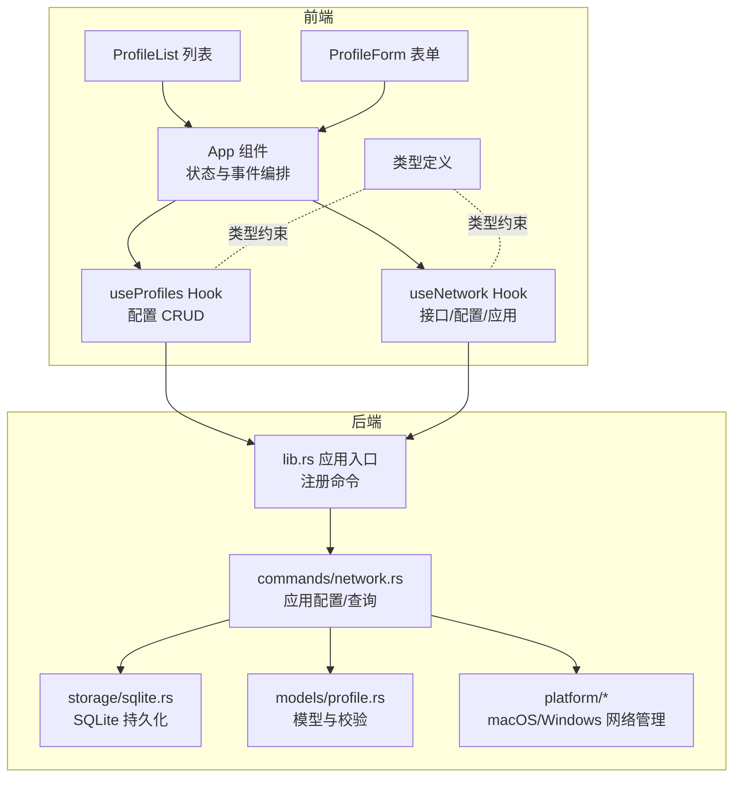
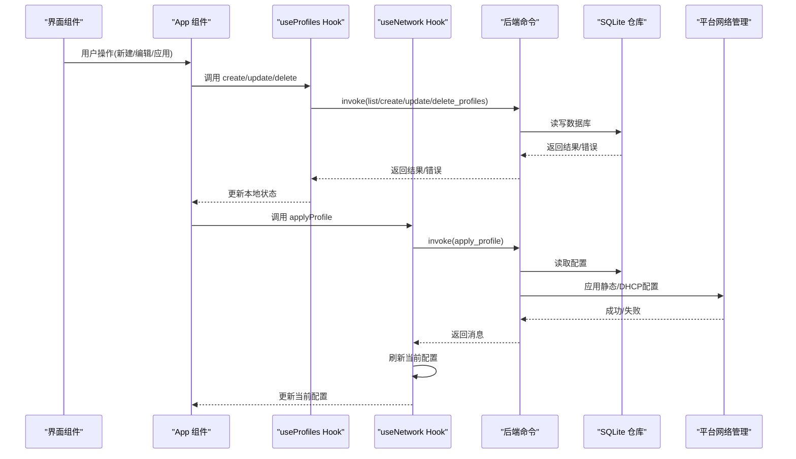
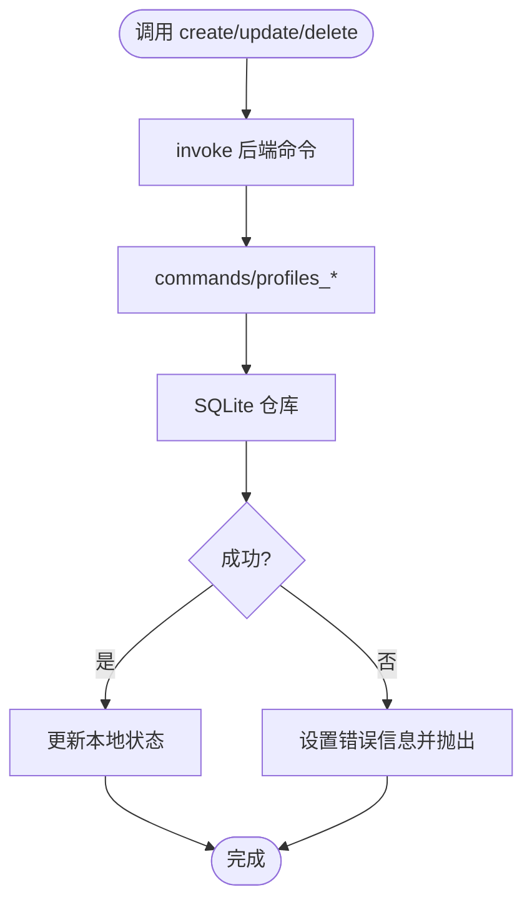
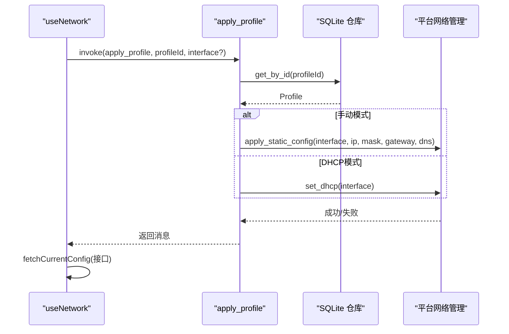
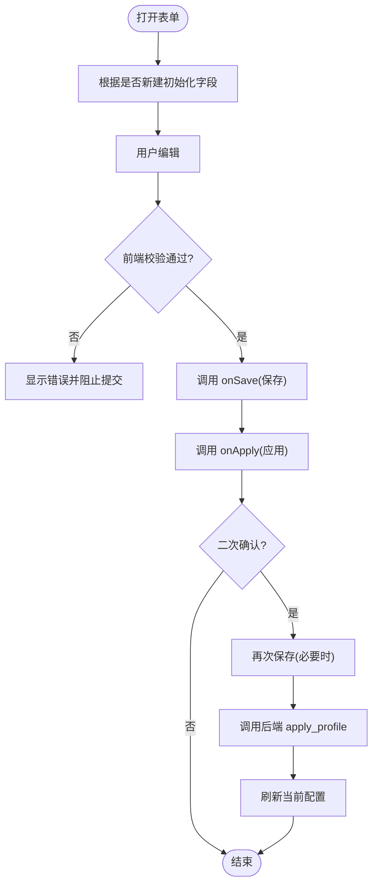
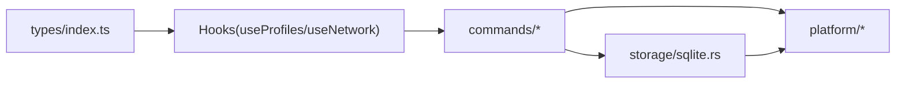

# 数据流设计

<cite>
**本文引用的文件**
- [src/App.tsx](file://src/App.tsx)
- [src/main.tsx](file://src/main.tsx)
- [src/hooks/useProfiles.ts](file://src/hooks/useProfiles.ts)
- [src/hooks/useNetwork.ts](file://src/hooks/useNetwork.ts)
- [src/types/index.ts](file://src/types/index.ts)
- [src/components/ProfileForm.tsx](file://src/components/ProfileForm.tsx)
- [src/components/ProfileList.tsx](file://src/components/ProfileList.tsx)
- [src-tauri/src/lib.rs](file://src-tauri/src/lib.rs)
- [src-tauri/src/commands/network.rs](file://src-tauri/src/commands/network.rs)
- [src-tauri/src/storage/sqlite.rs](file://src-tauri/src/storage/sqlite.rs)
- [src-tauri/src/models/profile.rs](file://src-tauri/src/models/profile.rs)
- [src-tauri/src/platform/mod.rs](file://src-tauri/src/platform/mod.rs)
- [src-tauri/src/platform/windows.rs](file://src-tauri/src/platform/windows.rs)
- [src-tauri/src/platform/macos.rs](file://src-tauri/src/platform/macos.rs)
</cite>

## 目录
1. [简介](#简介)
2. [项目结构](#项目结构)
3. [核心组件](#核心组件)
4. [架构总览](#架构总览)
5. [详细组件分析](#详细组件分析)
6. [依赖关系分析](#依赖关系分析)
7. [性能考虑](#性能考虑)
8. [故障排查指南](#故障排查指南)
9. [结论](#结论)
10. [附录](#附录)

## 简介
本文件面向IPSwitcher项目的“数据流设计”，聚焦于从前端用户操作到后端网络配置变更的完整数据路径，以及前后端状态管理与持久化之间的协同机制。文档涵盖：
- 前端状态管理（useState、useEffect）与后端数据持久化的协调
- 网络配置应用过程中的数据验证与错误处理
- 数据缓存策略、实时状态同步与一致性保障
- 典型使用场景的数据流图示与流程说明

## 项目结构
项目采用Tauri + React的桌面应用架构，前端负责UI与状态管理，后端通过命令桥接系统网络能力与SQLite持久化。

**图表来源**
- [src/App.tsx:1-195](file://src/App.tsx#L1-L195)
- [src/hooks/useProfiles.ts:1-117](file://src/hooks/useProfiles.ts#L1-L117)
- [src/hooks/useNetwork.ts:1-99](file://src/hooks/useNetwork.ts#L1-L99)
- [src-tauri/src/lib.rs:14-50](file://src-tauri/src/lib.rs#L14-L50)
- [src-tauri/src/commands/network.rs:9-101](file://src-tauri/src/commands/network.rs#L9-L101)
- [src-tauri/src/storage/sqlite.rs:1-256](file://src-tauri/src/storage/sqlite.rs#L1-L256)
- [src-tauri/src/models/profile.rs:1-88](file://src-tauri/src/models/profile.rs#L1-L88)
- [src-tauri/src/platform/mod.rs:1-64](file://src-tauri/src/platform/mod.rs#L1-L64)

**章节来源**
- [src/main.tsx:1-11](file://src/main.tsx#L1-L11)
- [src/App.tsx:1-195](file://src/App.tsx#L1-L195)
- [src/hooks/useProfiles.ts:1-117](file://src/hooks/useProfiles.ts#L1-L117)
- [src/hooks/useNetwork.ts:1-99](file://src/hooks/useNetwork.ts#L1-L99)
- [src/types/index.ts:1-30](file://src/types/index.ts#L1-L30)

## 核心组件
- 前端状态与事件编排：App组件集中管理选中配置、创建/编辑状态、错误提示，并监听托盘事件触发应用配置。
- 配置持久化Hook：useProfiles封装列表、新增、更新、删除等CRUD，统一错误与加载状态。
- 网络状态Hook：useNetwork封装接口枚举、当前配置查询、管理员权限检查、应用配置；内置定时刷新当前配置。
- 后端命令层：commands/network.rs提供“获取当前配置”“应用配置”“检查管理员状态”等命令。
- 存储层：storage/sqlite.rs基于rusqlite实现Profile的增删改查与迁移。
- 平台层：platform/mod.rs抽象网络管理器，macOS与Windows分别实现接口枚举、静态配置、DHCP设置与DNS配置。

**章节来源**
- [src/App.tsx:10-195](file://src/App.tsx#L10-L195)
- [src/hooks/useProfiles.ts:5-117](file://src/hooks/useProfiles.ts#L5-L117)
- [src/hooks/useNetwork.ts:5-99](file://src/hooks/useNetwork.ts#L5-L99)
- [src-tauri/src/commands/network.rs:9-101](file://src-tauri/src/commands/network.rs#L9-L101)
- [src-tauri/src/storage/sqlite.rs:53-256](file://src-tauri/src/storage/sqlite.rs#L53-L256)
- [src-tauri/src/platform/mod.rs:12-64](file://src-tauri/src/platform/mod.rs#L12-L64)

## 架构总览
从前端到后端的关键调用链路如下：

**图表来源**
- [src/App.tsx:47-113](file://src/App.tsx#L47-L113)
- [src/hooks/useProfiles.ts:10-101](file://src/hooks/useProfiles.ts#L10-L101)
- [src/hooks/useNetwork.ts:49-69](file://src/hooks/useNetwork.ts#L49-L69)
- [src-tauri/src/commands/network.rs:29-95](file://src-tauri/src/commands/network.rs#L29-L95)
- [src-tauri/src/storage/sqlite.rs:146-232](file://src-tauri/src/storage/sqlite.rs#L146-L232)
- [src-tauri/src/platform/windows.rs:88-172](file://src-tauri/src/platform/windows.rs#L88-L172)
- [src-tauri/src/platform/macos.rs:112-174](file://src-tauri/src/platform/macos.rs#L112-L174)

## 详细组件分析

### 前端状态管理与事件编排（App）
- 状态：selectedId、isCreating、profiles、interfaces、currentConfig、loading/error等。
- 事件：handleSave、handleDelete、handleSwitch、handleConfirmApply；监听托盘事件以触发新建与切换。
- 协同：在应用配置成功后主动刷新配置列表，确保UI与后端一致。

**章节来源**
- [src/App.tsx:10-195](file://src/App.tsx#L10-L195)

### 配置持久化（useProfiles）
- 负责：拉取列表、新增、更新、删除；统一错误与加载状态。
- 数据流：调用invoke -> 后端命令 -> SQLite仓库 -> 返回结果 -> 更新本地状态。
- 错误处理：捕获异常并设置error，抛出Error以便上层消费。

**图表来源**
- [src/hooks/useProfiles.ts:23-101](file://src/hooks/useProfiles.ts#L23-L101)
- [src-tauri/src/commands/network.rs:39-95](file://src-tauri/src/commands/network.rs#L39-L95)
- [src-tauri/src/storage/sqlite.rs:146-232](file://src-tauri/src/storage/sqlite.rs#L146-L232)

**章节来源**
- [src/hooks/useProfiles.ts:5-117](file://src/hooks/useProfiles.ts#L5-L117)

### 网络配置应用（useNetwork）
- 负责：列举接口、获取当前配置、检查管理员权限、应用配置；定时刷新当前配置。
- 数据流：调用invoke -> 后端命令 -> 平台网络管理 -> 返回结果 -> 更新currentConfig。
- 错误处理：设置error并在异常时抛出，供上层展示。

**图表来源**
- [src/hooks/useNetwork.ts:49-69](file://src/hooks/useNetwork.ts#L49-L69)
- [src-tauri/src/commands/network.rs:29-95](file://src-tauri/src/commands/network.rs#L29-L95)
- [src-tauri/src/platform/windows.rs:88-172](file://src-tauri/src/platform/windows.rs#L88-L172)
- [src-tauri/src/platform/macos.rs:112-174](file://src-tauri/src/platform/macos.rs#L112-L174)

**章节来源**
- [src/hooks/useNetwork.ts:5-99](file://src/hooks/useNetwork.ts#L5-L99)

### 表单数据验证与应用流程（ProfileForm）
- 前端校验：名称长度/唯一性、接口选择、手动模式下的IP/掩码/网关/DNS格式校验。
- 应用流程：先保存（若为编辑），再调用onApply触发后端应用；弹窗二次确认防止误操作。

**图表来源**
- [src/components/ProfileForm.tsx:76-182](file://src/components/ProfileForm.tsx#L76-L182)
- [src/App.tsx:86-113](file://src/App.tsx#L86-L113)
- [src/hooks/useNetwork.ts:49-69](file://src/hooks/useNetwork.ts#L49-L69)

**章节来源**
- [src/components/ProfileForm.tsx:1-357](file://src/components/ProfileForm.tsx#L1-L357)

### 后端命令与平台适配
- 命令注册：lib.rs中注册所有命令，包括配置CRUD、接口枚举、当前配置查询、应用配置、管理员状态检查。
- 应用配置：根据Profile的ip_mode选择静态配置或DHCP；若无管理员权限则提升权限后再执行。
- 平台实现：macOS使用networksetup，Windows使用netsh；均支持静态IP/DNS与DHCP切换。

**章节来源**
- [src-tauri/src/lib.rs:37-47](file://src-tauri/src/lib.rs#L37-L47)
- [src-tauri/src/commands/network.rs:9-101](file://src-tauri/src/commands/network.rs#L9-L101)
- [src-tauri/src/platform/mod.rs:12-64](file://src-tauri/src/platform/mod.rs#L12-L64)
- [src-tauri/src/platform/windows.rs:8-172](file://src-tauri/src/platform/windows.rs#L8-L172)
- [src-tauri/src/platform/macos.rs:8-174](file://src-tauri/src/platform/macos.rs#L8-L174)

### 数据模型与校验
- Profile模型：包含名称、IP模式、IP地址、子网掩码、网关、DNS、接口名及时间戳。
- 校验规则：名称非空且不超过64字符；手动模式必填IP/掩码/网关且DNS至少一个；DHCP模式不允许设置上述字段。

**章节来源**
- [src-tauri/src/models/profile.rs:20-87](file://src-tauri/src/models/profile.rs#L20-L87)

## 依赖关系分析
- 前端依赖后端命令：通过@tauri-apps/api/core的invoke调用后端命令。
- 后端依赖存储与平台：命令层依赖SQLite仓库与平台网络管理器。
- 类型一致性：前端types/index.ts与后端models/profile.rs保持字段与枚举一致。

**图表来源**
- [src/types/index.ts:1-30](file://src/types/index.ts#L1-L30)
- [src/hooks/useProfiles.ts:1-4](file://src/hooks/useProfiles.ts#L1-L4)
- [src/hooks/useNetwork.ts:1-3](file://src/hooks/useNetwork.ts#L1-L3)
- [src-tauri/src/commands/network.rs:1-8](file://src-tauri/src/commands/network.rs#L1-L8)
- [src-tauri/src/storage/sqlite.rs:1-7](file://src-tauri/src/storage/sqlite.rs#L1-L7)
- [src-tauri/src/platform/mod.rs:1-4](file://src-tauri/src/platform/mod.rs#L1-L4)

**章节来源**
- [src/types/index.ts:1-30](file://src/types/index.ts#L1-L30)
- [src-tauri/src/lib.rs:37-47](file://src-tauri/src/lib.rs#L37-L47)

## 性能考虑
- 实时状态同步：useNetwork每30秒自动刷新当前配置，避免UI与系统状态不一致。
- 本地乐观更新：useProfiles在新增/更新/删除时先乐观更新本地状态，减少等待时间。
- 最小化网络调用：仅在应用配置后刷新当前配置，避免频繁轮询。
- 平台命令开销：静态配置与DNS设置可能涉及系统命令调用，建议在批量操作时合并UI提示与错误反馈。

[本节为通用指导，无需具体文件来源]

## 故障排查指南
- 管理员权限不足：后端在需要时会尝试提升权限，若失败需提示用户以管理员身份运行。
- 配置应用失败：检查接口名是否正确、手动模式字段是否满足校验；查看错误信息并重试。
- 数据库异常：SQLite初始化失败或约束冲突时，检查数据库目录权限与唯一性约束。
- 平台命令失败：macOS/Windows命令返回非成功状态时，查看stderr输出定位问题。

**章节来源**
- [src-tauri/src/commands/network.rs:53-61](file://src-tauri/src/commands/network.rs#L53-L61)
- [src-tauri/src/platform/windows.rs:105-109](file://src-tauri/src/platform/windows.rs#L105-L109)
- [src-tauri/src/platform/macos.rs:129-133](file://src-tauri/src/platform/macos.rs#L129-L133)
- [src-tauri/src/storage/sqlite.rs:175-181](file://src-tauri/src/storage/sqlite.rs#L175-L181)

## 结论
IPSwitcher通过清晰的前后端职责划分与严格的命令式调用，实现了从用户输入到系统网络配置变更的可控数据流。前端通过Hook进行状态与副作用管理，后端通过命令与平台适配实现跨平台网络控制，配合SQLite持久化与定时刷新机制，确保了数据一致性与用户体验。

[本节为总结，无需具体文件来源]

## 附录

### 典型使用场景与数据流

- 场景一：新建配置并立即应用
  1) 用户在ProfileForm填写并点击“立即应用”
  2) 前端校验通过后，先调用onSave保存至数据库
  3) 再调用onApply，后端读取配置并应用静态/DHCP
  4) 应用成功后刷新当前配置，UI同步最新状态

- 场景二：从托盘触发新建与切换
  1) 监听托盘事件，触发新建或按ID查找配置
  2) App调用handleSwitch，若接口缺失则提示选择接口
  3) 接口有效时调用applyProfile，完成后刷新列表

- 场景三：编辑现有配置
  1) 选中配置进入编辑模式
  2) 修改后点击保存，触发update_profile
  3) 若随后应用，则重复“应用配置”的流程

**章节来源**
- [src/components/ProfileForm.tsx:131-182](file://src/components/ProfileForm.tsx#L131-L182)
- [src/App.tsx:116-143](file://src/App.tsx#L116-L143)
- [src/hooks/useNetwork.ts:76-86](file://src/hooks/useNetwork.ts#L76-L86)