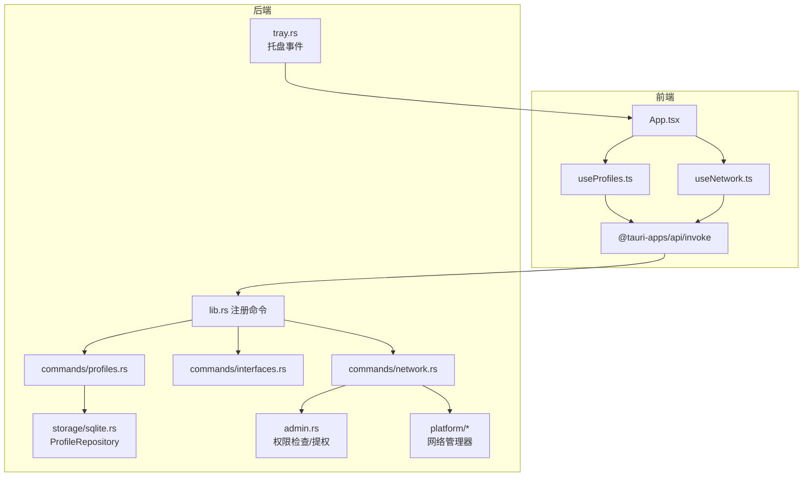
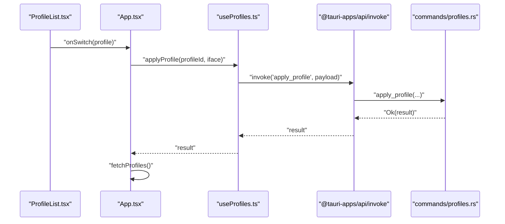
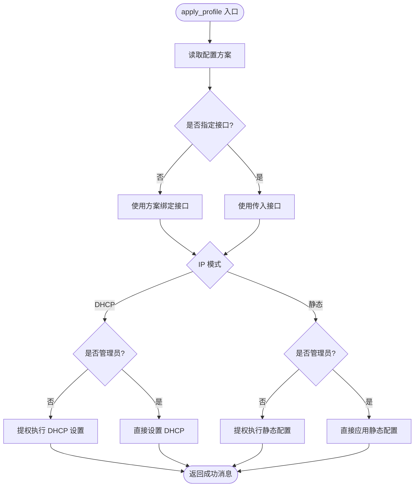
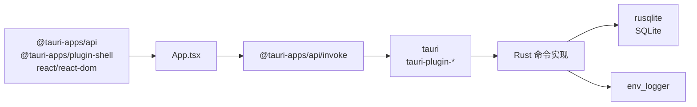

# 整体架构概览

<cite>
**本文档引用的文件**
- [package.json](file://package.json)
- [Cargo.toml](file://src-tauri/Cargo.toml)
- [tauri.conf.json](file://src-tauri/tauri.conf.json)
- [lib.rs](file://src-tauri/src/lib.rs)
- [main.rs](file://src-tauri/src/main.rs)
- [App.tsx](file://src/App.tsx)
- [main.tsx](file://src/main.tsx)
- [useProfiles.ts](file://src/hooks/useProfiles.ts)
- [useNetwork.ts](file://src/hooks/useNetwork.ts)
- [index.ts](file://src/types/index.ts)
- [profiles.rs](file://src-tauri/src/commands/profiles.rs)
- [interfaces.rs](file://src-tauri/src/commands/interfaces.rs)
- [network.rs](file://src-tauri/src/commands/network.rs)
- [ProfileList.tsx](file://src/components/ProfileList.tsx)
</cite>

## 目录
1. [引言](#引言)
2. [项目结构](#项目结构)
3. [核心组件](#核心组件)
4. [架构总览](#架构总览)
5. [详细组件分析](#详细组件分析)
6. [依赖关系分析](#依赖关系分析)
7. [性能考虑](#性能考虑)
8. [故障排除指南](#故障排除指南)
9. [结论](#结论)

## 引言
本文件为 IPSwitcher 项目的整体架构概览文档，聚焦于系统的高层设计与实现要点。项目采用前后端分离架构：前端使用 React + TypeScript 构建用户界面与交互逻辑；后端基于 Rust 使用 Tauri 框架承载系统级网络操作与平台能力。通过 IPC（进程间通信）机制，前端以命令调用的方式与后端进行数据交换，实现跨平台桌面应用的统一体验。

## 项目结构
项目采用典型的 Tauri 应用布局：
- 前端目录：src（React/Vite 工程），包含组件、Hooks、类型定义与入口文件
- 后端目录：src-tauri（Rust 工程），包含命令模块、平台适配、存储与托盘等
- 配置文件：package.json（前端依赖与脚本）、Cargo.toml（Rust 依赖与目标）、tauri.conf.json（Tauri 构建与打包配置）

```mermaid
graph TB
subgraph "前端(React)"
FE_Main["main.tsx<br/>应用入口"]
FE_App["App.tsx<br/>主应用组件"]
FE_Components["components/*<br/>UI 组件"]
FE_Hooks["hooks/*<br/>业务逻辑封装"]
FE_Types["types/index.ts<br/>类型定义"]
end
subgraph "后端(Tauri/Rust)"
BE_Lib["lib.rs<br/>应用启动与命令注册"]
BE_Main["main.rs<br/>程序入口"]
BE_Commands["commands/*<br/>IPC 命令实现"]
BE_Platform["platform/*<br/>平台网络管理"]
BE_Storage["storage/*<br/>SQLite 存储"]
BE_Admin["admin.rs<br/>权限与提权"]
BE_Trayer["tray.rs<br/>托盘图标"]
end
FE_Main --> FE_App
FE_App --> FE_Components
FE_App --> FE_Hooks
FE_Hooks --> FE_Types
BE_Lib --> BE_Commands
BE_Lib --> BE_Platform
BE_Lib --> BE_Storage
BE_Lib --> BE_Admin
BE_Lib --> BE_Trayer
FE_App <- --> BE_Lib
```

图表来源
- [main.tsx:1-11](file://src/main.tsx#L1-L11)
- [App.tsx:1-195](file://src/App.tsx#L1-L195)
- [lib.rs:1-49](file://src-tauri/src/lib.rs#L1-L49)
- [main.rs:1-7](file://src-tauri/src/main.rs#L1-L7)

章节来源
- [package.json:1-27](file://package.json#L1-L27)
- [Cargo.toml:1-30](file://src-tauri/Cargo.toml#L1-L30)
- [tauri.conf.json:1-48](file://src-tauri/tauri.conf.json#L1-L48)

## 核心组件
- 前端核心职责
  - UI 展示：ProfileList、ProfileForm、StatusBar 等组件负责界面渲染与用户交互
  - 业务封装：useProfiles、useNetwork Hooks 封装状态管理与 IPC 调用
  - 事件监听：订阅托盘事件，实现系统托盘与主界面的联动
- 后端核心职责
  - 应用启动：初始化日志、数据库、托盘与窗口事件
  - IPC 命令：提供 profiles/interfaces/network 三类命令，供前端调用
  - 平台适配：抽象网络管理器，支持不同平台的网络配置读取与应用
  - 权限控制：检测管理员权限并在需要时触发提权流程

章节来源
- [App.tsx:1-195](file://src/App.tsx#L1-L195)
- [useProfiles.ts:1-117](file://src/hooks/useProfiles.ts#L1-L117)
- [useNetwork.ts:1-99](file://src/hooks/useNetwork.ts#L1-L99)
- [lib.rs:1-49](file://src-tauri/src/lib.rs#L1-L49)

## 架构总览
系统采用“前端 UI + 后端命令”的分层架构，前端通过 @tauri-apps/api 的 invoke 直接调用后端注册的命令，后端在 Rust 中执行系统级网络操作，并返回结果给前端。托盘图标提供快速入口，事件通过事件系统回传至前端。



图表来源
- [App.tsx:1-195](file://src/App.tsx#L1-L195)
- [useProfiles.ts:1-117](file://src/hooks/useProfiles.ts#L1-L117)
- [useNetwork.ts:1-99](file://src/hooks/useNetwork.ts#L1-L99)
- [lib.rs:35-45](file://src-tauri/src/lib.rs#L35-L45)
- [profiles.rs:1-113](file://src-tauri/src/commands/profiles.rs#L1-L113)
- [interfaces.rs:1-8](file://src-tauri/src/commands/interfaces.rs#L1-L8)
- [network.rs:1-101](file://src-tauri/src/commands/network.rs#L1-L101)

## 详细组件分析

### 前端组件与数据流
- 主应用 App.tsx
  - 负责聚合 useProfiles 与 useNetwork 的状态与方法，协调 ProfileList 与 ProfileForm 的显示与交互
  - 订阅托盘事件，实现“新建”和“切换”动作的快捷入口
- Hooks 封装
  - useProfiles：封装列表、创建、更新、删除等操作，统一错误处理与加载状态
  - useNetwork：封装接口枚举、当前配置查询、管理员状态检查与应用方案
- 类型系统
  - 统一的 Profile、NetworkInterface、CurrentNetworkConfig 类型定义，确保前后端契约一致



图表来源
- [ProfileList.tsx:1-52](file://src/components/ProfileList.tsx#L1-L52)
- [App.tsx:86-113](file://src/App.tsx#L86-L113)
- [useProfiles.ts:49-69](file://src/hooks/useProfiles.ts#L49-L69)
- [profiles.rs:106-113](file://src-tauri/src/commands/profiles.rs#L106-L113)

章节来源
- [App.tsx:1-195](file://src/App.tsx#L1-L195)
- [ProfileList.tsx:1-52](file://src/components/ProfileList.tsx#L1-L52)
- [useProfiles.ts:1-117](file://src/hooks/useProfiles.ts#L1-L117)
- [index.ts:1-30](file://src/types/index.ts#L1-L30)

### 后端命令与平台适配
- 命令注册与路由
  - 在 lib.rs 中集中注册 profiles、interfaces、network 三大类命令，统一由 Tauri 分发
- 网络命令实现
  - get_current_network_config：根据接口名或活动接口获取当前网络配置
  - apply_profile：根据方案模式（DHCP/静态）应用配置，必要时触发管理员提权
  - check_admin_status：检测当前运行权限
- 平台抽象
  - 通过 platform 模块抽象网络管理器，隐藏不同平台差异
- 存储与权限
  - ProfileRepository 提供 SQLite 存储；admin.rs 处理权限检查与提权流程



图表来源
- [network.rs:28-95](file://src-tauri/src/commands/network.rs#L28-L95)

章节来源
- [lib.rs:35-45](file://src-tauri/src/lib.rs#L35-L45)
- [network.rs:1-101](file://src-tauri/src/commands/network.rs#L1-L101)
- [interfaces.rs:1-8](file://src-tauri/src/commands/interfaces.rs#L1-L8)
- [profiles.rs:1-113](file://src-tauri/src/commands/profiles.rs#L1-L113)

### IPC 机制与系统边界
- IPC 调用链
  - 前端通过 invoke 发起命令调用，携带参数与命名空间
  - 后端在 lib.rs 中注册命令处理器，按名称路由到具体实现
  - 实现内部可访问 State（如 ProfileRepository）、调用平台能力与权限检查
- 系统边界
  - 前端仅负责 UI 与业务编排，不直接操作底层网络
  - 后端负责系统级操作与平台差异处理，暴露最小化的命令接口
- 事件系统
  - 托盘事件通过事件系统发送到前端，实现跨进程通信

章节来源
- [useProfiles.ts:2-21](file://src/hooks/useProfiles.ts#L2-L21)
- [useNetwork.ts:13-38](file://src/hooks/useNetwork.ts#L13-L38)
- [lib.rs:35-45](file://src-tauri/src/lib.rs#L35-L45)
- [App.tsx:115-143](file://src/App.tsx#L115-L143)

## 依赖关系分析
- 前端依赖
  - @tauri-apps/api：提供 invoke、事件监听等 IPC 能力
  - @tauri-apps/plugin-shell：提供系统外壳能力（如打开链接）
  - React 生态：React、React-DOM、TypeScript
- 后端依赖
  - tauri：应用框架与窗口、托盘、事件系统
  - serde/serde_json：序列化与反序列化
  - rusqlite：SQLite 数据库访问
  - uuid、chrono：标识符与时间戳
  - env_logger：日志记录
- 构建与打包
  - Vite 作为开发服务器与构建工具，Tauri 负责最终打包与分发



图表来源
- [package.json:12-25](file://package.json#L12-L25)
- [Cargo.toml:12-25](file://src-tauri/Cargo.toml#L12-L25)
- [tauri.conf.json:6-11](file://src-tauri/tauri.conf.json#L6-L11)

章节来源
- [package.json:1-27](file://package.json#L1-L27)
- [Cargo.toml:1-30](file://src-tauri/Cargo.toml#L1-L30)
- [tauri.conf.json:1-48](file://src-tauri/tauri.conf.json#L1-L48)

## 性能考虑
- 前端性能
  - Hooks 封装减少重复请求，避免不必要的重渲染
  - 定时刷新当前网络配置（每 30 秒）平衡实时性与资源消耗
- 后端性能
  - 命令按需执行，避免全局锁竞争
  - SQLite 存储轻量、跨平台，适合本地配置管理
- IPC 开销
  - 命令粒度明确，避免频繁细碎调用
  - 参数序列化采用 serde_json，保证跨语言兼容

## 故障排除指南
- 常见问题定位
  - 前端错误：useProfiles 与 useNetwork 的错误状态用于捕获 IPC 调用异常
  - 后端错误：AppError 统一封装验证、网络与系统错误
  - 权限问题：apply_profile 在非管理员时会尝试提权，失败时需确认系统策略
- 排查步骤
  - 检查托盘事件是否正确监听与转发
  - 确认命令名称与参数格式一致
  - 查看日志输出（env_logger 初始化于后端启动阶段）

章节来源
- [useProfiles.ts:16-21](file://src/hooks/useProfiles.ts#L16-L21)
- [useNetwork.ts:20-26](file://src/hooks/useNetwork.ts#L20-L26)
- [network.rs:97-101](file://src-tauri/src/commands/network.rs#L97-L101)

## 结论
IPSwitcher 采用清晰的前后端分离架构：前端专注 UI 与交互，后端专注系统级网络操作与平台适配。通过 Tauri 的 IPC 机制，两者以命令调用的方式解耦协作，既保证了跨平台一致性，又兼顾了性能与安全性。模块化的设计使得功能扩展与维护更加便捷，适合长期演进。