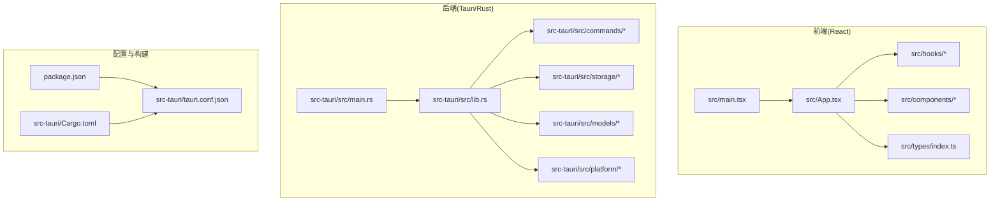
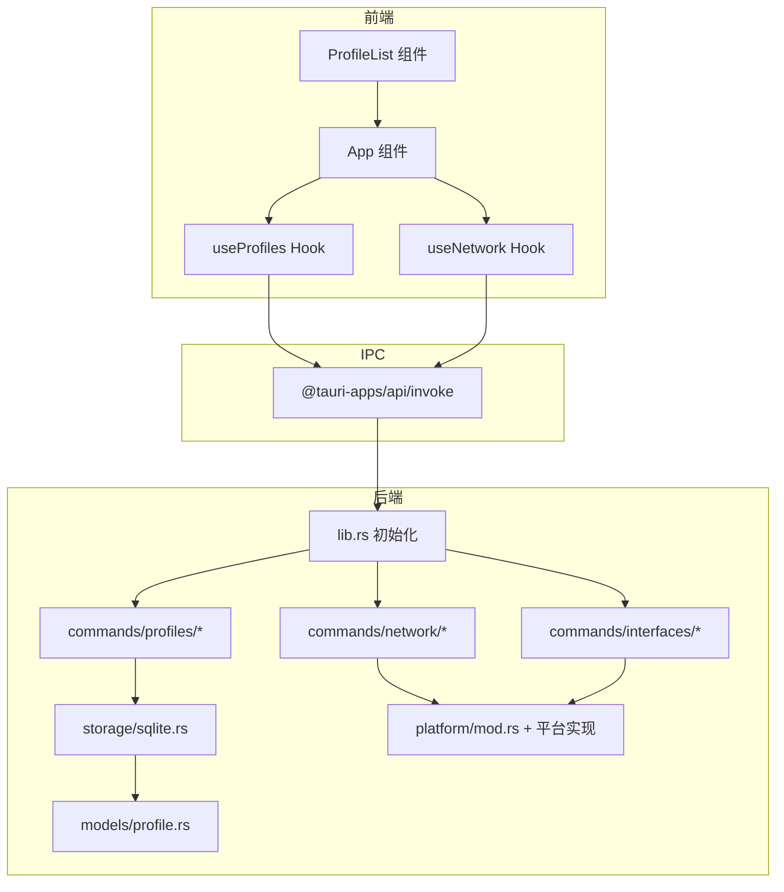
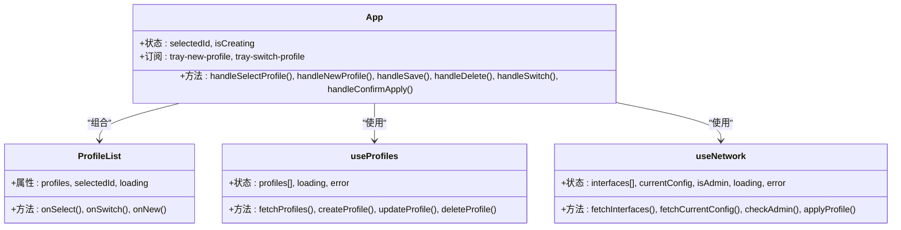
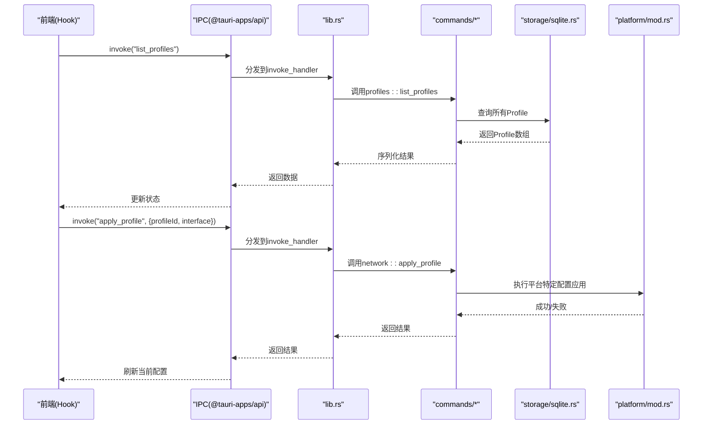
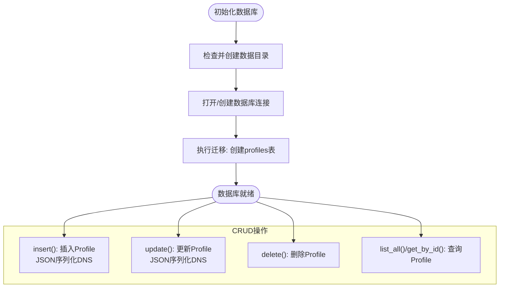
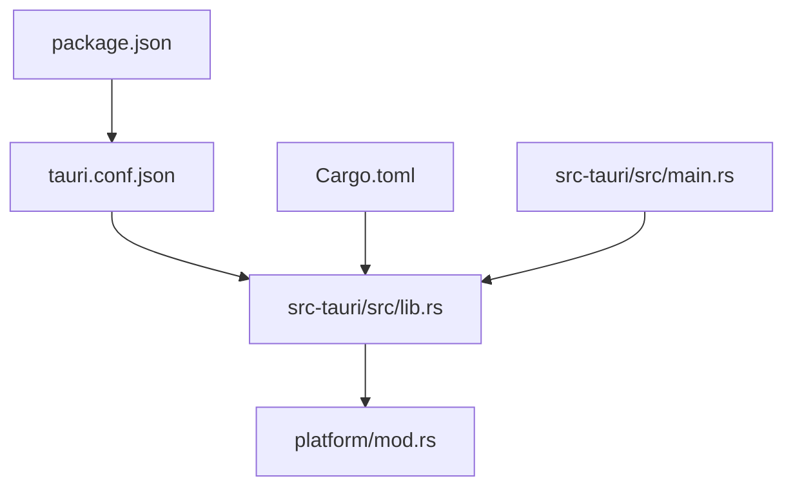
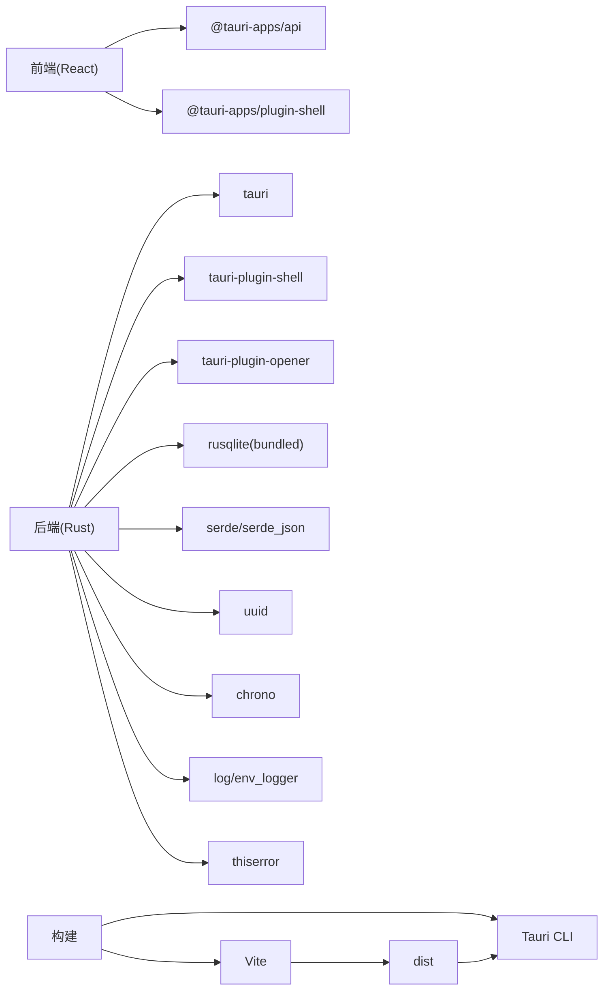

# 架构设计

<cite>
**本文引用的文件**
- [package.json](file://package.json)
- [src-tauri/Cargo.toml](file://src-tauri/Cargo.toml)
- [src-tauri/tauri.conf.json](file://src-tauri/tauri.conf.json)
- [src/main.tsx](file://src/main.tsx)
- [src/App.tsx](file://src/App.tsx)
- [src/hooks/useProfiles.ts](file://src/hooks/useProfiles.ts)
- [src/hooks/useNetwork.ts](file://src/hooks/useNetwork.ts)
- [src/types/index.ts](file://src/types/index.ts)
- [src-tauri/src/lib.rs](file://src-tauri/src/lib.rs)
- [src-tauri/src/main.rs](file://src-tauri/src/main.rs)
- [src-tauri/src/commands/mod.rs](file://src-tauri/src/commands/mod.rs)
- [src-tauri/src/storage/sqlite.rs](file://src-tauri/src/storage/sqlite.rs)
- [src-tauri/src/models/profile.rs](file://src-tauri/src/models/profile.rs)
- [src-tauri/src/platform/mod.rs](file://src-tauri/src/platform/mod.rs)
- [src/components/ProfileList.tsx](file://src/components/ProfileList.tsx)
</cite>

## 目录
1. [引言](#引言)
2. [项目结构](#项目结构)
3. [核心组件](#核心组件)
4. [架构总览](#架构总览)
5. [详细组件分析](#详细组件分析)
6. [依赖分析](#依赖分析)
7. [性能考量](#性能考量)
8. [故障排查指南](#故障排查指南)
9. [结论](#结论)
10. [附录](#附录)

## 引言
本架构文档面向IPSwitcher项目，系统性阐述其“前后端分离 + IPC通信 + 模块化设计”的整体架构。项目采用Tauri 2作为运行时，前端使用React + TypeScript，后端使用Rust，数据持久化采用SQLite。通过Tauri的IPC通道实现前端与后端的命令调用，结合平台抽象层实现跨平台网络配置管理（macOS/Windows）。文档包含系统边界、组件交互关系、数据流向图、技术决策与权衡，并提供多类架构图示以帮助不同背景读者理解。

## 项目结构
项目采用典型的Tauri应用布局：前端位于src目录，后端位于src-tauri目录；前端通过@tauri-apps/api进行IPC调用，后端通过Tauri 2的invoke_handler暴露命令接口。构建流程由Vite负责前端打包，Tauri负责将前端产物嵌入原生壳并生成可执行程序。

**图表来源**
- [src/main.tsx:1-11](file://src/main.tsx#L1-L11)
- [src/App.tsx:1-195](file://src/App.tsx#L1-L195)
- [src-tauri/src/main.rs:1-7](file://src-tauri/src/main.rs#L1-L7)
- [src-tauri/src/lib.rs:1-49](file://src-tauri/src/lib.rs#L1-L49)
- [package.json:1-27](file://package.json#L1-L27)
- [src-tauri/Cargo.toml:1-30](file://src-tauri/Cargo.toml#L1-L30)
- [src-tauri/tauri.conf.json:1-48](file://src-tauri/tauri.conf.json#L1-L48)

**章节来源**
- [package.json:1-27](file://package.json#L1-L27)
- [src-tauri/Cargo.toml:1-30](file://src-tauri/Cargo.toml#L1-L30)
- [src-tauri/tauri.conf.json:1-48](file://src-tauri/tauri.conf.json#L1-L48)
- [src/main.tsx:1-11](file://src/main.tsx#L1-L11)
- [src-tauri/src/main.rs:1-7](file://src-tauri/src/main.rs#L1-L7)

## 核心组件
- 前端应用入口与路由容器
  - 应用入口：React根节点挂载于index.html的#root元素。
  - 主应用容器：App组件协调侧边栏列表、主内容区、状态栏，并监听托盘事件。
- 前端Hook与IPC封装
  - useProfiles：封装对后端profiles相关命令的invoke调用，统一错误与加载状态。
  - useNetwork：封装interfaces、current config、admin status与apply_profile等命令。
- 后端应用初始化与命令注册
  - lib.rs：初始化日志、数据库仓库、托盘图标、窗口事件；注册invoke_handler命令集合。
  - main.rs：平台级入口，隐藏控制台窗口（Windows发布版）。
- 数据模型与校验
  - models/profile.rs：定义Profile与IpMode，包含字段校验逻辑。
- 存储层
  - storage/sqlite.rs：基于rusqlite的ProfileRepository，支持跨平台数据库路径、迁移、CRUD。
- 平台抽象
  - platform/mod.rs：定义NetworkManager trait与当前网络配置结构体，按平台导出具体实现工厂函数。

**章节来源**
- [src/main.tsx:1-11](file://src/main.tsx#L1-L11)
- [src/App.tsx:1-195](file://src/App.tsx#L1-L195)
- [src/hooks/useProfiles.ts:1-117](file://src/hooks/useProfiles.ts#L1-L117)
- [src/hooks/useNetwork.ts:1-99](file://src/hooks/useNetwork.ts#L1-L99)
- [src-tauri/src/lib.rs:1-49](file://src-tauri/src/lib.rs#L1-L49)
- [src-tauri/src/main.rs:1-7](file://src-tauri/src/main.rs#L1-L7)
- [src-tauri/src/models/profile.rs:1-88](file://src-tauri/src/models/profile.rs#L1-L88)
- [src-tauri/src/storage/sqlite.rs:1-256](file://src-tauri/src/storage/sqlite.rs#L1-L256)
- [src-tauri/src/platform/mod.rs:1-64](file://src-tauri/src/platform/mod.rs#L1-L64)

## 架构总览
IPSwitcher采用“前端UI + 后端命令服务 + 跨平台平台层 + SQLite存储”的分层架构。前端通过@tauri-apps/api的invoke与后端建立IPC通道，后端根据命令分发到对应模块（profiles/interfaces/network），并调用平台层执行系统级网络配置操作，同时通过存储层持久化配置。

**图表来源**
- [src/App.tsx:1-195](file://src/App.tsx#L1-L195)
- [src/components/ProfileList.tsx:1-52](file://src/components/ProfileList.tsx#L1-L52)
- [src/hooks/useProfiles.ts:1-117](file://src/hooks/useProfiles.ts#L1-L117)
- [src/hooks/useNetwork.ts:1-99](file://src/hooks/useNetwork.ts#L1-L99)
- [src-tauri/src/lib.rs:1-49](file://src-tauri/src/lib.rs#L1-L49)
- [src-tauri/src/commands/mod.rs:1-4](file://src-tauri/src/commands/mod.rs#L1-L4)
- [src-tauri/src/storage/sqlite.rs:1-256](file://src-tauri/src/storage/sqlite.rs#L1-L256)
- [src-tauri/src/platform/mod.rs:1-64](file://src-tauri/src/platform/mod.rs#L1-L64)
- [src-tauri/src/models/profile.rs:1-88](file://src-tauri/src/models/profile.rs#L1-L88)

## 详细组件分析

### 前端组件架构
- App容器
  - 管理选中/新建状态，协调ProfileList与ProfileForm，订阅托盘事件并触发应用流程。
- ProfileList
  - 渲染配置方案列表，支持新建、选择、切换动作。
- Hooks
  - useProfiles：封装列表、创建、更新、删除Profile的invoke调用，维护本地状态与错误。
  - useNetwork：封装接口枚举、当前配置查询、管理员权限检查、应用配置的invoke调用，并定时刷新当前配置。

**图表来源**
- [src/App.tsx:1-195](file://src/App.tsx#L1-L195)
- [src/components/ProfileList.tsx:1-52](file://src/components/ProfileList.tsx#L1-L52)
- [src/hooks/useProfiles.ts:1-117](file://src/hooks/useProfiles.ts#L1-L117)
- [src/hooks/useNetwork.ts:1-99](file://src/hooks/useNetwork.ts#L1-L99)

**章节来源**
- [src/App.tsx:1-195](file://src/App.tsx#L1-L195)
- [src/components/ProfileList.tsx:1-52](file://src/components/ProfileList.tsx#L1-L52)
- [src/hooks/useProfiles.ts:1-117](file://src/hooks/useProfiles.ts#L1-L117)
- [src/hooks/useNetwork.ts:1-99](file://src/hooks/useNetwork.ts#L1-L99)

### Rust后端命令处理机制
- 初始化与生命周期
  - lib.rs在setup阶段构建托盘、设置激活策略、隐藏窗口关闭行为；通过invoke_handler集中注册命令。
- 命令模块
  - commands/mod.rs组织profiles、interfaces、network三大命令域。
- 数据访问与错误处理
  - storage/sqlite.rs提供ProfileRepository，封装CRUD、迁移、约束冲突处理。
  - models/profile.rs提供Profile结构与字段校验，确保输入合法性。
- 平台适配
  - platform/mod.rs定义NetworkManager trait，分别在macOS与Windows平台提供实现工厂函数，屏蔽系统差异。

**图表来源**
- [src-tauri/src/lib.rs:1-49](file://src-tauri/src/lib.rs#L1-L49)
- [src-tauri/src/commands/mod.rs:1-4](file://src-tauri/src/commands/mod.rs#L1-L4)
- [src-tauri/src/storage/sqlite.rs:1-256](file://src-tauri/src/storage/sqlite.rs#L1-L256)
- [src-tauri/src/platform/mod.rs:1-64](file://src-tauri/src/platform/mod.rs#L1-L64)

**章节来源**
- [src-tauri/src/lib.rs:1-49](file://src-tauri/src/lib.rs#L1-L49)
- [src-tauri/src/commands/mod.rs:1-4](file://src-tauri/src/commands/mod.rs#L1-L4)
- [src-tauri/src/storage/sqlite.rs:1-256](file://src-tauri/src/storage/sqlite.rs#L1-L256)
- [src-tauri/src/platform/mod.rs:1-64](file://src-tauri/src/platform/mod.rs#L1-L64)

### SQLite数据存储层
- 数据库路径与迁移
  - 跨平台数据库路径：macOS位于用户应用支持目录，Windows位于APPDATA下的IPSwitcher目录。
  - 首次启动自动创建profiles表并执行迁移。
- 数据模型映射
  - Profile结构体与数据库字段映射，DNS服务器序列化为JSON字符串存储。
- 事务与并发
  - 使用Mutex保护连接，避免并发写入竞争；错误类型统一映射为AppError。

**图表来源**
- [src-tauri/src/storage/sqlite.rs:1-256](file://src-tauri/src/storage/sqlite.rs#L1-L256)

**章节来源**
- [src-tauri/src/storage/sqlite.rs:1-256](file://src-tauri/src/storage/sqlite.rs#L1-L256)

### Tauri集成与跨平台适配
- 集成方式
  - tauri.conf.json定义产品名、版本、窗口尺寸、托盘图标、构建参数（前端打包输出目录、开发URL）。
  - package.json脚本集成Vite与Tauri CLI，构建前先执行前端打包。
  - Cargo.toml声明Tauri 2、Shell与Opener插件、rusqlite(bundled)、平台目标依赖。
- 跨平台策略
  - platform/mod.rs通过cfg条件编译导出不同平台的NetworkManager实现，统一接口。
  - macOS使用Accessory激活策略隐藏Dock图标，符合菜单栏工具定位。
  - Windows发布版设置windows_subsystem为“windows”以隐藏控制台。

**图表来源**
- [src-tauri/tauri.conf.json:1-48](file://src-tauri/tauri.conf.json#L1-L48)
- [package.json:1-27](file://package.json#L1-L27)
- [src-tauri/Cargo.toml:1-30](file://src-tauri/Cargo.toml#L1-L30)
- [src-tauri/src/main.rs:1-7](file://src-tauri/src/main.rs#L1-L7)
- [src-tauri/src/lib.rs:1-49](file://src-tauri/src/lib.rs#L1-L49)
- [src-tauri/src/platform/mod.rs:1-64](file://src-tauri/src/platform/mod.rs#L1-L64)

**章节来源**
- [src-tauri/tauri.conf.json:1-48](file://src-tauri/tauri.conf.json#L1-L48)
- [package.json:1-27](file://package.json#L1-L27)
- [src-tauri/Cargo.toml:1-30](file://src-tauri/Cargo.toml#L1-L30)
- [src-tauri/src/main.rs:1-7](file://src-tauri/src/main.rs#L1-L7)
- [src-tauri/src/lib.rs:1-49](file://src-tauri/src/lib.rs#L1-L49)
- [src-tauri/src/platform/mod.rs:1-64](file://src-tauri/src/platform/mod.rs#L1-L64)

## 依赖分析
- 前端依赖
  - @tauri-apps/api用于invoke与事件监听；@tauri-apps/plugin-shell用于系统集成；React生态提供组件化能力。
- 后端依赖
  - tauri、tauri-plugin-shell、tauri-plugin-opener提供运行时与系统能力；rusqlite(bundled)提供SQLite访问；serde/serde_json用于序列化；uuid/chrono用于标识与时间戳；thiserror/env_logger用于错误与日志。
- 构建与打包
  - Vite负责前端开发与生产构建；Tauri将dist目录作为静态资源；tauri.conf.json指定构建命令与前端产物位置。

**图表来源**
- [package.json:1-27](file://package.json#L1-L27)
- [src-tauri/Cargo.toml:1-30](file://src-tauri/Cargo.toml#L1-L30)
- [src-tauri/tauri.conf.json:1-48](file://src-tauri/tauri.conf.json#L1-L48)

**章节来源**
- [package.json:1-27](file://package.json#L1-L27)
- [src-tauri/Cargo.toml:1-30](file://src-tauri/Cargo.toml#L1-L30)
- [src-tauri/tauri.conf.json:1-48](file://src-tauri/tauri.conf.json#L1-L48)

## 性能考量
- 前端
  - Hook缓存与状态最小化更新，避免不必要的重渲染；定时轮询当前配置频率适中（30秒），可根据实际场景调整。
- 后端
  - SQLite使用Mutex串行化访问，避免并发写入竞争；建议在高频写入场景引入队列或批处理优化。
  - 平台层调用系统API可能阻塞，建议在UI层显示加载态并限制并发操作。
- IPC
  - invoke调用为同步阻塞，建议批量请求与错误快速返回，减少等待时间。

## 故障排查指南
- 常见问题与定位
  - 数据库初始化失败：检查应用数据目录权限与路径解析（macOS/Windows）。
  - 网络配置应用失败：确认管理员权限、接口名称正确、平台实现可用。
  - 前端无法加载：确认Vite开发服务器已启动、tauri.conf.json中的devUrl与beforeDevCommand配置正确。
- 错误处理
  - 后端错误统一映射为AppError，前端Hook捕获并设置error状态；建议在UI层增加错误提示与重试按钮。
  - 日志：启用env_logger可在控制台查看初始化与命令执行日志。

**章节来源**
- [src-tauri/src/storage/sqlite.rs:1-256](file://src-tauri/src/storage/sqlite.rs#L1-L256)
- [src-tauri/src/lib.rs:1-49](file://src-tauri/src/lib.rs#L1-L49)
- [src/hooks/useProfiles.ts:1-117](file://src/hooks/useProfiles.ts#L1-L117)
- [src/hooks/useNetwork.ts:1-99](file://src/hooks/useNetwork.ts#L1-L99)

## 结论
IPSwitcher通过Tauri实现了前端与后端的清晰分层与稳定通信，Rust后端保证了系统级操作的安全与可靠性，SQLite提供了轻量且可靠的本地存储。平台抽象层使跨平台适配成为可能。整体架构在易用性、安全性与可扩展性之间取得平衡，适合进一步扩展网络配置模板、权限管理与系统集成能力。

## 附录
- 关键数据模型
  - Profile：包含名称、IP模式、IP地址、子网掩码、网关、DNS服务器、接口名及时间戳。
  - NetworkInterface：接口名、显示名与是否活跃。
  - CurrentNetworkConfig：当前接口的IPv4配置与是否DHCP。

**章节来源**
- [src/types/index.ts:1-30](file://src/types/index.ts#L1-L30)
- [src-tauri/src/models/profile.rs:1-88](file://src-tauri/src/models/profile.rs#L1-L88)
- [src-tauri/src/platform/mod.rs:1-64](file://src-tauri/src/platform/mod.rs#L1-L64)