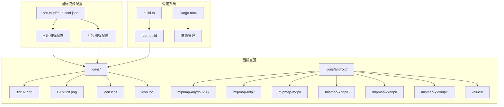
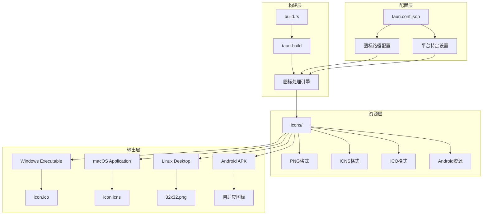
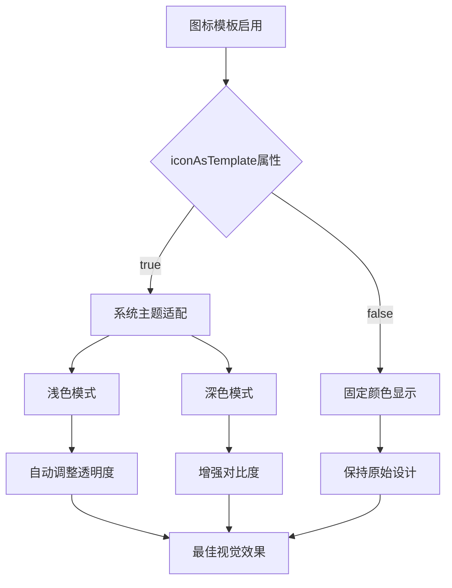
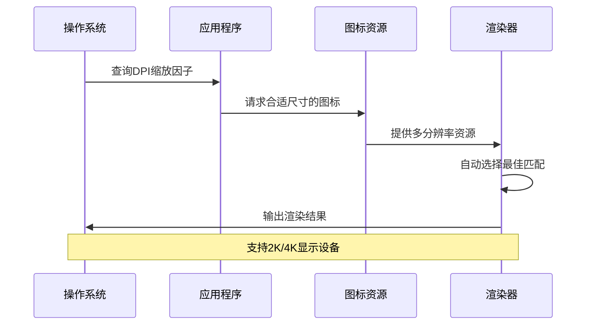
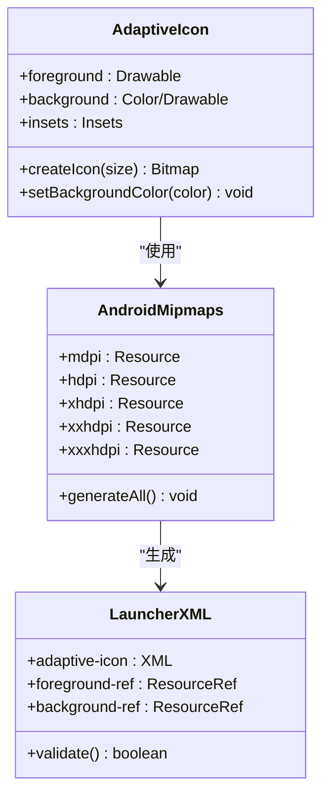
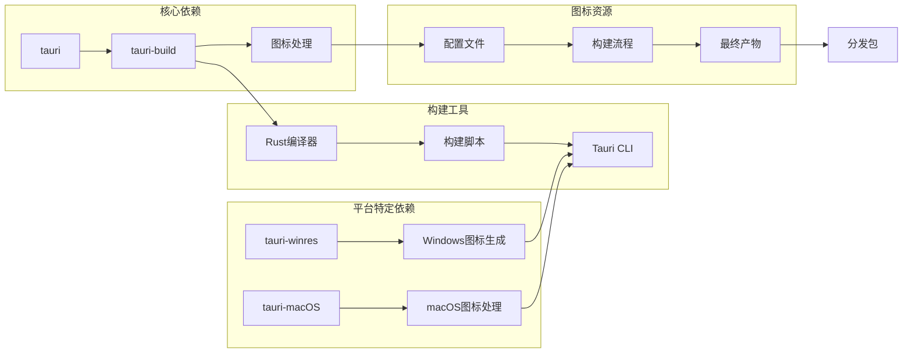

# 应用图标系统

<cite>
**本文档引用的文件**
- [tauri.conf.json](file://src-tauri/tauri.conf.json)
- [build.rs](file://src-tauri/build.rs)
- [Cargo.toml](file://src-tauri/Cargo.toml)
- [ic_launcher.xml](file://src-tauri/icons/android/mipmap-anydpi-v26/ic_launcher.xml)
- [ic_launcher_background.xml](file://src-tauri/icons/android/values/ic_launcher_background.xml)
</cite>

## 目录
1. [简介](#简介)
2. [项目结构](#项目结构)
3. [核心组件](#核心组件)
4. [架构概览](#架构概览)
5. [详细组件分析](#详细组件分析)
6. [依赖关系分析](#依赖关系分析)
7. [性能考虑](#性能考虑)
8. [故障排除指南](#故障排除指南)
9. [结论](#结论)
10. [附录](#附录)

## 简介

IPSwitcher应用图标系统是一个跨平台的图标管理解决方案，专为Tauri桌面应用程序设计。该系统支持Windows可执行文件图标和macOS应用图标的生成与管理，提供了完整的图标模板功能、尺寸适配和高DPI支持。

本系统的核心目标是确保在不同操作系统和显示密度下都能提供清晰、一致的品牌视觉体验。通过自动化的构建流程，开发者可以轻松维护多分辨率的图标资源，同时保持品牌识别度的一致性。

## 项目结构

应用图标系统主要分布在以下关键位置：



**图表来源**
- [tauri.conf.json:34-46](file://src-tauri/tauri.conf.json#L34-L46)
- [build.rs:1-3](file://src-tauri/build.rs#L1-L3)
- [Cargo.toml:9-10](file://src-tauri/Cargo.toml#L9-L10)

**章节来源**
- [tauri.conf.json:1-48](file://src-tauri/tauri.conf.json#L1-L48)
- [build.rs:1-3](file://src-tauri/build.rs#L1-L3)
- [Cargo.toml:1-31](file://src-tauri/Cargo.toml#L1-L31)

## 核心组件

### 应用图标配置

应用图标系统的核心配置集中在Tauri配置文件中，定义了多个关键参数：

- **trayIcon配置**: 指定托盘图标的路径和模板属性
- **bundle.icon数组**: 定义打包时使用的多种图标格式
- **平台特定设置**: 包含macOS的最低系统版本要求

### 构建系统集成

构建系统通过Rust的构建脚本与Tauri工具链深度集成：

- **tauri-build依赖**: 提供图标处理和打包功能
- **自动构建流程**: 在编译过程中自动处理图标资源
- **跨平台兼容性**: 支持Windows和macOS的特定需求

### Android图标适配

系统还包含完整的Android图标适配方案：

- **自适应图标格式**: 支持现代Android版本的动态图标
- **多密度支持**: 覆盖从mdpi到xxxhdpi的各种显示密度
- **背景色配置**: 提供统一的图标背景色方案

**章节来源**
- [tauri.conf.json:26-46](file://src-tauri/tauri.conf.json#L26-L46)
- [build.rs:1-3](file://src-tauri/build.rs#L1-L3)
- [Cargo.toml:9-10](file://src-tauri/Cargo.toml#L9-L10)

## 架构概览

应用图标系统采用分层架构设计，确保跨平台兼容性和可维护性：



**图表来源**
- [tauri.conf.json:34-46](file://src-tauri/tauri.conf.json#L34-L46)
- [build.rs:1-3](file://src-tauri/build.rs#L1-L3)
- [Cargo.toml:9-10](file://src-tauri/Cargo.toml#L9-L10)

## 详细组件分析

### 图标模板功能

图标模板功能是系统的重要特性，特别适用于macOS和Linux平台：



**图表来源**
- [tauri.conf.json:27-28](file://src-tauri/tauri.conf.json#L27-L28)

模板功能的工作原理基于操作系统的动态主题适配机制。当启用模板模式时，系统会根据当前的主题设置自动调整图标的显示效果，确保在不同背景下都有良好的可读性和视觉一致性。

### 图标尺寸适配策略

系统支持多种图标尺寸以满足不同使用场景的需求：

| 尺寸规格 | 使用场景 | 分辨率要求 | 平台支持 |
|---------|----------|-----------|----------|
| 32x32 | 托盘图标 | 32x32像素 | Windows, macOS, Linux |
| 128x128 | 应用图标 | 128x128像素 | 所有平台 |
| 1024x1024 | macOS应用商店 | 1024x1024像素 | macOS |
| 256x256 | 高DPI显示 | 256x256像素 | Windows, Linux |

### 高DPI支持实现

高DPI支持通过以下机制实现：



**图表来源**
- [tauri.conf.json:37-42](file://src-tauri/tauri.conf.json#L37-L42)

### Android图标适配

Android平台采用自适应图标格式，提供灵活的图标设计能力：



**图表来源**
- [ic_launcher.xml:1-5](file://src-tauri/icons/android/mipmap-anydpi-v26/ic_launcher.xml#L1-L5)
- [ic_launcher_background.xml:1-4](file://src-tauri/icons/android/values/ic_launcher_background.xml#L1-L4)

**章节来源**
- [ic_launcher.xml:1-5](file://src-tauri/icons/android/mipmap-anydpi-v26/ic_launcher.xml#L1-L5)
- [ic_launcher_background.xml:1-4](file://src-tauri/icons/android/values/ic_launcher_background.xml#L1-L4)

## 依赖关系分析

图标系统与其他项目组件的依赖关系如下：



**图表来源**
- [Cargo.toml:9-10](file://src-tauri/Cargo.toml#L9-L10)
- [Cargo.toml:30](file://src-tauri/Cargo.toml#L30)

**章节来源**
- [Cargo.toml:1-31](file://src-tauri/Cargo.toml#L1-L31)

## 性能考虑

### 图标加载优化

系统在性能方面采用了多项优化策略：

- **延迟加载**: 图标资源按需加载，减少启动时间
- **缓存机制**: 已加载的图标在内存中缓存，避免重复解码
- **多线程处理**: 图标生成和转换过程使用异步处理

### 内存使用控制

- **尺寸限制**: 最大图标尺寸控制在合理范围内
- **格式优化**: PNG格式提供无损压缩
- **资源池**: 复用图形资源，减少内存碎片

## 故障排除指南

### 常见问题及解决方案

| 问题类型 | 症状描述 | 可能原因 | 解决方案 |
|---------|----------|----------|----------|
| 图标不显示 | 托盘或应用图标缺失 | 路径配置错误 | 检查tauri.conf.json中的iconPath |
| 颜色异常 | 图标颜色不正确 | 模板模式设置错误 | 验证iconAsTemplate属性 |
| 显示模糊 | 高DPI环境下图标模糊 | 缺少高分辨率图标 | 添加更高分辨率的图标文件 |
| 平台兼容性 | 特定平台图标不工作 | 平台特定配置缺失 | 检查对应平台的图标配置 |

### 调试步骤

1. **验证配置文件**: 确保所有图标路径都存在且可访问
2. **检查构建日志**: 查看构建过程中是否有图标处理错误
3. **测试不同平台**: 在目标平台上验证图标显示效果
4. **清理缓存**: 删除构建缓存后重新构建项目

**章节来源**
- [tauri.conf.json:26-46](file://src-tauri/tauri.conf.json#L26-L46)

## 结论

IPSwitcher应用图标系统提供了一个完整、跨平台的图标管理解决方案。通过精心设计的配置架构和自动化构建流程，系统能够确保在各种平台和显示条件下都提供优质的图标体验。

系统的主要优势包括：

- **跨平台一致性**: 统一的品牌视觉体验
- **自动化流程**: 减少手动配置和维护工作
- **高DPI支持**: 适配现代高分辨率显示设备
- **模板功能**: 动态适配系统主题
- **扩展性**: 易于添加新的图标尺寸和平台支持

## 附录

### 图标设计指南

#### 颜色方案选择

建议采用以下颜色策略：
- **主色调**: 选择与品牌一致的颜色
- **对比度**: 确保在浅色和深色主题下都有良好对比度
- **简洁性**: 避免过多颜色，保持设计简洁

#### 品牌一致性保证

- **字体风格**: 使用与品牌一致的字体
- **形状元素**: 保持图标几何形状的一致性
- **间距比例**: 维持内部元素的相对比例关系

### 完整配置示例

以下是最小化配置示例：

```json
{
  "app": {
    "trayIcon": {
      "iconPath": "icons/32x32.png",
      "iconAsTemplate": true
    }
  },
  "bundle": {
    "icon": [
      "icons/32x32.png",
      "icons/128x128.png",
      "icons/icon.icns",
      "icons/icon.ico"
    ]
  }
}
```

### 平台特定优化建议

#### Windows平台
- 使用ICO格式支持多分辨率
- 考虑Windows 11的新图标样式
- 测试不同DPI缩放设置下的显示效果

#### macOS平台
- 提供1024x1024像素的应用图标
- 利用模板模式实现深色/浅色主题适配
- 遵循macOS的人机界面指南

#### Linux平台
- 提供SVG矢量图标以支持任意缩放
- 考虑不同桌面环境的图标主题
- 测试在各种窗口管理器下的显示效果