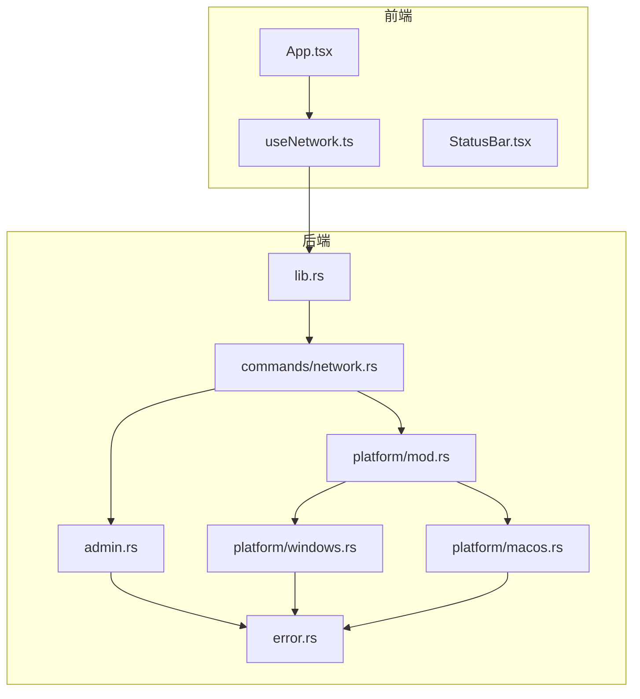
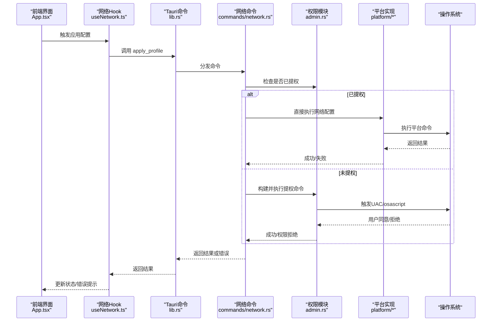
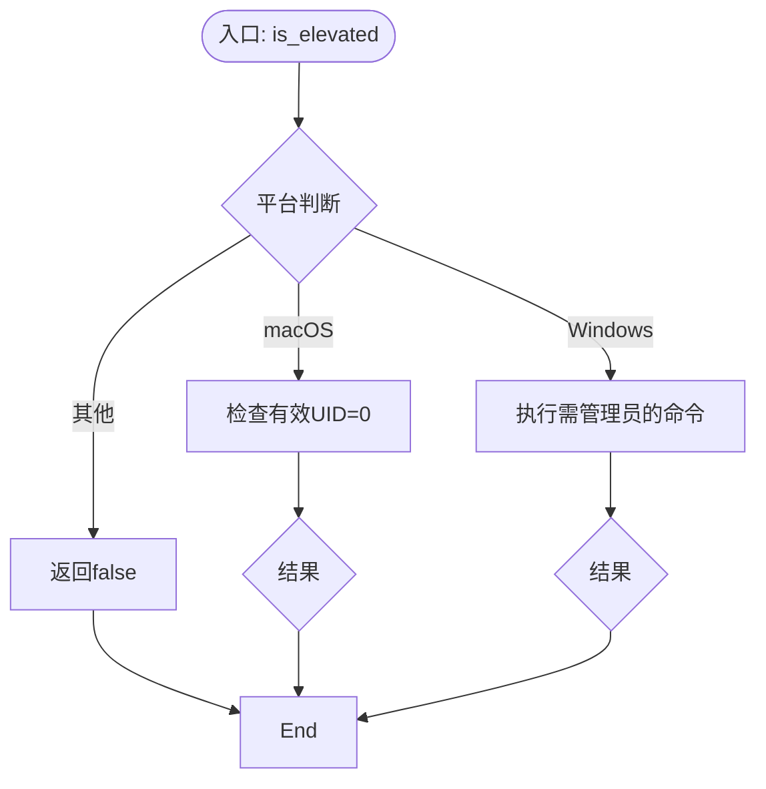
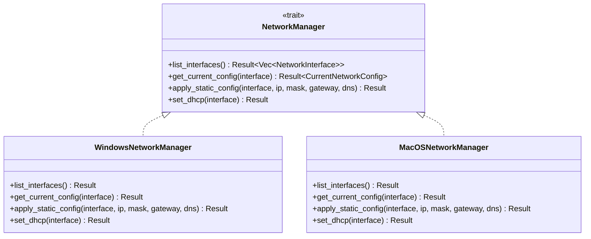
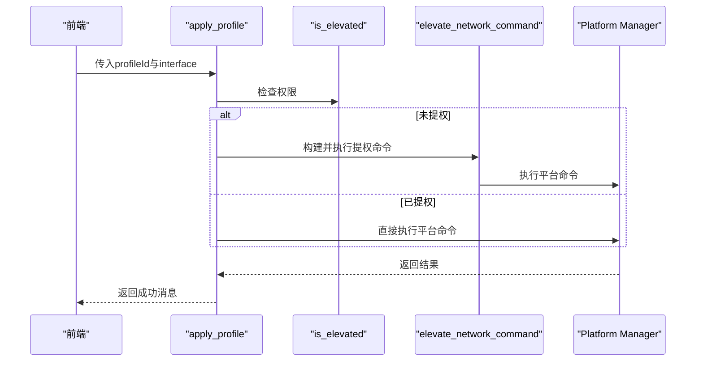
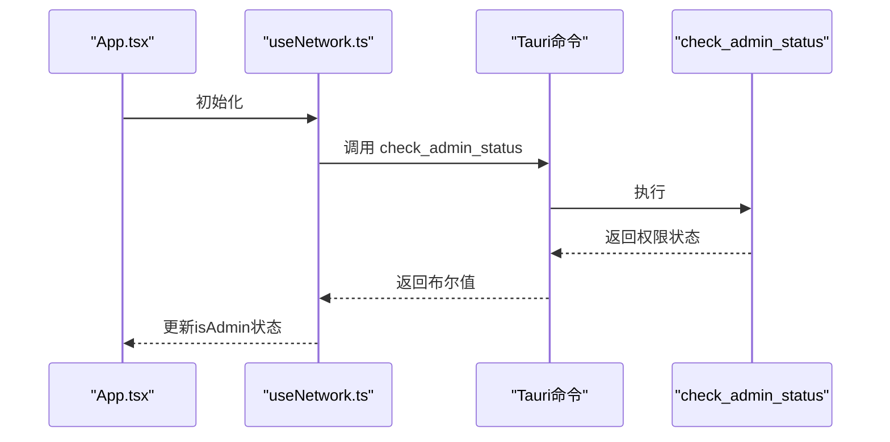
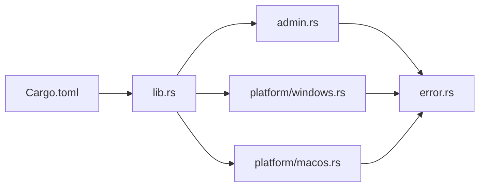
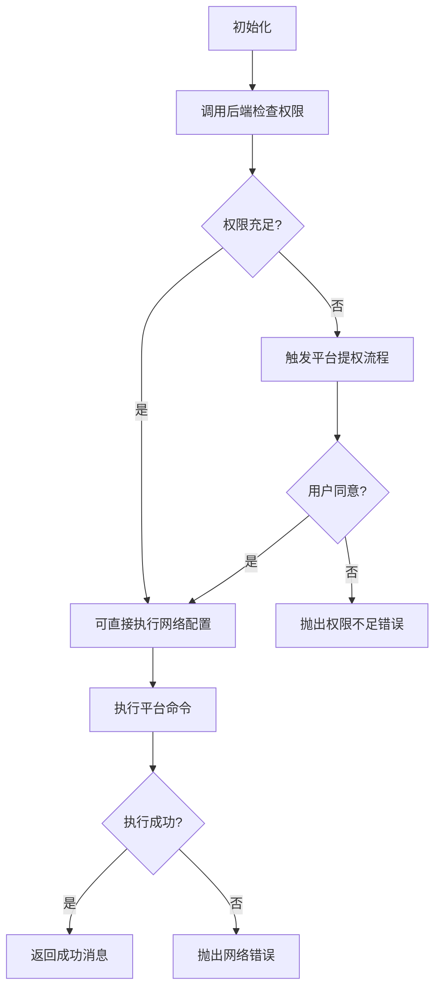

# 管理员权限管理

<cite>
**本文档引用的文件**
- [src-tauri/src/admin.rs](file://src-tauri/src/admin.rs)
- [src-tauri/src/platform/mod.rs](file://src-tauri/src/platform/mod.rs)
- [src-tauri/src/platform/windows.rs](file://src-tauri/src/platform/windows.rs)
- [src-tauri/src/platform/macos.rs](file://src-tauri/src/platform/macos.rs)
- [src-tauri/src/commands/network.rs](file://src-tauri/src/commands/network.rs)
- [src-tauri/src/error.rs](file://src-tauri/src/error.rs)
- [src-tauri/src/lib.rs](file://src-tauri/src/lib.rs)
- [src-tauri/Cargo.toml](file://src-tauri/Cargo.toml)
- [src-tauri/tauri.conf.json](file://src-tauri/tauri.conf.json)
- [src/hooks/useNetwork.ts](file://src/hooks/useNetwork.ts)
- [src/App.tsx](file://src/App.tsx)
- [src/components/StatusBar.tsx](file://src/components/StatusBar.tsx)
- [src-tauri/Info.plist](file://src-tauri/Info.plist)
</cite>

## 目录
1. [简介](#简介)
2. [项目结构](#项目结构)
3. [核心组件](#核心组件)
4. [架构总览](#架构总览)
5. [详细组件分析](#详细组件分析)
6. [依赖关系分析](#依赖关系分析)
7. [性能考虑](#性能考虑)
8. [故障排除指南](#故障排除指南)
9. [结论](#结论)
10. [附录](#附录)

## 简介
本文件聚焦于管理员权限管理的设计与实现，覆盖权限检测、权限提升流程、跨平台差异（Windows UAC 与 macOS 权限请求）、权限状态监控、错误处理与最佳实践。系统通过 Tauri 前后端桥接调用，在需要时触发平台原生命令以完成网络配置变更，并在权限不足时引导用户进行权限提升。

## 项目结构
权限管理相关代码主要分布在 Rust 后端与 TypeScript 前端两部分：
- 后端（Rust）：权限检测与提升、平台适配、命令封装、错误类型定义
- 前端（TypeScript）：权限状态监控、用户提示、事件监听与错误展示

图表来源
- [src-tauri/src/lib.rs:36-46](file://src-tauri/src/lib.rs#L36-L46)
- [src-tauri/src/commands/network.rs:3-6](file://src-tauri/src/commands/network.rs#L3-L6)
- [src-tauri/src/admin.rs:1-24](file://src-tauri/src/admin.rs#L1-L24)
- [src-tauri/src/platform/mod.rs:54-63](file://src-tauri/src/platform/mod.rs#L54-L63)
- [src-tauri/src/platform/windows.rs:8-38](file://src-tauri/src/platform/windows.rs#L8-L38)
- [src-tauri/src/platform/macos.rs:8-43](file://src-tauri/src/platform/macos.rs#L8-L43)

章节来源
- [src-tauri/src/lib.rs:14-49](file://src-tauri/src/lib.rs#L14-L49)
- [src-tauri/src/commands/network.rs:9-26](file://src-tauri/src/commands/network.rs#L9-L26)

## 核心组件
- 权限检测与提升（admin.rs）
  - 检测当前进程是否具备管理员权限
  - 在需要时构建并执行平台特定的提权命令
- 平台抽象层（platform/mod.rs）
  - 定义统一的网络管理接口与数据模型
  - 提供工厂函数按操作系统返回具体实现
- 平台实现（platform/windows.rs, platform/macos.rs）
  - Windows：使用 netsh 与 PowerShell 调用 UAC 提升
  - macOS：使用 networksetup 与 osascript 请求管理员权限
- 命令层（commands/network.rs）
  - 对外暴露 Tauri 命令：获取网络配置、应用配置、检查权限
  - 根据权限状态决定直接执行或触发提权
- 错误类型（error.rs）
  - 统一错误分类：网络、权限不足等
- 前端集成（useNetwork.ts, App.tsx, StatusBar.tsx）
  - 调用后端命令，监控权限状态，展示错误与状态

章节来源
- [src-tauri/src/admin.rs:3-24](file://src-tauri/src/admin.rs#L3-L24)
- [src-tauri/src/platform/mod.rs:12-32](file://src-tauri/src/platform/mod.rs#L12-L32)
- [src-tauri/src/platform/windows.rs:8-38](file://src-tauri/src/platform/windows.rs#L8-L38)
- [src-tauri/src/platform/macos.rs:8-43](file://src-tauri/src/platform/macos.rs#L8-L43)
- [src-tauri/src/commands/network.rs:9-26](file://src-tauri/src/commands/network.rs#L9-L26)
- [src-tauri/src/error.rs:3-28](file://src-tauri/src/error.rs#L3-L28)
- [src/hooks/useNetwork.ts:40-47](file://src/hooks/useNetwork.ts#L40-L47)

## 架构总览
系统采用“前端驱动、后端执行”的分层架构。前端通过 Tauri 命令调用后端能力；后端根据当前平台与权限状态，选择直接执行或触发原生权限提升流程。

图表来源
- [src-tauri/src/lib.rs:36-46](file://src-tauri/src/lib.rs#L36-L46)
- [src-tauri/src/commands/network.rs:29-95](file://src-tauri/src/commands/network.rs#L29-L95)
- [src-tauri/src/admin.rs:27-49](file://src-tauri/src/admin.rs#L27-L49)
- [src-tauri/src/platform/windows.rs:88-145](file://src-tauri/src/platform/windows.rs#L88-L145)
- [src-tauri/src/platform/macos.rs:112-151](file://src-tauri/src/platform/macos.rs#L112-L151)

## 详细组件分析

### 权限检测与提升（admin.rs）
- 权限检测
  - macOS：通过系统调用判断有效用户 ID 是否为 root
  - Windows：通过执行需要管理员权限的命令并检查返回状态
  - 其他平台：默认返回非管理员
- 权限提升
  - macOS：使用脚本语言执行带管理员权限的命令，捕获用户取消与执行失败
  - Windows：通过 PowerShell 启动带提升权限的进程执行命令
  - 失败场景：区分用户取消与执行失败，抛出相应错误类型

图表来源
- [src-tauri/src/admin.rs:4-24](file://src-tauri/src/admin.rs#L4-L24)

章节来源
- [src-tauri/src/admin.rs:3-24](file://src-tauri/src/admin.rs#L3-L24)
- [src-tauri/src/admin.rs:27-49](file://src-tauri/src/admin.rs#L27-L49)
- [src-tauri/src/admin.rs:77-99](file://src-tauri/src/admin.rs#L77-L99)
- [src-tauri/src/admin.rs:142-164](file://src-tauri/src/admin.rs#L142-L164)

### 平台抽象与实现（platform/mod.rs, platform/windows.rs, platform/macos.rs）
- 抽象层
  - 定义网络接口列表、当前配置读取、静态配置应用、DHCP 切换等方法
  - 数据模型包含接口名、显示名、是否激活、IP/DNS/网关等字段
- Windows 实现
  - 使用 netsh 列表接口、查询配置、设置静态 IP/DNS、切换 DHCP
  - 设置 DNS 时先设置主 DNS，再逐个添加备用 DNS，失败记录警告
- macOS 实现
  - 使用 networksetup 列表服务、查询信息、设置手动/DHCP、设置 DNS
  - 切换到 DHCP 时同时清空自定义 DNS

图表来源
- [src-tauri/src/platform/mod.rs:12-32](file://src-tauri/src/platform/mod.rs#L12-L32)
- [src-tauri/src/platform/windows.rs:8-172](file://src-tauri/src/platform/windows.rs#L8-L172)
- [src-tauri/src/platform/macos.rs:8-174](file://src-tauri/src/platform/macos.rs#L8-L174)

章节来源
- [src-tauri/src/platform/mod.rs:5-42](file://src-tauri/src/platform/mod.rs#L5-L42)
- [src-tauri/src/platform/windows.rs:8-172](file://src-tauri/src/platform/windows.rs#L8-L172)
- [src-tauri/src/platform/macos.rs:8-174](file://src-tauri/src/platform/macos.rs#L8-L174)

### 命令层（commands/network.rs）
- 获取当前网络配置：自动选择活动接口或使用指定接口，调用平台实现读取
- 应用配置方案：根据方案模式（手动/DHCP）决定执行路径
  - 若未提权：调用权限提升函数执行平台命令
  - 若已提权：直接调用平台实现
- 检查权限状态：对外暴露命令，便于前端监控

图表来源
- [src-tauri/src/commands/network.rs:29-95](file://src-tauri/src/commands/network.rs#L29-L95)
- [src-tauri/src/admin.rs:27-49](file://src-tauri/src/admin.rs#L27-L49)
- [src-tauri/src/platform/mod.rs:54-63](file://src-tauri/src/platform/mod.rs#L54-L63)

章节来源
- [src-tauri/src/commands/network.rs:9-26](file://src-tauri/src/commands/network.rs#L9-L26)
- [src-tauri/src/commands/network.rs:29-95](file://src-tauri/src/commands/network.rs#L29-L95)
- [src-tauri/src/commands/network.rs:97-100](file://src-tauri/src/commands/network.rs#L97-L100)

### 前端集成与权限监控（useNetwork.ts, App.tsx, StatusBar.tsx）
- 权限状态监控：启动时调用后端命令检查权限，更新本地状态
- 应用配置：调用后端命令应用方案，发生错误时捕获并展示
- 状态栏：展示当前接口、IP/DHCP 状态与连接指示

图表来源
- [src/hooks/useNetwork.ts:40-47](file://src/hooks/useNetwork.ts#L40-L47)
- [src-tauri/src/commands/network.rs:97-100](file://src-tauri/src/commands/network.rs#L97-L100)

章节来源
- [src/hooks/useNetwork.ts:40-47](file://src/hooks/useNetwork.ts#L40-L47)
- [src/App.tsx:115-143](file://src/App.tsx#L115-L143)
- [src/components/StatusBar.tsx:8-38](file://src/components/StatusBar.tsx#L8-L38)

## 依赖关系分析
- 编译期目标依赖
  - macOS：依赖系统库以实现权限检测
  - Windows：无额外编译期依赖
- 运行时外部依赖
  - Windows：PowerShell、cmd、netsh
  - macOS：osascript、networksetup
- 错误类型
  - 统一通过错误枚举分类，便于前端识别与提示

图表来源
- [src-tauri/Cargo.toml:26-31](file://src-tauri/Cargo.toml#L26-L31)
- [src-tauri/src/lib.rs:14-49](file://src-tauri/src/lib.rs#L14-L49)
- [src-tauri/src/admin.rs:1-1](file://src-tauri/src/admin.rs#L1-L1)
- [src-tauri/src/platform/windows.rs:1-1](file://src-tauri/src/platform/windows.rs#L1-L1)
- [src-tauri/src/platform/macos.rs:1-1](file://src-tauri/src/platform/macos.rs#L1-L1)
- [src-tauri/src/error.rs:3-28](file://src-tauri/src/error.rs#L3-L28)

章节来源
- [src-tauri/Cargo.toml:12-31](file://src-tauri/Cargo.toml#L12-L31)
- [src-tauri/src/error.rs:3-28](file://src-tauri/src/error.rs#L3-L28)

## 性能考虑
- 权限检测成本极低，仅做一次系统调用或命令返回判断
- 网络配置应用涉及系统命令执行，建议避免频繁调用；当前实现通过定时器每 30 秒刷新一次当前配置，减少不必要的系统调用
- 提权流程在 Windows 上通过 PowerShell 启动隐藏窗口执行，尽量降低对用户交互的干扰

章节来源
- [src/hooks/useNetwork.ts:76-86](file://src/hooks/useNetwork.ts#L76-L86)
- [src-tauri/src/admin.rs:142-164](file://src-tauri/src/admin.rs#L142-L164)

## 故障排除指南
- 权限不足
  - 现象：应用配置失败，返回网络错误或权限不足
  - 排查：确认已提权；Windows 可检查 UAC 对话框是否被忽略；macOS 可检查系统偏好设置中的辅助功能授权
- 用户取消权限
  - 现象：macOS 提示用户取消；Windows 可能无响应或立即失败
  - 排查：重新触发权限提升；确保系统允许弹窗
- 命令执行失败
  - 现象：平台命令返回非零退出码
  - 排查：检查接口名称、IP 地址格式、DNS 列表；Windows 确认 netsh 可用；macOS 确认 networksetup 可用
- 状态栏异常
  - 现象：无法获取网络状态或显示未知
  - 排查：确认接口处于连接状态；前端定时刷新逻辑是否正常

章节来源
- [src-tauri/src/admin.rs:93-98](file://src-tauri/src/admin.rs#L93-L98)
- [src-tauri/src/platform/windows.rs:105-109](file://src-tauri/src/platform/windows.rs#L105-L109)
- [src-tauri/src/platform/macos.rs:129-133](file://src-tauri/src/platform/macos.rs#L129-L133)
- [src-tauri/src/error.rs:23-27](file://src-tauri/src/error.rs#L23-L27)

## 结论
该权限管理方案通过清晰的前后端职责划分与平台抽象，实现了跨平台的权限检测与提升。Windows 通过 UAC 对话框与 PowerShell 提升，macOS 通过 osascript 请求管理员权限。前端负责权限状态监控与错误展示，后端负责安全地执行系统命令并返回一致的错误语义。整体设计兼顾安全性与可用性，适合桌面网络配置类应用。

## 附录

### 权限状态监控与错误处理流程

图表来源
- [src-tauri/src/commands/network.rs:53-70](file://src-tauri/src/commands/network.rs#L53-L70)
- [src-tauri/src/admin.rs:142-164](file://src-tauri/src/admin.rs#L142-L164)
- [src-tauri/src/platform/macos.rs:112-151](file://src-tauri/src/platform/macos.rs#L112-L151)

### 最佳安全实践
- 仅在必要时触发权限提升，避免频繁弹窗
- 明确提示用户权限用途与风险，提供可理解的错误信息
- 对外部命令参数进行严格校验，防止注入
- 记录日志但不泄露敏感信息
- 在 macOS 上确保 Info.plist 中的 UI 元素设置符合预期，避免影响权限请求体验

章节来源
- [src-tauri/Info.plist:4-7](file://src-tauri/Info.plist#L4-L7)
- [src-tauri/tauri.conf.json:34-46](file://src-tauri/tauri.conf.json#L34-L46)