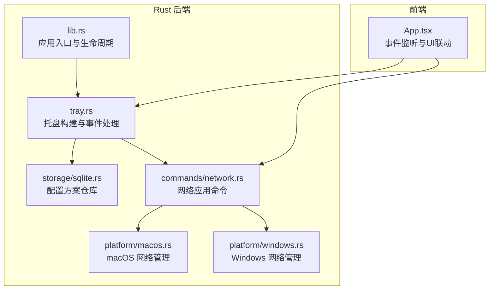
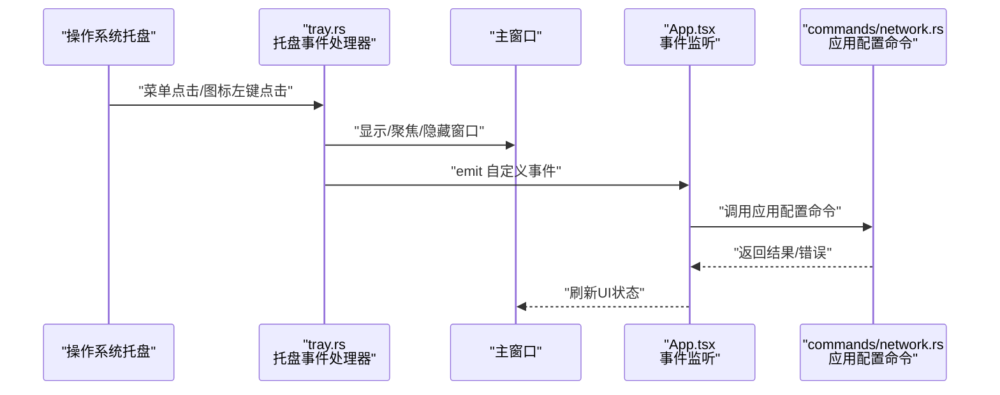
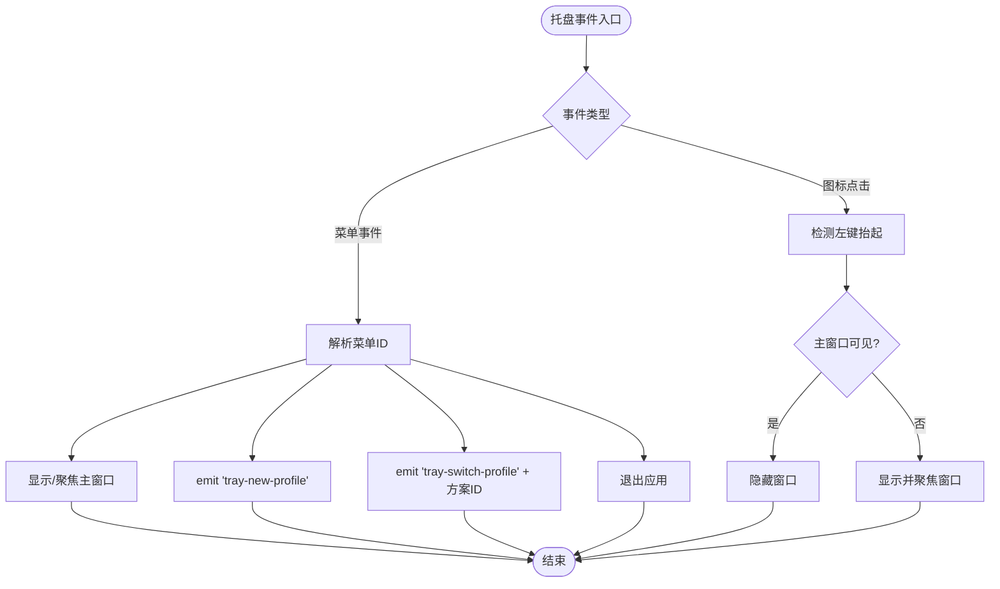
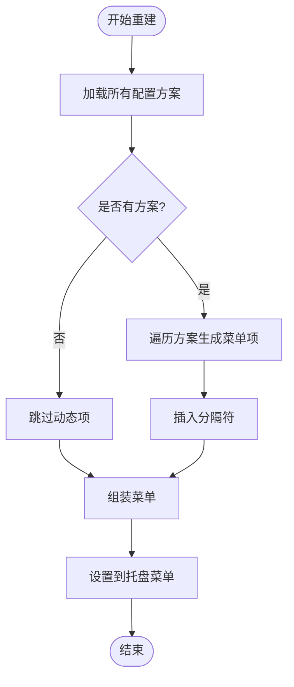
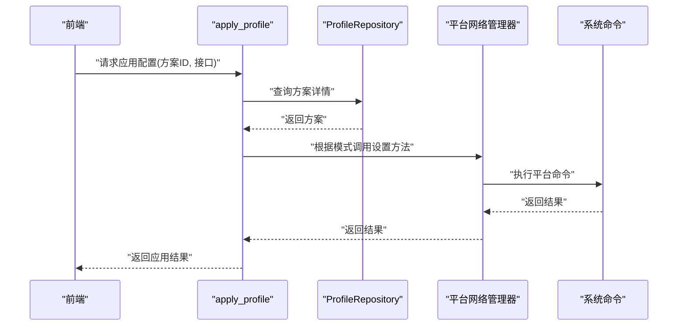
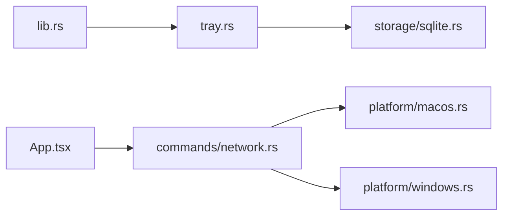

# 系统托盘集成

<cite>
**本文引用的文件**
- [src-tauri/src/tray.rs](file://src-tauri/src/tray.rs)
- [src-tauri/src/lib.rs](file://src-tauri/src/lib.rs)
- [src-tauri/tauri.conf.json](file://src-tauri/tauri.conf.json)
- [src-tauri/Cargo.toml](file://src-tauri/Cargo.toml)
- [src-tauri/src/storage/sqlite.rs](file://src-tauri/src/storage/sqlite.rs)
- [src/App.tsx](file://src/App.tsx)
- [src-tauri/src/commands/network.rs](file://src-tauri/src/commands/network.rs)
- [src-tauri/src/platform/macos.rs](file://src-tauri/src/platform/macos.rs)
- [src-tauri/src/platform/windows.rs](file://src-tauri/src/platform/windows.rs)
</cite>

## 目录
1. [简介](#简介)
2. [项目结构](#项目结构)
3. [核心组件](#核心组件)
4. [架构总览](#架构总览)
5. [详细组件分析](#详细组件分析)
6. [依赖关系分析](#依赖关系分析)
7. [性能考虑](#性能考虑)
8. [故障排查指南](#故障排查指南)
9. [结论](#结论)
10. [附录](#附录)

## 简介
本文件系统性阐述该应用的系统托盘集成方案，覆盖托盘图标的创建与配置、托盘菜单设计与构建、事件处理机制（菜单点击、鼠标点击、窗口显示控制）、动态菜单重建、图标模板设置、跨平台兼容性与用户体验优化，并提供最佳实践与常见问题解决方案。

## 项目结构
该应用采用 Tauri v2 架构，托盘功能位于 Rust 后端，前端通过 @tauri-apps/api 进行事件监听与交互。托盘初始化在应用启动时完成，菜单项动态来源于数据库中的配置方案列表。

图表来源
- [src-tauri/src/lib.rs:13-28](file://src-tauri/src/lib.rs#L13-L28)
- [src-tauri/src/tray.rs:9-90](file://src-tauri/src/tray.rs#L9-L90)
- [src-tauri/src/storage/sqlite.rs:8-27](file://src-tauri/src/storage/sqlite.rs#L8-L27)
- [src-tauri/src/commands/network.rs:9-95](file://src-tauri/src/commands/network.rs#L9-L95)
- [src-tauri/src/platform/macos.rs:8-43](file://src-tauri/src/platform/macos.rs#L8-L43)
- [src-tauri/src/platform/windows.rs:8-38](file://src-tauri/src/platform/windows.rs#L8-L38)
- [src/App.tsx:115-143](file://src/App.tsx#L115-L143)

章节来源
- [src-tauri/src/lib.rs:13-28](file://src-tauri/src/lib.rs#L13-L28)
- [src-tauri/tauri.conf.json:26-29](file://src-tauri/tauri.conf.json#L26-L29)

## 核心组件
- 托盘构建器：负责创建托盘图标、菜单、绑定事件处理器。
- 动态菜单重建器：根据数据库中配置方案列表生成“切换到: 方案名”菜单项。
- 前端事件监听：接收托盘触发的自定义事件并驱动 UI 行为。
- 网络命令：执行网络配置应用，支持管理员权限提升与跨平台命令调用。

章节来源
- [src-tauri/src/tray.rs:9-90](file://src-tauri/src/tray.rs#L9-L90)
- [src-tauri/src/tray.rs:92-135](file://src-tauri/src/tray.rs#L92-L135)
- [src-tauri/src/storage/sqlite.rs:76-108](file://src-tauri/src/storage/sqlite.rs#L76-L108)
- [src/App.tsx:115-143](file://src/App.tsx#L115-L143)
- [src-tauri/src/commands/network.rs:28-95](file://src-tauri/src/commands/network.rs#L28-L95)

## 架构总览
托盘初始化在应用启动阶段完成，随后根据数据库中的配置方案动态生成菜单项；用户点击托盘菜单或托盘图标时，后端通过事件分发到前端，前端再调用网络命令应用配置。

图表来源
- [src-tauri/src/tray.rs:38-85](file://src-tauri/src/tray.rs#L38-L85)
- [src/App.tsx:115-143](file://src/App.tsx#L115-L143)
- [src-tauri/src/commands/network.rs:28-95](file://src-tauri/src/commands/network.rs#L28-L95)

## 详细组件分析

### 托盘图标与菜单构建
- 图标来源：优先使用应用默认窗口图标，若未配置则回退到配置文件中的 trayIcon.iconPath。
- 菜单项：
  - 显示主窗口
  - 新建方案
  - 退出应用
  - 动态“切换到: 方案名”子菜单（基于数据库）
- 图标模板：启用 iconAsTemplate 以适配系统深浅主题。
- 工具提示：设置为应用名称，便于识别。

章节来源
- [src-tauri/src/tray.rs:10-38](file://src-tauri/src/tray.rs#L10-L38)
- [src-tauri/tauri.conf.json:26-29](file://src-tauri/tauri.conf.json#L26-L29)

### 托盘事件处理机制
- 菜单事件：
  - 显示主窗口：展示并聚焦主窗口。
  - 新建方案：展示窗口并触发前端事件，打开表单。
  - 切换到: 方案名：展示窗口并触发前端事件，携带目标方案 ID。
  - 退出：优雅退出应用。
- 鼠标点击事件：
  - 左键抬起：根据窗口可见性切换显示/隐藏，并在显示时聚焦。

图表来源
- [src-tauri/src/tray.rs:38-85](file://src-tauri/src/tray.rs#L38-L85)

章节来源
- [src-tauri/src/tray.rs:38-85](file://src-tauri/src/tray.rs#L38-L85)

### 动态菜单重建
- 触发时机：当配置方案列表变化时调用重建函数。
- 实现逻辑：
  - 读取所有配置方案，逐项生成“切换到: 方案名”菜单项。
  - 在固定项之前插入分隔符，避免与固定项混淆。
  - 重新组装菜单并设置到托盘实例。

图表来源
- [src-tauri/src/tray.rs:92-135](file://src-tauri/src/tray.rs#L92-L135)
- [src-tauri/src/storage/sqlite.rs:76-108](file://src-tauri/src/storage/sqlite.rs#L76-L108)

章节来源
- [src-tauri/src/tray.rs:92-135](file://src-tauri/src/tray.rs#L92-L135)
- [src-tauri/src/storage/sqlite.rs:76-108](file://src-tauri/src/storage/sqlite.rs#L76-L108)

### 前端事件监听与窗口控制
- 监听托盘事件：
  - 新建方案：清空选中并进入创建模式。
  - 切换方案：根据方案 ID 查找并调用应用配置命令。
- 窗口行为：
  - 显示/聚焦/隐藏由后端统一控制，确保跨平台一致性。

章节来源
- [src/App.tsx:115-143](file://src/App.tsx#L115-L143)

### 网络配置应用流程
- 命令入口：根据方案 ID 获取配置并应用到指定网络接口。
- 平台差异：
  - macOS：使用 networksetup 命令设置静态/DHCP 与 DNS。
  - Windows：使用 netsh 命令设置静态/DHCP 与 DNS。
- 权限处理：非管理员时触发提升流程，管理员直接执行。

图表来源
- [src-tauri/src/commands/network.rs:28-95](file://src-tauri/src/commands/network.rs#L28-L95)
- [src-tauri/src/storage/sqlite.rs:110-144](file://src-tauri/src/storage/sqlite.rs#L110-L144)
- [src-tauri/src/platform/macos.rs:112-151](file://src-tauri/src/platform/macos.rs#L112-L151)
- [src-tauri/src/platform/windows.rs:88-145](file://src-tauri/src/platform/windows.rs#L88-L145)

章节来源
- [src-tauri/src/commands/network.rs:28-95](file://src-tauri/src/commands/network.rs#L28-L95)
- [src-tauri/src/platform/macos.rs:112-151](file://src-tauri/src/platform/macos.rs#L112-L151)
- [src-tauri/src/platform/windows.rs:88-145](file://src-tauri/src/platform/windows.rs#L88-L145)

## 依赖关系分析
- 应用入口依赖托盘模块进行初始化。
- 托盘模块依赖存储模块读取配置方案列表。
- 前端通过事件与后端交互，间接依赖网络命令模块。
- 网络命令模块依赖平台抽象层，实现跨平台差异化。

图表来源
- [src-tauri/src/lib.rs:18-28](file://src-tauri/src/lib.rs#L18-L28)
- [src-tauri/src/tray.rs:9-90](file://src-tauri/src/tray.rs#L9-L90)
- [src-tauri/src/storage/sqlite.rs:8-27](file://src-tauri/src/storage/sqlite.rs#L8-L27)
- [src-tauri/src/commands/network.rs:9-95](file://src-tauri/src/commands/network.rs#L9-L95)
- [src-tauri/src/platform/macos.rs:8-43](file://src-tauri/src/platform/macos.rs#L8-L43)
- [src-tauri/src/platform/windows.rs:8-38](file://src-tauri/src/platform/windows.rs#L8-L38)
- [src/App.tsx:115-143](file://src/App.tsx#L115-L143)

章节来源
- [src-tauri/src/lib.rs:18-28](file://src-tauri/src/lib.rs#L18-L28)
- [src-tauri/src/tray.rs:9-90](file://src-tauri/src/tray.rs#L9-L90)
- [src-tauri/src/storage/sqlite.rs:8-27](file://src-tauri/src/storage/sqlite.rs#L8-L27)
- [src-tauri/src/commands/network.rs:9-95](file://src-tauri/src/commands/network.rs#L9-L95)
- [src-tauri/src/platform/macos.rs:8-43](file://src-tauri/src/platform/macos.rs#L8-L43)
- [src-tauri/src/platform/windows.rs:8-38](file://src-tauri/src/platform/windows.rs#L8-L38)
- [src/App.tsx:115-143](file://src/App.tsx#L115-L143)

## 性能考虑
- 动态菜单重建仅在配置方案变更时触发，避免频繁重建造成 UI 抖动。
- 使用状态缓存与最小化事件发射，减少不必要的窗口显示/隐藏切换。
- 数据库访问加锁与迁移在应用启动阶段完成，运行期尽量避免阻塞主线程。

## 故障排查指南
- 托盘图标不显示或样式异常
  - 检查配置文件 trayIcon.iconPath 是否存在且格式正确。
  - 确认 iconAsTemplate 设置是否符合预期。
  - 参考路径：[trayIcon 配置:26-29](file://src-tauri/tauri.conf.json#L26-L29)
- 菜单点击无响应
  - 确认事件 ID 与匹配逻辑一致，尤其是动态“switch_profile:”前缀。
  - 参考路径：[菜单事件处理:38-67](file://src-tauri/src/tray.rs#L38-L67)
- 左键点击未切换窗口显示状态
  - 检查鼠标事件类型与按钮状态判断是否正确。
  - 参考路径：[图标点击事件:68-85](file://src-tauri/src/tray.rs#L68-L85)
- 动态菜单未更新
  - 确认在新增/删除/修改配置方案后调用了重建函数。
  - 参考路径：[动态菜单重建:92-135](file://src-tauri/src/tray.rs#L92-L135)
- 应用配置失败（权限不足）
  - macOS：networksetup 命令需管理员权限。
  - Windows：netsh 命令需管理员权限。
  - 参考路径：[macOS 网络命令:120-151](file://src-tauri/src/platform/macos.rs#L120-L151)，[Windows 网络命令:96-145](file://src-tauri/src/platform/windows.rs#L96-L145)
- 前端未收到托盘事件
  - 确认事件监听初始化与清理逻辑正确。
  - 参考路径：[前端事件监听:115-143](file://src/App.tsx#L115-L143)

章节来源
- [src-tauri/tauri.conf.json:26-29](file://src-tauri/tauri.conf.json#L26-L29)
- [src-tauri/src/tray.rs:38-85](file://src-tauri/src/tray.rs#L38-L85)
- [src-tauri/src/tray.rs:92-135](file://src-tauri/src/tray.rs#L92-L135)
- [src-tauri/src/platform/macos.rs:120-151](file://src-tauri/src/platform/macos.rs#L120-L151)
- [src-tauri/src/platform/windows.rs:96-145](file://src-tauri/src/platform/windows.rs#L96-L145)
- [src/App.tsx:115-143](file://src/App.tsx#L115-L143)

## 结论
该托盘集成方案通过后端统一构建与事件处理、前端事件驱动 UI 的方式，实现了跨平台的稳定体验。动态菜单重建与图标模板设置提升了可维护性与视觉一致性；结合平台特定的网络命令实现，满足了不同系统的差异化需求。建议在实际部署中关注权限与图标资源的配置，并在方案变更时及时重建菜单以保证用户体验。

## 附录
- 最佳实践
  - 图标模板：始终启用 iconAsTemplate，确保深浅主题适配。
  - 菜单组织：将动态项置于固定项之前并添加分隔符，避免与固定项混淆。
  - 事件命名：使用语义化事件名并在前后端约定一致的载荷格式。
  - 错误处理：对平台命令执行结果进行校验与错误上报。
- 参考路径
  - [应用入口与托盘初始化:18-28](file://src-tauri/src/lib.rs#L18-L28)
  - [托盘构建与事件处理:9-90](file://src-tauri/src/tray.rs#L9-L90)
  - [动态菜单重建:92-135](file://src-tauri/src/tray.rs#L92-L135)
  - [前端事件监听:115-143](file://src/App.tsx#L115-L143)
  - [网络应用命令:28-95](file://src-tauri/src/commands/network.rs#L28-L95)
  - [macOS 网络管理:112-151](file://src-tauri/src/platform/macos.rs#L112-L151)
  - [Windows 网络管理:88-145](file://src-tauri/src/platform/windows.rs#L88-L145)
  - [数据库与模型:76-108](file://src-tauri/src/storage/sqlite.rs#L76-L108)