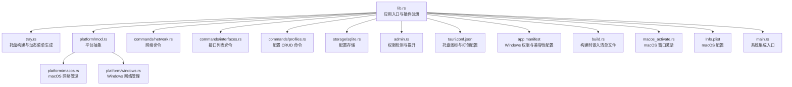
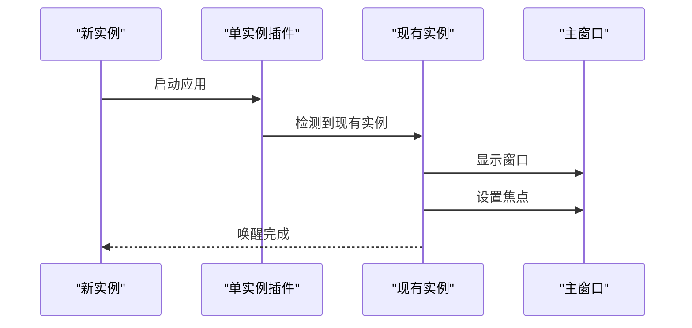
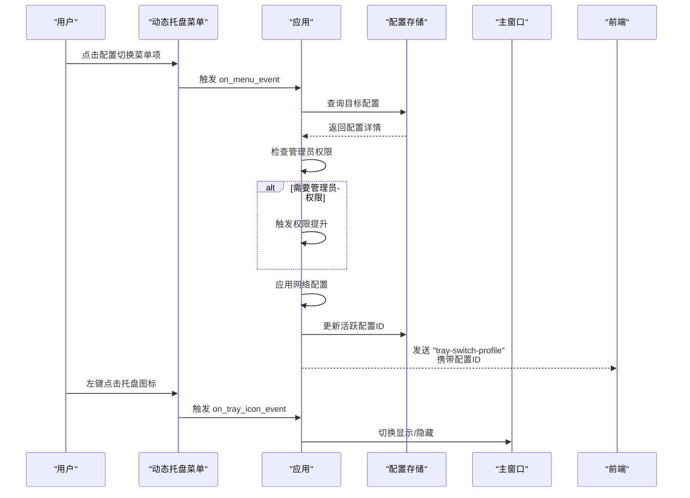
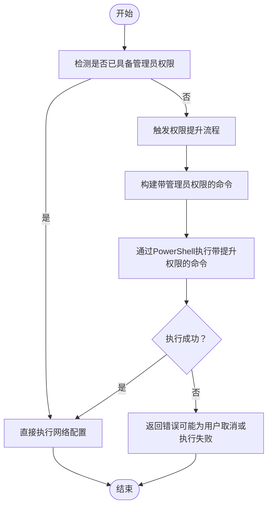
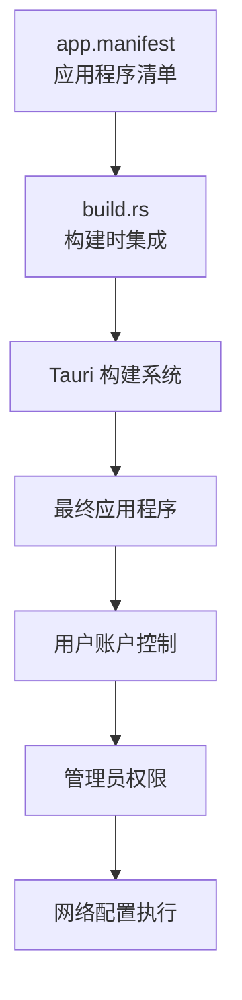
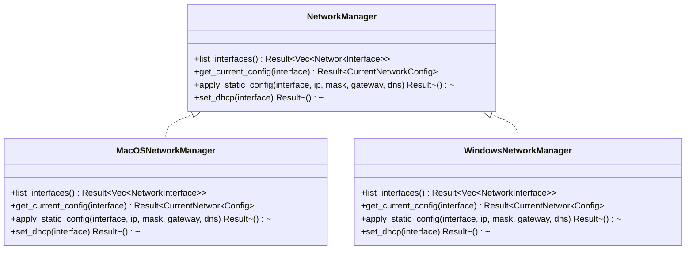
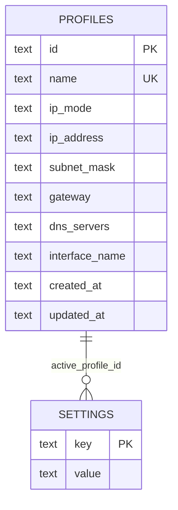
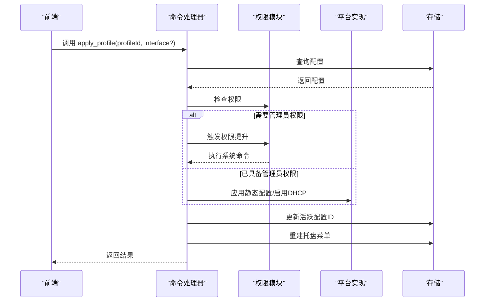
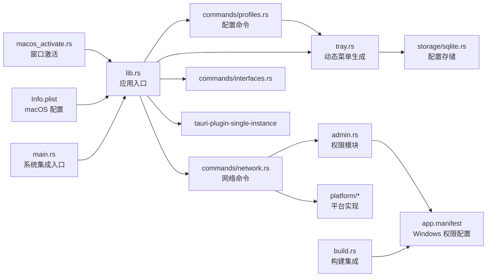

# 系统集成

<cite>
**本文引用的文件**
- [src-tauri/src/lib.rs](file://src-tauri/src/lib.rs)
- [src-tauri/src/main.rs](file://src-tauri/src/main.rs)
- [src-tauri/src/tray.rs](file://src-tauri/src/tray.rs)
- [src-tauri/src/admin.rs](file://src-tauri/src/admin.rs)
- [src-tauri/src/platform/mod.rs](file://src-tauri/src/platform/mod.rs)
- [src-tauri/src/platform/macos.rs](file://src-tauri/src/platform/macos.rs)
- [src-tauri/src/platform/windows.rs](file://src-tauri/src/platform/windows.rs)
- [src-tauri/src/commands/network.rs](file://src-tauri/src/commands/network.rs)
- [src-tauri/src/commands/interfaces.rs](file://src-tauri/src/commands/interfaces.rs)
- [src-tauri/src/commands/profiles.rs](file://src-tauri/src/commands/profiles.rs)
- [src-tauri/src/storage/sqlite.rs](file://src-tauri/src/storage/sqlite.rs)
- [src-tauri/src/models/profile.rs](file://src-tauri/src/models/profile.rs)
- [src-tauri/tauri.conf.json](file://src-tauri/tauri.conf.json)
- [src-tauri/Cargo.toml](file://src-tauri/Cargo.toml)
- [src-tauri/app.manifest](file://src-tauri/app.manifest)
- [src-tauri/build.rs](file://src-tauri/build.rs)
- [src-tauri/Info.plist](file://src-tauri/Info.plist)
- [src-tauri/src/macos_activate.rs](file://src-tauri/src/macos_activate.rs)
</cite>

## 更新摘要
**变更内容**
- **新增单实例控制集成**：集成 tauri-plugin-single-instance 插件，防止多个应用程序实例同时运行，支持单实例唤醒和窗口焦点管理
- **增强托盘菜单功能**：新增动态菜单生成、快速配置切换和菜单重建机制，支持活跃配置标识和实时状态同步
- **更新Windows管理员权限管理**：通过PowerShell启动带提升权限的命令行执行，减少前台干扰，新增应用程序清单文件支持
- **改进macOS平台特性**：通过 Info.plist 和 macOS Activate 模块实现更好的窗口激活和焦点管理
- **完善事件通信机制**：托盘菜单事件与前端建立双向通信，支持配置切换和新建方案操作

## 目录
1. [简介](#简介)
2. [项目结构](#项目结构)
3. [核心组件](#核心组件)
4. [架构总览](#架构总览)
5. [详细组件分析](#详细组件分析)
6. [依赖关系分析](#依赖关系分析)
7. [性能与可靠性](#性能与可靠性)
8. [故障排查指南](#故障排查指南)
9. [结论](#结论)
10. [附录：平台与兼容性](#附录平台与兼容性)

## 简介
本文件聚焦于系统的"系统集成"能力，围绕以下主题展开：系统托盘集成（托盘图标、动态菜单、事件）、单实例控制机制、管理员权限管理与权限提升流程、跨平台网络配置（macOS 与 Windows）、应用图标与平台特性、以及与前端的事件通信。文档以代码为依据，结合可视化图示帮助读者快速理解实现方式与交互流程。

**更新** 本次更新重点介绍了单实例控制的集成，通过 tauri-plugin-single-instance 插件防止多个应用程序实例同时运行，支持单实例唤醒和窗口焦点管理。同时增强了系统托盘功能，包括动态菜单生成、快速配置切换和菜单重建机制，以及改进的Windows和macOS平台特定功能。

## 项目结构
后端采用 Tauri v2 Rust 应用，前端通过 Vite 构建并通过 Tauri 暴露命令与事件。系统托盘在应用启动时初始化；网络配置通过平台抽象层调用系统命令；管理员权限检查与提升在需要时触发；配置数据持久化使用 SQLite；单实例控制通过专用插件实现。



**图表来源**
- [src-tauri/src/lib.rs:13-48](file://src-tauri/src/lib.rs#L13-L48)
- [src-tauri/src/tray.rs:9-90](file://src-tauri/src/tray.rs#L9-L90)
- [src-tauri/src/platform/mod.rs:54-63](file://src-tauri/src/platform/mod.rs#L54-L63)
- [src-tauri/src/platform/macos.rs:8-43](file://src-tauri/src/platform/macos.rs#L8-L43)
- [src-tauri/src/platform/windows.rs:8-38](file://src-tauri/src/platform/windows.rs#L8-L38)
- [src-tauri/src/commands/network.rs:9-26](file://src-tauri/src/commands/network.rs#L9-L26)
- [src-tauri/src/commands/interfaces.rs:4-7](file://src-tauri/src/commands/interfaces.rs#L4-L7)
- [src-tauri/src/commands/profiles.rs:9-22](file://src-tauri/src/commands/profiles.rs#L9-L22)
- [src-tauri/src/storage/sqlite.rs:8-27](file://src-tauri/src/storage/sqlite.rs#L8-L27)
- [src-tauri/src/admin.rs:3-24](file://src-tauri/src/admin.rs#L3-L24)
- [src-tauri/tauri.conf.json:26-29](file://src-tauri/tauri.conf.json#L26-L29)
- [src-tauri/app.manifest:1-40](file://src-tauri/app.manifest#L1-40)
- [src-tauri/build.rs:1-12](file://src-tauri/build.rs#L1-12)
- [src-tauri/src/macos_activate.rs:1-24](file://src-tauri/src/macos_activate.rs#L1-L24)
- [src-tauri/Info.plist:1-8](file://src-tauri/Info.plist#L1-L8)
- [src-tauri/src/main.rs:1-7](file://src-tauri/src/main.rs#L1-L7)

**章节来源**
- [src-tauri/src/lib.rs:13-48](file://src-tauri/src/lib.rs#L13-L48)
- [src-tauri/tauri.conf.json:26-29](file://src-tauri/tauri.conf.json#L26-L29)

## 核心组件
- **单实例控制**：集成 tauri-plugin-single-instance 插件，防止多个应用程序实例同时运行，支持单实例唤醒和窗口焦点管理。
- **动态托盘菜单**：在应用启动时创建托盘图标与菜单，根据数据库中的配置方案动态生成切换选项，并在配置变化时自动重建菜单。
- **快速配置切换**：通过托盘菜单直接切换网络配置方案，支持一键应用预设的网络设置。
- **管理员权限管理**：检测当前进程是否具备管理员权限；在网络配置变更时按需触发权限提升。**新增** Windows平台通过应用程序清单文件请求管理员权限，避免重复UAC提示。
- **平台抽象**：统一的网络管理接口，分别在 macOS 与 Windows 上实现具体逻辑。
- **数据持久化**：SQLite 存储网络配置方案，支持增删改查与约束校验。
- **前端事件**：通过 Tauri 事件通道与前端交互，实现托盘菜单触发的业务动作。

**章节来源**
- [src-tauri/src/lib.rs:19-26](file://src-tauri/src/lib.rs#L19-L26)
- [src-tauri/src/tray.rs:9-90](file://src-tauri/src/tray.rs#L9-L90)
- [src-tauri/src/admin.rs:3-24](file://src-tauri/src/admin.rs#L3-L24)
- [src-tauri/src/platform/mod.rs:12-32](file://src-tauri/src/platform/mod.rs#L12-L32)
- [src-tauri/src/storage/sqlite.rs:8-27](file://src-tauri/src/storage/sqlite.rs#L8-L27)

## 架构总览
系统采用"前端（Vite）+ 后端（Tauri/Rust）"双层结构。后端负责系统级操作（托盘、权限、网络配置、单实例控制），并通过命令与事件与前端通信。

```mermaid
graph TB
subgraph "前端"
FE["Web 页面<br/>Vite 构建产物"]
end
subgraph "后端"
TAURI["Tauri 引擎"]
CMD["命令处理器<br/>profiles/network/interfaces"]
TRAY["托盘模块<br/>动态菜单生成"]
ADMIN["权限模块"]
PLATFORM["平台抽象层"]
STORE["存储模块"]
SINGLE["单实例控制<br/>tauri-plugin-single-instance"]
end
FE <- --> TAURI
TAURI --> CMD
TAURI --> TRAY
TAURI --> ADMIN
TAURI --> SINGLE
CMD --> PLATFORM
CMD --> STORE
TRAY --> FE
SINGLE --> FE
```

**图表来源**
- [src-tauri/src/lib.rs:18-47](file://src-tauri/src/lib.rs#L18-L47)
- [src-tauri/src/tray.rs:38-85](file://src-tauri/src/tray.rs#L38-L85)
- [src-tauri/src/commands/network.rs:9-26](file://src-tauri/src/commands/network.rs#L9-L26)
- [src-tauri/src/storage/sqlite.rs:8-27](file://src-tauri/src/storage/sqlite.rs#L8-L27)
- [src-tauri/Cargo.toml:15](file://src-tauri/Cargo.toml#L15)

## 详细组件分析

### 单实例控制与系统集成
- **单实例插件集成**
  - 通过 `tauri-plugin-single-instance` 插件实现单实例控制，防止多个应用程序实例同时运行。
  - 在应用启动时注册单实例监听器，处理来自其他实例的唤醒请求。
  - 支持自定义唤醒回调函数，实现窗口显示和焦点管理。
- **窗口唤醒机制**
  - 当检测到已有实例时，新实例通过回调函数唤醒现有实例的主窗口。
  - macOS 平台使用 `macos_activate::activate_app()` 确保窗口获得焦点。
  - Windows 平台通过窗口句柄显示和设置焦点。
- **系统集成入口**
  - 在 `main.rs` 中设置 `windows_subsystem = "windows"` 防止额外控制台窗口。
  - 通过 `lib.rs` 的 `run()` 函数统一管理所有插件和初始化流程。



**图表来源**
- [src-tauri/src/lib.rs:20-26](file://src-tauri/src/lib.rs#L20-L26)
- [src-tauri/src/macos_activate.rs:10-15](file://src-tauri/src/macos_activate.rs#L10-L15)
- [src-tauri/src/main.rs:1-7](file://src-tauri/src/main.rs#L1-L7)

**章节来源**
- [src-tauri/src/lib.rs:19-26](file://src-tauri/src/lib.rs#L19-L26)
- [src-tauri/src/macos_activate.rs:1-24](file://src-tauri/src/macos_activate.rs#L1-L24)
- [src-tauri/src/main.rs:1-7](file://src-tauri/src/main.rs#L1-L7)

### 动态托盘菜单与快速配置切换
- **动态菜单生成**
  - 使用应用默认窗口图标作为托盘图标，并设置为模板图标以适配系统主题。
  - 菜单包含"显示主窗口""新建方案""退出"等基础项；当存在配置方案时，动态生成"切换到: 方案名"的子菜单项。
  - 活跃配置方案在菜单中以勾选符号标识，便于用户识别当前使用的配置。
- **快速配置切换**
  - 托盘菜单中的每个配置方案都对应一个独立的切换选项，用户可直接点击进行快速切换。
  - 切换操作会自动应用相应的网络配置，包括静态IP设置或DHCP配置。
  - 支持管理员权限检测，必要时自动触发权限提升流程。
- **菜单重建机制**
  - 当配置发生变化（创建、更新、删除配置）时，托盘菜单会自动重建以反映最新状态。
  - 菜单重建通过 `rebuild_tray_menu` 函数实现，确保菜单项与数据库中的配置保持一致。
- **事件处理**
  - 菜单项点击：根据 ID 分发到不同分支，如显示窗口、新建方案、退出或切换到某配置。
  - 托盘图标点击：左键点击用于切换主窗口显示/隐藏。
  - 快速切换：通过 `switch_profile:<id>` 格式的 ID 直接触发配置切换。



**图表来源**
- [src-tauri/src/tray.rs:38-85](file://src-tauri/src/tray.rs#L38-L85)
- [src-tauri/src/tray.rs:92-135](file://src-tauri/src/tray.rs#L92-L135)
- [src-tauri/src/commands/network.rs:95-113](file://src-tauri/src/commands/network.rs#L95-L113)

**章节来源**
- [src-tauri/src/tray.rs:9-90](file://src-tauri/src/tray.rs#L9-L90)
- [src-tauri/src/tray.rs:92-135](file://src-tauri/src/tray.rs#L92-L135)
- [src-tauri/src/tray.rs:126-133](file://src-tauri/src/tray.rs#L126-L133)

### 管理员权限管理与权限提升
- **权限检测**
  - macOS：通过系统调用判断有效用户 ID 是否为 root。
  - Windows：通过执行系统命令并检查返回状态判断是否具备管理员权限。
- **权限提升**
  - macOS：通过脚本工具执行带管理员权限的命令。
  - Windows：通过 PowerShell 启动带提升权限的命令行执行，**更新** 使用 Start-Process 命令以隐藏窗口并等待执行完成，减少前台干扰。
- **流程控制**
  - 当网络配置需要管理员权限且当前非管理员时，调用提升函数；成功后执行对应网络配置命令；失败则返回错误信息（含用户取消场景）。
- **Windows 权限管理增强**
  - **新增** 通过应用程序清单文件（app.manifest）请求管理员权限，避免重复UAC提示。
  - **新增** 在构建时通过 build.rs 嵌入清单文件，确保应用启动时即具备管理员权限。
  - **新增** 支持 Windows 7-11 兼容性设置，确保在不同版本Windows上正常运行。



**图表来源**
- [src-tauri/src/admin.rs:3-24](file://src-tauri/src/admin.rs#L3-L24)
- [src-tauri/src/admin.rs:26-49](file://src-tauri/src/admin.rs#L26-L49)
- [src-tauri/src/admin.rs:77-99](file://src-tauri/src/admin.rs#L77-L99)
- [src-tauri/src/admin.rs:142-164](file://src-tauri/src/admin.rs#L142-L164)

**章节来源**
- [src-tauri/src/admin.rs:3-24](file://src-tauri/src/admin.rs#L3-L24)
- [src-tauri/src/admin.rs:26-49](file://src-tauri/src/admin.rs#L26-L49)
- [src-tauri/src/admin.rs:77-99](file://src-tauri/src/admin.rs#L77-L99)
- [src-tauri/src/admin.rs:142-164](file://src-tauri/src/admin.rs#L142-L164)

### Windows 权限管理与应用程序清单
- **应用程序清单文件**
  - **新增** Windows 应用程序清单文件（app.manifest）定义了应用的权限需求和兼容性设置。
  - 请求管理员权限（level="requireAdministrator"），避免每次执行网络配置时出现重复UAC提示。
  - 支持 Windows 7 到 Windows 11 的兼容性，通过 supportedOS 标签指定支持的操作系统ID。
  - 配置高分辨率显示器DPI感知，支持 PerMonitorV2 和 PerMonitor 模式。
- **构建时集成**
  - **新增** build.rs 在构建时将 app.manifest 嵌入到最终的应用程序中。
  - 通过 tauri_build::WindowsAttributes::new().app_manifest() 方法集成清单文件。
- **权限提升实现**
  - **更新** Windows 权限提升通过 PowerShell 的 Start-Process 命令实现，使用 -Verb RunAs 参数请求管理员权限。
  - 使用 -Wait 参数等待命令执行完成，确保权限提升流程的完整性。
  - 使用 -WindowStyle Hidden 参数隐藏PowerShell窗口，减少前台干扰。



**图表来源**
- [src-tauri/app.manifest:1-40](file://src-tauri/app.manifest#L1-40)
- [src-tauri/build.rs:1-12](file://src-tauri/build.rs#L1-12)

**章节来源**
- [src-tauri/app.manifest:1-40](file://src-tauri/app.manifest#L1-40)
- [src-tauri/build.rs:1-12](file://src-tauri/build.rs#L1-12)
- [src-tauri/src/admin.rs:141-164](file://src-tauri/src/admin.rs#L141-L164)

### macOS 平台特性与窗口激活
- **Info.plist 配置**
  - 通过 `LSUIElement=true` 设置应用为辅助工具，隐藏 Dock 图标。
  - 配合 Tauri 的 `ActivationPolicy::Accessory` 实现后台运行场景。
- **窗口激活机制**
  - 使用 `macos_activate.rs` 模块调用 Objective-C 方法激活应用窗口。
  - 通过 `activateIgnoringOtherApps: true` 确保窗口在前台显示。
  - 与托盘菜单事件配合，实现单实例唤醒时的窗口焦点管理。
- **系统集成**
  - 在单实例回调中调用 `activate_app()` 确保窗口获得焦点。
  - 与 Tauri 的窗口管理机制协同工作。

**章节来源**
- [src-tauri/Info.plist:1-8](file://src-tauri/Info.plist#L1-L8)
- [src-tauri/src/macos_activate.rs:1-24](file://src-tauri/src/macos_activate.rs#L1-L24)
- [src-tauri/src/lib.rs:32-38](file://src-tauri/src/lib.rs#L32-L38)

### 平台抽象与网络配置
- **抽象层**
  - 定义统一的网络管理接口，包含接口枚举、当前配置模型与方法：列举接口、查询当前配置、应用静态配置、启用 DHCP。
- **macOS 实现**
  - 使用系统工具列举网络服务、查询信息、设置静态 IP/DNS、启用 DHCP。
  - 通过 `networksetup` 命令执行网络配置，需要管理员权限。
- **Windows 实现**
  - 使用系统工具列举接口、查询配置、设置静态 IP/DNS、启用 DHCP。
  - **更新** 通过 `netsh` 命令执行网络配置，需要管理员权限。
- **错误处理**
  - 对系统命令执行结果进行检查，失败时返回统一错误类型，便于前端展示。



**图表来源**
- [src-tauri/src/platform/mod.rs:12-32](file://src-tauri/src/platform/mod.rs#L12-L32)
- [src-tauri/src/platform/macos.rs:8-43](file://src-tauri/src/platform/macos.rs#L8-L43)
- [src-tauri/src/platform/windows.rs:8-38](file://src-tauri/src/platform/windows.rs#L8-L38)

**章节来源**
- [src-tauri/src/platform/mod.rs:12-32](file://src-tauri/src/platform/mod.rs#L12-L32)
- [src-tauri/src/platform/macos.rs:8-43](file://src-tauri/src/platform/macos.rs#L8-L43)
- [src-tauri/src/platform/windows.rs:8-38](file://src-tauri/src/platform/windows.rs#L8-L38)

### 应用图标与平台特性
- **托盘图标**
  - 在应用配置中指定托盘图标路径与模板属性，确保在不同系统主题下均可见。
  - 使用专门的 32x32 像素透明背景图标，适合系统托盘显示。
- **窗口行为**
  - 设置窗口最小化到任务栏的行为；在关闭时隐藏而非销毁，避免意外退出。
  - **新增** macOS 平台通过 Info.plist 和激活策略实现辅助工具模式。
- **macOS 特性**
  - 设置应用激活策略为"辅助工具"，以隐藏 Dock 图标，符合后台运行场景。
  - **新增** 通过 `macos_activate.rs` 模块实现精确的窗口激活控制。
- **Windows 平台特性**
  - **新增** 通过应用程序清单文件配置高分辨率显示器DPI感知，支持 PerMonitorV2 和 PerMonitor 模式。
  - **新增** 配置 Microsoft Common Controls 6.0 依赖，确保在不同Windows版本上的界面一致性。

**章节来源**
- [src-tauri/tauri.conf.json:26-29](file://src-tauri/tauri.conf.json#L26-L29)
- [src-tauri/src/lib.rs:29-34](file://src-tauri/src/lib.rs#L29-L34)
- [src-tauri/src/lib.rs:24-26](file://src-tauri/src/lib.rs#L24-L26)
- [src-tauri/app.manifest:22-38](file://src-tauri/app.manifest#L22-L38)
- [src-tauri/Info.plist:5-6](file://src-tauri/Info.plist#L5-L6)
- [src-tauri/src/macos_activate.rs:10-15](file://src-tauri/src/macos_activate.rs#L10-L15)

### 数据持久化与配置模型
- **存储**
  - 使用 SQLite 存储网络配置方案，自动迁移表结构；支持并发访问的互斥锁保护。
  - 不同平台的数据目录不同：macOS 放在应用支持目录，Windows 放在 APPDATA 下。
  - 新增设置表用于存储活跃配置 ID，支持快速获取当前使用的配置。
- **模型**
  - 配置模型包含名称、IP 模式（手动/DHCP）、IP 地址、子网掩码、网关、DNS 列表、接口名及时间戳。
  - 提供校验逻辑：手动模式要求提供完整参数并校验 IPv4；DHCP 模式禁止设置上述字段。
  - 新增活跃配置管理功能，支持设置和获取当前活跃的配置 ID。



**图表来源**
- [src-tauri/src/storage/sqlite.rs:59-74](file://src-tauri/src/storage/sqlite.rs#L59-L74)
- [src-tauri/src/models/profile.rs:20-32](file://src-tauri/src/models/profile.rs#L20-L32)
- [src-tauri/src/storage/sqlite.rs:260-296](file://src-tauri/src/storage/sqlite.rs#L260-L296)

**章节来源**
- [src-tauri/src/storage/sqlite.rs:8-27](file://src-tauri/src/storage/sqlite.rs#L8-L27)
- [src-tauri/src/storage/sqlite.rs:59-74](file://src-tauri/src/storage/sqlite.rs#L59-L74)
- [src-tauri/src/models/profile.rs:34-81](file://src-tauri/src/models/profile.rs#L34-L81)

### 命令与事件交互
- **网络命令**
  - 获取当前网络配置：自动选择活动接口或使用指定接口。
  - 应用配置：根据配置模式（手动/DHCP）决定调用平台实现或权限提升后的系统命令。
  - 检查管理员状态：返回当前权限状态。
  - 快速配置切换：通过 `apply_profile` 命令实现一键切换网络配置。
- **接口命令**
  - 列举可用网络接口。
- **配置命令**
  - 列表、详情、创建、更新、删除配置；创建/更新前进行模型校验。
  - 创建、更新、删除配置后自动重建托盘菜单，确保菜单与数据库状态同步。
- **事件**
  - 托盘菜单点击后向前端发送事件，前端据此打开新建对话框或切换配置。
  - 新增 `tray-switch-profile` 事件，携带被切换配置的 ID 信息。



**图表来源**
- [src-tauri/src/commands/network.rs:29-95](file://src-tauri/src/commands/network.rs#L29-L95)
- [src-tauri/src/admin.rs:26-49](file://src-tauri/src/admin.rs#L26-L49)
- [src-tauri/src/platform/macos.rs:112-151](file://src-tauri/src/platform/macos.rs#L112-L151)
- [src-tauri/src/platform/windows.rs:88-145](file://src-tauri/src/platform/windows.rs#L88-L145)

**章节来源**
- [src-tauri/src/commands/network.rs:9-26](file://src-tauri/src/commands/network.rs#L9-L26)
- [src-tauri/src/commands/network.rs:29-95](file://src-tauri/src/commands/network.rs#L29-L95)
- [src-tauri/src/commands/interfaces.rs:4-7](file://src-tauri/src/commands/interfaces.rs#L4-L7)
- [src-tauri/src/commands/profiles.rs:9-22](file://src-tauri/src/commands/profiles.rs#L9-L22)

## 依赖关系分析
- **组件耦合**
  - 托盘模块依赖存储模块以动态生成配置切换菜单项。
  - 网络命令依赖平台抽象层与权限模块。
  - 配置命令在创建、更新、删除后自动触发托盘菜单重建。
  - 应用入口集中注册插件、托盘与命令处理器。
  - **新增** 单实例插件通过回调函数与窗口管理模块集成。
  - **新增** macOS 平台依赖 Info.plist 和激活模块进行窗口控制。
  - **新增** Windows 平台依赖应用程序清单文件进行权限配置。
- **外部依赖**
  - Tauri 提供托盘、Shell、Opener 插件与命令系统。
  - **新增** tauri-plugin-single-instance 提供单实例控制功能。
  - 平台命令依赖系统工具（macOS 的 networksetup 与 Windows 的 netsh/powershell）。
  - **新增** Windows 平台依赖 PowerShell 进行权限提升。



**图表来源**
- [src-tauri/src/lib.rs:18-47](file://src-tauri/src/lib.rs#L18-L47)
- [src-tauri/src/tray.rs:94-96](file://src-tauri/src/tray.rs#L94-L96)
- [src-tauri/src/commands/network.rs:3-6](file://src-tauri/src/commands/network.rs#L3-L6)
- [src-tauri/Cargo.toml:15](file://src-tauri/Cargo.toml#L15)

**章节来源**
- [src-tauri/src/lib.rs:18-47](file://src-tauri/src/lib.rs#L18-L47)
- [src-tauri/Cargo.toml:12-25](file://src-tauri/Cargo.toml#L12-L25)

## 性能与可靠性
- **性能考量**
  - 托盘菜单项数量与数据库查询次数成正比，建议在配置较多时延迟加载或分页。
  - 网络配置命令执行时间取决于系统响应，应避免频繁触发。
  - 菜单重建操作应在配置变更时触发，避免不必要的重复重建。
  - **新增** 单实例控制通过插件机制实现，开销较小但能有效防止资源竞争。
  - **新增** macOS 窗口激活通过原生 Objective-C 调用，性能开销极小。
  - **新增** Windows 权限提升通过 PowerShell 执行，使用 -Wait 参数确保执行完成，避免异步执行带来的不确定性。
- **可靠性保障**
  - 统一错误类型与错误消息，便于前端提示与日志记录。
  - Windows 权限提升采用隐藏窗口等待执行完成，减少前台干扰。
  - macOS 权限提升通过脚本工具执行，捕获用户取消场景并给出明确提示。
  - 菜单重建机制确保托盘状态与数据库状态的一致性。
  - **新增** 单实例插件提供可靠的进程间通信和实例管理。
  - **新增** 应用程序清单文件确保 Windows 平台的权限配置正确，避免权限不足导致的网络配置失败。
  - **新增** macOS Info.plist 配置确保应用以正确的模式运行。

## 故障排查指南
- **托盘无图标或菜单异常**
  - 检查应用配置中的托盘图标路径与模板属性是否正确。
  - 确认托盘构建函数已执行且未被覆盖。
  - 验证 `tray-icon-32.png` 文件是否存在且可读。
- **动态菜单不更新**
  - 检查配置命令是否正确调用了 `rebuild_tray_menu` 函数。
  - 确认存储模块的配置变更操作正常执行。
  - 验证托盘 ID 是否正确匹配。
- **权限不足导致网络配置失败**
  - 在 Windows 上确认以管理员身份运行或允许 UAC 提升。
  - 在 macOS 上确认通过脚本工具执行的命令被授予管理员权限。
  - **新增** 检查 Windows 应用程序清单文件是否正确嵌入到应用程序中。
  - **新增** 验证 PowerShell 权限提升命令是否能正常执行。
- **单实例控制失效**
  - **新增** 检查 tauri-plugin-single-instance 插件是否正确集成。
  - **新增** 验证单实例回调函数是否正确处理窗口显示和焦点管理。
  - **新增** 确认 macOS 平台的 Info.plist 配置是否正确设置 LSUIElement。
  - **新增** 验证 macOS 窗口激活模块是否正确调用。
- **配置应用后网络未生效**
  - 检查目标接口名称是否正确，必要时使用接口列表命令确认。
  - 查看系统命令返回状态与错误输出，定位失败原因。
- **数据库异常**
  - 确认数据库文件路径存在且有写入权限；检查迁移是否成功。
  - 验证活跃配置 ID 的设置和获取功能正常。
- **Windows 兼容性问题**
  - **新增** 检查应用程序清单文件中的 supportedOS 标签是否包含目标Windows版本。
  - **新增** 验证 DPI 感知配置是否正确，检查 PerMonitorV2 和 PerMonitor 设置。
  - **新增** 确认 Microsoft Common Controls 6.0 依赖是否正确安装。
- **macOS 平台问题**
  - **新增** 检查 Info.plist 文件是否正确配置 LSUIElement。
  - **新增** 验证 macOS Activate 模块的 Objective-C 调用是否正常。
  - **新增** 确认 Tauri 的 ActivationPolicy 设置是否正确。

**章节来源**
- [src-tauri/tauri.conf.json:26-29](file://src-tauri/tauri.conf.json#L26-L29)
- [src-tauri/src/tray.rs:9-90](file://src-tauri/src/tray.rs#L9-L90)
- [src-tauri/src/admin.rs:142-164](file://src-tauri/src/admin.rs#L142-L164)
- [src-tauri/src/platform/windows.rs:88-145](file://src-tauri/src/platform/windows.rs#L88-L145)
- [src-tauri/src/platform/macos.rs:112-151](file://src-tauri/src/platform/macos.rs#L112-L151)
- [src-tauri/src/storage/sqlite.rs:13-27](file://src-tauri/src/storage/sqlite.rs#L13-L27)
- [src-tauri/app.manifest:10-27](file://src-tauri/app.manifest#L10-L27)
- [src-tauri/Info.plist:5](file://src-tauri/Info.plist#L5)
- [src-tauri/src/macos_activate.rs:10-15](file://src-tauri/src/macos_activate.rs#L10-L15)

## 结论
该系统通过 Tauri 将前端与系统能力整合，实现了稳定的托盘集成、灵活的权限管理、跨平台网络配置和可靠的单实例控制。**更新** 本次重大增强包括单实例控制集成，通过 tauri-plugin-single-instance 插件防止多个应用程序实例同时运行，支持单实例唤醒和窗口焦点管理。**新增** macOS 平台通过 Info.plist 和激活模块实现更好的窗口控制，**新增** Windows 平台的管理员权限管理功能通过应用程序清单文件请求管理员权限，显著改善了用户体验。托盘菜单与事件驱动前端交互，平台抽象层屏蔽差异，权限模块在必要时触发提升流程，存储模块保障配置持久化，单实例控制确保应用稳定性。整体架构清晰、职责分离，具备良好的扩展性与可维护性。

## 附录：平台与兼容性
- **平台支持**
  - macOS：使用系统网络工具进行接口枚举、配置查询与设置。
  - Windows：使用系统网络工具进行接口枚举、配置查询与设置。
- **最低系统版本**
  - macOS：10.15 或以上。
  - **新增** Windows：支持 Windows 7 到 Windows 11，通过应用程序清单文件的 supportedOS 标签指定。
- **打包与图标**
  - 托盘图标与多尺寸应用图标在打包配置中声明，确保在各平台正确显示。
  - 新增专用的 32x32 像素透明背景托盘图标文件。
- **Windows 特定配置**
  - **新增** 应用程序清单文件配置高分辨率显示器DPI感知，支持 PerMonitorV2 和 PerMonitor 模式。
  - **新增** 配置 Microsoft Common Controls 6.0 依赖，确保界面一致性。
  - **新增** 通过 PowerShell 进行权限提升，使用 -Wait 参数确保执行完成。
- **macOS 特定配置**
  - **新增** Info.plist 文件配置 LSUIElement=true，实现辅助工具模式。
  - **新增** macOS Activate 模块提供精确的窗口激活控制。
  - **新增** Tauri ActivationPolicy 设置为 Accessory，配合 Info.plist 实现后台运行。
- **单实例控制**
  - **新增** tauri-plugin-single-instance 插件提供可靠的单实例管理。
  - **新增** 支持自定义唤醒回调，实现窗口显示和焦点管理。
  - **新增** 跨平台兼容的单实例控制机制。

**章节来源**
- [src-tauri/tauri.conf.json:43-45](file://src-tauri/tauri.conf.json#L43-L45)
- [src-tauri/tauri.conf.json:37-42](file://src-tauri/tauri.conf.json#L37-L42)
- [src-tauri/app.manifest:10-27](file://src-tauri/app.manifest#L10-L27)
- [src-tauri/app.manifest:22-38](file://src-tauri/app.manifest#L22-L38)
- [src-tauri/Info.plist:5](file://src-tauri/Info.plist#L5)
- [src-tauri/src/macos_activate.rs:10-15](file://src-tauri/src/macos_activate.rs#L10-L15)
- [src-tauri/Cargo.toml:15](file://src-tauri/Cargo.toml#L15)