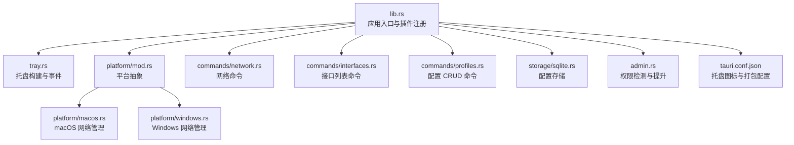
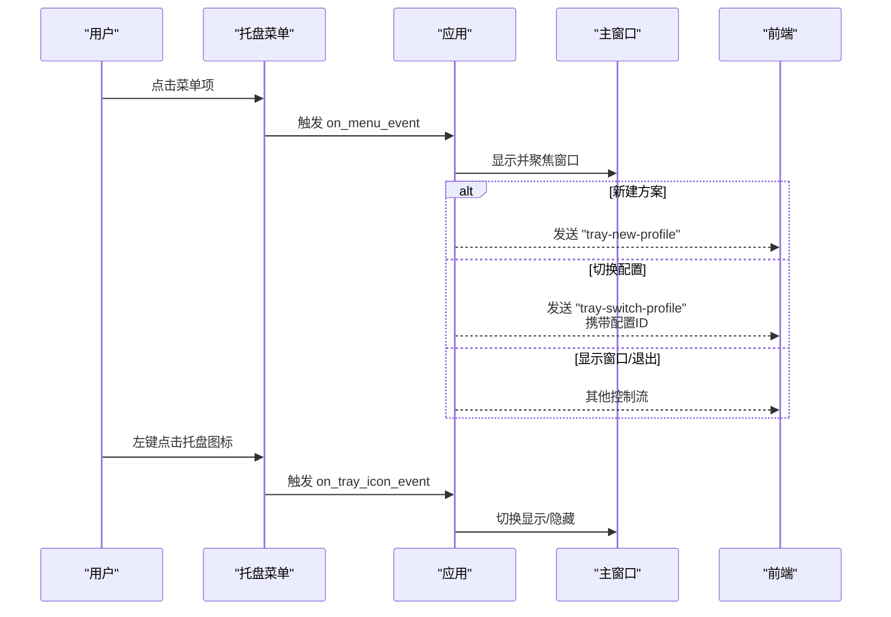
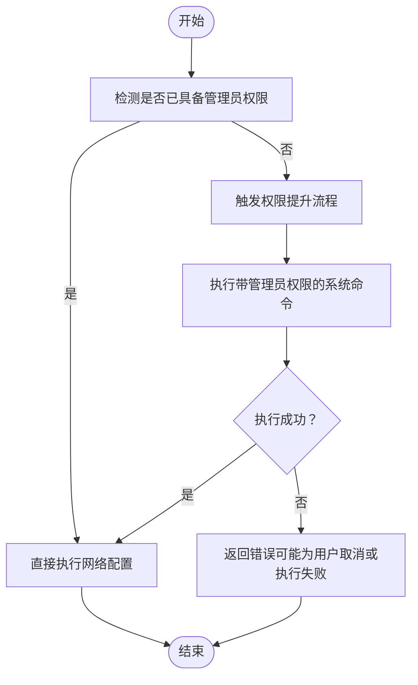
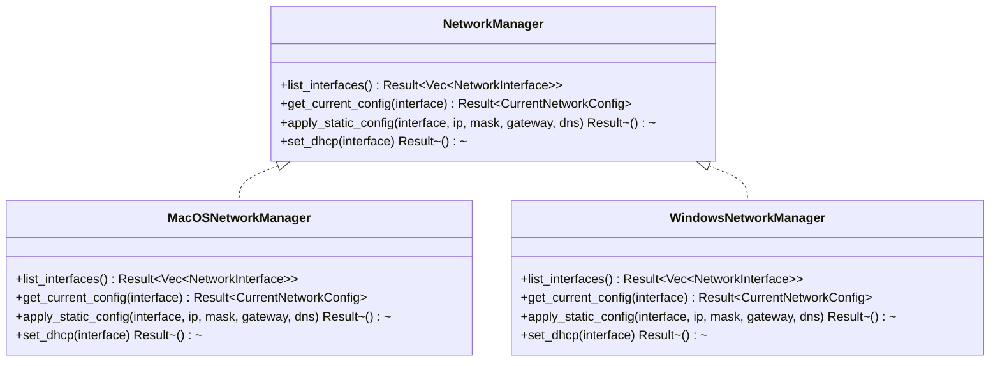
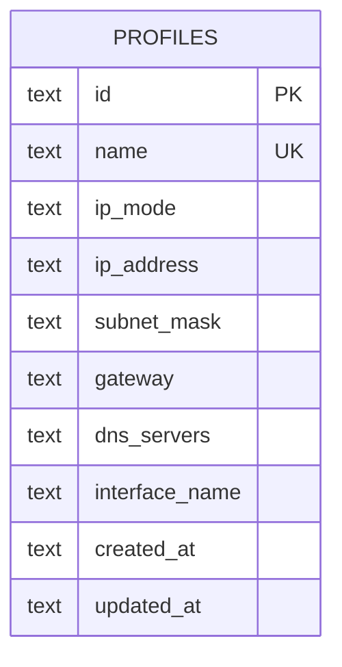
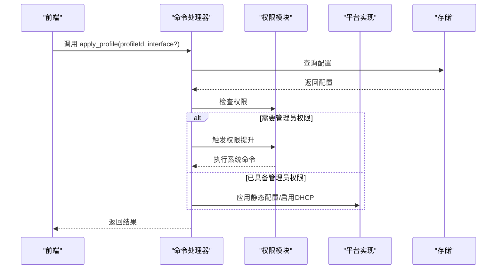
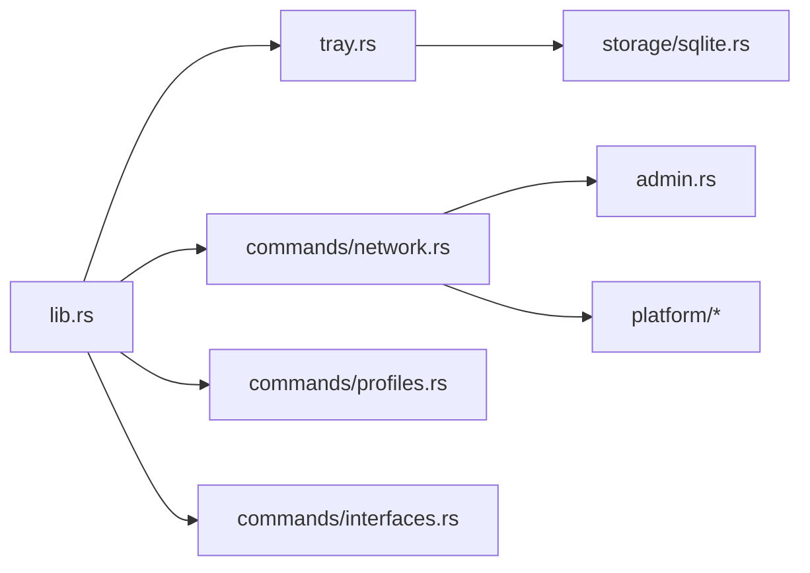

# 系统集成

<cite>
**本文引用的文件**
- [src-tauri/src/lib.rs](file://src-tauri/src/lib.rs)
- [src-tauri/src/main.rs](file://src-tauri/src/main.rs)
- [src-tauri/src/tray.rs](file://src-tauri/src/tray.rs)
- [src-tauri/src/admin.rs](file://src-tauri/src/admin.rs)
- [src-tauri/src/platform/mod.rs](file://src-tauri/src/platform/mod.rs)
- [src-tauri/src/platform/macos.rs](file://src-tauri/src/platform/macos.rs)
- [src-tauri/src/platform/windows.rs](file://src-tauri/src/platform/windows.rs)
- [src-tauri/src/commands/network.rs](file://src-tauri/src/commands/network.rs)
- [src-tauri/src/commands/interfaces.rs](file://src-tauri/src/commands/interfaces.rs)
- [src-tauri/src/commands/profiles.rs](file://src-tauri/src/commands/profiles.rs)
- [src-tauri/src/storage/sqlite.rs](file://src-tauri/src/storage/sqlite.rs)
- [src-tauri/src/models/profile.rs](file://src-tauri/src/models/profile.rs)
- [src-tauri/tauri.conf.json](file://src-tauri/tauri.conf.json)
- [src-tauri/Cargo.toml](file://src-tauri/Cargo.toml)
</cite>

## 目录
1. [简介](#简介)
2. [项目结构](#项目结构)
3. [核心组件](#核心组件)
4. [架构总览](#架构总览)
5. [详细组件分析](#详细组件分析)
6. [依赖关系分析](#依赖关系分析)
7. [性能与可靠性](#性能与可靠性)
8. [故障排查指南](#故障排查指南)
9. [结论](#结论)
10. [附录：平台与兼容性](#附录平台与兼容性)

## 简介
本文件聚焦于系统的“系统集成”能力，围绕以下主题展开：系统托盘集成（托盘图标、菜单、事件）、管理员权限管理与权限提升流程、跨平台网络配置（macOS 与 Windows）、应用图标与平台特性、以及与前端的事件通信。文档以代码为依据，结合可视化图示帮助读者快速理解实现方式与交互流程。

## 项目结构
后端采用 Tauri v2 Rust 应用，前端通过 Vite 构建并通过 Tauri 暴露命令与事件。系统托盘在应用启动时初始化；网络配置通过平台抽象层调用系统命令；管理员权限检查与提升在需要时触发；配置数据持久化使用 SQLite。



图表来源
- [src-tauri/src/lib.rs:13-48](file://src-tauri/src/lib.rs#L13-L48)
- [src-tauri/src/tray.rs:9-90](file://src-tauri/src/tray.rs#L9-L90)
- [src-tauri/src/platform/mod.rs:54-63](file://src-tauri/src/platform/mod.rs#L54-L63)
- [src-tauri/src/platform/macos.rs:8-43](file://src-tauri/src/platform/macos.rs#L8-L43)
- [src-tauri/src/platform/windows.rs:8-38](file://src-tauri/src/platform/windows.rs#L8-L38)
- [src-tauri/src/commands/network.rs:9-26](file://src-tauri/src/commands/network.rs#L9-L26)
- [src-tauri/src/commands/interfaces.rs:4-7](file://src-tauri/src/commands/interfaces.rs#L4-L7)
- [src-tauri/src/commands/profiles.rs:9-22](file://src-tauri/src/commands/profiles.rs#L9-L22)
- [src-tauri/src/storage/sqlite.rs:8-27](file://src-tauri/src/storage/sqlite.rs#L8-L27)
- [src-tauri/src/admin.rs:3-24](file://src-tauri/src/admin.rs#L3-L24)
- [src-tauri/tauri.conf.json:26-29](file://src-tauri/tauri.conf.json#L26-L29)

章节来源
- [src-tauri/src/lib.rs:13-48](file://src-tauri/src/lib.rs#L13-L48)
- [src-tauri/tauri.conf.json:26-29](file://src-tauri/tauri.conf.json#L26-L29)

## 核心组件
- 托盘集成：在应用启动时创建托盘图标与菜单，响应菜单点击与托盘图标点击事件，并向前端窗口发送事件。
- 权限管理：检测当前进程是否具备管理员权限；在网络配置变更时按需触发权限提升。
- 平台抽象：统一的网络管理接口，分别在 macOS 与 Windows 上实现具体逻辑。
- 数据持久化：SQLite 存储网络配置方案，支持增删改查与约束校验。
- 前端事件：通过 Tauri 事件通道与前端交互，实现托盘菜单触发的业务动作。

章节来源
- [src-tauri/src/tray.rs:9-90](file://src-tauri/src/tray.rs#L9-L90)
- [src-tauri/src/admin.rs:3-24](file://src-tauri/src/admin.rs#L3-L24)
- [src-tauri/src/platform/mod.rs:12-32](file://src-tauri/src/platform/mod.rs#L12-L32)
- [src-tauri/src/storage/sqlite.rs:8-27](file://src-tauri/src/storage/sqlite.rs#L8-L27)

## 架构总览
系统采用“前端（Vite）+ 后端（Tauri/Rust）”双层结构。后端负责系统级操作（托盘、权限、网络配置），并通过命令与事件与前端通信。

```mermaid
graph TB
subgraph "前端"
FE["Web 页面<br/>Vite 构建产物"]
end
subgraph "后端"
TAURI["Tauri 引擎"]
CMD["命令处理器<br/>profiles/network/interfaces"]
TRAY["托盘模块"]
ADMIN["权限模块"]
PLATFORM["平台抽象层"]
STORE["存储模块"]
end
FE <- --> TAURI
TAURI --> CMD
TAURI --> TRAY
TAURI --> ADMIN
CMD --> PLATFORM
CMD --> STORE
TRAY --> FE
```

图表来源
- [src-tauri/src/lib.rs:18-47](file://src-tauri/src/lib.rs#L18-L47)
- [src-tauri/src/tray.rs:38-85](file://src-tauri/src/tray.rs#L38-L85)
- [src-tauri/src/commands/network.rs:9-26](file://src-tauri/src/commands/network.rs#L9-L26)
- [src-tauri/src/storage/sqlite.rs:8-27](file://src-tauri/src/storage/sqlite.rs#L8-L27)

## 详细组件分析

### 托盘集成与用户交互
- 图标与菜单
  - 使用应用默认窗口图标作为托盘图标，并设置为模板图标以适配系统主题。
  - 菜单包含“显示主窗口”“新建方案”“退出”等基础项；当存在配置方案时，动态生成“切换到: 方案名”的子菜单项。
- 事件处理
  - 菜单项点击：根据 ID 分发到不同分支，如显示窗口、新建方案、退出或切换到某配置。
  - 托盘图标点击：左键点击用于切换主窗口显示/隐藏。
  - 动态菜单重建：当配置变化时可重新构建菜单，确保菜单项与数据库中的配置保持一致。
- 与前端通信
  - 通过事件通道向前端窗口发送“tray-new-profile”“tray-switch-profile”等事件，前端据此更新界面或执行业务逻辑。



图表来源
- [src-tauri/src/tray.rs:38-85](file://src-tauri/src/tray.rs#L38-L85)
- [src-tauri/src/tray.rs:92-135](file://src-tauri/src/tray.rs#L92-L135)

章节来源
- [src-tauri/src/tray.rs:9-90](file://src-tauri/src/tray.rs#L9-L90)
- [src-tauri/src/tray.rs:92-135](file://src-tauri/src/tray.rs#L92-L135)

### 管理员权限管理与权限提升
- 权限检测
  - macOS：通过系统调用判断有效用户 ID 是否为 root。
  - Windows：通过执行系统命令并检查返回状态判断是否具备管理员权限。
- 权限提升
  - macOS：通过脚本工具执行带管理员权限的命令。
  - Windows：通过 PowerShell 启动带提升权限的命令行执行。
- 流程控制
  - 当网络配置需要管理员权限且当前非管理员时，调用提升函数；成功后执行对应网络配置命令；失败则返回错误信息（含用户取消场景）。



图表来源
- [src-tauri/src/admin.rs:3-24](file://src-tauri/src/admin.rs#L3-L24)
- [src-tauri/src/admin.rs:26-49](file://src-tauri/src/admin.rs#L26-L49)
- [src-tauri/src/admin.rs:77-99](file://src-tauri/src/admin.rs#L77-L99)
- [src-tauri/src/admin.rs:142-164](file://src-tauri/src/admin.rs#L142-L164)

章节来源
- [src-tauri/src/admin.rs:3-24](file://src-tauri/src/admin.rs#L3-L24)
- [src-tauri/src/admin.rs:26-49](file://src-tauri/src/admin.rs#L26-L49)
- [src-tauri/src/admin.rs:77-99](file://src-tauri/src/admin.rs#L77-L99)
- [src-tauri/src/admin.rs:142-164](file://src-tauri/src/admin.rs#L142-L164)

### 平台抽象与网络配置
- 抽象层
  - 定义统一的网络管理接口，包含接口枚举、当前配置模型与方法：列举接口、查询当前配置、应用静态配置、启用 DHCP。
- macOS 实现
  - 使用系统工具列举网络服务、查询信息、设置静态 IP/DNS、启用 DHCP。
- Windows 实现
  - 使用系统工具列举接口、查询配置、设置静态 IP/DNS、启用 DHCP。
- 错误处理
  - 对系统命令执行结果进行检查，失败时返回统一错误类型，便于前端展示。



图表来源
- [src-tauri/src/platform/mod.rs:12-32](file://src-tauri/src/platform/mod.rs#L12-L32)
- [src-tauri/src/platform/macos.rs:8-43](file://src-tauri/src/platform/macos.rs#L8-L43)
- [src-tauri/src/platform/windows.rs:8-38](file://src-tauri/src/platform/windows.rs#L8-L38)

章节来源
- [src-tauri/src/platform/mod.rs:12-32](file://src-tauri/src/platform/mod.rs#L12-L32)
- [src-tauri/src/platform/macos.rs:8-43](file://src-tauri/src/platform/macos.rs#L8-L43)
- [src-tauri/src/platform/windows.rs:8-38](file://src-tauri/src/platform/windows.rs#L8-L38)

### 应用图标与平台特性
- 托盘图标
  - 在应用配置中指定托盘图标路径与模板属性，确保在不同系统主题下均可见。
- 窗口行为
  - 设置窗口最小化到任务栏的行为；在关闭时隐藏而非销毁，避免意外退出。
- macOS 特性
  - 设置应用激活策略为“辅助工具”，以隐藏 Dock 图标，符合后台运行场景。

章节来源
- [src-tauri/tauri.conf.json:26-29](file://src-tauri/tauri.conf.json#L26-L29)
- [src-tauri/src/lib.rs:29-34](file://src-tauri/src/lib.rs#L29-L34)
- [src-tauri/src/lib.rs:24-26](file://src-tauri/src/lib.rs#L24-L26)

### 数据持久化与配置模型
- 存储
  - 使用 SQLite 存储网络配置方案，自动迁移表结构；支持并发访问的互斥锁保护。
  - 不同平台的数据目录不同：macOS 放在应用支持目录，Windows 放在 APPDATA 下。
- 模型
  - 配置模型包含名称、IP 模式（手动/DHCP）、IP 地址、子网掩码、网关、DNS 列表、接口名及时间戳。
  - 提供校验逻辑：手动模式要求提供完整参数并校验 IPv4；DHCP 模式禁止设置上述字段。



图表来源
- [src-tauri/src/storage/sqlite.rs:59-74](file://src-tauri/src/storage/sqlite.rs#L59-L74)
- [src-tauri/src/models/profile.rs:20-32](file://src-tauri/src/models/profile.rs#L20-L32)

章节来源
- [src-tauri/src/storage/sqlite.rs:8-27](file://src-tauri/src/storage/sqlite.rs#L8-L27)
- [src-tauri/src/storage/sqlite.rs:59-74](file://src-tauri/src/storage/sqlite.rs#L59-L74)
- [src-tauri/src/models/profile.rs:34-81](file://src-tauri/src/models/profile.rs#L34-L81)

### 命令与事件交互
- 网络命令
  - 获取当前网络配置：自动选择活动接口或使用指定接口。
  - 应用配置：根据配置模式（手动/DHCP）决定调用平台实现或权限提升后的系统命令。
  - 检查管理员状态：返回当前权限状态。
- 接口命令
  - 列举可用网络接口。
- 配置命令
  - 列表、详情、创建、更新、删除配置；创建/更新前进行模型校验。
- 事件
  - 托盘菜单点击后向前端发送事件，前端据此打开新建对话框或切换配置。



图表来源
- [src-tauri/src/commands/network.rs:29-95](file://src-tauri/src/commands/network.rs#L29-L95)
- [src-tauri/src/admin.rs:26-49](file://src-tauri/src/admin.rs#L26-L49)
- [src-tauri/src/platform/macos.rs:112-151](file://src-tauri/src/platform/macos.rs#L112-L151)
- [src-tauri/src/platform/windows.rs:88-145](file://src-tauri/src/platform/windows.rs#L88-L145)

章节来源
- [src-tauri/src/commands/network.rs:9-26](file://src-tauri/src/commands/network.rs#L9-L26)
- [src-tauri/src/commands/network.rs:29-95](file://src-tauri/src/commands/network.rs#L29-L95)
- [src-tauri/src/commands/interfaces.rs:4-7](file://src-tauri/src/commands/interfaces.rs#L4-L7)
- [src-tauri/src/commands/profiles.rs:9-22](file://src-tauri/src/commands/profiles.rs#L9-L22)

## 依赖关系分析
- 组件耦合
  - 托盘模块依赖存储模块以动态生成配置切换菜单项。
  - 网络命令依赖平台抽象层与权限模块。
  - 应用入口集中注册插件、托盘与命令处理器。
- 外部依赖
  - Tauri 提供托盘、Shell、Opener 插件与命令系统。
  - 平台命令依赖系统工具（macOS 的网络工具与 Windows 的 netsh/powershell）。



图表来源
- [src-tauri/src/lib.rs:18-47](file://src-tauri/src/lib.rs#L18-L47)
- [src-tauri/src/tray.rs:94-96](file://src-tauri/src/tray.rs#L94-L96)
- [src-tauri/src/commands/network.rs:3-6](file://src-tauri/src/commands/network.rs#L3-L6)

章节来源
- [src-tauri/src/lib.rs:18-47](file://src-tauri/src/lib.rs#L18-L47)
- [src-tauri/Cargo.toml:12-25](file://src-tauri/Cargo.toml#L12-L25)

## 性能与可靠性
- 性能考量
  - 托盘菜单项数量与数据库查询次数成正比，建议在配置较多时延迟加载或分页。
  - 网络配置命令执行时间取决于系统响应，应避免频繁触发。
- 可靠性保障
  - 统一错误类型与错误消息，便于前端提示与日志记录。
  - Windows 权限提升采用隐藏窗口等待执行完成，减少前台干扰。
  - macOS 权限提升通过脚本工具执行，捕获用户取消场景并给出明确提示。

[本节为通用指导，无需列出章节来源]

## 故障排查指南
- 托盘无图标或菜单异常
  - 检查应用配置中的托盘图标路径与模板属性是否正确。
  - 确认托盘构建函数已执行且未被覆盖。
- 权限不足导致网络配置失败
  - 在 Windows 上确认以管理员身份运行或允许 UAC 提升。
  - 在 macOS 上确认通过脚本工具执行的命令被授予管理员权限。
- 配置应用后网络未生效
  - 检查目标接口名称是否正确，必要时使用接口列表命令确认。
  - 查看系统命令返回状态与错误输出，定位失败原因。
- 数据库异常
  - 确认数据库文件路径存在且有写入权限；检查迁移是否成功。

章节来源
- [src-tauri/tauri.conf.json:26-29](file://src-tauri/tauri.conf.json#L26-L29)
- [src-tauri/src/tray.rs:9-90](file://src-tauri/src/tray.rs#L9-L90)
- [src-tauri/src/admin.rs:142-164](file://src-tauri/src/admin.rs#L142-L164)
- [src-tauri/src/platform/windows.rs:88-145](file://src-tauri/src/platform/windows.rs#L88-L145)
- [src-tauri/src/platform/macos.rs:112-151](file://src-tauri/src/platform/macos.rs#L112-L151)
- [src-tauri/src/storage/sqlite.rs:13-27](file://src-tauri/src/storage/sqlite.rs#L13-L27)

## 结论
该系统通过 Tauri 将前端与系统能力整合，实现了稳定的托盘集成、灵活的权限管理与跨平台网络配置。托盘菜单与事件驱动前端交互，平台抽象层屏蔽差异，权限模块在必要时触发提升流程，存储模块保障配置持久化。整体架构清晰、职责分离，具备良好的扩展性与可维护性。

[本节为总结性内容，无需列出章节来源]

## 附录：平台与兼容性
- 平台支持
  - macOS：使用系统网络工具进行接口枚举、配置查询与设置。
  - Windows：使用系统网络工具进行接口枚举、配置查询与设置。
- 最低系统版本
  - macOS：10.15 或以上。
- 打包与图标
  - 托盘图标与多尺寸应用图标在打包配置中声明，确保在各平台正确显示。

章节来源
- [src-tauri/tauri.conf.json:43-45](file://src-tauri/tauri.conf.json#L43-L45)
- [src-tauri/tauri.conf.json:37-42](file://src-tauri/tauri.conf.json#L37-L42)