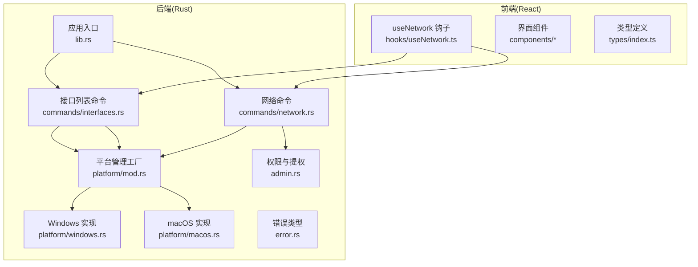
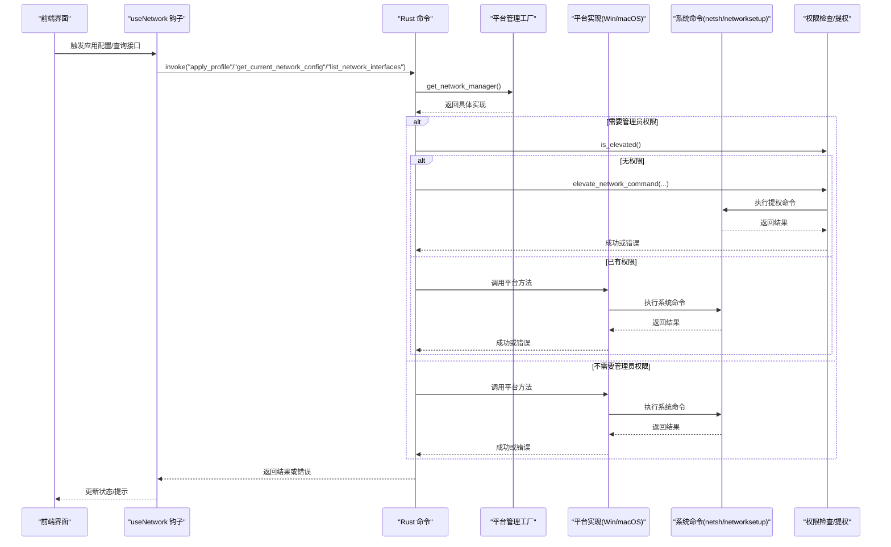
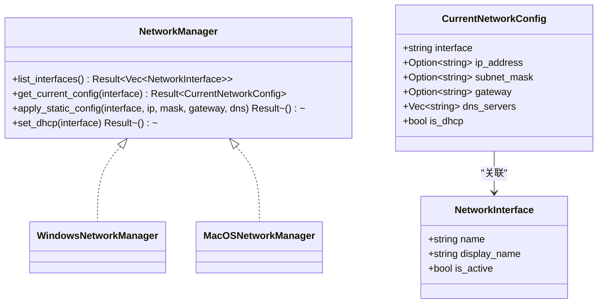
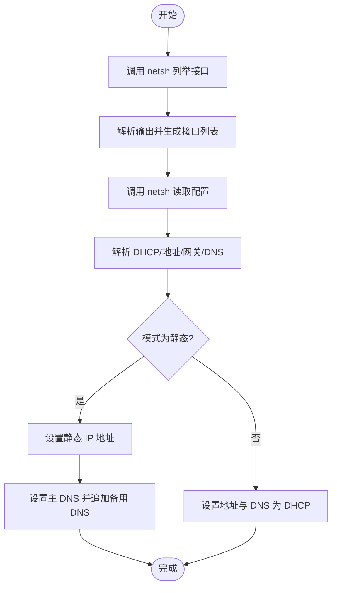
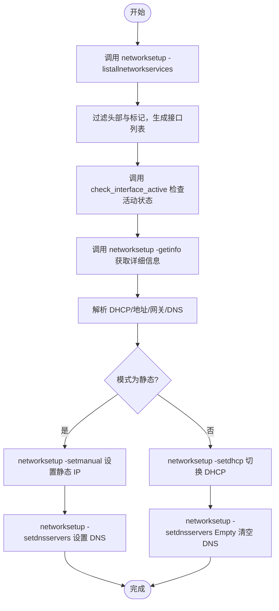
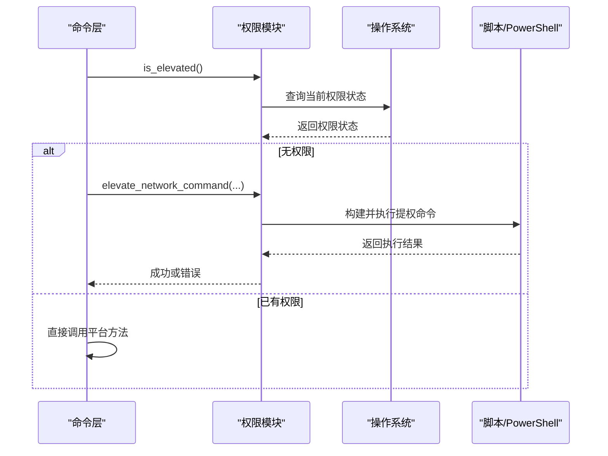
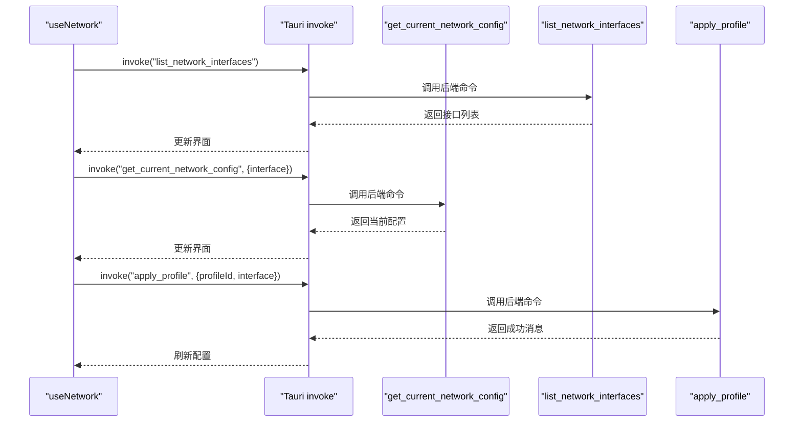
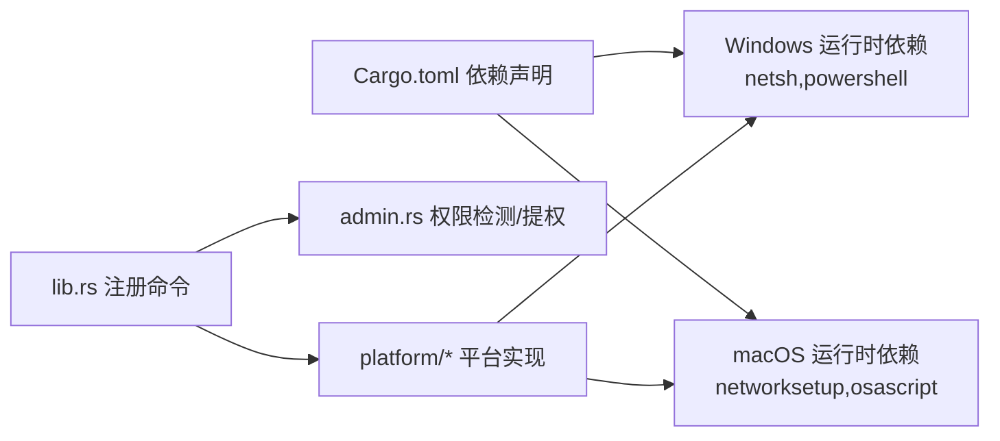

# 平台特定网络操作

<cite>
**本文引用的文件**
- [src-tauri/src/platform/mod.rs](file://src-tauri/src/platform/mod.rs)
- [src-tauri/src/platform/windows.rs](file://src-tauri/src/platform/windows.rs)
- [src-tauri/src/platform/macos.rs](file://src-tauri/src/platform/macos.rs)
- [src-tauri/src/admin.rs](file://src-tauri/src/admin.rs)
- [src-tauri/src/commands/network.rs](file://src-tauri/src/commands/network.rs)
- [src-tauri/src/commands/interfaces.rs](file://src-tauri/src/commands/interfaces.rs)
- [src-tauri/src/error.rs](file://src-tauri/src/error.rs)
- [src-tauri/src/lib.rs](file://src-tauri/src/lib.rs)
- [src-tauri/Cargo.toml](file://src-tauri/Cargo.toml)
- [src-tauri/tauri.conf.json](file://src-tauri/tauri.conf.json)
- [src/hooks/useNetwork.ts](file://src/hooks/useNetwork.ts)
- [src/types/index.ts](file://src/types/index.ts)
- [src/components/DnsEditor.tsx](file://src/components/DnsEditor.tsx)
- [src/components/InterfaceSelector.tsx](file://src/components/InterfaceSelector.tsx)
- [src-tauri/src/models/profile.rs](file://src-tauri/src/models/profile.rs)
</cite>

## 更新摘要
**变更内容**
- 更新了macOS网络接口检测逻辑，改进了网络服务状态判断机制
- 新增了基于IP地址有效性的接口活动状态检测功能
- 增强了网络连接检测的可靠性，提供更准确的接口状态判断

## 目录
1. [简介](#简介)
2. [项目结构](#项目结构)
3. [核心组件](#核心组件)
4. [架构总览](#架构总览)
5. [详细组件分析](#详细组件分析)
6. [依赖关系分析](#依赖关系分析)
7. [性能考量](#性能考量)
8. [故障排查指南](#故障排查指南)
9. [结论](#结论)
10. [附录](#附录)

## 简介
本文件聚焦于平台特定网络操作的实现与差异，覆盖 Windows 与 macOS 平台下的网络接口枚举、当前配置读取、静态 IP/DHCP 应用以及 DNS 配置。文档详细说明两类平台的系统命令调用方式、权限要求、错误映射与异常处理策略，并提供跨平台开发最佳实践、调试技巧与性能优化建议。

## 项目结构
该应用采用 Tauri 桌面框架，前端使用 React + TypeScript，后端 Rust 实现平台特定网络管理与命令封装。核心网络逻辑位于 src-tauri 的 platform 子模块，通过命令层暴露给前端调用；权限提升与错误处理在独立模块中实现；前端通过 Tauri 的 invoke 机制调用后端命令。

**图表来源**
- [src-tauri/src/lib.rs:37-47](file://src-tauri/src/lib.rs#L37-L47)
- [src-tauri/src/commands/network.rs:9-26](file://src-tauri/src/commands/network.rs#L9-L26)
- [src-tauri/src/commands/interfaces.rs:4-7](file://src-tauri/src/commands/interfaces.rs#L4-L7)
- [src-tauri/src/platform/mod.rs:54-63](file://src-tauri/src/platform/mod.rs#L54-L63)
- [src-tauri/src/platform/windows.rs:6-172](file://src-tauri/src/platform/windows.rs#L6-L172)
- [src-tauri/src/platform/macos.rs:6-174](file://src-tauri/src/platform/macos.rs#L6-L174)
- [src-tauri/src/admin.rs:26-49](file://src-tauri/src/admin.rs#L26-L49)

**章节来源**
- [src-tauri/src/lib.rs:14-50](file://src-tauri/src/lib.rs#L14-L50)
- [src-tauri/src/commands/network.rs:9-26](file://src-tauri/src/commands/network.rs#L9-L26)
- [src-tauri/src/commands/interfaces.rs:4-7](file://src-tauri/src/commands/interfaces.rs#L4-L7)
- [src-tauri/src/platform/mod.rs:54-63](file://src-tauri/src/platform/mod.rs#L54-L63)

## 核心组件
- 平台抽象与工厂
  - 抽象接口：NetworkManager 定义统一的接口方法（列举接口、读取当前配置、应用静态配置、切换 DHCP）。
  - 工厂函数：根据目标操作系统返回对应实现（WindowsNetworkManager 或 MacOSNetworkManager）。
- 平台实现
  - Windows：通过 netsh 命令进行接口枚举、配置读取、静态 IP/DNS 设置与 DHCP 切换。
  - macOS：通过 networksetup 命令进行接口枚举、配置读取、静态 IP/DNS 设置与 DHCP 切换，**新增基于IP地址有效性的接口活动状态检测**。
- 权限与提权
  - 跨平台检查当前进程是否具备管理员/根权限。
  - 在无权限时，构建并执行提权命令（macOS 使用 osascript + AppleScript，Windows 使用 PowerShell 启动带 RunAs 的命令）。
- 错误处理
  - 统一的 AppError 枚举，包含网络、权限、验证、数据库等错误类型，并序列化为字符串传递给前端。
- 前端集成
  - useNetwork 钩子负责调用后端命令、轮询当前配置、展示管理员状态与错误信息。
  - 类型定义与表单组件支撑配置编辑与接口选择。

**章节来源**
- [src-tauri/src/platform/mod.rs:12-32](file://src-tauri/src/platform/mod.rs#L12-L32)
- [src-tauri/src/platform/mod.rs:54-63](file://src-tauri/src/platform/mod.rs#L54-L63)
- [src-tauri/src/platform/windows.rs:8-172](file://src-tauri/src/platform/windows.rs#L8-L172)
- [src-tauri/src/platform/macos.rs:8-174](file://src-tauri/src/platform/macos.rs#L8-L174)
- [src-tauri/src/admin.rs:3-49](file://src-tauri/src/admin.rs#L3-L49)
- [src-tauri/src/error.rs:3-28](file://src-tauri/src/error.rs#L3-L28)
- [src/hooks/useNetwork.ts:5-98](file://src/hooks/useNetwork.ts#L5-L98)
- [src/types/index.ts:1-30](file://src/types/index.ts#L1-L30)

## 架构总览
下图展示了从前端到后端命令、再到平台实现与系统命令的整体流程，以及权限检查与错误传播路径。

**图表来源**
- [src-tauri/src/commands/network.rs:28-95](file://src-tauri/src/commands/network.rs#L28-L95)
- [src-tauri/src/commands/interfaces.rs:4-7](file://src-tauri/src/commands/interfaces.rs#L4-L7)
- [src-tauri/src/platform/mod.rs:54-63](file://src-tauri/src/platform/mod.rs#L54-L63)
- [src-tauri/src/platform/windows.rs:8-172](file://src-tauri/src/platform/windows.rs#L8-L172)
- [src-tauri/src/platform/macos.rs:8-174](file://src-tauri/src/platform/macos.rs#L8-L174)
- [src-tauri/src/admin.rs:26-49](file://src-tauri/src/admin.rs#L26-L49)

## 详细组件分析

### 平台抽象与工厂
- 抽象接口 NetworkManager 提供统一方法签名，屏蔽平台差异。
- 工厂函数按操作系统返回对应实现，确保编译期绑定正确实现。
- 数据模型 CurrentNetworkConfig 与 NetworkInterface 用于前后端数据交换。

**图表来源**
- [src-tauri/src/platform/mod.rs:12-32](file://src-tauri/src/platform/mod.rs#L12-L32)
- [src-tauri/src/platform/mod.rs:54-63](file://src-tauri/src/platform/mod.rs#L54-L63)

**章节来源**
- [src-tauri/src/platform/mod.rs:12-32](file://src-tauri/src/platform/mod.rs#L12-L32)
- [src-tauri/src/platform/mod.rs:54-63](file://src-tauri/src/platform/mod.rs#L54-L63)

### Windows 平台实现
- 接口枚举：通过 netsh interface ip show interfaces 解析输出，提取索引、度量、MTU、状态、名称等字段，过滤头部与分隔线。
- 当前配置读取：通过 netsh interface ip show config name="..." 读取 DHCP 启用状态、IP 地址、子网前缀、默认网关与 DNS 行注释。
- 应用静态配置：先设置静态 IP 地址，再设置主 DNS，最后循环追加备用 DNS；任一步失败返回网络错误。
- 切换 DHCP：设置地址与 DNS 均为 DHCP；DNS 清空为 DHCP 提供的 DNS。

**图表来源**
- [src-tauri/src/platform/windows.rs:9-38](file://src-tauri/src/platform/windows.rs#L9-L38)
- [src-tauri/src/platform/windows.rs:40-86](file://src-tauri/src/platform/windows.rs#L40-L86)
- [src-tauri/src/platform/windows.rs:88-145](file://src-tauri/src/platform/windows.rs#L88-L145)
- [src-tauri/src/platform/windows.rs:147-171](file://src-tauri/src/platform/windows.rs#L147-L171)

**章节来源**
- [src-tauri/src/platform/windows.rs:9-38](file://src-tauri/src/platform/windows.rs#L9-L38)
- [src-tauri/src/platform/windows.rs:40-86](file://src-tauri/src/platform/windows.rs#L40-L86)
- [src-tauri/src/platform/windows.rs:88-145](file://src-tauri/src/platform/windows.rs#L88-L145)
- [src-tauri/src/platform/windows.rs:147-171](file://src-tauri/src/platform/windows.rs#L147-L171)

### macOS 平台实现
- **接口枚举与活动状态检测**：通过 networksetup -listallnetworkservices 过滤头部与"(*)"标记，识别活跃接口。**新增 check_interface_active 方法，使用 networksetup -getinfo 命令查询每个网络服务的状态，通过检查 IP address 行中的 IP 地址是否有效（非空且不为 "none"）来判断接口是否真正活动**。
- 当前配置读取：通过 networksetup -getinfo 获取信息，解析 DHCP/MAC/路由器/DNS 等字段。
- 应用静态配置：networksetup -setmanual 设置静态 IP；networksetup -setdnsservers 设置 DNS。
- 切换 DHCP：networksetup -setdhcp；同时将 DNS 设为空以使用 DHCP 提供的 DNS。

**图表来源**
- [src-tauri/src/platform/macos.rs:9-33](file://src-tauri/src/platform/macos.rs#L9-L33)
- [src-tauri/src/platform/macos.rs:36-75](file://src-tauri/src/platform/macos.rs#L36-L75)
- [src-tauri/src/platform/macos.rs:77-141](file://src-tauri/src/platform/macos.rs#L77-L141)
- [src-tauri/src/platform/macos.rs:143-204](file://src-tauri/src/platform/macos.rs#L143-L204)

**章节来源**
- [src-tauri/src/platform/macos.rs:9-33](file://src-tauri/src/platform/macos.rs#L9-L33)
- [src-tauri/src/platform/macos.rs:36-75](file://src-tauri/src/platform/macos.rs#L36-L75)
- [src-tauri/src/platform/macos.rs:77-141](file://src-tauri/src/platform/macos.rs#L77-L141)
- [src-tauri/src/platform/macos.rs:143-204](file://src-tauri/src/platform/macos.rs#L143-L204)

### 权限检查与提权
- 权限检测
  - macOS：通过 libc::geteuid 判断是否为 root。
  - Windows：通过执行 net session 并检查退出码判断是否为管理员。
- 提权执行
  - macOS：使用 osascript -e "do shell script ... with administrator privileges" 弹出授权对话框。
  - Windows：使用 powershell Start-Process -Verb RunAs 启动带管理员权限的命令。
- 错误处理
  - 用户取消授权：映射为权限不足错误。
  - 其他执行失败：映射为网络错误并携带标准错误输出。

**图表来源**
- [src-tauri/src/admin.rs:3-49](file://src-tauri/src/admin.rs#L3-L49)
- [src-tauri/src/admin.rs:77-99](file://src-tauri/src/admin.rs#L77-L99)
- [src-tauri/src/admin.rs:142-164](file://src-tauri/src/admin.rs#L142-L164)

**章节来源**
- [src-tauri/src/admin.rs:3-49](file://src-tauri/src/admin.rs#L3-L49)
- [src-tauri/src/admin.rs:77-99](file://src-tauri/src/admin.rs#L77-L99)
- [src-tauri/src/admin.rs:142-164](file://src-tauri/src/admin.rs#L142-L164)

### 前端集成与交互
- useNetwork 钩子
  - 调用 list_network_interfaces、get_current_network_config、check_admin_status。
  - 自动轮询活跃接口的当前配置（每 30 秒）。
  - applyProfile 调用后端 apply_profile 并刷新当前配置。
- 类型与组件
  - types/index.ts 定义 Profile、NetworkInterface、CurrentNetworkConfig。
  - DnsEditor 支持动态增删 DNS 服务器。
  - InterfaceSelector 展示可选接口并标注活跃状态。

**图表来源**
- [src/hooks/useNetwork.ts:13-86](file://src/hooks/useNetwork.ts#L13-L86)
- [src-tauri/src/commands/network.rs:10-26](file://src-tauri/src/commands/network.rs#L10-L26)
- [src-tauri/src/commands/interfaces.rs:4-7](file://src-tauri/src/commands/interfaces.rs#L4-L7)
- [src-tauri/src/commands/network.rs:29-95](file://src-tauri/src/commands/network.rs#L29-L95)

**章节来源**
- [src/hooks/useNetwork.ts:5-98](file://src/hooks/useNetwork.ts#L5-L98)
- [src/types/index.ts:1-30](file://src/types/index.ts#L1-L30)
- [src/components/DnsEditor.tsx:8-78](file://src/components/DnsEditor.tsx#L8-L78)
- [src/components/InterfaceSelector.tsx:9-33](file://src/components/InterfaceSelector.tsx#L9-L33)
- [src-tauri/src/commands/network.rs:10-26](file://src-tauri/src/commands/network.rs#L10-L26)
- [src-tauri/src/commands/interfaces.rs:4-7](file://src-tauri/src/commands/interfaces.rs#L4-L7)

## 依赖关系分析
- 编译期条件依赖
  - macOS 目标引入 libc 以进行权限检测。
  - Windows 目标无额外条件依赖，但运行时通过 PowerShell/命令提示符执行系统命令。
- 运行时外部依赖
  - Windows：netsh、powershell。
  - macOS：networksetup、osascript。
- 错误类型
  - AppError 统一封装 IO、序列化、网络、权限、验证等错误，便于前端统一处理。

**图表来源**
- [src-tauri/Cargo.toml:26-31](file://src-tauri/Cargo.toml#L26-L31)
- [src-tauri/src/lib.rs:37-47](file://src-tauri/src/lib.rs#L37-L47)
- [src-tauri/src/admin.rs:26-49](file://src-tauri/src/admin.rs#L26-L49)
- [src-tauri/src/platform/windows.rs:1-1](file://src-tauri/src/platform/windows.rs#L1-L1)
- [src-tauri/src/platform/macos.rs:1-1](file://src-tauri/src/platform/macos.rs#L1-L1)

**章节来源**
- [src-tauri/Cargo.toml:26-31](file://src-tauri/Cargo.toml#L26-L31)
- [src-tauri/src/lib.rs:37-47](file://src-tauri/src/lib.rs#L37-L47)
- [src-tauri/src/admin.rs:26-49](file://src-tauri/src/admin.rs#L26-L49)

## 性能考量
- 命令调用频率控制
  - 前端对活跃接口配置采用 30 秒轮询，避免频繁系统调用造成资源浪费。
- 批量 DNS 设置
  - Windows 一次性设置主 DNS 并追加备用 DNS，减少多次命令调用。
- 输出解析开销
  - 平台实现对系统命令输出进行逐行解析，注意避免重复解析与多余字符串操作。
- 权限检查前置
  - 在执行高权限命令前先检查权限，避免不必要的提权弹窗与等待时间。
- **macOS 接口活动状态检测优化**
  - **新增的 check_interface_active 方法通过 networksetup -getinfo 命令查询每个网络服务的 IP 地址，仅在需要时进行额外的系统调用，避免了简单的服务列表过滤可能导致的假阳性状态判断**。

**章节来源**
- [src/hooks/useNetwork.ts:77-86](file://src/hooks/useNetwork.ts#L77-L86)
- [src-tauri/src/platform/windows.rs:112-142](file://src-tauri/src/platform/windows.rs#L112-L142)
- [src-tauri/src/platform/macos.rs:136-148](file://src-tauri/src/platform/macos.rs#L136-L148)
- [src-tauri/src/platform/macos.rs:9-33](file://src-tauri/src/platform/macos.rs#L9-L33)

## 故障排查指南
- 未找到可用网络接口
  - 可能原因：系统接口不可用或被禁用。
  - 处理建议：检查系统网络设置，确认至少有一个活跃接口。
- 设置静态 IP/DNS 失败
  - 可能原因：缺少管理员权限、参数格式错误、接口名不匹配。
  - 处理建议：确认 is_elevated 返回值；校验 IP/Mask/Gateway/DNS 格式；使用 list_network_interfaces 获取准确接口名。
- 切换到 DHCP 失败
  - 可能原因：系统命令执行失败或权限不足。
  - 处理建议：检查 networksetup/netsh 输出；必要时重新授权。
- 用户取消授权
  - 现象：macOS 提权弹窗被用户取消。
  - 处理建议：捕获权限不足错误，引导用户重新尝试授权。
- 前端错误显示
  - useNetwork 将后端错误字符串保存到 error 状态，可在界面上提示用户。
- **macOS 接口活动状态检测问题**
  - **现象：某些接口可能显示为非活动状态，即使它们实际上正在工作**。
  - **可能原因：networksetup -getinfo 命令返回的 IP 地址为 "none" 或为空**。
  - **处理建议：检查 networksetup -getinfo 的输出格式；确认网络服务确实分配了有效的 IP 地址；验证系统网络配置**。

**章节来源**
- [src-tauri/src/commands/network.rs:13-23](file://src-tauri/src/commands/network.rs#L13-L23)
- [src-tauri/src/platform/windows.rs:105-109](file://src-tauri/src/platform/windows.rs#L105-L109)
- [src-tauri/src/platform/macos.rs:129-133](file://src-tauri/src/platform/macos.rs#L129-L133)
- [src-tauri/src/admin.rs:93-98](file://src-tauri/src/admin.rs#L93-L98)
- [src/hooks/useNetwork.ts:62-67](file://src/hooks/useNetwork.ts#L62-L67)

## 结论
本项目通过抽象接口与工厂模式实现了跨 Windows 与 macOS 的网络配置能力，结合权限检测与提权机制，确保在不同平台下均能安全可靠地应用静态 IP、DHCP 与 DNS 配置。**macOS 平台的最新更新显著改进了网络接口检测逻辑，通过 networksetup -getinfo 命令查询网络服务状态并基于 IP 地址有效性判断接口活动状态，提供了更可靠的网络连接检测**。前端通过 Tauri 的命令通道与后端紧密协作，提供良好的用户体验。建议在生产环境中进一步增强参数校验、日志记录与错误恢复策略，以提升稳定性与可观测性。

## 附录
- 最佳实践
  - 参数校验：在应用层与存储层双重校验 IPv4 地址与 DNS 格式。
  - 权限最小化：仅在必要时触发提权流程，减少弹窗次数。
  - 错误分类：区分网络错误与权限错误，提供针对性提示。
  - 日志记录：在关键路径增加日志，便于问题定位。
  - **macOS 接口检测最佳实践**：**利用新的基于 IP 地址有效性的接口活动状态检测，避免简单的服务列表过滤可能导致的误判；定期验证 networksetup -getinfo 命令的输出格式**。
- 调试技巧
  - 直接在终端执行对应系统命令，验证输出格式与返回码。
  - 使用 Tauri DevTools 查看命令调用与返回值。
  - 在 macOS 上检查授权弹窗是否被系统阻止。
  - **使用 networksetup -getinfo 命令直接测试接口状态检测逻辑**。
- 安全与权限
  - Windows：确保以管理员身份运行或通过提权执行 netsh。
  - macOS：确保以 root 权限运行或通过 osascript 弹窗授权。
  - 错误映射：将用户取消授权映射为权限不足，避免误判为网络错误。
  - **macOS 网络服务状态检测安全性**：**通过 networksetup -getinfo 命令获取的信息仅用于状态判断，不涉及敏感配置修改**。