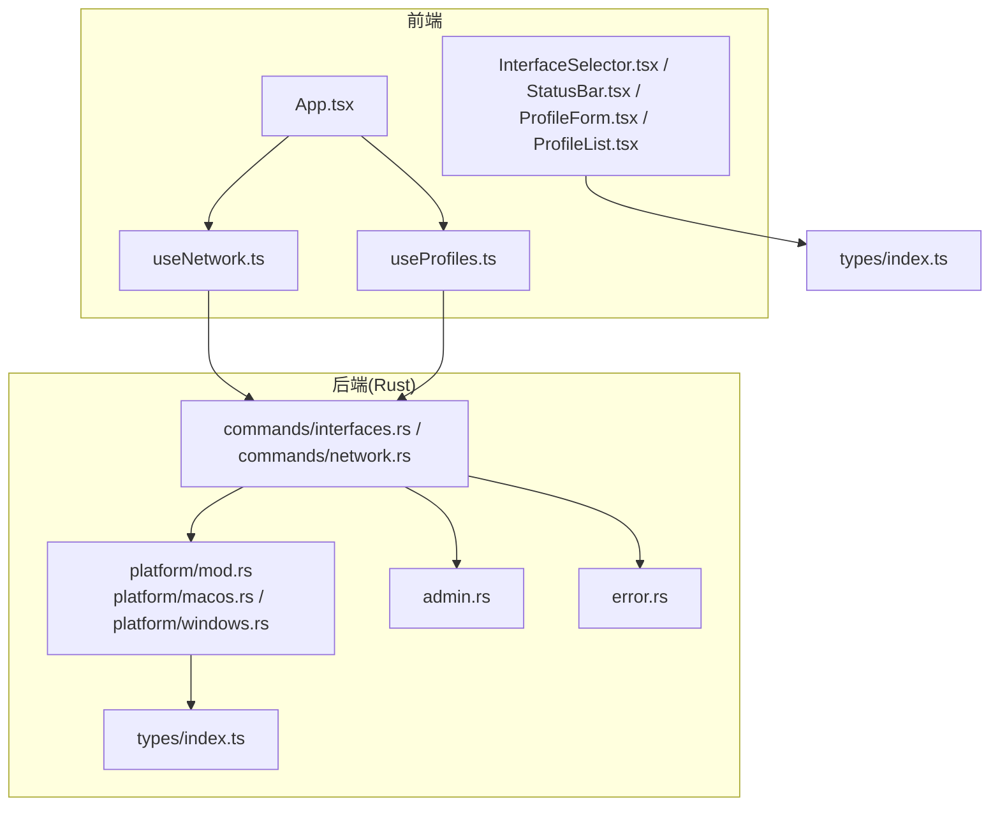
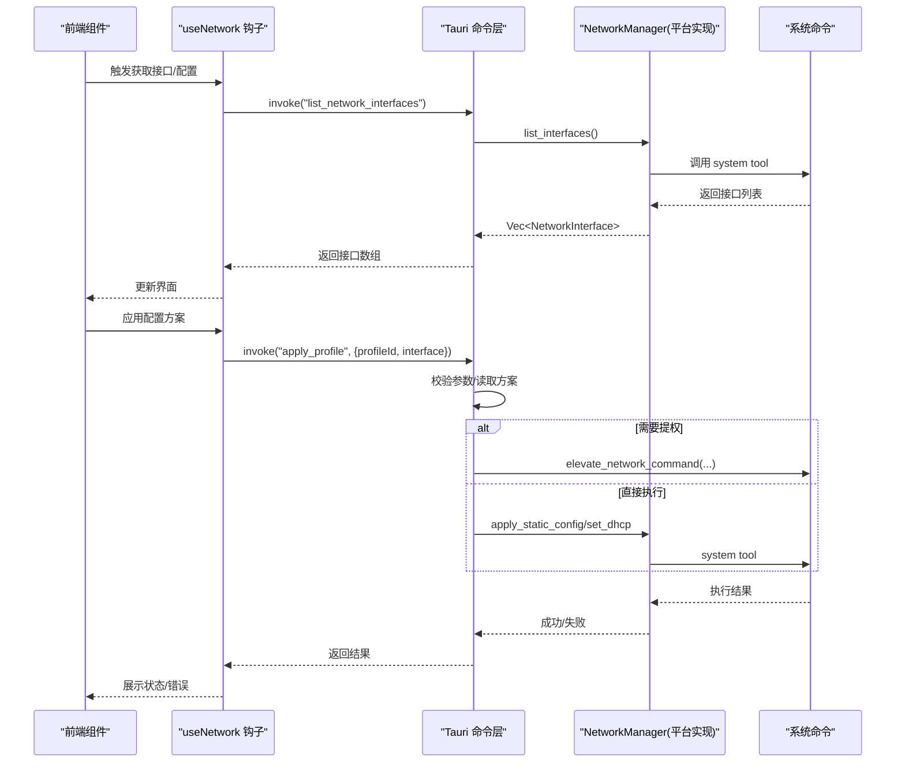
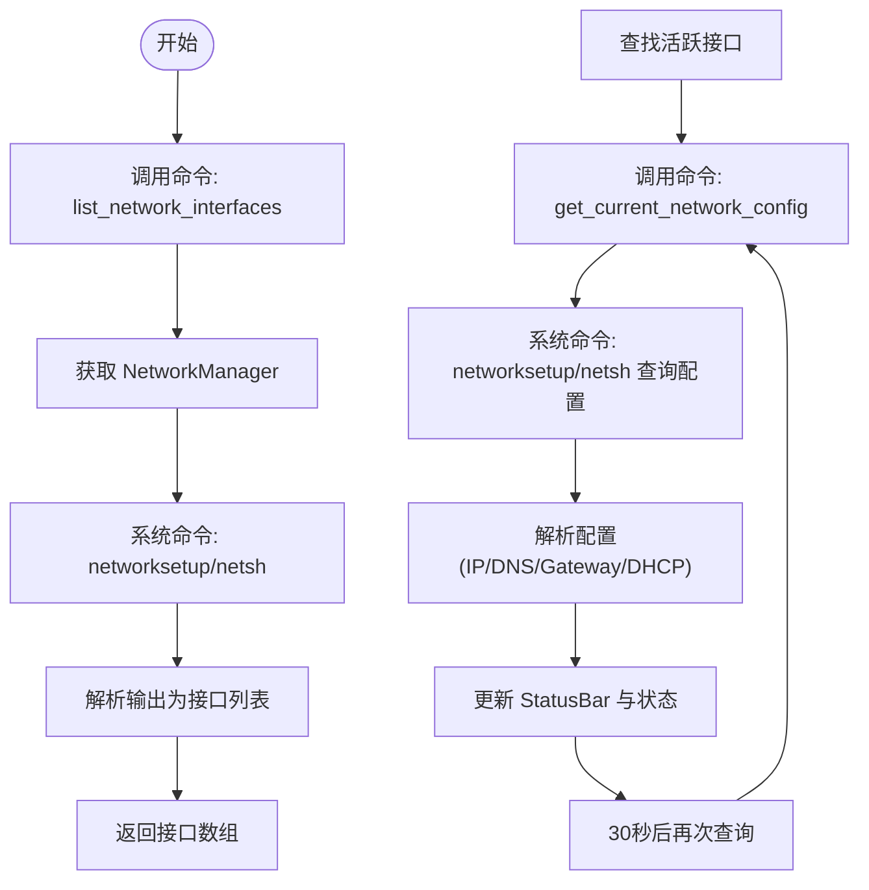
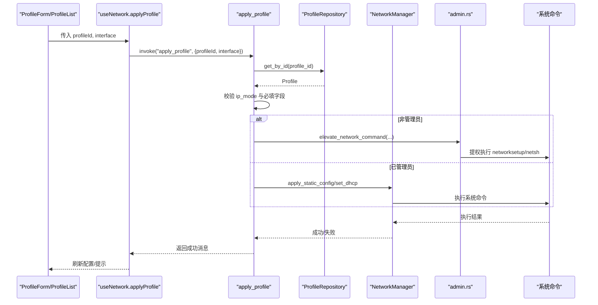
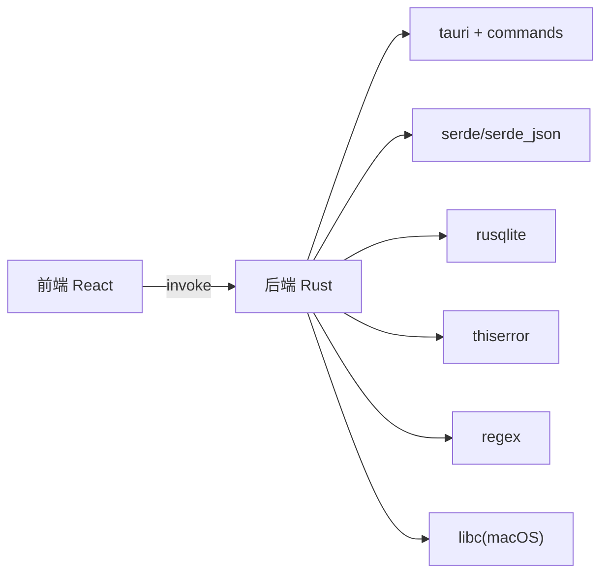
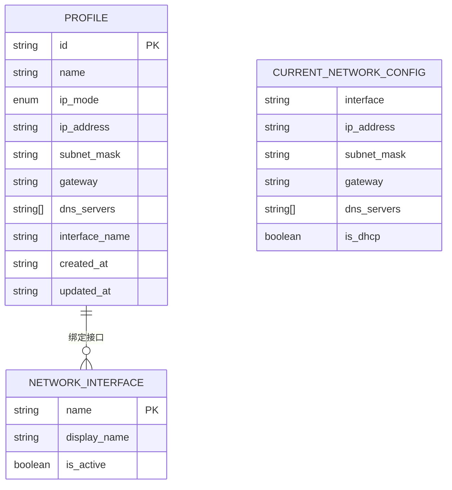

# 网络接口操作

<cite>
**本文引用的文件**
- [src/hooks/useNetwork.ts](file://src/hooks/useNetwork.ts)
- [src-tauri/src/commands/interfaces.rs](file://src-tauri/src/commands/interfaces.rs)
- [src-tauri/src/commands/network.rs](file://src-tauri/src/commands/network.rs)
- [src-tauri/src/platform/mod.rs](file://src-tauri/src/platform/mod.rs)
- [src-tauri/src/platform/macos.rs](file://src-tauri/src/platform/macos.rs)
- [src-tauri/src/platform/windows.rs](file://src-tauri/src/platform/windows.rs)
- [src-tauri/src/admin.rs](file://src-tauri/src/admin.rs)
- [src-tauri/src/error.rs](file://src-tauri/src/error.rs)
- [src/types/index.ts](file://src/types/index.ts)
- [src/App.tsx](file://src/App.tsx)
- [src/components/InterfaceSelector.tsx](file://src/components/InterfaceSelector.tsx)
- [src/components/StatusBar.tsx](file://src/components/StatusBar.tsx)
- [src/components/ProfileForm.tsx](file://src/components/ProfileForm.tsx)
- [src/components/ProfileList.tsx](file://src/components/ProfileList.tsx)
- [src/hooks/useProfiles.ts](file://src/hooks/useProfiles.ts)
- [src-tauri/Cargo.toml](file://src-tauri/Cargo.toml)
</cite>

## 目录
1. [简介](#简介)
2. [项目结构](#项目结构)
3. [核心组件](#核心组件)
4. [架构总览](#架构总览)
5. [详细组件分析](#详细组件分析)
6. [依赖关系分析](#依赖关系分析)
7. [性能考虑](#性能考虑)
8. [故障排查指南](#故障排查指南)
9. [结论](#结论)
10. [附录](#附录)

## 简介
本文件面向“网络接口操作”的综合使用与开发文档，覆盖以下主题：
- 网络接口发现机制：跨平台枚举、过滤与排序逻辑
- 接口信息获取与状态监控：当前配置检测与定时刷新
- 配置切换与应用流程：手动/DHCP 切换、权限提升与错误处理
- 不同网络接口类型的识别与处理：macOS 的 networksetup 与 Windows 的 netsh
- 实际操作示例、错误处理策略与性能优化建议

## 项目结构
前端采用 React + Tauri，后端 Rust 提供跨平台网络管理能力。整体分层如下：
- 前端（React）：界面组件、状态钩子、事件监听
- 后端（Rust）：命令层（Tauri Commands）、平台抽象（NetworkManager）、权限提升、错误模型
- 类型定义：统一的 TypeScript 类型与 Rust 结构体映射

图表来源
- [src/App.tsx:1-195](file://src/App.tsx#L1-L195)
- [src/hooks/useNetwork.ts:1-99](file://src/hooks/useNetwork.ts#L1-L99)
- [src/hooks/useProfiles.ts:1-117](file://src/hooks/useProfiles.ts#L1-L117)
- [src-tauri/src/commands/interfaces.rs:1-8](file://src-tauri/src/commands/interfaces.rs#L1-L8)
- [src-tauri/src/commands/network.rs:1-101](file://src-tauri/src/commands/network.rs#L1-L101)
- [src-tauri/src/platform/mod.rs:1-64](file://src-tauri/src/platform/mod.rs#L1-L64)
- [src-tauri/src/platform/macos.rs:1-175](file://src-tauri/src/platform/macos.rs#L1-L175)
- [src-tauri/src/platform/windows.rs:1-173](file://src-tauri/src/platform/windows.rs#L1-L173)
- [src-tauri/src/admin.rs:1-165](file://src-tauri/src/admin.rs#L1-L165)
- [src-tauri/src/error.rs:1-38](file://src-tauri/src/error.rs#L1-L38)
- [src/types/index.ts:1-30](file://src/types/index.ts#L1-L30)

章节来源
- [src/App.tsx:1-195](file://src/App.tsx#L1-L195)
- [src/hooks/useNetwork.ts:1-99](file://src/hooks/useNetwork.ts#L1-L99)
- [src/hooks/useProfiles.ts:1-117](file://src/hooks/useProfiles.ts#L1-L117)
- [src-tauri/src/commands/interfaces.rs:1-8](file://src-tauri/src/commands/interfaces.rs#L1-L8)
- [src-tauri/src/commands/network.rs:1-101](file://src-tauri/src/commands/network.rs#L1-L101)
- [src-tauri/src/platform/mod.rs:1-64](file://src-tauri/src/platform/mod.rs#L1-L64)
- [src-tauri/src/platform/macos.rs:1-175](file://src-tauri/src/platform/macos.rs#L1-L175)
- [src-tauri/src/platform/windows.rs:1-173](file://src-tauri/src/platform/windows.rs#L1-L173)
- [src-tauri/src/admin.rs:1-165](file://src-tauri/src/admin.rs#L1-L165)
- [src-tauri/src/error.rs:1-38](file://src-tauri/src/error.rs#L1-L38)
- [src/types/index.ts:1-30](file://src/types/index.ts#L1-L30)

## 核心组件
- 网络状态钩子：负责拉取接口列表、当前配置、管理员权限检查，并定时刷新当前配置
- 命令层：暴露 list_network_interfaces、get_current_network_config、apply_profile、check_admin_status 等命令
- 平台抽象：通过 NetworkManager trait 抽象 macOS/Windows 的具体实现
- 权限模块：在需要时以提权方式执行网络配置命令
- 错误模型：统一的 AppError 枚举，便于前后端一致处理
- 类型定义：前后端共享的接口、配置、方案数据结构

章节来源
- [src/hooks/useNetwork.ts:1-99](file://src/hooks/useNetwork.ts#L1-L99)
- [src-tauri/src/commands/interfaces.rs:1-8](file://src-tauri/src/commands/interfaces.rs#L1-L8)
- [src-tauri/src/commands/network.rs:1-101](file://src-tauri/src/commands/network.rs#L1-L101)
- [src-tauri/src/platform/mod.rs:1-64](file://src-tauri/src/platform/mod.rs#L1-L64)
- [src-tauri/src/admin.rs:1-165](file://src-tauri/src/admin.rs#L1-L165)
- [src-tauri/src/error.rs:1-38](file://src-tauri/src/error.rs#L1-L38)
- [src/types/index.ts:1-30](file://src/types/index.ts#L1-L30)

## 架构总览
系统采用“前端 React + 后端 Rust + Tauri 桥接”的双层架构。前端通过 invoke 调用后端命令；后端根据操作系统选择合适的 NetworkManager 实现，必要时通过 admin.rs 提升权限。

图表来源
- [src/hooks/useNetwork.ts:13-69](file://src/hooks/useNetwork.ts#L13-L69)
- [src-tauri/src/commands/network.rs:28-95](file://src-tauri/src/commands/network.rs#L28-L95)
- [src-tauri/src/platform/macos.rs:8-43](file://src-tauri/src/platform/macos.rs#L8-L43)
- [src-tauri/src/platform/windows.rs:8-38](file://src-tauri/src/platform/windows.rs#L8-L38)
- [src-tauri/src/admin.rs:26-49](file://src-tauri/src/admin.rs#L26-L49)

## 详细组件分析

### 组件一：网络接口发现与状态监控
- 发现机制
  - 前端通过 useNetwork 钩子调用 list_network_interfaces 命令
  - 命令层委托给平台抽象 get_network_manager().list_interfaces()
  - macOS 使用 networksetup 列出网络服务并解析活跃接口
  - Windows 使用 netsh interface ip show interfaces 解析接口状态
- 过滤与排序
  - 当前实现按系统输出顺序返回；未见显式过滤/排序逻辑
- 状态监控
  - 自动检测当前活跃接口，每 30 秒轮询一次 get_current_network_config
  - StatusBar 组件展示当前接口、IP、网关与 DHCP 状态

图表来源
- [src-tauri/src/commands/interfaces.rs:4-7](file://src-tauri/src/commands/interfaces.rs#L4-L7)
- [src-tauri/src/commands/network.rs:9-26](file://src-tauri/src/commands/network.rs#L9-L26)
- [src-tauri/src/platform/macos.rs:8-43](file://src-tauri/src/platform/macos.rs#L8-L43)
- [src-tauri/src/platform/windows.rs:8-38](file://src-tauri/src/platform/windows.rs#L8-L38)
- [src/hooks/useNetwork.ts:71-86](file://src/hooks/useNetwork.ts#L71-L86)
- [src/components/StatusBar.tsx:8-38](file://src/components/StatusBar.tsx#L8-L38)

章节来源
- [src-tauri/src/commands/interfaces.rs:1-8](file://src-tauri/src/commands/interfaces.rs#L1-L8)
- [src-tauri/src/commands/network.rs:1-101](file://src-tauri/src/commands/network.rs#L1-L101)
- [src-tauri/src/platform/macos.rs:1-175](file://src-tauri/src/platform/macos.rs#L1-L175)
- [src-tauri/src/platform/windows.rs:1-173](file://src-tauri/src/platform/windows.rs#L1-L173)
- [src/hooks/useNetwork.ts:13-86](file://src/hooks/useNetwork.ts#L13-L86)
- [src/components/StatusBar.tsx:1-39](file://src/components/StatusBar.tsx#L1-L39)

### 组件二：接口信息获取与状态监控
- 当前配置获取
  - 若未指定接口，则优先使用 is_active 的接口，否则取首个接口
  - macOS 使用 networksetup -getinfo 解析 DHCP/IP/Subnet/Gateway/DNS
  - Windows 使用 netsh interface ip show config 解析 DHCP/IP/Subnet/Gateway
- 状态展示
  - StatusBar 根据 is_dhcp 与 ip_address 动态显示连接状态与网关信息

章节来源
- [src-tauri/src/commands/network.rs:9-26](file://src-tauri/src/commands/network.rs#L9-L26)
- [src-tauri/src/platform/macos.rs:45-110](file://src-tauri/src/platform/macos.rs#L45-L110)
- [src-tauri/src/platform/windows.rs:40-85](file://src-tauri/src/platform/windows.rs#L40-L85)
- [src/components/StatusBar.tsx:8-38](file://src/components/StatusBar.tsx#L8-L38)

### 组件三：接口切换与配置应用流程
- 流程概览
  - 读取方案：根据 profile_id 从存储加载方案
  - 选择目标接口：优先使用方案中的 interface_name，否则由用户指定
  - 模式判断：Manual 或 Dhcp
  - 权限检查：非管理员时通过 elevate_network_command 提权执行
  - 应用配置：静态 IP 使用 apply_static_config，DHCP 使用 set_dhcp
  - 反馈结果：返回人类可读的成功消息
- 错误处理
  - 参数校验失败抛出 Validation
  - 未找到接口抛出 Network
  - 提权被用户取消抛出 PermissionDenied
  - 其他系统命令失败抛出 Network

图表来源
- [src-tauri/src/commands/network.rs:28-95](file://src-tauri/src/commands/network.rs#L28-L95)
- [src-tauri/src/admin.rs:26-49](file://src-tauri/src/admin.rs#L26-L49)
- [src-tauri/src/platform/macos.rs:112-173](file://src-tauri/src/platform/macos.rs#L112-L173)
- [src-tauri/src/platform/windows.rs:88-171](file://src-tauri/src/platform/windows.rs#L88-L171)
- [src/hooks/useNetwork.ts:49-69](file://src/hooks/useNetwork.ts#L49-L69)

章节来源
- [src-tauri/src/commands/network.rs:1-101](file://src-tauri/src/commands/network.rs#L1-L101)
- [src-tauri/src/admin.rs:1-165](file://src-tauri/src/admin.rs#L1-L165)
- [src-tauri/src/platform/macos.rs:1-175](file://src-tauri/src/platform/macos.rs#L1-L175)
- [src-tauri/src/platform/windows.rs:1-173](file://src-tauri/src/platform/windows.rs#L1-L173)
- [src/hooks/useNetwork.ts:1-99](file://src/hooks/useNetwork.ts#L1-L99)

### 组件四：接口枚举、过滤与排序逻辑
- 枚举
  - macOS：networksetup -listallnetworkservices 输出逐行解析，跳过头部与空行，标记带(*)的为活跃接口
  - Windows：netsh interface ip show interfaces 解析表头后的表格行，提取 Name 与 State
- 过滤与排序
  - 当前未实现显式的过滤/排序逻辑；前端 InterfaceSelector 仅按接口数组顺序渲染
- 建议
  - 可在前端增加按 is_active 排序或显示名称过滤
  - 可在后端增加稳定的排序键（如 display_name）

章节来源
- [src-tauri/src/platform/macos.rs:8-43](file://src-tauri/src/platform/macos.rs#L8-L43)
- [src-tauri/src/platform/windows.rs:8-38](file://src-tauri/src/platform/windows.rs#L8-L38)
- [src/components/InterfaceSelector.tsx:14-33](file://src/components/InterfaceSelector.tsx#L14-L33)

### 组件五：不同网络接口类型的识别与处理
- 类型识别
  - macOS：networksetup 输出包含服务名与活跃标记(*)，据此构造 NetworkInterface
  - Windows：netsh 输出包含接口名称与连接状态，据此构造 NetworkInterface
- 处理方式
  - 静态 IP：分别设置 IP/Mask/Gateway 与 DNS
  - DHCP：设置为 DHCP 并清空或设为 DHCP DNS
- 注意事项
  - macOS 需要管理员权限；Windows 需要以管理员运行或提权执行
  - DNS 设置在 macOS 中一次性设置，在 Windows 中先主 DNS 再追加备用 DNS

章节来源
- [src-tauri/src/platform/macos.rs:8-173](file://src-tauri/src/platform/macos.rs#L8-L173)
- [src-tauri/src/platform/windows.rs:8-171](file://src-tauri/src/platform/windows.rs#L8-L171)

### 组件六：实际操作示例
- 创建并应用方案
  - 在 ProfileForm 中填写方案名称、接口、IP 模式与参数
  - 点击“立即应用”触发 applyProfile，内部先保存再应用
  - StatusBar 即时反映当前接口与 IP/DHCP 状态
- 切换接口
  - 在 InterfaceSelector 中选择目标接口，随后应用对应方案
- 从托盘触发
  - App.tsx 监听 tray-* 事件，支持从托盘菜单直接新建或切换方案

章节来源
- [src/components/ProfileForm.tsx:104-182](file://src/components/ProfileForm.tsx#L104-L182)
- [src/App.tsx:86-143](file://src/App.tsx#L86-L143)
- [src/components/InterfaceSelector.tsx:9-33](file://src/components/InterfaceSelector.tsx#L9-L33)
- [src/components/StatusBar.tsx:8-38](file://src/components/StatusBar.tsx#L8-L38)

## 依赖关系分析
- 前端依赖
  - @tauri-apps/api：invoke 与事件监听
  - React Hooks：useState/useCallback/useEffect
- 后端依赖
  - tauri、serde、rusqlite、thiserror、regex 等
  - macOS: libc
  - Windows: 无特定依赖，通过 powershell/osascript 提权

图表来源
- [src-tauri/Cargo.toml:12-31](file://src-tauri/Cargo.toml#L12-L31)
- [src/App.tsx:1-195](file://src/App.tsx#L1-L195)

章节来源
- [src-tauri/Cargo.toml:1-31](file://src-tauri/Cargo.toml#L1-L31)
- [src/App.tsx:1-195](file://src/App.tsx#L1-L195)

## 性能考虑
- 轮询频率
  - 当前每 30 秒刷新一次当前配置，建议根据场景调整（如后台最小化时可降低频率）
- 命令执行
  - networksetup/netsh 为外部进程调用，建议合并命令减少进程开销（如 macOS 一次性设置 IP 与 DNS）
- UI 渲染
  - 接口列表与配置变更频繁时，可引入浅比较与 memo 化避免不必要的重渲染
- 存储访问
  - 方案 CRUD 使用 SQLite，建议批量写入与索引优化（按需）

## 故障排查指南
- 常见错误类型
  - Validation：参数校验失败（如缺少必填字段）
  - Network：系统命令执行失败（权限不足、命令失败）
  - PermissionDenied：用户取消提权
  - NotFound/DuplicateName：存储相关错误
- 排查步骤
  - 确认管理员权限：check_admin_status 返回值
  - 手动执行命令：macOS 使用 networksetup，Windows 使用 netsh
  - 查看日志：后端使用 env_logger，可在终端查看
  - 检查接口名称：确保与系统输出一致（Windows 名称可能含空格）
- 前端提示
  - useNetwork 的 error 字段用于展示错误消息
  - StatusBar 在加载与未知状态时有明确提示

章节来源
- [src-tauri/src/error.rs:1-38](file://src-tauri/src/error.rs#L1-L38)
- [src-tauri/src/admin.rs:1-24](file://src-tauri/src/admin.rs#L1-L24)
- [src/hooks/useNetwork.ts:13-69](file://src/hooks/useNetwork.ts#L13-L69)
- [src/components/StatusBar.tsx:8-24](file://src/components/StatusBar.tsx#L8-L24)

## 结论
本项目提供了跨平台的网络接口发现、配置获取与切换能力。通过统一的命令层与平台抽象，实现了 macOS 与 Windows 的一致体验。建议后续增强接口排序/过滤、优化命令合并与轮询策略，并完善错误恢复与用户引导。

## 附录
- 数据模型关系（类型定义）

图表来源
- [src/types/index.ts:1-30](file://src/types/index.ts#L1-L30)