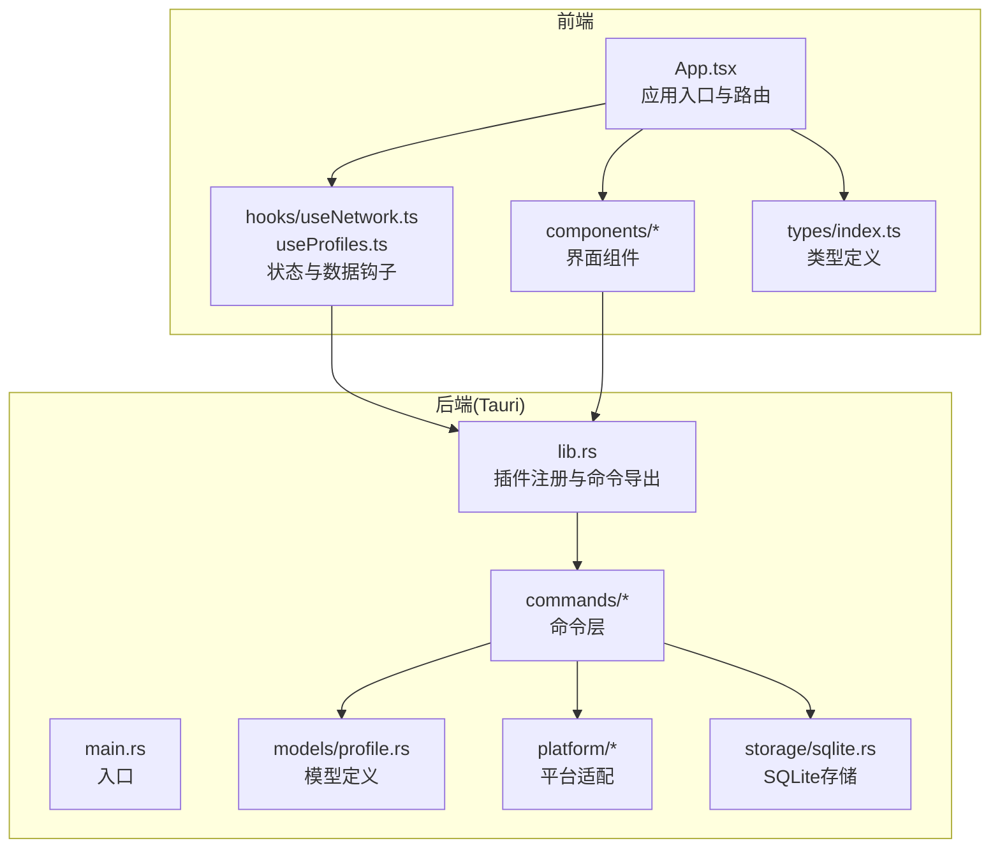
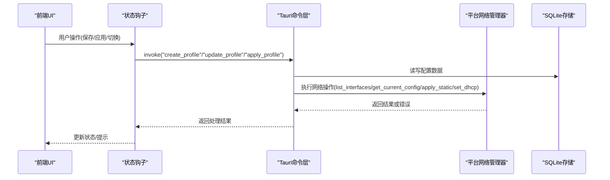
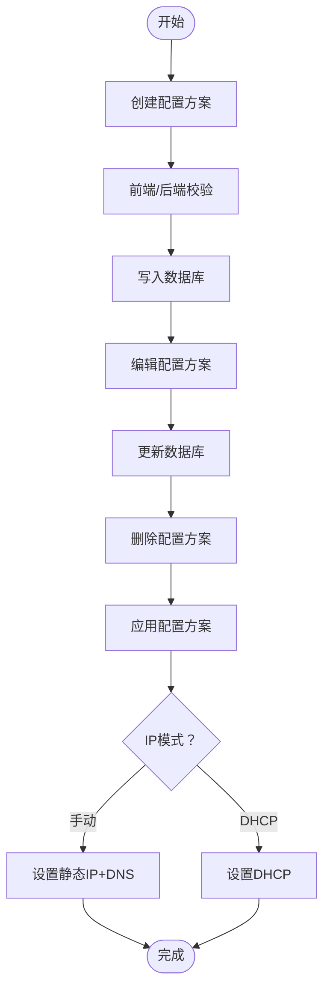
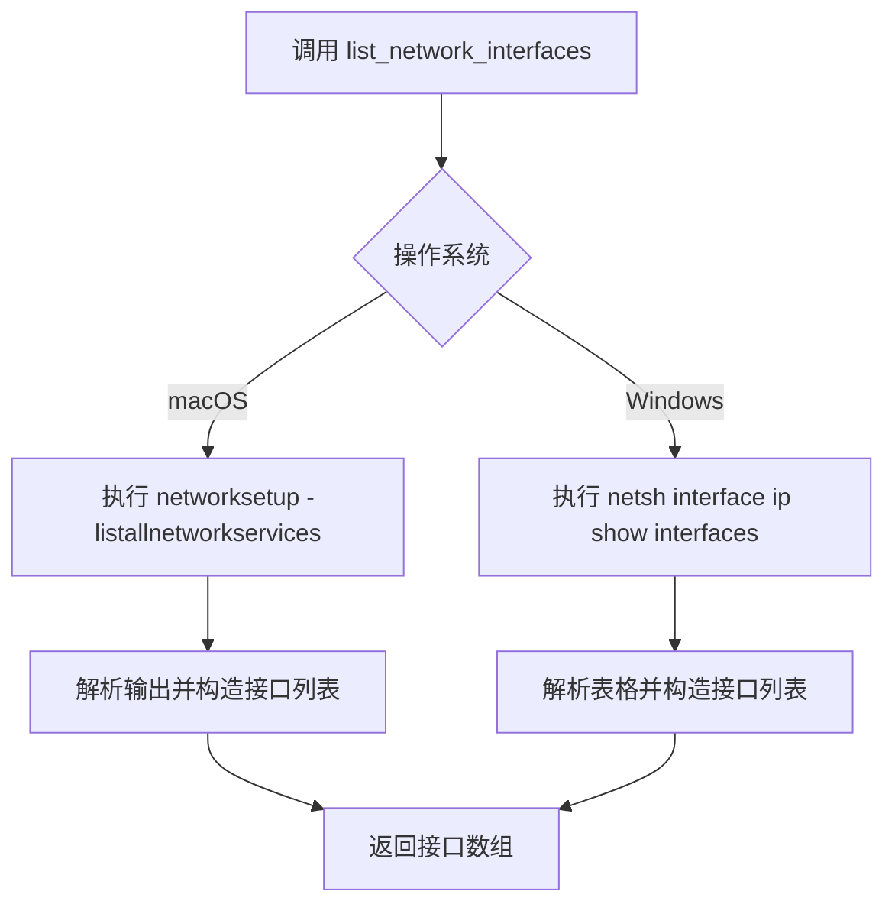
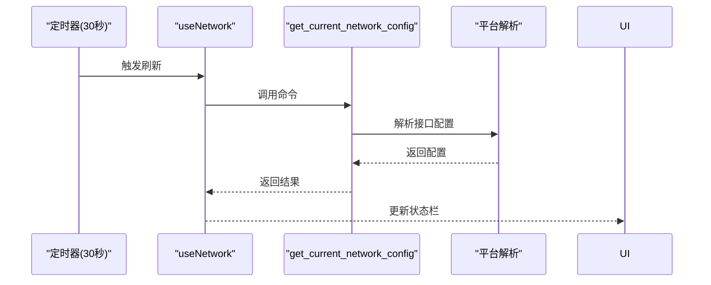
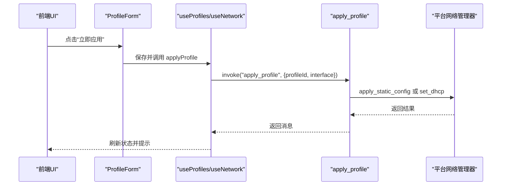
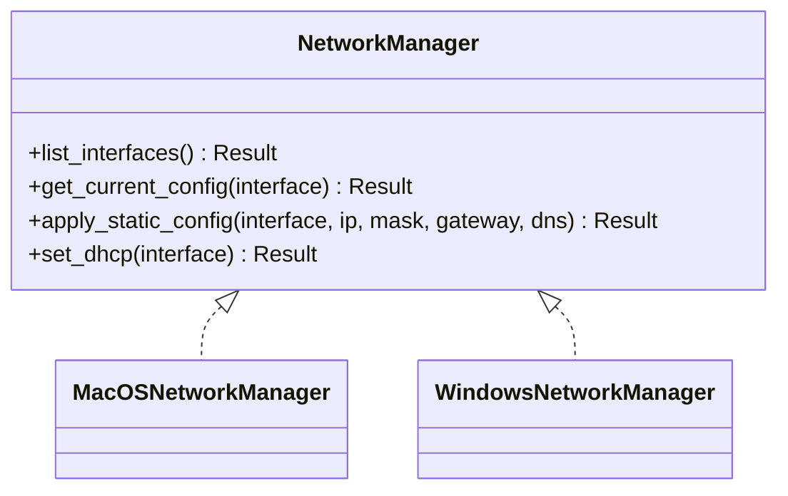
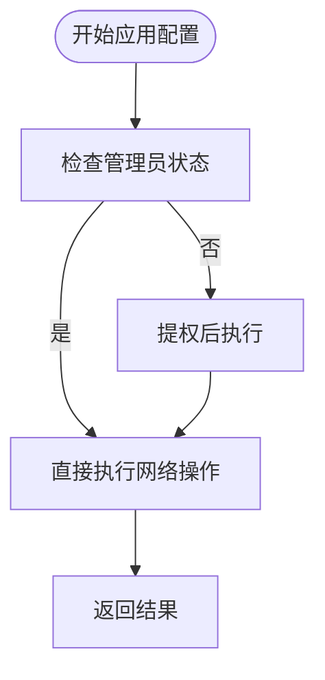
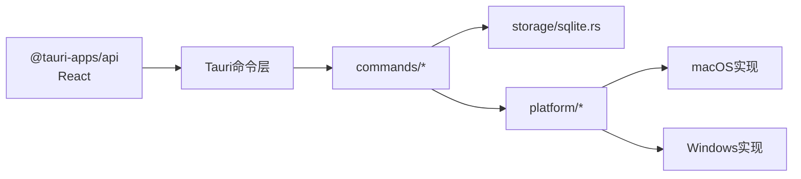

# 网络配置功能

<cite>
**本文档引用的文件**
- [src/App.tsx](file://src/App.tsx)
- [src/main.tsx](file://src/main.tsx)
- [src/hooks/useNetwork.ts](file://src/hooks/useNetwork.ts)
- [src/hooks/useProfiles.ts](file://src/hooks/useProfiles.ts)
- [src/types/index.ts](file://src/types/index.ts)
- [src/components/ProfileForm.tsx](file://src/components/ProfileForm.tsx)
- [src/components/ProfileList.tsx](file://src/components/ProfileList.tsx)
- [src-tauri/src/lib.rs](file://src-tauri/src/lib.rs)
- [src-tauri/src/main.rs](file://src-tauri/src/main.rs)
- [src-tauri/src/commands/network.rs](file://src-tauri/src/commands/network.rs)
- [src-tauri/src/commands/interfaces.rs](file://src-tauri/src/commands/interfaces.rs)
- [src-tauri/src/commands/profiles.rs](file://src-tauri/src/commands/profiles.rs)
- [src-tauri/src/models/profile.rs](file://src-tauri/src/models/profile.rs)
- [src-tauri/src/platform/mod.rs](file://src-tauri/src/platform/mod.rs)
- [src-tauri/src/platform/macos.rs](file://src-tauri/src/platform/macos.rs)
- [src-tauri/src/platform/windows.rs](file://src-tauri/src/platform/windows.rs)
- [src-tauri/src/storage/sqlite.rs](file://src-tauri/src/storage/sqlite.rs)
- [package.json](file://package.json)
</cite>

## 目录
1. [简介](#简介)
2. [项目结构](#项目结构)
3. [核心组件](#核心组件)
4. [架构总览](#架构总览)
5. [详细组件分析](#详细组件分析)
6. [依赖关系分析](#依赖关系分析)
7. [性能考虑](#性能考虑)
8. [故障排除指南](#故障排除指南)
9. [结论](#结论)
10. [附录：配置示例与最佳实践](#附录配置示例与最佳实践)

## 简介
本项目是一个跨平台的网络配置切换工具，允许用户创建、编辑、删除和应用网络配置方案（Profile）。系统支持手动配置（静态IP）与自动获取（DHCP）两种模式，提供网络接口发现、当前网络状态监控以及跨平台的网络配置应用能力。前端基于 React，后端使用 Tauri Rust 框架，通过命令通道调用平台特定的网络管理器完成实际的网络变更。

## 项目结构
项目采用前后端分离架构：
- 前端（React + TypeScript）负责用户界面、表单校验、事件监听与状态展示
- 后端（Tauri Rust）负责命令处理、数据库存储、平台适配与网络操作

**图表来源**
- [src/App.tsx:1-195](file://src/App.tsx#L1-L195)
- [src/hooks/useNetwork.ts:1-99](file://src/hooks/useNetwork.ts#L1-L99)
- [src/hooks/useProfiles.ts:1-117](file://src/hooks/useProfiles.ts#L1-L117)
- [src-tauri/src/lib.rs:1-49](file://src-tauri/src/lib.rs#L1-L49)
- [src-tauri/src/commands/network.rs:1-101](file://src-tauri/src/commands/network.rs#L1-L101)
- [src-tauri/src/platform/mod.rs:1-64](file://src-tauri/src/platform/mod.rs#L1-L64)
- [src-tauri/src/storage/sqlite.rs:1-256](file://src-tauri/src/storage/sqlite.rs#L1-L256)

**章节来源**
- [src/main.tsx:1-11](file://src/main.tsx#L1-L11)
- [package.json:1-27](file://package.json#L1-L27)

## 核心组件
- 应用入口与路由：负责协调配置列表、表单、状态栏与托盘事件监听
- 状态钩子：封装网络接口查询、当前配置获取、管理员权限检查与配置应用
- 配置钩子：封装配置方案的增删改查与错误处理
- 类型定义：统一前后端的数据结构，确保类型安全
- 组件：表单校验、接口选择、DNS 编辑、列表展示与切换确认对话框
- 命令层：暴露给前端调用的后端命令，包括接口列表、当前配置、应用配置、管理员状态检查
- 平台适配：针对 macOS 与 Windows 的网络管理器实现
- 存储层：SQLite 数据库存储配置方案，支持迁移与约束

**章节来源**
- [src/App.tsx:10-195](file://src/App.tsx#L10-L195)
- [src/hooks/useNetwork.ts:5-99](file://src/hooks/useNetwork.ts#L5-L99)
- [src/hooks/useProfiles.ts:5-117](file://src/hooks/useProfiles.ts#L5-L117)
- [src/types/index.ts:1-30](file://src/types/index.ts#L1-L30)
- [src-tauri/src/commands/network.rs:9-101](file://src-tauri/src/commands/network.rs#L9-L101)
- [src-tauri/src/platform/mod.rs:12-64](file://src-tauri/src/platform/mod.rs#L12-L64)
- [src-tauri/src/storage/sqlite.rs:12-256](file://src-tauri/src/storage/sqlite.rs#L12-L256)

## 架构总览
系统通过 Tauri 的 invoke 机制在前端与后端之间传递命令与数据。前端发起请求，后端根据平台执行具体网络操作，并返回结果或错误信息。

**图表来源**
- [src/hooks/useNetwork.ts:13-69](file://src/hooks/useNetwork.ts#L13-L69)
- [src/hooks/useProfiles.ts:10-101](file://src/hooks/useProfiles.ts#L10-L101)
- [src-tauri/src/commands/network.rs:29-95](file://src-tauri/src/commands/network.rs#L29-L95)
- [src-tauri/src/commands/profiles.rs:25-113](file://src-tauri/src/commands/profiles.rs#L25-L113)
- [src-tauri/src/platform/macos.rs:8-175](file://src-tauri/src/platform/macos.rs#L8-L175)
- [src-tauri/src/platform/windows.rs:8-173](file://src-tauri/src/platform/windows.rs#L8-L173)
- [src-tauri/src/storage/sqlite.rs:76-232](file://src-tauri/src/storage/sqlite.rs#L76-L232)

## 详细组件分析

### 配置方案管理流程
- 创建：前端收集表单数据，调用后端 create_profile 命令；后端进行校验并写入 SQLite
- 编辑：前端调用 update_profile 命令；后端读取现有记录以保留创建时间，更新其余字段
- 删除：前端调用 delete_profile 命令；后端从数据库移除
- 应用：前端调用 apply_profile 命令；后端根据模式选择静态或 DHCP，并在需要时提升权限

**图表来源**
- [src-tauri/src/commands/profiles.rs:25-113](file://src-tauri/src/commands/profiles.rs#L25-L113)
- [src-tauri/src/models/profile.rs:34-81](file://src-tauri/src/models/profile.rs#L34-L81)
- [src-tauri/src/storage/sqlite.rs:146-232](file://src-tauri/src/storage/sqlite.rs#L146-L232)

**章节来源**
- [src-tauri/src/commands/profiles.rs:9-113](file://src-tauri/src/commands/profiles.rs#L9-L113)
- [src-tauri/src/models/profile.rs:20-88](file://src-tauri/src/models/profile.rs#L20-L88)
- [src-tauri/src/storage/sqlite.rs:12-256](file://src-tauri/src/storage/sqlite.rs#L12-L256)

### 网络接口发现机制
- macOS：通过 networksetup 列出所有网络服务，解析输出识别活动接口与显示名
- Windows：通过 netsh interface ip show interfaces 解析表格输出，识别连接状态接口

**图表来源**
- [src-tauri/src/platform/macos.rs:9-43](file://src-tauri/src/platform/macos.rs#L9-L43)
- [src-tauri/src/platform/windows.rs:9-38](file://src-tauri/src/platform/windows.rs#L9-L38)
- [src-tauri/src/commands/interfaces.rs:4-7](file://src-tauri/src/commands/interfaces.rs#L4-L7)

**章节来源**
- [src-tauri/src/platform/mod.rs:12-32](file://src-tauri/src/platform/mod.rs#L12-L32)
- [src-tauri/src/platform/macos.rs:8-43](file://src-tauri/src/platform/macos.rs#L8-L43)
- [src-tauri/src/platform/windows.rs:8-38](file://src-tauri/src/platform/windows.rs#L8-L38)

### 当前网络状态监控
- 前端定时轮询：每 30 秒获取一次当前配置，优先使用活动接口
- macOS：通过 networksetup -getinfo 解析 IP、子网掩码、网关与 DNS
- Windows：通过 netsh interface ip show config 解析 DHCP 状态与基础信息

**图表来源**
- [src/hooks/useNetwork.ts:76-86](file://src/hooks/useNetwork.ts#L76-L86)
- [src-tauri/src/commands/network.rs:10-26](file://src-tauri/src/commands/network.rs#L10-L26)
- [src-tauri/src/platform/macos.rs:45-110](file://src-tauri/src/platform/macos.rs#L45-L110)
- [src-tauri/src/platform/windows.rs:40-86](file://src-tauri/src/platform/windows.rs#L40-L86)

**章节来源**
- [src/hooks/useNetwork.ts:28-86](file://src/hooks/useNetwork.ts#L28-L86)
- [src-tauri/src/commands/network.rs:9-26](file://src-tauri/src/commands/network.rs#L9-L26)

### 配置应用过程
- 选择接口与方案：前端表单选择目标接口与方案
- 校验与保存：先保存方案，再应用网络配置
- 权限与模式：根据模式调用静态或 DHCP 设置，必要时提升权限
- 结果反馈：成功后刷新当前配置并提示

**图表来源**
- [src/components/ProfileForm.tsx:131-182](file://src/components/ProfileForm.tsx#L131-L182)
- [src/hooks/useProfiles.ts:23-101](file://src/hooks/useProfiles.ts#L23-L101)
- [src/hooks/useNetwork.ts:49-69](file://src/hooks/useNetwork.ts#L49-L69)
- [src-tauri/src/commands/network.rs:29-95](file://src-tauri/src/commands/network.rs#L29-L95)
- [src-tauri/src/platform/macos.rs:112-175](file://src-tauri/src/platform/macos.rs#L112-L175)
- [src-tauri/src/platform/windows.rs:88-173](file://src-tauri/src/platform/windows.rs#L88-L173)

**章节来源**
- [src/components/ProfileForm.tsx:30-357](file://src/components/ProfileForm.tsx#L30-L357)
- [src-tauri/src/commands/network.rs:29-95](file://src-tauri/src/commands/network.rs#L29-L95)

### 跨平台网络配置实现差异
- macOS
  - 接口发现：networksetup -listallnetworkservices
  - 当前配置：networksetup -getinfo
  - 应用静态：networksetup -setmanual
  - 应用 DHCP：networksetup -setdhcp
- Windows
  - 接口发现：netsh interface ip show interfaces
  - 当前配置：netsh interface ip show config
  - 应用静态：netsh interface ip set address static
  - 应用 DHCP：netsh interface ip set address source=dhcp

**图表来源**
- [src-tauri/src/platform/mod.rs:12-32](file://src-tauri/src/platform/mod.rs#L12-L32)
- [src-tauri/src/platform/macos.rs:8-175](file://src-tauri/src/platform/macos.rs#L8-L175)
- [src-tauri/src/platform/windows.rs:8-173](file://src-tauri/src/platform/windows.rs#L8-L173)

**章节来源**
- [src-tauri/src/platform/mod.rs:44-64](file://src-tauri/src/platform/mod.rs#L44-L64)
- [src-tauri/src/platform/macos.rs:8-175](file://src-tauri/src/platform/macos.rs#L8-L175)
- [src-tauri/src/platform/windows.rs:8-173](file://src-tauri/src/platform/windows.rs#L8-L173)

### 权限管理
- 管理员状态检查：前端调用后端 check_admin_status
- 提权策略：当非管理员且需要修改网络配置时，后端通过 elevate_network_command 提升权限后再执行
- 错误处理：若权限不足，返回明确错误提示

**图表来源**
- [src-tauri/src/commands/network.rs:53-94](file://src-tauri/src/commands/network.rs#L53-L94)
- [src/hooks/useNetwork.ts:40-47](file://src/hooks/useNetwork.ts#L40-L47)

**章节来源**
- [src-tauri/src/commands/network.rs:97-101](file://src-tauri/src/commands/network.rs#L97-L101)
- [src/hooks/useNetwork.ts:40-47](file://src/hooks/useNetwork.ts#L40-L47)

## 依赖关系分析
- 前端依赖 @tauri-apps/api 进行命令调用，React 生态进行界面构建
- 后端通过 tauri::Builder 注册命令，使用 rusqlite 进行本地存储
- 平台适配通过条件编译区分 macOS 与 Windows 实现

**图表来源**
- [package.json:12-25](file://package.json#L12-L25)
- [src-tauri/src/lib.rs:18-48](file://src-tauri/src/lib.rs#L18-L48)
- [src-tauri/src/storage/sqlite.rs:1-256](file://src-tauri/src/storage/sqlite.rs#L1-256)
- [src-tauri/src/platform/mod.rs:44-64](file://src-tauri/src/platform/mod.rs#L44-L64)

**章节来源**
- [package.json:12-25](file://package.json#L12-L25)
- [src-tauri/src/lib.rs:18-48](file://src-tauri/src/lib.rs#L18-L48)

## 性能考虑
- 轮询频率：当前每 30 秒刷新一次当前配置，可根据实际需求调整
- 数据库访问：SQLite 写入采用互斥锁保护，避免并发冲突
- 命令调用：平台命令执行可能阻塞，建议在后台线程或异步任务中执行
- 界面渲染：合理使用 React.memo 与状态分片，减少不必要的重渲染

## 故障排除指南
- 无法列出接口
  - 检查平台命令是否可用（macOS 使用 networksetup，Windows 使用 netsh）
  - 确认管理员权限
- 应用配置失败
  - 确认接口名称正确且处于活动状态
  - 检查手动模式下的 IP、子网掩码、网关与 DNS 是否有效
- 管理员权限不足
  - 使用后端的提权机制或以管理员身份运行应用
- 数据库异常
  - 检查数据库路径与权限，确认 migrations 成功执行

**章节来源**
- [src-tauri/src/platform/macos.rs:14-20](file://src-tauri/src/platform/macos.rs#L14-L20)
- [src-tauri/src/platform/windows.rs:13-14](file://src-tauri/src/platform/windows.rs#L13-L14)
- [src-tauri/src/storage/sqlite.rs:53-74](file://src-tauri/src/storage/sqlite.rs#L53-L74)

## 结论
该网络配置功能通过清晰的前后端职责划分与平台适配，实现了跨平台的网络配置方案管理与应用。前端提供直观的交互体验，后端保证了安全性与可维护性。通过合理的错误处理与权限管理，系统能够在不同平台上稳定运行。

## 附录：配置示例与最佳实践
- 配置示例
  - 家庭网络（手动）：设置固定 IP、子网掩码、默认网关与 DNS
  - 公司网络（DHCP）：启用 DHCP，让系统自动获取配置
- 最佳实践
  - 在应用前先保存配置，确保数据一致性
  - 选择正确的网络接口，避免误操作其他接口
  - 手动模式下务必验证 IP 与 DNS 的有效性
  - 定期检查当前配置，确保与预期一致
  - 在生产环境中以管理员身份运行，避免权限问题