# 配置方案管理

<cite>
**本文档引用的文件**
- [profile.rs](file://src-tauri/src/models/profile.rs)
- [sqlite.rs](file://src-tauri/src/storage/sqlite.rs)
- [profiles.rs](file://src-tauri/src/commands/profiles.rs)
- [network.rs](file://src-tauri/src/commands/network.rs)
- [useProfiles.ts](file://src/hooks/useProfiles.ts)
- [useNetwork.ts](file://src/hooks/useNetwork.ts)
- [ProfileForm.tsx](file://src/components/ProfileForm.tsx)
- [ProfileList.tsx](file://src/components/ProfileList.tsx)
- [App.tsx](file://src/App.tsx)
- [index.ts](file://src/types/index.ts)
- [error.rs](file://src-tauri/src/error.rs)
- [lib.rs](file://src-tauri/src/lib.rs)
- [Cargo.toml](file://src-tauri/Cargo.toml)
</cite>

## 目录
1. [简介](#简介)
2. [项目结构](#项目结构)
3. [核心组件](#核心组件)
4. [架构概览](#架构概览)
5. [详细组件分析](#详细组件分析)
6. [依赖关系分析](#依赖关系分析)
7. [性能考虑](#性能考虑)
8. [故障排除指南](#故障排除指南)
9. [结论](#结论)

## 简介

IPSwitcher 是一个跨平台的网络配置切换工具，专注于提供便捷的配置方案管理功能。该系统允许用户创建、管理和应用不同的网络配置方案，支持手动IP模式和DHCP模式两种网络配置方式。

本项目采用Tauri框架构建桌面应用程序，后端使用Rust语言开发，前端使用TypeScript和React技术栈。核心功能围绕配置方案的完整生命周期展开，包括创建、查询、更新和删除操作。

## 项目结构

IPSwitcher项目采用前后端分离的架构设计，主要分为以下层次：

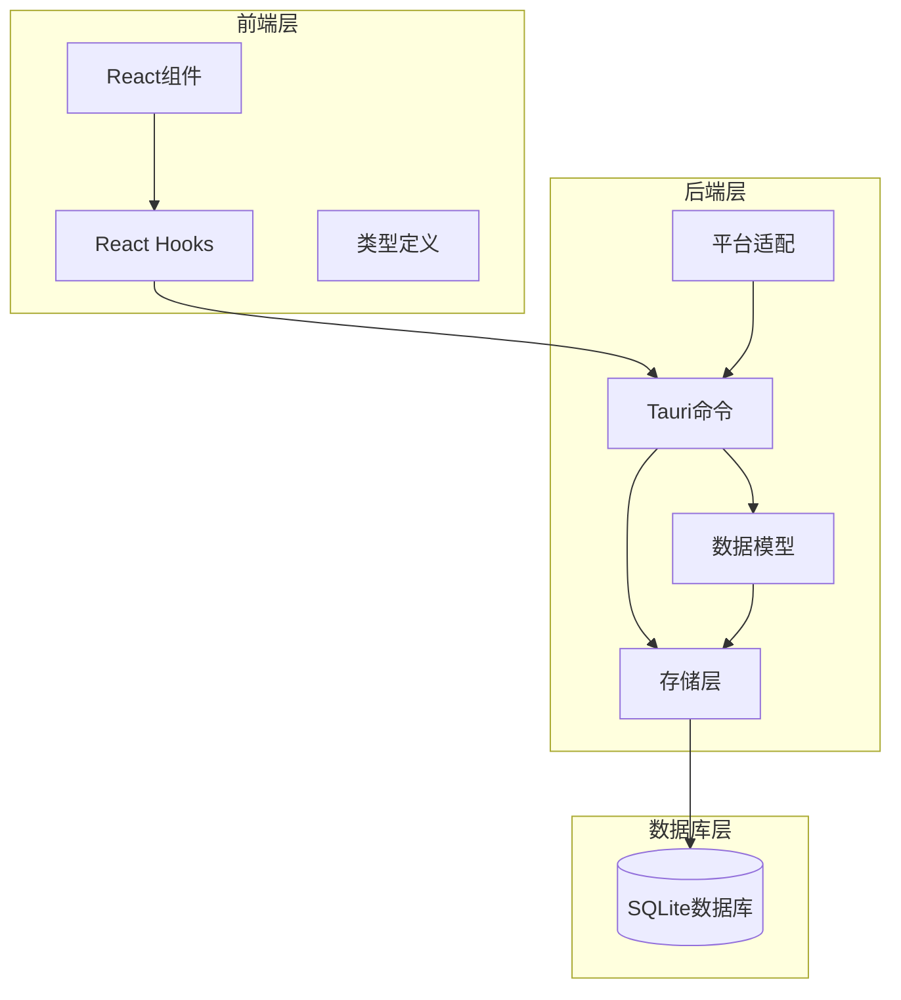

**图表来源**
- [lib.rs:13-48](file://src-tauri/src/lib.rs#L13-L48)
- [Cargo.toml:12-24](file://src-tauri/Cargo.toml#L12-L24)

**章节来源**
- [lib.rs:1-49](file://src-tauri/src/lib.rs#L1-L49)
- [Cargo.toml:1-30](file://src-tauri/Cargo.toml#L1-L30)

## 核心组件

### Profile数据模型

Profile是配置方案的核心数据结构，定义了网络配置的所有必要信息：

| 字段名 | 类型 | 必填 | 描述 |
|--------|------|------|------|
| id | String | 是 | 唯一标识符，使用UUID生成 |
| name | String | 是 | 方案名称，长度限制64字符 |
| ip_mode | IpMode | 是 | IP获取方式：Manual或Dhcp |
| ip_address | Option<String> | 手动模式必填 | IPv4地址 |
| subnet_mask | Option<String> | 手动模式必填 | 子网掩码 |
| gateway | Option<String> | 手动模式必填 | 默认网关 |
| dns_servers | Vec<String> | 是 | DNS服务器列表，至少一个 |
| interface_name | Option<String> | 否 | 目标网络接口名称 |
| created_at | String | 是 | 创建时间（RFC3339格式） |
| updated_at | String | 是 | 更新时间（RFC3339格式） |

**章节来源**
- [profile.rs:20-32](file://src-tauri/src/models/profile.rs#L20-L32)
- [index.ts:1-12](file://src/types/index.ts#L1-L12)

### IpMode枚举

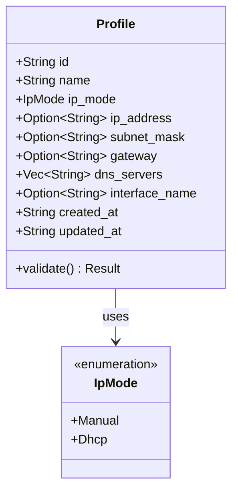

**图表来源**
- [profile.rs:4-18](file://src-tauri/src/models/profile.rs#L4-L18)
- [profile.rs:20-32](file://src-tauri/src/models/profile.rs#L20-L32)

**章节来源**
- [profile.rs:4-18](file://src-tauri/src/models/profile.rs#L4-L18)

## 架构概览

IPSwitcher采用分层架构设计，确保关注点分离和代码可维护性：

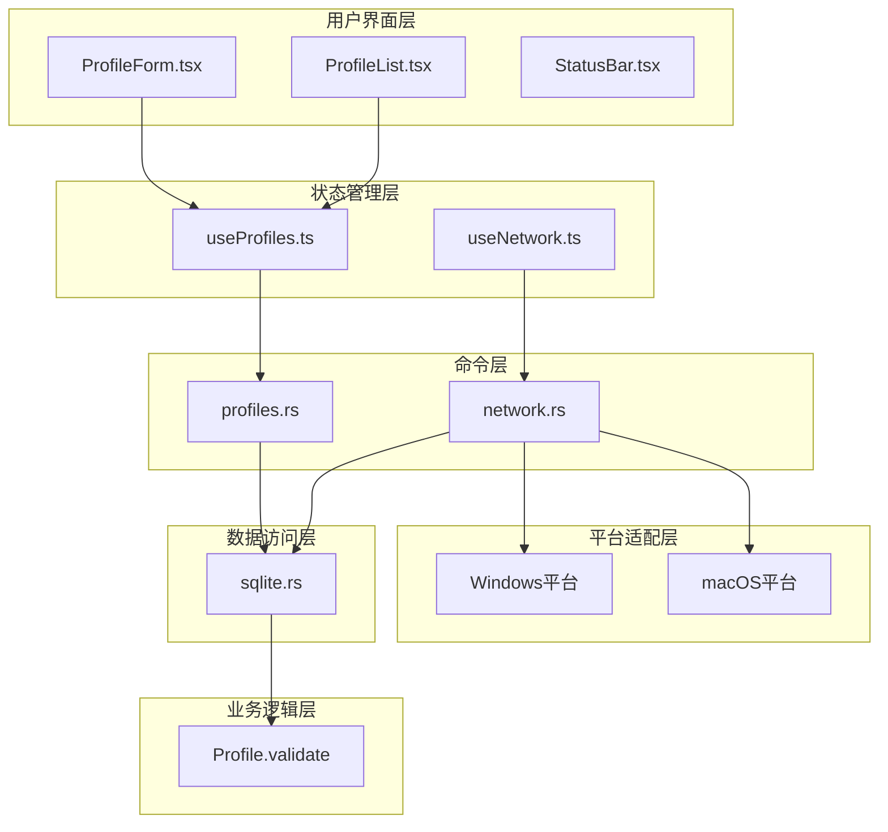

**图表来源**
- [App.tsx:10-195](file://src/App.tsx#L10-L195)
- [lib.rs:35-45](file://src-tauri/src/lib.rs#L35-L45)

**章节来源**
- [App.tsx:1-195](file://src/App.tsx#L1-L195)
- [lib.rs:1-49](file://src-tauri/src/lib.rs#L1-L49)

## 详细组件分析

### 配置方案生命周期管理

#### 创建流程

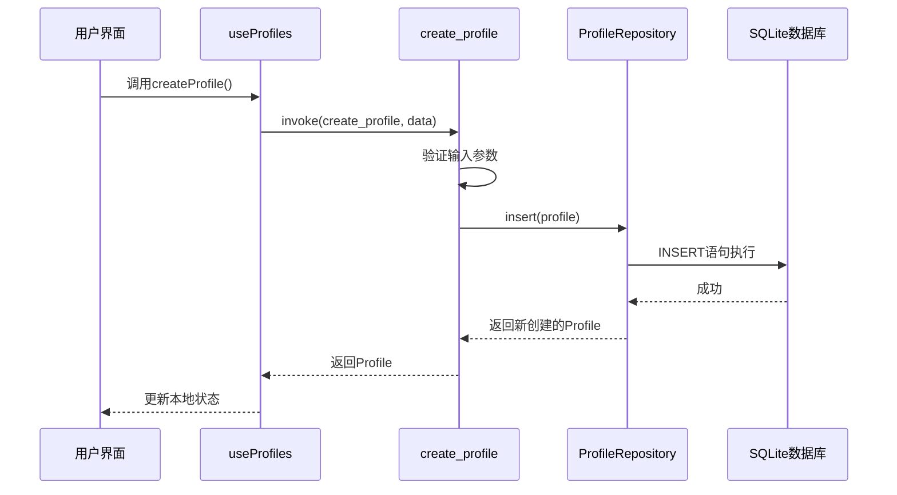

**图表来源**
- [useProfiles.ts:23-53](file://src/hooks/useProfiles.ts#L23-L53)
- [profiles.rs:24-61](file://src-tauri/src/commands/profiles.rs#L24-L61)
- [sqlite.rs:146-182](file://src-tauri/src/storage/sqlite.rs#L146-L182)

#### 查询流程

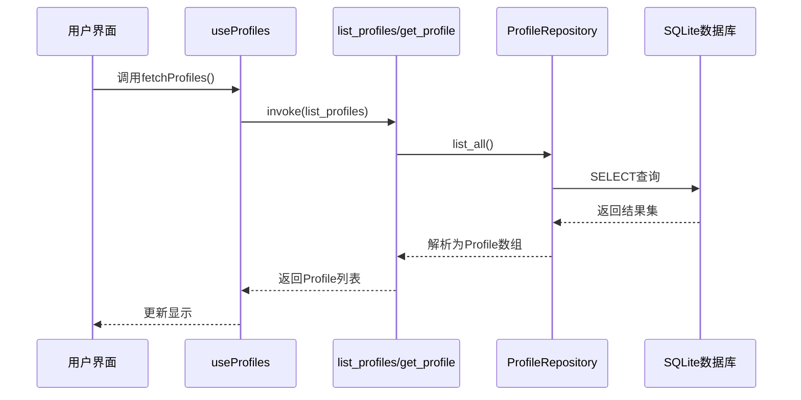

**图表来源**
- [useProfiles.ts:10-21](file://src/hooks/useProfiles.ts#L10-L21)
- [profiles.rs:9-22](file://src-tauri/src/commands/profiles.rs#L9-L22)
- [sqlite.rs:76-108](file://src-tauri/src/storage/sqlite.rs#L76-L108)

#### 更新流程

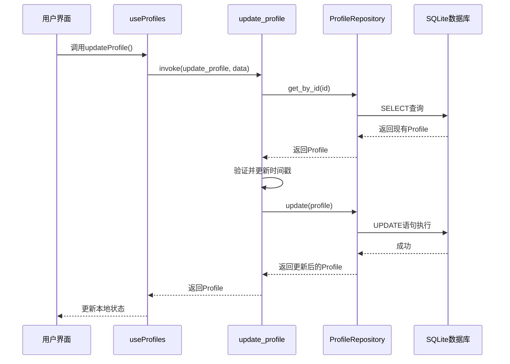

**图表来源**
- [useProfiles.ts:55-89](file://src/hooks/useProfiles.ts#L55-L89)
- [profiles.rs:63-104](file://src-tauri/src/commands/profiles.rs#L63-L104)
- [sqlite.rs:184-221](file://src-tauri/src/storage/sqlite.rs#L184-L221)

#### 删除流程

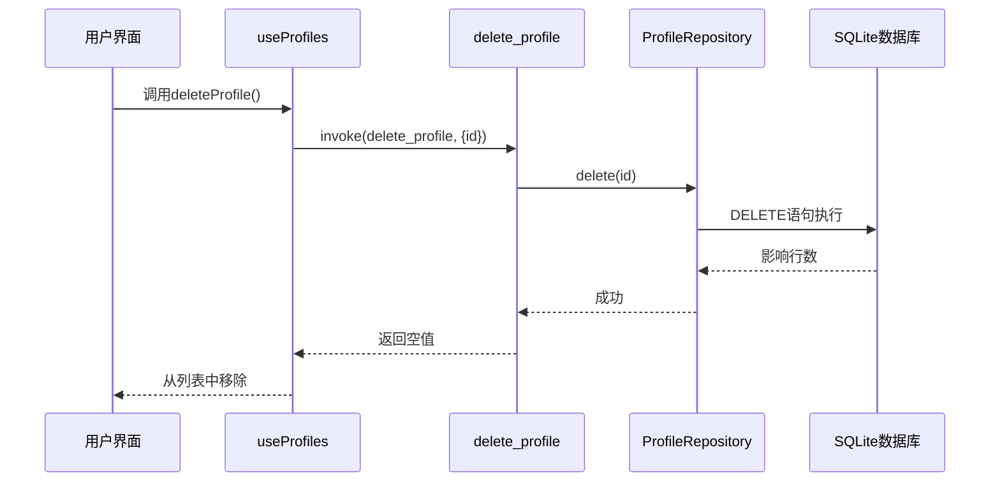

**图表来源**
- [useProfiles.ts:91-101](file://src/hooks/useProfiles.ts#L91-L101)
- [profiles.rs:106-112](file://src-tauri/src/commands/profiles.rs#L106-L112)
- [sqlite.rs:223-232](file://src-tauri/src/storage/sqlite.rs#L223-L232)

**章节来源**
- [profiles.rs:9-113](file://src-tauri/src/commands/profiles.rs#L9-L113)
- [sqlite.rs:76-232](file://src-tauri/src/storage/sqlite.rs#L76-L232)

### 数据验证规则

Profile.validate方法实现了完整的数据验证逻辑：

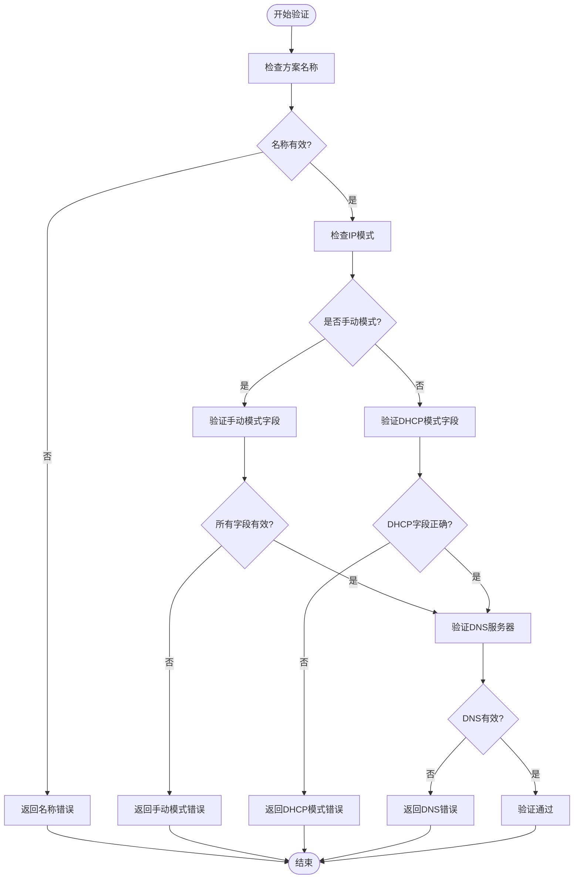

**图表来源**
- [profile.rs:34-81](file://src-tauri/src/models/profile.rs#L34-L81)

**章节来源**
- [profile.rs:34-81](file://src-tauri/src/models/profile.rs#L34-L81)

### 存储机制与数据持久化

#### SQLite数据库设计

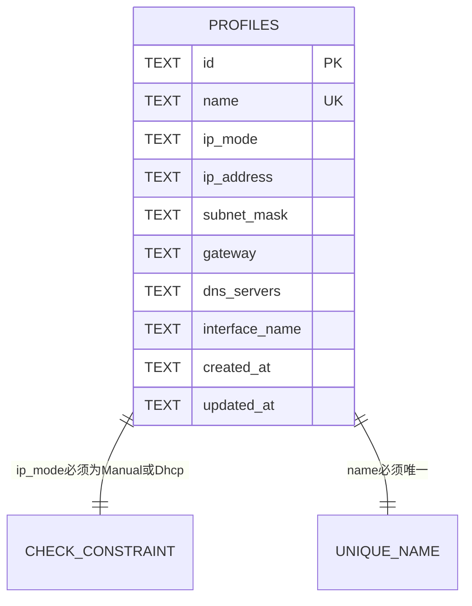

**图表来源**
- [sqlite.rs:59-74](file://src-tauri/src/storage/sqlite.rs#L59-L74)

#### 数据库连接管理

ProfileRepository使用Mutex保护SQLite连接，确保线程安全：

- **连接池管理**：单例模式，全局共享数据库连接
- **路径管理**：根据操作系统自动确定数据库文件位置
  - macOS: `~/Library/Application Support/com.ipswitcher.app/profiles.db`
  - Windows: `%APPDATA%/IPSwitcher/profiles.db`
- **迁移机制**：启动时自动创建表结构

**章节来源**
- [sqlite.rs:8-27](file://src-tauri/src/storage/sqlite.rs#L8-L27)
- [sqlite.rs:29-51](file://src-tauri/src/storage/sqlite.rs#L29-L51)
- [sqlite.rs:53-74](file://src-tauri/src/storage/sqlite.rs#L53-L74)

### 手动IP模式 vs DHCP模式

#### 手动IP模式

手动IP模式要求用户提供完整的网络配置信息：

| 字段 | 必填 | 验证规则 | 示例 |
|------|------|----------|------|
| ip_address | 必填 | 有效的IPv4地址 | 192.168.1.100 |
| subnet_mask | 必填 | 有效的IPv4地址 | 255.255.255.0 |
| gateway | 必填 | 有效的IPv4地址 | 192.168.1.1 |
| dns_servers | 必填 | 至少一个有效IPv4地址 | 8.8.8.8, 114.114.114.114 |

#### DHCP模式

DHCP模式自动获取网络配置，无需手动设置网络参数：
- 不允许设置IP地址、子网掩码、网关
- DNS服务器由DHCP服务器分配
- 适用于动态IP环境

**章节来源**
- [profile.rs:44-77](file://src-tauri/src/models/profile.rs#L44-L77)
- [ProfileForm.tsx:88-99](file://src/components/ProfileForm.tsx#L88-L99)

## 依赖关系分析

### 外部依赖

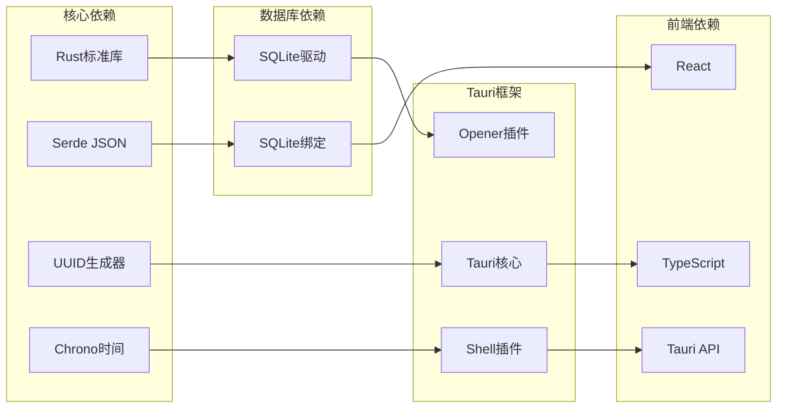

**图表来源**
- [Cargo.toml:12-24](file://src-tauri/Cargo.toml#L12-L24)

### 内部模块依赖

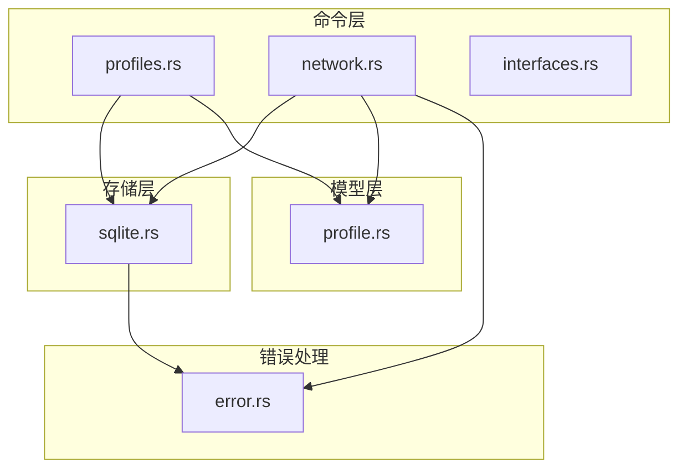

**图表来源**
- [lib.rs:35-45](file://src-tauri/src/lib.rs#L35-L45)
- [Cargo.toml:12-24](file://src-tauri/Cargo.toml#L12-L24)

**章节来源**
- [Cargo.toml:1-30](file://src-tauri/Cargo.toml#L1-L30)
- [lib.rs:1-49](file://src-tauri/src/lib.rs#L1-L49)

## 性能考虑

### 数据库性能优化

1. **连接池管理**：使用Mutex保护单个数据库连接，避免频繁连接开销
2. **索引策略**：在name字段上建立唯一索引，提高查询性能
3. **批量操作**：支持批量查询和更新操作
4. **内存管理**：合理使用Option类型，避免不必要的内存占用

### 前端性能优化

1. **状态管理**：使用React Hooks进行高效的状态更新
2. **渲染优化**：仅在必要时重新渲染组件
3. **事件处理**：使用useCallback优化函数引用
4. **异步处理**：合理处理异步操作，避免阻塞UI线程

### 网络配置性能

1. **权限检查**：避免不必要的权限提升操作
2. **配置缓存**：缓存当前网络配置，减少重复查询
3. **批量应用**：支持批量应用多个配置方案

## 故障排除指南

### 常见错误类型

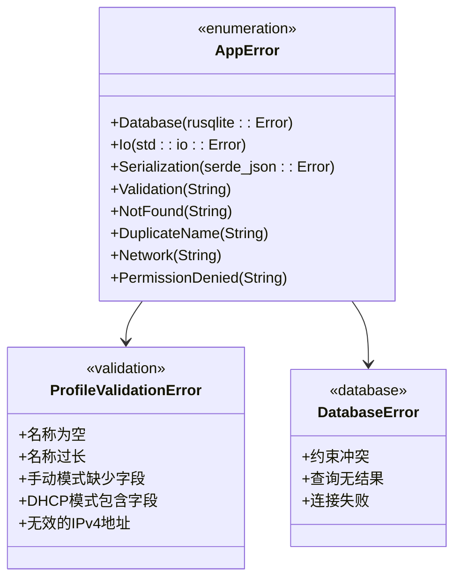

**图表来源**
- [error.rs:3-28](file://src-tauri/src/error.rs#L3-L28)

### 错误处理策略

#### 数据验证错误
- **名称验证失败**：返回"方案名称不能为空"或"方案名称不能超过64个字符"
- **手动模式验证失败**：返回具体的字段缺失信息
- **DHCP模式验证失败**：返回"不应设置IP地址/子网掩码/默认网关"

#### 数据库操作错误
- **重复名称**：返回"方案名称已存在"
- **记录不存在**：返回"方案不存在"
- **约束冲突**：处理SQLite约束违反异常

#### 权限错误
- **管理员权限**：检查当前进程是否具有管理员权限
- **权限提升**：在需要时提示用户提升权限

**章节来源**
- [error.rs:1-38](file://src-tauri/src/error.rs#L1-L38)
- [profile.rs:34-81](file://src-tauri/src/models/profile.rs#L34-L81)
- [sqlite.rs:173-182](file://src-tauri/src/storage/sqlite.rs#L173-L182)

### 调试技巧

1. **启用日志**：使用env_logger输出详细的应用程序日志
2. **数据库调试**：检查profiles.db文件中的数据完整性
3. **权限调试**：验证管理员权限状态
4. **网络调试**：监控网络接口状态变化

## 结论

IPSwitcher的配置方案管理系统提供了完整的网络配置解决方案，具有以下特点：

### 技术优势
- **跨平台兼容**：支持Windows和macOS平台
- **数据持久化**：使用SQLite确保数据可靠存储
- **类型安全**：Rust语言提供编译时类型安全保障
- **用户友好**：直观的图形界面和清晰的错误提示

### 功能特性
- **完整的生命周期管理**：支持配置方案的创建、查询、更新、删除
- **灵活的网络配置**：支持手动IP和DHCP两种模式
- **严格的验证机制**：确保数据完整性和网络配置的有效性
- **权限管理**：智能的管理员权限检测和提升

### 最佳实践建议
1. **命名规范**：使用描述性的方案名称，便于识别和管理
2. **备份策略**：定期备份profiles.db文件
3. **权限管理**：在需要时提升管理员权限以确保配置生效
4. **测试验证**：应用配置前先验证网络连通性

该系统为网络管理员和高级用户提供了强大的网络配置管理能力，通过简洁的界面和强大的功能实现了高效的网络配置切换需求。