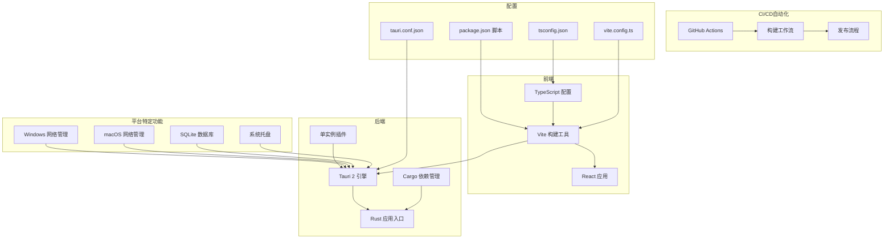
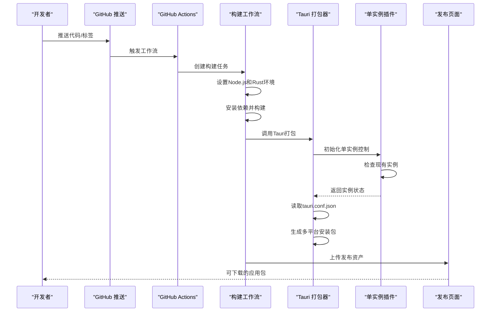
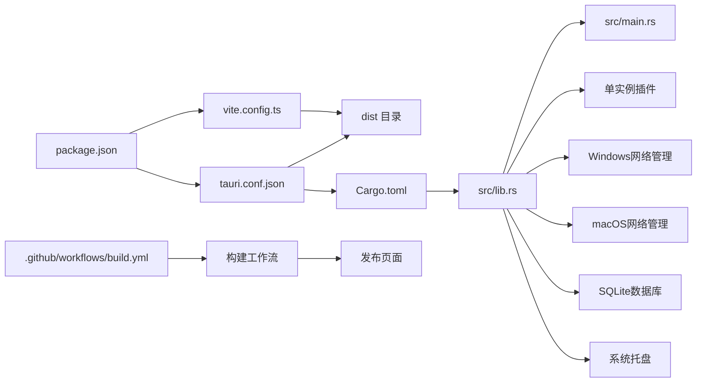

# 部署指南

<cite>
**本文档引用的文件**
- [.github/workflows/build.yml](file://.github/workflows/build.yml)
- [package.json](file://package.json)
- [vite.config.ts](file://vite.config.ts)
- [tsconfig.json](file://tsconfig.json)
- [src-tauri/Cargo.toml](file://src-tauri/Cargo.toml)
- [src-tauri/tauri.conf.json](file://src-tauri/tauri.conf.json)
- [src-tauri/build.rs](file://src-tauri/build.rs)
- [src-tauri/src/main.rs](file://src-tauri/src/main.rs)
- [src-tauri/src/lib.rs](file://src-tauri/src/lib.rs)
- [src-tauri/src/platform/windows.rs](file://src-tauri/src/platform/windows.rs)
- [src-tauri/src/platform/macos.rs](file://src-tauri/src/platform/macos.rs)
- [src-tauri/src/platform/mod.rs](file://src-tauri/src/platform/mod.rs)
- [src-tauri/src/storage/sqlite.rs](file://src-tauri/src/storage/sqlite.rs)
- [src-tauri/src/tray.rs](file://src-tauri/src/tray.rs)
- [src-tauri/src/macos_activate.rs](file://src-tauri/src/macos_activate.rs)
</cite>

## 更新摘要
**所做更改**
- 更新版本号至1.0.2，反映最新的版本升级
- 新增单实例行为配置，防止应用程序重复启动
- 改进Windows平台的网络管理，添加隐藏控制台窗口功能
- 增强macOS激活功能，支持前台应用切换
- 优化SQLite数据库路径管理，支持跨平台配置文件存储
- 更新系统托盘功能，增强用户交互体验

## 目录
1. [简介](#简介)
2. [项目结构](#项目结构)
3. [核心组件](#核心组件)
4. [架构概览](#架构概览)
5. [详细组件分析](#详细组件分析)
6. [依赖关系分析](#依赖关系分析)
7. [性能考虑](#性能考虑)
8. [故障排除指南](#故障排除指南)
9. [CI/CD自动化部署](#cicd自动化部署)
10. [结论](#结论)
11. [附录](#附录)

## 简介
本指南面向IPSwitcher项目的部署与发布，覆盖前端构建配置、Rust后端编译、跨平台打包以及发布准备等全流程。内容基于仓库中的实际配置文件，确保可操作性和准确性。特别关注版本1.0.2的更新，包括新增的单实例行为、Windows平台改进和增强的系统托盘功能。

## 项目结构
项目采用前后端分离架构：前端使用Vite+React，后端使用Tauri 2（Rust）。前端通过Vite进行开发与构建，Tauri配置负责将前端产物打包为桌面应用，并在各平台生成原生安装包。版本1.0.2引入了单实例插件和改进的平台特定功能。

**图表来源**
- [package.json:1-27](file://package.json#L1-L27)
- [vite.config.ts:1-25](file://vite.config.ts#L1-L25)
- [tsconfig.json:1-22](file://tsconfig.json#L1-L22)
- [src-tauri/tauri.conf.json:1-44](file://src-tauri/tauri.conf.json#L1-L44)
- [src-tauri/Cargo.toml:1-32](file://src-tauri/Cargo.toml#L1-L32)
- [.github/workflows/build.yml:1-64](file://.github/workflows/build.yml#L1-L64)

**章节来源**
- [package.json:1-27](file://package.json#L1-L27)
- [vite.config.ts:1-25](file://vite.config.ts#L1-L25)
- [tsconfig.json:1-22](file://tsconfig.json#L1-L22)
- [src-tauri/tauri.conf.json:1-44](file://src-tauri/tauri.conf.json#L1-L44)
- [src-tauri/Cargo.toml:1-32](file://src-tauri/Cargo.toml#L1-L32)
- [.github/workflows/build.yml:1-64](file://.github/workflows/build.yml#L1-L64)

## 核心组件
- 前端构建与开发服务器：由Vite提供，支持热重载与开发时代理配置。
- 应用壳层：Tauri 2负责窗口管理、系统托盘、插件集成与打包。
- 后端运行时：Rust实现命令处理、网络接口查询、配置应用与数据库访问。
- **新增**：单实例行为：防止应用程序重复启动，提升用户体验。
- **新增**：平台特定网络管理：Windows隐藏控制台窗口，macOS增强激活功能。
- **新增**：SQLite数据库：跨平台配置文件存储，支持活动配置跟踪。
- 版本与标识：统一的产品名称、版本号与应用标识符在前端与后端配置中保持一致。

**章节来源**
- [package.json:6-11](file://package.json#L6-L11)
- [vite.config.ts:6-24](file://vite.config.ts#L6-L24)
- [src-tauri/tauri.conf.json:3-11](file://src-tauri/tauri.conf.json#L3-L11)
- [src-tauri/src/lib.rs:19-26](file://src-tauri/src/lib.rs#L19-L26)
- [src-tauri/Cargo.toml:15](file://src-tauri/Cargo.toml#L15)
- [src-tauri/src/platform/windows.rs:7](file://src-tauri/src/platform/windows.rs#L7)
- [src-tauri/src/storage/sqlite.rs:29-51](file://src-tauri/src/storage/sqlite.rs#L29-L51)

## 架构概览
下图展示了从开发到打包的关键流程：前端构建产物被Tauri作为静态资源加载；后端通过命令处理器与系统交互；最终生成多平台安装包。版本1.0.2引入了单实例控制和改进的平台特定功能。

**图表来源**
- [.github/workflows/build.yml:3-63](file://.github/workflows/build.yml#L3-L63)
- [package.json:8](file://package.json#L8)
- [src-tauri/tauri.conf.json:6-11](file://src-tauri/tauri.conf.json#L6-L11)
- [src-tauri/src/lib.rs:20-26](file://src-tauri/src/lib.rs#L20-L26)

## 详细组件分析

### 前端构建配置
- 开发服务器：端口固定为1420，严格端口绑定，支持通过环境变量启用远程HMR。
- 忽略监听：排除src-tauri目录以避免不必要的重新触发。
- TypeScript：严格模式、模块解析使用bundler，确保与Vite生态兼容。

**章节来源**
- [vite.config.ts:6-24](file://vite.config.ts#L6-L24)
- [tsconfig.json:2-19](file://tsconfig.json#L2-L19)

### Tauri 应用配置
- 产品信息：名称、版本、标识符统一管理，版本号更新至1.0.2。
- 构建桥接：前端构建输出目录与开发URL配置，确保开发与打包路径一致。
- 窗口与托盘：窗口尺寸、最小尺寸、居中显示与托盘图标设置。
- 安全策略：CSP设为null，允许前端资源加载。
- 打包选项：启用打包、目标为全部平台，包含多尺寸图标与最低系统版本约束。

**章节来源**
- [src-tauri/tauri.conf.json:3-42](file://src-tauri/tauri.conf.json#L3-L42)

### Rust 应用入口与生命周期
- 入口函数：隐藏Windows控制台窗口（发布模式），调用应用运行函数。
- 应用初始化：日志初始化、数据库连接建立、插件注册。
- **新增**：单实例控制：注册单实例插件，处理重复启动情况。
- 系统托盘：应用启动时构建托盘图标，支持活动配置跟踪。
- 窗口事件：关闭请求时隐藏窗口并阻止默认关闭行为。
- 命令处理器：注册网络接口、当前配置、配置应用与管理员状态检查等命令。

**章节来源**
- [src-tauri/src/main.rs:1-7](file://src-tauri/src/main.rs#L1-L7)
- [src-tauri/src/lib.rs:13-77](file://src-tauri/src/lib.rs#L13-L77)

### 单实例行为实现
**新增** 版本1.0.2引入了单实例控制功能，防止应用程序重复启动：

- 插件注册：通过`tauri_plugin_single_instance::init()`注册单实例插件
- 实例检测：检查是否存在现有实例，如果存在则激活现有窗口
- 窗口控制：显示现有窗口并设置焦点，避免重复启动
- macOS激活：使用`activate_app()`确保应用在前台显示

**章节来源**
- [src-tauri/Cargo.toml:15](file://src-tauri/Cargo.toml#L15)
- [src-tauri/src/lib.rs:20-26](file://src-tauri/src/lib.rs#L20-L26)
- [src-tauri/src/macos_activate.rs:10-15](file://src-tauri/src/macos_activate.rs#L10-L15)

### Windows平台网络管理改进
**新增** Windows平台的网络管理功能得到显著改进：

- 隐藏控制台窗口：使用`CREATE_NO_WINDOW`标志隐藏netsh命令的控制台窗口
- 错误处理：改进的错误消息，提供更清晰的权限提示
- DNS配置：支持主DNS和备用DNS服务器设置
- 静态IP配置：完整的静态IP地址、子网掩码和网关设置流程

**章节来源**
- [src-tauri/src/platform/windows.rs:7](file://src-tauri/src/platform/windows.rs#L7)
- [src-tauri/src/platform/windows.rs:107-155](file://src-tauri/src/platform/windows.rs#L107-L155)

### macOS激活功能增强
**新增** macOS平台的激活功能得到增强：

- 前台应用切换：使用`activateIgnoringOtherApps: true`确保应用窗口在前台显示
- Dock图标处理：设置`ActivationPolicy::Accessory`隐藏Dock图标
- 交叉平台兼容：非macOS平台提供空实现

**章节来源**
- [src-tauri/src/macos_activate.rs:10-15](file://src-tauri/src/macos_activate.rs#L10-L15)
- [src-tauri/src/lib.rs:33-37](file://src-tauri/src/lib.rs#L33-L37)

### SQLite数据库配置
**新增** 跨平台数据库配置支持：

- 数据库路径：macOS使用`~/Library/Application Support/com.ipswitcher.app/profiles.db`
- 数据库路径：Windows使用`%APPDATA%/IPSwitcher/profiles.db`
- 设置存储：使用settings表存储活动配置ID
- 数据迁移：自动创建profiles和settings表

**章节来源**
- [src-tauri/src/storage/sqlite.rs:29-51](file://src-tauri/src/storage/sqlite.rs#L29-L51)
- [src-tauri/src/storage/sqlite.rs:260-296](file://src-tauri/src/storage/sqlite.rs#L260-L296)

### 系统托盘功能增强
**新增** 系统托盘功能得到增强：

- 动态菜单：根据活动配置动态显示复选标记
- 配置切换：支持直接从托盘菜单切换配置
- 用户交互：支持新建配置、显示窗口和退出应用
- 状态同步：托盘菜单与主界面状态保持同步

**章节来源**
- [src-tauri/src/tray.rs:25-66](file://src-tauri/src/tray.rs#L25-L66)
- [src-tauri/src/tray.rs:77-101](file://src-tauri/src/tray.rs#L77-L101)

### 依赖与版本管理
- 前端依赖：React、@tauri-apps/api、@tauri-apps/plugin-shell等。
- 开发依赖：@tauri-apps/cli、Vite、TypeScript及React相关类型。
- **新增**：后端依赖：Tauri核心、shell与opener插件、**single-instance插件**、SQLite、UUID、时间与正则表达式等。
- 版本号：前端与后端均使用**1.0.2**，确保版本一致性。

**章节来源**
- [package.json:12-25](file://package.json#L12-L25)
- [src-tauri/Cargo.toml:12-25](file://src-tauri/Cargo.toml#L12-L25)
- [src-tauri/tauri.conf.json:3-4](file://src-tauri/tauri.conf.json#L3-L4)

## 依赖关系分析
前端与后端通过Tauri配置建立紧密耦合：前端构建产物作为静态资源嵌入，后端通过命令通道与前端通信。版本1.0.2引入了单实例插件和平台特定功能，进一步增强了整个系统的稳定性。Cargo与package.json分别管理后端与前端依赖，版本号保持一致以避免运行时冲突。

**图表来源**
- [package.json:1-27](file://package.json#L1-L27)
- [vite.config.ts:1-25](file://vite.config.ts#L1-L25)
- [src-tauri/tauri.conf.json:1-44](file://src-tauri/tauri.conf.json#L1-L44)
- [src-tauri/Cargo.toml:1-32](file://src-tauri/Cargo.toml#L1-L32)
- [src-tauri/src/lib.rs:1-78](file://src-tauri/src/lib.rs#L1-L78)
- [src-tauri/src/main.rs:1-7](file://src-tauri/src/main.rs#L1-L7)
- [.github/workflows/build.yml:1-64](file://.github/workflows/build.yml#L1-L64)

**章节来源**
- [package.json:1-27](file://package.json#L1-L27)
- [src-tauri/tauri.conf.json:1-44](file://src-tauri/tauri.conf.json#L1-L44)
- [src-tauri/Cargo.toml:1-32](file://src-tauri/Cargo.toml#L1-L32)
- [.github/workflows/build.yml:1-64](file://.github/workflows/build.yml#L1-L64)

## 性能考虑
- 构建优化：启用严格模块解析与bundler，减少运行时模块解析开销。
- 打包体积：根据需要裁剪未使用的插件与功能，避免引入不必要的依赖。
- 运行时：在生产模式下隐藏控制台窗口，减少系统资源占用。
- **新增**：单实例优化：避免重复启动带来的资源浪费。
- **新增**：Windows网络管理优化：隐藏控制台窗口，提升用户体验。
- 平台适配：针对不同平台设置合适的最小系统版本与图标尺寸，提升用户体验。
- **新增**：CI/CD缓存优化：Rust缓存工作空间配置，显著提升构建速度。

## 故障排除指南
- 开发服务器无法热更新：检查Vite配置中的host与HMR设置，确认端口未被占用。
- 打包失败或产物缺失：核对tauri.conf.json中的frontendDist与beforeBuildCommand是否正确指向构建输出。
- 数据库初始化错误：确认SQLite依赖与bundled特性已启用，且数据库文件权限正确。
- 权限问题：在需要管理员权限的场景下，确保应用具备相应能力与用户授权。
- **新增**：单实例启动问题：检查单实例插件配置，确认实例检测逻辑正常工作。
- **新增**：Windows网络命令失败：确认netsh命令可用，检查CREATE_NO_WINDOW标志设置。
- **新增**：macOS激活失败：检查NSApplication调用权限，确认Dock图标设置正确。
- **新增**：SQLite路径问题：确认跨平台数据库路径配置正确，检查用户目录权限。
- **新增**：CI/CD构建失败：检查GitHub Actions工作流中的环境变量、权限设置和依赖安装步骤。

**章节来源**
- [vite.config.ts:9-22](file://vite.config.ts#L9-L22)
- [src-tauri/tauri.conf.json:6-11](file://src-tauri/tauri.conf.json#L6-L11)
- [src-tauri/Cargo.toml:18](file://src-tauri/Cargo.toml#L18)
- [src-tauri/src/lib.rs:16](file://src-tauri/src/lib.rs#L16)
- [src-tauri/src/platform/windows.rs:10](file://src-tauri/src/platform/windows.rs#L10)
- [src-tauri/src/storage/sqlite.rs:29-51](file://src-tauri/src/storage/sqlite.rs#L29-L51)
- [.github/workflows/build.yml:30-63](file://.github/workflows/build.yml#L30-L63)

## CI/CD自动化部署

### GitHub Actions工作流配置
项目使用GitHub Actions实现完全自动化的CI/CD流程。工作流在标签推送时触发，支持多平台并行构建。

**触发条件**：
- 标签推送：当推送到以"v"开头的标签时自动触发
- 手动触发：支持workflow_dispatch手动触发

**权限设置**：
- contents: write - 允许创建发布和上传资产
- 自动获取GITHUB_TOKEN用于认证

**构建矩阵配置**：
- macOS (aarch64-apple-darwin)：生成.app包
- macOS (x86_64-apple-darwin)：生成.app包  
- Windows (x86_64-pc-windows-msvc)：生成.nsis安装包

**构建步骤**：
1. 代码检出和Node.js设置
2. Rust工具链和目标设置
3. Rust缓存配置（src-tauri -> target）
4. 前端依赖安装和构建
5. Tauri应用打包和发布

**章节来源**
- [.github/workflows/build.yml:1-64](file://.github/workflows/build.yml#L1-L64)

### 自动化构建脚本
- 前端构建：调用Vite构建命令，输出至dist目录
- 后端打包：通过Tauri CLI读取配置并生成安装包
- 预览验证：本地预览构建产物，确保UI与命令可用性
- **新增**：CI/CD自动化：GitHub Actions自动执行完整构建和发布流程

**章节来源**
- [package.json:8](file://package.json#L8)
- [.github/workflows/build.yml:50-63](file://.github/workflows/build.yml#L50-L63)

### 发布流程
- 版本管理：使用Git标签作为版本标识，自动生成对应版本号（1.0.2）
- 多平台发布：同时生成macOS (.app)、Windows (.msi)等平台安装包
- 自动发布：创建草稿发布，包含版本号和发布说明
- 资产上传：自动上传所有构建产物到GitHub Releases

**章节来源**
- [.github/workflows/build.yml:55-63](file://.github/workflows/build.yml#L55-L63)

## 结论
本指南基于仓库现有配置，提供了IPSwitcher从开发到发布的完整路径。版本1.0.2引入了重要的新功能，包括单实例行为、改进的Windows平台网络管理、增强的macOS激活功能和跨平台数据库支持。新增的GitHub Actions CI/CD工作流实现了完全自动化的多平台构建和发布流程，显著提升了开发效率和发布质量。建议在正式发布前统一版本号、完善平台图标与最低系统版本设置，并充分利用CI/CD自动化流水线实现持续交付。

## 附录

### CI/CD 集成方案
- **触发条件**：主分支推送、标签创建（v*格式）、PR合并、手动触发
- **构建矩阵**：macOS (aarch64/x86_64)、Windows (x86_64)并行构建
- **步骤建议**：
  1) 检出代码并安装依赖（前端与Rust工具链）
  2) 运行前端构建与类型检查
  3) 使用Tauri CLI执行打包，生成多平台安装包
  4) 上传制品到GitHub Releases草稿
- **环境变量**：自动配置GITHUB_TOKEN，支持自定义构建参数

**章节来源**
- [.github/workflows/build.yml:3-63](file://.github/workflows/build.yml#L3-L63)

### 自动化构建脚本
- 前端构建：调用Vite构建命令，输出至dist目录
- 后端打包：通过Tauri CLI读取配置并生成安装包
- 预览验证：本地预览构建产物，确保UI与命令可用性
- **新增**：CI/CD自动执行：GitHub Actions自动完成完整构建流程

**章节来源**
- [package.json:8](file://package.json#L8)
- [.github/workflows/build.yml:50-63](file://.github/workflows/build.yml#L50-L63)

### 发布流程
- 版本管理：使用Git标签作为版本标识，自动提取版本号（1.0.2）
- 更新机制：当前配置未包含自动更新逻辑，可在后续迭代中引入Tauri Updater插件
- 分发渠道：根据目标平台选择对应安装包（.app/.msi等）
- **新增**：GitHub Releases：自动创建发布页面，包含所有平台产物

**章节来源**
- [.github/workflows/build.yml:55-63](file://.github/workflows/build.yml#L55-L63)

### 安全考虑
- 代码签名：为Windows（MSI）、macOS（DMG）与Linux（AppImage）配置代码签名证书与权限
- 应用商店发布：遵循各平台商店规范，准备合规的元数据、截图与隐私政策链接
- **新增**：单实例安全：防止恶意重复启动，保护系统资源
- **新增**：平台特定安全：Windows隐藏控制台窗口，macOS前台应用切换权限
- **新增**：CI/CD安全：使用GitHub Actions的GITHUB_TOKEN进行安全认证，限制发布权限

**章节来源**
- [.github/workflows/build.yml:9-10](file://.github/workflows/build.yml#L9-L10)
- [.github/workflows/build.yml:55-63](file://.github/workflows/build.yml#L55-L63)

### 版本升级注意事项
- **版本号更新**：确保前端、后端和配置文件中的版本号保持一致（1.0.2）
- **单实例配置**：检查单实例插件配置，确保实例检测逻辑正常工作
- **平台特定功能**：验证Windows网络管理的控制台窗口隐藏功能
- **数据库迁移**：确认SQLite数据库路径和设置存储功能正常
- **托盘功能**：测试系统托盘的动态菜单和配置切换功能

**章节来源**
- [package.json:4](file://package.json#L4)
- [src-tauri/Cargo.toml:3](file://src-tauri/Cargo.toml#L3)
- [src-tauri/tauri.conf.json:4](file://src-tauri/tauri.conf.json#L4)
- [src-tauri/src/lib.rs:20-26](file://src-tauri/src/lib.rs#L20-L26)
- [src-tauri/src/platform/windows.rs:10](file://src-tauri/src/platform/windows.rs#L10)
- [src-tauri/src/storage/sqlite.rs:29-51](file://src-tauri/src/storage/sqlite.rs#L29-L51)
- [src-tauri/src/tray.rs:25-66](file://src-tauri/src/tray.rs#L25-L66)