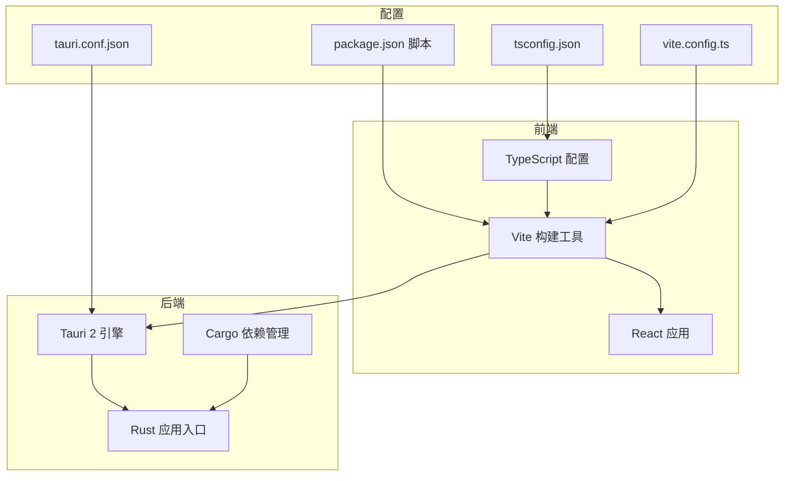
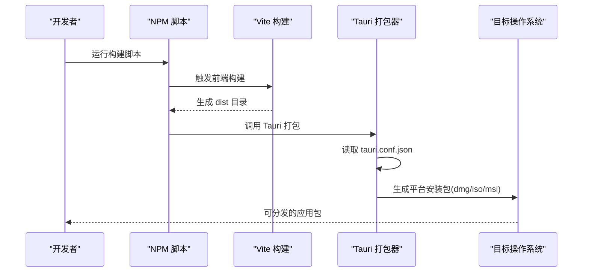
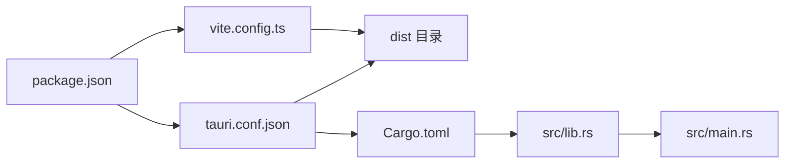

# 部署指南

<cite>
**本文档引用的文件**
- [package.json](file://package.json)
- [vite.config.ts](file://vite.config.ts)
- [tsconfig.json](file://tsconfig.json)
- [src-tauri/Cargo.toml](file://src-tauri/Cargo.toml)
- [src-tauri/tauri.conf.json](file://src-tauri/tauri.conf.json)
- [src-tauri/build.rs](file://src-tauri/build.rs)
- [src-tauri/src/main.rs](file://src-tauri/src/main.rs)
- [src-tauri/src/lib.rs](file://src-tauri/src/lib.rs)
</cite>

## 目录
1. [简介](#简介)
2. [项目结构](#项目结构)
3. [核心组件](#核心组件)
4. [架构概览](#架构概览)
5. [详细组件分析](#详细组件分析)
6. [依赖关系分析](#依赖关系分析)
7. [性能考虑](#性能考虑)
8. [故障排除指南](#故障排除指南)
9. [结论](#结论)
10. [附录](#附录)

## 简介
本指南面向IPSwitcher项目的部署与发布，覆盖前端构建配置、Rust后端编译、跨平台打包以及发布准备等全流程。内容基于仓库中的实际配置文件，确保可操作性和准确性。

## 项目结构
项目采用前后端分离架构：前端使用Vite+React，后端使用Tauri 2（Rust）。前端通过Vite进行开发与构建，Tauri配置负责将前端产物打包为桌面应用，并在各平台生成原生安装包。

图表来源
- [package.json:1-27](file://package.json#L1-L27)
- [vite.config.ts:1-25](file://vite.config.ts#L1-L25)
- [tsconfig.json:1-22](file://tsconfig.json#L1-L22)
- [src-tauri/tauri.conf.json:1-48](file://src-tauri/tauri.conf.json#L1-L48)
- [src-tauri/Cargo.toml:1-30](file://src-tauri/Cargo.toml#L1-L30)

章节来源
- [package.json:1-27](file://package.json#L1-L27)
- [vite.config.ts:1-25](file://vite.config.ts#L1-L25)
- [tsconfig.json:1-22](file://tsconfig.json#L1-L22)
- [src-tauri/tauri.conf.json:1-48](file://src-tauri/tauri.conf.json#L1-L48)
- [src-tauri/Cargo.toml:1-30](file://src-tauri/Cargo.toml#L1-L30)

## 核心组件
- 前端构建与开发服务器：由Vite提供，支持热重载与开发时代理配置。
- 应用壳层：Tauri 2负责窗口管理、系统托盘、插件集成与打包。
- 后端运行时：Rust实现命令处理、网络接口查询、配置应用与数据库访问。
- 版本与标识：统一的产品名称、版本号与应用标识符在前端与后端配置中保持一致。

章节来源
- [package.json:6-11](file://package.json#L6-L11)
- [vite.config.ts:6-24](file://vite.config.ts#L6-L24)
- [src-tauri/tauri.conf.json:3-11](file://src-tauri/tauri.conf.json#L3-L11)
- [src-tauri/src/lib.rs:13-48](file://src-tauri/src/lib.rs#L13-L48)

## 架构概览
下图展示了从开发到打包的关键流程：前端构建产物被Tauri作为静态资源加载；后端通过命令处理器与系统交互；最终生成多平台安装包。

图表来源
- [package.json:8](file://package.json#L8)
- [src-tauri/tauri.conf.json:6-11](file://src-tauri/tauri.conf.json#L6-L11)

## 详细组件分析

### 前端构建配置
- 开发服务器：端口固定为1420，严格端口绑定，支持通过环境变量启用远程HMR。
- 忽略监听：排除src-tauri目录以避免不必要的重新触发。
- TypeScript：严格模式、模块解析使用bundler，确保与Vite生态兼容。

章节来源
- [vite.config.ts:6-24](file://vite.config.ts#L6-L24)
- [tsconfig.json:2-19](file://tsconfig.json#L2-L19)

### Tauri 应用配置
- 产品信息：名称、版本、标识符统一管理。
- 构建桥接：前端构建输出目录与开发URL配置，确保开发与打包路径一致。
- 窗口与托盘：窗口尺寸、最小尺寸、居中显示与托盘图标设置。
- 安全策略：CSP设为null，允许前端资源加载。
- 打包选项：启用打包、目标为全部平台，包含多尺寸图标与最低系统版本约束。

章节来源
- [src-tauri/tauri.conf.json:3-46](file://src-tauri/tauri.conf.json#L3-L46)

### Rust 应用入口与生命周期
- 入口函数：隐藏Windows控制台窗口（发布模式），调用应用运行函数。
- 应用初始化：日志初始化、数据库连接建立、插件注册。
- 系统托盘：应用启动时构建托盘图标。
- 窗口事件：关闭请求时隐藏窗口并阻止默认关闭行为。
- 命令处理器：注册网络接口、当前配置、配置应用与管理员状态检查等命令。

章节来源
- [src-tauri/src/main.rs:1-7](file://src-tauri/src/main.rs#L1-L7)
- [src-tauri/src/lib.rs:13-48](file://src-tauri/src/lib.rs#L13-L48)

### 依赖与版本管理
- 前端依赖：React、@tauri-apps/api、@tauri-apps/plugin-shell等。
- 开发依赖：@tauri-apps/cli、Vite、TypeScript及React相关类型。
- 后端依赖：Tauri核心、shell与opener插件、SQLite、UUID、时间与正则表达式等。
- 版本号：前端与后端均使用1.0.0，建议在发布前统一更新。

章节来源
- [package.json:12-25](file://package.json#L12-L25)
- [src-tauri/Cargo.toml:12-25](file://src-tauri/Cargo.toml#L12-L25)
- [src-tauri/tauri.conf.json:3-4](file://src-tauri/tauri.conf.json#L3-L4)

## 依赖关系分析
前端与后端通过Tauri配置建立紧密耦合：前端构建产物作为静态资源嵌入，后端通过命令通道与前端通信。Cargo与package.json分别管理后端与前端依赖，版本号需保持一致以避免运行时冲突。

图表来源
- [package.json:1-27](file://package.json#L1-L27)
- [vite.config.ts:1-25](file://vite.config.ts#L1-L25)
- [src-tauri/tauri.conf.json:1-48](file://src-tauri/tauri.conf.json#L1-L48)
- [src-tauri/Cargo.toml:1-30](file://src-tauri/Cargo.toml#L1-L30)
- [src-tauri/src/lib.rs:1-49](file://src-tauri/src/lib.rs#L1-L49)
- [src-tauri/src/main.rs:1-7](file://src-tauri/src/main.rs#L1-L7)

章节来源
- [package.json:1-27](file://package.json#L1-L27)
- [src-tauri/tauri.conf.json:1-48](file://src-tauri/tauri.conf.json#L1-L48)
- [src-tauri/Cargo.toml:1-30](file://src-tauri/Cargo.toml#L1-L30)

## 性能考虑
- 构建优化：启用严格模块解析与bundler，减少运行时模块解析开销。
- 打包体积：根据需要裁剪未使用的插件与功能，避免引入不必要的依赖。
- 运行时：在生产模式下隐藏控制台窗口，减少系统资源占用。
- 平台适配：针对不同平台设置合适的最小系统版本与图标尺寸，提升用户体验。

## 故障排除指南
- 开发服务器无法热更新：检查Vite配置中的host与HMR设置，确认端口未被占用。
- 打包失败或产物缺失：核对tauri.conf.json中的frontendDist与beforeBuildCommand是否正确指向构建输出。
- 数据库初始化错误：确认SQLite依赖与bundled特性已启用，且数据库文件权限正确。
- 权限问题：在需要管理员权限的场景下，确保应用具备相应能力与用户授权。

章节来源
- [vite.config.ts:9-22](file://vite.config.ts#L9-L22)
- [src-tauri/tauri.conf.json:6-11](file://src-tauri/tauri.conf.json#L6-L11)
- [src-tauri/Cargo.toml:18](file://src-tauri/Cargo.toml#L18)
- [src-tauri/src/lib.rs:16](file://src-tauri/src/lib.rs#L16)

## 结论
本指南基于仓库现有配置，提供了IPSwitcher从开发到发布的完整路径。建议在正式发布前统一版本号、完善平台图标与最低系统版本设置，并结合CI/CD自动化流水线实现持续交付。

## 附录

### CI/CD 集成方案
- 触发条件：主分支推送、标签创建、PR合并。
- 步骤建议：
  1) 检出代码并安装依赖（前端与Rust工具链）。
  2) 运行前端构建与类型检查。
  3) 使用Tauri CLI执行打包，生成多平台安装包。
  4) 上传制品到发布页面或分发平台。
- 环境变量：如需远程HMR，设置开发主机地址；打包阶段可配置签名参数（见安全考虑）。

### 自动化构建脚本
- 前端构建：调用Vite构建命令，输出至dist目录。
- 后端打包：通过Tauri CLI读取配置并生成安装包。
- 预览验证：本地预览构建产物，确保UI与命令可用性。

### 发布流程
- 版本管理：在package.json与Cargo.toml中同步更新版本号，创建Git标签。
- 更新机制：当前配置未包含自动更新逻辑，可在后续迭代中引入Tauri Updater插件。
- 分发渠道：根据目标平台选择对应安装包（dmg/iso/msi/apk等）。

### 安全考虑
- 代码签名：为Windows（MSI）、macOS（DMG）与Linux（AppImage）配置代码签名证书与权限。
- 应用商店发布：遵循各平台商店规范，准备合规的元数据、截图与隐私政策链接。