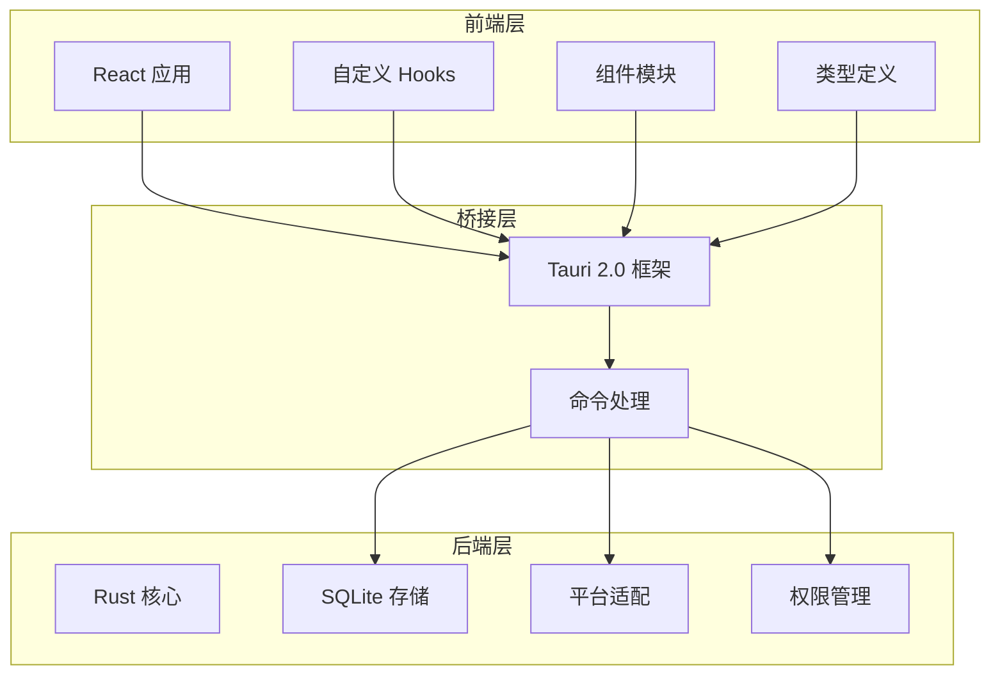
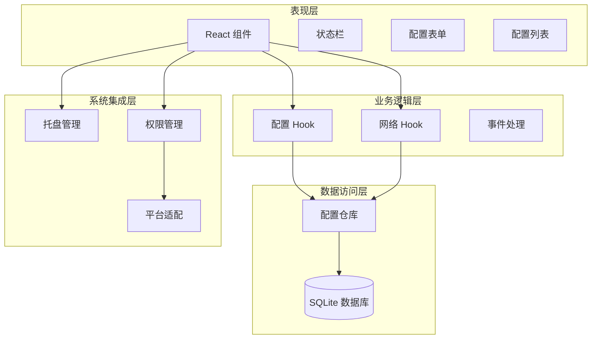
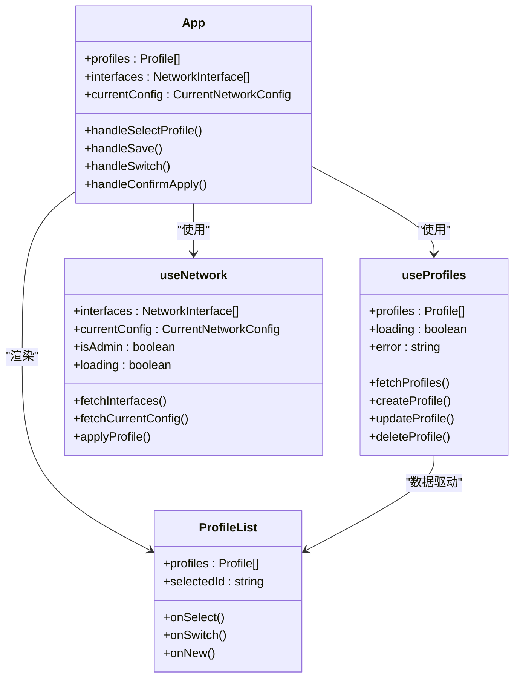
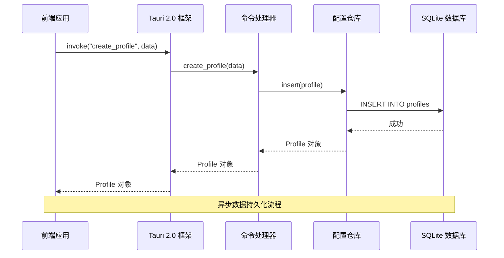
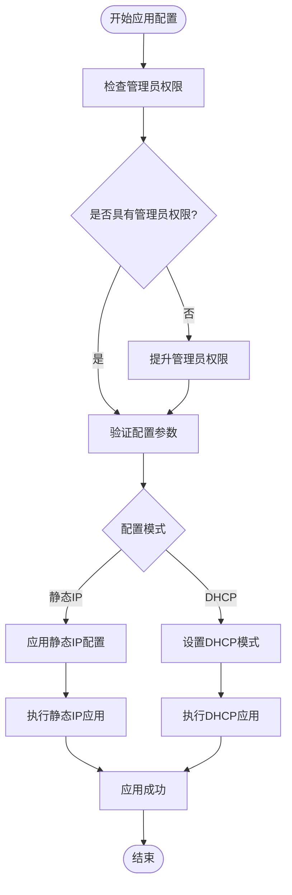
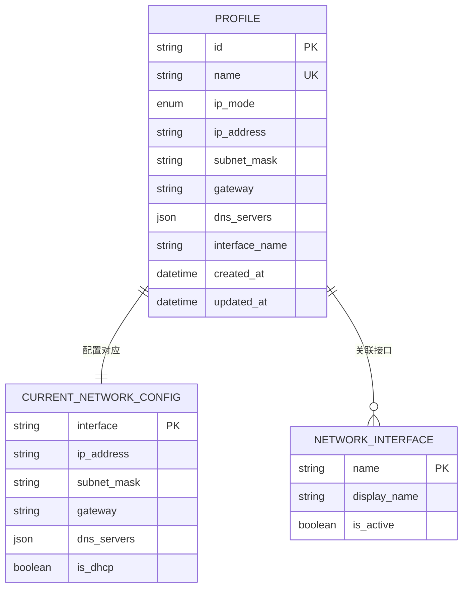

# 项目概述

<cite>
**本文档引用的文件**
- [README.md](file://README.md)
- [package.json](file://package.json)
- [Cargo.toml](file://src-tauri/Cargo.toml)
- [tauri.conf.json](file://src-tauri/tauri.conf.json)
- [App.tsx](file://src/App.tsx)
- [main.tsx](file://src/main.tsx)
- [useProfiles.ts](file://src/hooks/useProfiles.ts)
- [useNetwork.ts](file://src/hooks/useNetwork.ts)
- [lib.rs](file://src-tauri/src/lib.rs)
- [commands/mod.rs](file://src-tauri/src/commands/mod.rs)
- [commands/profiles.rs](file://src-tauri/src/commands/profiles.rs)
- [commands/interfaces.rs](file://src-tauri/src/commands/interfaces.rs)
- [commands/network.rs](file://src-tauri/src/commands/network.rs)
- [storage/sqlite.rs](file://src-tauri/src/storage/sqlite.rs)
- [types/index.ts](file://src/types/index.ts)
- [models/profile.rs](file://src-tauri/src/models/profile.rs)
- [platform/mod.rs](file://src-tauri/src/platform/mod.rs)
</cite>

## 更新摘要
**所做更改**
- 更新项目架构描述以反映完全迁移到Git仓库的状态
- 新增现代Tauri 2.0 + Rust架构的完整技术栈说明
- 补充完整的项目文档结构和组件关系分析
- 更新技术栈依赖和平台支持信息
- 增强跨平台兼容性和性能优化相关内容

## 目录
1. [简介](#简介)
2. [项目结构](#项目结构)
3. [核心组件](#核心组件)
4. [架构总览](#架构总览)
5. [详细组件分析](#详细组件分析)
6. [依赖关系分析](#依赖关系分析)
7. [性能考虑](#性能考虑)
8. [故障排除指南](#故障排除指南)
9. [结论](#结论)

## 简介
IPSwitcher 是一个基于 Tauri 2.0 框架开发的跨平台桌面应用程序，专注于网络配置切换与管理。该项目已完全迁移到 Git 仓库，建立了现代的 Tauri 2.0 + Rust 架构，采用 React + Rust 的技术栈组合，通过前端 React 提供直观的用户界面，后端 Rust 负责系统级网络操作与数据持久化，实现安全、高效的网络配置方案管理。

项目目标是为用户提供便捷的网络配置切换能力，支持静态 IP 和 DHCP 两种模式，并通过托盘图标实现后台常驻与快速操作。该应用面向需要频繁切换网络配置的开发者、运维人员以及需要在不同网络环境间快速切换的终端用户。项目现已建立完整的项目文档结构，包含详细的架构说明、组件分析和开发指南。

## 项目结构
项目采用前后端分离的架构设计，前端使用 Vite + React 构建，后端使用 Tauri + Rust 实现系统集成与网络操作。项目已完全迁移到 Git 仓库，建立了标准的现代软件开发流程。



**图表来源**
- [main.tsx:1-11](file://src/main.tsx#L1-L11)
- [lib.rs:12-48](file://src-tauri/src/lib.rs#L12-L48)
- [commands/mod.rs:1-4](file://src-tauri/src/commands/mod.rs#L1-L4)

**章节来源**
- [README.md:99-141](file://README.md#L99-L141)
- [package.json:1-27](file://package.json#L1-L27)
- [Cargo.toml:1-31](file://src-tauri/Cargo.toml#L1-L31)
- [tauri.conf.json:1-44](file://src-tauri/tauri.conf.json#L1-L44)

## 核心组件
IPSwitcher 的核心功能围绕三个主要组件构建：配置管理、网络操作和系统集成。

### 配置管理组件
配置管理负责网络配置方案的创建、编辑、删除和持久化存储。系统使用 SQLite 数据库存储所有配置信息，支持自动迁移和约束检查。数据模型包含完整的验证规则，确保配置的完整性和有效性。

### 网络操作组件
网络操作组件提供网络接口枚举、当前配置查询和配置应用功能。支持静态 IP 和 DHCP 两种模式，并具备管理员权限检测和提升机制。通过 NetworkManager trait 抽象平台差异，为 macOS 和 Windows 提供统一的操作接口。

### 系统集成组件
系统集成组件实现托盘图标、窗口管理和事件监听。通过托盘菜单提供快速新建配置和切换方案的能力，支持跨平台的系统级集成。应用启动时自动恢复上次使用的配置方案，提供无缝的用户体验。

**章节来源**
- [useProfiles.ts:1-131](file://src/hooks/useProfiles.ts#L1-L131)
- [useNetwork.ts:1-99](file://src/hooks/useNetwork.ts#L1-L99)
- [lib.rs:18-48](file://src-tauri/src/lib.rs#L18-L48)

## 架构总览
IPSwitcher 采用分层架构设计，确保前后端分离、职责清晰。项目已完全迁移到 Git 仓库，建立了标准的现代软件开发流程和完整的项目文档结构。



**图表来源**
- [App.tsx:10-208](file://src/App.tsx#L10-L208)
- [lib.rs:18-48](file://src-tauri/src/lib.rs#L18-L48)
- [storage/sqlite.rs:8-27](file://src-tauri/src/storage/sqlite.rs#L8-L27)

## 详细组件分析

### 前端应用架构
前端应用采用函数式组件和自定义 Hook 的设计模式，实现状态管理和业务逻辑分离。项目已建立完整的组件体系，包含配置列表、表单编辑、状态栏等核心组件。



**图表来源**
- [App.tsx:10-208](file://src/App.tsx#L10-L208)
- [useProfiles.ts:5-130](file://src/hooks/useProfiles.ts#L5-L130)
- [useNetwork.ts:5-98](file://src/hooks/useNetwork.ts#L5-L98)
- [ProfileList.tsx:13-51](file://src/components/ProfileList.tsx#L13-L51)

### 后端命令处理架构
后端采用命令模式处理前端请求，每个命令对应特定的业务功能。项目已建立完整的命令体系，包含配置管理、网络操作、接口枚举等功能模块。



**图表来源**
- [commands/profiles.rs:24-61](file://src-tauri/src/commands/profiles.rs#L24-L61)
- [storage/sqlite.rs:146-182](file://src-tauri/src/storage/sqlite.rs#L146-L182)

### 网络配置应用流程
网络配置应用涉及权限检查、参数验证和系统调用等步骤。通过 NetworkManager trait 抽象平台差异，实现跨平台的网络配置管理。



**图表来源**
- [commands/network.rs:29-95](file://src-tauri/src/commands/network.rs#L29-L95)

**章节来源**
- [App.tsx:10-208](file://src/App.tsx#L10-L208)
- [useProfiles.ts:1-131](file://src/hooks/useProfiles.ts#L1-L131)
- [useNetwork.ts:1-99](file://src/hooks/useNetwork.ts#L1-L99)
- [commands/profiles.rs:1-124](file://src-tauri/src/commands/profiles.rs#L1-L124)
- [commands/network.rs:1-137](file://src-tauri/src/commands/network.rs#L1-L137)

## 依赖关系分析

### 技术栈依赖
项目采用现代化的技术栈组合，确保跨平台兼容性和性能优化。已完全迁移到 Git 仓库，建立了标准的依赖管理流程。

```mermaid
graph TB
subgraph "前端依赖"
React[React 18.3.1]
TS[TypeScript 5.5.3]
Vite[Vite 5.4.0]
TauriAPI[@tauri-apps/api 2.0.0]
end
subgraph "后端依赖"
TauriCore[Tauri 2.0.0]
ShellPlugin[Tauri Shell Plugin 2.0.0]
OpenerPlugin[Tauri Opener Plugin 2.0.0]
SQLite[rusqlite 0.31]
Serde[Serde JSON]
UUID[UUID v4]
end
subgraph "平台支持"
Windows[Windows 支持]
MacOS[macOS 支持]
Linux[Linux 支持]
end
React --> TauriAPI
TS --> Vite
Vite --> TauriCore
TauriCore --> ShellPlugin
TauriCore --> OpenerPlugin
TauriCore --> SQLite
SQLite --> Serde
TauriCore --> Windows
TauriCore --> MacOS
TauriCore --> Linux
```

**图表来源**
- [package.json:12-25](file://package.json#L12-L25)
- [Cargo.toml:12-24](file://src-tauri/Cargo.toml#L12-L24)

### 数据模型关系
系统使用标准化的数据模型确保数据一致性和完整性。项目已建立完整的数据模型体系，包含配置验证规则和平台抽象。



**图表来源**
- [types/index.ts:1-30](file://src/types/index.ts#L1-L30)
- [storage/sqlite.rs:60-74](file://src-tauri/src/storage/sqlite.rs#L60-L74)

**章节来源**
- [README.md:19-28](file://README.md#L19-L28)
- [package.json:1-27](file://package.json#L1-27)
- [Cargo.toml:1-31](file://src-tauri/Cargo.toml#L1-L31)
- [types/index.ts:1-30](file://src/types/index.ts#L1-L30)

## 性能考虑
IPSwitcher 在设计时充分考虑了性能优化和用户体验。项目已建立完整的性能监控和优化策略。

### 内存管理
- 使用 React 的 useCallback 和 useMemo 优化组件重渲染
- Rust 后端使用连接池和异步操作避免阻塞
- SQLite 使用预编译语句减少解析开销

### 网络性能
- 自动刷新机制每30秒更新一次网络状态
- 权限检查仅在必要时执行
- 托盘图标最小化内存占用

### 跨平台优化
- 平台特定代码分离，避免不必要的条件判断
- 编译时优化确保各平台最佳性能
- 资源文件按需加载

## 故障排除指南
常见问题及解决方案：

### 权限相关问题
- **症状**：应用无法应用静态 IP 配置
- **原因**：缺少管理员权限
- **解决**：系统会自动提示权限提升，确认授权后重试

### 网络接口识别失败
- **症状**：无法获取网络接口列表
- **原因**：系统网络服务异常
- **解决**：重启网络服务或重新启动应用

### 数据库连接错误
- **症状**：配置保存失败
- **原因**：数据库文件被其他进程占用
- **解决**：关闭其他可能使用数据库的应用程序

**章节来源**
- [commands/network.rs:53-95](file://src-tauri/src/commands/network.rs#L53-L95)
- [storage/sqlite.rs:13-27](file://src-tauri/src/storage/sqlite.rs#L13-L27)

## 结论
IPSwitcher 项目展现了现代桌面应用开发的最佳实践，通过 React + Rust 的技术组合实现了高性能、跨平台的网络配置管理解决方案。项目已完全迁移到 Git 仓库，建立了完整的现代软件开发流程和项目文档结构。

项目架构清晰、组件职责明确，既满足了初学者的学习需求，也为有经验的开发者提供了深入的技术细节。该应用的核心价值在于简化了复杂的网络配置过程，通过图形化界面和一键切换功能，显著提升了用户的工作效率。

项目现已建立完整的文档体系，包含详细的架构说明、组件分析、开发指南和故障排除手册。通过标准化的开发流程和质量保证机制，确保了项目的可持续发展和高质量交付。

未来可以考虑的功能扩展包括：配置模板管理、批量配置应用、网络监控告警等高级功能，进一步增强应用的专业性和实用性。项目已为这些扩展功能奠定了坚实的技术基础和架构支撑。